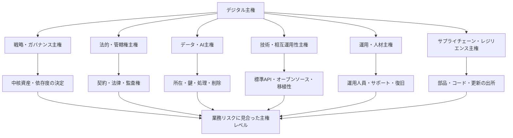
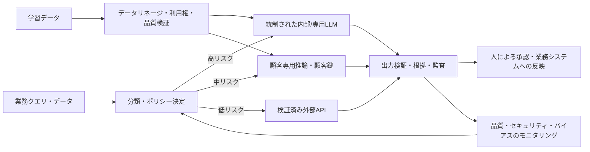

# デジタル主権(Digital Sovereignty)とクラウド・AI主権

## 1. 概要

### A. 定義

> **デジタル主権(Digital Sovereignty)**とは、組織または国家がデジタル技術・データ・インフラ・運用を自ら決定・統制し、外部事業者・管轄権・サプライチェーンへの戦略的依存を管理できる能力である。

デジタル主権は、データを特定の国に保存するデータレジデンシー(data residency)よりも広い概念である。データがどこに保存されるかは出発点にすぎず、誰が暗号鍵を統制するのか、障害時に誰がサービスを復旧できるのか、ソフトウェアを監査・修正・移植できるのか、外国の法律やサプライチェーンの途絶がサービスにどのような影響を及ぼすのかまでを含む。すなわち主権の核心は、所在ではなく意思決定権と持続可能な統制力である。

欧州委員会は技術主権を、中核技術・データ・インフラを開発・統制しつつ、非EU事業者への依存を減らす能力として説明している([European Commission, Strengthening Europe’s Tech Sovereignty](https://digital-strategy.ec.europa.eu/en/policies/eu-tech-sovereignty))。この定義で重要なのは「外部との断絶」ではなく「依存を管理できる自律性」である。オープン標準と国際協力を維持しつつも、特定の事業者一社が停止すれば国家機能や企業の中核業務が止まってしまう状態は避けなければならない。

技術士答案では、デジタル主権を保護主義や国産化と同一視しないことが重要である。すべての部品とソフトウェアを国内で自ら作ることは、現実的な目標ではない場合がある。代わりに、リスクの大きい資産を識別し、法的管轄権・データ・鍵・運用人員・ソフトウェアサプライチェーン・移植性に対する統制レベルを測定して、業務リスクに見合った主権レベルを選択するガバナンスの問題としてアプローチすべきである。

### B. 登場背景と必要性

第一に、クラウドとSaaSの集中度が高まり、単一事業者への依存が運用リスクとなった。便利なマネージドサービスを使えば市場投入の速度と弾力性は向上するが、価格・約款・APIの変更、リージョン障害、アカウント停止といった事象が企業の選択肢を制限しうる。マルチクラウドを導入しても、同一の外部マネージドサービスや同一のサプライチェーンに依存していれば、形式的な分散にとどまりかねない。

第二に、データとAIが意思決定の基盤となり、データの管轄権とモデルの運用権が重要になった。データは保存時(at rest)、転送時(in transit)、使用時(in use)のいずれにおいても保護されなければならず、AIサービスは学習データの利用範囲・推論の場所・ログ保存・モデル更新・出力検証を統制できなければならない。モデルを外部APIとして呼び出す場合には、入力データが再学習に使われるのか、再委託先(サブプロセッサー)は誰か、削除要求をどのように証明するのかが主権の一部となる。

第三に、半導体・アクセラレータ・OS・オープンソースパッケージ・リモート更新が連結したサプライチェーンリスクが大きくなった。サプライチェーン主権とは、すべての部品の原産地を国内にするという意味ではなく、中核コンポーネントの出所と依存関係を把握し、代替・監査・パッチ・復旧の能力を確保するという意味で理解すべきである。デジタルサービスの停止は、データセンター一か所の故障よりも、証明書・パッケージリポジトリ・DNS・時刻同期のように目に見えにくい共通依存性から始まることがある。

### C. 目的と適用範囲

デジタル主権の目的は、次の四つに整理される。

1. 中核サービスの意思決定権と継続運用能力を確保する。
2. データ・AIに対する法的、技術的、運用的な統制力を高める。
3. 単一供給者・単一管轄権・単一サプライチェーンによる集中リスクを減らす。
4. オープンなエコシステムと相互運用性によって移行可能性を維持する。

適用範囲は、公共行政、金融・医療・エネルギーのような重要サービス、製造・防衛のサプライチェーン、企業の中核業務SaaS、生成AIプラットフォームなどである。一般的な業務コラボレーションツールと国家の重要インフラとでは要求水準が異なるため、一律に「最高水準の主権」を求めればコストとイノベーションの速度を失いかねない。

したがって第一段階は、資産を業務影響度とデータの機微度で分類することである。生命・安全・国家機能に直結するシステムには高い統制と復旧能力が必要であるが、公開情報の分析システムであれば、オープンなグローバルサービスを選択してもリスクは低い場合がある。主権は製品の属性ではなく、業務の文脈とリスク許容度によって決まる設計目標である。

## 2. デジタル主権の階層と参照アーキテクチャ

### A. 主権の階層

デジタル主権は一つの指標ではなく、複数階層の統制力を合成した結果である。戦略階層では中核技術と事業者の所有・支配構造、法的階層では契約と外国法の影響、データ階層では保存・処理・鍵の統制、技術階層では標準と移植性、運用階層では人と手順を評価する。

以下の構造において、上位の戦略が下位の技術を代替するわけではない。法的にEUまたは国内の管轄下にある事業者であっても、独自APIと外部サプライチェーンに過度に依存していれば、技術・運用主権は低くなりうる。逆にグローバル事業者の標準サービスを使っていても、顧客管理鍵、独立監査、明確な終了・移行手順を確保すれば、特定のリスクを下げることができる。

### B. 階層ごとの意味

**戦略・ガバナンス主権**は、誰がデジタル資産の方向性と予算を決定するかという問題である。取締役会・機関長・CIO・CISOが、中核サービスの一覧、許容可能な外部依存、供給者集中の上限、移行投資の予算を承認しなければならない。戦略主権がなければ、技術チームが個々の製品をうまく運用しても、組織全体の依存構造を改善することは難しい。

**法的・管轄権主権**は、データとシステムに適用される法律、契約、政府アクセス要求、紛争解決地を扱う。契約書には、データ処理者と再委託先、政府要請の通知、監査権、削除証明、セキュリティインシデント通知、サービス停止と終了の条件を明記しなければならない。保存場所だけを国内に指定しても、運用者・バックアップ・リモートサポート・ログが別の管轄にあれば、実質的な統制は弱くなりうる。

**データ・AI主権**は、データの収集から廃棄までのライフサイクルと、モデルの学習・推論・評価・更新を統制する能力である。顧客が暗号鍵を直接保有するか、外部の鍵管理システムを通じて破棄できなければならず、AIへの入力が供給者の学習に使われないことを確認しなければならない。AIの結果の根拠・ログ・バージョン・承認記録を保存すれば、事後の説明と監査が可能になる。

**技術・相互運用性主権**は、特定の技術スタックに閉じ込められず、別の環境へ機能を移したり、独立して監査したりできる能力である。オープン標準、文書化されたAPI、ポータブルなデータ形式、コンテナイメージの再現可能なビルド、独立したバックアップからの復元が中核的な手段である。「オープンソースの使用」だけでは十分ではなく、実際に修正・ビルド・デプロイできる人材とライセンス上の権利が伴っていなければならない。

**運用・人材主権**は、障害やセキュリティインシデントの際に、外部供給者の許可を待たずにサービスを運用・復旧できる能力である。運用マニュアル、構成のバックアップ、鍵の復旧手順、独立したモニタリング、訓練された内部人材、代替サポート契約を備えなければならない。運用主権の低いシステムは、平常時には安く見えても、緊急時には復旧時間が長くなり交渉力が弱まる。

**サプライチェーン・レジリエンス主権**は、ハードウェア、ファームウェア、ソフトウェアパッケージ、クラウドの下位サービス、更新経路に至るまでの依存関係を追跡する能力である。SBOMと供給者リストを管理し、署名された更新と再現可能なビルドを使用し、重要コンポーネントの製造中止・輸出規制・脆弱性発生時の代替経路をテストしなければならない。

## 3. クラウド・データ・AI主権の設計原理

### A. クラウド主権

クラウド主権とは、クラウドサービスのデータ・技術・運用・法律・サプライチェーンに対して、顧客または公的機関が求められる水準の独立性と統制力を確保することである。サーバーが特定国のデータセンターにあるという事実だけでは、クラウド主権の十分条件にはならない。リモート管理アカウント、サポート要員、暗号鍵、下位サービス、ログとバックアップの所在まで確認しなければならない。

欧州委員会の2025年の`Cloud Sovereignty Framework`は、クラウド調達における八つの主権目標を提示している。戦略、法的・管轄権、データ・AI、運用、サプライチェーン、技術、セキュリティ・コンプライアンス、環境持続可能性の各主権を併せて評価し、セキュリティ認証だけで主権を代替しない([European Commission, Cloud Sovereignty Framework](https://commission.europa.eu/document/download/09579818-64a6-4dd5-9577-446ab6219113_en))。

このフレームワークは、各目標の最低保証レベルであるSEAL(Sovereignty Effectiveness Assurance Level)と、サービス間比較のためのSovereignty Scoreを区別している。調達機関はリスクに見合った最低レベルを要求し、スコアは複数候補を順位付けする補助基準として用いることができる。したがって、すべての業務に最高等級を強制するよりも、業務分類とリスク評価が先である。

クラウドの選定時には、データセンターの所在、運用主体、再委託先、外国法への露出、顧客保有鍵、監査ログ、APIの移植性、データエクスポートのコスト、終了時のサポート、独立運用の可能性を確認する。契約に「データは国内に保存する」という一文だけを入れる方式では、処理・バックアップ・サポート・法的アクセス経路が抜け落ちるため、証拠に基づく評価が必要である。

### B. データ主権

データ主権とは、データが適用法令と組織の統制ポリシーに従って収集・保存・利用・共有・削除される状態である。データレジデンシーは物理的な保存場所を意味し、データローカライゼーションは特定地域内での保存・処理を法で要求する政策を意味し、データ主権は所在だけでなくアクセス権・鍵・利用目的・監査・削除までを含む。

データ分類表には機微度だけを記載するのではなく、業務影響度、保存期間、国外移転の可否、許容可能な運用者、再識別リスクを併せて記録する。その結果、公開データはグローバルSaaSに、内部データは契約・暗号化を強化した環境に、規制対象・国家中核データは独立運用が可能な環境に配置するといった形で、統制レベルを差別化できる。

暗号化は主権を補助するが、自動的に保証するものではない。供給者が鍵をすべて管理していれば、保存場所が国内であってもアクセス権を供給者に委ねたのと同じになりうる。顧客管理鍵、外部鍵管理、鍵アクセスの承認、鍵使用ログ、鍵破棄後の復旧不能の証明を連携させてこそ、「統制可能なデータ」に近づく。

データの移動と削除も主権の核心である。バックアップ・キャッシュ・検索インデックス・モデル学習データ・災害復旧用レプリカまでが削除範囲に含まれるかを確認し、標準形式で全データをエクスポートするテストを定期的に実施しなければならない。削除が論理削除か物理削除か、再委託先まで伝播するか、証拠をどのように保管するかまで定義しなければならない。

### C. AI主権

AI主権とは、データ・モデル・コンピューティング・推論・運用上の意思決定に対する自律的な統制能力である。外部LLM APIを利用する場合でも、モデルを直接所有することだけが答えではなく、入力データの処理範囲、モデルバージョンの固定、出力ログ、安全フィルター、評価データ、障害時の代替モデルを統制しているかが重要である。

AIパイプラインでは、学習データと業務推論データを分離しなければならない。業務上の機密入力が供給者の汎用モデル改善に使われないよう契約・技術設定・監査で確認し、プロンプトと出力に含まれる個人情報・営業秘密をマスキングする。モデル提供者が変われば性能・バイアス・セキュリティ特性が変わりうるため、変更前後の評価を自動化する。

主権型AIを構築する際には、データとモデルを無条件に内部に置くのではなく、リスク別に配置する。最高機微の業務は内部または統制された専用推論環境、中リスクの業務は顧客専用インスタンスと顧客鍵、低リスクの業務は検証済みの外部APIを選択できる。その際、データ持ち出し禁止とモデル品質との間のトレードオフを定量的に記録しなければならない。

## 4. 主権レベルの評価と導入手順

### A. 評価指標の設計

主権を評価する際は、抽象的な「国産かどうか」の代わりに、証拠で確認可能な指標を作る。例えばデータ・AI領域には保存・処理の所在、顧客鍵の統制、学習利用の禁止、モデル・データの削除証明を、運用領域には内部人材の比率、復旧訓練の成功率、供給者のサポートなしで可能な作業の比率を入れることができる。

指標は二値型の質問と成熟度型の質問を組み合わせる。「顧客鍵があるか」のようにはい/いいえで判定する項目もあるが、鍵を誰が生成・承認・ローテーション・破棄するのか、監査の独立性はどうかといった点はレベル別に評価しなければならない。供給者の自己申告だけでスコアを与えず、契約書、設定画面、監査報告書、復旧訓練の結果、実際のデータエクスポート結果を証拠として求める。

業務ごとのスコアは加重和で算出できる。例えば法的・管轄権20%、データ・AI 20%、運用20%、技術・移植性15%、サプライチェーン15%、セキュリティ・コンプライアンス10%から始め、金融取引や国家の中核業務ではセキュリティ・法的統制により高い重みを与えることができる。スコアは絶対的な認証ではなく、選択と改善のための意思決定ツールである。

### B. 導入手順

第1段階は、中核サービスと依存関係のリストを作成することである。サービスカタログに、アプリケーション、データセット、モデル、クラウドリージョン、API、再委託先、証明書、鍵、パッケージリポジトリ、運用担当者を結び付ける。このリストがあってこそ、特定の事業者や国の障害がどこへ波及するかを見ることができる。

第2段階は、影響度分析と主権目標の設定である。機密性・完全性・可用性だけでなく、法的アクセス、供給途絶、移行時間、復旧可能性を評価する。その結果に応じて、業務ごとに必須の主権レベル、許容可能な外部依存、緊急切替時間を定義する。

第3段階は、調達と設計の結合である。供給者評価表に契約・管轄権・鍵・運用・移植性・サプライチェーンの項目を入れ、アーキテクチャにはマルチリージョンバックアップ、標準API、独立したログ、代替認証、出口(exit)設計を反映する。調達段階で抜け落ちた統制は、運用段階でコストが大幅に増加する。

第4段階は、検証と継続的改善である。四半期ごとに、データエクスポート、鍵のローテーション・破棄、供給者障害、代替リージョンへの切替、モデル交換、インシデント通知手順をテストする。供給者が「可能である」と説明した機能を実際の復旧訓練で検証しなければ、主権スコアは文書上の約束にとどまる。

### C. 主権アーキテクチャの運用統制

アクセスは最小権限と継続的な検証によって統制する。運用者アカウントには個人識別、多要素認証、時間制限、承認ワークフロー、セッション記録を適用し、緊急用アカウントには事後レビューと自動失効を設ける。供給者のサポートアカウントも例外ではなく、同じポリシーと監査範囲に含める。

可観測性は特定のクラウドコンソールだけに依存しない。アプリケーションログ、セキュリティイベント、データアクセス、鍵使用、モデル呼び出し、管理作業を独立したストアへ転送し、標準形式と保存ポリシーを定義する。そうしてこそ、アカウントがロックされたりサービスが停止したりした状況でも、インシデント分析と規制報告を継続できる。

変更管理は、モデル・API・リージョン・下位供給者の変更を含む。クラウド事業者が既定リージョンや約款を変更したり、AI事業者がモデルを自動で入れ替えたりすれば、性能と法的リスクが変わりうる。変更通知期間、影響評価、承認、ロールバック、代替経路を、契約と運用手順に結び付けなければならない。

## 5. 比較とトレードオフ

### A. 中核概念の比較

データレジデンシーは、データが物理的に保存される場所に焦点を当てる。データ主権は所在とともにアクセス権・処理・鍵・法的統制を問い、デジタル主権はデータ以外にも技術・インフラ・運用・サプライチェーン・人材の自律性を含む。したがって、レジデンシーを満たしたからといって主権が完成するわけではない。

デジタル主権とデジタル自立も区別しなければならない。自立は外部の助けなしにすべてを自前で生産しようとする方向に近いが、主権は開放性と相互依存を認めつつ、中核的な意思決定とリスク統制の能力を確保する方向である。自立を過度に追求すれば重複投資と技術的孤立が生じ、主権をあまりに狭く定義すれば依存リスクを見落としかねない。

クラウド主権はクラウドサービスと供給者関係に焦点を当てた下位概念であり、主権型クラウドは特定の製品名ではない。契約・技術・運用の統制が整っていなければならず、同じ製品でも顧客の鍵・リージョン・サポートモデル・移植性の設定によって主権レベルは変わりうる。

| 区分 | 中核的な問い | 主要な統制 | 限界または誤解 |
|---|---|---|---|
| データレジデンシー | データはどこに保存されるか? | リージョン・バックアップの所在 | 処理・アクセス・鍵を説明できない |
| データローカライゼーション | 法はどの地域内での保存・処理を求めるか? | 法律・政策・リージョン制限 | グローバル協力・運用効率と衝突しうる |
| クラウド主権 | クラウドを独立して統制・運用できるか? | 契約・鍵・移植性・運用・管轄権 | 業務別のリスク評価がなければ過剰統制 |
| デジタル主権 | 中核的なデジタル意思決定とエコシステムを統制できるか? | 戦略・データ・技術・サプライチェーン・人材 | 単一スコアに縮約すると文脈が失われる |
| デジタル自立 | 外部の助けなしに作り、運用できるか? | 自前の技術・人材・インフラ | コスト増加と技術的孤立のリスク |

### B. 開放性と主権のバランス

閉鎖的なシステムは統制感を与えうるが、自社しか知らない技術や独占的な部品に依存すれば、内部人材の不足と製造中止のリスクが大きくなる。オープン標準とオープンソースは複数の事業者を選択可能にするが、保守主体が不明確であったり、中核メンテナーが外部組織に集中していたりすると、別種のサプライチェーンリスクが生じる。

したがって開放性は、ライセンス名だけで評価しない。ソースとビルドプロセスにアクセスできるか、脆弱性パッチを独立して適用できるか、データ形式とAPIが公開されているか、運用人材を確保できるかを確認する。オープンソースの活用と主権統制を併せて推進するには、SBOM、再現可能なビルド、内部フォークのポリシー、コミュニティのセキュリティ対応体制が必要である。

コストと統制力もトレードオフである。顧客管理鍵、専用リージョン、独立したログ、二重供給者、予備人員はコストを押し上げるが、インシデントの影響と移行コストを下げる。技術士答案では「主権は高いほどよい」と結論づけるのではなく、障害損失・規制上の罰金・移行コストの期待値と統制への投資額を比較し、リスクベースで最適化すべきである。

## 6. 適用事例

### A. 公共行政における機微データのクラウド移行

公的機関が福祉・税務・保健データをクラウドへ移行すると仮定する。データの保存リージョンを国内に定めるだけの方式では不十分である。運用者と再委託先、リモートサポートアカウント、バックアップ・災害復旧、顧客鍵、ログ・分析サービスに至るまで、データフローとアクセス経路を併せて確認しなければならない。

業務を影響度に応じて三等級に分ける。国民の生命・権利に直結する中核業務には統制された環境と独立した復旧能力を求め、内部の行政業務には検証済みの公共クラウドと強力な契約統制を適用し、公開情報業務には汎用クラウドを使いつつ個人情報を持ち込まない、といった形である。こうすれば、すべての業務を最高レベルに固定せずに、中核データの主権を強化できる。

移行の検証では、データの持ち出し・復元、鍵の破棄、運用者セッションの監査、障害時の手作業業務、代替事業者での復旧を実際に実行する。テストでデータ形式が変わったり、マネージドサービスに依存した機能が見つかったりした場合は、本番移行の前に標準フォーマットと代替設計を用意しなければならない。

### B. 製造企業のAI品質検査

製造企業が外部のビジョンモデルとクラウドGPUを用いて品質検査を自動化する場合、元の映像に設計情報や作業者の個人情報が含まれうる。元データは統制された領域で前処理し、外部サービスには必要な特徴量だけを渡すか、専用の推論環境を用いる。モデルの入力・出力とバージョンはリネージとして記録し、不良判定の責任を追跡する。

供給者の交代に備えて、学習データとラベルを標準形式で管理し、モデルの評価セットと合格基準を内部に保管する。外部APIが変更されれば、同一の評価セットで精度・バイアス・レイテンシを比較し、生産ラインに反映するかを承認する。この構造は、モデルを直接所有しなくても業務上の意思決定に対する統制力を高める。

設備がオフラインになる状況も考慮する。ネットワーク断の際にはエッジデバイスで限定的な判定を行い、接続が回復したら承認済みのログのみを中央へ同期する。ただし、エッジモデルのセキュリティ更新と鍵のローテーションが遅れないよう、オフライン運用の期間と緊急更新の手順を定めておかなければならない。

## 7. 深掘り:EUフレームワークと技術士答案への連携

### A. EUクラウド主権フレームワークの示唆

欧州委員会の`Cloud Sovereignty Framework`は、主権を「データがEU内にあるか」という一行で判断せず、八つの目標に分けて調達上の証拠を収集する。特に戦略・法的管轄権・サプライチェーン・技術・運用を併せて見る点は、クラウドセキュリティ認証と主権評価が同一ではないことを示している。

フレームワークのSEALは目標ごとの最低保証レベルを設定し、Sovereignty Scoreは複数候補の相対的な特性を比較する補助スコアとして用いられる。この区別により、技術士答案で「認証を取得したので主権は十分である」という誤りを避けることができる。認証は特定のセキュリティ要件の証拠であって、顧客がいつでも別の環境へ移行できることの保証ではないからである。

また欧州委員会が2026年6月3日に発表した技術主権パッケージの説明は、クラウド・AIエコシステムの能力、インフラ、サプライチェーン、オープンソース、公共調達を併せて扱っている([European Commission, Cloud and AI Development Act](https://digital-strategy.ec.europa.eu/en/policies/cloud-and-ai-development-act))。同政策ページは、公共部門がリスク評価に応じて四つのクラウド・AI主権保証レベルを活用できると説明しており、実際の適用にあたっては法令・調達公告・監査基準の最新状況を別途確認しなければならない。

### B. 予想される出題方向と答案構成

出題は「デジタル主権の概念と確保方策」から、データレジデンシー・クラウド・AI・サプライチェーンを結び付ける形へと拡張されうる。答案は定義で終わらせず、なぜ必要か、何を評価するか、どのようなアーキテクチャとガバナンスで統制するか、コストと開放性のトレードオフは何かを順に展開する。

概念図には戦略・法律・データ・技術・運用・サプライチェーンの階層を示し、詳細図には業務分類→リスク評価→供給者選定→契約・設計→復旧訓練→継続評価のクローズドループを描く。表はレジデンシー・ローカライゼーション・クラウド主権・デジタル主権を比較する補助ツールとして用いつつ、それぞれの違いが生じる原理を文章で説明する。

事例では、公共の機微データと製造AIを用いると、データの所在だけでなく鍵・運用・モデルバージョン・移植性・サプライチェーンを併せて説明できる。結論では「国産化」や「マルチクラウド」を万能の解決策として提示せず、リスクベースの主権レベル・オープン標準・独立監査・exitテスト・人材能力を連携させる戦略で締めくくる。

## 8. 考慮事項と示唆

### A. リスクベースのレベル設定

すべてのシステムに最高水準の主権を求めれば、コストとイノベーションの速度に負担がかかる。逆にすべてのシステムを利便性だけで外部サービスに委ねれば、中核機能の交渉力と復旧能力を失う。業務影響度・データの機微度・移行可能性・法的義務を基準として、サービスごとの最低レベルを定めなければならない。

主権等級は固定されたラベルではなく、リスクの変化に応じて再評価する。新たなAIの利用、外国法の改正、供給者の買収、製造中止の告知、再委託先の変更があれば、等級と統制を再確認する。最低でも年1回に加え、重大な変更やインシデントの後にも再評価しなければならない。

### B. 管轄権と契約の実効性

契約書にデータの所在とセキュリティ義務を書くだけでは不十分である。政府要請の通知、リモートサポートの承認、再委託先の変更、監査資料、削除証明、サービスの停止・終了・移行支援、紛争の管轄を、実際に執行可能な条項にしなければならない。法務・セキュリティ・調達・運用が共同で供給者評価を行ってこそ、技術的要件と契約が食い違わない。

外国法への露出は、供給者の登録国だけで判断しない。親会社・支配構造・再委託先・リモート運用者・管理コンソールへの法的アクセスの可能性を検討しなければならない。法的リスクを技術的な暗号化と契約上の通知義務によってどのように低減するか、残存リスクをどの機関が受容するかを記録しなければならない。

### C. 移植性とexit戦略

移植性は「データをダウンロードできる」という言葉よりも広い。データ・メタデータ・権限・暗号鍵・監査ログ・モデル・ワークフロー・設定値を併せて移し、代替環境で同一の業務水準を再現できなければならない。マネージドデータベースの固有機能や独自APIが多いほど、移行のコストと時間は増加する。

Exitテストは、契約締結後に一度だけ行う文書レビューではない。代表的な業務を選定して定められた時間内に代替環境へ復元し、データの完全性・性能・権限・監査・規制報告を確認する。テスト結果は、次の調達とアーキテクチャ改善に反映しなければならない。

### D. サプライチェーンとオープンソースの管理

SBOM、供給者・下位供給者のリスト、ファームウェア・パッケージの出所、署名検証、脆弱性対応時間を管理する。特定のオープンソースプロジェクトが停止したり脆弱性が発見されたりした場合に、内部フォーク・代替実装・パッチ能力があるかを確認する。サプライチェーン主権とは、原産地一つを見ることではなく、途絶時に代替できる時間と能力を見ることである。

オープンソースは主権を高めうる手段であるが、自動的な保証ではない。ライセンス上の義務、メンテナーの集中、ビルドサーバーの信頼性、パッケージリポジトリへの依存、サポート人材の不足を併せて評価する。公共・金融の中核システムでは、オープンソース導入ポリシーとセキュリティパッチのSLAを運用基準として明文化しなければならない。

### E. AIの説明責任と人による統制

AI主権は、モデルを内部に設置すれば終わるものではない。学習データの権利、個人情報の最小化、モデルの説明・検証、バイアス評価、禁止された自動決定、人による承認、インシデント時のロールバックを、ライフサイクル全体で管理しなければならない。外部モデルを使う場合でも、業務上の最終決定の責任主体と異議申立ての経路は組織内に残しておかなければならない。

モデル更新や外部APIの障害に備えて、固定バージョン、代替モデル、ルールベースのfallback、手作業業務を準備する。精度が高いという理由で検証されていない出力をそのまま生産・行政システムに反映すれば、それは主権ではなく外部の判断への従属となる。

### F. 成果測定と継続的改善

主権の成果は、供給者数や国内リージョン比率だけで評価しない。中核指標として、データエクスポートの成功率、代替環境への切替時間、鍵の独立性、監査ログの完全性、供給者障害時の復旧時間、重大な単一依存性の数、内部の運用能力、モデル変更の検証率を管理する。

指標が改善しても、業務成果と衝突することがある。切替時間を短くするために機能を単純化すればユーザー価値が下がりうるし、強い隔離によってレイテンシ・コストが増加しうる。技術士の観点からは、主権・セキュリティ・可用性・性能・コスト・イノベーションを併せて検討し、利害関係者に選択の根拠と残存リスクを透明に提示しなければならない。

## 参考資料

1. European Commission, “Strengthening Europe’s Tech Sovereignty” — https://digital-strategy.ec.europa.eu/en/policies/eu-tech-sovereignty
2. European Commission, “Cloud Sovereignty Framework”, version 1.2.1, October 2025 — https://commission.europa.eu/document/download/09579818-64a6-4dd5-9577-446ab6219113_en
3. European Commission, “Cloud and AI Development Act” — https://digital-strategy.ec.europa.eu/en/policies/cloud-and-ai-development-act
4. European Commission, “First policy brief on digital sovereignty” — https://interoperable-europe.ec.europa.eu/collection/sovereignty/news/first-policy-brief-digital-sovereignty

---

> **一言まとめ**: デジタル主権は、データを国内に置くことで終わるのではなく、法的管轄権・鍵・AI・技術・運用・サプライチェーンを業務リスクに応じて統制し、必要なときに独立して移行できる能力である。
