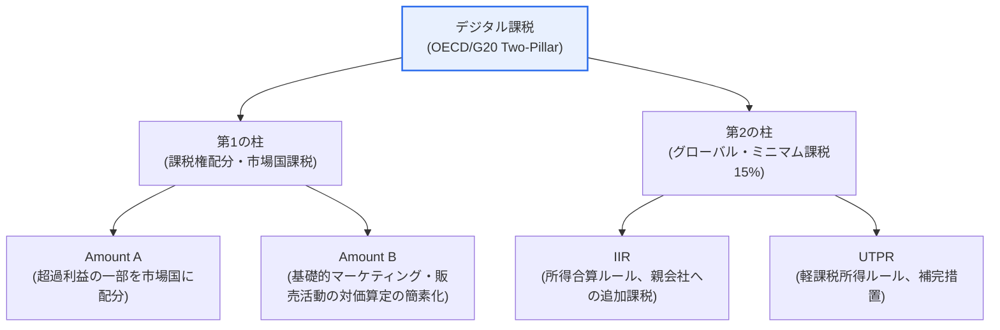
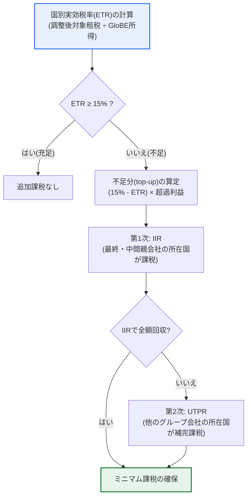

# デジタル課税(Digital Tax)

## 1. 概要

### A. 定義
> **デジタル課税(デジタル税)**とは、物理的な事業拠点(恒久的施設)を持たずに複数国の利用者を対象としてデジタルサービスで収益を上げる**グローバル大企業(特にビッグテック)に対し、利用者・市場が所在する国でも課税権を行使できるよう再設計した国際課税体系**である。OECD/G20の包摂的枠組み(Inclusive Framework、約140か国)が合意した二つの柱(Pillar 1・Pillar 2)を骨格とする。

デジタル課税が登場した根本的な理由は、「**デジタル経済が20世紀初頭に確立された国際課税原則を無力化した**」ことにある。伝統的な国際課税は、「恒久的施設(Permanent Establishment)のある国がその利益に課税する」という原則の上に成り立っている。これは、工場・事務所・営業所のような物理的実体がなければ事業が成立しなかった産業経済を前提として作られたルールである。しかしGoogle・Apple・Meta・Amazonのようなビッグテックは、サーバー一台、事務所一つなくても、アプリストア・検索広告・クラウド・SNSを通じて世界中の利用者にサービスを販売し、莫大な収益を上げる。問題は、売上と利用者が実際に存在する市場国では「物理的な事業拠点がない」という理由で法人税を徴収できず、企業は知的財産権と利益を法人税率の低い国(アイルランド・ルクセンブルクなど)へ移し、実効税率を極端に引き下げるという点である。このように税源が浸食され、利益が低税率国へ移転される現象をBEPS(Base Erosion and Profit Shifting、税源浸食と利益移転)と呼ぶ。

このような構造は、課税の公平性を深刻に損なう。同じ国で事業を営む国内企業は通常の税率で税金を納めるのに、市場を支配する多国籍プラットフォームはほとんど税金を納めないという「傾いた競技場」が生まれるからである。デジタル課税は、まさにこの問題を正すために「**価値が創出され利用者が存在する市場でも課税する**」という新たな原則を打ち立てた国際協調の産物である。100年以上維持されてきた課税権配分のルールを根本的に変えるという点で、デジタル課税は単なる税目の新設ではなく、国際課税秩序のパラダイム転換と評価される。

### B. 登場背景と展開
デジタル課税の議論は、個別の国々がまず「デジタルサービス税(DST, Digital Services Tax)」を一方的に導入したことで火が付いた。フランスが2019年に自国内のデジタル売上の3%に課税するDSTを導入すると、英国・イタリア・スペインなどが後に続き、米国は自国ビッグテックを狙い撃ちにした差別的課税だとして報復関税で対抗し、貿易紛争へと発展した。こうした各国の断片的・一方的な課税が二重課税と貿易摩擦を生んだため、統一された多国間規範の必要性が高まり、OECD/G20の主導のもと、2021年10月に約140か国が二つの柱の体系に政治的に合意するに至った。すなわちデジタル課税は、「恒久的施設原則の限界」と「BEPS」という構造的問題に、「各国DSTの乱立」という現実的な圧力が加わり、国際協調へと収斂した結果である。

## 2. 主な内容 — OECDの二つの柱(Two-Pillar)体系

### A. 全体構造図
デジタル課税は、「どこで課税するか(課税権の再配分)」を扱う第1の柱と、「最低限いくら課税するか(最低実効税率の保証)」を扱う第2の柱が相互補完的に結合した構造である。第1の柱が課税権の「水平的な再配分」であるとすれば、第2の柱は税率競争の「底(floor)」を設定する「垂直的な下限」に当たる。

### B. 第1の柱(Pillar 1) — 課税権の市場国への配分
第1の柱は、売上規模が非常に大きい超大規模多国籍企業の利益の一部について、その課税権を「利益が実際に発生した市場所在国」に新たに配分するルールである。核心はAmount Aであり、連結売上と利益率が一定の基準を超える超大規模企業の「通常利益を超える部分(超過利益)」の一定割合を、売上が発生した市場国に利用者・売上規模に応じて配分して課税させる。これは、物理的な事業拠点がなくても市場国が課税権を持つという点で、100年の伝統を持つ恒久的施設原則を正面から修正する条項である。これに加えて、基礎的なマーケティング・販売活動に対する独立企業間価格の算定を簡素化するAmount Bが補完的に設計されており、移転価格紛争と行政コストの削減を図っている。

ただし第1の柱は、多数国間条約(Multilateral Convention)の形で発効して初めて実効性を持つが、米国をはじめとする主要国の批准の遅れや利害調整の難しさから、実施がかなり遅れていることに留意しなければならない。すなわち第1の柱は、合意された設計にもかかわらず、いまだ完全発効に至っていない「進行中の課題」として理解するのが正確である。

### C. 第2の柱(Pillar 2) — グローバル・ミニマム課税15%
第2の柱は、連結売上7億5千万ユーロ以上の多国籍企業が、事業を営む「すべての国」で最低15%の実効税率(ETR, Effective Tax Rate)を負担するよう強制するルール(GloBE Rules)である。特定の低税率国での実効税率が15%に満たない場合、その不足分(top-up tax)を他の国で追加的に課税する。追加課税は二つの軸で機能する。所得合算ルール(IIR, Income Inclusion Rule)は、最終親会社(または中間親会社)の所在国が不足分を優先的に徴収するようにし、それで徴収しきれない場合には軽課税所得ルール(UTPR, Undertaxed Profits Rule)が補完的に、他のグループ会社の所在国で不足分を回収する。この設計の目的は明確である。企業が利益をいくら低税率国へ移しても、結局どこかで15%まで補って課税されるため、低税率国へ利益を移転する誘因そのものを取り除くことである。

第2の柱の追加課税(top-up tax)の判定プロセスは、以下のように国別実効税率の計算から出発し、不足分をIIR・UTPRで回収する流れで機能する。このプロセスは、「低税率国で少なく納めた税金は、結局どこかで補われる」という第2の柱の抑止力を構造的に示している。

第2の柱は、第1の柱よりも実際の実施が先行している。2026年時点で60か国以上がGloBEルールを立法済みまたは施行中であり、韓国も国際租税調整に関する法律を改正し、2024会計年度開始事業年度からグローバル・ミニマム課税を施行している。これは韓国がOECD合意を先行して国内法に反映した事例であり、対象企業は国別実効税率の計算と申告義務(GloBE Information Return, GIR)を履行しなければならない。

| 区分 | 第1の柱(Pillar 1) | 第2の柱(Pillar 2) |
|---|---|---|
| **目的** | 課税権の市場国への再配分 | 最低実効税率の保証 |
| **核心ルール** | Amount A(超過利益の配分)・Amount B | IIR・UTPR(15% top-up) |
| **適用対象** | 超大規模多国籍企業(高売上・高利益率) | 連結売上7.5億ユーロ以上のMNE |
| **実施状況** | 多数国間条約の批准遅延、進行中 | 60か国余りで施行、韓国は2024年施行 |

第1の柱と第2の柱は相互補完的である。第1の柱が「どの国が徴収するか」という課税権の地図を描き直すとすれば、第2の柱は「どこまで税率を下げられるか」の下限を引き、租税競争の底を防ぐ。二つの軸が共に機能して初めて、ビッグテックの租税回避を、課税権配分と税率下限の両面から抑制することができる。

## 3. 最近の動向 — 米国の離脱とSide-by-Sideの折衷(2025〜2026)

デジタル課税は、2025年を境に重大な局面の変化を迎えた。米国の新政権は2025年初頭の大統領令によってOECDの二つの柱プロジェクトからの事実上の離脱を宣言し、米国系多国籍企業に第2の柱のIIR・UTPRを適用することに強く反対した。世界のビッグテックの相当数を米国企業が占めるだけに、米国の離脱は体系全体の実効性を脅かす要因であった。

これを受けて、2025年6月のG7の政治的合意を経て、2026年1月にOECDはいわゆる「Side-by-Side(並存)」パッケージを発表した。その核心は、米国が自国の既存のミニマム課税制度(GILTIなど)によって同様の課税を行っているとみなし、米国を親会社とする多国籍企業グループをGloBEのIIR・UTPRの適用から除外するセーフガード(Side-by-Side Safe Harbor)を設けることである。2026年1月5日時点で、この要件を満たすとOECDが公式に確認した国は米国のみである。これは、グローバル・ミニマム課税の骨格を維持しつつ最大の利害当事国である米国の離脱を取り繕うための現実的な折衷であり、制度の持続可能性を高める一方で「普遍的適用」という原則には亀裂を残した、両面的な決定と評価される。一方、対象企業の初回GloBE情報申告(GIR)は2026年6月30日までと予定されるなど、第2の柱の実際の実施・申告局面が本格化している。

## 4. 主要国の導入事例と数値

デジタル課税の展開を具体的に理解するには、各国の一方的なDSTと多国間規範の実施事例を併せて見なければならない。これらの事例は、「なぜ統一された多国間規範が必要だったのか」と「なぜ実施が難しいのか」を同時に浮き彫りにする。

第一に、フランスは2019年、世界で初めて、自国内の年間売上2,500万ユーロ以上かつグローバル売上7億5千万ユーロ以上のデジタル企業のフランス国内デジタル売上に3%を課税するDSTを導入した。この税率は「利益」ではなく「売上」に課される点が特徴であり、これはビッグテックが利益を低税率国へ移して利益ベースの課税を回避することを迂回するための設計であった。しかし米国はこれを自国企業に対する差別的課税と位置づけ、フランス製品への報復関税を予告し、貿易紛争へと発展した。英国(2020年、デジタルサービス売上の2%)、イタリア・スペイン(各3%)なども同様のDSTを導入し、断片化が深まった。

第二に、こうした各国DSTの乱立は、二重課税と通商摩擦という副作用を生んだ。同じ売上に対して市場国のDSTと本国の法人税が重複して課されうるうえ、税率・課税標準・対象が国ごとに異なるため、企業のコンプライアンス負担が急増した。この混乱が逆説的にOECD主導の多国間合意の推進力となり、多国間規範が発効すれば各国は一方的なDSTを撤回することが合意の前提となった。すなわち、第1の柱の発効が遅れるほど個別国のDSTが維持・復活する誘因が大きくなるという構造的な緊張が存在する。

第三に、韓国は国際租税調整に関する法律を改正し、2024会計年度開始事業年度から第2の柱(グローバル・ミニマム課税)を施行している。連結売上7億5千万ユーロ以上の多国籍企業は、進出先の国ごとに実効税率を計算し、15%に満たなければ不足分を追加納付しなければならず、そのためのGloBE情報申告(GIR)義務を負う。韓国の大手製造・プラットフォーム企業の多くが対象となり、国別の税務データ集計と申告体制の構築が実務上の懸案として浮上した。

| 事例 | 形態 | 税率・基準 | 含意 |
|---|---|---|---|
| **フランスDST(2019)** | 一方的な売上税 | デジタル売上の3% | 初の導入、米国との通商紛争 |
| **英国DST(2020)** | 一方的な売上税 | デジタルサービス売上の2% | 欧州への拡散、断片化の深刻化 |
| **韓国 第2の柱(2024)** | 多国間規範の実施 | 最低ETR 15% | OECD合意の先行的な国内法化 |
| **米国(2025〜)** | 離脱・折衷 | Side-by-Side例外 | 普遍的適用原則に亀裂 |

第四に、これらの事例を貫く教訓は、「国際課税は、技術変化の速度に制度が追いつけないときに軋みを生じる」ということである。フランスの一方的なDSTは規範の空白を埋めようとする試みであったが通商摩擦を生み、OECDの多国間合意はその摩擦を取り繕おうとしたが、米国の離脱によって再び亀裂が生じた。第2の柱が15%の下限によって実質的な成果を上げる一方で、第1の柱が漂流するという非対称が続くのは、課税権配分という根本的な利害調整が、ミニマム課税の設定よりもはるかに先鋭な主権・利益の衝突を伴うためである。デジタル課税の未来は、この二つの軸の間の均衡をいかに回復するかにかかっている。

## 5. 意義と展望

| 観点 | 内容 |
|---|---|
| **課税の公平性** | 物理的実体なしに利益を得るビッグテックに対し、市場国の正当な課税権を回復 |
| **BEPS対応** | 税源浸食・低税率国への利益移転の誘因を除去(15%の下限) |
| **デジタル主権** | データ・プラットフォーム経済の価値創出に対する課税基盤の確保 |
| **不確実性** | 米国の離脱・Side-by-Sideの折衷により普遍的適用原則が弱体化、第1の柱は遅延 |

総合すると、デジタル課税は課税の公平性の回復とBEPSの抑制という明確な政策目標を持つが、その実現は最大の利害当事国の参加と多国間規範の実施速度に大きく左右される。第2の柱はすでに60か国余りで施行され、実質的な下限として定着しつつある一方、第1の柱は多数国間条約の批准という政治的難関に阻まれており、米国の離脱とSide-by-Sideの折衷は「すべての多国籍企業に同一に適用する」という普遍性の原則に例外を生み出した。したがって今後の展望は、「第2の柱を中心とする部分的・段階的な定着」と「個別国DSTの残存の可能性」が並存する不完全な均衡として理解するのが現実的であり、この不確実性そのものが、企業の租税戦略と各国の政策対応における核心的な変数として作用する。

## 6. 考慮事項と示唆

情報管理技術士の観点からは、デジタル課税を「デジタル経済の成長が制度・規範の再設計を強制する」事例であり、データ・プラットフォーム・AI経済の価値配分の問題に直結するテーマとしてアプローチすべきである。

1. **国際協調の実施速度と断片化が最大の変数である。** デジタル課税は多国間合意によってのみ実効性を持つが、米国の離脱とSide-by-Sideの折衷、第1の柱の批准遅延に見られるように、各国の利害は先鋭に対立している。合意が揺らげば個別国のDSTが再び乱立し、二重課税・貿易紛争が再燃しうるため、国内法への反映と二重課税防止の調整が成否を左右する。
2. **韓国企業には両面的な影響がある。** グローバル売上の大きい国内大企業(半導体・電子・プラットフォームなど)は第2の柱の適用対象となり、国別実効税率の計算・申告(GIR)など相当な租税コンプライアンス負担を負う。同時に韓国は大規模プラットフォームの市場国として課税権拡大の利益もあるため、負担と利益を併せて天秤にかけるバランスの取れた対応が必要である。
3. **租税コンプライアンスはそのまま情報システムの課題となる。** 国別実効税率の算定、事業年度ごとの財務データ集計、GloBE情報申告は、膨大なデータを正確かつ適時に算出しなければならない作業である。ERP・税務システムにおける国別税務データの標準化、データ整合性の検証、自動計算・申告パイプラインの構築が実務対応の核心であり、これはデータガバナンス・マスターデータ管理に直結する。
4. **デジタル経済課税の制度的な出発点として拡張性が大きい。** データ・AI・プラットフォーム経済が拡大するほど、「価値がどこで創出されるのか」をめぐる課税議論は、データ税・ロボット税などへ拡張する可能性がある。デジタル課税はその最初の多国間規範であるという点で、今後のデジタル価値配分の議論における準拠として引き続き引用される見通しである。
5. **技術と政策の接点で統合的に理解しなければならない。** デジタル課税は、租税・通商・データ主権・産業競争力が絡み合う複合的な課題である。単なる税制変更として見るのではなく、プラットフォーム経済の規制・データ移転・デジタル通商と連動した国家戦略の一つの軸として俯瞰することが、技術士レベルのアプローチである。

## 参考資料
- OECD, "Global minimum tax: Understanding the Side-by-Side package" (2026.01) — https://www.oecd.org/en/events/2026/01/global-minimum-tax-understanding-the-side-by-side-package.html
- PwC, "Pillar Two Country Tracker" — https://www.pwc.com/gx/en/services/tax/pillar-two-readiness/country-tracker.html
- Skadden, "OECD Publishes Pillar Two Global Minimum Tax Safe Harbor" (2026.01) — https://www.skadden.com/insights/publications/2026/01/oecd-publishes-pillar-two
- OECD, "Base Erosion and Profit Shifting (BEPS)" 概要 — https://www.oecd.org/tax/beps/

---

> **一言まとめ**: デジタル課税は、*物理的な事業拠点なしに国境を越えて収益を上げるビッグテックに対し、市場所在国も課税* できるようにしたOECD/G20の国際課税体系であり、課税権を市場国に配分する第1の柱と15%のグローバル・ミニマム課税である第2の柱によってBEPS・課税の公平性の問題に対応するものであって、米国の離脱と2026年のSide-by-Side折衷など国際協調の実施が成否を左右する。
