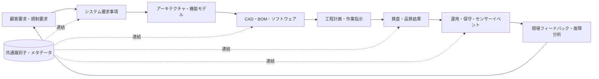
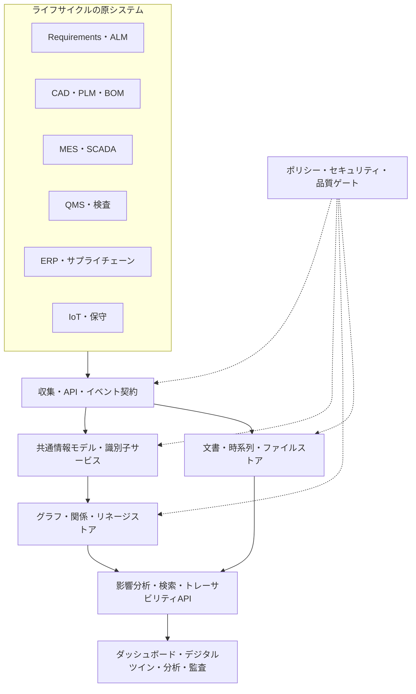

# デジタルスレッド(Digital Thread)に基づく全ライフサイクル情報連携

## 1. 概要

> **定義**: デジタルスレッド(Digital Thread)とは、製品・サービスの要求事項から設計、開発、生産、運用、保守、廃棄に至るライフサイクルで生成される異種の情報を、識別子と関係によって結び付け、追跡可能にする統合的な情報の流れである。

従来の組織は、企画、設計、製造、品質、営業、保守のシステムをそれぞれ個別に導入してきた。
各システムは部門の業務には最適化されているが、システム間の意味と連結は、文書・メール・手作業による突合に委ねられていることが多い。
その結果、設計変更がどの生産計画と検査基準に影響するのか、現場の故障がどの要求事項と設計上の決定に由来するのかを即座に説明することが難しい。
デジタルスレッドはこの断絶を、単なるファイル統合ではなく、ライフサイクル上のオブジェクト間の関係と文脈を結び付ける問題として扱う。

デジタルスレッドの核心は、すべてのデータを一つのデータベースに複製することではない。
各分野の原システムを尊重しつつ、要求事項、部品、形状、工程、検査結果、センサーイベントを、共通の識別子と標準化された意味によって参照することが出発点である。
したがって中央リポジトリを作る場合でも、原典性、変更履歴、アクセス権限、バージョン間の関係を保存しなければならない。
情報管理技術士の答案では、統合という表現にとどまらず、識別性、相互運用性、リネージ、影響分析、信頼性、セキュリティまで併せて説明しなければならない。

登場の背景には、モデルベース・エンタープライズとスマート製造の普及がある。
製品がソフトウェア、電子部品、機械部品、データサービスを組み合わせたシステムへと複雑化するにつれ、一部門の成果物だけで品質を保証することが難しくなった。
デジタルツインを運用するには、物理的な対象の状態と仮想モデルを結び付けるだけでなく、そのモデルがどのような要求事項と設計・検査上の根拠を持つのかも追跡しなければならない。
デジタルスレッドはこうした連結を通じて、デジタルツイン、モデルベースシステムズエンジニアリング、データに基づく意思決定の基盤を提供する。

目標は四つに整理できる。
第一に、特定の部品や要求事項を起点として、前後方向の影響を迅速に見つけ出す。
第二に、同一の製品定義を製造・検査・保守で再利用し、再入力と解釈の差異を減らす。
第三に、変更と承認の履歴を残し、データに対する信頼と監査可能性を高める。
第四に、現場からのフィードバックを設計と要求事項へ戻し、次の製品と工程の品質を改善する。

## 2. 概念と構成原理

### 2.1 デジタルスレッドと関連概念の区別

デジタルスレッドは、データ保存技術の製品名ではなく、情報連携の運用モデルである。
データレイクは原データを多様な形式で保存する、保存・処理中心の概念であり、デジタルスレッドはライフサイクル上のオブジェクトと関係をたどりながら意味のある問いに答える、連結中心の概念である。
デジタルツインは現実の観察対象を目的に合わせて表現し、状態を同期するデジタル表現であり、デジタルスレッドはそのツインと要求事項・設計・工程・検査データをつなぐ情報の流れである。
PLMは製品関連の情報とプロセスを管理する体系であり、デジタルスレッドはPLMを含むERP・MES・QMS・ALM・IoTなどの境界を横断する追跡の観点である。

次の表は、用語を区別するための補助資料である。
表の一マスを暗記するよりも、各概念が解決しようとしている断絶の位置を把握しなければならない。

| 区分 | 中核的な問い | 主な範囲 | デジタルスレッドとの関係 |
|---|---|---|---|
| デジタルスレッド | ライフサイクル情報はどのように連結・追跡されるか | 要求事項から廃棄まで | 全体の連結構造と運用原理 |
| デジタルツイン | 物理対象の状態をどのようなデジタル表現で同期するか | 対象・モデル・センサー・シミュレーション | スレッドの上で運用されるアプリケーション |
| PLM | 製品データと協働プロセスをどのように管理するか | 製品定義・変更・承認 | 重要な原システムであり管理体系 |
| データレイク | 多様な原データをどのように保管・処理するか | 保存・分析プラットフォーム | スレッドのデータを格納できる基盤 |
| ナレッジグラフ | オブジェクトと関係をどのような意味モデルで表現するか | エンティティ・関係・推論 | 連結と影響分析を実装する方法 |
| MBSE | モデルによってシステムの要求と設計をどのように管理するか | システムズエンジニアリング | 上位の要求・設計スレッドの中核的な原典 |

### 2.2 全体の情報フロー

デジタルスレッドは、ライフサイクルの各段階で作られる成果物を、共通の識別子と関係によって結び付ける。
要求事項IDがシステム機能、設計要素、部品、工程計画、検査特性、現場イベントにまでつながれば、変更の影響分析と原因分析が可能になる。
連結は単方向のリンク一覧ではなく、バージョン、有効期間、責任者、承認状態、出所を含む関係として管理しなければならない。

要求事項は、顧客の期待、法規、安全上の制約、性能目標を、検証可能な文に変換した結果である。
要求事項が設計と試験に結び付いていなければ、製品が要求を満たしていると主張する根拠は弱くなる。
したがって要求事項のリンクには、検証方法、承認状態、変更理由を併せて記録する。

設計階層では、システム構造、インターフェース、形状、ソフトウェアのバージョン、部品構成と製造情報が相互に結び付く。
単純なファイル名による連結は、ファイルがコピーされたり形式が変換されたりすると関係が切れうるため、モデル要素とオブジェクトに永続的な識別子を付与する方式が必要である。
同じ部品番号であっても、設計バージョンと適用製品群が異なれば有効性が異なりうるため、バージョンと構成基準を明示しなければならない。

製造と品質の階層では、設計意図が作業指示、設備設定、検査特性、不適合処理へと伝達される。
検査結果が特定の形状・工程・設備・作業条件を参照していれば、不良の原因を平均値ではなく条件別に分析できる。
逆にこの関係がなければ、品質データは独立した数値の塊となり、設計変更に対する再検証範囲を決めることが難しくなる。

運用とフィードバックの階層は、スレッドを閉じた文書体系ではなく学習ループにする。
保守履歴とセンサーイベントはどのような使用環境で問題が繰り返されるかを教えてくれ、その情報は要求事項・設計・予防保守の周期へと戻っていく。
フィードバックを原データと区別し、現場判定の信頼度と承認状態を併せて保存してこそ、誤ったイベントが設計変更を引き起こすことを防げる。

### 2.3 識別子と意味モデル

識別子はスレッドの糸口である。
製品、構成部品、要求事項、モデル要素、工程、検査特性、文書、センサーイベントに安定したグローバルまたはドメイン識別子を付与し、システムごとのキーとのマッピングを管理する。
業務システムの内部番号を無条件にグローバルキーとして使うと、システムの入れ替えや組織再編の際に関係が壊れうるため、永続識別子と表示用番号を分離する設計が有利である。

識別子が同じだからといって、意味が自動的に同じになるわけではない。
用語集とオントロジーは、部品、機能、工程、欠陥、単位、状態の意味と許容される関係を定義する。
例えば温度値の単位が摂氏か華氏か、検査特性が設計公差の上限か測定値の上限かが明確でなければ、システム間の交換で意味が変わってしまう。

メタデータには、作成者、作成時刻、原システム、バージョン、セキュリティ等級、品質状態、保存期間、適用製品構成、ライセンスを含めることができる。
メタデータは本文より付随的な説明のように見えるが、検索、影響分析、監査、再現性の基準点となる。
データを移す際に本文だけをコピーしてメタデータを失えば、連結は残っても信頼できる文脈は失われる。

### 2.4 標準と相互運用性

異なるシステムを連結する際は、ファイル変換だけでは十分ではない。
構文上の相互運用性はファイルを読めるかどうかの問題であり、意味上の相互運用性は読んだ値が同一の概念として解釈されるかどうかの問題である。
組織間の取引ではプロセスと責任の相互運用性まで必要となるため、承認、変更通知、エラー処理、再送信のルールを契約に含めなければならない。

スマート製造では、製品モデル交換のためのSTEP系、設備データ交換のためのMTConnect、品質情報交換のためのQIFといった標準を組み合わせることができる。
標準を使えばすぐに統合されるわけではなく、組織がどのプロファイルと必須フィールドを採用するのか、拡張フィールドの意味をどう管理するのかが重要である。

標準化と現実のシステムとのギャップは、マッピング層と適合性試験によって管理する。
原システムのデータを共通情報モデルへ変換し、変換前後で値と関係が保存されているかをテストデータで確認する。
一対一のポイントマッピングばかりを増やすとインターフェースが指数関数的に増加するため、共通モデルとAPI・イベント契約を中心に連結構造を単純化する。

## 3. 実装アーキテクチャと運用手順

### 3.1 論理アーキテクチャ

次の構造は、特定の製品を複製せよという参照モデルではなく、スレッドの機能を階層に分けたものである。
原システムを変えずに仮想化・連携することもできるし、規制や性能の要求が高ければ、信頼できるデータストアを別途設けることもできる。
重要なのは、照会結果が原典、変換、バージョン、権限を説明できなければならないという点である。

収集層は、バッチ、API、メッセージ、ファイル交換を目的に応じて使い分ける。
設計変更のように承認の順序が重要な業務にはトランザクションと状態遷移が必要であり、センサーイベントのように大量・低遅延のデータにはストリーミングと時系列ストアが適している。
すべてのデータをリアルタイム化するとコストと複雑性が増すため、情報の鮮度要求と分析目的に応じて周期を区別する。

共通情報モデルは、最小限の共通属性と関係を定義する契約である。
すべての原システムの詳細属性を一つの巨大なスキーマに無理に詰め込むとモデルが硬直化するため、中核となる識別・状態・バージョン・関係は共通化し、ドメイン拡張は名前空間とプロファイルで管理する。
モデルの変更は、後方互換性、変換ルール、利用者への影響、再処理計画を検討したうえで実施する。

関係ストアは、グラフデータベースやリレーショナルなリンクテーブルで実装できる。
グラフが常に正解というわけではなく、定型的な集計にはリレーショナル型・カラム型ストアのほうが適している場合がある。
技術選択は、影響分析の探索パターン、関係の深さ、書き込みと読み出しの比率、規制上の保存要件、チームの能力を基準に決定し、照会層で複数のストアを組み合わせることもできる。

### 3.2 構築手順

最初の段階は、業務上の問いと成功基準を定めることである。
「データを統合する」という目標の代わりに、「設計変更後に影響を受ける検査計画を10分以内に見つける」のように、利用者と時間を含めて定義する。
正確な問いがあってこそ、必要な関係、最新性、権限、性能基準を決定できる。

第二に、中核となるライフサイクル上のオブジェクトとシステムを一覧化する。
要求事項、システム機能、構成部品、形状、ソフトウェア、工程、検査、故障、供給者のように価値の高いオブジェクトから始め、すべてのファイルを最初の範囲に含めない。
現在の手作業による突合と重複入力をバリューストリームとして描けば、優先順位と期待効果が見えてくる。

第三に、識別子・用語・関係・状態の基準モデルを作る。
同じ名前が異なる意味を持ちうるため、データ辞書と責任者を置き、関係が成立する条件と有効期間を文書化する。
変更前後の関係を維持するには、バージョンと構成基準をモデルの必須要素として扱う。

第四に、小さなバリューストリームをパイロットとして実装する。
例えば要求事項-設計-検査の連結、または故障-部品-保守の連結のいずれかを選定し、実際の照会シナリオを最後まで通してみる。
パイロットは、インターフェースの数よりも、関係の品質、利用者の受容性、原データの欠陥を発見する場として活用する。

第五に、品質・セキュリティ・性能のゲートを運用パイプラインに組み込む。
スキーマ、識別子の一意性、必須関係、単位、時刻、重複、権限、リネージの欠落を自動点検し、例外には承認と有効期限を残す。
高リスク製品では、データの署名・ハッシュ・電子承認と検証ログを結び付け、後で結果を再現できるようにする。

第六に、変更管理と運用組織を定着させる。
情報モデル委員会、ドメインデータオーナー、プラットフォーム運用者、セキュリティ・品質責任者の役割を定義し、モデル変更要求とバージョンリリースの手順を設ける。
システムを一度連結して終わりにせず、新規の製品・協力会社・センサーが加わるたびに同じオンボーディング手順を適用する。

### 3.3 トレーサビリティ・影響分析・変更伝播

トレーサビリティは、上流と下流の二方向で提供しなければならない。
上流への追跡は、現場の欠陥がどの工程、設計、要求事項に関連するかを確認することであり、下流への追跡は、要求事項や設計の変更がどの検査・保守・顧客構成に影響するかを見つけることである。
関係が単方向にしか記録されていなければ、影響範囲の分析と原因分析のいずれかを見落とすため、双方向の探索が可能でなければならない。

影響分析は、直接リンクの羅列を超えて、関係の種類と条件を解釈する。
例えば「使用」関係と「検証」関係、「代替」関係とでは、変更伝播の優先順位が異なる。
グラフパターン、ルールエンジン、構成管理情報によって必須の検証経路が途切れている箇所を見つけなければならず、探索結果にはなぜ含まれたのかという説明を付ける。

変更伝播は、すべてを自動で変更する機能ではない。
影響候補を生成し、ドメイン責任者が影響の有無と再検証範囲を承認する半自動方式が安全である。
承認なき自動伝播は古い構成や例外契約を侵害しうるため、自動化のレベルはリスクと変更の可逆性を基準に定める。

### 3.4 品質・セキュリティ・権限

デジタルスレッドの品質は、正確性、完全性、一貫性、最新性、一意性、トレーサビリティ、可用性に分けて測定できる。
しかし平均品質スコア一つでは中核的な関係の欠落を覆い隠しうるため、必須オブジェクト・必須リンク・高リスク製品群ごとの品質ゲートを別途設ける。
品質指標には、定義、分母、測定周期、閾値、改善担当者を明記しなければならない。

セキュリティは、中央のグラフにすべての情報が集まるという前提から出発しなければならない。
設計図面、供給者情報、顧客の運用情報、個人の保守記録は、それぞれ異なる等級と法的根拠を持ちうる。
オブジェクト・関係・属性レベルのアクセス制御、行・列のフィルタリング、マスキング、利用目的の記録、照会の監査ログを組み合わせる。

協力会社との連携では、スレッド全体を共有するのではなく、必要なビューと期間・構成・属性のみを提供するデータスペース方式が有利である。
供給者がデータを変更した場合には、誰が何をいつ変更したかを確認できなければならず、証明書・署名・ハッシュ・トラストリストを適切に用いる。
完全性の技術はデータが真であることまでは保証しないため、原データの検証と業務上の承認も必要である。

## 4. 比較と適用事例

### 4.1 ポイントツーポイント統合とデジタルスレッドの比較

ポイントツーポイント統合は、二つのシステム間の差し迫った要求を解決するには有利であるが、システム数が増えるにつれてインターフェースの数と変換ルールが急激に増える。
各インターフェースが異なる用語とバージョンを使っていれば、一か所の変更が複数箇所の障害へと波及し、関係を統合的に探索することが難しくなる。
デジタルスレッドは、共通モデル・識別子・イベント契約を中心に据え、連結の意味と責任を標準化する。

| 区分 | ポイントツーポイント・インターフェース | デジタルスレッド方式 |
|---|---|---|
| 立ち上げ速度 | 単一の要求には速い | モデル・ガバナンスの準備が必要 |
| 拡張性 | システムの増加に伴い複雑性が増大 | 共通モデルと再利用可能な関係で緩和 |
| 意味の管理 | インターフェースごとのマッピングに分散 | 用語・関係・プロファイルを一元管理 |
| 影響分析 | 複数のログと文書を手作業で照会 | 関係の探索とルールで範囲を算出 |
| 変更への対応 | 連鎖的な修正の可能性が大きい | バージョン・リネージ・互換性の手順で統制 |
| 適した状況 | 単純・一回限り・低結合 | 長期製品・規制対象・複数組織のエコシステム |

ポイントツーポイントが悪いという意味ではない。
初期段階では、認証・精算・設備状態のように限定されたフローをポイントツーポイントで迅速に検証できる。
ただし製品ライフサイクルとパートナーの増加が見込まれるなら、ポイントツーポイントの連結を共通契約と仲介層へ移行する計画を併せて用意しなければならない。

### 4.2 製造品質の事例

架空の航空部品製造企業が、設計変更後の検査再実施の範囲を決められないと仮定する。
従来は、CADファイル、作業標準書、検査結果、供給者の成績書を部門ごとのフォルダから探し出し、担当者が手作業で突き合わせていた。
文書名は似ていても部品のバージョンと工程の有効期間が異なっており、変更後に抜け落ちた検査によって出荷遅延と手直しが発生した。

まず、部品・形状・公差・工程・検査特性に永続識別子を付与し、設計バージョンと製造構成の関係をモデル化する。
次に、製品定義データを標準交換形式で管理し、作業指示と品質システムが同一の部品・特性IDを参照するようにする。
検査結果には、測定機器、校正状態、工程条件、作業者の役割、データのバージョンを含める。

変更が承認されると、影響分析サービスが関連する工程・検査・供給者・在庫構成を候補として提示する。
品質責任者は候補のうち実際に影響を受ける項目を承認し、必要な再検証と出荷保留を決定する。
現場で故障が発生すれば、故障イベントから部品ロット、工程条件、検査結果、設計変更までを遡って追跡し、再発防止項目を設計へのフィードバックとして登録する。

この事例の成果は、統合したシステムの数そのものではない。
変更影響分析の時間、必須リンクの欠落率、同一データの再入力回数、再検証の漏れ件数、現場問題の原因究明時間で測定しなければならない。
例えば影響分析の時間を数日から数十分に短縮できても、関係の品質が低く誤検知が多ければ承認業務が増えうるため、速度と正確性を併せて評価する。

### 4.3 デジタルツインとの結合事例

発電設備のデジタルツインは、センサー値とシミュレーション結果を表示するだけでは完成しない。
そのセンサーがどの設備・部品に設置され、どの設計変数と保守手順を参照し、異常検知モデルの学習データと警報履歴が何であるかが結び付いていなければならない。
この連結があれば、警報を単に表示するだけでなく、保守の優先順位と設計改善の根拠として活用できる。

ただし、リアルタイムのセンサーデータと長期保存される製品定義データとでは、寿命と処理特性が異なる。
低遅延の時系列ストアと変更不可の設計・承認ストアを分離し、共通識別子と時間・構成基準で結び付けるハイブリッド構造が適している。
リアルタイムの状態が過去の設計バージョンと混同されないよう、観測時刻、適用構成、時間的有効性を併せて照会しなければならない。

## 5. 深掘り:標準化・信頼性と技術士答案への連携

国の研究機関や産業標準化活動では、デジタルスレッドを設計・製造・検査・製品サポートの間の情報の流れと捉え、オープン標準と信頼できるトレーサビリティを重視している。
製品データを標準化する目的は、特定のツールに依存しないようにし、ライフサイクルの段階間で情報の再利用と検証を可能にすることにある。
しかし標準の一覧を羅列するよりも、適用範囲、必須情報、適合性試験、組織の運用責任を説明するほうが技術士答案には適している。

デジタルスレッドとデジタルツインは、互いに代替する関係ではない。
ツインが特定の物理オブジェクトの状態を表現するアプリケーションだとすれば、スレッドはその状態がどのような要求事項・設計・工程・検査・保守の文脈を持つのかを結び付ける基盤である。
ツインの信頼性を高めるには、データの時刻同期だけでなく、モデルのバージョン、検証・妥当性確認の結果、不確実性、トレーサビリティまで管理しなければならない。

最近では、グラフ技術、イベント駆動アーキテクチャ、データスペース、生成AIベースの検索がスレッドの活用を拡張している。
生成AIがライフサイクルデータを照会する際には、権限のある関係のみを検索し、回答の根拠と原典へのリンクを提示し、推論結果と事実データを区別しなければならない。
そうでなければ、連結されたデータが増えるほど、誤った関係をもっともらしく説明するリスクも大きくなる。

想定答案は次の順序が安定している。
定義と登場背景を述べ、要求事項-設計-生産-運用の概念図を示す。
次に識別子・メタデータ・標準・グラフ・API・ガバナンスを説明し、ポイントツーポイント統合と比較する。
製造品質またはデジタルツインの事例で業務効果を示したうえで、相互運用性・セキュリティ・品質・変更管理・組織の責任を考慮事項として締めくくる。

## 6. 考慮事項と示唆

### 6.1 価値ある問いと範囲をまず確定する

全社統合を目標に始めると、範囲と予算が膨らみ、早期の成果を証明することが難しくなる。
変更影響分析、規制上のトレーサビリティ、在庫構成の確認、予知保全のように、コストとリスクが明確な問いを選定する。
問いに必要な関係と最新性をまず定め、その後にデータとインターフェースの範囲を拡張する段階的アプローチが望ましい。

### 6.2 識別子とバージョンを経営資産として管理する

識別子のルールをシステム開発チームの内部問題としてのみ扱うと、システム入れ替えの際にスレッドが切れる。
全社レベルの識別子ポリシー、構成基準、バージョンの寿命、廃止・代替関係、データオーナーを定め、新規システム調達の要件に含める。
関係を作れないオブジェクトはデータ品質上の負債として登録し、改善バックログで管理する。

### 6.3 標準を選択しつつプロファイルを運用する

多くの標準を採用しても、相互運用性が保証されるわけではない。
組織が実際に使用するバージョン、必須要素、単位、コードリスト、拡張フィールド、適合性試験をプロファイルとして定義しなければならない。
標準の変更は、既存の関係と利用者への影響評価、変換テスト、並行運用期間を経て行う。

### 6.4 データ品質と信頼性を継続的に測定する

連携に成功しても、識別子の重複、必須リンクの欠落、古いモデル、単位変換の誤りがあれば、意思決定のリスクは減らない。
中核となるオブジェクトと関係の品質を、製品群・協力会社・ライフサイクル段階ごとに測定し、品質結果と責任者をダッシュボードに表示する。
データ品質改善の優先順位は、すべてのエラーをなくすことではなく、安全・規制・顧客への影響が大きい経路から下げていくことである。

### 6.5 セキュリティと協働のバランスを設計する

スレッドの価値は共有にあるが、すべてのデータを共有する必要はない。
最小権限、目的ベースのビュー、プロジェクト・製品・地域ごとの分離、持ち出し承認、協力会社との契約、照会監査によって共有範囲を統制する。
セキュリティを理由にリンクをすべて遮断すればスレッドの価値は失われるため、機微度と業務上の必要性に応じて関係の詳細レベルを調整する。

### 6.6 自動化には人による承認経路を設ける

変更影響の候補、異常検知、類似文書の連結を自動化すれば、分析の速度を高めることができる。
しかし自動推論は関係の事実性と責任を代わりに保証するものではないため、高リスクの変更には根拠、信頼度、承認者、ロールバック計画を残す。
自動化率ではなく、正しい影響範囲と再検証漏れの減少を成果指標とする。

### 6.7 組織とサプライチェーンまで含める

デジタルスレッドは、IT部門だけのプラットフォーム事業ではない。
製品・設計・製造・品質・保守・購買・セキュリティ・法務がデータの意味と責任を共に定めなければならず、協力会社も識別子と変更通知の契約に参加しなければならない。
教育と運用コミュニティを通じて、現場のデータが再び設計と標準に反映される循環を作ってこそ、持続する。

## 7. 参考資料

- NIST, Digital Thread for Smart Manufacturing: https://www.nist.gov/programs-projects/digital-thread-smart-manufacturing
- NIST, Digital Thread for Manufacturing: https://www.nist.gov/programs-projects/digital-thread-manufacturing
- NIST, Enabling the Digital Thread for Smart Manufacturing: https://www.nist.gov/ctl/smart-connected-systems-division/smart-connected-manufacturing-systems-group/enabling-digital
- NIST, System Lifecycle Handler for Digital Thread: https://tsapps.nist.gov/publication/get_pdf.cfm?pub_id=924828
- NIST, Digital Twins for Advanced Manufacturing: https://www.nist.gov/programs-projects/digital-twins-advanced-manufacturing
- NIST, Recommendations on Ensuring Traceability and Trustworthiness of Manufacturing-Related Data: https://nvlpubs.nist.gov/nistpubs/ams/NIST.AMS.300-10.pdf
- NIST, Testing the Digital Thread in Support of Model-Based Manufacturing and Inspection: https://tsapps.nist.gov/publication/get_pdf.cfm?pub_id=919497

---

> **一言まとめ**: デジタルスレッドは、共通識別子・標準化された意味・バージョン・リネージによって製品ライフサイクル情報を結び付け、変更影響分析、品質トレーサビリティ、デジタルツインの運用と現場フィードバックを可能にする情報管理基盤である。
