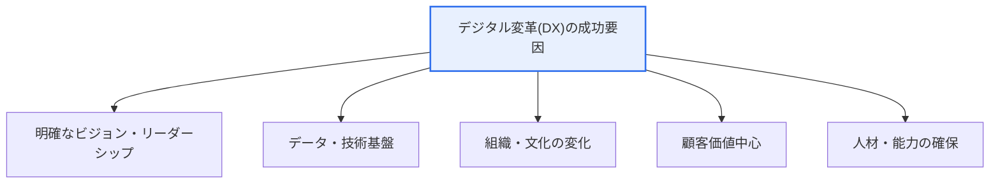
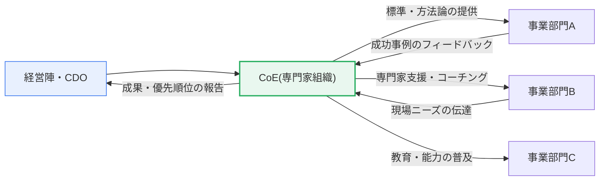

# デジタル変革のための考慮事項とCoE(Center of Excellence)

## 1. 概要

### A. 定義
> **CoE(Center of Excellence、専門家組織)** とは、デジタル変革(DX)に必要なデータ・AI・クラウドなどの中核能力を**専任の専門家集団に結集**し、全社に標準・方法論・ベストプラクティスを提供しながら各部門の変革を支援・普及させる**「変革のハブ」組織**である。デジタル変革のための考慮事項とは、このCoEを含め、DXを成功へ導く戦略・データ・組織・文化・人材の各次元の条件を指す。

デジタル変革においてCoEが必要とされる根本的な理由は、「**変革の能力が組織内に散らばっていると、普及せずに消滅する**」という点にある。DXは特定の一部門のプロジェクトではなく、組織全体の働き方・ビジネスモデル・文化を変える長期的な旅路である。ところが各部門がばらばらに試みると、同じツールを重複して導入し、同じ試行錯誤を繰り返し、苦労して得た成功体験が部門の境界を越えられないまま消えてしまう。CoEは、データサイエンティスト・AIエンジニア・クラウドアーキテクト・アジャイルコーチのような希少な専門家を一か所に集め、全社共通の方法論と標準を打ち立て、各事業部門の変革をコーチング・支援することで、この問題を解決する。すなわちCoEは、散在する能力を結集して試行錯誤と重複投資を減らし、局所的な成功を組織全体へ広げることで、DXの速度と成功率を高める求心点である。

### B. 登場背景と必要性
デジタル変革プロジェクトの相当数は期待した成果を上げられずに頓挫するが、その原因は技術そのものよりも、**戦略の不在、組織の変化への抵抗、能力不足、サイロ(部門間の断絶)**であることが多い。特にデータ・AIのような先端能力は人材が希少で学習曲線が急であるため、各部門が個別に確保することは現実的に不可能である。

こうした背景のもとで、組織は二つの相反するジレンマに直面する。能力を中央に集めれば専門性は確保できるが、事業現場から遠ざかり実用性が落ちる。各部門に分散させれば現場への密着性は高まるが、専門性・標準は弱まる。CoEは、このジレンマを「**専門性は中央に結集しつつ、現場を支援・普及する**」という方式で折衷するために登場した組織形態である。したがってCoEは単なる新技術のタスクフォースではなく、DXの旅路全体を通じて能力を蓄積・伝授し、組織のデジタル成熟度を引き上げる常設の戦略組織として理解しなければならない。

## 2. デジタル変革のための考慮事項

デジタル変革の成功は、導入した技術の華やかさではなく、ビジョン・データ・組織文化・顧客価値・人材という複数の軸のバランスに左右される。以下の全体構造図は、DXの成功を支える中核要因を示している。

### A. ビジョン・リーダーシップ
DXは組織の根本的な変化を伴うため、経営陣の強力な後押しと明確な方向性がなければ推進力を失う。リーダーシップが揺らげば、短期業績の圧力に押されて変革投資が真っ先に削減され、部門間の利害対立を調整する主体がいなくなる。したがって、CEO・CDO(最高デジタル責任者)がDXを全社の優先事項として宣言し、失敗を学習として認める心理的安全性を醸成することが出発点である。例えば製造大手がスマートファクトリー化を推進する際、経営陣が工場ごとのKPIに「データ活用度」を明示的に含めることは、リーダーシップの具体的な実践である。

### B. データ・技術基盤
DXの燃料はデータである。どれほど優れたAIモデルも信頼できるデータがなければ無用の長物であるため、データガバナンス(品質・標準・セキュリティ・メタデータ)と、それを収めるクラウド・データプラットフォーム基盤が先行しなければならない。サイロに閉じ込められたデータを統合し、全社で共通に使えるデータパイプライン・分析環境を整えることが中核課題である。データ基盤が脆弱であれば、各部門が異なる基準のデータで異なる結論を出し、意思決定への信頼が崩れる。

### C. 組織・文化の変化
DXが失敗する最も一般的な原因は、技術ではなく文化である。長年の成功パターンに慣れた組織は、新たな試みをリスクとして認識し抵抗するものである。したがって、実験と素早い失敗を奨励するアジャイルな文化、部門の境界を越えた協働、データに基づいて意思決定する習慣を組織に定着させなければならない。この変化は最も難しく時間がかかるものであり、教育・インセンティブ・リーダーの率先垂範が同時に機能しなければならない。文化の変化なしにツールだけを導入すれば、高価なシステムが放置される「デジタルの見せかけ行政」に終わる。

### D. 顧客価値中心と人材
DXは技術導入そのものが目的ではなく、顧客に新たな価値を提供することが目的である。したがって、すべての変革は「これは顧客のどのような問題を解決するのか」という問いから出発しなければならない。同時に、これらすべてを実行するデジタル人材(データ・AI・クラウド・UXの専門家)の確保と、既存人材のリスキリング(Reskilling)が成功の最後の鍵である。人材市場の競争は激しいため、外部採用だけでなく内部育成とパートナーシップを並行する戦略が必要である。

以下の表は考慮事項を整理したものである(文章による説明の補助手段)。

| 考慮事項 | 中核内容 | 失敗時の症状 |
|---|---|---|
| **ビジョン・リーダーシップ** | 経営陣主導の明確なDX目標・後押し | 短期業績に押されて投資が中断 |
| **データ・技術** | データガバナンス、クラウド・AI基盤 | 部門ごとに異なるデータで信頼が崩壊 |
| **組織・文化** | アジャイル・実験の文化、抵抗の管理 | 高価なシステムの放置(見せかけ行政) |
| **顧客中心** | 顧客の問題から出発する変革 | 技術のための技術、成果の不在 |
| **人材・能力** | 専門家の確保・既存人材のリスキリング | 実行主体の不在による漂流 |

## 3. CoEの役割と運営モデル

CoEは、前述の考慮事項を実際に機能させる実行主体である。以下の詳細図は、CoEが戦略・標準・支援・教育・ガバナンスの五つの軸で事業部門と相互作用する構造を示している。

### A. 能力の結集と標準・方法論の提供
CoEの第一の役割は、希少な専門能力を一か所に集め、全社で共有する共通フレームワークを打ち立てることである。例えばデータ分析の方法論、MLOpsパイプラインの標準、クラウドアーキテクチャの参照モデル、再利用可能なコンポーネントライブラリを整備し、各部門が毎回ゼロから始めなくて済むようにする。この標準化は品質を均質化し、部門間の協働・統合を容易にする。

### B. 現場支援・コーチングと成功事例の普及
CoEは象牙の塔ではなく、現場に入り込む支援者でなければならない。各部門の変革プロジェクトに専門家を派遣して共に問題を解き(エンベデッド支援)、成功したパイロットを他部門へ複製・展開する。この過程でCoEは知識を「伝授」し、現場が自ら変革できる自立性を育てる。例えばある営業部門で検証した需要予測モデルをCoEが標準化して他の事業部へ移植すれば、組織全体が個別の学習コストなしに成果を共有できる。

### C. 教育・文化醸成とガバナンス
CoEは全社のデジタル能力教育(データリテラシー・AI活用)と変革文化の普及を担うと同時に、DX課題の優先順位の選定・投資配分・成果管理というガバナンス機能を果たす。資源が限られた状況で何を先に行うかを決定し、重複投資を調整し、成果を測定して経営陣に報告するコントロールタワーの役割である。

### D. 運営モデルの類型
CoEの運営方式は、統制と自律の重心に応じて三つの類型に分かれる。各類型は、組織のデジタル成熟度に合わせて選択・進化させなければならない。

| 類型 | 特徴 | 適した状況 |
|---|---|---|
| **中央集権型(Centralized)** | CoEによる強い統制、標準の一元化 | DX初期、能力・標準の不在 |
| **分散型(Decentralized)** | 各部門による自律的な変革 | 成熟段階、能力の内製化 |
| **ハブ&スポーク(Hub & Spoke)** | 中央ハブ+部門ごとの接点の混合 | 拡大段階、大多数の大企業 |

一般に組織は、DX初期には中央集権型で能力と標準を迅速に打ち立て、成熟するにつれてハブ&スポークを経て分散型へと権限を移譲し、重心を統制から自律へと移していく。

## 4. 比較と適用事例

### A. CoEと一般的な組織形態の比較
CoEを臨時のTF(タスクフォース)や単なるIT部門と混同してはならない。TFは特定の課題の完了後に解散する時限組織であるため能力が蓄積されず、従来型のIT部門はシステム運用に焦点を当てるためビジネス変革を主導できない。一方CoEは、常設組織として能力を継続的に蓄積し、技術をビジネス価値へ転換することに焦点を当てるという点が決定的に異なる。この違いは実務上「継続性」として現れる — TFはプロジェクトが終われば知識が散逸するが、CoEは蓄積した方法論・事例を次のプロジェクトに再投入し、学習曲線を短縮する。

### B. 産業への適用事例
CoEは多様な産業でDXの求心点として活用されている。金融業界ではデータ・AI CoEを置き、信用評価・不正取引検知(FDS)・パーソナライズド推薦モデルを標準化して各事業部に提供している。製造業では、スマートファクトリーCoEが工場ごとに散在していた設備データ分析・予知保全(Predictive Maintenance)の能力を結集し、あるラインで検証した不良予測モデルを全工場へ展開している。公共部門でも、データに基づく行政のためにデータ分析CoEを設置し、省庁ごとの分析ニーズを支援する事例が増えている。これらの事例の共通点は、「一か所の成功を標準化して組織全体に複製する」というCoEの本質を実現している点である。

### C. 最近の動向 — 生成AI CoE
最近では、生成AI(LLM)の普及に対応して**AI CoE/生成AI CoE**を新設する組織が急速に増えている。これは、全社に散在するLLM活用の試みを標準化し、プロンプト・RAG・モデルガバナンスのガイドラインを策定し、データセキュリティ・倫理・ハルシネーション(Hallucination)のリスクを統制する役割を担う。無秩序な導入によるデータ流出・著作権・バイアスの問題を防ぐには、こうした中央の統制・支援組織が特に重要になっている。

## 5. 深掘り — 予想される出題方向と答案構成戦略

情報管理技術士試験において、このテーマは経営・事業戦略の領域で「デジタル変革成功のための考慮事項とCoEの役割」を論ぜよという形で出題される傾向がある。答案作成時の留意点は次のとおりである。

第一に、**考慮事項とCoEを有機的に結び付け**なければならない。考慮事項(ビジョン・データ・文化・顧客・人材)を列挙し、CoEを別途説明するだけにとどまらず、「CoEはこれらの考慮事項を実際に機能させる実行主体である」という論理で結び付けてこそ、統合的な理解が示される。

第二に、**CoEの運営モデルと成熟度に応じた進化**を必ず含める。中央集権型→ハブ&スポーク→分散型へと重心を移すという動的な観点、そして「統制ではなく支援の組織」という性格づけが高得点のポイントである。

第三に、**最新事例(生成AI CoE)と関連テーマ**を答案に織り込めば時宜性が生きる。データガバナンス、MLOps、アジャイル組織、変革マネジメント(ADKAR)など隣接テーマとの関連に言及すれば、技術士レベルの幅広い洞察を示すことができる。

## 6. 考慮事項と示唆(技術士の観点)

1. **CoEは統制ではなく支援の組織として設計しなければならない。** CoEが現場の上に君臨し、承認・検閲を行う関門となれば、かえって変革の速度を落とし抵抗を招く。能力を普及させ現場をコーチングする支援者(Enabler)として位置づけてこそ持続可能である。支援と最小限のガバナンス(標準・セキュリティ)の間のバランスが核心である。

2. **成熟度に応じた組織の進化が必要である。** 初期には中央集権型で能力・標準を迅速に構築し、組織の能力が成熟すればハブ&スポークを経て分散型へと権限を移譲しなければならない。成熟段階に合わない運営モデルは、ボトルネック(過度な中央統制)や混乱(時期尚早な分散)を生む。

3. **文化の変化の触媒となることがCoEの究極の目標である。** CoEの成功指標は実施したプロジェクトの数ではなく、組織全体がデータと実験に基づいて働くデジタル文化をどれだけ定着させたかである。すなわちCoEは「自らを不要にすること」(現場が自律的に変革できるようにすること)を目指すべきである。

4. **成果測定と人材定着の戦略を並行しなければならない。** CoEの貢献は、ビジネス成果(売上・コスト・顧客指標)に換算して可視化しなければ、存続の大義名分を失いやすい。同時に、CoEに集まった希少な専門家の離脱を防ぐためのキャリアパス・報酬・成長機会の設計が不可欠である。BSCのような成果管理ツールと連動させてCoEの貢献を測定するアプローチが有効である。

5. **データガバナンス・セキュリティとの連携が前提である。** CoEが扱うデータ・AIは個人情報・著作権・バイアス・セキュリティのリスクを伴うため、全社のデータガバナンス体系およびAI倫理・ガバナンスと必ず連動させなければならない。特に生成AI CoEは、モデルガバナンスとリスク統制を中核的な責務として含めなければならない。

## 参考資料
- Gartner, "Center of Excellence (CoE)" Glossary: https://www.gartner.com/en/information-technology/glossary/center-of-excellence-coe
- McKinsey, "Unlocking success in digital transformations": https://www.mckinsey.com/capabilities/people-and-organizational-performance/our-insights/unlocking-success-in-digital-transformations

---

> **一言まとめ**: デジタル変革は *ビジョン・データ・組織文化・顧客価値・人材* のバランスを考慮しなければならず、CoEは *希少な中核能力を結集して標準・方法論を提供し、各部門の変革を支援・普及する* 変革のハブとして、統制よりも支援、成熟度に応じた自律への権限移譲、デジタル文化定着の触媒としての役割を通じて、DXの速度と成功率を高める。
