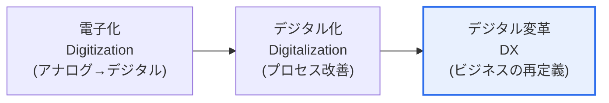

# デジタルトランスフォーメーション(Digital Transformation, DX)

## 1. 概要

### A. 定義
> デジタル技術をてことして、**ビジネスモデル・プロセス・顧客体験・組織文化を根本的に再設計**し、新たな価値を創出する総体的な変革。単なる電子化(Digitization)や部分的なデジタル化(Digitalization)を超えるものである。

DXの本質を理解するには、三つの言葉を区別しなければならない。**電子化(Digitization、デジタイゼーション)** は、紙をスキャンしてPDFに変えるように、アナログをデジタルデータに変換することであり、**デジタル化(Digitalization、デジタライゼーション)** は、そのデータによって既存の業務プロセスを改善することである。しかし **DX(Transformation)** はそこからさらに一歩進み、企業が**収益を上げる方式(ビジネスモデル)そのものを再定義**する。例えばある重機メーカーが、掘削機を販売する代わりに「稼働時間あたりの料金」を受け取るサービスモデルへ転換し、機械に取り付けたIoTセンサーで故障を予測してダウンタイムを減らすサービスを販売するなら、それが典型的なDXである。製品ではなく成果(Outcome)を売るのである。

### B. 登場背景と必要性
DXが選択ではなく生存の問題となった背景には、三つの圧力がある。第一に、**技術の成熟**である。クラウドによってインフラコストの参入障壁がなくなり、AI・ビッグデータによってデータから価値を引き出せるようになった。第二に、**顧客の期待の高まり**である。スマートフォンに慣れた消費者は、あらゆる産業で即時的・個別化された体験を求める。第三に、**デジタルネイティブ企業による市場破壊**である。Netflixがビデオレンタル店を、Uberがタクシー産業を再編したように、プラットフォーム企業は既存産業の境界を崩す。この圧力を前にして、伝統的な企業は自らを変えなければ淘汰される。

## 2. DXの進化段階

三つの段階は断絶ではなく連続線上にあるが、前の二つが「効率化(より上手にやる)」であるのに対し、DXは「**革新(違うやり方をする)**」という質的な違いがある。多くの企業が電子化・デジタル化をDXと取り違えているが、ERPを導入し業務を自動化しただけでは、古い事業のやり方を速くしたにすぎず、変革ではない。真のDXは、その過程で得たデータによって**新たな収益源と顧客関係を創出**したときに初めて完成する。

## 3. DXの構成要素

DXは特定の技術の導入ではなく、複数の軸の同時的な変化である。**ビジネスモデル**は製品販売からサービス・サブスクリプション・プラットフォームへと移行し、**プロセス**は経験と勘の代わりにデータに基づいて自動化・最適化される。**顧客体験(CX)** はチャネルが分断された形から、オンライン・オフラインを行き来するオムニチャネル・超パーソナライゼーションへと進化し、これらすべてを支える**組織・文化**は、階層的な指示構造から、アジャイルで実験を許容するデータドリブンな文化へと変わる。そしてこれらの変化の**技術的基盤**が、クラウド・AI・ビッグデータ・IoTである。

| 構成要素 | 変革の方向 | 例 |
|---|---|---|
| **ビジネスモデル** | 製品 → サービス・サブスクリプション・プラットフォーム | ソフトウェアパッケージ販売 → SaaSサブスクリプション |
| **プロセス** | 経験ベース → データに基づく自動化 | 需要予測・在庫最適化 |
| **顧客体験(CX)** | 分断されたチャネル → オムニチャネル・超パーソナライゼーション | アプリ・店舗・Webの統合ジャーニー |
| **組織・文化** | 階層・指示 → アジャイル・実験 | スクワッド組織、データに基づく意思決定 |
| **技術基盤** | オンプレミス・手作業 | クラウド・AI・ビッグデータ・IoT |

## 4. 成功要因と失敗要因

DXプロジェクトの多くは失敗するが、その原因はたいてい技術ではなく**人と戦略**にある。成功する組織は、経営陣が明確なビジョンを持って主導し(リーダーシップ)、データを信頼できる資産として管理し(データガバナンス)、失敗を学習として受け入れる文化を持つ。逆に失敗する組織は、「競合がやっているから」といった具合に目的なく技術だけを導入したり、現場の抵抗を管理できなかったり、短期的な成果に固執して変革を中断したりする。

| 区分 | 内容 |
|---|---|
| **成功要因** | 経営陣のビジョン・主導、データガバナンス、アジャイルな文化、顧客価値中心 |
| **失敗要因** | 目的なき技術導入、組織の抵抗、短期成果への固執、サイロ |

## 5. 考慮事項と示唆(技術士の観点)

1. **技術ではなく価値から出発**しなければならない。「どの技術を導入するか」ではなく「顧客にどのような新しい価値を提供するか」をまず定義し、それに見合った技術を選択する逆方向の設計が成功確率を高める。
2. **文化の変化が最も難しく、最も重要である。** 技術は買えば済むが、データに基づいて働き、失敗を容認する文化の醸成には長い時間がかかる。CDO(最高デジタル責任者)・専任組織によって変化を管理する。
3. **レガシーとの共存戦略**が必要である。中核システムを一度に入れ替えるビッグバン方式は危険であるため、マイクロサービス・APIによって段階的に移行するストラングラー(Strangler)パターンが現実的である。
4. **生成AIが新たな触媒**として浮上した。超パーソナライズドマーケティング、業務自動化、ナレッジ検索などでDXを加速しており、今後はAIネイティブなビジネスモデルが広がる見通しである。

---

> **一言まとめ**: DXは *電子化→デジタル化→デジタル変革* という進化においてビジネスモデルそのものを再定義する段階であり、ビジネス・プロセス・顧客体験・組織文化を同時に革新するものであって、成功の鍵は技術ではなく**顧客価値中心の戦略と文化の変化**にある。
