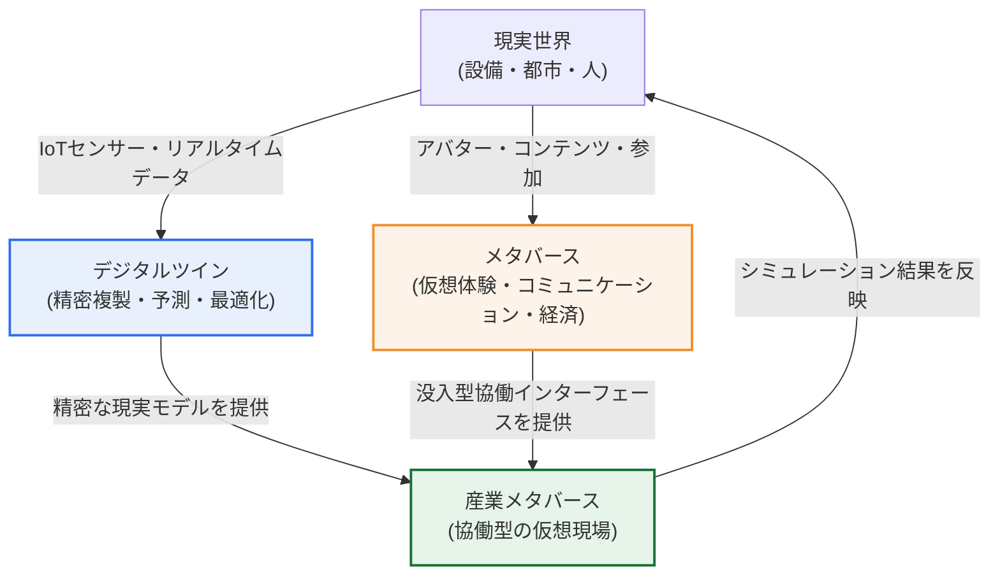
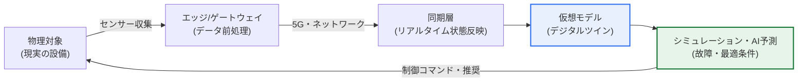

# デジタルツイン(Digital Twin)とメタバース(Metaverse)

## 1. 概要

### A. 定義
> **デジタルツイン(Digital Twin)** とは、現実の物理的な対象(設備・建物・都市・工程)を**デジタル空間に精密に複製し、IoTセンサーデータでリアルタイムに同期**させて、シミュレーション・予測・最適化を行う技術であり、**メタバース(Metaverse)** とは、現実と融合した**三次元の仮想空間で人々がアバター(Avatar)として相互作用・経済活動・協働**を行う、持続的(persistent)な仮想世界である。

二つの技術を並べて理解する鍵は、「**どちらも現実をデジタルへ移すが、目的と主体が異なる**」という点にある。デジタルツインの目的は「**現実を正確に反映して問題を予測・解決する**」ことである。産業現場の実際の温度・振動・電流といったデータで仮想モデルを絶えず同期させ、設備の故障時期を事前に予測し(予知保全)、工程の最適な運転条件を仮想空間で先に探る。すなわちデジタルツインは実用・産業中心であり、データの流れが「現実 → 仮想」へ向かう観測・分析の技術である。一方メタバースの目的は「**現実を拡張した新たな体験・コミュニケーション・経済の空間を創出する**」ことである。人がアバターの身体を借りてその中に入り込み、遊び、働き、会議をし、仮想資産を取引する。すなわちメタバースは体験・社会中心であり、人の参加と相互作用が本質となるインターフェース・プラットフォームの技術である。

しかし二つの技術は、対立するよりも**融合**したときに真価を発揮する。デジタルツインが「現実をそのまま反映した精密な仮想の舞台」を提供し、メタバースが「その舞台の中に複数の人がアバターとして共に入り、協働・体験するインターフェース」を提供すれば、いわゆる「**産業メタバース(Industrial Metaverse)**」が成立する。例えば実際の工場のデジタルツイン上で、遠隔地にいる複数のエンジニアがアバターとして集まって設備を共に点検し、工程変更を仮想空間でシミュレーションしたうえで現実に反映する、といった形である。要するに、デジタルツインはメタバースに「現実性(精度)」を、メタバースはデジタルツインに「参加性(協働・没入)」を与える相互補完の関係である。

### B. 登場背景と必要性
二つの技術が同時に台頭した背景には、共通の技術的成熟がある。IoTセンサーと5Gの超低遅延・大容量通信によって現実の状態を遅延なく大量に収集・伝送できるようになり、AIによってそのデータを分析・予測できるようになり、XR(VR/AR)と高性能GPU・クラウドレンダリングによって現実のような三次元空間をリアルタイムに描き出せるようになった。すなわち「現実を精密にデジタル化する能力」と「そのデジタルを没入的に体験する能力」が同時期に共に成熟したことで、デジタルツイン(前者)とメタバース(後者)が揃って実用段階に入ったのである。さらに新型コロナウイルス感染症以降、非対面での協働・遠隔運用の需要が急増し、物理的に離れた人々が同じ仮想現場で働く方式への必要性が産業界全体に広がった。

## 2. 概念構造と関係

### A. 全体構造図
現実世界を出発点として、デジタルツインとメタバースがどのように分かれ、再び出会うのかを構造的に見ると、二つの技術の関係が明確になる。デジタルツインは現実を「観測・複製」する方向へ、メタバースは現実を「拡張・創造」する方向へと進むが、二つの流れは産業メタバースで合流する。

この構造図で注目すべきは、矢印の方向性である。デジタルツインでは、データが主に「現実 → 仮想」へ流れて現実を映す鏡となり、最適化の結果が再び現実へフィードバックされる。メタバースでは、人が「現実 → 仮想」へ入り込み、新たな活動を生み出す。二つの流れが出会う産業メタバースは、「精密な現実の反映(デジタルツイン)」の上に「人の協働(メタバース)」を載せ、仮想空間で検証した決定を現実に反映するクローズドループ(closed loop)を完成させる。

### B. デジタルツインの動作原理 — クローズドループ・アーキテクチャ
デジタルツインは単なる3Dモデルではなく、「生きて動くモデル」である点が核心である。現実の対象に取り付けられたセンサーが状態データを継続的に送ってくると、仮想モデルがその値をリアルタイムに反映し、現実と同一の状態を維持する。

ここに物理法則に基づくシミュレーションやAI予測モデルを組み合わせれば、「現在の条件が続けば、3日後にベアリングが摩耗限界に達する」といった将来予測が可能になる。こうして予測された結果に基づいて現実の設備の運転条件を変えれば、その変化が再びセンサーで観測されてモデルに反映される、という循環が続く。この「**観測 → 同期 → 予測 → 最適化 → フィードバック**」のクローズドループ(closed loop)こそが、デジタルツインを静的な図面と区別する決定的な特徴である。

このアーキテクチャ詳細図が示すように、デジタルツインの価値は個々の構成要素ではなく、それらが形作る循環のループから生まれる。センサー・エッジが現実をデータ化し、ネットワークが遅延なく伝達し、同期層が仮想モデルを現実と一致させ、シミュレーション・AIが将来を予測して制御コマンドを現実へ戻す。このループが速く正確であるほど、ツインの成熟度は高い。

したがってデジタルツインの成熟度は、大きく三段階で理解される。第1段階は、現実を仮想空間で「**可視化・モニタリング**」する水準であり、データは現実から仮想へ流れるがフィードバックはない。第2段階は、仮想空間で「**分析・予測**」を行う水準であり、予知保全のような将来予測が加わる。第3段階は、仮想空間での最適な決定を現実に「**自動制御・フィードバック**」する水準であり、人の介入なしにクローズドループが自ら回る自律最適化に至る。大部分の産業現場はまだ第1〜2段階にとどまっており、完全自律の第3段階は、信頼性・安全性の検証という高いハードルを越えなければならない到達目標と見るのが正確である。

### C. メタバースの構成要素と特性
メタバースは四つの特性によって定義される。**持続性**(ユーザーが接続を切っても世界が存在し続ける)、**リアルタイム性**(多数のユーザーによる同時の相互作用)、**相互運用性**(資産・アイデンティティのサービス間での移動)、**経済性**(仮想財の生産・取引)である。この四つの特性がすべて揃って初めて、単なるオンラインゲームやビデオ会議ではない「持続的な仮想世界」となる。

これを実現する構成要素は三つの層に分かれる。第一は、アバター・3D空間・リアルタイムレンダリングエンジンから成る**表現層**であり、ユーザーが見て操作する仮想世界の外形を作る。第二は、VR/ARヘッドセットと触覚(ハプティクス)機器、モーションキャプチャから成る**没入インターフェース層**であり、ユーザーの感覚と動作を仮想世界に結び付ける。第三は、ブロックチェーン・NFT・暗号資産に代表される**仮想経済層**であり、仮想財に所有権と取引可能性を付与する。

特に相互運用性と経済性は、メタバースが単なる3Dゲームと区別される決定的なポイントである。ある空間で買ったアイテムを別の空間でも使い、創作物を取引して実際の価値を得られる構造が可能になってこそ、メタバースの社会的・経済的な潜在力が実現する。しかし現実にはサービスごとに閉鎖的な規格が使われ、資産がその中に閉じ込められることが多く、この相互運用性がメタバース最大の未解決課題として残っている。

## 3. 比較と中核技術

### A. 目的・焦点の違い
二つの技術の違いは単なる機能の違いではなく、「何のための技術なのか」という志向の違いに由来する。デジタルツインは正確性と予測力が生命線であるため、実データとの誤差を減らすことにすべての力を集中する。反対にメタバースは没入感とつながりが生命線であるため、必ずしも現実と一致する必要はなく、むしろ現実にはない体験(重力を無視した移動、物理的に不可能な空間)を作り出す自由が価値となる。この志向の違いが、以下の表のすべての項目を分ける根源である。

| 区分 | デジタルツイン | メタバース |
|---|---|---|
| **目的** | 現実の複製・予測・最適化 | 仮想体験・コミュニケーション・経済活動 |
| **焦点** | 実用・産業(正確性・予測力) | 体験・社会(没入・つながり) |
| **データの方向** | 現実 → 仮想(リアルタイム同期) | 仮想 ↔ 人(相互作用) |
| **現実との一致性** | 高いほどよい(誤差の最小化) | 必須ではない(創作的な拡張を許容) |
| **中核的な価値** | シミュレーション・予知保全・最適化 | 没入・つながり・仮想経済 |
| **代表的な適用** | スマートファクトリー・スマートシティ・プラント | 仮想会議・ゲーム・仮想オフィス・展示 |

### B. 中核技術スタック
二つの技術は、3Dモデリング・レンダリング、AI、クラウド、高性能GPUという基盤技術を共有している。この共通基盤があるからこそ、融合は技術的に自然である。ただし、それぞれの目的のための固有技術も存在する。デジタルツインは、IoTセンサー・エッジコンピューティング・リアルタイム同期ミドルウェアと物理ベースのシミュレーション(CAE/CFD)が固有の領域であり、メタバースは、XR(VR/AR)デバイス・アバターおよびモーションキャプチャ・ブロックチェーンベースの仮想経済が固有の領域である。

| 層 | デジタルツイン固有 | メタバース固有 | 共通基盤 |
|---|---|---|---|
| **データ・接続** | IoTセンサー、エッジ、リアルタイム同期 | アバター・モーションキャプチャ、低遅延ネットワーク | 5G、クラウド |
| **処理・知能** | 物理シミュレーション、AI予知分析 | リアルタイム多重接続サーバー | AI、GPU |
| **表現・経済** | 3D精密モデル(誤差最小) | XRレンダリング、ブロックチェーン・NFT | 3Dレンダリングエンジン |

## 4. 事例と融合 — 産業メタバース

具体的な事例を通して融合の実態を見ると、理解が明確になる。**第一に、製造分野**では、グローバルな自動車・航空機メーカーが新工場を建設する前に、仮想空間でライン全体をデジタルツインとして構築し、複数国の設計・生産エンジニアがその仮想工場にアバターとしてアクセスして、設備配置・動線・安全を共に検証したうえで実際の着工に入る方式を導入している。これにより、物理的な試作なしに設計ミスを早期に発見し、着工後の手戻りを減らす。**第二に、都市・インフラ分野**では、スマートシティのデジタルツイン上で交通・エネルギーのシナリオをシミュレーションし、政策担当者が仮想空間で結果を共に見ながら意思決定する活用が増えている。**第三に、プラント・エネルギー分野**では、危険な発電所・化学工場の内部をデジタルツインで再現し、作業者がVRで事前教育・遠隔点検を行うことで、現場に立ち入ることなく安全を確保する。

これらの事例の共通点は、「デジタルツインの精密なデータ」と「メタバースの協働インターフェース」が結合し、**現実に立ち入ることなく仮想空間で先に検証・訓練・意思決定**を行い、その結果を現実に反映するという点である。すなわち産業メタバースの本質的な価値は「楽しさ」ではなく、「現実のリスクとコストを仮想空間へ移して減らすこと」にある。

この点から、消費者向けメタバースと産業メタバースの成否が分かれた理由も説明できる。消費者向けメタバースは「なぜわざわざ仮想空間で会わなければならないのか」という明確な効用を示せず熱気が冷めたが、産業メタバースは試作コストの削減・安全事故の防止・遠隔協働の効率化という定量化可能な効用が明確であるため、投資が続いている。結局、二つの技術の融合が成功するには、「没入という目新しさ」ではなく「解決する現実の問題とその経済的価値」が先に立たなければならない、というのが最近の事例が与える教訓である。

## 5. 深掘り — 最新動向と標準化

**最新動向**の面では、初期の消費者向けメタバース(仮想ゲーム・ソーシャル)の過熱が沈静化した一方で、明確な投資収益が見込める産業メタバースとデジタルツインは、製造・建設・エネルギー・防衛を中心に実質的な導入が拡大している。さらに生成AIが結合したことで、3Dアセット・仮想環境を自動生成し、デジタルツインの予測を自然言語で説明するなど、構築コストと活用のハードルが下がる流れが見られる。また、ローカル5G(Private 5G)とエッジコンピューティングが工場現場に普及したことで、大量のセンサーデータのリアルタイム同期というデジタルツインの前提条件が、現場で満たされ始めている。

**標準化**の面では、相互運用性が中核的な課題として浮上している。異なるベンダーの3Dモデル・仮想空間・アバター・資産を行き来させるには、共通のフォーマットとプロトコルが必要だからである。これを受けて、3Dデータ交換のためのオープンフォーマット(例:glTF、USD系)や産業界の相互運用性標準化コンソーシアムが議論を進めているが、まだ単一の標準に収斂してはいない状態と理解するのが正確である。標準化が成熟してこそ、個々のサービスに閉じ込められた「島(silo)」型の仮想世界が互いにつながり、メタバースの相互運用性という本質的な価値が実現しうる。

**予想される出題方向**としては、① デジタルツインとメタバースを定義・比較し、融合(産業メタバース)の方策を論ぜよ、② デジタルツインの構成・成熟度段階と予知保全への活用を説明せよ、③ メタバースの特性(持続性・相互運用性・経済性)とセキュリティ上の脅威・対応を述べよ、などが予想される。

## 6. 考慮事項と示唆(技術士の観点)

1. **融合によってシナジーを最大化しつつ、目的を混同してはならない。** デジタルツイン(精密な反映)とメタバース(没入型協働)を結合した産業メタバースは強力であるが、「現実の正確性が必要な領域」と「体験の自由度が必要な領域」を区別して設計しなければならない。シミュレーションの精度が生命線である場面にメタバース的な創作的拡張を混ぜれば、かえって信頼性を損なう。

2. **データ・相互運用性の確保が実用化の鍵である。** 現実を正確に反映するには、大量のリアルタイムデータと標準化された3D・データフォーマット、サービス間の相互運用性が不可欠である。ベンダーごとの閉鎖的な規格に閉じ込められると拡張・連携が妨げられるため、オープン標準の採用とデータガバナンスを併せて設計しなければならない。

3. **セキュリティ・プライバシーの脅威に先手を打って対応しなければならない。** 現実をデジタル化し、人がアバターとして活動する以上、産業データの流出・デジタルツインの改ざん(現実の誤作動の誘発)、アバターのなりすまし・仮想資産の窃取・行動データの過剰収集など、新たな脅威面が生じる。アクセス制御・暗号化・完全性検証とともに、個人の没入行動データに対するプライバシー保護の原則を設計段階から反映(Privacy by Design)しなければならない。

4. **投資対効果(ROI)を明確にし、成熟度に合わせて段階的に導入しなければならない。** 消費者向けメタバースのバブルの経験が示すように、鍵は技術そのものではなく「どのような問題をいくらのコストで解決するのか」である。予知保全・設計検証のように効果が定量化できる領域からパイロットとして始め、組織・インフラの成熟度に合わせて徐々に範囲を広げるアプローチが現実的である。

5. **AI・5G・クラウドなど隣接技術との連携設計が必要である。** デジタルツインの予測精度はAIモデルの品質に、リアルタイム同期は5G・エッジ基盤に、大規模レンダリングはクラウド・GPU資源に左右される。したがってデジタルツイン・メタバースを独立したプロジェクトとして捉えるのではなく、組織のAI・クラウド・ネットワーク戦略と統合したアーキテクチャとして設計してこそ、持続可能な成果を上げられる。特に生成AIとの結合は、3Dアセットの生成と予測結果の解釈のコストを下げ、二つの技術の普及を加速する触媒となる見通しである。

## 参考資料
- 韓国知能情報社会振興院(NIA)、デジタルツイン・メタバース関連イシューレポート — https://www.nia.or.kr/
- 科学技術情報通信部、メタバース新産業先導戦略などの政策資料 — https://www.msit.go.kr/
- 韓国電子通信研究院(ETRI)、デジタルツイン・産業メタバースの技術動向資料 — https://www.etri.re.kr/

---

> **一言まとめ**: デジタルツインは *現実を精密に複製・同期して予測・最適化* する産業・実用の技術であり、メタバースは *仮想空間でアバターとして体験・コミュニケーション・取引* する体験・社会の技術であって、目的は異なるが「産業メタバース」として融合することで、現実に立ち入ることなく協働・シミュレーション・検証を行うシナジーを生み、データの相互運用性とセキュリティの確保が実用化の鍵となる。
