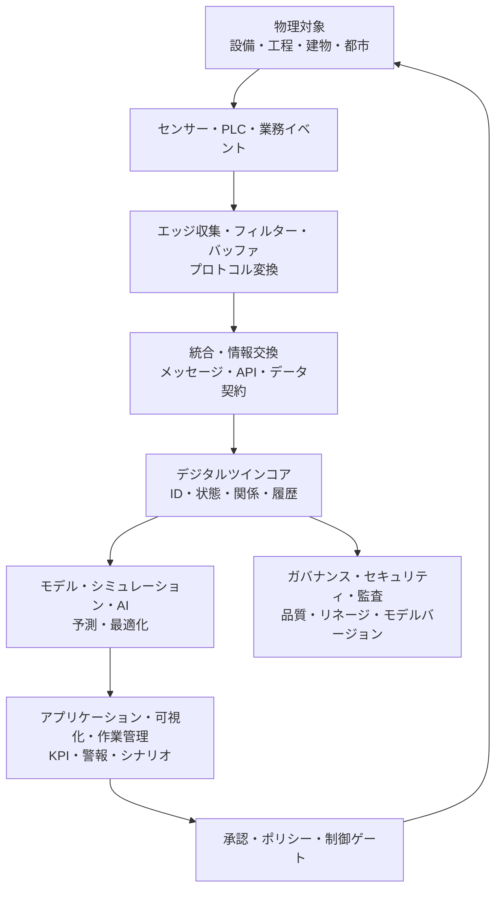
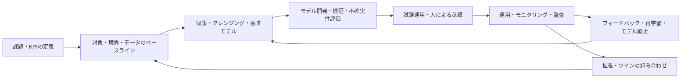

# デジタルツイン(Digital Twin)のアーキテクチャと実装戦略

## 1. 概要

> **定義**: デジタルツイン(Digital Twin)とは、現実の観察可能な対象・工程・システムを目的に応じてデジタルで表現し、センサー・業務データとモデルを通じて現実とデジタル表現を継続的に同期させ、観察・予測・シミュレーション・最適化に活用するシステムである。

デジタルツインは、単なる3Dモデルやダッシュボードとは区別される。3Dモデルは形状と空間を可視化できるが、時間に伴う状態の変化や振る舞いの意味を必ずしも表現しない。ダッシュボードは測定値を表示するが、モデルの状態を変えたり将来の条件を実験したりする機能を持たない場合がある。デジタルツインは、対象の識別子、属性、状態、履歴、関係、ルール、シミュレーションモデルを結び付け、現実で生じた変化がデジタル表現に反映され、分析結果が意思決定や制御へと再びつながるクローズドループを志向する。

登場の背景には、製造・建設・エネルギー・物流・都市運営において対象が複雑化し、運用データが爆発的に増加したことがある。かつては設計文書、運転記録、点検表が互いに分離しており、問題が発生してから原因を追跡していた。IoTセンサー、エッジコンピューティング、クラウド、時系列データベース、AI・シミュレーション技術が結合したことで、実際の対象の現在の状態を仮想空間で再現し、稼働前にさまざまな条件を試験できるようになった。

しかしデジタルツインは、センサーを多数設置するプロジェクトではない。何を観察するのか、どの程度の精度と遅延時間を許容するのか、どの意思決定を改善するのか、誤ったモデルが運用を妨げたときに誰が責任を負うのかを、まず定義しなければならない。目的が保守であれば、故障の兆候と残存寿命の推定に必要なデータが核心となり、生産最適化であれば、設備間の制約・品質・納期・エネルギーコストの関係が核心となる。

ISO 23247は、製造分野のデジタルツインを、観察可能な製造要素とそのデジタル表現との間の同期として説明し、一般原則・参照アーキテクチャ・デジタル表現・情報交換から成るフレームワークを提示している。これは、あらゆる産業の実装製品を規定する単一のソリューションというよりも、共通の用語とインターフェースを用いて組み合わせ可能なツインを設計するための基準として理解すべきである。

技術士答案では、デジタルツインの価値を「現実の複製」としてのみ説明するのではなく、観測 → モデリング → 分析・シミュレーション → 業務上の意思決定 → 現実へのフィードバックというデータの循環として提示しなければならない。また、モデル精度と構築コスト、リアルタイム性と一貫性、開放性とセキュリティ、自動制御と人による承認のトレードオフを併せて論述しなければならない。

## 2. 概念と発展段階

デジタルツインの対象は設備一台である場合もあれば、工場・都市・サプライチェーンのように複数のツインが連結されたシステムである場合もある。対象の境界が広がるほど、データの種類と遅延時間、所有組織、モデル間の依存性が増すため、まずツインの目的と境界を明確にしなければならない。同じ工場であっても、設計検証用ツイン、予知保全用ツイン、エネルギー最適化用ツインとでは、必要なモデルと精度の基準が異なる。

### A. デジタル表現の中核要素

**識別と文脈**はツインの出発点である。資産IDが設備管理システム、センサーゲートウェイ、図面、作業指示書でそれぞれ異なれば、ある温度値がどのポンプのものかを判断できない。したがって、資産のグローバル識別子、階層関係、位置、所有組織、有効期間を共通のメタデータとして管理する。

**状態とイベント**は現在を表現する。状態は稼働・停止・警告・保守中といった現在の解釈結果であり、イベントは振動の閾値超過・部品交換・作業承認のように特定の時点で発生した変化である。生のセンサー値を状態で上書きすると原因分析が難しくなるため、生データ、クレンジング済みデータ、派生状態を互いに区別し、時刻と品質フラグを併せて保存する。

**モデルとルール**は、観測値を意味のある判断へと変換する。物理ベースのモデルは保存則や設計式を用いるため説明可能性が高いが、構築には専門知識が必要である。データ駆動型のモデルは十分な学習データがあれば複雑なパターンを捉えられるが、分布が変化すると性能が低下しうる。実務では、物理的制約、統計モデル、機械学習を目的に応じて組み合わせる。

**同期ポリシー**は、現実とデジタル表現の間の時間的関係を定義する。すべてのデータをリアルタイムで送ることが常に良いわけではない。温度制御には秒単位が必要だが、月次の生産計画であれば分単位・時間単位の集計でも十分である。データの収集周期、許容遅延、順序の補正、欠損値の処理、再送信ポリシーを明示してこそ、分析結果の意味が維持される。

| 要素 | 主要な問い | 代表的な実装 |
|---|---|---|
| 識別子・文脈 | 何のデータか? | 資産ID、階層、位置、関係グラフ |
| 観測・状態 | 今どのような状態か? | センサー、イベント、ステートマシン、品質フラグ |
| モデル・ルール | なぜそのような変化が生じたのか? | 物理式、シミュレーション、ML、ルールエンジン |
| 同期 | 現実とどれだけ速く合わせるか? | ストリーミング、バッチ、時間窓、補正 |
| 実行・フィードバック | どのような措置を取るか? | 警報、作業指示、制御コマンド、承認 |

### B. 単純なモデルからシステムツインへの発展

第一段階である**デジタルモデル**は、現実の対象の属性と関係を静的に表現する。CAD、BOM、設備マスター、工程ルーティングがこれに該当する。この段階は基準情報の統合には有用であるが、運転中のセンサーやイベントと自動的に同期しないため、ツインと呼ぶには機能が限定的である。

第二段階である**デジタルシャドウ(digital shadow)**は、現実の変化が一方向にデジタル表現へ反映される状態である。設備の回転数と電力量を収集して状態画面に表示することがその例である。運用者は可視性を得るが、デジタル領域の分析結果が自動的に現実の設備を変更することはないため、クローズドループ制御のリスクは相対的に低い。

第三段階である**デジタルツイン**では、現実とデジタル領域の間に双方向の相互作用がある。予測モデルが保守の必要性を判断して作業指示を生成したり、シミュレーションが導き出した設定値を承認後に制御システムへ反映したりできる。ただし、双方向の連結があるからといって直ちに完全な自動制御になるわけではなく、権限、安全インターロック、人による承認、ロールバックを別途設計しなければならない。

第四段階である**ツインネットワーク・システムオブツインズ**は、設備ツイン、工程ツイン、工場ツイン、サプライチェーンツインが標準インターフェースで連結される構造である。個々のツインの最適化がシステム全体の最適化と異なる場合があるため、資源・品質・納期・エネルギーの制約を上位レベルで調整しなければならない。この段階では、データ契約、モデルのバージョン、意味体系、責任の境界が技術と同じくらい重要になる。

## 3. 参照アーキテクチャとデータフロー

デジタルツインのアーキテクチャは、物理領域、接続・収集領域、デジタル表現領域、モデル・分析領域、アプリケーション・意思決定領域の階層に分けて説明できる。階層化は製品名を並べるためのものではなく、各階層の責任と障害の隔離を明確にするための方法である。例えばセンサーが誤作動しても、生データの品質フラグが分析層へ伝わり、誤った制御が起こらないようにしなければならない。

**物理領域**は、設備、製品、作業者、環境、物流資産などの観察対象である。すべての物理特性を複製しようとせず、意思決定に必要な観測可能な変数と不確実性を選定する。センサーが直接測定できない値は推定値である可能性があるため、測定値・推定値・シミュレーション値をデータ型として区別する。

**エッジ領域**は、現場のプロトコルを変換し、遅延・帯域幅・接続断を吸収する。安全に影響する制御はクラウドとの往復に依存せず、現場のインターロックとローカル制御器が優先権を持たなければならない。エッジはデータを無条件に送信する代わりに、外れ値検知、ウィンドウ集計、圧縮、ローカルバッファリングを行い、コストと遅延を削減する。

**統合領域**は、MQTT、OPC UA、REST、イベントストリームなどのプロトコルとデータ契約を連結する。プロトコルが同じでも意味が同じという保証はないため、単位、タイムゾーン、サンプリング周期、品質コード、スキーマバージョンを併せて管理する。メッセージの重複・順序の入れ替わり・再処理を考慮し、イベントIDと冪等処理のルールを設ける。

**ツインコア**は、資産の現在の状態と履歴、資産間の関係、モデル参照、権限を管理する。状態を一つのテーブルに上書きするだけでは過去の時点の再現が難しくなるため、イベントログと現在状態の保存を目的に応じて併用する。関係グラフは「ポンプがどのラインに接続されているか」「部品がどのBOMと作業指示に属するか」を表現し、分析の文脈を提供する。

**モデル・分析領域**は、ルール、シミュレーション、統計、機械学習を組み合わせる。予測結果には値だけを表示するのではなく、モデルのバージョン、学習データの範囲、信頼区間、入力品質、説明の根拠を併せて記録する。予測が不確実であるにもかかわらず単一の数値で制御すれば運用者がモデルを過信しかねないため、不確実性の表現が重要である。

**アプリケーション・制御領域**は、人と業務プロセスが結果を利用する場である。警報を多く発生させても監視品質は高まらず、重大度・重複抑制・担当者へのルーティング・対応期限・完了検証を含む運用フローが必要である。自動制御は、許容範囲、承認条件、安全停止、手動切替、監査ログを備えたポリシーゲートの背後に置く。

## 4. 構築手順と運用ライフサイクル

### A. 目標と対象の選定

第一段階では、ビジネス上の問題をKPIと損失関数として表現する。「スマートファクトリーの構築」は実行可能な目標ではないが、「ボトルネック設備の計画外停止時間を四半期ベースで削減し、保守リードタイムを短縮する」という目標であれば、データとモデルの範囲を絞り込むことができる。効果測定の際には、モデルの精度だけでなく、誤警報に費やした作業時間、生産停止の回避コスト、意思決定の所要時間を併せて評価する。

対象は、重要度・観測可能性・変更コストを基準に優先順位を付ける。故障コストが大きく、センサーデータがすでに存在する設備を最初の対象に含めれば、仮説を迅速に検証できる。逆に、データがまったくない対象を最初から全面的にデジタル化しようとすると、センサーの設置とデータのクレンジングにスケジュールが縛られ、価値の検証が遅れかねない。

### B. データ・意味モデルの設計

資産ID、単位、時刻基準、状態コード、イベント種別、位置と階層を標準化する。設備名だけで関係を結び付けると、現場ごとの略語や名称変更によって統合が壊れる。資産の生成・移動・廃棄とセンサー交換の履歴を管理し、過去のデータがどの資産バージョンに属するかも再現可能にする。

データ契約は、生産者と消費者の間の責任を定める。生産者はどの周期と品質レベルでデータを発行するかを、消費者はどのスキーマバージョンまで互換性を保つかを定める。スキーマ変更を黙って配備するとモデル入力の意味が変わりうるため、互換性チェックと変更承認を自動化する。

### C. モデルの開発・検証

モデルは精度だけで評価しない。予知保全モデルであれば、故障の前にどれだけ早く警告するか、誤検知と見逃しのコストはいくらか、新たな運転条件でも性能が維持されるかを評価する。シミュレーションモデルであれば、実測値との残差、計算時間、境界条件の範囲を検証する。

検証データは、学習データと時間・設備・環境が重複しないよう分離する。同じ故障事象の前後のデータが学習とテストに混在すると、性能が過大評価される。運用環境でセンサーの校正、季節変化、生産品目の変更、設備の改造が発生した際にはドリフトを検知し、再学習またはモデルの廃止を決定する。

### D. 試験運用と拡張

試験運用では、一つの設備または工程において、データフローと業務上の措置を最後までつなげる。画面が見やすいかどうかよりも、警報が実際の保守作業につながり、作業結果が再びモデルの改善に使われているかを確認する。ベースライン期間を確保したうえでツイン適用前後のKPIを比較しなければ、単なる市場の変化や作業者の熟練効果を成果と誤認しかねない。

拡張段階では、共通プラットフォームを複製することと、現場ごとのモデルを許容することの間のバランスが必要である。ID・セキュリティ・監査・データ品質は標準化し、設備固有の物理モデルと画面はドメイン拡張を許容する方式が現実的である。すべての業務を一つの巨大なツインにするよりも、目的別のツインを標準インターフェースで組み合わせるほうが、変更の影響度を下げられる。

## 5. 技術構成と中核的な設計課題

### A. リアルタイム性・一貫性・コストのトレードオフ

超低遅延のストリーミングは最新の状態を迅速に反映するが、ネットワーク・ストレージ・処理のコストが増加する。すべてのデータをリアルタイムで中央に送ると、帯域幅とメッセージ処理量がボトルネックになりうる。重要なイベントはストリーミングし、長期分析用の生データはバッチ・圧縮・階層型ストレージへ送る階層化が必要である。

デジタル表現が常に最新であることを保証するのは難しい。イベントが遅れて到着したり機器のクロックがずれたりすれば、収集時刻と発生時刻を区別しなければならない。ウォーターマーク、イベント時間ウィンドウ、並べ替えの許容時間、欠損・重複のポリシーを定義しなければ、状態の計算結果が実行のたびに変わってしまう。

一貫性のレベルも用途に応じて選択する。安全制御はローカルで強い順序性を要求しうるが、エネルギー分析のダッシュボードは数分の遅延と結果整合性を許容できる。技術士の観点からは、「リアルタイム」を曖昧に用いず、遅延時間のSLA、データの鮮度、損失率、再処理の可能性を数値で提示しなければならない。

### B. 相互運用性とオープン標準

ツイン間の連携には、データフォーマットよりも意味と責任が重要である。あるシステムの`temperature`が摂氏か華氏か、測定値か推定値か、どの位置の値かについて合意していなければ、APIがつながっても分析は誤る。共通オントロジー、単位体系、資産分類、時間・空間の基準を、組織間の契約として管理する。

製造環境では既存のPLC・SCADA・MES・ERPがすでに稼働しているため、全面的な入れ替えよりもアダプターとイベント駆動型の統合が現実的である。OPC UAのような産業用インターフェース、メッセージブローカー、REST・GraphQL API、ファイル交換を役割に応じて組み合わせ、特定ベンダーのモデルにデータの意味が依存しないよう、原データと正規化データを分離する。

標準を導入しても、すべての相互運用性の問題が自動的に解消されるわけではない。標準のプロファイル、選択項目、バージョン、実装の適合性を確認し、実際の連携テストを行わなければならない。標準適合性試験と契約テストをCIパイプラインに組み込めば、システム入れ替え時に意味が壊れることを早期に発見できる。

### C. セキュリティ・安全・信頼

デジタルツインは、設備の構造と運転状態、脆弱な箇所、生産量といった機微な情報を一か所に集約しうる。読み取り権限と制御権限を分離し、資産・テナント・作業・時間を基準とした細分化されたアクセス制御を適用する。現場機器の認証情報、証明書の有効期限、鍵の交換、ネットワーク区間の暗号化、コマンドの署名を、運用手順と併せて管理する。

センサーデータが偽造されれば、モデルは正常に計算しながらも誤った結論を出しうる。センサー認証、出所とリネージ、品質コード、範囲検証、センサー間のクロス検証、異常検知によって入力の信頼性を高める。外れ値の除去が実際の故障信号を消してしまう可能性があるため、生データは保存し、クレンジング結果と除去理由を別途記録する。

分析結果が制御コマンドにつながる場合には、ITセキュリティだけでなく機能安全と運用上の安全を検討する。許容範囲を外れたコマンドは拒否し、通信が途絶えたら安全な状態へ移行し、人が緊急停止できなければならない。モデルが高い確率を示したとしても、安全インターロックと法的責任を迂回できないよう、権限の境界を明示する。

## 6. 比較と適用事例

### A. デジタルツインと類似概念の比較

デジタルツインとデジタルモデルの違いは、同期と運用目的にある。モデルは物理対象の構造・振る舞いを表現するが、実際の状態とは結び付いていない場合がある。ツインは少なくとも定義された範囲において対象のデータとデジタル表現を同期させ、観測結果が業務上の意思決定に用いられる。

デジタルシャドウは、現実からデジタルへ流れる単方向の連結に焦点を当てる。ツインは、デジタル分析の結果が現実の作業や制御へ反映される双方向の流れを含みうる。ただし双方向性はリスクも高めるため、人による承認とポリシーゲートを通じて段階的に導入する。

シミュレーションは、特定の条件を仮定して将来や代替案を計算するモデル・実行プロセスである。ツインはシミュレーションを含みうるが、リアルタイムの状態・履歴・識別子・運用プロセスとの連結までを要求する。したがって、シミュレーション結果が良好でも、実データの品質と業務への採用がなければ、ツインの運用価値は限定的である。

| 区分 | デジタルモデル | デジタルシャドウ | デジタルツイン | シミュレーション |
|---|---|---|---|---|
| 現実との同期 | 選択的・静的 | 現実→デジタル | 双方向が可能 | 仮定・シナリオ中心 |
| 中核的な価値 | 設計・文書化 | 可視性・モニタリング | 運用最適化・クローズドループ | 予測・代替案の比較 |
| データ要件 | 基準情報 | センサー・イベント | センサー・履歴・関係・モデル | 入力条件・モデルパラメータ |
| リスク要因 | 現実との不一致 | 分析の限界 | 誤った自動制御 | 仮定と現実の差異 |

### B. 製造・設備の予知保全の事例

回転設備の振動、温度、電流、運転負荷をツインに結び付ければ、正常運転パターンと現在の状態との差を計算できる。単純な閾値警報では、負荷の変化に伴う正常な振動を故障と判断しかねないため、運転条件別のベースラインと設備履歴を併せて用いる。故障予測の結果は「何日後に故障」と断定するのではなく、残存寿命の区間と信頼度を提示し、保守担当者が確認するようにする。

保守作業が完了したら、交換部品、原因コード、作業時間、実際の故障の有無を再びツインに記録する。このフィードバックがなければ、モデルは運用者の判断を学習できず、誤検知を繰り返す。事例の成果は予測精度だけでなく、計画保守への転換率、計画外停止時間、部品在庫と保守投入量の変化によって検証する。

### C. 建物・エネルギー運用の事例

建物ツインは、BIM・空間情報、HVAC設備、在室率、外気条件、電力計測を組み合わせ、ゾーンごとのエネルギー需要と快適性を分析できる。単に電力使用量を下げれば室内温度と空気質が悪化しうるため、エネルギー・快適性・設備寿命の間の多目的最適化が必要である。

外気温と在室率の予測によって冷暖房の設定値を提案する場合でも、管理者が承認できる範囲と手動運転の手順を設ける。センサーの欠落や空調機の故障によってモデル入力が不完全な場合には、直近の正常値を無条件に再利用せず、品質状態を表示して保守的な運転モードへ切り替える。

### D. サプライチェーン・物流ネットワークの事例

サプライチェーンツインは、工場・倉庫・輸送・需要・在庫を結び付け、納期遅延や供給途絶のシナリオを試験する。一つの倉庫を最適化しても、ネットワーク全体の在庫と輸送費が増加しうるため、ノード間の在庫ポリシー、リードタイムの分布、代替調達、サービスレベルを併せてモデル化しなければならない。

実際の注文と配送のイベントは遅延したり重複したりしうるため、イベントID、発生時刻、収集時刻、状態遷移のルールを管理する。シミュレーション結果は意思決定支援として用い、発注・経路変更は承認と例外処理を経て実行する。サプライチェーンデータには協力会社の情報や商業上の機密が含まれるため、組織間の最小限の共有とアクセス監査が重要である。

## 7. 深掘り:標準化とツインの組み合わせ戦略

最近のデジタルツインの拡張課題は、個々のツインの精度を高めることから、異なるツイン同士を安全に組み合わせることへと移りつつある。NISTは、標準化が共通の用語、参照モデル、インターフェースを提供し、孤立した個別対応のソリューションを拡張可能な産業ツールへと発展させる助けになると説明している。これは、単一のプラットフォームを選択すればすべての問題が解決するという意味ではなく、交換可能なコンポーネント間の契約をまず設計しなければならないという意味である。

ISO 23247の製造参照構造は、物理的な製造要素、デジタル表現、ユーザー・サービス・アクセス・近接ネットワークの責任を分離して説明している。実装者はこの構造をそのまま製品構成図に写すのではなく、自社工程の観察対象、機能エンティティ、情報交換の境界をマッピングしなければならない。特にデータ収集とモデル計算の場所、制御コマンドの承認主体、ツイン間の組み合わせの責任を文書化しなければならない。

今後のツインの組み合わせでは、モデルの入出力契約、時間分解能、座標系・単位、不確実性、バージョン、利用権限を機械可読な形で管理することが重要である。ツインAが生産計画を出力し、ツインBが設備の可能生産量を提供する際、二つの結果が異なる基準時点とモデルバージョンを用いていれば、最適化結果は再現されない。したがって、モデルレジストリとデータリネージをツインプラットフォームの中核コンポーネントとして位置づける。

AIが生成したシナリオや自動化された最適化が導入されれば、モデルリスク管理も必要となる。学習データの代表性、説明可能性、ドリフト、承認ログ、人の介入、モデルのロールバックを運用統制に含める。モデルが提案した行動と実際に実行された行動を区別して記録すれば、事故発生時に原因と責任を再構成できる。

## 8. 考慮事項と示唆

- **目的・範囲の優先**: センサーと3D画面を先に導入するのではなく、改善すべき意思決定とKPI、対象の境界、許容遅延、精度目標をまず定義する。一つの汎用ツインよりも、価値が明確なユースケースから始め、データ・モデル・業務のクローズドループを検証する。
- **データ品質・リネージ**: 生の値、クレンジング済みの値、状態、予測値を区別し、発生時刻・収集時刻・単位・品質フラグを保存する。欠損・重複・遅延・センサー交換を隠さず、モデル入力と画面に信頼レベルとして伝える。
- **相互運用性・標準化**: 資産ID、意味モデル、単位、イベント契約、モデルバージョンを共通ルールとして定める。ISO 23247などの参照フレームワークを組織の設計言語として活用しつつ、実際のプロファイルと適合性試験によってベンダーロックインと意味の不一致を検証する。
- **リアルタイム性の定量化**: 「リアルタイム」を、収集・転送・処理・表示・制御の段階ごとの遅延予算に分解する。制御に必要なフローはエッジに置き、長期分析・学習はコスト効率の高いストレージ層へ分離して、性能とコストを併せて最適化する。
- **モデルの信頼と変更管理**: 精度、誤検知・見逃しのコスト、不確実性、ドリフト、モデルバージョンを管理し、モデル変更を配備の前後で検証する。現場作業者の知識と例外判断をデータとして回収し、モデルの推奨が実際の運用で改善されるようにする。
- **セキュリティ・機能安全**: ツインのリポジトリにある機微情報と制御コマンドを同一の権限で扱わない。機器認証、細分化された権限、コマンド署名、安全インターロック、手動切替、監査ログ、障害時の安全状態を設計に含める。
- **自動化の段階的拡大**: 観察と分析から始め、推奨、承認ベースの実行、限定的な自動制御の順にリスクを下げていく。自動制御の許容範囲とロールバック条件をテストし、故障・通信断・誤入力を含むシナリオ訓練を実施する。
- **経済性・組織ガバナンス**: プラットフォームの構築費だけでなく、センサー校正、データ運用、モデル再学習、現場教育、レガシー連携のコストをTCOとして算出する。データオーナー・モデルオーナー・運用承認者・インシデント対応者の責任をRACIで明確にする。
- **ツインネットワークの拡張**: 個々のツインの成功をそのまま全社プラットフォームへ拡大するのではなく、組み合わせの契約とセキュリティ境界が検証された領域から連結する。ツイン間で時間基準・モデルバージョン・不確実性・権限が合意されていなければ、連結数よりも先に結果の信頼性が崩れる。

## 参考資料

- NIST, Digital Twin Standardization: https://www.nist.gov/digital-twins/digital-twin-standardization
- NIST, An Analysis of the New ISO 23247 Series of Standards on Digital Twin Framework for Manufacturing: https://www.nist.gov/publications/analysis-new-iso-23247-series-standards-digital-twin-framework-manufacturing
- ISO 23247-2:2021, Digital twin framework for manufacturing — Part 2: Reference architecture: https://www.iso.org/standard/78743.html
- ISO 23247-4:2021, Digital twin framework for manufacturing — Part 4: Information exchange: https://www.iso.org/standard/78745.html
- ISO/DIS 23247-6, Digital twin framework for manufacturing — Part 6: Digital twin composition: https://www.iso.org/standard/87426.html

---

> **一言まとめ**: デジタルツインは、現実の対象の識別・状態・関係・モデルを信頼性をもって同期させ、観察とシミュレーションを実行可能な意思決定へと結び付けるクローズドループの運用アーキテクチャである。
