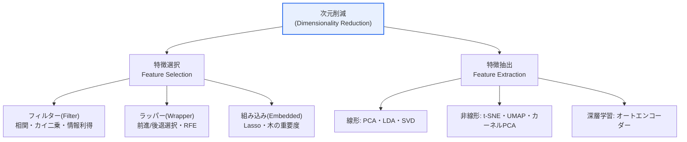
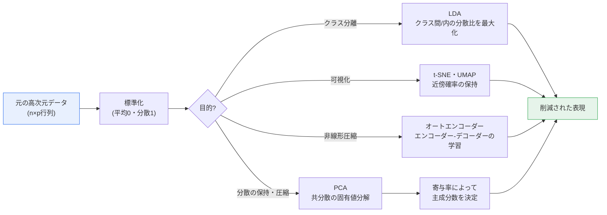

# データの次元削減(Data Dimensionality Reduction)

## 1. 概要

### A. 定義
> **次元削減(Dimensionality Reduction)** とは、高次元データを**情報損失を最小限に抑えながら、より少ない数の変数(次元)で再表現**する手法である。「次元の呪い」を緩和し、計算効率・可視化・過学習の防止を目的とするものであり、元の変数の一部を選ぶ特徴選択と、新たな軸を作る特徴抽出に大別される。

次元削減が必要となる根本的な理由は、「**次元の呪い(Curse of Dimensionality)**」という逆説にある。直感的には、変数(特徴量)が多いほど情報が豊富になり、より良い予測ができそうに思えるが、実際には変数が増えるほどデータ点は高次元空間に極めて疎に散らばり、互いに遠ざかる。例えば一つの変数を0〜1の区間で均一に埋めるには10個の標本で十分だが、同じ密度を10次元で維持するには10^10個の標本が必要となる。次元が増えるほど、必要なデータ量が指数関数的に爆発するのである。

この疎性は、アルゴリズムを直接無力化する。k近傍法(kNN)やクラスタリングのような**距離・密度に基づくアルゴリズム**は、高次元ではすべての点の間の距離が似通ってくる「距離の集中(distance concentration)」現象によって、「近い」と「遠い」の区別が曖昧になる。最も近い近傍と最も遠い近傍の距離の比が1に収束すれば、近接性に意味を持たせていたアルゴリズムは事実上ランダムな推測に近くなる。結局のところ、変数が多いということは、情報ではなくノイズと計算負荷が増えることを意味しやすい。

また、変数が増えるほどモデルの自由度(パラメータ数)が増え、学習データのノイズまで覚え込んでしまう**過学習(Overfitting)**のリスクが大きくなる。標本数に比べて変数の数が多い、いわゆる「HDLSS(High-Dimension, Low-Sample-Size)」の状況(例:数万個の遺伝子発現値に対して数百人の患者)では、この問題が特に深刻である。次元削減は、データの本質的な情報を担う少数の軸を見つけ出し、これらの問題をまとめて緩和する。

### B. 必要性と効果
次元削減は三つの実質的な利点をもたらす。第一に、**計算・保存の効率**が向上し、学習と推論が速くなり、メモリ使用量が減る。数千次元のベクトルを数十次元に削減すれば、距離計算量とインデックスのサイズが劇的に減少する。第二に、データを2〜3次元に削減すれば、人が目でデータのクラスター・外れ値・クラス分離の構造を**可視化・探索**できるようになり、データの理解と仮説の立案に役立つ。第三に、不要な変数・相関の強い変数・ノイズを除去して**過学習を防止**し、汎化性能とモデルの安定性を高める。実務ではこれに「**多重共線性(multicollinearity)の除去**」が加わり、回帰・分類モデルの係数推定が安定するという効果も大きい。

## 2. 方式の分類:特徴選択 vs 特徴抽出

次元を削減する方法は、元の変数をそのまま選び出す**特徴選択**と、変数を組み合わせて新たな軸を作る**特徴抽出**に大別される。まず全体像を俯瞰する。

**特徴選択(Feature Selection)** は、既存の変数のうち有用なものだけを選び出し、残りを捨てる方式である。残った変数が元の物理的な意味をそのまま保つため、**解釈が容易**であることが最大の長所である。例えば疾病診断モデルで、数百の検査項目のうち実際に重要な10数個だけを残せば、医療従事者は「この検査値が高ければ危険」と直ちに解釈できる。ただし、捨てた変数と残した変数の組み合わせから生じる情報は失われる。

特徴選択はさらに三つに分かれる。**フィルター(Filter)**方式は、モデルとは無関係に相関係数・カイ二乗・相互情報量といった統計指標で変数を評価し、迅速に絞り込む。**ラッパー(Wrapper)**方式は、実際のモデルの性能を基準に変数の部分集合を繰り返し探索(前進選択・後退除去・RFE)するため正確であるが、計算コストが非常に大きい。**組み込み(Embedded)**方式は、Lasso(L1正則化)や木ベースの変数重要度のように、モデルの学習過程そのものに変数選択が組み込まれた折衷案である。

一方、**特徴抽出(Feature Extraction)** は、複数の変数を数学的に組み合わせて、まったく新しい軸を作る方式である。情報をより効率的に圧縮できるが、新しい軸は元の物理的な意味を持たないため、**解釈が難しい**。例えばPCAの「第1主成分」は「身長・体重・腹囲の加重和」のような形をとるため、それ自体に直感的な意味を与えることは難しい。その代わり、相関する変数の情報を少数の軸に高密度で収めるため、圧縮率と表現力は特徴選択よりも優れている場合が多い。

| 方式 | 概念 | 代表的な手法 | 長所 | 短所 |
|---|---|---|---|---|
| **特徴選択** | 元の変数から有用なものを選別 | フィルター・ラッパー・組み込み | 解釈が容易(意味を保持)、元データのパイプラインが単純 | 変数の組み合わせ情報の損失 |
| **特徴抽出** | 変数を組み合わせて新たな軸を生成 | PCA・LDA・t-SNE・オートエンコーダー | 情報圧縮・表現力に優れる | 解釈が困難、新しいデータにも変換が必要 |

## 3. 主要な手法と原理

特徴抽出の手法は、「何を最適化するのか」によって性格が分かれる。代表的な手法の内部手順を一つの流れにまとめると、次のとおりである。

**PCA(主成分分析、Principal Component Analysis)** は、最も広く使われている線形・教師なしの手法である。データの**分散が最も大きい方向**を第1主成分とし、それに直交しつつ残りの分散が最大となる方向を順に求める。分散が大きいということは、その方向にデータが広く散らばり情報(識別力)が多いことを意味するため、上位のいくつかの主成分だけで元データの相当部分を復元できる。数学的には共分散行列の固有値分解(またはSVD)によって求め、固有値の大きさが各軸の説明する分散量となる。実務では、「累積寄与率(explained variance ratio)」が85〜95%となる点まで主成分を採用するのが慣例である。ただしPCAは変数のスケールに敏感であるため、**必ず標準化してから適用**しなければならず、線形の相関しか捉えられないという限界がある。

**LDA(線形判別分析、Linear Discriminant Analysis)** は、PCAとは異なり**クラスラベルを活用する教師あり学習**の手法である。PCAが「全体の分散が大きい軸」を求めるのに対し、LDAは「**クラス間の分散を大きく、クラス内の分散を小さく**」する軸を求め、クラスが最もよく分かれる方向へ射影する。したがって分類問題の前処理として強力であるが、削減可能な次元数が「クラス数 − 1」に制限されるという特性がある(例:3クラスなら最大2次元)。

**t-SNE**と**UMAP**は、**非線形の近傍構造を保持**し、主に2・3次元の可視化に用いられる。高次元で近い点は低次元でも近くなるように確率分布を合わせる方式であり、複雑に絡み合った多様体(manifold)構造を展開してクラスターを浮かび上がらせることに優れている。ただしこれらは主に可視化用であり、軸間の距離やクラスターの大きさを定量的に解釈してはならない点に留意する必要がある。UMAPはt-SNEよりも計算が速く、大域的な構造の保持にも優れる傾向があるため、最近の実務で好まれている。

**オートエンコーダー(Autoencoder)** は、ニューラルネットワークによってデータをボトルネック(潜在)層まで圧縮(エンコーダー)し、元のデータへ復元(デコーダー)するように学習させ、そのボトルネック層の表現を削減された特徴量として用いる。非線形の関係を学習できるため画像・音声などの複雑なデータに強く、その変種であるVAEは生成モデルへも拡張される。

| 手法 | 原理 | 教師あり/なし | 線形/非線形 | 主な用途 |
|---|---|---|---|---|
| **PCA** | 分散が最大となる直交軸の抽出(固有値分解) | 教師なし | 線形 | 前処理・圧縮の標準 |
| **LDA** | クラス間/内の分散比の最大化 | 教師あり | 線形 | 分類の前処理 |
| **t-SNE / UMAP** | 近傍確率分布の保持 | 教師なし | 非線形 | 可視化に特化 |
| **オートエンコーダー** | エンコーダー-デコーダーによる潜在表現の学習 | 教師なし | 非線形 | 深層学習・複雑なデータ |

## 4. 適用事例と比較

手法の選択は、データの性質と目的によって分かれる。いくつかの具体的な事例から、違いが生じる理由を見ていく。

**事例1 — ゲノム解析(Bioinformatics)。** マイクロアレイ実験は、標本が数百人であるのに対して遺伝子(変数)が2万を超える、典型的なHDLSSの状況である。変数をそのままにしておけば、どの分類器も過学習する。このとき、まずフィルター方式で発現変動の大きい遺伝子を絞り込み、PCAで上位数十個の主成分だけを残したうえで分類を行うパイプラインが標準として用いられる。ここでPCAを選ぶ理由は、遺伝子間の強い相関を少数の軸に圧縮できるからである。

**事例2 — 画像認識と埋め込み。** 28×28ピクセルのMNIST数字画像は784次元のベクトルであるが、実際の情報ははるかに低い次元の多様体上にある。t-SNE/UMAPで2次元に展開すると、0〜9の数字がはっきりとした10個のクラスターに分かれ、データ品質とクラスの分離度を一目で検証できる。一方、圧縮・復元が目的であればオートエンコーダーが適している。目的が「見ること」か「圧縮すること」かによって、正反対の手法が選ばれるのである。

**事例3 — 推薦・検索システム。** ユーザー・商品を数百次元の埋め込みで表現したうえで類似度によって推薦する場合、次元が大きいと最近傍探索が遅くなり、距離の集中によって精度も低下する。このとき、PCAで次元を削減するか、埋め込みそのものを低次元で学習することで、近似最近傍探索(ANN)インデックスの速度と品質を併せて改善する。

このように、比較の核心は単なる羅列ではなく、**「なぜその手法がその状況に適しているのか」**である。PCAは線形・相関構造が支配的で解釈よりも圧縮が重要なとき、LDAはラベルがあり分類性能が目標のとき、t-SNE/UMAPは構造を目で確認するとき、オートエンコーダーは非線形・大規模・複雑なデータのときに、それぞれ優位性を持つ。

## 5. 深掘り:最新動向と予想される出題方向

**第一に、埋め込み・ベクトルDB時代における再浮上。** 大規模言語モデルやマルチモーダルモデルが生成する高次元の埋め込み(数百〜数千次元)が検索・推薦・RAGの基本単位となるにつれ、次元削減はむしろ用途を広げている。ベクトル検索では、PQ(Product Quantization)・OPQのような量子化ベースの削減によってインデックスのサイズを数十分の一に縮め、HNSWのようなANNグラフと組み合わせて大規模な類似度検索をリアルタイムで処理する。

**第二に、多様体学習と表現学習(Representation Learning)の融合。** 従来のPCAを超えて、自己教師あり学習(self-supervised learning)によって得られた表現そのものが「学習された次元削減」の役割を果たしている。すなわち、下流タスクに有用な低次元表現をデータから直接学習する方向へと重心が移りつつある。

**第三に、過去問・予想される出題方向。** 技術士試験では、(1) 次元の呪いを定義し、次元削減がそれをどのように緩和するかを説明する、(2) 特徴選択と特徴抽出を比較し、それぞれの詳細な手法を論述する、(3) PCAの原理(分散最大・固有値分解)とLDAとの違い(教師なし vs 教師あり)を対比する、(4) ビッグデータ・AIパイプラインにおける次元削減の位置づけと効果を事例とともに述べる、といった形式がよく求められる。答案構成では、**「概念→分類→手法の原理→事例→トレードオフ」**の順に展開すれば、深掘りした論述としての完結性を備えることができる。

## 6. 考慮事項と示唆

技術士の観点から次元削減を適用・評価する際には、次の事項を総合的に考慮しなければならない。

1. **目的に基づく手法選択の戦略。** データ構造の探索にはt-SNE/UMAP、モデルの前処理・圧縮にはPCA/オートエンコーダー、分類性能の向上にはLDAが原則である。「万能の手法」は存在しないため、データの規模・線形性・ラベルの有無・解釈の要求を併せて比較衡量して選択しなければならない。

2. **情報損失・解釈性・性能のトレードオフ。** 次元を過度に削減すると重要な情報まで失われて性能が低下し、特徴抽出は圧縮率を得る代わりに解釈性を犠牲にする。PCAでは累積寄与率(例:90%)とスクリープロット(scree plot)によって適切な次元を定量的に決定し、規制産業(金融・医療)では説明可能性の要求から特徴選択を好むなど、文脈ごとの判断が必要である。

3. **データリーケージ(Data Leakage)の防止。** PCA・LDA・スケーラーといった変換は、**必ず学習データのみで適合(fit)**させ、検証・テストデータにはその変換を適用(transform)するだけにしなければならない。交差検証において全データで先に削減を行うと、テストの情報が漏れて性能が楽観的に歪められる。パイプラインによって順序を強制するのが安全である。

4. **拡張性と運用の観点。** 大容量・ストリーミングデータにはインクリメンタルPCA・ランダム射影(Random Projection)などの拡張可能な手法を、リアルタイムサービスには事前に学習した変換を保存して推論時に迅速に適用する構造を採用する。また、削減後も元の変数とのマッピングを管理し、モデルのモニタリング・デバッグが可能となるよう設計しなければならない。

5. **関連技術との組み合わせ。** 次元削減は単独の手法ではなく、特徴量エンジニアリング・正規化・アンサンブル・ANN検索と組み合わされたときに効果が最大化される。特にベクトル検索・RAGのアーキテクチャでは、削減・量子化・インデックス作成を一つのパイプラインとして設計することが、性能とコストを同時に左右する。

## 参考資料
- scikit-learn, "Decomposition & Manifold learning": https://scikit-learn.org/stable/modules/decomposition.html
- UMAP documentation: https://umap-learn.readthedocs.io/en/latest/
- L. van der Maaten, G. Hinton, "Visualizing Data using t-SNE": https://www.jmlr.org/papers/v9/vandermaaten08a.html

---

> **一言まとめ**: 次元削減は *次元の呪い* を緩和するために情報損失を最小限に抑えながら変数を減らす手法であり、解釈が容易な特徴選択と圧縮に優れた特徴抽出(PCA・LDA・t-SNE・オートエンコーダー)に分かれ、データの性質・目的・解釈の要求に合わせて選択し、データリーケージの防止とトレードオフの管理とともに適用する。
