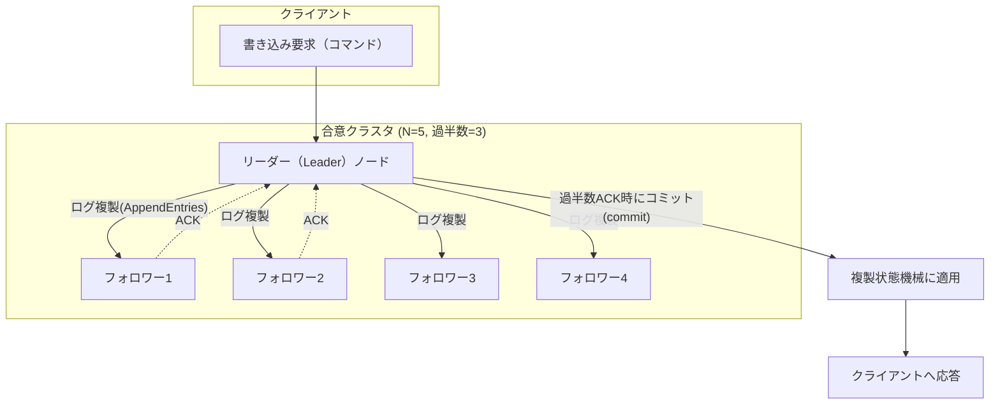
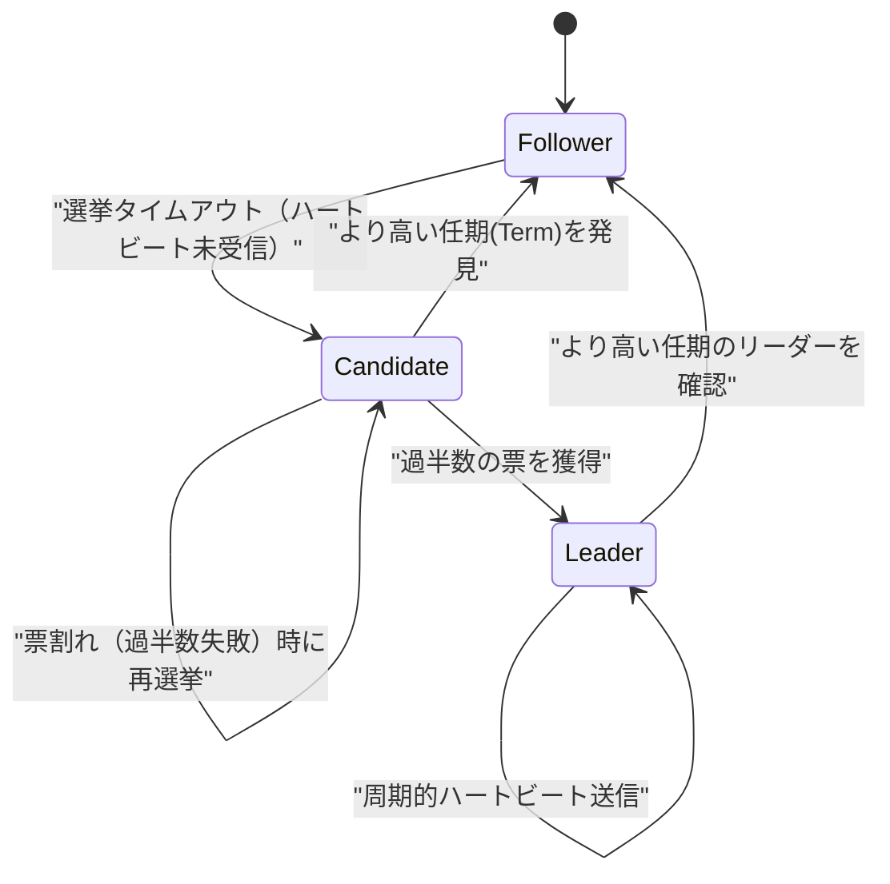

# 分散合意アルゴリズム（Distributed Consensus）— PaxosとRaft

## 1. 概要

### A. 定義

> **分散合意（Distributed Consensus）**とは、ネットワークで接続された複数のノードが、一部ノードの障害・遅延・メッセージ消失が存在する環境においても、一つの値（またはコマンドの順序）について**全員が同一の決定**に到達することを保証するアルゴリズム的手続きである。**Paxos**と**Raft**は、このような合意を多数決（Quorum）ベースで達成する代表的なアルゴリズムである。

合意アルゴリズムは、分散システムを「複数台のコンピュータをあたかも1台の信頼できるコンピュータのように」動作させる中核的な基盤技術である。複製状態機械（Replicated State Machine）において各ノードが同一のコマンドを**同一の順序**で適用すれば結果の状態は常に一致するが、まさにその「同一の順序」を障害発生時にも合意によって確定するのである。Kubernetesのetcd、GoogleのChubby/Spanner、Apache ZooKeeper、CockroachDB・TiDBなど、現代の分散データ基盤の信頼性はすべて合意アルゴリズムの上に成り立っている。

### B. 登場背景と必要性

単一サーバは障害が発生するとサービスが停止するため、可用性を高めるためにデータを複数ノードへ**複製（replication）**する。しかし複製が複数あると、「どの複製の値が正解か」「書き込み要求をどの順序で反映するか」という問題が直ちに生じる。ネットワークはメッセージを遅延・並べ替え・消失させ、ノードは任意の時点でダウンしては復帰し、管理者は新しいリーダーを誤って選出し得る。このように**部分障害（partial failure）**が常に存在する環境でデータ整合性を守るには、単純な多数決を超える厳密なプロトコルが必要である。

理論的には、**FLP不可能性（Fischer-Lynch-Paterson, 1985）**が「完全非同期ネットワークにおいて、たった一つのノードでもダウンし得るならば、常に終了し（termination）かつ安全な（safety）決定論的合意は不可能である」ことを証明した。現実の合意アルゴリズムはこの限界を回避するために、**タイムアウト（部分同期の仮定）**と**ランダム性/リーダー選出**を導入して実用的な可用性を確保する。すなわち合意アルゴリズムの設計目標は「理論的な完璧さ」ではなく、**安全性は決して侵害せず（never wrong）**、ネットワークが安定したときに進行を保証する（eventually makes progress）均衡点を見出すことにある。

Paxos（Leslie Lamport, 1998）はこの問題を初めて厳密に解いたアルゴリズムであるが、「理解が難しい（notoriously difficult）」ことで悪名高かった。Raft（Diego Ongaro・John Ousterhout, 2014）は同等の安全性を維持しつつ**理解しやすさ（understandability）**を第一の設計目標とし、リーダー選出・ログ複製・安全性を明確に分離したアルゴリズムとして、今日では産業界の標準となっている。

## 2. 合意が保証すべき性質と全体構造

合意アルゴリズムは次の四つの性質を満たさなければならない。**合意（Agreement）**：すべての正常ノードは同じ値を決定する。**妥当性（Validity）**：決定された値は、いずれかのノードが実際に提案した値でなければならない。**完全性（Integrity）**：各ノードは高々1回しか決定しない。**終了性（Termination）**：正常ノードはいずれ必ず値を決定する。前の三つは**安全性（Safety）**に、最後の一つは**活性/進行性（Liveness）**に該当し、実務のアルゴリズムは安全性を絶対原則とし、活性はベストエフォートで提供する。

中核メカニズムは**定足数（Quorum）**の原理である。全ノード数をNとすると、過半数`⌊N/2⌋+1`ノードの同意を得て初めて決定が確定する。互いに異なる二つの決定がそれぞれ過半数を得るには、少なくとも一つのノードが両方に属していなければならず（共通部分の存在）、この重なるノードが「以前の決定」を記憶して新しい決定がそれを尊重するよう強制することで、**分裂（split-brain）**を根本的に遮断する。そのためN=5であれば2ノードまでの障害に耐え（過半数3を確保）、一般に**F個の障害に耐えるにはN=2F+1**個のノードが必要となる。

上記の構造において、リーダーはクライアントのコマンドをログエントリとしてフォロワーに複製し、**過半数のACKが集まった瞬間**に当該エントリをコミット（commit）として確定した後、状態機械に適用する。コミットされたエントリは決して覆らないため、その後どのリーダーが新たに選出されても、既にコミットされたコマンドを必ず含むことになる。これが「一度決定すれば永遠に維持される」という安全性の実体である。

## 3. Paxos — 合意の原型

Paxosは役割を**提案者（Proposer）**、**受理者（Acceptor）**、**学習者（Learner）**に分ける。提案者は値を提案し、受理者は過半数の定足数を構成して値を受理し、学習者は確定した値の伝播を受ける。一つの値を決める**Basic Paxos**は2段階（Two-Phase）で動作する。

**第1段階 Prepare/Promise**では、提案者はグローバルに単調増加する提案番号nを選び、`Prepare(n)`を過半数の受理者に送る。受理者は自身が見たものより大きいnであれば、「今後nより小さい提案は無視する」という**約束（Promise）**とともに、既に受理した値があればその値も併せて返信する。**第2段階 Accept/Accepted**では、提案者は過半数の約束を受け取ると、返信された値のうち**最も番号の大きい値**（なければ自分の値）を選んで`Accept(n, v)`を送り、受理者が過半数で受理すればvが確定する。返信された既存の値を尊重するこの規則こそが、「既に決まっているかもしれない値を上書きしない」ことを保証する安全性の中核装置である。

Basic Paxosは値を一つしか決めないため、連続するコマンドログを埋めるには、各ログスロットごとにPaxosインスタンスを実行する**Multi-Paxos**に拡張する。Multi-Paxosは安定したリーダーを選出して第1段階を省略し、第2段階のみを繰り返すことで、正常区間では**メッセージ1往復（1 RTT）**でコマンドを確定させて性能を引き上げる。ただしPaxosの論文はリーダー選出・メンバーシップ変更・ログ圧縮といった実務要素を規定していないため、実装ごとに解釈が分かれ検証が難しいという実務上の難点を残した。

## 4. Raft — 理解可能な合意

Raftは合意問題を**①リーダー選出（Leader Election）②ログ複製（Log Replication）③安全性（Safety）**の三つの部分問題に分解し、それぞれを独立して理解できるようにした。すべてのノードは**フォロワー（Follower）・候補者（Candidate）・リーダー（Leader）**のいずれかの状態を持ち、時間は単調増加する**任期（Term）**番号によって論理的に区切られる。任期は一種の論理時計であり、古いリーダーのコマンドを即座に識別・棄却するために使われる。

リーダー選出は**ハートビートタイムアウト**によって引き起こされる。フォロワーが一定時間（election timeout、通常150〜300msのランダム値）内にリーダーのハートビートを受信しなければ、候補者に遷移して自身の任期を上げ、`RequestVote`を送信する。各ノードは任期ごとに1票しか投じないため、**過半数の票を得た**候補者のみがリーダーとなる。タイムアウトをランダム化して複数の候補者が同時に立候補する票割れ（split vote）を確率的に回避することが、Raftの進行性の秘訣である。

ログ複製は、リーダーがクライアントのコマンドをログに追加した後、`AppendEntries` RPCでフォロワーに伝播し、過半数が保存したらコミットする方式である。Raftは**ログ一致性（Log Matching）**を強制し、同じインデックス・任期のエントリは内容が同一であり、それ以前のログもすべて同一であることを保証する。フォロワーのログがリーダーと不一致であれば、リーダーが強制的に自身のログで上書きして整合性を回復する。さらに**選出制約（Election Restriction）**により、最新のコミット済みログを持つ候補者のみがリーダーになれるようにし、コミットされたコマンドが決して失われないよう安全性を確保する。メンバーシップ変更は**共同合意（Joint Consensus）**または単一ノード変更方式で無停止に処理する。

## 5. PaxosとRaftの比較、そして実務適用

二つのアルゴリズムは同一の安全性（過半数定足数・コミットの不変性）を提供するが、設計思想と実務上の扱いやすさにおいて明確な違いを示す。Paxosはリーダーがなくても動作する一般性と理論的な優雅さを持つが実務的な仕様が不足しており、Raftは強いリーダー（Strong Leader）中心に流れを単純化して、実装・デバッグ・教育が容易である。「なぜそのような違いが生じるのか」は設計目標の違いに由来する——Paxosは最小限の仮定における正しさの証明を、Raftはエンジニアが実際に実装・運用できる明瞭さを優先したのである。

| 区分 | Paxos(Multi-Paxos) | Raft |
|------|--------------------|------|
| 設計目標 | 理論的正確性・一般性 | 理解しやすさ・実装容易性 |
| リーダー概念 | 任意（性能向上用リーダー） | 必須（強いリーダー中心） |
| ログの流れ | 双方向を許容 | リーダー→フォロワーの単方向 |
| メンバーシップ変更 | 論文で未規定（実装依存） | Joint Consensusで明示 |
| 代表的実装 | Chubby, Spanner, Cassandra(LWT) | etcd, Consul, TiKV, CockroachDB |

具体的な適用事例として、**Kubernetes**はクラスタのすべての状態（オブジェクト・設定）を**etcd**に保存するが、etcdはRaftにより3〜5台のノードにデータを複製する。ノード5台構成の場合、2台まで障害が発生しても過半数の3台が生きていれば、APIサーバは正常に読み書きを継続する。実務で奇数（3・5・7）ノードが推奨される理由もここにある——偶数ノードは障害許容台数を増やせないまま過半数の閾値だけを上げるため、かえって非効率である（例：4ノードも5ノードと同様に2台までしか耐えられない）。また、ノードを複数のアベイラビリティゾーン（AZ）にまたがって配置すると可用性は上がるが合意の往復遅延（latency）が大きくなるため、**一貫性・可用性・遅延**を天秤にかける配置設計が中核的な課題となる。

一方、ブロックチェーンの**PBFT・Tendermint**系は、ノードが単純に故障するだけでなく**悪意をもって虚偽のメッセージ**を送信するビザンチン障害にまで耐えるBFT合意であり、F個の裏切りノードに耐えるには3F+1ノードが必要である。Paxos・Raftが信頼ドメイン内部（Crash Fault Tolerant）を前提とするのとは異なり、オープンで信頼のない環境ではより高コストなBFT合意が求められるという点が重要な区分線である。

## 6. 考慮事項および示唆点

技術士の観点から、分散合意は単なるアルゴリズム知識を超えてシステム信頼性アーキテクチャの根幹であるため、次の事項を総合的に考慮しなければならない。

- **一貫性と遅延のトレードオフ**：合意は書き込みのたびに過半数との往復が必要となり遅延が増加する。強い一貫性が必須のメタデータ・設定・リーダーシップ情報には合意を、大容量・高頻度のデータには結果整合性（Dynamo型）を適用する**一貫性レベルの分離**設計が望ましい。PACELCの観点からの意思決定と連携する。
- **ノード数・配置戦略**：奇数ノード（3・5・7）で障害許容と定足数効率を合わせ、マルチAZ/リージョン配置の際には合意遅延と可用性のバランスを定量的に検討する。ノードが多いほど障害耐性は上がるが、書き込み遅延・ネットワークコストが上昇する。
- **性能最適化技法**：ログのバッチ処理（batching）・パイプライン化、リーダーリース（lease）ベースのローカル読み取り、スナップショット・ログ圧縮（log compaction）、読み取り負荷分散のためのフォロワー読み取りなどにより合意のコストを相殺する。
- **運用・観測の要件**：リーダー選出のフラッピング（flapping）、クロックスキュー、ネットワーク分断に備えて任期・コミットインデックス・定足数の状態を観測（Observability）し、スプリットブレイン防止のため必ず過半数ベースの構成を維持する。
- **脅威モデルの選定**：信頼ドメイン内部であればCrash-Fault（Paxos/Raft）、信頼のないオープン環境であればByzantine-Fault（PBFT/PoS）と脅威モデルを明確に区分し、過剰または不足する安全装置を避ける。
- **技術展望**：EPaxos・Flexible Paxosなど遅延を低減する変形、地域性を活用するマルチリーダー・リースベースの読み取り、そしてプルーフ・オブ・ステーク（PoS）ベースの拡張型BFTが発展しており、要求される一貫性・規模・信頼の前提に合わせて合意方式を選択する能力がますます重要になる。

---
> **一言まとめ**：分散合意（Paxos・Raft）は、部分障害環境において過半数定足数とログ複製により複数ノードが同一のコマンド順序に到達するようにする技術であり、安全性を絶対原則として守りつつ可用性・遅延を天秤にかけ、分散システムを単一の信頼できるシステムのように動作させる基盤である。
