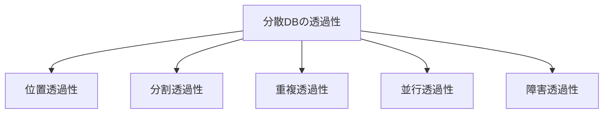

# 分散データベースの5つの透過性（Transparency）

## 1. 概要

### A. 定義
> **分散データベース（DDB）** は、物理的に複数のサイト（site）に分けて格納・管理されるデータを、利用者には**論理的に一つの統合されたDBのように**見せるシステムである。このとき「分散しているという事実を利用者からどれだけ隠すか」の度合いを**透過性（Transparency）** という。

透過性の本質は**複雑さの隠蔽（abstraction）** である。データが実際にどこにあり、いくつの断片に分割され、複製がいくつあるかはシステム内部の事情にすぎず、利用者は単一のDBに問い合わせるようにSQLを1行発行するだけでよい。分散の詳細を知らなくてよいためアプリケーション開発が単純になり、データの配置が変わってもアプリケーションを修正しなくてよい**位置独立性**が確保される。

### B. 登場背景および必要性
データが特定のサーバ1台に集中すると、そのサーバがボトルネックかつ単一障害点（SPOF）となり、地理的に離れた利用者は遠隔アクセスによる遅延を被る。これを解決するにはデータを**複数の地域・ノードに分散・複製**する必要があるが、そうするとアプリケーションが「どのノードに接続し、どの複製を読むか」をいちいち気にしなければならない負担が生じる。透過性とは、まさにこの負担をシステムが肩代わりし、分散の利点（可用性・拡張性・局所性）を得ながらも利用者には**単一DBの単純さ**を維持させるために必要なものである。

## 2. 5つの透過性

五つの透過性は、それぞれ「利用者から何を隠すか」が異なる。前の三つ（位置・分割・重複）は**データの配置**を隠し、後の二つ（並行・障害）は**同時実行性と信頼性**を保証する。

- **位置透過性（Location）**：データが物理的にどのサイトに格納されているかを知らなくてもアクセスできる。システムが**グローバルカタログ（global catalog）** を参照してクエリを該当ノードへルーティングする。例えばソウル・釜山の二つのデータセンターに会員情報が分かれていても、アプリケーションは`SELECT * FROM member`を実行するだけでよい。
- **分割透過性（Fragmentation）**：一つのテーブルが複数の断片（fragment）に分割されて格納されている事実を意識しない。**水平分割**（行単位、例：地域別の注文）と**垂直分割**（列単位）があり、システムが断片を再結合して完全な結果を返す。
- **重複透過性（Replication）**：同じデータの複製が複数存在し、更新時にそれらを同期しなければならない事実を利用者が知らなくてよい。利用者には一つのデータを扱っているように見えるが、内部的には複製間の**一貫性プロトコル**が動作している。
- **並行透過性（Concurrency）**：複数のサイトで多数のトランザクションが同時に実行されても、あたかも単独で逐次的に実行したのと同じ**直列可能性（serializability）** が保証される。分散ロック・タイムスタンプにより相互干渉を遮断する。
- **障害透過性（Failure）**：一部のサイトや通信リンクに障害が発生しても、トランザクションの**原子性（All-or-Nothing）と一貫性**が維持される。部分的な失敗が全体を汚染しないようコミットを調整する。

| 透過性 | 隠す対象 | 中核効果 |
|---|---|---|
| **位置** | 物理的な格納位置 | 位置独立性 |
| **分割** | データの断片化 | 統合ビューの提供 |
| **重複** | 複製の存在・個数 | 一貫した単一ビュー |
| **並行** | 同時実行の干渉 | 直列可能性の保証 |
| **障害** | 部分障害 | 原子性・復旧 |

## 3. 関連する実装技術

各透過性は自然に得られるものではなく、以下のように対応する分散処理技術によって支えられる。特に障害透過性の中核である**2相コミット（2PC）** は、コーディネータ（coordinator）がすべての参加サイトに「準備（prepare）」を問い合わせ、全員が同意した場合にのみ「コミット」を指示することで、一部ノードだけがコミットされる部分反映を防ぎ原子性を保証する。ただし2PCにはコーディネータがダウンすると参加者が待機状態に縛られる**ブロッキング（blocking）** という弱点があるため、近年はこれを緩和した3PCや合意アルゴリズム（Paxos・Raft）、補償トランザクションに基づくSagaが併用される。

| 透過性 | 支援技術 |
|---|---|
| 位置・分割 | グローバルカタログ、分散クエリ処理・最適化 |
| 重複 | 複製同期、一貫性プロトコル（同期・非同期） |
| 並行 | 分散ロック・2PL、タイムスタンプ順序付け |
| 障害 | **2相コミット（2PC）**・3PC、ログベースの復旧 |

## 4. 長所と短所

透過性が高いほど使い勝手は向上するが、その利便性をシステムが肩代わりする分だけ内部コストが増える。例えば重複透過性を完全に保証するにはすべての複製を即時に同期しなければならず（同期レプリケーション）、これは更新遅延と通信オーバーヘッドを増大させる。逆に性能のために非同期レプリケーションを用いると、一時的に複製間で値が異なり一貫性が揺らぐ。このように**透過性・一貫性・性能は互いに引っ張り合う関係**にある。

| 長所 | 短所 |
|---|---|
| 可用性・拡張性・データ局所性の確保 | 設計・運用の複雑さの増大 |
| 透過的なアクセスによるアプリケーションの単純化 | 同期・一貫性維持のコスト、通信オーバーヘッド |

## 5. 考慮事項および示唆点
- **CAP定理のトレードオフ**：ネットワーク分断（P）は避けられないため、分散システムは**一貫性（C）** と**可用性（A）** のどちらを優先するかを選択しなければならない。金融のように整合性が重要であればC、大規模サービスのように無停止が重要であればAを選ぶといった具合である。
- **一貫性モデルの選択**：強い一貫性（2PC）の代わりに**結果整合性（eventual consistency）** を許容すれば、性能・可用性を得る代わりに一時的な不一致を受け入れることになる。要件に合った水準を定める必要がある。
- **連携・展望**：Google Spanner・CockroachDBのような**NewSQL/グローバル分散DB** は、TrueTime・合意アルゴリズムにより強い一貫性と拡張性を同時に追求しており、NoSQLは可用性中心に発展してきた。分散トランザクションでは2PCとSagaを状況に応じて組み合わせ、一貫性と性能のバランスを取ることが実務の要である。

---

> **一言まとめ**：分散DBの透過性は*位置・分割・重複・並行・障害*の5つであり、分散・複製・同時実行・部分障害を利用者から隠して一つのDBのように見せるものである。グローバルカタログ・複製同期・分散ロック・2PCなどで実装されるが、CAP・一貫性のトレードオフの中で性能とのバランスを取らなければならない。
