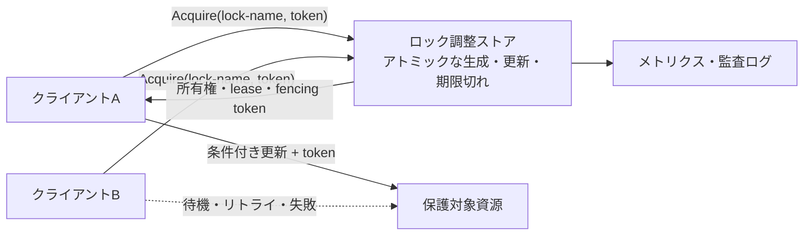
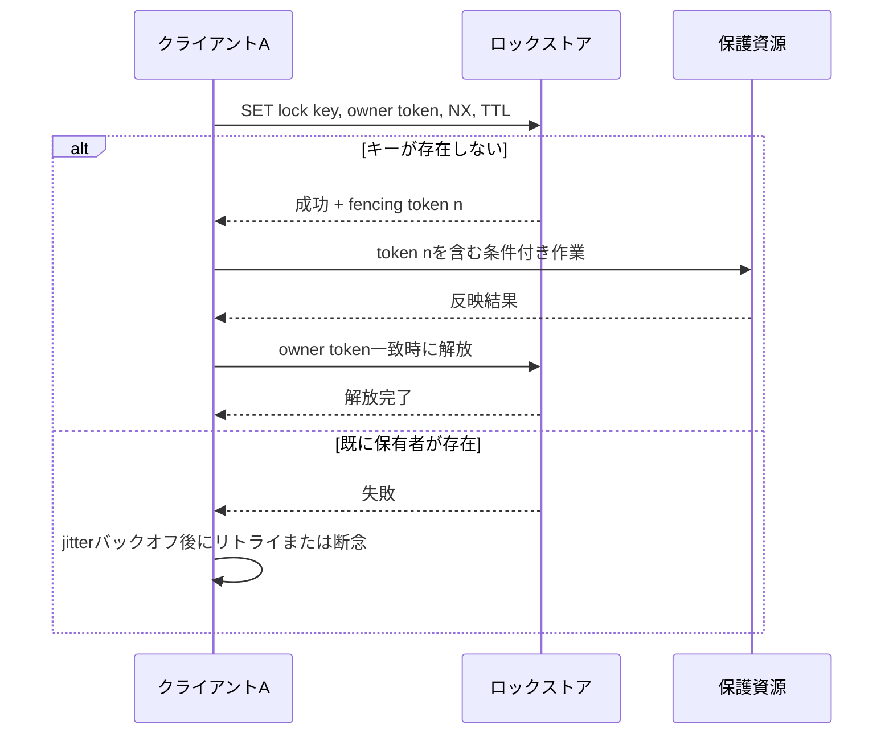

# 分散ロック（Distributed Lock）

## 1. 概要

> **定義**：分散ロック（Distributed Lock）とは、複数のサーバ・プロセス・コンテナが共有資源やクリティカルセクションを同時に変更しないよう、ネットワークで接続された参加者の間で相互排除と所有権を調整する制御技法である。

単一プロセス内では、ミューテックスやセマフォが共有メモリ上のアトミック命令によってクリティカルセクションを保護する。しかしサービスが水平スケールすると、要求を処理するインスタンスが複数台になり、各インスタンスのメモリ上に置いたロックは他のインスタンスから見えない。このとき、在庫の減算、バッチの重複実行、同一ファイルの生成、スケジューラのリーダー選出のように「ある時点で一つの主体だけが実行」すべき作業には、ネットワークを挟んだ調整が必要となる。

分散ロックは単にキーを一つ保存する機能ではない。ロックを獲得した主体が正常に終了しないことがあり、ネットワークが分断されることがあり、応答が遅れて主体が自分のロックが既に期限切れであることに気付かないこともある。したがって相互排除（mutual exclusion）を定義するだけでは不十分であり、待機中の主体がいずれ進行できる活性（liveness）、障害後の自動回復、誤った所有者が遅れて作業を完了してもデータを汚染しない安全性（safety）を併せて設計しなければならない。

例えば注文サービスの在庫が残り1個の状況で二つのインスタンスが同時に減算すると、各インスタンスが同じ残在庫を読み取り、双方とも成功として処理してしまう可能性がある。分散ロックはこの競合を直列化するが、ロックを使ったからといってデータベースの条件付き更新・トランザクション・制約が不要になるわけではない。ロックは競合を減らす調整装置であり、最終的な整合性は台帳データのアトミックな検証が保証しなければならない。

技術士の答案では、「どのストアをロックサービスとして選んだか」よりも先に、保護対象、ロックの範囲、所有権の寿命、障害モデル、整合性要件を明示することが重要である。作業が短くデータベース1か所でアトミックに処理されるのであれば、条件付きUPDATEの方が単純かつ強力である。逆に複数の資源や外部システムを調整する必要があるなら、リース（lease）、フェンシングトークン（fencing token）、リトライと可観測性を含む分散ロックの設計が必要となる。

- **相互排除**：同じロック名について、許可される所有者はある時点で一つでなければならない。
- **所有権の識別**：獲得主体を任意の一意なトークンで識別し、他の主体のロックを解放しないようにする。
- **自動回復**：所有者が障害を起こしても、TTL・セッション・リースの期限切れにより永続的なデッドロックを回避する。
- **業務整合性との連携**：ロック獲得だけで完了を宣言せず、条件付き更新・フェンシング・トランザクションで遅延した作業を遮断する。

## 2. 全体構造と構成要素

分散ロックシステムは、クライアント、ロック調整ストア、保護対象資源に分けて捉えることが出発点である。クライアントはロックを獲得した後にクリティカルセクションを実行して解放するが、ロックの実際の所有権と有効期限の情報は、すべてのクライアントが観察できる一貫したストアに置く。このストアは関係データベース、強い一貫性を持つコーディネータ、インメモリのキー・バリューストアなどで実装できる。



**ロック名（lock key）** は保護する論理資源を識別する。`inventory:item:1234`、`job:daily-settlement:2026-09-16`、`file:report.csv`のように業務単位が分かるよう設計するが、広すぎるグローバルロックは不要な直列化を引き起こす。逆にキーを細分化しすぎると、同じ業務の複数ステップがそれぞれ異なるロックを使い、保護範囲を取りこぼす可能性がある。

**所有者トークン（owner token）** はロック獲得時に乱数やUUIDで発行する。解放要求にはこのトークンを添え、保存されたトークンと一致する場合にのみ削除する。単純に`DEL lock-key`を実行すると、以前の所有者の作業が遅れている間に新しい所有者がロックを獲得し、その後以前の所有者が新しい所有者のロックまで消してしまう事故が発生する。所有者の検証は解放操作の基本的な安全装置である。

**リース（lease）とTTL** はロックの有効期間を表す。プロセスがダウンしたりネットワークが切断されたりして解放要求を送れなくても、期限切れ後には他の主体が進行できるようにする。ただしTTLは作業が終わる保証ではなく、「所有権を主張できる時間の上限」である。作業がTTLより長くかかる場合は更新（renewal）が必要であり、更新が失敗したら直ちにクリティカルセクションを中断するか、結果の反映をフェンシングで拒否しなければならない。

**フェンシングトークン（fencing token）** は、ロックを獲得するたびに増加する単調増加の番号である。保護対象資源は、要求に含まれるトークンが最後に処理したトークンより大きい場合にのみ反映する。この仕組みは、ネットワーク遅延によって過去の所有者の要求が遅れて到着する「ゾンビクライアント」問題を解決する。TTLだけのロックでは期限切れ時点のクライアントが実行を継続し得るため、外部ストアがトークンを検査しなければ、相互排除の直観が実際のデータ安全性につながらない。

## 3. 獲得・維持・解放のプロトコル

### A. ロックの獲得

獲得プロセスは、まず衝突モデルを定義することから始まる。クライアントは一意な所有者トークンを生成し、調整ストアに「キーが存在しない場合にのみ生成する」アトミック操作を要求する。成功すればリースの有効期限と、必要に応じてフェンシングトークンを併せて得る。失敗した場合は無限に繰り返さず、バックオフと最大待機時間を適用する。



アトミック性とは、「確認してから保存する」を一つの論理操作にまとめることを意味する。先に`EXISTS`を呼び出してから`SET`を実行すると、二つのクライアントが同時に「存在しない」ことを観測し、両方とも保存してしまう競合状態が生じる。データベースのユニーク制約とINSERT、コーディネータのcompare-and-set（CAS）、キー・バリューストアの`SET NX`がこのアトミック性を提供する。

獲得に成功した後は、返された結果を記録しなければならない。所有者トークン、獲得時刻、有効期限、フェンシングトークン、要求・作業IDをログに残せば、ロック競合と障害原因を追跡できる。単純なBooleanの成否だけを記録すると、「誰が長く保持していたか」や「期限切れ後に遅延した要求があったか」を分析することが難しい。

リトライは固定間隔よりも、指数バックオフとランダムなジッタ（jitter）を組み合わせる方が安全である。すべての待機者が同じ時点で再要求するとストアにthundering herdが発生し、ロックが解放されたときにまた別の競合の爆発が起こる。待機時間の上限と業務の重複許容可否を定め、ロックを得られなければキューに入れる、あるいは利用者に再処理を返すといった代替策も用意する。

### B. ロックの維持と更新

リースの更新は、TTLを無条件に延ばす作業ではない。クライアントがまだ生存しており当該トークンを保有しているかをアトミックに確認したうえで、残りのリースが閾値より短い場合にのみ更新しなければならない。更新応答が遅延したりタイムアウトしたりした場合は成功とみなさず、保護資源への追加書き込みを中止する保守的なポリシーが安全である。

作業の予想時間が短く変動が小さければ、TTLを作業時間より十分長く設定できる。しかしTTLが長すぎると障害後の回復が遅れ、短すぎると正常な作業をゾンビ作業にしてしまう可能性が高まる。したがって平均時間ではなく、p99・p999の遅延、GC pause、コンテナのスケジューリング遅延、ネットワーク往復時間を含めてリース予算を計算する。

更新スレッドが作業スレッドと分離されていると、作業が停止した後も更新し続けるエラーが生じ得る。作業のキャンセル・タイムアウト・プロセス終了のシグナルを受けたら、まず更新を止め、新規I/Oを遮断したうえでクリーンアップ手続きを行う。更新失敗を検知した後も既に発行した非同期作業が残っている可能性があるため、キュー・DB・外部APIの結果反映段階にフェンシングまたは冪等キーを置く。

### C. ロックの解放

正常な解放は、所有者の検証と削除を一つのアトミック操作で行う。Redisであればトークンを比較してから削除するLuaスクリプト、関係DBであれば`WHERE lock_name = ? AND owner_token = ?`条件のDELETEを使用できる。比較と削除が分離されていると、確認直後にTTLの期限切れと新規獲得が割り込む可能性がある。

解放要求のタイムアウトは、実際の解放成否とは異なる。クライアントがタイムアウトを受けてリトライしても、トークン検証が冪等であれば失敗か成功かを安全に再確認できる。逆に解放応答がないからといって新しいロックを強制的に消すと、現在の所有者の作業を損なう可能性がある。期限切れを待つか、管理者用の強制解放手続きを別途統制しなければならない。

業務のコミットとロック解放の順序も重要である。データベーストランザクションがコミットされる前にロックを放すと、他の主体が同じ資源を読み取り重複作業を開始し得る。一般的には保護データのコミットを完了し外部副作用の状態を記録した後にロックを解放するが、外部API呼び出しが含まれる場合は補償・アウトボックス・冪等処理まで併せて設計しなければならない。

## 4. 実装方式と動作原理

### A. 関係データベースベースのロック

関係データベースは既にトランザクション・ログ・障害復旧・ユニーク制約を提供しているため、業務データとロックの寿命が同じ場合に最初に検討できる。ロックテーブルに`lock_name`を主キーとして置き、INSERTに成功した一つのトランザクションだけが所有権を得るようにすれば、競合者間の相互排除をデータベースが判定する。

```sql
CREATE TABLE distributed_lock (
  lock_name    VARCHAR(200) PRIMARY KEY,
  owner_token  VARCHAR(100) NOT NULL,
  fencing_seq  BIGINT NOT NULL,
  lease_until  TIMESTAMP NOT NULL,
  updated_at   TIMESTAMP NOT NULL
);
```

INSERTや条件付きUPDATEの成否だけを信じず、データベースの時計とアプリケーションの時計の差を考慮しなければならない。アプリケーションが計算した有効期限を保存すると、時計が大きくずれたサーバがまだ有効なロックを期限切れと判断してしまう可能性がある。可能であればデータベースの単調増加値・トランザクション時刻・サーバ側の条件式を活用し、時間ベースの判断の許容誤差を明示する。

行ロックとadvisory lockは性格が異なる。行ロックはトランザクションが終わると自動的に解放され、DB内部の行と直接結合されるが、長時間の外部呼び出しをトランザクション内に置くとコネクションとロックが長く占有される。advisory lockはアプリケーションが定めたキーに対する協調的ロックで便利だが、すべての参加者が同じ規則を守らなければならず、DBセッションの切断・コネクションプールの再利用の意味を確認する必要がある。

データベースベースのロックの利点は、保護データとロック獲得を同じトランザクションにまとめられることである。在庫減算のように1行への条件付きUPDATEで完了する作業では、別途分散ロックを使うより`UPDATE inventory SET quantity = quantity - 1 WHERE id = ? AND quantity > 0`の方がより直接的な整合性手段である。反面、ロック獲得の競合が非常に大きいと、業務DBがロックサーバの役割まで担ってボトルネックになり得る。

### B. インメモリのキー・バリューストアベースのロック

Redis系のストアは低遅延のアトミック命令とTTLを提供するため、短いクリティカルセクションのロックによく使われる。基本パターンは、乱数トークンとともに`SET resource token NX PX ttl`を実行することである。`NX`はキーが存在しない場合にのみ保存し、`PX`は自動期限切れ時間を付与して、別途の確認・保存の競合と無期限の占有を減らす。

解放時には必ず所有者トークンを比較しなければならない。疑似コードは次のとおりである。

```text
if GET(resource) == my_token:
    DEL(resource)
```

しかし上記の2行をそれぞれネットワークコマンドとして送ると、比較と削除の間の競合が再発する。したがってストア内部のスクリプトやCASを用いて、次を一つのアトミック操作にする。

```text
if value(resource) == my_token then
    delete(resource)
    return 1
else
    return 0
end
```

単一Redisインスタンスベースのロックは実装が単純だが、インスタンス障害・レプリケーション遅延・failover時点のデータ損失を障害モデルに含めなければならない。ロックの失敗が二重決済やデータ破損につながる業務であれば、Redis TTLだけで強い保証を主張せず、DB制約・フェンシングトークン・業務の冪等性を組み合わせる。Redisクラスタのシャーディングは異なるキーをアトミックにまとめられない場合があるため、ロックキーの分布とコマンドの範囲を確認する。

複数の独立したRedisノードにロックを複製して可用性を高めるアルゴリズムは、時計の精度、ネットワーク遅延、障害の重複、過半数獲得の条件など強い前提を要求する。特に、クライアントがリース期限切れ後も停止せずに実行し得るという問題は、多重ノードの数を増やすだけでは解決しない。高リスクな資源は、クライアントが受け取ったロック結果を最終的な権威とみなさず、資源側でfencing tokenを検査するよう設計する。

### C. 合意ベースのコーディネータ

ZooKeeper、etcd、Consulのように合意プロトコルとセッション・watchを提供するコーディネータは、一時ノード（ephemeral node）、セッションの期限切れ、シーケンシャルノード、compare-and-swapを通じて強い調整機能を提供する。クライアントがセッションを失うと一時ノードが消え、待機者は変更通知を受けて再試行できる。これは単純なキー・バリュー保存よりも、ロックのライフサイクルと障害検知を明示的に表現しやすい。

ただしwatchイベントは「次は自分の番だ」という確定通知ではない。イベントを受け取った後に実際にキーを再照会し、自分の条件が依然として成立しているかを確認しなければならない。すべてのクライアントが一つのノードを監視するとイベントの嵐が生じ得るため、シーケンシャルノードで直前の先行者だけを監視するherd-effect緩和パターンを用いる。

合意ベースのストアも無限に高速なロックサーバではない。合意ログとquorum通信は一貫性を提供する代わりに、ネットワーク往復と運用の複雑さを要求する。メンバー数、quorum、ディスク遅延、スナップショット・ログ保持、証明書更新、リーダー障害時の切り替えを管理しなければならず、データベースやRedisを単にもう一つ導入するような感覚で取り組んではならない。

## 5. 安全性・活性・公平性

分散ロックの品質は次の三つの軸に分けて評価する。**安全性**は同時に二つ以上の有効な所有者が保護作業を実行しない性質であり、**活性**は障害が過ぎ去った後にいずれ新しい所有者が進行できる性質である。**公平性**は特定のクライアントが機会を奪われ続けることなく、待機順序を予測できる性質である。

安全性はストアのアトミックな獲得だけでは完成しない。TTL期限切れ後も実行中のクライアント、ネットワーク分断、応答の再送、プロセスの一時停止といった状況で、以前の主体が資源に書き込めないようにしなければならない。したがって保護対象がフェンシング番号を比較するか、作業自体が冪等で条件付きであるかを検討する。

活性は、リースの期限切れ、セッション切断、クライアントのキャンセルによって確保する。しかし期限を短くしすぎると一時的な遅延でもロックが再割り当てされ、二つの主体が重なり得る。逆に長すぎると障害復旧が遅れる。安全性と活性の間の選択を、SLAと障害予算に合わせて明示する。

公平性は必要に応じてFIFOキューやシーケンシャルノードで実装する。公平性を保証しない非ブロッキングのリトライ方式はスループットが高いが、特定のクライアントが失敗し続ける可能性がある。バッチ作業には公平な待機が重要になり得るが、ユーザ要求の短いクリティカルセクションには、待ち行列よりも即時に失敗させて上位のキューに回す方が適切な場合がある。

| 評価軸 | 問い | 代表的な設計手段 | 失敗時の影響 |
|---|---|---|---|
| 安全性 | 二つの主体が同時に反映しないか？ | アトミックな獲得、所有者トークン、fencing | 重複処理・データ破損 |
| 活性 | 障害後にロックが解放されるか？ | TTL、セッション、キャンセル・復旧 | 永続的デッドロック・処理遅延 |
| 公平性 | 特定の主体が飢餓状態にならないか？ | FIFO、シーケンシャルキュー、ジッタ調整 | starvation・予測不能な遅延 |
| 可観測性 | 原因を追跡できるか？ | holder・age・wait・renewの指標 | 障害分析が不可能 |

## 6. 比較と適用事例

### A. 分散ロックと代替の整合性技法の比較

分散ロックは複数の要求を一時的に直列化する方式である。一方、楽観的同時実行制御はバージョン番号や条件付き更新によって衝突を検知し、失敗した要求をリトライする。競合が少なく衝突からの回復が容易な場合は、楽観的方式の方がロック待機よりスループットが高い。衝突のコストが大きく外部の副作用を取り消しにくい場合は、ロックやキューの方が適している。

メッセージキューの単一コンシューマパーティションは、特定キーの順序を保証して分散ロックの必要性を減らす。しかしコンシューマ障害・リバランス・複数パーティションにまたがる作業には、別途冪等性と進行状態の設計が必要である。データベースのユニークキーは重複生成を防ぐが、複数の資源や外部システムの実行順序を調整する汎用ロックの代わりにはならない。

| 技法 | 衝突処理 | 強み | 限界・適する状況 |
|---|---|---|---|
| 分散ロック | 実行前に先取り | 直観的な直列化、外部作業の調整 | TTL・ゾンビ・ストア障害を設計する必要 |
| 条件付き更新 | コミット時に検証 | DB整合性と直接結合 | 衝突リトライ・外部副作用に弱い |
| メッセージキューのパーティション | キーごとの順序化 | 非同期処理・再処理 | パーティション設計と重複消費への対応が必要 |
| 単一リーダー/スケジューラ | リーダーが作業を実行 | バッチには単純 | リーダー切り替え・作業分割が必要 |
| サガ・補償 | 段階ごとの確定・取消 | 長時間の分散業務 | 補償ロジックと中間状態の複雑さ |

違いが生じる理由は、「誰が衝突を統制するか」にある。ロックは実行前に競合者を止め、楽観的方式は実行後にバージョン衝突を発見し、キューは順序付けられた処理の流れで競合を吸収する。したがって答案では、ロックを万能の解決策として扱わず、保護資源の特性と副作用を根拠に選択すると記述すべきである。

### B. 事例1：バッチの重複とリーダー選出

複数のアプリケーションインスタンスが毎日精算バッチを実行する環境では、スケジューラがすべてのインスタンスで起動し得る。`job:settlement:date`ロックを獲得した一つのインスタンスだけが作業を開始するようにすれば、重複実行を減らせる。ただし作業が長い場合は更新失敗時に中断し、完了マーカーを日付ごとのユニークキーとして記録して、再開も冪等にする。

リーダー選出と分散ロックは似ているが同一ではない。リーダーは長時間の責任を持ち、メンバー構成の変化とリーダー障害時の切り替えを継続的に処理しなければならない。単発のバッチにはリースロックが適し得るが、クラスタのコントロールプレーンのようにリーダーがすべての状態変更に責任を持つ場合には、合意ベースの選出とfencingが必要である。

### C. 事例2：在庫予約と決済の連携

商品在庫1個を複数の注文が同時に予約する状況では、商品ごとのロックが競合区間を減らせる。しかし決済承認、配送API、通知サービスまでロックを保持したまま呼び出すと、外部の遅延がロック占有時間を長くし、障害時には全体のスループットが急落する。実務的には、DBトランザクション内で在庫を条件付きで減算し、決済・通知はアウトボックスと状態機械で分離する方が堅牢である。

ロックを使う場合でも、`quantity > 0`条件と注文IDのユニーク制約は維持しなければならない。ロック期限切れ後に遅れたインスタンスが在庫を再度減算しないよう、注文の状態遷移とバージョン検査を含める。この事例は、ロックがデータベースの整合性制約の代わりになるのではなく、競合の幅を減らす補助層であることを示している。

### D. 事例3：ファイル生成と共有ストレージ

複数のワーカーが同じレポートファイルを生成するシステムでは、`report:tenant:period`ロックを利用して重複計算を減らせる。しかしファイル書き込み中にロックが期限切れになると、二つのワーカーが同じパスを上書きし得る。一時ファイルに書き込み、fsync・検証を行った後にアトミックなrenameを行い、メタデータストアに作業バージョンと生成者トークンを記録する方式がより安全である。

共有ファイルシステムやオブジェクトストレージは、ロックストアとは別の障害モデルを持つ。ロックを得たという事実だけではファイルシステムの可視性・耐久性・条件付き生成は保証されないため、オブジェクトのIf-None-Match、バージョンID、完了マーカーといった資源側の条件を併用する。大容量の生成物には、ロックよりも作業キューと重複排除キーが適している場合がある。

## 7. 深掘り：リース期限切れとフェンシングトークンの関係

分散ロックにおける最も危険な誤解は、「TTLが終わったのだから以前の作業も終わった」と仮定することである。プロセスは停止シグナルを受け取っていても、カーネルスケジューラによってしばらく実行されないことがあり、ネットワーク応答は遅延して到着することがある。以前のクライアントがロックストア上で所有権を失ったことを知らないまま保護資源に書き込むと、新しいクライアントと同時に副作用が発生する。

フェンシングトークンはこの問題を資源側で遮断する。ロック獲得ごとに`n`、`n+1`のように増加する番号を発行し、保護資源は最後に承認した番号を保存する。要求のトークンがそれより小さければ、遅れて到着した古い作業とみなして拒否する。この検査はアプリケーションコードのif文だけに置かず、DBの`WHERE version < :token`、ストレージの条件付き書き込み、作業キューの世代番号のように、可能な限り資源の近くに置く。

トークンの単調増加はリース更新とは区別する。同一所有者がTTLを延長するだけであればトークンを毎回変える必要はないが、所有権が別のクライアントに移るときには必ずより大きな世代が発行されなければならない。ストアの復旧・スナップショット復元でカウンタが巻き戻らないよう、永続化と復旧手順を検討し、トークンが再利用されないという不変条件を文書化する。

フェンシングトークンを適用できない外部APIもある。その場合は、外部呼び出しの冪等キー、要求の有効期限、重複検知テーブル、補償トランザクションを組み合わせてリスクを低減する。それでもアトミックな取消が不可能な決済・送金のような作業については、分散ロックだけで厳密な1回処理を約束せず、決済事業者の冪等キーと事後の突合プロセスを整合性の最終防衛線とする。

## 8. 考慮事項および示唆点

- **保護範囲とキー設計**：グローバルロック・テナントロック・資源ごとのロックを業務の競合グラフで分析し、必要な範囲だけをロックする。ロックキーにバージョン・テナント・期間を含めつつ、異なるサービスが同じ論理資源を別の名前で呼ばないよう、共通の命名規則と所有チームを定める。
- **障害モデルの明示**：ストア障害、ネットワーク分断、プロセス停止、GC pause、時刻誤差、再起動・スナップショット復元を列挙する。各障害で安全性と可用性のどちらを優先するかを決め、設計の前提が崩れたときにfail-closed・fail-openのどちらの動作をするかを答案と運用ランブックに残す。
- **TTL・更新の予算**：p99の作業時間と最大一時停止をもとにTTLを計算し、更新失敗を直ちに業務失敗として伝播する。期限切れ・更新遅延・長期保持をメトリクスとして収集し、ロック保持時間に上限を設けて障害が長時間伝播しないようにする。
- **ゾンビ防止と整合性**：所有者トークン検証付きの解放、fencing token、DBの条件付き更新、冪等キーを併せて適用する。ロック獲得の成功を業務の成功として記録せず、保護資源のコミット結果と突合状態を別途管理する。
- **性能とコスト**：ロックサーバの往復時間、競合率、待ち行列の長さ、ストアのquorum遅延をSLAに反映する。高頻度・超短時間の作業ではロックサーバの呼び出し自体がボトルネックになり得るため、ローカルバッチ・キーパーティション・キューによる直列化・楽観的検証を比較する。
- **運用・セキュリティ**：ロックストアの認証・暗号化・ネットワーク分離・バックアップポリシーを業務データと同水準で保護する。管理者による強制解放には承認・理由・有効期限・監査ログを求め、任意のキー削除を標準的な障害対応として許容しない。
- **テストと検証**：通常の競合だけでなく、TTL直前の停止、応答遅延、ストアのfailover、ネットワーク分断、リトライによる重複、時計誤差を注入する。中核の不変条件である「低いフェンシングトークンが高いトークンの後に反映されない」ことを自動検証し、障害注入の結果を復旧時間とともに記録する。
- **技術選択の示唆**：単一DBトランザクションで完結する作業は条件付き更新を優先し、長時間の複数システム業務はサガ・アウトボックス・キューと組み合わせる。高リスクな共有資源には合意ベースのコーディネータとfencingを検討するが、複雑さが増す分だけ運用能力とコストを併せて評価する。

## 参考資料

- Redis Documentation, "Distributed Locks with Redis": https://redis.io/docs/latest/develop/clients/patterns/distributed-locks/
- Martin Kleppmann, "How to do distributed locking": https://martin.kleppmann.com/2016/02/08/how-to-do-distributed-locking.html
- PostgreSQL Documentation, "Explicit Locking": https://www.postgresql.org/docs/current/explicit-locking.html
- Apache ZooKeeper Documentation, "Locks": https://zookeeper.apache.org/doc/current/recipes.html#Locks
- etcd Documentation, "Concurrency API": https://etcd.io/docs/v3.6/dev-guide/api_concurrency_reference_v3/

---

> **一言まとめ**: 分散ロックはネットワーク越しのクリティカルセクションを直列化する手段であるが、TTLだけでは安全性は完成しないため、アトミックな所有権・障害回復・フェンシングトークン・条件付き更新・冪等性を併せて設計しなければならない。
