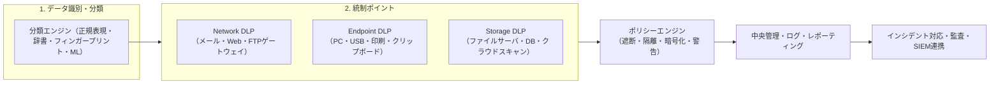
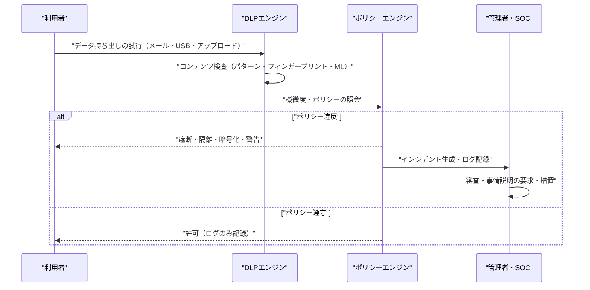

# DLP（Data Loss Prevention、データ漏えい防止）

## 1. 概要

### A. 定義および登場背景
> **DLP**とは、組織が保有する**機微・機密データの移動をコンテンツベースで識別・監視・遮断**し、ポリシーに違反する保存（at rest）・転送（in motion）・使用（in use）を事前に統制することで、**意図的な漏えいと不注意による露出を併せて防止**するセキュリティ体系である。

DLPが登場した根本的な背景は、「**守るべき資産が城壁の内側ではなく、データそのものへと移った**」という認識の転換である。従来の境界型セキュリティ（ファイアウォール・IPS）は外部から内部への侵入を防ぐことに焦点を当てていたが、実際の事故の多くは、正当なアクセス権限を持つ内部者がデータを外部へ持ち出すことで発生する。退職予定の社員が顧客名簿を個人メールに送る、開発者がソースコードをUSBにコピーする、担当者が住民登録番号の入ったExcelを誤って外部の協力会社に添付する、といった状況は境界型セキュリティでは防げない。このような漏えいは「**外へ向かう方向（egress）**」で、しかも「**データの内容（content）を理解して初めて**」判断できるからである。DLPはまさにこの点——データが組織の統制外へ抜け出すあらゆる経路でその内容を検査し、ポリシーに反すれば遮断するという発想から出発した。

このような脅威の深刻さは実際の事例に明確に表れている。国内外を問わず、大規模な個人情報漏えい事故の多くは外部からのハッキングではなく、正当なアクセス権限を持つ内部者・協力会社によって発生しており、大量の顧客情報が個人の記録媒体やメールを通じて持ち出される形態が繰り返されてきた。カード会社の顧客情報の大量流出、通信事業者・ポータルの個人情報露出など、社会的影響の大きかった事件は共通して「内部からデータを持ち出す経路」が統制されていなかったことを露呈させ、境界防御だけではデータを守れないという教訓を残してDLP導入を加速させた。

もう一つの背景は**規制の圧力**である。韓国の個人情報保護法とGDPRは個人情報漏えい時の通知・課徴金を規定し、信用情報法・電子金融監督規定は金融業界の顧客情報統制を強制する。PCI-DSSはカード番号（PAN）の保存・転送を厳しく制限する。このように「**どのデータがどこへ流れているかを組織が立証できなければならない**」という要求が、DLPをコンプライアンス上の必須統制へと押し上げた。

### B. 必要性
内部者脅威の常態化、在宅勤務・クラウドの拡大によるデータ境界の消滅、そして個人情報・営業秘密の漏えい時の莫大な法的・評判上の損失が重なり、コンテンツを理解して移動を統制するDLPはデータ中心セキュリティ（Data-centric Security）の中核的な柱となった。特に「どのようなデータをどれだけ保有し、それがどこへ移動したか」を説明しなければならない監査・インシデント対応の局面において、DLPのログとポリシー履歴は代替不可能な根拠となる。

## 2. DLPの統制ポイントと全体構造

DLPは特定の機器1台ではなく、データが存在し移動する**三つの状態（state）をそれぞれ異なるポイントで統制**するアーキテクチャとして理解すべきである。以下は全体構造図である。

DLPの出発点は常に「**何を守るのか（分類）**」である。守るべきデータを定義できなければ、どの統制ポイントも意味をなさない。そのため、DLP導入プロジェクトの8割はポリシー・分類設計にあり、製品の導入は残りの2割にすぎないという実務上の格言がある。分類が終わったら、データが流れる三つの関門——ネットワークへ出ていく通路、エンドポイント（PC）からの持ち出し経路、サーバ・クラウドに眠っているストレージ——のそれぞれに検査エンジンを配置し、共通のポリシーエンジンが違反の有無を判定して、遮断・隔離・暗号化・警告のいずれかで対応する。すべての判定と対応は中央でロギングされ、監査とSIEM相関分析の材料となる。

### A. データの三つの状態と対応する統制
DLPを貫く第一の原理は、「**データは静止・移動・使用の三つの状態で存在し、状態ごとに漏えい経路が異なる**」ということである。**保存データ（Data at Rest）**はファイルサーバ・DB・NAS・クラウドストレージに眠っているデータであり、ここでの脅威は「機微情報がどこにどれだけ放置されているか誰も知らない」ことにある。したがってStorage DLPはストレージを定期的にスキャン（discovery）して機微データの所在をマッピングし、不適切に放置されたファイルを隔離・暗号化・削除する。**移動データ（Data in Motion）**はメール・Web・メッセンジャー・FTPを通じてネットワークから出ていくデータであり、Network DLPがゲートウェイやプロキシの地点でペイロードを検査して遮断する。**使用データ（Data in Use）**は利用者のPC上で編集・コピー・印刷されるデータであり、USBコピー・画面キャプチャ・クリップボード・プリンタ・文書出力など、ネットワークを経由しない持ち出し経路がこれに該当し、Endpoint DLPだけが統制できる。

この三つの状態を区別する実務上の含意は明確である。Network DLPだけを導入した組織は社員がUSBでファイルをコピーして持ち出すことを全く防げず、Endpoint DLPだけを導入した組織はサーバに放置された大量の機微ファイルを放置することになる。三つの状態をすべてカバーして初めて漏えい経路が閉じられるため、成熟したDLPは三つの統制が一つのポリシーエンジンで統合された形態を目指す。

### B. データの分類・検知技法
DLPの精度は全面的に「**機微データをどれだけ正確に見分けられるか**」にかかっている。検知技法は大きく四つに分かれる。第一に、**パターン・正規表現マッチング**は、住民登録番号（6桁-7桁）・カード番号・口座番号のように形式が決まったデータに強い。単純で高速だが、形式さえ合えば何でも引っかかるため誤検知（false positive）が多く、必ずチェックサム（例：カード番号のLuhn検証）や文脈キーワードと組み合わせなければならない。第二に、**辞書・キーワードベース**は、「社外秘」「営業秘密」といった特定の単語の出現を検知し、文書分類ラベルと連動する。第三に、**完全一致データマッチング（EDM, Exact Data Matching）と文書フィンガープリント（Document Fingerprinting）**は、実際の顧客DBの値や原本文書から抽出したハッシュ指紋と照合する方式であり、「自社が実際に保有するまさにそのデータ」だけを精密に検知するため誤検知が極めて少ない。第四に、**機械学習・統計的分類**は、事前学習済みモデルで契約書・ソースコード・設計図といった「類型」を文脈的に認識し、形式が不規則な非構造化データに有用である。

実務ではこれらを単独で使わず、**重み付けを組み合わせる**。例えば「住民登録番号パターンが1件なら無視、一つの文書に20件以上あり、かつ『顧客名簿』キーワードが併存すれば遮断」のように複数条件を設定し、誤検知と検知漏れ（false negative）のバランスを取る。DLP運用の成否はこのルールチューニングにあり、初期の数か月は「**遮断せずに観察（monitor-only）**」して誤検知率を下げた後、段階的に遮断へ移行するのが定石である。

各検知技法の適用局面と限界を整理すると、次のとおりである。

| 検知技法 | 原理 | 強み | 限界・留意点 |
|-----------|------|------|-------------|
| パターン・正規表現 | 決まった形式とのマッチング | 高速で実装が単純 | 誤検知が多い、チェックサム・文脈との組み合わせが必須 |
| 辞書・キーワード | 特定単語の出現を検知 | 文書ラベルとの連動が容易 | 表現の変形・回避に弱い |
| EDM・フィンガープリント | 原本の値・ハッシュと照合 | 誤検知が極小、精密 | 原本の登録・更新管理の負担 |
| ML・統計的分類 | 文脈・類型の学習 | 非構造化文書に対応 | 学習データの品質に依存、説明性が低い |

### C. エンドポイント統制の特殊性
三つの統制ポイントのうち、**Endpoint DLPは最も広い漏えい経路を担当しながら、最も扱いが難しい領域**である。利用者のPC上では、データはネットワークに出る前に既に復号された平文状態で存在し、持ち出し経路もUSBストレージ・外付けHDD・プリンタ出力・画面キャプチャ・クリップボードコピー・Bluetooth・個人クラウドの同期フォルダなど極めて多様である。これらの経路はいずれも会社のゲートウェイを経由しないため、Network DLPでは原理的に統制が不可能であり、PCに常駐するエージェントだけが各経路でデータの内容を検査してポリシーを強制できる。

しかしエンドポイントエージェントは、それ自体が管理負担と性能・安定性のリスクを抱えている。数千〜数万台のPCにエージェントを配布・更新しなければならず、リアルタイムのコンテンツ検査が利用者の体感性能を低下させ、OS・ウイルス対策ソフトとの競合やエージェントの回避・強制終了の試みにも備える必要がある。したがってエンドポイントポリシーは「全面遮断」よりも「**中核資産・高リスクグループに優先適用した後に拡大**」するアプローチが現実的であり、エージェントの完全性保護（tamper protection）と、オフライン状態でもポリシーが維持されるローカルキャッシュの設計が併せて求められる。実際の製造・研究開発組織では、ソースコード・設計図面の漏えいの主経路がUSBと個人クラウドであったため、エンドポイント統制がDLP投資の優先順位を占めるケースが多い。

## 3. 動作手順とインシデント対応の流れ

DLPが1件の漏えい試行を処理する過程は、以下のプロセスとして定型化される。

この流れで注目すべき点は、**対応方式が二者択一ではない**ことである。違反が確認されても無条件に遮断するのではなく、リスクの度合いに応じて段階的に対応する。低リスクは**ログのみ記録（audit）**、中リスクは利用者に「**本当に送信しますか**」と問い返す**利用者確認・警告（justification）**、高リスクは**自動暗号化**（例：外部メールへの添付時に自動で暗号化して送信）、最高リスクは**完全遮断・隔離・管理者通知**で対応する。この段階的対応は、セキュリティと業務継続性の間のトレードオフを調整する中核的な装置である。すべてを遮断すれば正常な業務まで麻痺して利用者がDLPを回避しようとし、逆にすべてを許可すれば統制は無意味になる。

特に「**利用者確認**」の段階は、不注意による漏えいを防ぐうえで非常に効果的である。誤って機微ファイルを添付した社員に「このメールには個人情報が含まれています」というポップアップを表示するだけで相当数の事故を未然に防ぐことができ、同時に社員のセキュリティ意識を高める教育効果まで得られる。実際の金融業界の事例では、この警告型統制の導入後、外部メールによる個人情報の誤送信件数が導入前の半分以下に減少したと報告されている。

## 4. DLPの類型比較と類似技術との関係

DLPの三つの類型は、統制対象と配置場所、そして回避に対する脆弱性がそれぞれ異なる。以下の表は、その違いが実務においてどのような含意を持つかを整理したものである。

| 区分 | Network DLP | Endpoint DLP | Storage DLP |
|------|-------------|--------------|-------------|
| 統制対象 | 移動データ（メール・Web・FTP） | 使用データ（USB・印刷・クリップボード） | 保存データ（ファイル・DB・クラウド） |
| 配置 | ゲートウェイ・プロキシ | PCエージェント | スキャナ・API連携 |
| 強み | 大規模トラフィックの一括統制 | オフライン・物理的持ち出しの統制 | 機微情報の所在発見 |
| 弱み | 暗号化トラフィック・オフラインの死角 | エージェント負荷・管理コスト | リアルタイム遮断が不可能 |

三つの類型に違いが生じる根本的な理由は、「**どの地点でデータと出会うか**」である。Network DLPはネットワークの関門でデータと出会うため、トラフィックがTLSで暗号化されると復号（SSLインターセプション）なしには内容を見られないという根本的な死角を持つ。一方Endpoint DLPは、暗号化される前の利用者の画面・メモリの段階でデータと出会うためこの死角を埋めるが、すべてのPCにエージェントを導入する必要があるため管理負担と性能低下が伴う。この相補関係のため、成熟した組織は三つの類型を併用し、一つのコンソールで統合管理する。

DLPと隣接技術の関係を整理すると次のとおりであり、これらは代替物ではなく階層的な補完物として併用される。

| 技術 | 統制方式 | DLPとの関係 |
|------|-----------|--------------|
| DLP | 漏えい経路の検査・遮断 | データが出ていく出口を守る |
| DRM | 文書自体に暗号・権限を付与 | 出ていったデータも閲覧を統制（二重防御） |
| CASB | クラウドへのアクセス・データの統制 | DLPをクラウドへ拡張 |
| UEBA | 利用者の異常行動分析 | 静的ルールが見逃した新種の漏えいを補完 |

DLPは隣接技術と明確に区別する必要がある。**DRM（Digital Rights Management）**が文書自体に暗号と権限を埋め込み、「どこへ行っても」閲覧・編集・印刷を統制する「データ同伴型」の統制であるのに対し、DLPはデータが「出ていく出口」を守る「経路型」の統制である。両者は競合ではなく補完関係にあり、DLPが漏えいを遮断できなかったデータであっても、DRMがかかっていれば外部で開けないという二重防御が成立する。また**CASB（Cloud Access Security Broker）**はクラウドへ向かうデータにDLP機能を拡張したものとみなすことができ、**UEBA**は利用者の異常行動（普段と異なる大量ダウンロードなど）を検知して、DLPの静的ルールが見逃す新種の漏えいを補完する。

## 5. DLPの構築・運用手順

DLPは「製品を導入するプロジェクト」ではなく、「データガバナンスを定着させる継続的な運用」として理解すべきである。そのライフサイクルはおおむね五つの段階に定型化される。

第一に、**情報資産の識別・分類（Data Discovery & Classification）**の段階である。組織がどのようなデータをどこにどれだけ保有しているかをスキャンしてマッピングし、公開・社内・機密・極秘といった等級体系を定義する。この段階はDLPの成否の8割を左右し、個人情報・営業秘密・規制対象データの所在を把握すること自体が、既に大きなセキュリティ改善効果をもたらす。

第二に、**ポリシー設計（Policy Design）**の段階である。「何を、誰が、どの経路で扱ったら、どう対応するか」をルールとして具体化する。このとき部署・職務・データ等級ごとに差別化したポリシーを設計し、リスク度合い別の対応（ログ・警告・暗号化・遮断）をマッピングする。規制要件（個人情報保護法・PCI-DSSなど）をポリシーへ翻訳することも、この段階の中核である。

第三に、**観察・チューニング（Monitor & Tune）**の段階である。初期には遮断をかけずに違反イベントのみを収集し、誤検知の多いルールを調整する。この期間を飛ばしていきなり全面遮断すると、正常な業務が麻痺してDLP自体が組織の抵抗に直面するため、通常は数か月の観察期間が不可欠である。

第四に、**執行・対応（Enforce & Respond）**の段階である。検証済みのポリシーから段階的に遮断を有効化し、検知されたインシデントを審査・事情説明・措置する対応プロセスを稼働させる。このときDLPのアラートはSIEM・SOARと連携し、インシデント対応ワークフローへ自動的に流れて初めて実効性を持つ。

第五に、**継続的改善（Continuous Improvement）**の段階である。新種の漏えい経路（生成AIへの入力、新規SaaSなど）と組織の変化（新規規制、M&A）を反映してポリシーを常時更新し、違反統計を経営陣に報告し、役職員のセキュリティ意識教育によって統制を文化として定着させる。DLPは一度構築すれば終わりではなく、この循環を繰り返しながら成熟していく。

## 6. 深掘り — クラウド・在宅勤務環境への拡張と最新動向

従来のDLPの前提は、「**データは社内ネットワークの中にあり、ゲートウェイという狭い関門を必ず通過する**」というものであった。しかしSaaS・在宅勤務・BYODが一般化するにつれ、この前提は崩れた。社員が自宅から個人のノートPCで会社のクラウド（例：Microsoft 365、Google Workspace）に接続してデータを扱うと、そのトラフィックは会社のゲートウェイを一切通らない。この死角を埋めるため、DLPは三つの方向に進化している。

第一に、**クラウドネイティブDLP**への移行である。SaaS提供事業者のAPIと直接連携（APIベースのCASB）してクラウドに保存されたデータをスキャンし、外部共有を統制する。例えば役職員がクラウドドライブの機微ファイルを「リンクを知っている全員」で共有しようとすると、これを検知・遮断する。第二に、**SASE・SSEへの統合**である。DLPが独立製品から脱し、ZTNA・SWG・CASBとともにクラウドで提供される統合セキュリティサービスエッジ（SSE）の一機能として吸収される流れである。利用者がどこにいてもトラフィックがクラウドのセキュリティエッジを経由するようにし、在宅・モバイルでも一貫したDLPポリシーを適用する。第三に、**AI・生成AI対応DLP**の台頭である。役職員がChatGPTのような外部の生成AIにソースコードや顧客情報をプロンプトとして入力するという新たな漏えい経路が開かれたことで、これをリアルタイムに検知・遮断する「AIプロンプトDLP」が近年の中核的な話題として浮上した。実際に、あるグローバル製造企業でエンジニアが社内のソースコードを外部AIに貼り付けて流出させた事件以降、多くの企業が生成AIへの入力統制をDLPポリシーに組み込んだ。

一方、コンテンツ検査自体も精緻化している。従来の正規表現・キーワード方式を超え、文書の文脈と意味を理解するNLP・LLMベースの分類が導入されることで、契約書・機密報告書のように形式が自由な非構造化文書の検知精度が向上している。ただしこれは、個人情報を検査するという名目でかえって通信・行動を広範に監視してしまうプライバシー侵害のリスクを伴うため、検査範囲の最小化と、労働者の同意・事前告知という法的要件と必ずバランスを取らなければならない。

## 7. 考慮事項および示唆点

技術士の観点から、DLP導入は製品選定ではなくデータガバナンス戦略の問題としてアプローチすべきであり、次の事項を総合的に考慮する。

- **分類体系先行の原則**：DLPの成否は製品ではなく、データ分類・ポリシー設計に左右される。何が機微データかを定義し（公開・社内・機密・極秘などのラベリング）、情報資産を識別する作業が先行しなければ、どれほど優れたエンジンでも誤検知・検知漏れの泥沼に陥る。データ分類・ガバナンス → ポリシー設計 → 統制ポイント配置の順序を守らなければならない。
- **誤検知・検知漏れのトレードオフと段階的移行**：遮断を強くかけすぎると正常な業務が麻痺して利用者がDLPを回避し（シャドーIT）、緩すぎると統制が無力化する。初期の数か月はmonitor-onlyで運用してルールをチューニングした後、リスク度合い別の段階的対応（ログ→警告→暗号化→遮断）へ移行するのが実務の定石である。
- **プライバシー・法的バランス**：DLPは本質的に役職員のメール・ファイル・行動を検査するため、労働者のプライバシー・通信の秘密の侵害にあたるおそれがある。検査範囲の最小化、就業規則・個人情報処理方針による事前告知と同意、ログへのアクセス統制・目的外利用の禁止などの適法性要件を必ず備え、統制と監視の境界を明確にしなければならない。
- **境界消滅時代のアーキテクチャ転換**：クラウド・在宅勤務の拡大により、ゲートウェイ中心のDLPは死角が大きくなった。エンドポイント・クラウド（CASB）・SASE/SSEを包含するデータ中心（Data-centric）の統制へ拡張し、ゼロトラスト・DRM・UEBAと連携して多層防御を構成しなければならない。特に生成AIへの入力経路など新種の漏えいチャネルをポリシーに常時組み込む、継続的な更新体制が求められる。
- **ガバナンス・運用体制との結合**：DLPのアラートはSIEM・SOARと連携してインシデント対応プロセスへ自動的に流れて初めて実効性を持ち、検知されたインシデントの審査・事情説明・措置を担う組織（情報セキュリティ専任チーム）と手続き、そして役職員のセキュリティ意識教育が併せて整ってこそ、技術的統制が組織文化として定着する。

## 参考資料
- 韓国 個人情報保護委員会、「個人情報の安全性確保措置基準」解説書 — https://www.pipc.go.kr
- Gartner, "Magic Quadrant for Data Loss Prevention" / SSE関連リサーチ — https://www.gartner.com
- Microsoft Learn, "Microsoft Purview Data Loss Prevention" — https://learn.microsoft.com/purview/dlp-learn-about-dlp

---
> **一言まとめ**：DLPは機微データの保存・移動・使用をコンテンツベースで識別・統制し、内部者・不注意による漏えいを併せて防ぐデータ中心のセキュリティ体系であり、分類設計の先行、誤検知とプライバシーのバランス、そしてクラウド・AI時代に合わせたSASE・CASBへの拡張が核心である。
