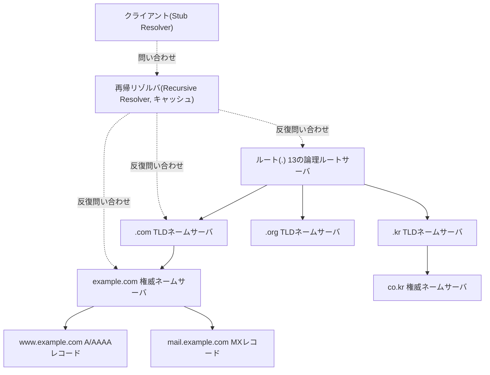
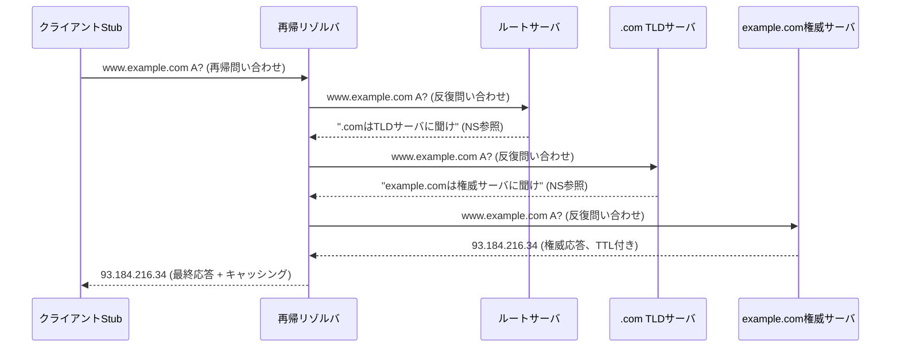
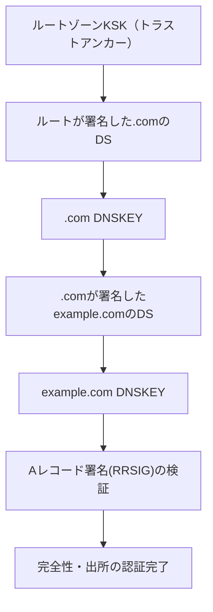

# DNS（Domain Name System）とDNSセキュリティ

## 1. 概要

> **定義**：DNS（Domain Name System）とは、人間が覚えやすいドメイン名（例：`www.example.com`）を、コンピュータが通信に使用するIPアドレス（例：`93.184.216.34`）へ相互に変換する、階層的・分散型（hierarchical & distributed）のグローバルな名前解決（name resolution）体系である。

インターネット黎明期には、すべてのホストの名前とアドレスを単一のテキストファイル（`HOSTS.TXT`）に収め、中央から配布していた。しかし接続ホスト数が爆発的に増加するにつれ、この単一ファイル方式は配布の遅延、名前の衝突、更新のボトルネックという三つの限界を露呈した。すなわち中央集権型の静的ファイルはインターネットの規模拡大（scalability）に耐えられず、これを解決するために1983年、Paul Mockapetrisが階層的な名前空間と分散データベースという発想を組み合わせたDNSを設計した（RFC 882/883、その後RFC 1034/1035として標準化）。DNSの本質的な価値は、「名前空間をツリー構造で階層化し、各ゾーン（zone）の管理権限を独立した主体へ委任（delegation）することで、世界中のどの組織も中央の承認なしに自らの名前を管理できる」ようにした点にある。

DNSがなければ、すべてのWeb・メール・API通信はIPアドレスを直接指定しなければならず、サーバ移転や負荷分散のたびに世界中のクライアントを一つひとつ修正しなければならない。逆にDNSがあるからこそ、ドメインという「間接層（indirection layer）」を介してサービスと物理的な位置を分離（decoupling）でき、これがCDN・GSLB（グローバル負荷分散）・メールルーティング・サービスディスカバリなど現代のインターネット基盤の土台となっている。ただしDNSは設計当時「可用性と拡張性」を最優先とし、「認証と機密性」を考慮しなかったため、今日ではキャッシュポイズニング・増幅DDoS・プライバシー露出といった構造的脆弱性を抱えており、これを補完するDNSSEC・DoH/DoTを併せて扱う必要がある。

特徴を要約すると、①ツリー型の階層的名前空間、②管理権限の委任による分散運用、③TTLベースのキャッシングによる性能・拡張性の確保、④UDP/53を中心とする軽量な問い合わせ、⑤結果整合性（eventual consistency）志向、と整理できる。

DNSはよく「インターネットの電話帳」に例えられるが、この比喩は規模と動作方式を過小評価している。電話帳が静的なリストであるのに対し、DNSは世界中の数億のドメインを対象に毎秒数百万件以上の問い合わせをリアルタイムに分散処理する動的システムであり、どの組織も全体を所有していないという点で、インターネットの「分散協調」の哲学を最もよく体現した基盤である。そのためDNSはWeb（HTTP）よりも先に動作する「あらゆる通信の最初の関門」であり、DNSが停止すれば、IPを直接知っているごく少数を除き、事実上すべてのサービスが接続不能になる。まさにこの「普遍的な依存性」のために、DNSの性能・可用性・セキュリティは個別サービスの問題ではなく、インターネット全体の信頼性の問題として扱われる。

## 2. DNSの名前空間と全体構造

DNSの名前空間は、最上位のルート（root, `.`）を頂点とし、その下にTLD（Top-Level Domain）、第2レベルドメイン、サブドメインへと下っていく逆ツリー（inverted tree）構造である。各ノードは最大63バイトのラベル（label）を持ち、FQDN（Fully Qualified Domain Name）全体は255バイトを超えることができない。この階層構造が重要な理由は、名前の「一意性（uniqueness）」を局所的に保証するだけで済むようにするからである。すなわち`example.com`ゾーンの管理者は自ゾーン内で名前の衝突を防ぐだけでよく、世界全体と調整する必要はない。

権限の委任は「ゾーン（zone）」単位で行われる。ゾーンとは一つの管理主体が責任を負う名前空間の連続した部分であり、上位ゾーンは下位ゾーンの権威ネームサーバ（authoritative name server）をNSレコードで指し示す方式で委任する。例えばルートは`.com` TLDを委任し、`.com` TLDは`example.com`のネームサーバを委任する。この委任の連鎖のおかげで、どのサーバも全データを保有することなく、グローバルな名前解決が可能となる。

DNS基盤を構成する中核的な主体は四つである。第一に、**スタブリゾルバ（stub resolver）**はOSやブラウザに組み込まれた最小機能のクライアントであり、問い合わせを再帰リゾルバに委ねる。第二に、**再帰リゾルバ（recursive resolver, caching resolver）**はクライアントに代わってルート→TLD→権威サーバを順に訪問して最終的な回答を見つけて返し、その結果をTTLの間キャッシュする。ISPのリゾルバやGoogleの`8.8.8.8`、Cloudflareの`1.1.1.1`が代表例である。第三に、**権威ネームサーバ（authoritative server）**は特定ゾーンの原本データを保有する最終的な根源である。第四に、**ルートサーバ**は13の論理アドレス（A〜M）で運用されるが、実際にはAnycast技術によって世界中の数千の物理インスタンスに複製され、可用性と応答速度を確保している。

この構造における中核的な性能メカニズムは**キャッシング**である。各レコードにはTTL（Time To Live）が付与され、再帰リゾルバはTTLが切れるまで上位サーバへ再問い合わせしない。TTLが短いと変更の反映は速いがルート・TLDの負荷が大きくなり、長いと負荷は減るがIP変更時の世界的な反映が遅れる。そのため、サーバ移転を計画する際には事前にTTLを300秒などに下げておくのが実務上の慣行である。このキャッシングこそがDNSを「結果整合性」システムにする原因であり、同時にキャッシュポイズニング（cache poisoning）攻撃の標的となる箇所でもある。

## 3. DNSの動作原理 — 再帰問い合わせと反復問い合わせ

DNSの名前解決は、性格の異なる二つの問い合わせ方式が組み合わさって行われる。クライアントと再帰リゾルバの間では**再帰問い合わせ（recursive query）**が使われる。クライアントは「完成した回答をくれ」と要求し、リゾルバは回答を見つける責任を負う。一方、リゾルバと各階層のサーバの間では**反復問い合わせ（iterative query）**が使われる。各サーバは自身が回答を知らなければ、「さらに下に聞け」と下位サーバへの参照（referral）だけを返す。この役割分担が重要な理由は、重い探索作業をリゾルバ1か所に集中させ、その結果をキャッシュして再利用することで、インターネット全体の問い合わせ総量を劇的に減らせるからである。

具体的な流れを見ると、利用者が`www.example.com`を要求すると、スタブリゾルバが再帰リゾルバに再帰問い合わせを送る。リゾルバはキャッシュに回答がなければまずルートサーバに問い合わせ、ルートは`.com` TLDサーバのNS参照を返す。リゾルバは再びTLDサーバに問い合わせて`example.com`権威サーバの参照を得て、最後に権威サーバから実際のAレコード（`93.184.216.34`）を受け取ってクライアントに渡し、TTLの間キャッシュする。最初の問い合わせはこのように複数の往復（round-trip）を経るが、以後の同一・類似の問い合わせはキャッシュから即座に処理され、数ミリ秒以内に応答される。実務においてキャッシュヒット率は通常80〜90%以上であり、DNS全体の問い合わせの大半は上位サーバに到達せず、リゾルバのキャッシュで完結する。

トランスポート層の観点では、DNSは基本的に**UDPポート53**を使用する。名前解決は単発・小容量であるため、コネクション確立のオーバーヘッドがないUDPが有利だからである。ただし応答が512バイトを超える場合（従来のUDPの限界）や、ゾーン転送（zone transfer、AXFR/IXFR）のように信頼性が必要な場合には、**TCPポート53**へフォールバック（fallback）する。DNSSEC署名データのように応答が大きくなった現代の環境では、**EDNS0**（RFC 6891）でUDPペイロードを4096バイトまで拡張し、TCPでの再試行を減らすのが標準的な慣行である。

権威サーバの可用性は、**プライマリ/セカンダリ（primary/secondary、master/slave）の冗長化**で確保する。原本のゾーンデータはプライマリサーバが保有し、セカンダリサーバは**ゾーン転送（zone transfer）**でこれを複製する。このとき毎回全体をコピーするAXFRの代わりに、変更分だけを転送する**IXFR（Incremental Zone Transfer）**を用いれば帯域を節約でき、SOAレコードのシリアル番号（serial number）の増加を検知して更新の要否を判断する。ゾーン転送は内部トポロジを露出させる可能性があるため、必ず認可されたセカンダリサーバのみに制限し、TSIG（Transaction Signature）で認証することがセキュリティ上の原則である。この冗長構成があるからこそ、プライマリサーバの障害時にも複数の権威サーバが応答を続け、DNSの高い可用性が維持される。

性能最適化において見落とされがちな要素が、**ネガティブキャッシュ（negative caching、RFC 2308）**である。存在しない名前（NXDOMAIN）に対する応答もキャッシュされることで、繰り返される無効な問い合わせが上位サーバへ流れるのを防げる。このときのキャッシュ時間は、当該ゾーンのSOAレコードの最小TTL値によって決まる。もしネガティブキャッシュがなければ、タイプミスやボットによる存在しないサブドメインへの問い合わせが権威サーバにそのまま到達して負荷を増大させ、実際にNXDOMAINの大量送信（flood）はDDoS手法の一つとして悪用されている。このように「存在しない」という回答さえもキャッシュ対象とする設計が、DNSの拡張性を支えている。

## 4. 主要なリソースレコード（Resource Record）の種類

DNSデータの基本単位はリソースレコード（RR）であり、各レコードは`名前 / TTL / クラス(IN) / 種類 / 値`で構成される。レコードの種類を理解することは単なる暗記ではなく、「各種類がどのようなサービス要求を満たすために存在するのか」を把握する問題である。例えばA/AAAAはWebアクセスの終着点を、MXはメールルーティングを、SRVはサービスディスカバリを、CAAは証明書発行の統制をそれぞれ担う。以下の表は補助的な整理であり、実際の答案では各レコードが登場する文脈を併せて記述するとよい。

| 種類 | 役割 | 例/備考 |
|------|------|-----------|
| A | ドメイン → IPv4アドレス | `www.example.com → 93.184.216.34` |
| AAAA | ドメイン → IPv6アドレス | IPv6移行に必須 |
| CNAME | 別名（正規名への委任） | ルートドメインでは使用制約あり |
| MX | メールサーバの指定（優先度付き） | 優先度の値が小さいほど優先 |
| NS | ゾーンの権威ネームサーバの委任 | 委任の連鎖の中核 |
| SOA | ゾーンの開始・管理情報（シリアル・更新周期） | ゾーンごとに1つ |
| PTR | IP → ドメイン（逆引き） | `in-addr.arpa` |
| TXT | 任意のテキスト（SPF・DKIM・検証） | メール認証で広く活用 |
| SRV | サービスの位置（ホスト・ポート） | SIP・LDAPなど |
| CAA | 証明書を発行可能なCAの制限 | 誤発行の防止 |
| DNSKEY/RRSIG/DS/NSEC | DNSSECの署名・検証・不在証明 | 第6節の深掘りを参照 |

逆引き（reverse lookup）を担う**PTRレコード**も実務上の意味が大きい。正引きが名前→IPであるのに対し、PTRはIP→名前を解決し、`in-addr.arpa`（IPv4）・`ip6.arpa`（IPv6）という特殊ドメインの下にIPを逆順に並べて表現する。PTRの代表的な活用先は**メールサーバのスパムフィルタリング**であり、受信側メールサーバは送信元IPの逆引き結果が正引きと一致するか（forward-confirmed reverse DNS）を検査して、偽装された送信者を排除する。したがって自前のメールサーバを運用する際にPTRが未設定であると、正常なメールがスパムとして処理される事態につながり得る。これはDNSレコード一つがサービスの信頼性に直結する具体的な事例である。

CNAMEとAレコードの違いは、実務でよく混同される点である。Aは名前をIPに直接対応させるのに対し、CNAMEは名前を別の「正規名（canonical name）」へ委任する。CNAMEの連鎖は柔軟だが追加の問い合わせを引き起こして遅延を増やし、ルートドメイン（zone apex）ではSOA・NSと共存できないというRFCの制約のため使用できない。これを回避するため、CDN事業者はALIAS/ANAMEのようなベンダー拡張レコードを提供している。もう一つの実務事例として、メールのなりすまし防止のための**SPF・DKIM・DMARC**はいずれもTXTレコードにポリシーを格納して配布しており、これはDNSが単なるアドレス変換を超えて「信頼ポリシーの配布チャネル」として活用される代表例である。

## 5. DNSのセキュリティ脅威と比較

DNSは完全性・認証の仕組みなしに設計されたUDPベースのプロトコルであるため、多様な脅威にさらされている。脅威を列挙するだけにとどまらず、「なぜその攻撃が成立するのか」という構造的原因と併せて理解しなければならない。

**キャッシュポイズニング（Cache Poisoning）**は、攻撃者が再帰リゾルバに偽造した応答を先に注入し、リゾルバに誤ったIPをキャッシュさせる攻撃である。UDPは送信元の検証が弱く、応答の真偽は問い合わせID（16ビット）と送信元ポートでしか照合されないため、総当たりの推測が可能であった。2008年にDan Kaminskyが発表した手法は、サブドメインを利用して推測の機会を無限に繰り返すことでこの脆弱性の深刻さを立証し、その対策として**送信元ポートのランダム化（source port randomization）**と、最終的にはDNSSECの導入が促進された。**DNS増幅・反射DDoS（Amplification/Reflection）**は、小さな問い合わせで大きな応答を引き起こすDNSの特性（増幅率は数十倍）とUDPの送信元偽装の可能性を組み合わせ、被害者のIPに大量の応答を浴びせる攻撃である。2016年のMiraiボットネットによるDynへのDNS攻撃は、DNS基盤そのものが攻撃対象となった場合に、Twitter・Netflixなど多数のサービスが同時に麻痺し得ることを示した代表的な事例である。このほかにも、**DNSトンネリング**（DNS問い合わせにデータを隠蔽してセキュリティ機器を回避する漏えい・C2チャネル）、**サブドメインテイクオーバー（subdomain takeover）**、**ドメインハイジャック**（レジストラアカウントの乗っ取り）などがある。

| 脅威 | 根本原因 | 主な対策 |
|------|-----------|-------------|
| キャッシュポイズニング | 応答の真偽検証の欠如（16ビットID） | DNSSEC、ポートのランダム化、0x20エンコーディング |
| 増幅DDoS | UDPの送信元偽装 + 大きな応答 | RRL（応答レート制限）、Anycast、BCP38 |
| DNSトンネリング | 問い合わせペイロードの監視不足 | トラフィック分析・異常検知、ペイロード検査 |
| サブドメインテイクオーバー | 放置されたCNAME委任 | 未使用レコードの整理、所有権の検証 |
| ドメインハイジャック | レジストラアカウントの脆弱性 | レジストリロック、MFA、DNSSEC |

さらに、DNSは攻撃インフラの隠蔽にも悪用される。マルウェアが毎日大量のランダムなドメインを生成し、そのうち一部だけをC2サーバとして登録する**DGA（Domain Generation Algorithm）**は単純なブラックリスト遮断を無力化し、視覚的に類似したドメインを登録して利用者を欺く**タイポスクワッティング（typosquatting）・IDNホモグラフ攻撃**はフィッシングの常套手段である。このような脅威は静的な遮断だけでは対処が難しいため、問い合わせパターンのエントロピー分析・機械学習ベースのドメイン評価といった動的検知手法が併せて求められる。実際に大手セキュリティ事業者は、1日数千億件のDNS問い合わせログを分析して新規の悪性ドメインを早期に特定している。

脅威への対策はそれぞれ異なる層で機能するため、併せて理解しなければならない。例えばDNSSECは「完全性・認証」を提供するが「機密性」は提供しないため、プライバシーの問題はDoH/DoTが別途解決する。逆にDoH/DoTは伝送区間の暗号化によって盗聴・改ざんは防ぐが、リゾルバが返したデータが「本物の権威サーバの回答」であることまでは保証できないため、DNSSECと相互補完的である。このように一つの仕組みですべての脅威をカバーできないという点が、DNSセキュリティの中核的な含意である。

## 6. 深掘り — DNSSECと暗号化DNS（DoH/DoT）の最新動向

DNSSEC（DNS Security Extensions、RFC 4033〜4035）は、各レコード集合（RRset）にデジタル署名（RRSIG）を付与し、その検証鍵（DNSKEY）の真正性を上位ゾーンのDSレコードで結び付ける「信頼の連鎖（chain of trust）」によって、応答の偽造・改ざんの有無を検証する。信頼の最上位はルートゾーンの公開鍵であり、これを定期的に交換する**KSKロールオーバー（Key Signing Key Rollover）**は2018年に初めて実施され、世界中のリゾルバが一斉に新しいルート鍵を信頼するよう切り替えた歴史的な事例である。存在しない名前に対する偽造応答を防ぐため、DNSSECは**NSEC/NSEC3**によって「不在証明（authenticated denial of existence）」を提供するが、NSECが名前をそのまま露出してゾーンウォーキング（zone walking）に悪用される問題を、NSEC3がハッシュによって補完している。

クラウドネイティブ環境において、DNSの役割はむしろ拡大している。Kubernetesは**CoreDNS**をクラスタ内部のDNSとして使用し、Pod・Serviceに`service.namespace.svc.cluster.local`形式の名前を付与して、マイクロサービス間の**サービスディスカバリ（service discovery）**を実現する。すなわちサービスがスケールイン/アウトしてIPが変わり続けても名前は固定されるため、呼び出し側はIPの変化を意識せずに通信できる。また、企業の内部網と外部に異なる応答を返す**スプリットホライズンDNS（split-horizon）**は、同一ドメインであっても内部利用者にはプライベートIPを、外部利用者にはグローバルIPを提供して、内部資産の露出を減らす実務的な手法である。このようにDNSは、従来のインターネットの名前解決を超えて、コンテナ・ゼロトラスト環境の中核的な制御ポイントへと進化している。

一方、DNSSECが扱えない「プライバシー」を狙って登場したのが暗号化DNSである。**DoT（DNS over TLS、RFC 7858）**はポート853でTLSによって問い合わせを暗号化し、**DoH（DNS over HTTPS、RFC 8484）**はポート443でHTTPSトラフィックにDNSを載せ、一般のWebトラフィックと区別できないようにする。Cloudflare・Google・Mozillaは公開DoHリゾルバを運用し、ブラウザでのデフォルト適用を拡大してきた。ただしDoHはプライバシーを強化すると同時に、企業のセキュリティ機器がDNSを監視・遮断しにくくなるため、「ネットワーク可視性の低下」というトレードオフを生む。そのため多くの企業は、内部リゾルバを強制するポリシーとDoH検知を併用している。最新の流れとしては、SNI（Server Name Indication）まで隠す**ECH（Encrypted Client Hello）**や、「Oblivious DoH」のようにリゾルバでさえ問い合わせ元と問い合わせ内容を同時には知り得ないようにするプライバシー強化技術が議論されている。正確な展開状況は標準・実装ごとに流動的であるため、導入時には最新のRFCとベンダー文書を確認することが望ましい。

## 7. 考慮事項および示唆点（技術士の観点）

**第一に、可用性・セキュリティ・プライバシーのバランスある設計。** DNSはインターネットの単一障害点（SPOF）になりやすいため、権威サーバを地理的に分散し、複数のDNS事業者を併用（multi-provider）し、Anycastを適用することが必須である。これにDNSSEC（完全性）とDoH/DoT（機密性）を階層的に組み合わせるが、DoHがもたらすネットワーク可視性の低下と企業のセキュリティポリシーとの間のトレードオフを事前に調整しなければならない。

**第二に、TTL・多重化に基づく運用戦略。** サービス移転・フェイルオーバー（failover）の状況に備えて平常時のTTLポリシーを計画的に管理し、GSLB・ヘルスチェックと連動したDNSベースの負荷分散で遅延を減らしつつ、TTLが短すぎて上位インフラの負荷を増大させないようトレードオフを調整する。キャッシュ無効化の遅延が障害復旧時間（RTO）に直結することを認識しなければならない。特にDNSベースのGSLBは、利用者の位置・サーバ負荷・遅延時間を基準に最適なデータセンターのIPを返して世界中のトラフィックを分散するが、クライアント・中間リゾルバのキャッシングのため、障害ノードへのルーティングがTTLの間残存するという限界がある。そのため大規模サービスでは、DNSベースの分散を一次層としつつ、エニーキャスト・L4/L7ロードバランサと多層的に組み合わせて、即時の障害迂回を補完するのが定石である。

**第三に、DNSをセキュリティ監視の中核軸として活用。** マルウェアのC2・フィッシング・データ漏えいの大半はDNSを経由するため、**Protective DNS（保護DNS）**・DNSファイアウォール（RPZ, Response Policy Zone）・DNSログに基づく異常検知をSIEM・XDRと連携させれば、脅威を早期に遮断できる。DNSは「攻撃の通路」であると同時に最も効果的な「検知ポイント」でもあるという両面性を、戦略的に活用すべきである。

**第四に、標準の移行期におけるガバナンスと検証体制。** IPv6（AAAA）の全面化、ルートKSKロールオーバー、暗号化DNSの普及など標準は変化し続けるため、組織はDNSSEC署名・検証の自動化、レジストリロックとMFAによるドメインハイジャック防止、未使用レコードの整理によるサブドメインテイクオーバーの予防など、運用ガバナンスを体系化しなければならない。今後は、ゼロトラストアーキテクチャとの連携、クラウドネイティブ環境の内部サービスディスカバリ（CoreDNSなど）によって、DNSの役割はさらに拡大する見通しである。

**第五に、インフラの所有・コスト構造とサプライチェーンの観点。** DNS運用を自前で構築するか、マネージドDNS（Managed DNS）事業者に委託するかは、可用性・コスト・統制権のトレードオフの問題である。委託は世界規模のエニーキャスト基盤を即座に活用できるためコスト効率が高いが、特定事業者への依存（vendor lock-in）と、その事業者の障害がそのまま自社サービスの麻痺に直結するサプライチェーンリスクを生む。実際に大手DNS事業者の障害が多数のサービスの同時停止に波及した事例がこのリスクを裏付けているため、複数事業者の併用と障害時の自動切り替え（failover）の設計を併せて検討しなければならない。さらに、ドメイン名前空間はICANN・レジストリ・レジストラへと続くガバナンス体系の上に存在するため、ドメインの有効期限・所有権の管理を組織の資産管理プロセスに正式に組み込み、「ドメイン失効によるサービス停止」という初歩的な事故を予防しなければならない。

## 参考資料
- RFC 1034/1035, Domain Names — Concepts and Implementation/Specification, IETF
- RFC 4033/4034/4035, DNS Security Introduction and Requirements (DNSSEC), IETF
- RFC 7858, Specification for DNS over Transport Layer Security (DoT), IETF
- RFC 8484, DNS Queries over HTTPS (DoH), IETF
- RFC 6891, Extension Mechanisms for DNS (EDNS0), IETF
- ICANN, KSK Rollover関連文書: https://www.icann.org/resources/pages/ksk-rollover
- Cloudflare Learning Center, What is DNS?: https://www.cloudflare.com/learning/dns/what-is-dns/
- RFC 2308, Negative Caching of DNS Queries (DNS NCACHE), IETF
- ICANN Root Server System（Anycast/ルートサーバ運用）: https://www.iana.org/domains/root/servers

---
> **一言まとめ**: DNSはドメイン名をIPに変換する階層的・分散型の名前解決体系であり、委任とキャッシングによって拡張性を確保するが、設計上の認証・機密性の欠如によりキャッシュポイズニング・増幅DDoSなどに脆弱であるため、これをDNSSEC（完全性）とDoH/DoT（機密性）で補完することが核心である。
