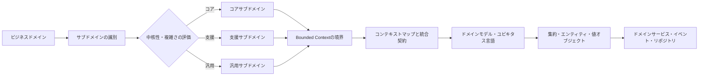
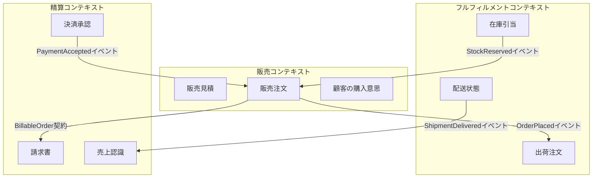
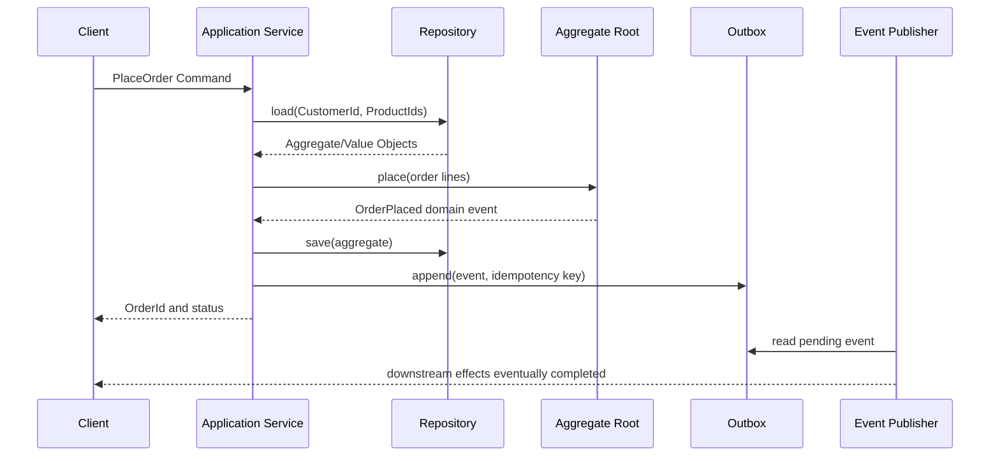

# ドメイン駆動設計（DDD, Domain-Driven Design）

## 1. 概要

> ドメイン駆動設計（DDD）とは、ソフトウェアの中心を技術フレームワークではなく業務ドメインの問題とモデルに置き、ドメインエキスパートと開発者が共有するモデルを反復的に発展させていく設計アプローチである。

企業システムは単なるデータの入力・照会プログラムを超え、商品・契約・精算・配送・規制といった業務ルールを組み合わせて意思決定を行う。
業務が複雑になるほど同じ言葉が部署ごとに異なる意味で使われ、一つの画面の変更が複数のシステムや組織のポリシーに連鎖的な影響を与える。
このとき、データベースのテーブルを先に作ってサービス画面を後付けする方式では、機能は速く作れても、ルールの所有権と変更の境界を説明することが難しい。
DDDはこうした複雑さをドメインモデル、言語、境界、不変条件として明らかにし、設計と実装の一貫性を高める。

DDDの核心は、特定のフレームワークやクラスパターンを機械的に適用することにあるのではない。
開発者はドメインエキスパートの表現に耳を傾けて候補となる概念をモデリングし、モデルが実際の業務上の意思決定を説明できなければ、再び問いかけて修正する。
したがってDDDは分析・設計・実装・テスト・運用をつなぐ思考方式であり、技術チームだけのリファクタリング技法に矮小化してはならない。

ドメイン（domain）はシステムが解決しようとする業務領域であり、サブドメイン（subdomain）はその領域を目的と責任に応じて分割した部分である。
コアサブドメインは競争力と差別化の源泉であるため、内部の能力で開発する価値が高い。
支援サブドメインは業務に必要だが差別化の度合いが相対的に低いため、標準製品や単純な内部サービスで実装できる。
汎用サブドメインはほとんどの組織が共通して必要とする機能であり、購買・認証・メールのようにパッケージや外部サービスを活用する方が合理的な場合がある。

DDDが必要かどうかは、システムの規模よりもルールの複雑さと変化の頻度で判断する。
ルールが単純な照会システムに重いドメインモデルを導入すると、開発速度の低下と運用の複雑化を招くだけになりかねない。
逆に割引・在庫・精算・権限・規制上の例外が絡み合うシステムでは、モデルがないとコードとデータに潜む暗黙のルールが急速に負債として蓄積する。
技術士はDDDの適用可否を流行ではなく、ドメインの複雑さ、変更コスト、組織構造、統合要件の観点から判断しなければならない。

## 2. DDDの全体概念図と設計原理

DDDは、戦略的設計で大きな境界を先に定め、戦術的設計で各境界内のモデルと責任を具体化する。
二つの段階は分かれているが、互いにフィードバックし合う。
戦略的な境界が誤っていれば、戦術パターンをいくら精緻に書いてもサービス間の結合と翻訳コストは減らない。

ドメインの分解は、組織の現在の部署図をコピーする作業ではない。
顧客という言葉が、営業では潜在的な購入者、注文では購入主体、債権では債務者として扱われ得ることを確認し、各業務のルールと責任を基準に境界を定める。
同じ用語をすべてのシステムで一つの巨大なオブジェクトに統一しようとすると不要な依存関係が生じるため、文脈による意味の違いを認めることがかえって一貫性を高める。

ユビキタス言語（ubiquitous language）は、ドメインエキスパートと開発者がモデル・コード・テスト・ドキュメントで共に使用する言語である。
会議では「予約確定」と言いながらコードでは`createOrder`として実装しているなら、言語とモデルの間に翻訳による損失が生じる。
用語集は出発点にすぎず、実際のモデルの属性・状態・振る舞い・エラーメッセージに至るまで同じ意味を保ったとき、初めて効果が現れる。

ドメインモデルはデータ構造の集合ではなく、業務ルールと意思決定の構造である。
例えば注文の合計金額は単に商品価格を足した値ではなく、割引の適用順序、税金の端数処理、配送条件を反映した結果である場合がある。
この計算ルールを画面のコントローラやバッチSQLに散在させると変更時に漏れが生じるため、モデルの中にルールの持ち主と不変条件を配置する。

表はDDDの主要な概念を素早く対比するための補助手段である。
各概念は独立したチェックリストではなく、モデルの意味と責任を結び付ける関係として理解しなければならない。

| 概念 | 中核的な問い | 主な責任 | よくある誤解 |
|---|---|---|---|
| ドメイン | どのような業務上の問題を解くのか？ | 問題の範囲と目的の定義 | データベース自体をドメインとみなすこと |
| サブドメイン | どこまでが一つの業務能力か？ | コア・支援・汎用領域の区分 | 部署の組織図をそのままコピーすること |
| 境界づけられたコンテキスト | どのモデルと言語が有効か？ | モデルの適用境界と契約の定義 | すべてのコンテキストが同じオブジェクトを共有すること |
| エンティティ | 時間とともに同じ対象を追跡すべきか？ | 識別子とライフサイクルの管理 | すべてのテーブルをエンティティにすること |
| 値オブジェクト | 値そのものが意味であり識別子が不要か？ | 不変の値と検証のカプセル化 | 文字列・数値を無制限に受け渡すこと |
| 集約 | どの変更を一つの一貫性境界にまとめるか？ | 不変条件の保護とトランザクション境界 | すべてのオブジェクトを一つの大きなルートに入れること |
| ドメインイベント | どのような業務上の事実が発生したか？ | コンテキスト間での事実の伝達 | 単なるログメッセージと同一視すること |

DDDの原理は「すべてをオブジェクトにしよう」ではない。
どのルールが即座に同時に満たされなければならないか、どの情報はイベントで後から反映してもよいかを区別することがモデリングの核心である。
この区別が、トランザクションの範囲、ストレージ構造、API契約、障害復旧の方式までを決定する。

## 3. 戦略的設計：サブドメインと境界づけられたコンテキスト

### 3.1 サブドメインの分類と投資優先順位

サブドメインの分類は、経営戦略とアーキテクチャ上の決定を結び付ける。
コアサブドメインは顧客が他の事業者と区別して認識する能力であり、実装の難度が高くルールが頻繁に変わる領域である可能性が高い。
したがってコア領域にはドメインエキスパートと熟練した開発者を配置し、モデルの品質とテストに投資する。

支援サブドメインはコア業務を補助するが、それ自体の競争優位は低い。
例えば製造企業において生産最適化がコアであれば、一般的な人事・電子決裁は支援または汎用領域に分類され得る。
支援領域を無条件に外部化するのではなく、統合コスト、データ主権、セキュリティ、変更要求を併せて比較して決定する。

汎用サブドメインは、多くの組織が類似の方法で解決している能力である。
この領域で独自のモデルを直接作ると保守コストが不必要に増加し得るため、標準ソリューションを使用し、差別化領域に能力を集中させる。
ただしパッケージを導入する場合でも、内部の用語と外部の用語の違いを翻訳層で管理しなければ、コアモデルが汚染される。

事業ポートフォリオとサブドメインの分類は固定された真実ではない。
規制の変化や事業戦略によって汎用機能がコア能力に変わることもあり、外部プラットフォームの価格・依存性の変化も再評価の要因となる。
分類結果には重要度だけでなく、変更頻度、失敗コスト、確保可能な専門性、外部代替の可能性を併せて記録する。

### 3.2 境界づけられたコンテキストとモデルの境界

境界づけられたコンテキスト（Bounded Context）は、特定のドメインモデルとユビキタス言語が有効となる明示的な境界である。
境界の内側では「顧客」「注文」「状態」の意味と不変条件を一貫して維持するが、境界を越えるときはAPI・イベント・トランスレータを介して必要な情報だけを交換する。
こうすることでモデルの内部実装を隠し、各チームが自らの業務ルールを独立して変更できるようになる。

コンテキストの境界はデータベーススキーマの境界と一致することもあるが、常に同じではない。
一つのコンテキストが複数のストアを使用することもでき、初期には一つのデータベース内で論理スキーマを分離した後、段階的に物理的に分離することもできる。
重要なのは格納場所よりも、モデルの所有権と変更契約を明確にすることである。

境界を定める際には、用語の意味、変更の理由、トランザクションの一貫性、チームの責任、外部連携、セキュリティ等級を併せて見る。
同じ変更理由を持つ機能は近くに置き、異なる理由で変更される機能は不必要にまとめない。
マイクロサービスの数を先に決めてからドメインを当てはめると、分散モノリスになるリスクが高まる。

上記の構造において、販売注文と出荷注文は互いに関連するが同じオブジェクトではない。
販売は価格・顧客への約束・注文状態を管理し、フルフィルメントは物理的な在庫と配送可能性を管理する。
販売コンテキストがフルフィルメントの内部在庫オブジェクトを直接変更すると二つのチームの変更が結合するため、注文受付イベントと出荷要求の契約によって必要な事実だけを伝達する。

### 3.3 コンテキストマップと統合関係

コンテキストマップは、境界づけられたコンテキスト間の依存の方向と関係の種類を可視化する。
共有カーネル（Shared Kernel）は複数のチームが共同で維持するモデルの一部であり、変更の合意と共同テストが必要である。
共有カーネルは再利用のように見えるが、変更調整のコストがすべてのチームに波及するため、小さく安定した値に限定するのが安全である。

顧客・供給者の関係では、アップストリームが契約を提供し、ダウンストリームがそれを消費する。
ダウンストリームがアップストリームのモデルにそのまま従うべきか、翻訳層を置いて内部モデルを保護すべきかを決定しなければならない。
供給者の変更が頻繁であったり信頼性が低かったりする場合は、腐敗防止層（ACL）で外部モデルを内部の言語へ変換する。

公開ホストサービスは、複数の消費者が利用できる標準化された公開契約を提供する。
公表された言語（Published Language）は、イベントスキーマやAPIドキュメントのように複数のコンテキストが合意した表現である。
この関係は便利であるが、契約のバージョン管理と後方互換性のテストがなければ、コンテキスト間の結合が再び大きくなる。

| 関係 | 意味 | 適用時点 | 統制ポイント |
|---|---|---|---|
| 共有カーネル | モデルの一部を共同所有 | ドメインの強い共通性と緊密な協業 | 変更承認・共同テスト |
| 顧客-供給者 | アップストリームが契約を提供 | 業務フロー上、供給方向が明確なとき | 契約バージョン・影響分析 |
| 順応者 | ダウンストリームがアップストリームのモデルを受容 | 外部モデルを変える実益が小さいとき | 内部汚染範囲の制限 |
| 腐敗防止層 | 外部モデルを内部モデルに翻訳 | レガシー・パッケージとの連携時 | 変換ルール・エラー処理 |
| イベント協調 | 業務上の事実を非同期に共有 | 時間的結合を減らしたいとき | 重複・順序・再処理 |

## 4. 戦術的設計：モデルの構成要素と実行フロー

### 4.1 エンティティと値オブジェクト

エンティティは、属性が変わっても識別子によって同一性を維持するオブジェクトである。
注文番号が同じ注文は配送先住所が変更されても同じ注文であるが、住所そのものは値の組み合わせで意味が完結し得る。
エンティティの識別子はデータベースの自動採番値でもよいが、業務的に意味のある識別子と技術的な識別子を分離する方が外部契約にとって有利である。

値オブジェクト（Value Object）は、属性の値と不変条件によって同一性を判断する。
金額は単なる数値一つではなく、通貨と精度と端数処理ルールを含み得るし、メールアドレスは形式と正規化ルールを含み得る。
値オブジェクトを不変にすれば共有による副作用が減り、不正な状態をコンストラクタやファクトリで遮断できる。

プリミティブ型をあらゆる場所で受け渡す「基本データ型への執着」は、単位の混同と検証漏れを引き起こす。
例えば`1000`という値だけでは、ウォン建ての金額なのかポイントなのか、付加価値税込みなのかが分からない。
`Money`、`CustomerId`、`DeliveryAddress`のような意味のある型は、コンパイラとテストが業務ルールを守るのを助ける。

### 4.2 集約と不変条件

集約（Aggregate）は一つの一貫性境界として扱うオブジェクトのまとまりであり、外部は集約ルートを通してのみ内部を変更する。
注文をルートとすれば、注文明細を直接変更する代わりに、注文の`addLineItem`のような振る舞いを通じて数量・価格・状態のルールを守らせる。
集約はオブジェクトを多く束ねる設計ではなく、必ず一緒に一貫していなければならない最小単位を見つける設計である。

集約が大きすぎると、毎回ロックすべきデータとトランザクションが増えて並行性が低下する。
逆に小さすぎると、一つの業務コマンドを処理するために複数の集約を同時に変更しなければならず、分散トランザクションや補償処理が必要になる。
したがって境界は、オブジェクトの自然な包含関係よりも、不変条件と変更頻度、並行処理のパターンによって決定する。

集約間の参照は、オブジェクトを直接保持するよりも識別子で表現するのが一般的である。
注文が顧客オブジェクト全体を保持すると顧客モデルの変更が注文モデルに波及するため、`CustomerId`だけを保存し、必要な顧客情報は別途の照会やイベントで得る。
この方式は結合を下げるが、照会の一貫性とキャッシュの鮮度の問題を併せて設計しなければならない。

### 4.3 ドメインサービスとアプリケーションサービス

ドメインサービスは、一つのエンティティに自然に帰属させにくいドメインルールを表現する。
二つの口座間の資金移動のように複数の集約の協調が必要な場合や、為替レートの照会のように特定オブジェクトの本質的な責任ではないルールが、ドメインサービスの候補となる。
しかしすべての計算をサービスに送るとドメインモデル貧血症に陥るため、まずエンティティと値オブジェクトに責任を配置し、残ったルールだけをサービスに置く。

アプリケーションサービスは、利用者のユースケースを調整する。
コマンドを受け取って権限を確認し、リポジトリから集約を取得してドメインの振る舞いを呼び出し、トランザクションとイベント発行を調整する。
業務ルールそのものをアプリケーションサービスに直接書くと複数のエントリポイントでルールが複製されるため、サービスはフローの調整役に近い形で維持する。

ドメインサービスとアプリケーションサービスの区別は、レイヤーの名前の問題ではない。
「この顧客はVIPか」のように業務上の意味を持つ計算はドメインに属し得るし、「HTTP要求を受け取ってJSONに変換する」という技術的なフローはアプリケーション・インタフェース層に属する。
責任が変更される理由を基準に配置を決めることで、テストと保守が容易になる。

### 4.4 ドメインイベントとリポジトリ

ドメインイベントは、ドメインにおいて意味のある事実が発生したことを表す。
`OrderPlaced`、`PaymentAccepted`、`ShipmentDelivered`のようなイベントは過去形で表現し、発行者が消費者の内部実装を知らなくて済むようにする。
イベントはコマンドとは異なるため、「在庫を減らせ」よりも「注文が受け付けられた」のように事実を伝えることが、コンテキスト間の結合を減らす。

リポジトリは、集約の保存と復元をドメインの観点からのコレクションのように抽象化する。
ドメイン層はSQLやORMの詳細の代わりに`findById`、`save`のような意味のある契約を使い、インフラ層がそれを実装する。
ただしすべての照会をリポジトリのオブジェクトモデルで処理すると複雑なレポート照会の性能が低下し得るため、読み取り専用のクエリモデルを別途置く判断も必要である。

イベントの発行と保存を分離すると、保存は成功したがイベントが消失するという問題が生じ得る。
これを緩和するため、同じローカルトランザクションでドメインイベントをアウトボックスに記録し、別の配信者がリトライするアウトボックスパターンを適用できる。
この場合、消費者は重複したイベントを受け取り得るため、イベントIDと冪等キーを基準に重複処理を設計しなければならない。

### 4.5 コマンド処理の基本フロー

DDDのアプリケーションは通常、入力アダプタ、アプリケーションサービス、ドメインモデル、ストレージ・メッセージ基盤というフローで実装される。
入力DTOをそのままエンティティとして公開せず、コマンドオブジェクトに変換すれば、外部API契約と内部モデルの変更速度を切り離せる。

このフローにおいて、集約は価格と状態の不変条件を検証し、アプリケーションサービスはトランザクション境界を調整する。
アウトボックスへの記録が同じトランザクションに含まれていなければ、注文は保存されたのに在庫引当イベントが消えてしまう可能性がある。
逆に、消費者側のイベント処理結果を即座に利用者へ確定状態として表示すると非同期の遅延を誤解させ得るため、`受付済み`と`処理完了`の状態を区別しなければならない。

## 5. DDDと類似アプローチの比較

### 5.1 DDDとデータ中心設計

データ中心設計は、正規化、整合性、照会性能、データ統合を重視する。
DDDは、データがどのような業務上の振る舞いとルールを表現しているのか、変更の責任がどこにあるのかを重視する。
二つの方式は対立するものではなく、複雑なシステムではドメインモデルとリレーショナルな保存モデルとの間のマッピングが必要となる。

テーブル中心に注文・顧客・商品を一つの共通モデルにまとめるとレポート作成は楽に見えるが、販売・フルフィルメント・精算の異なるルールが一つのスキーマに絡み合う可能性がある。
DDDはコンテキストごとに必要なモデルを許容し、統合的な照会は別の読み取りモデルやデータプロダクトとして提供する。
その代わりに重複データと同期のコストを受け入れなければならないため、一貫性の要求と照会の利便性のバランスが必要である。

### 5.2 DDDとマイクロサービス

マイクロサービスはデプロイ・スケーリング・障害分離の単位を小さくするアーキテクチャスタイルであり、DDDは業務モデルと境界を発見する設計アプローチである。
DDDの境界づけられたコンテキストはマイクロサービスの候補となり得るが、一つのコンテキストを複数のサービスに分けることもでき、複数のコンテキストを初期には一つのモジュラーモノリスとして実装することもできる。
DDDを根拠なくサービス分割の名目として用いると、ネットワーク呼び出しと運用の複雑さが増すだけである。

モジュラーモノリスは、コンテキスト間のモジュールと契約を守りつつ、デプロイ単位は一つに保つ方式である。
ドメイン境界を検証しチームの運用能力を確保した後に、変更の衝突やスケーリングの要求が明確なコンテキストだけをサービスとして抽出する段階的な戦略に適している。
一方、独立したデプロイと強い障害分離が最初から必要な大規模組織では、コンテキストごとのサービスが合理的な場合がある。

| 比較基準 | DDD | データ中心設計 | マイクロサービス |
|---|---|---|---|
| 主な関心 | 業務の意味と変化の境界 | データの整合性と活用 | デプロイ・スケーリング・障害分離 |
| 境界の基準 | 言語・不変条件・変更理由 | スキーマ・エンティティ関係 | サービスの運用単位 |
| 一貫性 | 集約ごとの強い一貫性、コンテキスト間はeventual consistency | 中央トランザクションで強い一貫性を確保しやすい | サービス間の非同期・補償処理が頻繁 |
| 長所 | 複雑な業務ルールの凝集 | 統合照会と整合性管理 | 独立したデプロイとスケーリング |
| リスク | モデリング・協業のコスト | ルールの分散と巨大スキーマ | 分散システムの運用負担 |
| 適合条件 | 複雑で変化するコア業務 | 単純なCRUD・統合分析 | 独立したチーム・デプロイ・スケーリングの要求 |

## 6. 適用事例：オンライン注文と精算プラットフォーム

オンラインコマースプラットフォームにおいて、販売、在庫、配送、決済が一つの注文テーブルを共有していると仮定する。
割引クーポンの変更が在庫処理に影響し、配送状態の変更が売上認識バッチに影響すると、小さなポリシー変更でも全体のデプロイにつながる。
まず販売注文、在庫フルフィルメント、決済、精算をコンテキストに分け、各コンテキストのユビキタス言語を定義する。

販売コンテキストは、注文の作成・取消・割引適用・顧客への約束に責任を持つ。
注文集約は注文明細と割引結果を併せて管理するが、実際の在庫オブジェクトを直接変更しない。
注文が受け付けられると`OrderPlaced`イベントを発行し、フルフィルメントコンテキストは自らの在庫ポリシーに従って引当を試みる。

在庫コンテキストは、倉庫ごとの利用可能数量と引当の期限切れに責任を持つ。
販売が表示した在庫数量とフルフィルメントが確定した物理在庫は時点と目的が異なり得るため、二つの値を一つの共通フィールドとして扱わない。
引当の成功は`StockReserved`、失敗は`StockReservationFailed`で通知し、販売コンテキストは注文を待機・取消・代替の状態へ遷移させる。

決済コンテキストは、承認・取消・返金と決済手段のセキュリティポリシーに責任を持つ。
カード会社の応答遅延によって利用者の要求がタイムアウトしても、リトライ時に二重決済が発生しないよう、決済要求キーを冪等キーとして使用する。
決済完了イベントは注文状態と精算記録を更新する根拠となるが、決済コンテキストが販売の内部状態を直接操作しないよう契約を分離する。

精算コンテキストは、注文価格ではなく会計・税金・手数料の基準に従って売上と債権を確定する。
販売の割引計算結果をそのまま会計元帳として使うと規定の変更や端数処理の差異を追跡しにくいため、精算が必要な証憑と計算ルールを別途所有する。
この構造ではデータが一部重複するが、各コンテキストのルールを独立して変更し、監査証跡を残せるようになる。

具体的に、月100万件の注文を処理するプラットフォームであれば、すべてのコンテキストが注文テーブルを結合する構造よりも、注文受付イベントと精算専用の読み取りモデルを利用する構造の方が拡張に有利である。
ただしイベント遅延が30秒発生すると、コールセンターや運用ダッシュボードの状態が遅れて表示され得るため、SLAと補正用の照会を併せて設計しなければならない。
DDDは分散を選ぶためのスローガンではなく、一貫性の水準と業務失敗のコストを明示する方法である。

## 7. 深掘り：段階的導入と運用設計

### 7.1 レガシーシステムへの導入

レガシーシステムにDDDを一度に適用すると、既存機能の安定性を損なう可能性がある。
まず変更が頻繁で障害コストの大きい業務フローを選定した後、イベントストーミングやワークショップで用語と境界を確認する。
外部システムをすぐに書き直さず、ACLとファサードで周辺から保護すれば、新しいモデルを段階的に検証できる。

ストラングラーパターンを用いれば、既存機能の前段に新しいコンテキストを追加し、トラフィックや業務の種類ごとに徐々に責任を移すことができる。
実装初期には既存データベースを読み取り専用で参照できるが、新モデルの所有権が生じたら書き込み経路を分離し、同期遅延を観測しなければならない。
移行完了の基準はコード量ではなく、業務ルールの所有権、データの整合性、障害復旧の可能性で定義する。

### 7.2 モデリングワークショップと品質指標

ドメインエキスパート・開発者・企画担当者・運用担当者が共に過去形のイベントとコマンドを列挙すると、業務フローと例外が素早く明らかになる。
正常フローだけを記録するとモデルが現実を過度に単純化するため、取消・返品・再処理・規制上の例外・権限拒否を必ず含める。
ワークショップの結果は、用語集、コンテキストマップ、不変条件のリスト、イベント契約、未決の問いとして整理する。

DDDの品質はクラス数やサービス数では評価できない。
中核指標には、変更時の影響範囲、集約の衝突率、コンテキスト間の同期呼び出し数、イベント再処理の成功率、ルールのテストカバレッジ、業務用語の不一致件数などが含まれ得る。
例えば注文取消ルールの変更が販売コンテキストのテストとデプロイだけで完結するのか、決済・配送・精算まで手動調整が必要なのかを観察する。

### 7.3 イベントベース統合の運用統制

イベントベースの構造は結合を下げるが、配信遅延、重複、順序の逆転、消費者の障害という新たな失敗様相を生み出す。
イベントスキーマには発生時刻・識別子・バージョン・発生元コンテキストを含め、消費者は順序が入れ替わっても安全な処理と再処理のポリシーを持たなければならない。
DLQ、リトライ回数、処理遅延、消費者ごとのlagを観測しなければ、eventual consistencyは単なるデータの不一致に見えてしまう。

契約テストは、発行者と消費者の間のフィールド・意味・必須性・後方互換性を自動的に検証する。
スキーマレジストリやバージョンポリシーを使っても、フィールド名が同じであるという事実だけでは業務上の意味は保証されない。
イベントの意味と個人情報の含有有無をカタログに記録し、保存期間とアクセス権限をデータガバナンスと結び付ける。

## 8. 考慮事項および示唆点

### 8.1 複雑さと投資範囲

DDDはドメインの複雑さが高いコア業務に優先的に適用すべきである。
単純な照会・管理画面まですべて集約とイベントで包むと、設計成果物とテストのコストが業務価値を上回り得る。
業務ルールの変更頻度と失敗コストを基準に、モデリングの深さと分離の水準を差別化する。

### 8.2 境界と組織の責任

境界づけられたコンテキストは、技術モジュールだけでなく、チームの責任と意思決定権限を反映しなければならない。
チームに契約を変更する権限がないのにサービスだけを分離すると、運用中の調整会議と緊急デプロイが増える。
コンテキストごとのプロダクトオーナー、データオーナー、オンコール、SLO、変更承認者を明確にし、コンウェイの法則が無秩序な結合として現れないようにする。

### 8.3 一貫性とユーザ体験

コンテキスト間でeventual consistencyを採用する際は、利用者が見る状態と確定状態を区別しなければならない。
注文受付直後に配送可否が確定していなければ、UIとAPIで`処理中`を表現し、失敗時にはリトライ・代替・返金の経路を提供する。
一貫性の遅延目標を業務ごとに数値化し、遅延が目標を超えたら補正作業と通知が動作するようにする。

### 8.4 データ・セキュリティ・監査

コンテキストがデータを分離して所有すると、個人情報の複製と削除要求の処理が複雑になり得る。
イベントに住民登録番号や決済の原文を入れず、識別子と最小限の業務上の事実だけを伝達し、必要に応じてトークン化・マスキング・アクセス制御を適用する。
法的な保存義務と廃棄義務は互いに衝突し得るため、原本データ、派生した読み取りモデル、ログ、バックアップの保存ポリシーを併せて設計する。

### 8.5 性能と障害復旧

集約単位のトランザクションは不変条件の保護に有利であるが、大量バッチで一つずつ保存するとスループットが低下し得る。
中核のコマンドと分析・集計の経路を分離し、読み取り専用モデル・バッチ・キャッシュを用いるが、キャッシュが業務上の最終的な真実にならないようにする。
イベントの再処理、重複防止、部分失敗の補償、データ再構築の手順を定期的に検証しなければならない。

### 8.6 技術士の観点からの答案戦略

答案では、まずドメインの複雑さとDDDの必要性を提示し、サブドメインと境界づけられたコンテキストの境界を概念図で説明する方式が効果的である。
次に、ユビキタス言語、エンティティ・値オブジェクト・集約・ドメインイベントを、不変条件とトランザクションの観点から結び付ける。
マイクロサービスとの関係では「DDDはすなわちマイクロサービスである」という誤解を正し、モジュラーモノリスと段階的分離の長所・短所を比較する。

結論では、コスト・性能・一貫性・セキュリティ・組織の責任のトレードオフを提示しなければならない。
ドメインエキスパートとの協業や用語集に言及するだけでなく、契約テスト・アウトボックス・冪等性・可観測性・復旧訓練を運用方策として結び付ける。
技術士は特定パターンの導入を勧めるよりも、問題の境界と変化の理由に合った水準を選択するアーキテクチャ上の意思決定者でなければならない。

## 参考資料

- Martin Fowler, Domain-Driven Design: https://martinfowler.com/bliki/DomainDrivenDesign.html
- Martin Fowler, Bounded Context: https://martinfowler.com/bliki/BoundedContext.html
- Martin Fowler, Repository: https://martinfowler.com/eaaCatalog/repository.html
- Microsoft Azure Architecture Center, Domain analysis: https://learn.microsoft.com/en-us/azure/architecture/microservices/model/domain-analysis
- Microsoft Azure Architecture Center, Tactical DDD: https://learn.microsoft.com/en-us/azure/architecture/microservices/model/tactical-ddd

---

> **一言まとめ**: DDDは業務の言語とルールを境界づけられたコンテキスト・集約・イベントとして明示し、複雑なシステムの変化の境界を守る設計であり、ドメインの複雑さと組織の運用能力に合わせて段階的に適用しなければならない。
