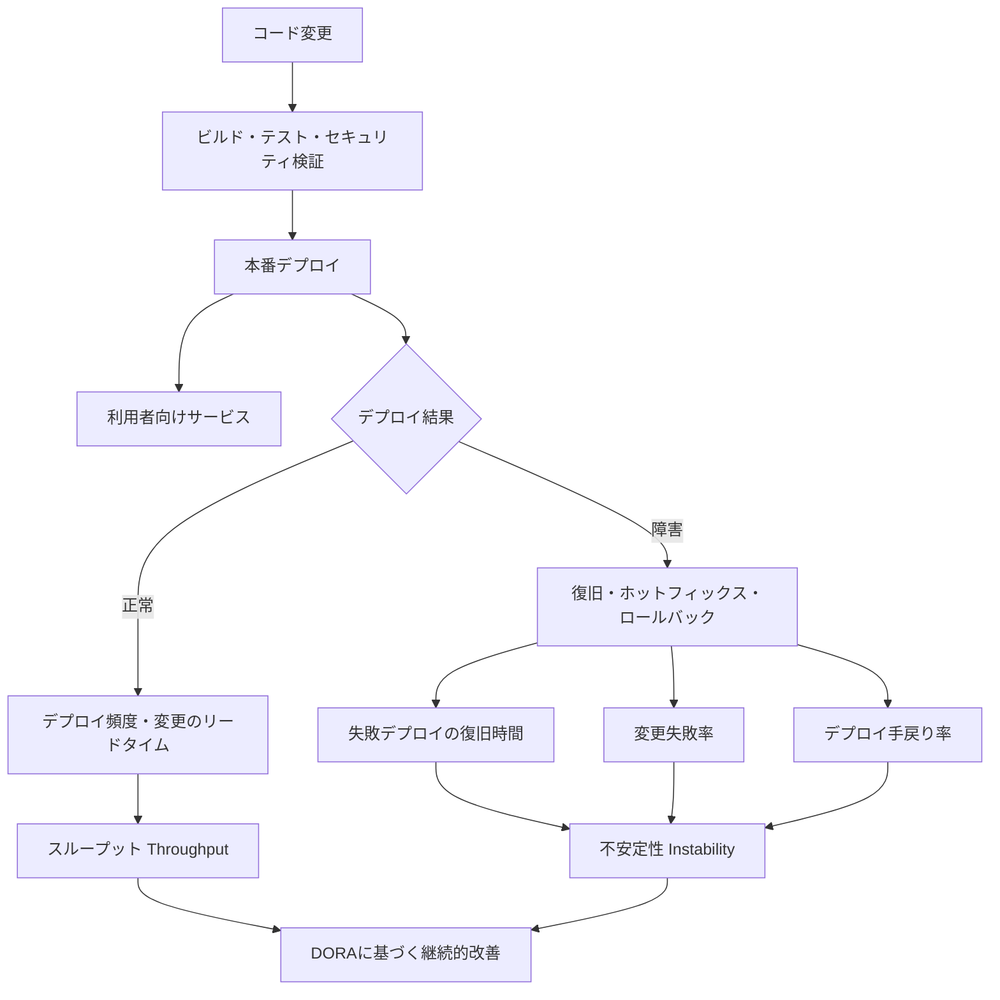
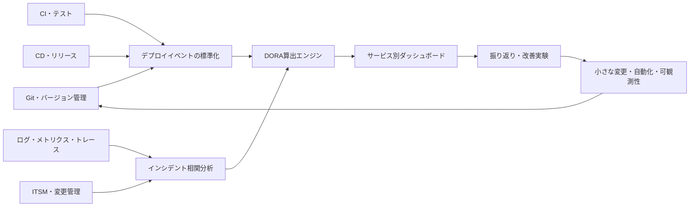

# DORAソフトウェアデリバリーパフォーマンス指標（DORA Metrics）

## 1. 概要

> **DORA指標**とは、ソフトウェアをどれだけ頻繁に、迅速に、安定して利用者へ届け、障害・手戻りをどれだけうまく統制しているかを、アプリケーションまたはサービス単位で測定するデリバリーパフォーマンス指標体系である。

DevOpsと継続的デリバリーを導入した組織は、パイプラインの実行回数や完了したチケット数が増えたという事実だけでは成果を判断しにくい。

デプロイ回数が多くても障害が繰り返されれば利用者にとっての価値は増えず、開発者が多くの機能を作っても運用上の復旧が遅ければ組織全体の信頼性が低下する。

逆に、変更を小さく分割し自動化された検証を通過させて頻繁にデプロイしながらも、障害の影響を短く限定できれば、速度と安定性を同時に改善できる。

DORA指標はこうした結果を共通言語で表現し、開発・テスト・セキュリティ・運用・プロダクトの各組織が一つのサービスの成果をめぐって対話できるようにする。

DORAは、スループット（Throughput）と不安定性（Instability）を併せて見るように構成されている。

現在の公式ガイドの五つの指標は、変更のリードタイム、デプロイ頻度、失敗デプロイの復旧時間、変更失敗率、デプロイ手戻り率である。

前の三つの指標はどれだけ多くの変更が本番環境へ流れているかを説明し、後の二つの指標はその変更がどれだけ安定して動作したかを説明する。

したがってDORAを単に「デプロイを速くする方法」と解釈してはならない。

測定の目的は特定のチームを順位付けしたり目標数値を強制したりすることではなく、サービスのデリバリーフローにおけるボトルネックと改善実験の効果を発見することにある。

歴史的にはデプロイ頻度・変更のリードタイム・復旧時間・変更失敗率の四つの主要指標から出発し、近年では失敗デプロイの復旧時間を変更によって引き起こされた障害により焦点を当てて定義し、デプロイ手戻り率を追加する方向で精緻化された。

このような定義の変化は、指標が固定された評価表ではなく、技術や研究結果に合わせて改善される測定モデルであることを示している。

## 2. 指標体系と概念図

DORA指標は、サービスのデリバリーフローを一方の軸に、デプロイ結果の安定性をもう一方の軸に置く。

スループットが高いということは、変更が長く待機することなく本番環境に到達することを意味する。

不安定性が低いということは、デプロイが利用者の障害を生まず、問題が生じても迅速に復旧され、計画外の手戻りが小さいことを意味する。

二つの軸を併せて見ることで、「速いが壊れるチーム」と「安定しているが何もデプロイできないチーム」を区別できる。

変更のリードタイムは、一つのコミットが本番環境で正常に稼働するまでにかかった時間である。

デプロイ頻度は、一定期間に本番へ正常にデプロイした回数、またはデプロイ間の間隔で測定する。

失敗デプロイの復旧時間は、ソフトウェア変更によってサービスが劣化した後、復旧するまでにかかった時間に焦点を当てる。

変更失敗率は、本番デプロイのうち即時の介入、ロールバック、ホットフィックス、または修正デプロイが必要となった割合である。

デプロイ手戻り率は、通常の計画された機能ではなく、本番障害を修正するために行った計画外のデプロイの割合である。

五つの指標は、同じ分母と時間範囲を使って初めて意味のあるフローを示す。

例えば、あるチームはコミットからデプロイまでを測り、別のチームはプルリクエスト作成からデプロイまでを測るのであれば、二つのチームのリードタイムは比較できない。

また、サービスごとにデプロイ単位と障害の定義が異なるため、組織全体の平均よりも、一つのアプリケーションまたはサービスについてのトレンドをまず観察すべきである。

## 3. 五つの主要指標

### A. 変更のリードタイム（Change Lead Time）

変更のリードタイムは、変更がバージョン管理システムにコミットされた時点から、本番環境に正常にデプロイされた時点までの時間である。

この指標は開発者が実際にコードを書いた時間だけを測るのではなく、レビュー・ビルド・テスト・承認・リリース待ちまで、デリバリーシステム全体の待機時間と処理時間を含む。

したがって値が長い場合は、開発者個人の生産性が低いと結論付けるよりも、どの段階でキューが形成されているかをまず確認すべきである。

例えば平均コーディング時間は短くても、セキュリティレビューが週1回のバッチで運用されていれば、変更はレビュー待ちの列に長く留まる。

逆に、小さな変更を頻繁に統合し、自動化されたテストとデプロイを使えば、段階ごとの待機時間は短くなる。

測定式は次のように表現できる。

`変更のリードタイム = 本番正常デプロイ時刻 - 当該変更のコミット時刻`

一つのデプロイに複数のコミットが含まれる場合は、どのコミットを代表的な変更とみなすかのルールを定めなければならない。

最も古いコミットを基準にすればバッチサイズによる遅延が見えるが、デプロイ直前の変更だけを含めると実際の待機ボトルネックを見逃す可能性がある。

技術士の答案では、定義だけでなく測定の境界と例外処理まで提示してこそ、指標の信頼性が高まる。

### B. デプロイ頻度（Deployment Frequency）

デプロイ頻度は、特定のサービスが実際の利用者に変更を届ける頻度である。

開発ブランチにコードを頻繁にマージした、あるいはテスト環境に何度もデプロイしたという事実は本番のデリバリー成果とは異なるため、本番または最終利用者向けリリースという基準を明確にしなければならない。

デプロイ頻度が高ければ、大規模リリースのリスクを小さな単位に分解でき、フィードバックサイクルが短くなる。

しかし頻度だけを高めて変更失敗率を見なければ、フィーチャーフラグをむやみにオンにしたり障害を繰り返したりする誤った最適化が生じ得る。

したがって頻度は、常に安定性指標と組み合わせて解釈しなければならない。

例えば月2回の大規模リリースから週20回の小さなデプロイへ移行する際には、デプロイ自体の成否と利用者への露出の有無を区別して記録すべきである。

フィーチャーフラグによってコードはデプロイされたが機能は無効状態である場合には、組織の測定目的に応じてデプロイとリリースを別々にモデリングできる。

### C. 失敗デプロイの復旧時間（Failed Deployment Recovery Time）

失敗デプロイの復旧時間は、変更が本番サービスに障害または性能劣化をもたらした時点から、正常なサービスが回復するまでの時間である。

従来のMTTRという表現はあらゆる障害原因を包含するかのように使われてきたが、DORAの最新の定義はソフトウェア変更によって生じた失敗デプロイを中心に測定する。

データセンターの停電や外部通信事業者の障害を変更失敗の復旧時間に混ぜると、デリバリーパイプラインの安定性を歪めてしまうからである。

復旧の終了条件は、監視の正常化、利用者影響の解消、ロールバックの完了、またはサービスレベル目標の回復のいずれであるかを事前に定義しなければならない。

ロールバックが速くても、データマイグレーションが元に戻っていなければ完全な復旧とみなせない事例もある。

したがって、アプリケーション・データベース・メッセージコンシューマ・キャッシュの一貫性まで復旧範囲に含めるかどうかを、サービスごとに決定する。

### D. 変更失敗率（Change Fail Rate）

変更失敗率は、本番デプロイのうち即時の介入が必要となったデプロイの割合である。

`変更失敗率 = 失敗に分類された本番デプロイ数 / 本番デプロイ総数 × 100`

失敗とは、障害、ロールバック、ホットフィックス、緊急パッチのように、デプロイ結果を正常状態に戻すための措置が必要となった場合と定義できる。

単に自動デプロイの段階が失敗したという理由だけで、利用者への影響がなかったデプロイまですべて失敗として数えると、パイプラインの品質とサービスの品質を混同することになる。

逆に、障害に気付かなかった事例や手動で静かに修正した事例を除外すると、指標が良く見えるバイアスが生じる。

事象の分類ルールとインシデント記録を結び付け、同一の基準を維持することが重要である。

### E. デプロイ手戻り率（Deployment Rework Rate）

デプロイ手戻り率は、計画された機能のデリバリーではなく、本番の問題を解決するために行った計画外のデプロイの割合である。

変更失敗率は特定のデプロイが失敗したかどうかを問うが、手戻り率はチームのデプロイ量のうち、どれだけの容量がバグ修正と障害対応に消費されているかを示す。

例えば当初計画された機能デプロイが80件、障害修正デプロイが20件であれば、単純な運用上の定義では手戻り率は`20 / (80 + 20) × 100 = 20%`とみなせる。

分母と計画の有無は、組織のリリース管理方式に合わせて固定しなければならない。

緊急のセキュリティパッチは手戻りではなく計画外のリスク対応に分類することもできるため、分類ポリシーと例外を文書化しなければならない。

手戻り率が高い場合、テストの欠陥、要件の漏れ、デプロイのリスク、可観測性の不足、運用フィードバックの遅延のいずれかが原因である可能性がある。

したがって数値を下げることよりも、手戻りが発生したフローを原因分析し、自動回帰テストや段階的デプロイといった改善項目へと転換すべきである。

## 4. 測定データと算出プロセス

DORA指標は、一つの監視ツールが自動的に完成させてくれる値ではなく、複数のシステムの事象を結び付けた結果である。

バージョン管理システムからは、コミットハッシュ、ブランチ、作成時刻、マージ時刻を収集する。

CIシステムからは、ビルドの開始・終了、テスト結果、セキュリティ検査結果、承認記録を収集する。

CDシステムからは、デプロイの開始・完了、対象環境、リリースバージョン、ロールバックの有無を収集する。

可観測性プラットフォームとITSMでは、エラー率、影響の開始・終了、インシデント、復旧措置、利用者影響の情報を結び付ける。

第一段階は、サービスカタログを定め、リポジトリ・パイプライン・運用リソースを一つのサービス識別子にマッピングすることである。

サービス識別子がなければ、複数チームのコミットが一つのデプロイにまとめられ、所有権と障害の影響範囲を把握しにくくなる。

第二段階は、イベントスキーマを標準化することである。

最低限、`service_id`、`commit_sha`、`deployment_id`、`environment`、`started_at`、`completed_at`、`outcome`、`incident_id`、`change_type`を保持すれば、指標計算の基盤を作ることができる。

第三段階は、本番デプロイと利用者影響の事象を結び付けることである。

デプロイバージョンとインシデントの時間枠を比較し、原因分析の結果が当該変更に起因するかを運用担当者が確認しなければならない。

時間枠だけですべての障害を自動的に帰属させると、同時デプロイや外部障害を誤って分類し得るため、自動判定と人によるレビューを組み合わせる。

第四段階は、元データの修正履歴と再計算の可能性を保証することである。

ダッシュボードの現在の数値だけを保存すると、分類基準の変更や障害事象の訂正が発生した際に過去のトレンドを再現できない。

## 5. 適用手順と運用モデル

### A. ベースラインの設定

最初から業界上位水準と比較しようとせず、一つのコアサービスについて直近4〜8週間のデータを収集する。

ベースライン期間中は、数値を評価報酬や人事等級に結び付けてはならない。そうすることでチームが不利な事象を隠さなくなる。

平均だけを見るのではなく、中央値と上位パーセンタイルも併せて記録すれば、一部の大規模障害が平均を歪める問題を軽減できる。

### B. ボトルネックの発見

変更のリードタイムを、コミット待ち、コードレビュー、ビルド、テスト、承認、デプロイ待ちの区間に分解する。

どの区間が最も長いかを確認し、その区間の待機時間を減らす一つの改善実験を選択する。

例えば承認待ちがボトルネックであれば、承認者を増やすよりも、リスクベースの自動承認と段階的デプロイを検討できる。

### C. 小さなバッチと自動化

変更のサイズを小さくすればレビュー範囲と失敗原因が減り、障害が発生しても復旧のための選択肢が増える。

自動化された単体テストだけでは十分ではないため、契約テスト、データベース互換性チェック、セキュリティ検査、デプロイ後検証を段階的に配置する。

ただし検証段階を追加するほどリードタイムが延びる可能性があるため、リスクの度合いに応じて並列実行と非同期レビューを設計する。

### D. 段階的デプロイと迅速な復旧

ブルーグリーン、カナリア、ローリングデプロイは、全利用者が同時に新しい変更を受け取るリスクを低減する。

自動ロールバックの条件は、エラー率・レイテンシ・中核業務の成功率のように、利用者への影響に近いシグナルで定めなければならない。

ロールバックだけでは解決しないスキーマ変更には、expand-contractパターンと後方互換性を適用し、アプリケーションとデータの変更の順序を分離する。

### E. 振り返りと反復

指標を週次会議の報告数値で終わらせず、サービス担当者がボトルネック・実験・結果を併せて記録する改善ループとして運用する。

改善実験の成功基準は、DORA指標一つの変化だけでなく、障害の影響、セキュリティリスク、開発者体験、顧客価値まで含めなければならない。

## 6. 他の指標体系との比較

DORAはデリバリーシステムのフローと安定性を測定することに強みがあり、SRE指標は利用者視点の信頼性を説明することに強みがある。

プロダクト組織のOKRは事業上の成果を説明するが、デプロイパイプラインのどの段階が詰まっているかを直接には示さない。

したがって三つの体系を代替関係とみなさず、成果-サービス-デリバリーという異なる観測層として結び付けるべきである。

| 区分 | DORA指標 | SRE指標 | プロダクト・事業OKR |
|---|---|---|---|
| 主な問い | 変更をどれだけ速く安定して届けているか | 利用者に信頼できるサービスを提供しているか | 事業目標と顧客価値を達成したか |
| 代表的な項目 | リードタイム、頻度、復旧時間、失敗率、手戻り率 | SLI、SLO、エラーバジェット、可用性、レイテンシ | コンバージョン率、継続率、売上、顧客満足 |
| 観測単位 | アプリケーション・サービスのデリバリーフロー | ユーザージャーニー・サービスの信頼性 | プロダクト・事業ポートフォリオ |
| 主な活用 | デリバリーのボトルネックと改善実験 | 運用の優先順位と安定性の予算 | 戦略の方向性と投資判断 |

DORA指標が改善したのにSLO違反が増えたのであれば、デプロイの自動化が利用者影響の検証より先行している可能性がある。

逆にSLOは安定しているがリードタイムが長すぎるのであれば、変更承認と統合の構造がイノベーションを妨げていないかを確認すべきである。

このように指標間の緊張関係を隠さず、原因と文脈を併せて読むことが、単一のスコア化を避ける方法である。

## 7. 事例：金融決済サービスのデリバリー改善

金融決済サービスでは、変更の失敗が金銭的損失と規制当局への報告につながり得るため、単にデプロイ頻度を高める方式は適切ではない。

仮想の決済サービスが、月8回の本番デプロイ、平均変更リードタイム9日、変更失敗率12%、失敗デプロイの復旧時間6時間を記録していると仮定する。

まずリポジトリ・CI・CD・インシデントのデータを`payment-service`という識別子で結び付け、緊急セキュリティパッチと定例機能デプロイの分類基準を文書化する。

分析の結果、コードレビュー待ちが平均3日、手動回帰テストが4日を占めているのであれば、ボトルネックは開発者のコーディング速度ではなくデリバリーの承認構造である。

チームは決済金額の計算と承認フローに契約テストを追加し、低リスクの変更には自動承認・カナリアデプロイを適用する。

データベーススキーマは旧バージョンのアプリケーションが読めるようにまず拡張し、すべてのインスタンスが新しいコードを使用するようになった後に旧フィールドを削除する。

デプロイ後にエラー率と承認成功率を15分間観察し、閾値を超えたら自動停止またはロールバックする。

8週間後に月間デプロイ回数が8回から24回に増加し、平均リードタイムが9日から2日に短縮されたとしても、変更失敗率と復旧時間が悪化していないかを併せて確認しなければならない。

もし手戻り率が増加したのであれば、テスト範囲やデータ検証を補強し、数値を元に戻すために無理にデプロイを減らすことはしない。

この事例の要点は、規制環境においても、統制された小さな変更と監査可能な自動化によって速度と安定性を同時に追求できるという点にある。

## 8. 深掘り：最新の定義変化と試験答案の戦略

DORA指標は、過去の四つの主要指標をそのまま暗記する問題ではなく、測定対象と分類基準がなぜ変わったのかを説明する主題へと拡張できる。

最新の公式ガイドは、スループットを変更のリードタイム・デプロイ頻度・失敗デプロイの復旧時間に、不安定性を変更失敗率・デプロイ手戻り率に分けて説明している。

ここで失敗デプロイの復旧時間は、一般的なあらゆる障害の復旧時間ではなく、ソフトウェア変更によって生じたサービス劣化の復旧に焦点を当てている。

また、デプロイ手戻り率は、失敗デプロイの存在だけでは表れない「計画されたデリバリー容量のうち手戻りに消費される割合」を補完する。

答案は、`定義と背景 → 5大指標および算出式 → データ収集アーキテクチャ → 適用手順 → SRE・OKRとの比較 → 事例 → 限界と示唆点`の順序で構成すると、論理の流れが明確になる。

表には項目を整理するが、各指標がどのような意思決定を支援し、誤って測定した場合にどのような歪みが生じるかを文章で説明しなければならない。

「デプロイ頻度は高ければ高いほど無条件に良い」といった断定は避け、サービスごとの文脈・規制・デプロイ単位・利用者影響を前提としなければならない。

グッドハートの法則の観点からは、指標を目標数値として強制すると、チームが分母を操作したり障害を隠したりし得ることを指摘できる。

技術士の観点からの差別化ポイントは、データの標準化、サービスカタログ、イベント相関分析、自動ロールバック、エラーバジェット、セキュリティ・規制上の統制を、一つの運用ガバナンスとして結び付ける点にある。

## 9. 考慮事項および示唆点

1. **サービス単位での測定原則**：技術スタックや利用者特性が異なるアプリケーションを一列に並べて比較せず、サービスごとのベースラインとトレンドを優先的に管理する。

2. **速度と安定性の同時最適化**：デプロイ頻度やリードタイムだけを評価せず、変更失敗率・復旧時間・手戻り率を併せて見て、局所最適化を防止する。

3. **測定定義の一貫性**：コミット基準、本番デプロイ基準、障害の帰属条件、復旧の終了条件、手戻りの分母をデータディクショナリとして固定し、変更履歴を管理する。

4. **指標の非強制性**：チーム間の順位付けや個人評価に直接結び付けると、隠蔽・操作・危険なデプロイが増え得るため、振り返りと改善実験の学習材料として用いる。

5. **自動化と統制のバランス**：承認段階を無条件に撤廃せず、変更のリスク度合いに応じて自動承認、ピアレビュー、セキュリティ承認、カナリアの範囲を差別化する。

6. **データ・セキュリティ変更の復旧可能性**：アプリケーションのロールバックだけではデータが復旧しない場合があるため、スキーマ互換性、バックアップ、補償トランザクション、監査ログを併せて設計する。

7. **可観測性と原因分析**：ログ・メトリクス・トレースをデプロイバージョンと結び付けて利用者影響と変更原因を区別し、外部障害を変更失敗として誤って帰属させない。

8. **経営成果との連携**：DORAの改善が顧客価値、信頼性、コスト、開発者のウェルビーイングにどのような影響を与えるかをSLO・OKRと結び付けつつ、一つの総合スコアに過度に単純化しない。

9. **継続的なモデル改善**：新しい技術や運用方式が登場したら指標の定義を再検討し、過去データとの比較可能性を維持できるよう、バージョン管理された測定ポリシーを運用する。

## 参考資料

- DORA, "DORA's software delivery performance metrics" — https://dora.dev/guides/dora-metrics/
- DORA, "A history of DORA's software delivery metrics" — https://dora.dev/insights/dora-metrics-history/
- DORA, "DORA's Research Program" — https://dora.dev/research/

---

> **一言まとめ**：DORA指標は、サービスごとの変更のリードタイム・デプロイ頻度・失敗デプロイの復旧時間・変更失敗率・デプロイ手戻り率を、スループットと不安定性の観点から併せて測定し、数値競争ではなく小さく安全な変更と継続的改善を導くDevOpsの成果体系である。
