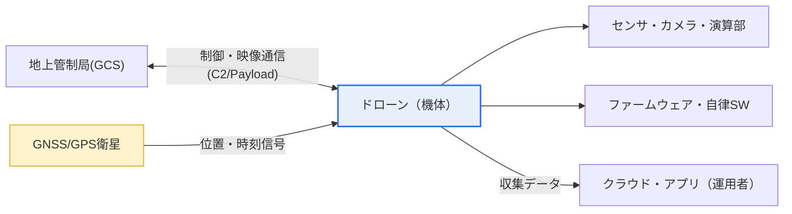
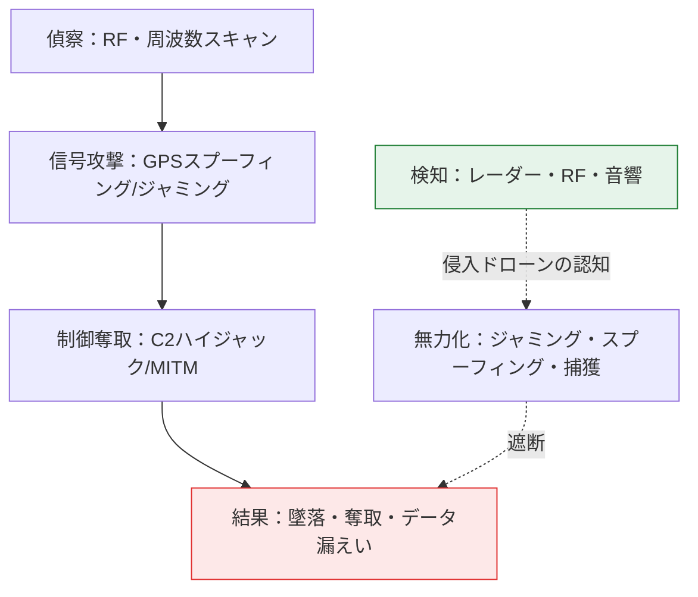

# ドローンのセキュリティ脅威と対応策

## 1. 概要

### A. 定義

> **ドローン（無人航空機、UAV/Drone）** とは、操縦者が搭乗せず、遠隔操縦または事前プログラム・自律アルゴリズムによって飛行する航空機であり、地上管制局（GCS）との**通信（制御・映像リンク）**、衛星ベースの**航法（GNSS/GPS）**、姿勢・環境認識のための**センサ**、そしてこれらすべてを制御する**飛行ソフトウェア（ファームウェア）** で構成されたサイバーフィジカルシステム（CPS）である。

ドローンは物流配送・空撮・精密農業・施設点検・災害監視・軍事偵察などへ急速に普及しており、韓国国土交通部の統計では、国内のドローン届出台数と操縦資格の取得者が毎年大幅に増加している。普及の速度と同じだけ攻撃対象領域（Attack Surface）も広がり、ドローンセキュリティは単なる情報保護を超えて**公共の安全（Public Safety）** の問題として浮上した。

ドローンセキュリティが一般的なITセキュリティと根本的に異なる理由は、「**サイバー脅威が即座に物理的被害へと転化する**」点にある。従来のITシステムの侵害はデータ漏えい・サービス停止といった論理的（logical）被害にとどまることが多いが、ドローンは空を飛ぶ数kg〜数十kgの物理的実体である。制御権を奪われたドローンは墜落したり、人・建物・航空機と衝突したりして、即座に人命・財産の被害をもたらす。すなわちドローンの脅威モデルは、機密性（Confidentiality）・完全性（Integrity）・可用性（Availability）のCIA三要素に加えて、**安全（Safety）** を最上位の要件として含めなければならない。

もう一つの特殊性は、ドローンが「**攻撃の対象（Target）であると同時に攻撃の手段（Weapon）でもある**」という二面性である。一方ではドローン自体がハッキング・ジャミングの標的となり、他方では正常なドローンが違法撮影・物理的侵入・麻薬の密輸・要人への脅威・重要施設の偵察の道具として悪用される。2018年に英国ガトウィック空港が未確認ドローンの出現により約36時間閉鎖され14万人の航空便が影響を受けた事件や、2018年にベネズエラで爆発物を搭載したドローンが国家行事の会場上空で爆発した事件は、ドローンが手段として使われた場合の波及力を象徴的に示している。したがってドローンセキュリティは、「自分のドローンを守る防御（Blue）」と「侵入ドローンを阻止する対応（Anti-Drone）」を併せて設計しなければならないという点で、二重構造を持つ。

### B. 構成要素と脅威ポイント

ドローンシステムは大きく、地上管制局（GCS）、無線通信リンク（C2およびペイロードリンク）、GNSS航法信号、搭載センサ・カメラ・演算装置、そしてそれらを駆動するファームウェア・アプリに分けられる。問題は、**これらの要素一つひとつがすべて独立した攻撃対象領域**であるという点である。通信リンクの多くは2.4GHz・5.8GHzなどの開放されたISM帯を使用し、コンシューマ向けドローンの相当数は制御信号が暗号化されていないか、弱い認証しか使用していない。民間用GPS（L1 C/A）は信号が公開仕様で強度が非常に弱く（受信電力は約-125dBm程度）、偽造・妨害に対して構造的に脆弱である。このような「生来の脆弱性」のため、ドローンセキュリティには個々の要素の防御を超えた、階層全体にわたる統合設計が求められる。

## 2. ドローンシステムの構成と脅威ポイントの概念図

まず、ドローンがどのような要素で構成され、各要素がどこで攻撃を受けるのかを全体構造図で俯瞰する。地上管制局とドローンは双方向の無線で制御・映像をやり取りし、ドローンはGPS衛星から位置信号を一方的に受信し、内部ではセンサ・ファームウェアが自律的な判断を行う。各矢印（経路）とノード（構成要素）が、そのまま脅威ポイントとなる。

全体構造が「通信・航法・演算・データ」の四つの軸に分かれることを押さえたら、次に実際の攻撃が時系列でどのように展開されるかをプロセスの観点から見ることで、対応の介入ポイントを定めることができる。以下の図は、攻撃者が偵察から始めて信号妨害・制御奪取・データ漏えいへとつなげるキルチェーン（Kill-chain）と、防御側が検知・無力化で介入する流れを示したものである。

## 3. セキュリティ脅威の詳細

ドローンの脅威は構成要素ごとに明確に区分されるため、「なぜその脅威が成立するのか」を原理レベルで理解して初めて防御を設計できる。

### A. GPSスプーフィング・ジャミング（航法層）

最も象徴的な脅威は、GNSSを狙った**スプーフィング（Spoofing）とジャミング（Jamming）** である。ジャミングはGPS帯域に強い雑音を放射して正常な衛星信号を埋もれさせるものであり、ドローンは位置を失い、ホバリング・帰還（RTH）・強制着陸などの失敗モードに陥る。スプーフィングはさらに巧妙である。実際の衛星よりわずかに強い偽造信号を作り出してドローンにそれを本物と誤認させた後、偽造信号の座標を徐々に移動させて、ドローンを操縦者が意図しない場所へ誘導する。2011年にイランが米国のRQ-170偵察ドローンをスプーフィングで誘導・捕獲したと主張した事件や、2012年にテキサス大学の研究チームが約1,000ドル程度の機材で民間ドローンをスプーフィングして航路を変えた実証実験は、この脅威が理論上のものではないことを示している。

この脅威が根本的に成立する理由は、民間GPS信号が**認証手段のない公開仕様**であり、受信電力が極めて弱いからである。信号に署名がないため、ドローンには「この信号が本当に衛星から来たのか」を検証する方法がなく、地上付近の送信機は衛星よりはるかに強い信号を容易に作り出せる。したがって航法層の防御は、「単一の信号源への盲信」を打破する方向でなければならない。

### B. 通信ハイジャック・中間者攻撃（通信層）

**通信ハイジャック** は、地上局とドローンの間の制御（C2）チャネルを奪取したり、中間者（MITM）として割り込んで命令を偽造・改ざんしたりする攻撃である。コンシューマ向けドローンの制御プロトコルが弱い認証しか使っていなかったり、セッション鍵の管理がずさんであったりする場合、攻撃者はリプレイ（Replay）攻撃やプロトコルの脆弱性を利用して操縦権を奪うことができる。実際に、特定の商用ドローンのWi-Fiベースの制御において、認証回避によってドローンを乗っ取るデモ（例：「SkyJack」類の攻撃）が公開されている。この脅威の背景もまた「開放帯域＋弱い暗号」という構造的な問題であり、対策はチャネルの暗号化と強力な相互認証に帰結する。

### C. データ漏えいとファームウェア改ざん（データ・SW層）

**データ漏えい** は、ドローンが撮影・収集する映像・飛行ログ・位置情報を、伝送区間やストレージで傍受する脅威である。施設や軍事施設を撮影するドローンであれば、漏えいした映像そのものが国家・産業上の機密となり得るし、一般的な撮影であっても個人情報・肖像権の侵害につながる。**ファームウェア改ざん** は、ドローンの飛行ソフトウェアにマルウェアを仕込んだり、完全性が確認されていない更新を注入したりして誤作動・バックドアを引き起こすものであり、署名・セキュアブートのない機体では特に危険である。最後に、正常なドローンがそれ自体として**違法撮影・物理的侵入・テロの手段として悪用される** 脅威は、前述の二つの層とは異なり「技術的防御」だけでは防ぎにくく、検知・無力化・制度が併せて必要となる。

| 脅威 | 対象層 | 中核原理 | 実例/代表的事例 |
|---|---|---|---|
| **GPSスプーフィング/ジャミング** | 航法 | 偽造・雑音による位置認識の操作・麻痺 | 2011 RQ-170、2012 テキサス大学の実証 |
| **通信ハイジャック** | 通信 | C2チャネルの奪取・MITM・リプレイ | SkyJack類のWi-Fi乗っ取りデモ |
| **データ漏えい** | データ | 伝送・保存区間での映像・ログの傍受 | 施設撮影映像の漏えい |
| **ファームウェア改ざん** | SW | 完全性未検証の更新・マルウェア | バックドア・誤作動の誘発 |
| **ドローンの悪用（手段化）** | 物理 | 正常な機体の違法利用 | 2018 ガトウィック空港閉鎖、ベネズエラ爆発物 |

## 4. 対応策

対応は、脅威の層に1対1で対応する**多層防御（Defense in Depth）** として設計しつつ、技術・検知・制度が互いを補完するよう統合しなければならない。

### A. 通信・航法・SW層の防御（機体の観点）

通信層では、制御（C2）と映像リンクの双方を**暗号化（AESなど）し相互認証**を適用してハイジャック・MITMを遮断し、リプレイ防止のためにセッションごとにナンス（nonce）・シーケンスを管理する。航法層では、GPSへの単一依存から脱却し、**慣性航法（INS）・視覚ベースの航法（VIO）・気圧・地磁気センサを融合**し、複数の衛星システム（GPS・Galileo・BeiDou）の信号の整合性を交差検証してスプーフィングを検知する。信号の到来角（AoA）・受信電力の急変を検知するアンチスプーフィング受信機も商用化されつつある。SW層では、ファームウェアに**コード署名・セキュアブート（Secure Boot）・署名付き更新の検証**を適用して完全性を保証する。このように層ごとの防御に共通する原理は、「**単一の信頼点をなくし、複数の根拠で検証する**」ことである。

### B. アンチドローン（侵入ドローンの観点）

自機を守ることとは別に、侵入するドローンを阻止する**アンチドローン（C-UAS, Counter-UAS）** 体系が必要である。アンチドローンは「検知（Detect）-識別（Identify）-無力化（Mitigate）」の段階で構成される。検知はレーダー（RCSベース）・RFスキャナ（制御周波数の検知）・EO/IRカメラ・音響センサを複合的に使用して誤検知を減らし、無力化は制御・GPS帯域を妨害するジャミング、偽造信号で誘導するスプーフィング、ネット・捕獲ドローンで物理的に捕える方式、指向性エネルギー（レーザー・高出力マイクロ波）などに分けられる。ただし空港・都市部でのジャミングは正常な通信・航法に付随的被害を与え得るため、環境に適した無力化手段の選択が重要である。

### C. 制度・ガバナンス

技術だけでは「手段化された正常なドローン」を防げないため、制度が最後の層を担う。すべてのドローンに飛行中の識別情報の発信を義務付ける**リモートID（Remote ID）** は、違法飛行の抑止と事故時の責任追跡の要であり、米国FAAは2023〜2024年にかけてRemote IDを事実上義務化し、EU（EASA）や韓国国内の制度も登録・識別を強化する方向で整備されつつある。これに飛行禁止区域（空港・原子力発電所・軍事施設の周辺）の指定、機体の届出・操縦資格制度、ジオフェンシング（Geo-fencing）が組み合わさって、多層防御が完成する。

| 対応層 | 中核手段 | 対応する脅威 |
|---|---|---|
| **通信セキュリティ** | C2・映像の暗号化、相互認証、リプレイ防止 | ハイジャック・MITM |
| **航法セキュリティ** | INS/VIO融合、複数衛星システムの交差検証、アンチスプーフィング受信機 | GPSスプーフィング・ジャミング |
| **SWの完全性** | コード署名、セキュアブート、署名付き更新 | ファームウェア改ざん |
| **アンチドローン（C-UAS）** | 検知（レーダー・RF・音響）＋無力化（ジャミング・スプーフィング・捕獲・DE） | ドローンの悪用・侵入 |
| **制度・ガバナンス** | Remote ID、登録・資格、飛行禁止区域、ジオフェンシング | 手段化・違法飛行 |

## 5. 深掘り — 標準・政策動向と実務への適用

ドローンセキュリティは、技術と制度が急速に共進化している領域である。第一に、**識別の義務化**が世界的な流れである。米国FAAのRemote ID規則（Part 89）は、ほとんどの登録ドローンにリモート識別の搭載・発信を求め、スマートフォンでも付近のドローンの識別情報と位置を確認できるようにした。EUはU-spaceという低高度無人機交通管理（UTM）体系を整備し、識別・ジオアウェアネスを要件化している。これは「**ドローンにも自動車のナンバープレートを付ける**」という発想であり、匿名性に起因する脅威を構造的に低減する。

第二に、**アンチドローン市場の急成長**である。ガトウィック事件以降、主要な空港・競技場・首脳会談の会場にはレーダー＋RF＋EO/IRを統合したC-UASが常時配備され始め、韓国国内でも国家重要施設・大規模イベント（例：首脳会議、大型スポーツイベント）の警護においてアンチドローンが標準手順として定着した。無力化手段は、都市部での付随的被害を減らすため、広域ジャミングから精密なスプーフィング・捕獲へと進化する傾向にある。

第三に、**自律・群集（Swarm）・AIドローンという新たな地平**である。自律飛行の比重が高まるほど、認識モデルを狙った**敵対的攻撃（Adversarial Attack）**——例えば標識・地形に撹乱パターンを埋め込んで誤認識を誘導する——というAIセキュリティの脅威が加わる。群集運用が増えれば数十〜数百機が同時に侵入するシナリオに対応しなければならないため、単発の無力化ではなく広域・自動化された対応が課題となる。実務的には、ドローンのSWサプライチェーン（オープンソースの飛行制御スタック、部品のファームウェア）に対する**SWサプライチェーンセキュリティ（SBOM・署名）** も新たな要件として浮上している。

## 6. 考慮事項および示唆点

1. **安全（Safety）とセキュリティ（Security）の融合設計**：ドローンはサイバー侵害が物理的事故に直結するCPSであるため、ハッキング防御と墜落・衝突防止を切り離さず、「失敗しても安全な（fail-safe）設計」（例：信号喪失時の安全な着陸・帰還）をセキュリティ要件と併せて統合しなければならない。

2. **単一の信頼点の排除と多重検証**：GPSスプーフィング・通信ハイジャックの根本原因は「検証のない単一信号への依存」である。INS・VIO・複数衛星システムの融合、相互認証、コード署名など「複数の根拠で交差検証する」アーキテクチャは、トレードオフ（コスト・重量・演算量の増加）を受け入れる価値のある中核戦略である。

3. **検知・無力化の環境適合性と法的限界**：ジャミング・スプーフィングに基づく無力化は、都市部・空港で正常な通信・航法に付随的被害を与え、電波法・航空法上の許可の問題も絡む。施設の特性（都市部/郊外、機微度）に合わせて捕獲・指向性エネルギーなどの精密な手段を選択し、無力化権限の法的根拠を事前に確保しなければならない。

4. **制度・ガバナンスの先行的確保**：Remote ID・登録・資格・ジオフェンシングは、技術的防御が届かない「手段化された正常なドローン」の脅威を抑止する最後の層である。国際標準（FAA Part 89、EU U-space）との整合性を維持し、事故時の責任追跡・データ保存の体制を整えなければならない。

5. **将来の脅威（自律・群集・AI）へのロードマップ**：自律ドローンに対する敵対的攻撃、群集による同時侵入、SWサプライチェーンの脅威には、既存の対応では不十分である。AIモデルの堅牢性検証、広域・自動化された対応体制、SBOMに基づくサプライチェーンセキュリティを中長期の投資課題として設定しなければならない。

## 参考資料
- FAA, "Remote Identification of Drones (Part 89)" — https://www.faa.gov/uas/getting_started/remote_id
- EASA(EU), "U-space and drone regulations" — https://www.easa.europa.eu/en/domains/civil-drones-rpas
- ENISA, "Cybersecurity threats to drones/UAS" — https://www.enisa.europa.eu/
- NIST, "Cyber-Physical Systems / Secure Boot関連ガイドライン" — https://www.nist.gov/

---

> **一言まとめ**：ドローンは、GPSスプーフィング・通信ハイジャック・データ漏えい・ファームウェア改ざんの標的であると同時に、違法撮影・侵入の手段ともなるサイバーフィジカルシステムであり、サイバー脅威が物理的被害に直結するため、*通信・航法・SW層の防御＋アンチドローン（検知・無力化）＋制度（Remote ID・ジオフェンシング）* を多層的に統合し、**安全（Safety）とセキュリティ（Security）を同時に**確保しなければならない。
