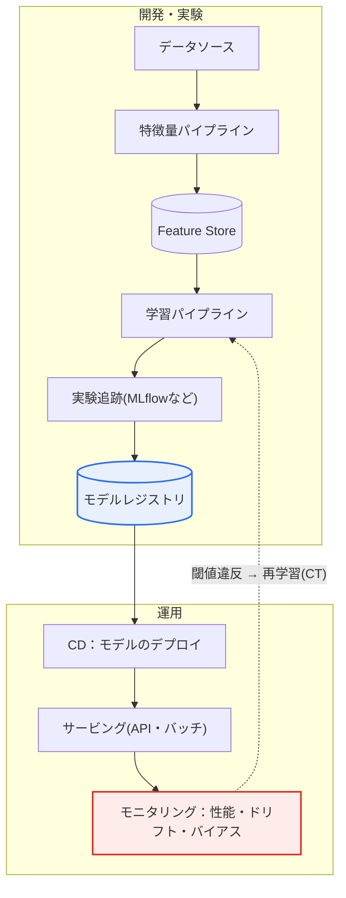

# DSMLプロジェクトとMLOps

## 1. 概要

### A. 定義
> **DSML（Data Science & Machine Learning）** とは、データサイエンスと機械学習を融合してデータに基づく問題を解決するプロジェクトであり、**MLOps（Machine Learning Operations）** とは、MLモデルの開発-デプロイ-運用を自動化・標準化し、持続可能なプロダクトにするための工学的方法論である。

DSMLプロジェクトがとりわけ難しい理由は、「**実験は成功しても運用で失敗する**」点にある。データサイエンティストがノートブック（Jupyter）で高精度のモデルを作っても、それを実際のサービスに載せて継続的に価値を生み出させることは、まったく別の問題である。実際のデータは時間とともに学習時点とは異なっていき（ドリフト）、モデルは定期的に再学習・再デプロイされなければならず、性能を継続的に監視する必要がある。この「**研究と運用の間のギャップ（Research-Production Gap）**」を埋めるのがMLOpsである。

従来のソフトウェア開発においてDevOpsが「コード」という一つの成果物を自動的に統合・デプロイしたように、MLOpsは**データ・モデル・コードという三つの成果物を併せて管理**し、モデルを持続可能なプロダクトにする。ここで決定的な違いが生じる。一般的なソフトウェアはコードが同じであればいつ実行しても同じ結果を出すが、MLシステムはコードが同一でも入力データの分布が変われば性能が変わる。すなわちMLシステムの品質はコードだけでなく**データと学習済みパラメータに依存**するため、三つの要素すべてをバージョン管理し再現可能にしなければ、「あのときなぜあの結果が出たのか」さえ説明できなくなる。

### B. 登場背景および必要性
データ・AIに基づく意思決定が、金融の与信評価、製造の異常検知、コマースのレコメンドなどの中核業務へと広がるにつれ、一回限りのモデルではなく、継続的に信頼できる予測を提供するシステムが求められるようになった。しかし現場の調査では、開発されたMLモデルの相当数が実際の運用にデプロイされずに死蔵されていると報告されることが多い。その原因はアルゴリズムの性能ではなく、**データパイプライン・環境の再現・モニタリング・再学習という運用要素の欠如**であることが多い。

MLOpsなしにモデルをデプロイすると、三つの問題が順に発生する。第一に、デプロイ直後にはよく当たっていたモデルが、時間の経過とともに静かに性能を落としていく（**モデルの劣化、Model Decay**）。第二に、性能低下を検知する観測体制がないため、問題を遅れて、たいていはユーザの不満や売上の減少によって認知する。第三に、再学習パイプラインが手動であるため対応が遅く、急いで手を加えたモデルは再現性が崩れて信頼を失う。この悪循環を断ち切り、モデルを「**生き続けるプロダクト**」として維持することがMLOpsの存在理由である。

### C. 特徴
MLOpsは、(1) データ・モデル・コードの**三重のバージョン管理**、(2) 学習からデプロイまでの**パイプライン自動化**、(3) 運用中の**継続的モニタリングと自動再学習（CT）**、(4) 実験・データ・モデルの系譜を追跡する**再現性・ガバナンス**を特徴とする。これは、DevOpsのCI/CDにML固有の**CT（Continuous Training）** の概念が加わったものと要約できる。

## 2. DSMLプロジェクトのライフサイクル

DSMLプロジェクトは、データマイニングの標準方法論であるCRISP-DMを基盤としつつ、デプロイ・運用が強化された**循環構造**に従う。以下の図は、ライフサイクル全体の流れが、各段階が一度で終わる直線ではなく、運用結果が再び初期段階へフィードバックされる**閉ループ**であることを示している。

**ビジネス理解**の段階では、解こうとする問題と成功基準を定義する。この段階の落とし穴は、データサイエンスの指標（正解率、F1）とビジネスの指標（コンバージョン率、離脱防止金額）を混同することである。例えば離脱予測モデルは、正解率が95%であっても、実際に離脱する顧客を取りこぼしていれば（再現率が低い）意味がない。したがって問題を予測・分類・ランキングのいずれとして定義し、どの誤りがより致命的かを先に合意しておくことで、以降の段階がぶれなくなる。

**データ収集・理解（EDA）** の段階では、データを確保し、探索的分析によって分布・欠損・外れ値・相関を把握する。実務経験上、DSMLプロジェクトの工数の60〜80%がこの段階と次のデータ準備段階に集中する。データの品質と代表性がモデル性能の上限を決めるため、華やかなアルゴリズムよりも「良いデータ」を確保することが優先であるという**データ中心AI（Data-centric AI）** の観点が近年強調されている背景がここにある。

**データ準備**の段階では、クレンジング・欠損処理・特徴量エンジニアリング（Feature Engineering）・学習/検証/テストの分割を行う。ここで最もよくある失敗が**データリーケージ（Data Leakage）** であり、テスト時点では知り得ない情報（例：将来の値、正解から派生した変数）が学習用の特徴量に混入し、検証性能だけが非現実的に高く出る現象である。これを防ぐため、正規化の統計量は必ず学習セットのみから算出し、検証・運用に適用しなければならない。

**モデリング・評価**の段階では、アルゴリズムを選択しハイパーパラメータをチューニングした後、性能だけでなくビジネス価値・公平性・説明可能性まで検証する。最後の**デプロイ・運用**の段階ではモデルをサービングして性能をモニタリングし、ドリフトが検知されれば再びビジネス理解の段階に戻って循環を繰り返す。

| 段階 | 中核活動 | 代表的な成果物 |
|---|---|---|
| **ビジネス理解** | 問題定義、成功基準・評価指標の合意 | プロジェクト憲章、KPI定義書 |
| **データ収集・理解** | データ確保、EDA、品質診断 | データカタログ、EDAレポート |
| **データ準備** | クレンジング・特徴量エンジニアリング・分割 | 特徴量ストア（Feature Store） |
| **モデリング** | アルゴリズム選択・学習・チューニング | 実験ログ、候補モデル |
| **評価** | 性能・ビジネス・公平性の検証 | 評価レポート、モデルカード |
| **デプロイ・運用** | サービング、モニタリング、再学習 | サービングAPI、ダッシュボード |

## 3. MLOpsのアーキテクチャと構成要素

> MLOpsはDevOpsをMLへ拡張したものであり、**データ・モデル・コードの三要素をバージョン管理し、学習-デプロイ-モニタリングを自動化**するうえに、運用データでモデルを再学習させる**継続的学習（Continuous Training, CT）** が加わる点が本質的な差別化要素である。

以下のアーキテクチャ図は、データソースから始まり、パイプライン・レジストリ・サービング・モニタリングを経て再び再学習へとフィードバックされる、MLOpsの自動化経路を示している。

**パイプラインの自動化**は、データ収集→特徴量生成→学習→評価→デプロイを一つの再実行可能なワークフローとしてまとめる。手動でノートブックを実行していた方式から脱却し、コードがコミットされたり、新しいデータが到着したり、性能が閾値を超えたりすると、パイプラインが自動的にトリガーされる。こうすることで「誰が、いつ、どのデータで学習したか」がコードとして残り、再現性と監査証跡が確保される。

**特徴量ストア（Feature Store）** は、学習に使われた特徴量とサービング時点で計算される特徴量が食い違う**学習-サービング間のスキュー（Training-Serving Skew）** を防止する。学習時にはバッチで集計した「直近7日間の購入額」を使ったのに、サービング時にはリアルタイム計算のロジックがわずかに異なり、オフライン性能は良いのにオンライン性能が崩れるという事故が代表的な事例である。特徴量を中央で定義・再利用すれば、このスキューを構造的に減らせる。

**モデルレジストリ**は、学習済みモデルのバージョン・メタデータ・系譜（どのデータ・コード・ハイパーパラメータで作られたか）を管理し、ステージング→プロダクションへの昇格を統制する。**モニタリング**は、予測性能（正解率・レイテンシ）だけでなく、入力データの分布の変化（**データドリフト**）と入力-出力関係の変化（**コンセプトドリフト**）、そしてバイアスを監視する。監視結果が閾値を超えると再学習パイプライン（CT）が作動し、循環が完成する。

| 構成要素 | 役割 | ツールの例 |
|---|---|---|
| **CI/CD/CT** | コード・データ・モデルの統合・デプロイ＋継続的学習 | Jenkins, GitHub Actions, Kubeflow |
| **パイプラインオーケストレーション** | データ→学習→デプロイの自動化 | Kubeflow Pipelines, Airflow |
| **Feature Store** | 特徴量の定義・再利用、スキュー防止 | Feast, Vertex Feature Store |
| **実験追跡** | 指標・パラメータ・アーティファクトの記録 | MLflow, W&B |
| **モデルレジストリ** | バージョン・系譜・昇格の管理 | MLflow Registry |
| **モニタリング** | 性能・ドリフト・バイアスの監視 | Evidently, Prometheus |

## 4. MLOpsの成熟度レベルと事例

Google CloudのMLOps実務ガイドは、自動化の水準を**三つのレベル（Level 0〜2）** に区分している。この成熟度モデルは、組織がどこにいて次に何を備えるべきかを診断する実用的な物差しとして、しばしば引用される。

**Level 0（手動プロセス）** は、データ準備・学習・検証がすべて手動であり、データサイエンティストが作ったモデルを運用チームに引き渡す方式である。再学習の頻度は低く（数か月に一度）、デプロイの間に大きな断絶がある。小規模なPoCや予測が頻繁に変わらないドメインには十分であるが、データが急速に変化する環境ではモデルの劣化に脆弱である。

**Level 1（MLパイプラインの自動化）** は、学習パイプラインを自動化し、新しいデータが届くとモデルを自動的に再学習・検証する（CTの導入）。ここでFeature Storeとメタデータストアが導入され、学習-サービング間のスキューと再現性の問題に対処する。**Level 2（CI/CDパイプラインの自動化）** は、パイプライン自体をコードとして管理し、新しいアイデア（前処理・モデルアーキテクチャの変更）をコードとしてコミットすると、パイプラインが自動的にビルド・テスト・デプロイされる完全自動化の段階である。大規模に複数のモデルを迅速に実験・デプロイしなければならない組織が目標とする水準である。

産業事例として、NetflixやYouTubeのようなストリーミング/動画サービスのレコメンドモデルは、ユーザの行動が刻々と変化するため、頻繁な再学習（CT）とA/Bテストに基づくデプロイが不可欠である。製造分野では、設備のセンサデータで学習した異常検知モデルは季節や設備の老朽化によって分布が変わるため、ドリフトのモニタリングと自動再学習が予知保全（PdM）システムの中核として定着した。金融の与信評価モデルは規制上**説明可能性と再現性**が求められるため、モデルカード・系譜追跡といったMLOpsのガバナンス要素が特に重視される。

### DevOpsとMLOpsの違い
MLOpsを正確に理解するには、DevOpsとの違いを押さえる必要がある。DevOpsは管理対象が「コード」一つであり、テストもコード単位・統合テストで明確であるが、MLOpsはコード・データ・モデルの三つの軸を併せて扱い、「データ検証」と「モデル検証」という新たなテスト段階が加わる。何よりも、DevOpsにはない**CT（継続的学習）** が核心である。デプロイ後もデータは変化し続けるため、コードを変えなくてもモデルを再学習・再デプロイしなければならない状況が繰り返される。

| 観点 | DevOps | MLOps |
|---|---|---|
| **管理対象** | コード | コード＋データ＋モデル |
| **バージョン管理** | ソースコード | ソース＋データセット＋モデル・パラメータ |
| **テスト** | 単体・統合テスト | ＋データ検証＋モデル検証（性能・公平性） |
| **パイプライン** | CI/CD | CI/CD＋**CT（継続的学習）** |
| **性能変化の要因** | コード変更 | コード変更**＋データ分布の変化（ドリフト）** |

この違いが意味するのは、既存のDevOps組織であっても、データ・モデルのバージョン管理とドリフト対応の体制を新たに備えなければ、MLシステムを安定して運用できないという点である。すなわちMLOpsはDevOpsの単なる拡張ではなく、データという不確実性を扱う別個の運用能力を要求する。

## 5. 考慮事項および示唆点（技術士の観点）

1. **データドリフトの検知・再学習の自動化が運用の成否を左右する。** 実際のデータが学習時点と異なってくると性能は静かに崩れるため、統計的距離（PSI、KLダイバージェンスなど）で分布の変化を監視し、閾値違反時に再学習するCT体制を設計しなければならない。このとき、再学習の頻度とコストのトレードオフをドメインの変化速度に合わせて調整することが鍵となる。
2. **再現性（Reproducibility）が信頼と規制対応の基盤である。** データ・モデル・コードを併せてバージョン管理し実験を追跡することで、特定の予測がなぜ出たのかを事後に再現・監査できなければならない。金融・医療のように規制の厳しいドメインでは、これは選択ではなく遵守要件である。
3. **学習-サービング間のスキューとデータリーケージを構造的に遮断しなければならない。** Feature Storeで特徴量の定義を統一し、正規化の統計量を学習セットのみから算出するという規律をパイプラインに内在化させ、「オフラインでは良いのにオンラインでは悪い」という事故を予防する。
4. **MLOps成熟度に合わせた段階的な高度化が現実的である。** 最初からLevel 2を目指して過剰投資するよりも、組織の能力・モデル数・変化の速度に合わせてLevel 0→1→2と段階的に導入し、ROIが確認できるところから自動化を拡大するのが合理的である。
5. **責任あるAI（Responsible AI）との連携が不可欠である。** モニタリングに性能だけでなくバイアス・公平性の指標を含め、モデルカードで限界・用途を明示し、ガバナンス・倫理要件とMLOpsを結び付けなければならない。

## 参考資料
- Google Cloud, "MLOps: Continuous delivery and automation pipelines in machine learning": https://docs.cloud.google.com/architecture/mlops-continuous-delivery-and-automation-pipelines-in-machine-learning
- Google Cloud, "Practitioners Guide to MLOps (Whitepaper)": https://cloud.google.com/resources/mlops-whitepaper

---

> **一言まとめ**：DSMLプロジェクトは*ビジネス理解→データ→モデリング→デプロイ・運用*という循環型のライフサイクルを経るものであり、MLOpsはデータ・モデル・コードを三重にバージョン管理し、パイプラインの自動化・モニタリング・継続的学習（CT）によってモデルの劣化・学習-サービング間のスキュー・再現性の問題を制御し、モデルを持続可能なプロダクトにすることが核心である。
