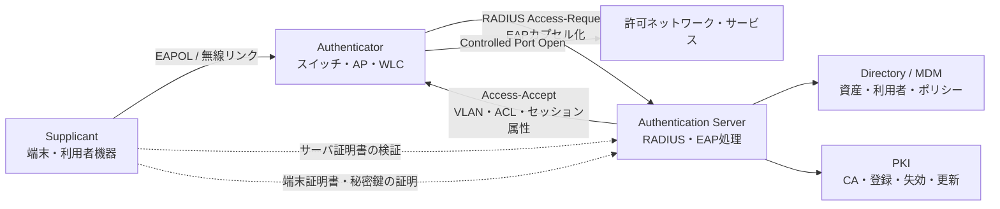
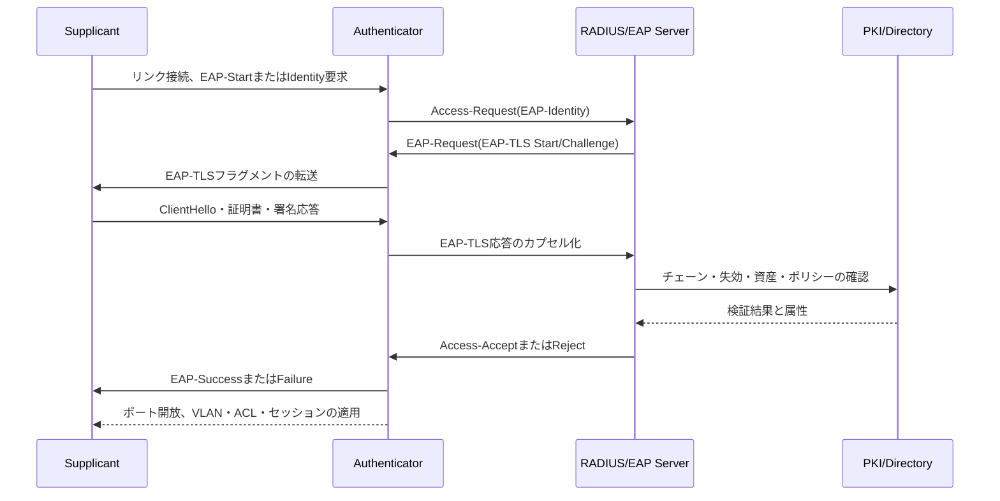

# EAP-TLS（Extensible Authentication Protocol-Transport Layer Security）に基づくネットワークアクセス認証

## 1. 概要

> **EAP-TLS**とは、EAP（Extensible Authentication Protocol）フレームワークの中でTLSハンドシェイクとX.509証明書を用いて端末と認証サーバを相互認証し、成功した認証からネットワーク接続に必要な鍵材料を導出する認証方式である。

企業の無線LAN、有線802.1X、リモートアクセス、産業用端末の接続においては、単純な共有パスワードだけで端末の身元を信頼することは難しい。利用者と機器が増えるとパスワードの配布・変更・回収の運用負担が大きくなり、同じパスワードが複数の端末で再利用されることで、1台からの漏えいがネットワーク全体の侵害につながり得る。EAP-TLSはこの問題を、端末ごとの証明書と秘密鍵へと分離することで解決する。

EAP自体は多様な認証方式を運ぶための拡張フレームワークであり、すべてのセキュリティ特性を自ら提供する単一の暗号プロトコルではない。EAP-TLSはそのフレームワークにおいてTLSを認証方式として選択した形態であり、EAPメッセージの中にTLSレコードとハンドシェイクメッセージを載せて交換する。したがって、EAP、リンク層認証、TLS、RADIUS、PKIをそれぞれ理解して初めて全体の動作を説明できる。

典型的な802.1X環境には三つの役割がある。**Supplicant**は接続を要求するノートPC・スマートフォン・IoT端末であり、**Authenticator**はスイッチや無線LANコントローラのように接続ポートを統制する機器であり、**Authentication Server**は通常RADIUSサーバと連携した認証・ポリシーサーバである。認証前はポートが制限状態にあり、認証成功後にのみ許可VLANやセキュリティポリシーが適用される。

EAP-TLSの中核的な価値は、パスワードをネットワークに送らずに端末が秘密鍵の所有を証明できる点にある。サーバは信頼できる認証局の証明書であるか、有効期限・用途・失効状態が適切かを確認し、端末もサーバ証明書を検証する。双方が検証を通過しなければならないため、サーバだけが端末を信頼する一方向認証よりも、フィッシングAPや偽造認証サーバに強い構造を作ることができる。

ただし、証明書があれば自動的に安全になるわけではない。発行ポリシーが緩かったり、秘密鍵が平文ファイルに保存されていたり、失効した証明書が引き続き許可されたりすれば、EAP-TLSの利点は失われる。そのため技術士の答案では、プロトコルの手順だけでなく、PKIのライフサイクル、端末のオンボーディング、例外処理、運用指標、インシデント対応を一つの統制体系として提示しなければならない。

## 2. 構成要素と全体アーキテクチャ

### A. 役割と信頼境界

Supplicantは自身の証明書と秘密鍵を保有するが、秘密鍵そのものを相手に送信することはない。TLSの署名検証によって秘密鍵の所有を証明し、OSのセキュアストレージやTPM・セキュアエレメントに鍵を格納すれば、ファイルのコピーだけでは認証を再現しにくくなる。

Authenticatorは認証の判断を直接行うというよりも、EAPメッセージを中継し、ポートを開閉する執行ポイントである。無線APやスイッチが認証サーバのポリシーを受け取ってVLAN、ACL、セッション時間、隔離の有無を適用するのは、認証とネットワークの執行を分離するためである。

Authentication Serverは証明書チェーンとポリシーを検証し、利用者・機器・グループ・場所・時間といった属性を組み合わせてアクセスを決定する。実際の環境では、RADIUSサーバがEAPを処理し、ディレクトリ・MDM・CMDB・PKIと連携して証明書のサブジェクトと資産情報を照合する。

PKIは、証明書発行機関、中間CA、トラストアンカー、登録・更新・失効の機能で構成される。認証サーバと端末が同じルートCAを無条件に信頼するように設計すると、テスト用証明書や他用途の証明書が許可されかねないため、用途別のCAとEKU・SANポリシーを併用しなければならない。

### B. 全体構造図

この構造において、端末と認証サーバの間のTLSのロジックはRADIUSサーバ側にあるが、端末が直接RADIUSとTCP接続を結ぶわけではない。Authenticatorがリンク層のEAPOLとバックエンドのRADIUSとの間の中継役を果たすため、無線・有線と媒体が異なっても同一の認証ポリシーを再利用できる。

EAPOLは端末とAuthenticatorの間のリンク層の伝達手段である。RADIUSはAuthenticatorと認証サーバの間のポリシー・認証の伝達手段である。両者を混同すると、スイッチが証明書検証を直接行うかのように誤って説明してしまい、障害分析においても無線区間とバックエンド区間を切り分けられなくなる。

### C. 中核構成要素の表

| 構成要素 | 主な責任 | 失敗時の影響 | 管理ポイント |
|---|---|---|---|
| Supplicant | 証明書の選択、TLS応答、サーバ検証 | 端末の接続失敗 | プロファイル配布、鍵保護、ログ |
| Authenticator | EAPOLの中継、ポート統制 | 認証は成功しても接続不可 | RADIUSへの到達性、ポート状態、時刻 |
| RADIUS/EAPサーバ | TLS・証明書・ポリシーの検証 | 全体または一部の認証障害 | HA、ポリシーの順序、監査ログ |
| PKI/CA | 発行・更新・失効 | 新規発行・検証の失敗 | ルート保護、CRL/OCSP、期限切れ |
| Directory/MDM | サブジェクト・資産・グループの連携 | 誤った権限・オンボーディング失敗 | 同期、所有権、例外 |
| ネットワークポリシー | VLAN・ACL・セッションの適用 | 過剰な権限または隔離 | 最小権限、ポリシーのバージョン、検証 |

表の構成要素は互いに代替関係にあるのではなく、連鎖的な信頼の鎖である。例えば、RADIUSサーバの可用性が高くても、CAが期限切れの証明書を発行すれば新規端末は接続できない。逆に認証が成功しても、AuthenticatorがAccess-AcceptのVLAN属性を理解できなければ、端末が誤ったネットワークに置かれる可能性がある。

## 3. EAP-TLSの認証原理とメッセージフロー

### A. 認証前の準備

第一に、組織は証明書ポリシーを定義する。端末証明書のサブジェクト識別子、SANの形式、Key Usage、Extended Key Usage、鍵長とアルゴリズム、最大有効期間、更新時点を定めなければならない。証明書のCN文字列だけを見て機器を識別する慣行は、同名や再利用の問題を生み得るため、安定した機器IDとディレクトリ属性を併用する。

第二に、端末に信頼すべきサーバCAとクライアント証明書のプロファイルを配布する。MDM、GPO、自動登録、製造時のプロビジョニングなどが方法となり得る。重要なのは、信頼CAをOS全体へむやみに追加せず、EAPプロファイルのサーバ名と許可CAを制限することである。

第三に、RADIUSサーバには、信頼する端末CA、許可されたEKU、証明書の失効チェック、利用者・機器グループ別のネットワークポリシーを設定する。証明書の署名が有効であることと、業務上のアクセス権限があることは別の判断であるため、認証成功後にグループ・資産状態・リスク度をさらに評価する。

### B. 段階別のフロー

1. 端末がAPまたはスイッチに接続すると、Authenticatorはまだ制御ポートを開かない。
2. AuthenticatorはEAP-Request/Identityを送り、端末識別子または匿名化された識別子を要求する。
3. 端末はEAP-Response/Identityを返し、AuthenticatorはこれをRADIUS Access-Requestに格納する。
4. RADIUSサーバはEAP-TLS方式を選択するEAP-Requestを返し、TLSネゴシエーションを開始する。
5. 端末とサーバは、TLSバージョン・暗号スイート・鍵交換パラメータをネゴシエートし、証明書検証用の資料を交換する。
6. サーバは端末証明書のチェーン、用途、有効期限、失効状態を検査し、端末はサーバ証明書を検査する。
7. 端末は証明書に対応する秘密鍵で署名し、秘密鍵の所有を証明する。
8. TLSが共有秘密を生成すると、EAP方式はセッション鍵の材料を導出し、リンク保護に使用できるようにする。
9. RADIUSサーバは、認証結果とVLAN・ACL・セッション制限といったポリシー属性を、Access-AcceptまたはAccess-Rejectとして伝達する。
10. Authenticatorは、成功時には制御ポートを開き、失敗時には遮断・隔離・ゲストポリシーのいずれかを適用する。

実際のメッセージはMTUに収まらない場合があるため、EAP-TLSのデータは複数のEAPパケットに分割される。EAP-TLSのStart、Length Included、More fragmentsといったフラグと全体長の処理は、相互運用性の要である。認証失敗が特定のサイズの証明書でのみ発生するのであれば、証明書の内容よりも先に、フラグメント化・再組み立て・タイムアウトを点検すべきである。

### C. 鍵と証明書の意味

EAP-TLSは、証明書の公開鍵と端末が保有する秘密鍵のペアを使用する。サーバは証明書を読むだけで端末が正当な所有者であると結論付けるのではなく、TLSハンドシェイクにおける秘密鍵の署名検証まで成功しなければならない。したがって、証明書ファイルが漏えいしても、秘密鍵が保護され失効手続きが機能すれば、被害範囲を縮小できる。

認証成功によって導出されるMSK（Master Session Key）は、リンク層の保護や無線暗号鍵の導出の入力として使用される。EMSK（Extended Master Session Key）は一般的なアプリケーションデータに直接使う万能の鍵ではなく、標準が認める追加の鍵導出のための材料である。鍵材料をアプリケーションログに残したり、任意の暗号化に再利用したりしてはならない。

TLS 1.2ベースのEAP-TLSとTLS 1.3ベースのEAP-TLSは、いずれも証明書ベースの相互認証を提供するが、ハンドシェイクメッセージの保護と鍵スケジュールは異なる。RFC 9190はEAP-TLSをTLS 1.3とともに使用する方法を定義しているため、端末・RADIUS・ネットワーク機器のサポートの組み合わせを事前にテストしなければならない。

## 4. 構築・運用手順

### A. 要件とリスク分析

まず接続対象とリスクを分類する。社内ノートPC、個人のスマートフォン、プリンタ、カメラ、生産設備は、鍵の保存能力・更新可能性・停止の許容度がそれぞれ異なる。すべての機器を同じ証明書ポリシーに入れると、セキュリティの弱い機器のためにポリシー全体の水準が下がるか、逆にレガシー機器のために新規機器のセキュリティを諦めることになる。

次に認証主体を定める。利用者ベースの証明書、機器ベースの証明書、利用者と機器の複合認証のいずれのモデルにするかを決定しなければならない。個人のノートPCでは機器認証だけで退職者のアクセスを統制することは難しく、共用キオスクでは利用者認証だけで機器の紛失を説明しにくい。資産の等級に応じて別々の証明書とポリシーを置くのが合理的である。

最後に、失敗時の業務影響を定量化する。例えば、2,000台の社内端末が午前9時に一斉に更新されると仮定すると、RADIUSとCAの瞬間的な負荷、DNS・NTPの障害、証明書配布の遅延が、いずれも接続障害として現れ得る。平常時の認証率だけでなく、更新のピークと障害時の迂回手順まで設計しなければならない。

### B. PKIライフサイクルの設計

発行は、登録、身元確認、鍵生成、証明書の署名、プロファイル配布の順に統制する。可能であれば秘密鍵は端末内部で生成し、CSRだけを送信して、CAや登録サーバが秘密鍵を見ないようにする。製造段階で同じ秘密鍵を複数の機器に注入すると、単一の漏えいが大量の偽造へと拡大する。

更新は期限切れ直前の一回限りの作業ではなく、継続的な状態遷移として運用する。証明書の有効期限の30日前から更新を試み、ネットワークに接続できない機器は次回接続時に更新するよう代替経路を設ける。新しい証明書が検証されるまで旧証明書を一定期間許可するか、重複する証明書がある場合にどれを選択するかを明確にしなければならない。

失効は、盗難・紛失・退職・資産廃棄・マルウェア感染と結び付ける。CRLまたはOCSPを使用する場合でも、認証サーバが失効状態をどの程度の頻度で更新し、照会失敗時に許可するか遮断するかを決定しなければならない。失効照会の失敗を常に許可すれば可用性は高まるが盗難機器の遮断が遅れ、常に遮断すればCAの障害がネットワーク全体の障害へと変わり得る。

### C. 段階的導入

第1段階は観察段階である。既存のPSKやMABを直ちに撤廃せず、EAP-TLSの試験用SSID・試験用VLANを作成し、認証成功率、証明書チェーンのエラー、サポートされていない機器を収集する。
第2段階では、利用者端末と管理可能な機器から適用する。MDMまたはグループポリシーでプロファイルを配布し、ヘルプデスクが参照できるエラーコードを用意する。
第3段階では、部署・建物・機器群ごとに基本認証を切り替え、例外機器は制限VLANと有効期限付きの暫定ポリシーで管理する。
第4段階では、正常な運用が確認されたら、平文認証・共有PSK・常時MABを廃止し、例外リストを定期的に再承認する。

段階的導入はセキュリティを遅らせるための口実ではなく、失敗の範囲を限定する変更管理の方式である。各段階の成功基準を認証成功率99%のような一つの数値だけにせず、認証遅延の上位パーセンタイル、新規端末のオンボーディング時間、期限切れ間近の証明書の比率、失効の反映時間、例外機器の数を併せて見る。

## 5. 方式の比較と適用事例

### A. EAP-TLSと隣接方式の比較

EAP-TLSは、証明書の発行・更新のコストを支払う代わりに、端末ごとの識別と強力な相互認証を得る。PEAPやEAP-TTLSは通常、サーバ証明書を使って保護されたトンネルを作った後、その内部でパスワードや他の認証方式を運ぶため、証明書ベースの機器管理が難しい組織にとって過渡期の代替策となり得る。しかし、サーバ認証をきちんと検証しなければ、偽のAPに認証情報を入力してしまうリスクが残る。

PSKは小規模環境では迅速だが、共有秘密の回収範囲が大きい。1台の機器が奪取されると、同じ鍵を使うすべての機器を入れ替えなければならない。EAP-TLSは機器ごとの証明書失効によって範囲を絞り込めるが、CA・RADIUS・プロファイル管理という運用の複雑さが生じる。

MABは、MACアドレスを識別子として用い、認証機能が制限された機器を受け入れる迂回方式である。MACアドレスは偽装可能であり、認証情報レベルの身元証明ではないため、MABをEAP-TLSと同等の認証として説明してはならない。MAB機器は、隔離VLAN、宛先ACL、短いセッション、資産登録と組み合わせてリスクを制限しなければならない。

| 基準 | EAP-TLS | PEAP/EAP-TTLS | PSK | MAB |
|---|---|---|---|---|
| 主な資格情報 | 端末・サーバ証明書と秘密鍵 | サーバ証明書と内部認証 | 共有秘密 | MACアドレス |
| 相互認証 | 可能であり一般的な設計 | 内部方式によって異なる | 鍵を知る主体の区別が困難 | 事実上なし |
| 端末ごとの失効 | 容易 | アカウント・プロファイルポリシーに依存 | 鍵交換の範囲が大きい | アドレス遮断は回避可能 |
| 構築の難易度 | PKI・プロファイルが必要 | サーバ証明書・内部認証が必要 | 低い | 低い |
| 適する環境 | 管理対象端末・高セキュリティ網 | 過渡期・レガシー端末 | 小規模・制限網 | EAP非対応機器の限定的な受け入れ |

違いを選択基準に置き換えると、資産数が多く、証明書の自動化が可能で、侵害時の個別失効が重要な環境であるほど、EAP-TLSの便益は大きくなる。逆に、証明書を保存できない低価格センサが多いのであれば、EAP-TLSを無理に適用するよりも、機器の入れ替え計画と、隔離・監視を含む補完的統制を提示すべきである。

### B. 企業の無線・有線の事例

1,200名の役職員が使用する社内無線網において、社員のノートPCごとに1つの証明書を発行すると仮定しよう。社員が退職したら、ディレクトリのアカウントを無効化するだけでなく、機器証明書も失効させ、MDMからプロファイルを削除する。認証成功後には一般業務用VLANを付与し、セキュリティ状態の低い機器には制限VLANを適用する。

有線のオフィスでは、スイッチのポートに802.1Xを適用できる。ドッキングステーション、会議室の機器、プリンタのように更新周期の長い機器はEAP-TLSのサポート有無を点検し、非対応の機器だけをMABの例外とする。例外ポートのスイッチ設定には許可宛先と有効期限を併せて記録し、恒久的な迂回路として固定化しないようにする。

この事例の運用指標は、単純な接続成功率ではない。週次の認証失敗のうち証明書期限切れの比率、サーバ名不一致の比率、RADIUSの応答遅延、MAB例外の増加率、紛失届から失効反映までの時間、不正AP検知件数をダッシュボードで管理する。

### C. IoT・OTの事例

工場内のセンサ300台が無線で生産網に接続すると仮定する。センサがTPMまたは安全な鍵ストレージをサポートしていれば機器ごとのEAP-TLS証明書を使用し、生産網ではセンサごとに許可されたブローカと時刻同期サーバにのみアクセスできるようACLを適用する。センサの認証が成功しても、データベースや管理コンソールにアクセスできるようにしてはならない。

レガシーのPLCがEAP-TLSをサポートしていない場合は、当該ポートを無期限にMABで開放しておくのではなく、資産の識別・物理ポートの固定・許可宛先の最小化・点検時間帯の一時的許可・パケットの異常検知を組み合わせる。長期的には、ゲートウェイが認証を担い、PLCをゲートウェイの背後に置くセグメントの切り替えを検討する。

OTでは認証サーバの障害が生産停止につながり得るため、キャッシュされた認証結果の許容時間、非常運用VLAN、手動承認の手順、安全停止の手順を別途検証しなければならない。セキュリティチームのデフォルト拒否の原則と生産チームの可用性要求を、文書化されたリスク受容によって調整することが技術士の役割である。

## 6. 深掘り：TLS 1.3への移行とゼロトラストとの連携

RFC 5216はEAP-TLSの認証方式を定義し、RFC 9190はTLS 1.3とともに使用するEAP-TLS 1.3を定義している。TLS 1.3への移行は、単にサーバのTLSバージョン設定を引き上げる作業ではない。EAPメッセージのカプセル化、証明書の選択、鍵導出、フラグメント化、再送、端末によるサーバ名の検証が、すべて実装の組み合わせの影響を受ける。

TLS 1.3は以前のバージョンとハンドシェイクの保護時点と鍵スケジュールが異なるため、認証サーバ・無線コントローラ・スイッチ・OSのsupplicant・証明書プロファイルを互換性マトリクスで管理しなければならない。テスト項目には、正常な認証だけでなく、サーバ証明書の更新、端末証明書の更新、失効した証明書、誤った時刻、大きな証明書チェーン、パケット分割、RADIUSの再試行、サーバ障害からの復帰を含める必要がある。

TLS 1.3ベースのEAP-TLSを導入したからといって、TLS 1.2のサポートを直ちに打ち切れるわけでもない。古い機器のために過渡期のバージョンを許可するのであれば、許可範囲と終了日を文書化し、低いバージョンで認証したセッションを別のVLANや制限ACLで差別的に統制することができる。セキュリティポリシーは「可能なら最新」ではなく、資産ごとのサポート状況と残存リスクを基準に段階化すべきである。

ゼロトラストの観点から、EAP-TLSはネットワークに入る瞬間の強力な機器の身元を提供する基盤的な統制である。しかし、一度認証された端末をネットワーク全体で信頼することはゼロトラストではない。証明書のサブジェクト、利用者セッション、端末のセキュリティ状態、宛先サービス、データ分類を継続的に評価し、認証結果を動的ACL・マイクロセグメンテーション・アプリケーション認可と結び付けなければならない。

例えば、証明書が有効な開発者のノートPCであっても、パッチ水準が低かったり異常な場所から接続したりしていれば、ソースリポジトリへのアクセスは許可しつつ、本番データベースは遮断することができる。このときEAP-TLSは端末の身元の証拠であり、MDMのセキュリティ状態とアプリケーショントークンは追加の属性である。異なる証拠の責任と更新周期を分離し、監査可能にすることが重要である。

## 7. 考慮事項および示唆点

### A. PKIの運用性と復旧性

証明書発行システムはネットワーク認証の付属機能ではなく、中核的な可用性の構成要素である。ルートCAのオフライン保護、中間CAの冗長化、RADIUSの冗長化、CRL・OCSPの配布ポイント、バックアップ復旧のリハーサルを併せて設計しなければならない。CA障害時に既存セッションを維持するか新規接続を停止するかというポリシーも明示する。

### B. 秘密鍵の保護と端末の信頼度

ファイルシステムにエクスポート可能な秘密鍵だけを使用すると、証明書のコピーやマルウェアによる窃取のリスクが高まる。TPM・Secure Enclave・スマートカード・HSMなど端末の特性に合った保護手段を選択し、鍵のエクスポート禁止とPIN・生体認証のユーザ体験を調整する。保護水準を確認できない端末は、高信頼のVLANに入れない。

### C. 証明書検証ポリシーの正確性

ルートCAだけを確認する単純なポリシーでは、他の用途の証明書を許可してしまう可能性がある。発行者、チェーン、EKU、SAN、有効期間、失効状態、最小暗号アルゴリズム、サーバ名を併せて検証する。特にクライアントがサーバ証明書を検証しなければEAP-TLSの相互認証の効果が損なわれるため、OSごとのプロファイルを実際のパケットとログで点検しなければならない。

### D. 例外とレガシーの管理

EAP-TLS非対応機器の例外は避けられない場合があるが、例外の数を減らすロードマップと補完的統制がなければ、最も弱い経路が標準の経路となってしまう。例外ごとに資産の所有者、理由、許可範囲、有効期限、入れ替え計画を記録し、月次で再承認する。MABを利便性のための機能として無期限に許可しないことが要点である。

### E. 可観測性とインシデント対応

RADIUS・Authenticator・supplicant・PKIのログを相関分析すれば、単なる「Wi-Fiがつながらない」を、証明書の期限切れ、サーバ名の不一致、失効照会の失敗、ポリシーによる拒否に切り分けられる。ログには証明書のシリアル番号と資産識別子を残すが、個人情報と鍵材料は残さない。失敗率の急増、同一証明書の複数拠点での使用、異常な再試行は、侵害の指標として検知する。

### F. 性能とユーザ体験

証明書チェーンが長かったりRADIUSの往復が多かったりすると、初回接続の時間が長くなり得る。大規模な再接続シナリオとローミングシナリオを分けてテストし、認証サーバのキャッシュ・負荷分散・適切なタイムアウト・再試行間隔を調整する。利用者が証明書の警告を繰り返し無視するようになる設計はセキュリティを弱めるため、エラーの原因を隠さず、自動復旧と案内を提供する。

### G. 技術士の答案における構成の流れ

答案ではEAP-TLSを単に「証明書を使う方式」で終わらせず、要件分析→PKI設計→EAPOL/RADIUSアーキテクチャ→TLS・証明書検証→ポリシーの執行→運用指標→例外・インシデント対応という流れで展開する。比較問題では、セキュリティ性だけを列挙せず、証明書の運用コスト、レガシーとの互換性、失効の範囲、可用性のトレードオフまで説明しなければならない。

## 参考資料

- [RFC 5216: The EAP-TLS Authentication Protocol](https://datatracker.ietf.org/doc/rfc5216/)
- [RFC 9190: EAP-TLS 1.3](https://www.rfc-editor.org/rfc/rfc9190.html)
- [RFC 3748: Extensible Authentication Protocol](https://www.rfc-editor.org/rfc/rfc3748.html)
- [RFC 9525: Service Identity in TLS](https://www.rfc-editor.org/rfc/rfc9525.html)
- [IEEE 802.1X-2020 overview](https://1.ieee802.org/security/802-1x/)

---

> **一言まとめ**：EAP-TLSはPKIに基づく端末・サーバの相互認証によって802.1Xのネットワークアクセスを個別化するが、真のセキュリティ効果は、証明書のライフサイクル・鍵保護・ポリシーの執行・例外統制を併せて運用して初めて完成する。
