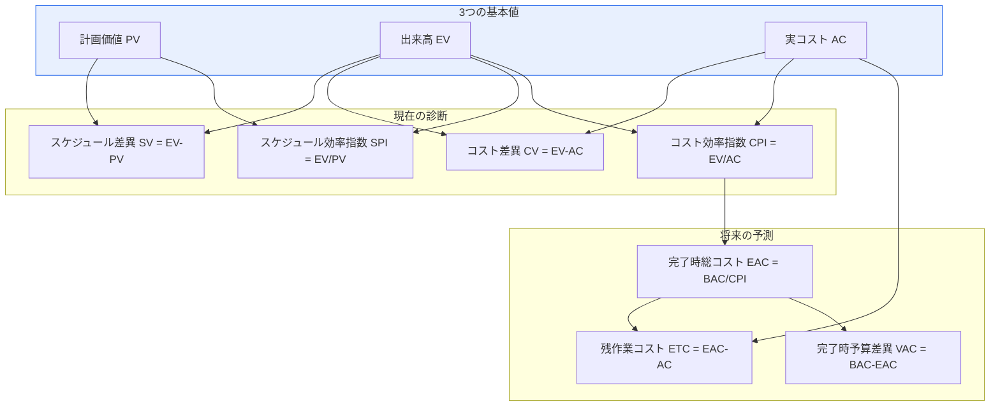
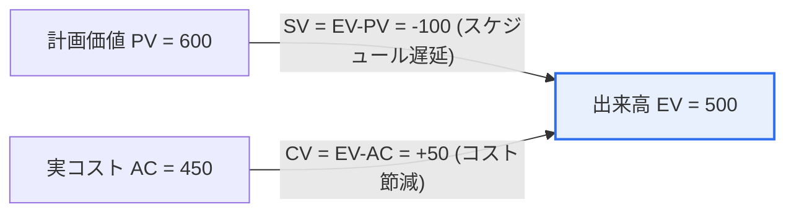

# アーンドバリューマネジメント(EVM, Earned Value Management)

## 1. 概要

### A. 定義

> **EVM(Earned Value Management)**とは、プロジェクトの**スケジュールとコストの成果を「計画価値(PV)・実コスト(AC)・出来高(EV)」という三つの貨幣単位の値で統合的に測定**し、進捗状況を客観的に分析して完了時期・完了コストを予測する、定量的な成果管理手法である。PMBOKでは、統合管理・スケジュール管理・コスト管理をつなぐ中核的な手法として扱われている。

EVMが強力である根本的な理由は、**「いくら使ったか」ではなく「使った分だけ成果を上げたか」を見る**点にある。伝統的な管理では「予算の50%を執行した」という情報でプロジェクトを判断していたが、この数字だけでは状態は分からない。予算の半分を使って作業の半分を完成させたなら正常だが、半分を使って30%しか完成していなければ深刻な危機である。すなわち「支出額」と「完成度」を切り離して見ると、プロジェクトの本当の健康状態が隠れてしまう。

EVMは、この「実際の成果」を**出来高(EV)**という概念で貨幣換算する。EVとは「これまでに実際に完成させた作業を、計画時の予算で換算した価値」である。このEVを計画価値(PV)と比較すればスケジュールが、実コスト(AC)と比較すればコストが分かる。要点は、スケジュールとコストを**同一の貨幣単位に換算**することで、それまで別々に管理されていた二つの軸を一つの座標系の上で同時に診断できる点にある。その結果、「スケジュールは遅れたがコストは節約した」や「コストは予算内だが進捗が不振である」といった複合的な状態を一枚の図で把握し、問題が大きくなる前に早期に対応できる。

### B. 登場の背景と必要性

EVMのルーツは、1960年代の米国防総省(DoD)による大型兵器システムの調達事業にある。複数年・複数組織が参加する超大型事業において、「予算は計画どおりに使われているか、そしてそれに見合うだけ作られているか」を統合的に監督する必要性が切実であり、これがコスト・スケジュール統制基準(C/SCSC)として制度化され、今日のEVM(ANSI/EIA-748標準)へと発展した。すなわちEVMは、「支出の追跡」と「進捗管理」がばらばらに行われ、プロジェクトが後半になってようやく危機を認識していた問題を解決するために生まれた手法である。

この必要性は今なお有効である。大規模・長期のプロジェクトほど進捗が目に見えず、「90%完成の罠(最後の10%が全体の半分の時間を食いつぶす現象)」に陥りやすい。EVMは、進捗を貨幣価値で定量化してこうした錯覚を取り払い、早期警報(Early Warning)のシグナルを提供するという点で必要性を持つ。

### C. 3つの基本値

EVMのすべての分析は、三つの基本値から出発する。この三つの値が何を意味するかを正確に区別することが、EVM理解の第一歩である。

| 値 | 正式名称 | 意味 | 問い |
|---|---|---|---|
| **PV(Planned Value)** | 計画価値(BCWS) | 特定の時点までに**完了する計画だった**作業の予算 | 「いくら分をやる予定だったか?」 |
| **EV(Earned Value)** | 出来高(BCWP) | 特定の時点までに**実際に完了した**作業の計画上の価値 | 「実際にいくら分をやったか?」 |
| **AC(Actual Cost)** | 実コスト(ACWP) | その作業を完了するために**実際に投入した**コスト | 「その仕事にいくら使ったか?」 |

三つの値の関係を直観的に理解するには、「レンガ積み」を思い浮かべればよい。今日までに100個積む計画であり(各1万ウォンの予算ならPV=100万ウォン)、実際には80個積み(EV=80万ウォン)、その80個を積むのに90万ウォンを使ったとすれば(AC=90万ウォン)、このプロジェクトは「計画より少なく積み(スケジュール遅延)、使った金額より少なく作った(コスト超過)」という診断が直ちに下される。PVは「計画線」、EVは「成果線」、ACは「支出線」であり、EVMはこの三本の線の相対的な位置でプロジェクトを読み解く。

以下は、三つの基本値から出発して差異・指数・予測の指標が派生する、EVMの指標体系全体を示した構造図である。

## 2. 分析指標と事例計算

### A. 差異(Variance)と指数(Index)

三つの基本値から、四つの中核的な派生指標が得られる。**差異(Variance)**は引き算によって絶対量(金額)の開きを、**指数(Index)**は割り算によって効率(比率)を示す。差異は「どれだけ開いたか」、指数は「どれだけ効率的か」に答えるものであり、この二つを併せて見ることで、規模と深刻度を同時に判断できる。

- **SV(Schedule Variance、スケジュール差異) = EV − PV** : 負なら計画より完成が少ない(遅延)、正なら先行。
- **CV(Cost Variance、コスト差異) = EV − AC** : 負なら予算超過、正なら節減。
- **SPI(Schedule Performance Index、スケジュール効率指数) = EV ÷ PV** : 1未満なら計画より遅い。
- **CPI(Cost Performance Index、コスト効率指数) = EV ÷ AC** : 1未満なら予算に対して非効率。

ここで必ず押さえておくべき実務上の含意は、**SVとSPIは時間ではなく「金額」を基準とするスケジュール指標**だという点である。プロジェクトが終了時点に近づくと、PVとEVは最終的に等しくなるため、SVは0に収束する。すなわちEVMのスケジュール指標は、プロジェクトの後半になるほど遅延を過小評価するという限界があり、これを補うために、実際の「時間」に基づくスケジュール予測手法であるアーンドスケジュール(ES, Earned Schedule)が併用されることもある。

### B. 事例計算 (EV=500, PV=600, AC=450)

与えられた事例で実際に分析を行う。まず三つの基本値の関係を図で見る。

| 指標 | 計算 | 結果 | 解釈 |
|---|---|---|---|
| **SV(スケジュール差異)** | EV−PV = 500−600 | **−100** | 負 → **スケジュール遅延** |
| **CV(コスト差異)** | EV−AC = 500−450 | **+50** | 正 → **コスト節減** |
| **SPI(スケジュール効率指数)** | EV/PV = 500/600 | **0.83** | <1 → 計画より17%遅い |
| **CPI(コスト効率指数)** | EV/AC = 500/450 | **1.11** | >1 → 予算に対して11%効率的 |

**総合診断**: このプロジェクトは、コスト面では計画より節約しているが(CV +50、CPI 1.11)、**スケジュールが遅延**している(SV −100、SPI 0.83)。四つの状態(正常/スケジュール遅延/コスト超過/両方に問題)のうち、「コストは良好だがスケジュールが遅延している」類型に該当する。実務的には、これはしばしば「投入人員が計画より少なくコストはあまり使っていないが、その分進捗も遅い」状況か、「熟練人員が効率的に働いているが絶対的な作業量が不足している」状況を示唆する。放置すれば遅延が納期不遵守につながり、挽回のために資源を急いで投入すれば、確保しておいたコスト上の優位(CV +50)まで相殺されうるため、先制的な介入が必要である。

### C. 完了予測 (EAC / ETC / VAC)

EVMの真の価値は、現在の診断を超えて**将来を予測**することにある。総予算(BAC)が分かっていれば、現在の効率(CPI)が維持されるという仮定のもとで、完了時点の総コストを次のように推定できる。

- **EAC(Estimate at Completion、完了時総コスト予測) = BAC ÷ CPI** (現在の効率が続くと仮定)
- **ETC(Estimate to Complete、残作業完了コスト) = EAC − AC**
- **VAC(Variance at Completion、完了時予算差異) = BAC − EAC**

例えば上記の事例で総予算BACが1,200であれば、CPI 1.11を維持するという仮定のもとでEAC ≈ 1,200 ÷ 1.11 ≈ 1,081となり、約119(VAC)の予算節減が見込まれる。ただし、スケジュール遅延が深刻で資源を追加投入しなければならない場合はCPIが低下するため、この予測は楽観的でありうる。スケジュールとコストを併せて考慮したEAC = AC + (BAC−EV)/(CPI×SPI)の式で保守的に推定するほうが、実務的に妥当な場合が多い。

## 3. マイナスのリスク(脅威)への対応策

スケジュール遅延という脅威に対しては、リスク対応戦略(回避・転嫁・軽減・受容)を適用できる。[[it-project-risk-response]] 以下の表は、各戦略をスケジュール・コストの状況に合わせて具体化したものである。

| 戦略 | スケジュール・コストへの適用例 | トレードオフ |
|---|---|---|
| **回避(Avoid)** | 遅延を引き起こす低価値の作業・範囲を取り除き、原因そのものを除去 | 範囲縮小により価値が減少しうる |
| **転嫁(Transfer)** | 一部の作業を専門の外注に回し、スケジュールリスクを移転 | 外注コスト↑、統制力↓ |
| **軽減(Mitigate)** | クラッシング(Crashing)・ファストトラッキング(Fast Tracking)で遅延を縮小 | コスト↑または手戻りリスク↑ |
| **受容(Accept)** | 軽微な遅延は予備(バッファ)スケジュールで吸収 | バッファを使い切ると代替策がない |

この事例で最も現実的な軽減策は、確保されたコスト上の余裕(CPI 1.11)を活用することである。第一に、**クラッシング(Crashing)**はクリティカルパス(Critical Path)上の作業に人員・コストを追加投入して期間を短縮する方法であり、コストは増えるものの、節減分(CV +50)の範囲内であれば正味のコスト増加なしにスケジュールを挽回できる。第二に、**ファストトラッキング(Fast Tracking)**は、本来順次行っていた先行・後続作業を並行させて期間を短縮する方法であり、追加コストはほとんどないが、並行に伴う手戻り(Rework)のリスクが大きくなる。二つの手法を選ぶ際には必ずクリティカルパスを基準に判断すべきであり、クリティカルパス外の作業を圧縮しても総スケジュールには影響を与えられず、コストだけを浪費する結果になるという点が、重要な実務上の含意である。

## 4. 比較: EVMと伝統的な進捗管理

EVMがなぜ優れているかは、伝統的な管理との対比で明らかになる。伝統的な方式では、「予算執行率」と「スケジュール遵守の有無」を別々に報告していた。このとき「予算50%執行、スケジュールは計画どおり」という報告は安心感を与えるが、実際には予算の50%で作業の30%しか完成していない危機的状況を隠しうる。支出と成果が切り離されているために「錯覚」が生じるのである。

| 区分 | 伝統的な進捗管理 | EVM |
|---|---|---|
| **測定対象** | 支出額・スケジュールをそれぞれ別々に | 成果(EV)中心に統合 |
| **スケジュールとコストの関係** | 分離 | 同一の貨幣単位で統合 |
| **問題を認識する時点** | 後半(納期直前) | 初期の早期警報 |
| **将来予測** | 主観的・定性的 | CPI・SPIに基づく定量予測(EAC) |

違いが生じる根本的な理由は、EVMが「完成した作業の価値(EV)」という第三の軸を導入し、支出と成果を結びつけたためである。この一つの変化が、早期警報と定量予測という実務上の利点を生み出す。ただしEVMの導入には、WBSの定義、進捗測定ルール(0/100、50/50、%完了など)の策定、原価集計体系の構築というコストが伴うため、小規模・短期のプロジェクトには過剰になりうるという点も、バランスよく認識しておかなければならない。

### 進捗測定ルール(EVの算定方法)の比較

EVの信頼性は、「完了をどのように認めるか」という測定ルールにかかっている。ルールの選択は作業の性格によって異なり、選び方を誤ると進捗が水増しされたり、過度に保守的に見積もられたりする。

| ルール | 認定方式 | 適した作業 | 特徴 |
|---|---|---|---|
| **0/100** | 完了前は0%、完了時に100% | 短い単位作業 | 最も保守的、操作の余地が少ない |
| **50/50** | 着手時に50%、完了時に100% | 1~2報告周期の作業 | 着手だけで半分を認定 |
| **%完了** | 担当者が進捗率を報告 | 長期・連続的な作業 | 柔軟だが主観が入るリスク |
| **マイルストーン加重** | 中間成果物ごとに重みを認定 | 多段階の成果物を伴う作業 | 客観的だが設計の負担が大きい |

例えば、2週間のスプリントで完了基準が明確な作業には操作の余地が少ない0/100を、数か月にわたる設計文書の作成には成果物単位で認定するマイルストーン加重ルールを適用するのが合理的である。要点は**プロジェクトの着手前にルールを合意・文書化**することであり、「進捗率を担当者の裁量で報告する」慣行を放置すれば、EVM全体が「希望の混じった数字」に成り下がる。

## 5. 深掘り: アジャイル環境におけるEVM(AgileEVM)と実務適用

伝統的なEVMは、「範囲が固定された」ウォーターフォール型プロジェクトを前提として設計された。しかし、範囲がスプリントごとに流動的なアジャイル環境では、PV・EVの定義が揺らぐ。これを補うために登場したのが**AgileEVM**であり、ストーリーポイント(Story Point)や完了したバックログ項目をEVの測定単位とし、リリース計画の総ポイントをBACに、スプリントごとの計画消化量をPVに換算する。例えば総計500ストーリーポイントのリリースで、3スプリント後に200ポイントを完了していれば、進捗(EV相当)は40%と換算され、これにチームのベロシティ(Velocity)を組み合わせて完了までのスプリント数を予測する。これは、アジャイルの柔軟性とEVMの定量予測を組み合わせようとする試みである。

実務適用の事例としては、米航空宇宙局(NASA)・国防総省の大型システム調達事業が代表的であり、これらは協力企業にANSI/EIA-748基準のEVMS(Earned Value Management System)認証を求めるほどEVMを制度化している。韓国国内でも、大型SI・公共情報化事業のプロジェクト管理(PMO)において、月次の成果報告にSPI・CPIを活用する事例が増えている。最近の動向としては、プロジェクト管理ツール(例: MS Project、Jiraプラグイン)がEVM指標を自動算出し、ダッシュボードで可視化することで、進捗データを入力するだけでリアルタイムの早期警報を提供する方向へと発展している。ただし、自動化が進むほど「EV測定ルールの信頼性」がより重要になるという点は変わらない。

### TCPIで見る挽回の可能性

EVMは、「今後どれだけうまくやれば目標を達成できるか」という問いにも答える。これを示す指標が**TCPI(To-Complete Performance Index、残作業効率指数)**であり、残りの予算で残りの作業を終えるために今後維持しなければならないコスト効率を意味する。式はTCPI = (BAC−EV) ÷ (BAC−AC)である。例えば前述の事例でBAC=1,200であれば、TCPI = (1,200−500) ÷ (1,200−450) = 700 ÷ 750 ≈ 0.93となる。これは「今後はこれまでよりやや余裕をもって(効率0.93程度で)作業しても予算内で完了できる」という意味であり、現在のCPI 1.11が確保した余裕を定量的に確認させてくれる。

TCPIの実務上の価値は、目標の「現実性の判定」にある。もしTCPIが1.2、1.3のように現在のCPIより大幅に高く出るなら、それは「これまでよりはるかにうまくやらなければ目標を達成できない」ことを意味し、たいていは目標そのものが非現実的であることを示唆する。この場合、プロジェクトマネージャーは無理な挽回を強いるよりも、予算・スケジュール・範囲のベースライン(Baseline)の再設定(Re-baselining)を利害関係者と協議するのが正しい。すなわちTCPIは、「奮起すれば何とかなる状況」と「ベースラインを修正すべき状況」を分ける客観的なシグナルとして機能する。

## 6. 考慮事項および示唆(技術士の観点)

1. **早期警報ツールとしての戦略的価値。** EVMの本質は事後精算ではなく、「問題を手遅れになる前に定量的なシグナルとして浮かび上がらせること」である。したがって大規模・長期・多組織のプロジェクトほど導入効果が大きく、月次ではなく週次の追跡によってシグナルの遅れを減らす運用が望ましい。

2. **EV測定の正確性がすべての前提。** 進捗率(EV)の算定が不正確であれば、SV・CV・SPI・CPI・EACがすべて歪む。明確なWBS分解、客観的な完了基準(マイルストーン・成果物)、一貫した進捗測定ルール(0/100など)を事前に合意しなければならず、「主観的な%完了」の報告はEVMを無力化する最もよくある失敗要因である。

3. **予測(EAC)に基づく先制的な意思決定。** CPI・SPIから算出したEAC・完了予想時期は、計画の修正、資源の再配分、範囲の調整の定量的な根拠となる。特にCPIが一定期間安定していればEAC予測の信頼度が高まるため、単発の数値ではなくトレンド(Trend)で判断することが重要である。

4. **スケジュール指標の限界の認識と補完。** SV・SPIは金額基準であるため、プロジェクトの後半に遅延を過小評価する。時間ベースのアーンドスケジュール(ES)手法や、クリティカルパス法(CPM)・バッファ管理(CCPM)と併用して、スケジュールリスクを多角的に検証しなければならない。

5. **方法論・文化との整合性。** アジャイル組織には、伝統的なEVMをそのまま押し付けるよりも、AgileEVM・バーンダウン/バーンアップチャートと組み合わせることで、抵抗なく機能させられる。EVMは統制ツールである以前に、「チームと利害関係者が状態を共有する言語」であることを忘れてはならない。

## 参考資料
- PMI, PMBOK Guide — Earned Value Managementの概要, https://www.pmi.org/
- ANSI/EIA-748 EVMS標準(概要), https://www.ndia.org/
- Earned Scheduleコミュニティ, https://www.earnedschedule.com/

---

> **一言まとめ**: EVMは、*PV・EV・ACによってスケジュール・コストの成果を一つの貨幣座標系で統合的に測定*し、早期警報と定量予測(EAC)を提供する手法であり、事例(EV500・PV600・AC450)ではSV−100・SPI0.83(スケジュール遅延)とCV+50・CPI1.11(コスト節減)と診断され、確保されたコスト上の余裕を用いてクリティカルパス上のクラッシング・ファストトラッキングを適用し、遅延の脅威に対応する。
