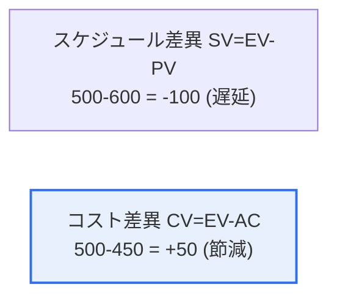

# アーンドバリューマネジメント(EVM, Earned Value Management)

## 1. 概要

### A. 定義
> **EVM**は、プロジェクトの**スケジュールとコストの成果を「計画(PV)・実コスト(AC)・出来高(EV)」という3つの値で統合的に測定**し、進捗状況を客観的に分析して完了時点を予測する成果管理手法である。

EVMが強力である根本的な理由は、「**いくら使ったかではなく、使った分だけ成果を出したかを見る**」点にある。単に「予算の半分を使った」という情報だけでは、プロジェクトの状態はわからない。半分を使って半分を完成させていれば正常であるが、半分を使って30%しか完成していなければ危機である。EVMはこの「実際の成果」を**出来高(EV)**という概念で測定する。EVは「これまでに実際に完成した作業の計画上の価値」である。これを計画価値(PV)・実コスト(AC)と比較すれば、3つのことが一目でわかる。計画より完成が遅れているか(スケジュール)、計画より多く使ったか(コスト)、そしてこの傾向ならいつ・いくらで終わるか(予測)である。すなわちEVMは、スケジュールとコストを別々に見ていた従来の方式とは異なり、両者を1つの成果指標に統合してプロジェクトの健全性を早期に診断する。そのため、手遅れになる前に問題を発見し対応できる。

### B. 3つの基本値
| 値 | 意味 |
|---|---|
| **PV(Planned Value)** | 計画された作業の予算(計画価値) |
| **EV(Earned Value)** | 実際に完了した作業の計画上の価値 |
| **AC(Actual Cost)** | 実際に投入したコスト |

## 2. 分析指標と事例計算

与えられた事例(EV=500, PV=600, AC=450)で計算してみる。

| 指標 | 計算 | 結果 | 解釈 |
|---|---|---|---|
| **SV(スケジュール差異)** | EV−PV = 500−600 | **−100** | 負 → **スケジュール遅延** |
| **CV(コスト差異)** | EV−AC = 500−450 | **+50** | 正 → **コスト節減** |
| **SPI(スケジュール効率指数)** | EV/PV = 500/600 | **0.83** | <1 → 計画より遅い |
| **CPI(コスト効率指数)** | EV/AC = 500/450 | **1.11** | >1 → 予算より効率的 |

**リスク要因の解釈**: このプロジェクトは、コストは計画より抑えられているが(CV +50, CPI 1.11)、**スケジュールが遅延**している(SV −100, SPI 0.83)。すなわち予算には余裕があるものの、進捗が遅いことが主なリスクである。スケジュール遅延が続けば納期を守れず、挽回のために資源を追加投入すればコスト面の利点まで失われる可能性がある。

## 3. 負のリスク(脅威)への対応策

スケジュール遅延という脅威に対しては、リスク対応戦略(回避・転嫁・軽減・受容)を適用できる。[[it-project-risk-response]]

| 戦略 | スケジュール・コストへの適用例 |
|---|---|
| **回避(Avoid)** | 遅延を引き起こす作業・スコープを調整・除去し、遅延原因そのものを取り除く |
| **転嫁(Transfer)** | 一部の作業を専門の外部委託先に移し、スケジュールリスクを移転する(ただしコスト↑) |
| **軽減(Mitigate)** | クラッシング(Crashing: 資源追加)・ファストトラッキング(並行化)で遅延を縮小する |
| **受容(Accept)** | 軽微な遅延は予備(バッファ)スケジュールで吸収する |

例えば、残っているコストの余裕(CPI 1.11)を活用して要員を追加投入する**クラッシング(Crashing)**で遅延を挽回したり、先行・後続作業を並行させる**ファストトラッキング(Fast Tracking)**でスケジュールを短縮したりするのが現実的な軽減策である。

## 4. 考慮事項および示唆

1. **早期警報ツールとしての価値**が大きい。EVMは問題を定量指標で早期に明らかにし、手遅れになる前に対応させるため、大規模・長期プロジェクトほど有用である。
2. **EV測定の正確性が前提**である。進捗率(EV)の算定が不正確であればすべての分析が歪むため、明確な完了基準(WBS・マイルストーン)と客観的な進捗測定が不可欠である。
3. **予測(EAC)によって意思決定を支援**する。CPI・SPIで完了時総コスト(EAC)・完了予定時点を予測し、計画修正・資源再配分などの先手を打った意思決定の根拠として活用する。

---

> **一言まとめ**: EVMは*PV・EV・ACでスケジュール・コスト成果を統合測定*する手法であり、事例(EV500・PV600・AC450)ではSV−100(スケジュール遅延)・CV+50(コスト節減)と診断され、クラッシング・ファストトラッキングなどの軽減戦略で遅延の脅威に対応する。
