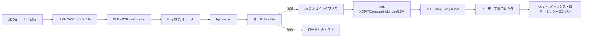
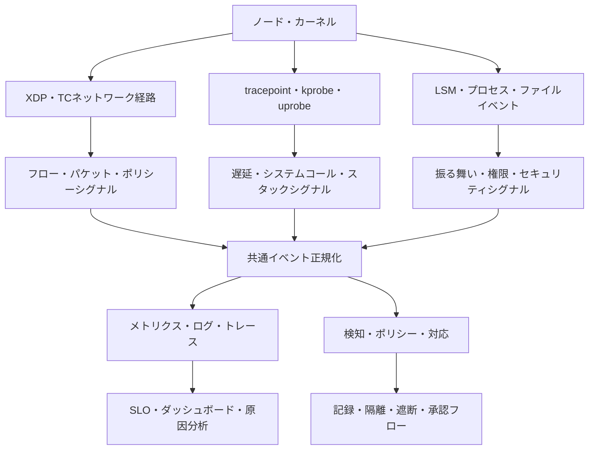

# eBPFベースのカーネル可視性・セキュリティ・ネットワーキング

## 1. 概要

> **定義**: eBPF(extended Berkeley Packet Filter)は、Linuxカーネルの定められたフック(hook)に検証可能なプログラムを動的に接続し、カーネルソースの変更や従来型のカーネルモジュールのロードなしに、ネットワーキング・トレーシング・セキュリティ機能を拡張する実行技術である。

eBPFは、もともとパケットを効率的にフィルタリングしていたBPFの適用範囲をカーネル全般へと拡張した技術である。
現在はネットワークパケット処理だけでなく、システムコールのトレース、プロセス・ファイル動作の監視、コンテナネットワークポリシー、性能分析とスケジューリングなど、多様な運用課題に使われている。
核心は、アプリケーションを再コンパイルしたりカーネルをフォークしたりすることなく、稼働中のシステムのカーネルイベントに小さなプログラムを接続する点にある。

従来のモニタリングは、アプリケーション計測ライブラリ、ログエージェント、パケットミラーリング、カーネルモジュールのいずれかを追加する方式であった。
この方式は、アプリケーションコードの修正、サイドカーの増加、コンテキストスイッチ、高いパケットコピーコスト、カーネルバージョン依存性のいずれかを負担する可能性がある。
eBPFはカーネル内でイベントに近い地点でプログラムを実行し、必要な要約情報だけをユーザー空間に渡すことで、観測遅延と変更範囲を縮小する代替案を提供する。

しかし、eBPFを「カーネルで何でも実行できる万能コード」と理解してはならない。
プログラムはカーネルのverifier検査を通過しなければならず、許可されたプログラムタイプ・ヘルパー・メモリアクセス・実行パスという制約を受ける。
また、カーネルバージョンとディストリビューション設定、権限、JITポリシー、データ転送量、本番障害時の復旧手順を併せて設計してはじめて、安全な運用が可能となる。

技術士の観点から見ると、eBPFは単一のツールではなく、カーネル拡張実行モデルとプラットフォーム運用戦略の結合である。
したがって答案では、実行モデル、フックとデータ構造、ネットワーク・観測・セキュリティへの活用、既存方式との比較、展開および統制方策を1つのアーキテクチャとして結び付けなければならない。

### 1.1 登場背景と必要性

第一に、クラウドネイティブ環境では障害の境界がアプリケーションだけにとどまらないためである。
1つのリクエストが複数のコンテナとノード、仮想ネットワーク、サービスメッシュ、外部APIを通過すると、アプリケーションログだけでは遅延と再送の原因を見つけにくい。
カーネルが観察するソケット、接続、システムコール、プロセスイベントを併せて見れば、コードを変更せずにインフラ経路の事実を把握できる。

第二に、セキュリティと性能のリアルタイム性が求められるためである。
ファイルアクセス・プロセス実行・権限昇格のような振る舞いを事後ログで分析すると、攻撃がすでに進行した後である可能性がある。
カーネルフックで振る舞いを検知し、ポリシーに従って記録・遮断すれば検知時間を短縮できるが、遮断は業務影響と誤検知のコストが大きいため、観察と適用を分離した段階的導入が必要である。

第三に、ネットワークデータパスの効率を高める必要があるためである。
従来のパケット処理では、カーネルとユーザー空間の間のコピーや複数レイヤーの処理がボトルネックになり得る。
XDPのような早期フック、TC、AF_XDPを適切に使えば、パケットをより前段で分類したりユーザー空間の高速処理に渡したりできるが、性能だけを見て意味の検証と運用性を犠牲にしてはならない。

### 1.2 目標と適用範囲

eBPF適用の目標は、通常4つに整理できる。
第一は、システムコール・カーネル関数・ユーザー関数に対する動的トレーシングである。
第二は、ソケットとパケットを利用したネットワーク可視性・ポリシー・負荷処理である。
第三は、プロセス・ファイル・権限に関する振る舞いのセキュリティ検知と制限である。
第四は、コンテナとノードの性能指標を収集してサービスレベル目標と結び付けることである。

対象範囲が広いため、まず意思決定のための問いを定める必要がある。
「どのサービスのp99遅延が増加したか」が問いであれば、ネットワークフローとスケジューリング遅延を要約するプログラムが必要である。
「異常なバイナリが実行されたか」が問いであれば、プロセス実行イベントとファイルハッシュ・親子関係を結び付けるセキュリティイベントモデルが必要である。
問いなしにすべてのイベントを収集すると、カーネル負荷、保存コスト、個人情報の露出、アラート疲れが急速に大きくなる。

## 2. eBPF実行モデルと主要構成要素

### 2.1 全体構造

eBPFプログラムは一般にユーザー空間で作成・コンパイル・ロードされるが、イベント発生時の中核的な実行はカーネル内で行われる。
ユーザー空間のローダは、プログラム、マップ、リンクと必要なメタデータをカーネルに要求する。
カーネルはプログラムタイプと接続ポイントを確認し、verifierで安全性を検査した後、許可された場合はインタプリタまたはJITコンパイル経路で実行する。

この構造では、ユーザー空間とカーネル空間の責任を分離することが重要である。
カーネルプログラムは、イベントを高速にフィルタリングし最小限の状態を記録する役割を担う。
複雑な文字列解析、外部API呼び出し、長時間のポリシー判断はユーザー空間で行うことで、カーネルの実行パスが予測可能になり、verifierの制約も管理しやすくなる。

### 2.2 プログラムとverifier

eBPFプログラムは、特定のプログラムタイプとフックに合わせた制限付き実行環境で動作する。
例えば、ネットワークプログラムはパケットコンテキストにアクセスし、トレーシングプログラムはイベントコンテキストやレジスタ情報にアクセスし、LSM系プログラムはセキュリティ関連の決定ポイントに接続される。
したがって、同じソースでもプログラムタイプによってアクセス可能なコンテキストと戻り値の意味が異なる。

verifierは、プログラムが許可されたメモリだけを読み書きするか、ポインタの有効性を追跡できるか、使用するヘルパーがプログラムタイプに許可されているか、実行パスが終了可能かを検査する。
この検査はカーネルの安定性を守るための中核的な統制であるが、verifierの通過が業務ロジックの正確性や個人情報の適正性を保証するわけではない。
例えば、安全に実行されるプログラムが過剰なイベントを生成したり、誤ったプロセスを遮断したりする可能性があるため、別途の機能検証と権限レビューが必要である。

検証失敗は単なる文法エラーとは異なる。
データ型・ポインタの状態をverifierが証明できなかったり、サポートされていないヘルパーを呼び出したり、特定のカーネルで提供されないコンテキストを前提としたりすると、ロード段階で拒否される可能性がある。
運用チームは検証ログを保存し、失敗したプログラムを自動ロールバックし、カーネルバージョンごとの回帰テストを実施しなければならない。

### 2.3 JITと実行効率

JIT(Just-In-Time)コンパイルは、検証済みのeBPF命令をホストCPUのネイティブ命令に変換し、繰り返し実行のコストを下げる方式である。
JITを使ってもverifier検査を迂回するわけではなく、ロード段階の安全性検証と実行段階の性能最適化は互いに異なる機能である。
ディストリビューションやセキュリティ基準によってJITの使用・ハードニング・デバッグオプションが異なり得るため、運用標準に明記すべきである。

性能評価は単一の平均CPU使用率で終わらせない。
イベント発生率、プログラム実行時間、マップ競合、リングバッファ損失率、ユーザー空間の消費遅延、ネットワークパケットドロップ、サービスp99遅延を併せて測定する。
特に、すべてのシステムコールごとに大きな文字列やパケット全体をコピーすると、「コード修正不要」という利点がデータ転送コストで相殺される可能性がある。

### 2.4 mapsとデータ伝達

マップ(map)は、カーネルプログラムとユーザー空間がキー・バリュー形式の状態を共有するデータ構造である。
カウンタ、ハッシュ、LRU、配列、スタックトレース、ソケット情報のように目的に合ったタイプを選択し、キーのカーディナリティと寿命、並行性、メモリ上限を設計する。
マップを使えば、イベントごとにユーザー空間を呼び出さずにカーネル内で集計した後に定期的に読み取れるため、観測コストを削減できる。

ただし、マップは無制限のストレージではない。
ユーザー・コンテナ・プロセスごとのキーを無分別に作ると、メモリ使用量と固有時系列数が爆発的に増加し、攻撃者が高カーディナリティの値を生成してサービス拒否を誘発する可能性がある。
マップサイズ、キーの正規化、有効期限・追い出しポリシー、個人情報フィールドのハッシュ化・マスキングを事前に定め、超過時にはサンプリングや集計を適用する。

イベント伝達には、perf buffer、ring buffer、マップのポーリングなど複数の選択肢がある。
固定カウンタはマップ参照で十分な場合もあるが、順序が重要なプロセス実行イベントにはイベントバッファが適している場合がある。
どの方式を選択しても、バッファ飽和時のドロップ有無とドロップされたデータの意味を監視しなければならず、観測データが完全であると仮定してはならない。

### 2.5 フック、ヘルパーとBTF

フックはプログラムが実行されるイベントポイントである。
XDPはネットワークデバイスの早期受信経路でパケットを処理し、TCはトラフィック制御経路に接続される。
tracepointはカーネルが提供する比較的安定したトレースポイントであり、kprobeはカーネル関数のエントリを動的に観察する際に柔軟であるが、カーネル実装の変更の影響をより受けやすい。
uprobeはユーザー空間の関数に接続し、LSMフックはセキュリティポリシーのポイントに接続する。

ヘルパー関数は、eBPFプログラムがカーネル機能とやり取りする制限された呼び出しインターフェースである。
プログラムタイプごとに許可されるヘルパーは異なり、ヘルパーの戻り値と失敗条件を確認しなければ、データ欠落や誤ったポリシー判断が生じる可能性がある。
新しいヘルパーやフックに依存するプログラムは最小サポートカーネルを定め、機能検出の後に代替経路を提供すべきである。

BTF(BPF Type Format)は、カーネルとプログラムの型情報を表現するメタデータである。
libbpfとCO-RE(Compile Once, Run Everywhere)方式は、BTFと再配置情報を活用してカーネルデータ構造の小さな差異に対応できるよう支援する。
これはバイナリを一度作ればすべてのLinuxで無条件に動作するという意味ではなく、サポート範囲とBTFの品質・機能の可用性を前提とした移植性戦略である。

## 3. ネットワーキング・オブザーバビリティ・セキュリティアーキテクチャ

### 3.1 活用領域の統合図

eBPFは1つの製品名ではなく、共通の実行基盤である。
ネットワークデータパスではパケットフィルタリング・ロードバランシング・ポリシー適用に使われ、オブザーバビリティではシステムコールとソケットをサービス単位のフローに変換する。
セキュリティでは、プロセス・ファイル・ネットワークの振る舞いを検知したり、一部のポイントで拒否したりする。

3つの領域の共通点はカーネルイベントを観察することであるが、正確度と責任の基準は異なる。
性能観測は一部のサンプル欠落を許容できても、セキュリティ監査イベントは欠落の意味を明示しなければならない。
パケット処理ポリシーはマイクロ秒単位の効率が重要な場合があるが、遮断ルールの変更には承認・ロールバック・緊急バイパスが必要である。

### 3.2 ネットワークとXDP

XDPは、パケットがネットワークスタックのより後方に進む前に処理できるポイントを提供する。
したがって、DDoS緩和、初期フィルタリング、パケットカウント、高速フォワーディングのように迅速な判断が必要な業務に適している場合がある。
ただし、XDPですべてのプロトコル解析と業務判断を行おうとするとプログラムの複雑度と保守負担が大きくなるため、早期ドロップ・分類と後続処理の境界を定める。

TCは、トラフィック制御経路でingress・egressポリシーとパケット処理を扱う際に活用できる。
コンテナネットワークでは、インターフェース・ネームスペース・サービス識別子をパケットフローと結び付ける必要があるため、単純な5タプルだけを記録すると実際のサービス関係を失う可能性がある。
Kubernetesに適用する際は、Podの再作成、ノード移動、ネットワークポリシーの変更を考慮して識別子を安定的に付与し、系譜を管理する。

AF_XDPは、XDPと連携してパケットをユーザー空間ソケットに渡す方式である。
これは高速パケット分析や特殊なネットワークアプリケーションに有用な場合があるが、キュー・メモリ領域・CPU固定・ドロップ処理といった運用設計が必要である。
一般的なWebサービスの観測に無条件でAF_XDPを適用することは、複雑度に比べて利益が小さい可能性があるため、トラフィック量と遅延目標で判断する。

### 3.3 オブザーバビリティと分散トレーシング

eBPFによるオブザーバビリティは、アプリケーション計測を完全に置き換えるというより、レイヤーを補完するものである。
カーネルから接続確立、DNS、TCP再送、ソケット遅延、プロセススケジューリングを取得し、アプリケーション計測からビジネス関数・テナント・論理的な作業を取得すれば、両データを相関IDで結合できる。
この結合がなければ、「ネットワークが遅い」と「決済関数が遅い」を同一リクエストの原因フローとして結び付けることは難しい。

ゼロコードまたはローコードの観測は迅速な初期可視性を提供するが、意味情報が限定される可能性がある。
例えば、HTTPステータスコードとソケット遅延は得られても、特定の商品照会がなぜ遅いのか、どの業務ルールが失敗したのかはわからない。
したがって、中核サービスではeBPFベースの自動観測と選択的なアプリケーション計測を併用し、重複収集を減らす統合スキーマを定義する。

### 3.4 セキュリティ検知と適用

セキュリティへの活用は、実行ファイルの生成・実行、権限変更、ファイルアクセス、ネットワーク接続のような振る舞いをイベントとして収集することから始まる。
親プロセス、ユーザー・コンテナ・ネームスペース、ファイルパス、宛先、ポリシーバージョンを併せて記録すれば、単一のイベントよりも攻撃の文脈を分析しやすい。
ただし、カーネルで収集できる事実とユーザー空間で推論したリスクスコアを別フィールドとして区別しなければ、監査と再現は不可能である。

検知と遮断は異なる運用モードである。
初期は観察専用でベースラインを作成して誤検知を分析し、その後、特定の高信頼ルールだけを警告・隔離・遮断に昇格させる。
遮断プログラムがエラーを起こすと、正常なデプロイや障害復旧まで妨げる可能性があるため、例外リスト・緊急解除・直前の正常ポリシー・管理者承認経路を準備する。

## 4. eBPFの構成方式と既存技術の比較

### 4.1 主要フックの比較

フックを選択する際は、必要なイベントの意味だけでなく、安定性、実行タイミング、オーバーヘッド、カーネルのサポート範囲を併せて評価しなければならない。
tracepointはカーネルが公開的に提供するトレースポイントであるという長所があるが、細かな内部関数のフローは不足する場合がある。
kprobeは柔軟であるが、内部関数名と引数構造の変更の影響を受けやすい。

|区分|主な目的|長所|注意点|
|---|---|---|---|
|XDP|早期パケット処理|低い経路遅延、初期ドロップ・分類|デバイスドライバモードとプログラム制約の確認|
|TC|ingress・egressトラフィック制御|ポリシー・フォワーディング・パケット修正|経路とネットワークネームスペースの分析が必要|
|tracepoint|安定したカーネルイベントのトレース|明示的な形式、運用観測に有利|提供イベントの意味と粒度の限界|
|kprobe|カーネル関数の動的トレース|高い柔軟性|カーネル内部の変更・引数解釈の影響|
|uprobe|ユーザー空間関数のトレース|アプリケーション境界の補完|バイナリ・シンボル・ビルド変更の影響|
|LSM|セキュリティポリシーのポイント|振る舞い検知・一部適用|権限・誤検知・業務中断のリスク|

表の違いは単なる機能一覧ではなく、運用上の選択理由を示している。
例えば、障害原因分析用の長期運用プログラムは安定性の高いtracepointを優先し、特定のカーネル関数の短期診断にはkprobeを一時的に使用できる。
セキュリティ遮断は最も強力な統制のように見えるが、影響度が大きいため、フックの技術的可能性よりもポリシーの検証可能性と復旧性が優先される。

### 4.2 既存方式との比較

エージェントベースのモニタリングは、アプリケーションとオペレーティングシステムから幅広いデータを収集し、成熟した管理機能を提供する。
一方で、すべてのノードにプロセスを配置し、コレクタとアプリケーションの間にCPU・メモリ・ネットワークのコストが発生する。
サービスメッシュのサイドカーはサービス間のポリシーとテレメトリを一貫させることができるが、プロキシのホップと証明書・設定の運用が追加される。

eBPFはアプリケーション変更を減らしてノード単位の共通観察を提供するが、カーネルと権限に依存し、業務上の意味を自動的に理解することはできない。
APMは関数・トランザクションレベルの豊富なコンテキストを提供するが、コード計測とランタイムオーバーヘッド、言語別のサポートを考慮する必要がある。
したがって、3つの方式は代替関係ではなく、観察位置と意味レベルを分担する関係として設計するのが現実的である。

|比較軸|eBPF|エージェント/APM|サービスメッシュのサイドカー|
|---|---|---|---|
|変更位置|カーネルフック・ノード|アプリケーション・ノード|サービス間プロキシ|
|コード変更|概ね不要または少ない|計測・設定が必要|アプリケーション変更は少ないがメッシュ設定が必要|
|強み|共通インフラの可視性・動的適用|業務・関数のコンテキスト|通信ポリシー・mTLS・トラフィック管理|
|弱み|カーネル依存・業務上の意味の不足|言語・ライブラリ依存|ホップ・リソース・運用複雑度の増加|
|適した問い|ノード・ソケット・システムコールで何が起きたか?|関数とトランザクションはなぜ遅いか?|サービス間通信をどのポリシーで統制するか?|

例えば、決済APIのp99遅延が増加した状況を考えてみる。
eBPFは再送とソケット待ち、CPUスケジューリング遅延を示すことができ、APMは決済検証関数とデータベース呼び出しの時間を示すことができる。
サービスメッシュは特定サービス間のリトライとタイムアウト、暗号化通信の状態を示すことができるため、原因分析には3つのレイヤーのシグナルを相関させる必要がある。

## 5. 導入・開発・運用の手順

### 5.1 要件とリスク分類

最初の段階は、収集するイベントではなく、解決すべき運用・セキュリティ上の問いをリスト化することである。
問いごとに、必要な正確度、許容遅延、保存期間、個人情報の有無、遮断の必要性、対象ノードとカーネル範囲を記録する。
サービス性能分析、セキュリティ監査、ネットワークポリシー、高速パケット処理はそれぞれ異なるプログラムとSLOを要求するため、1つのプログラムにすべてを入れない。

次に、観察専用、警告、隔離、遮断のリスク等級を分類する。
観察専用は欠落・誤検知を把握するのに適しており、警告は運用者が対応できる証拠を提供しなければならない。
隔離・遮断は、業務影響分析と承認・ロールバック計画を通過した高信頼ポリシーにのみ適用する。

### 5.2 開発と検証

開発者は、まずサポートカーネルとプログラムタイプを確認し、最小機能のプログラムから作成する。
カーネル内では、パケットヘッダの解析、カウンタの増加、必須フィールドの抽出のように短く予測可能な作業を行い、複雑な正規表現・外部通信・大規模なデータ加工はユーザー空間へ移す。
プログラムバージョン、ポリシーバージョン、ビルドツール、BTF・CO-RE設定をアーティファクトとともに管理してはじめて、障害時にどのコードが実行されたかを再現できる。

検証は3つの層に分ける。
第一に、verifierによるロード成功と、想定したフックへの接続有無を確認する。
第二に、テストカーネルと実際のディストリビューションで、イベントの意味・マップサイズ・バッファ損失を検証する。
第三に、負荷・障害・ロールバック試験で、アプリケーションSLOとセキュリティポリシーの副作用を確認する。
検証データに実際の個人情報を使わず、合成・匿名化されたイベントを優先することも重要である。

### 5.3 展開と権限統制

展開は、すべてのノードに同時に適用するよりも、開発・ステージング・少数のカナリアノード・全体拡大の順に進める。
ノードイメージとカーネルのアップグレードがeBPFプログラムのロード可否に影響を与え得るため、ノードプールごとの機能検出と互換性マトリクスを運用する。
機能のないノードでは、安全な収集停止や既存エージェント経路への切り替えを行うよう設計する。

権限は最小権限の原則に従って分離する。
プログラムローダ、ポリシー変更者、イベント照会者、ダッシュボード利用者、緊急解除承認者の役割を分け、ロード・attach・mapアクセス・ポリシー変更を監査ログに残す。
コンテナに広範なカーネル権限を付与する方式は便利であるがホストの攻撃対象領域を広げる可能性があるため、権限要求を機能ごとにレビューし、ランタイムのセキュリティ境界とともに管理する。

### 5.4 観測データの品質とコスト

コレクタ自体を観測しなければ、eBPFダッシュボードの空白画面をシステム正常と誤解する可能性がある。
プログラムの実行回数・実行時間、イベント生成量、バッファドロップ、マップ使用量、ユーザー空間の消費遅延、ローダエラーをメタモニタリングする。
異常発生時に「イベントがなかった」と「コレクタが故障した」を区別できるよう、ヘルスイベントを別途送信する。

データコストは、カーディナリティと保存期間の関数として管理する。
生イベントを長期保存するよりも、ノード・サービス・時間ウィンドウ単位で集計し、調査期間中のみ詳細サンプルを一時的に増やす。
宛先IP、ユーザーID、ファイルパスのように機微または固有の値は業務目的に合わせてマスキング・仮名化し、検索インデックスと原本保存のアクセス権限を分離する。

## 6. 産業適用事例

### 6.1 Kubernetesサービス障害分析

多数のPodがデプロイされたEコマースクラスタで、決済サービスの遅延が増加したと仮定する。
eBPFコレクタは、ノードごとのTCP再送、接続確立時間、ソケット待ち、プロセスのCPUスケジューリング遅延を集計し、Pod・サービス・ノードのメタデータと結合する。
この結果により、アプリケーションコードの問題なのか、特定ノードのネットワーク経路の問題なのか、サービスメッシュのリトライ急増なのか、探索範囲を絞り込むことができる。

ただし、Pod名は再作成時に変わり得るため、デプロイメント・サービス・ワークロード単位の識別子を併せて記録する。
ネームスペースとテナント情報がイベントに含まれる場合は、権限のあるユーザーのみが照会できるようアクセス制御を適用する。
障害分析用の詳細データを無期限に保存せず、調査終了後に保存期間に従って破棄することが、個人情報とコストの両面で望ましい。

### 6.2 金融サービスの振る舞い検知

金融サービスは、承認サーバで異常なプロセスが実行されたり、機密性の高い設定ファイルが読み取られたりする振る舞いを迅速に把握しなければならない。
プロセス実行イベント、親子関係、実行ファイル識別子、ユーザー・コンテナのコンテキスト、ファイルアクセスを結び付ければ、単純なログインログよりも振る舞いの連鎖を豊富に把握できる。
リスクの高いルールは、まず観察モードで運用し、正常なバッチ・バックアップ・セキュリティツールの例外パターンを学習した後に警告ポリシーへ昇格させる。

遮断は変更管理と切り離さない。
例えば、承認システムのスクリプト実行を一括遮断すると、緊急復旧手順まで停止する可能性がある。
運用者は、ポリシーに有効期限・例外理由・承認者・ロールバックコマンドを含め、遮断前に影響を受ける業務と代替チャネルを確認しなければならない。

### 6.3 高速ネットワークエッジ

コンテンツ配信やDDoS防御のエッジでは、パケットがアプリケーションに到達する前に、送信元・プロトコル・レート基準で分類できる。
XDPベースの初期フィルタは正常経路のパケットを高速に通過させ、疑わしいトラフィックはカウンタとサンプルを残した後に後段の分析器へ渡す構造が可能である。
このとき、フィルタルールの変更遅延、正常パケットの誤差率、NIC・ドライバのサポート、CPUコア分散と緊急解除経路を併せて検証する。

初期段階ですべてのトラフィックをユーザー空間に渡すと、AF_XDPの利点よりもキューとメモリの運用負担が大きくなる可能性がある。
したがって、単純なドロップ・カウントはXDPに置き、プロトコルの詳細分析は適切な後段に委任する階層化が必要である。
性能値も理想的なベンチマークではなく、実際のパケットサイズ・ルール数・同時フロー・障害条件で測定しなければならない。

## 7. 深掘り: CO-RE・プラットフォーム標準化と運用の進化

カーネルバージョンが多様な大規模環境では、プログラムをノードごとに再ビルドする方式が運用負担を生む。
BTFとCO-REは、カーネルの型情報と再配置メタデータを利用して、配布可能なバイナリの移植性を高める方向性を示している。
しかし、CO-REがすべてのカーネル差異を解決するわけではないため、機能検出・最小カーネルバージョン・代替プログラム・展開前の互換性試験を併せて運用しなければならない。

eBPFエコシステムは、libbpf、bpftool、コンパイラ、言語別バインディング、観測・ネットワーク・セキュリティツールが結合するプラットフォーム形態へと発展している。
プラットフォームチームは、ツールごとのイベント形式をそのまま収集するよりも、共通のサービス・ノード・プロセス・ネットワーク識別子と時間基準を定め、相関分析を可能にすべきである。
OpenTelemetryのような上位のテレメトリ体系にエクスポートする際も、eBPFが直接観察した事実、アプリケーションが計測した意味、後段で計算した推論を区別する。

最近の運用の核心は、「何でも収集」から「目的に合ったカーネルシグナルを最小コストで収集」する方向へ移行している。
オブザーバビリティ・セキュリティ・ネットワークの各チームが同じノード上で異なるプログラムを実行すると、フックの重複、マップメモリの競合、イベントの重複とポリシーの衝突が発生する可能性がある。
共通ローダとプログラムのライフサイクル、リソース予算、所有権、衝突調整、緊急無効化手順をプラットフォームガバナンスとして管理しなければならない。

技術士の答案では、eBPFをサービスメッシュ・OpenTelemetry・ゼロトラスト・DevSecOps・SREと結び付けることができる。
ただし、各技術の役割を混同してはならない。
eBPFはカーネルに近い位置でシグナルとポリシー適用ポイントを提供し、サービスメッシュはサービス通信の制御を、OpenTelemetryはテレメトリの交換を、ゼロトラストはアクセス決定の原則を提供する。

## 8. 考慮事項および示唆

### 8.1 安定性と互換性

カーネル・ディストリビューション・ドライバ・アーキテクチャごとの機能差を事前にリスト化し、サポートマトリクスを維持しなければならない。
アップグレード前に、verifier、BTF、フック、ヘルパー、JIT、ネットワークモードの回帰テストを行い、失敗時には観測の空白を通知する代替経路を準備する。

### 8.2 セキュリティと権限

eBPFのロード権限は強力なカーネル機能にアクセスする権限であるため、一般のアプリケーション権限と分離する。
署名済みアーティファクト、許可されたリポジトリ、コードレビュー、ロード監査、有効期限付きポリシーと緊急遮断を運用し、サプライチェーンと内部不正使用のリスクを低減する。

### 8.3 性能とリソース

プログラム実行時間、マップメモリ、イベントバッファ、CPU固定、パケットドロップを、サービスSLOとともに測定する。
サンプリング・集計・キー制限をデフォルトとし、性能改善を主張する際は比較基準と負荷条件を明示しなければならない。

### 8.4 データ保護

ファイルパス、コマンドライン、ユーザー識別子、宛先アドレスは、個人情報または機微な運用情報になり得る。
収集目的・最小収集・マスキング・アクセス制御・保存期間・破棄・監査ログをデータガバナンスに含め、調査用の原本と長期指標を分離する。

### 8.5 検知と適用の分離

観察結果をそのまま遮断ルールに転換せず、ベースライン・誤検知・例外・業務影響を検証する。
ポリシーの昇格には承認者と有効期限を設け、ロールバックと緊急バイパスが正常に動作するかを定期的に訓練する。

### 8.6 運用責任と重複

同一のシステムコールとネットワークフローを複数のチームが重複して収集すると、コストと解釈の不一致が大きくなる。
共通イベントスキーマ、プログラム所有者、マップ・バッファ予算、変更管理と障害対応のRACIを定め、プラットフォーム資産として管理する。

### 8.7 答案作成と将来展望

答案は、定義→実行モデル→フック・マップ・verifier→活用アーキテクチャ→既存方式との比較→導入手順→事例→リスク統制の順に展開すると論理性が高まる。
将来展望は、カーネル機能の拡張だけを強調するよりも、移植性、標準テレメトリ、安全な権限委譲、自動化されたポリシー検証、AIインフラの観測要求と結び付けて記述する。

## 参考資料

- Linux Kernel Documentation, eBPF Userspace API: https://docs.kernel.org/userspace-api/ebpf/index.html
- Linux Kernel Documentation, BPF: https://docs.kernel.org/bpf/
- eBPF Foundation, Core Infrastructure Landscape: https://ebpf.io/infrastructure/
- eBPF Foundation, What is eBPF?: https://ebpf.io/what-is-ebpf/
- eBPF Docs, Linux concepts and reference: https://docs.ebpf.io/linux/
- Kubernetes Blog, Using eBPF in Kubernetes: https://kubernetes.io/blog/2017/12/using-ebpf-in-kubernetes/
- Red Hat Documentation, Getting started with XDP and eBPF: https://docs.redhat.com/en/documentation/red_hat_enterprise_linux/10/html/configuring_firewalls_and_packet_filters/getting-started-with-xdp-and-ebpf

---

> **一言まとめ**: eBPFは、verifierで安全性を確認したカーネルプログラムをフックに接続し、ネットワーク・オブザーバビリティ・セキュリティを基盤レベルで拡張する技術であり、導入の成功はCO-RE互換性・最小権限・コスト・データ保護・ロールバックまで含めたプラットフォーム運用によって完成する。
