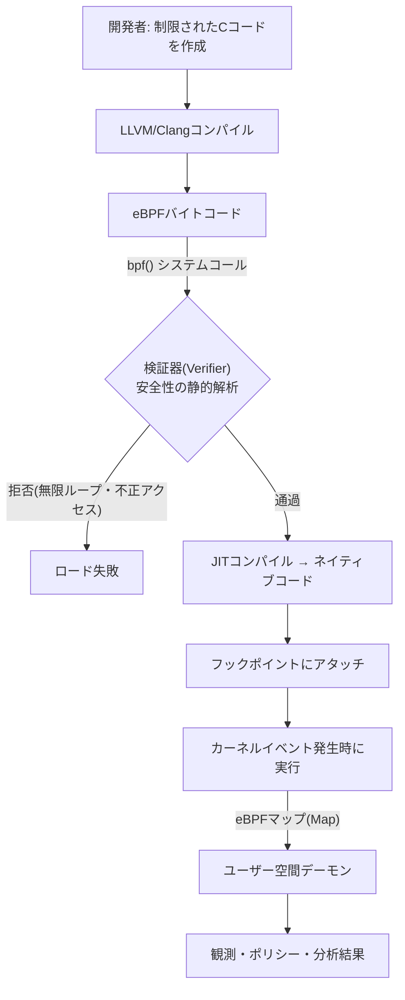
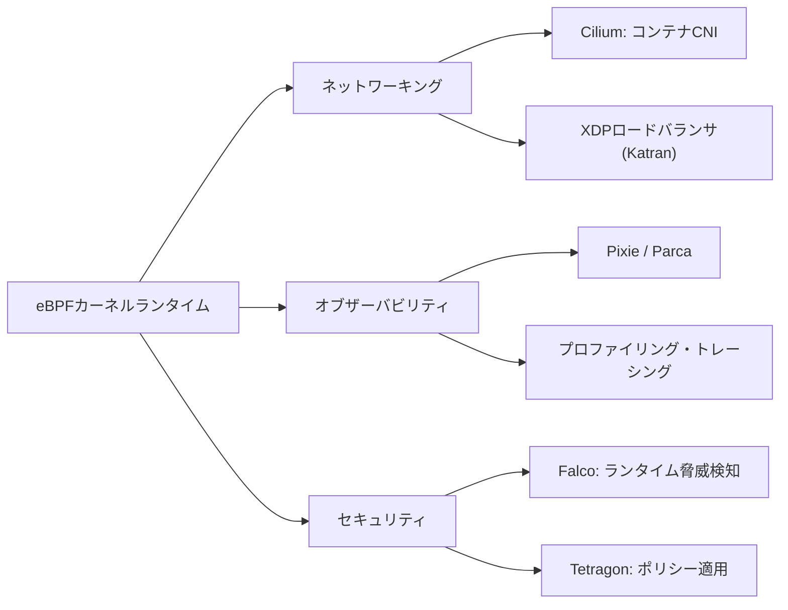

# eBPF(extended Berkeley Packet Filter)

## 1. 概要

> **定義**: eBPFは、オペレーティングシステムのカーネルを再コンパイルしたり新たにカーネルモジュールをロードしたりすることなく、検証器(Verifier)を通過したユーザー定義プログラムをカーネル内部の特定イベント(システムコール・ネットワークパケット・関数エントリなど)に安全にアタッチして実行する、カーネル内の軽量実行技術である。

eBPFのルーツは、1992年にパケットフィルタリングのために登場したBPF(Berkeley Packet Filter、以下cBPF)にある。
cBPFは、`tcpdump`が関心のあるパケットだけをカーネルでフィルタリングしてユーザー空間に渡すための小さな仮想マシンであったが、レジスタが2つしかなく、パケットフィルタリング以外には使えない制限的な構造であった。
2014年にLinuxカーネル3.15で導入されたeBPFは、このアイデアを大幅に拡張し、64ビットレジスタ11個とデータ構造(マップ)、ヘルパー関数呼び出しを備えた**カーネル内の汎用実行環境**として生まれ変わらせた。
その結果、今日のeBPFは単なるパケットフィルタを超え、ネットワーキング・オブザーバビリティ(Observability)・セキュリティ・性能分析全般を包含する基盤技術として定着した。

eBPFが技術士の観点から重要である理由は、それが「カーネルを変えずにカーネルの振る舞いを変える」という新たな拡張パラダイムを切り開いたからである。
従来、カーネルの動作を変えるには、カーネルソースを修正してリリースサイクルを待つか、リスクを承知でカーネルモジュールをロードする必要があった。
前者は数年を要し、後者は失敗すればカーネルパニックでシステム全体を停止させる。
eBPFはこの2つの選択肢の間に、**検証器が安全を保証するサンドボックスプログラム**という第3の道を示した。この点こそが、Linuxを「プログラム可能なカーネル」へと進化させた核心である。

### 1.1 登場背景と必要性

第一に、クラウドネイティブ環境で急増する計測要求のためである。
コンテナ・マイクロサービスが普及するにつれ、1つのノード上で数百のプロセスが生成・消滅し、それらがカーネルを通じてやり取りするシステムコール・ネットワークフローを、アプリケーションコードを修正せずに観測する必要性が高まった。
アプリケーションごとにエージェントを埋め込みコードを計測する方式は、言語・フレームワークがまちまちであるため拡張性に欠けるが、すべてのプロセスが必ず経由するカーネルで一度計測すれば、言語に関係なく全体を観測できる。

第二に、カーネルモジュールの危険性と保守負担のためである。
カーネルモジュールはカーネルと同じアドレス空間で無制限の権限で実行されるため、バグ1つでシステム全体が崩壊し、カーネルバージョンが上がるたびに書き直し・再検証が必要となる。
eBPFプログラムはロード時点で検証器が無限ループ・不正なメモリアクセスを事前に遮断するため、比較的安全にカーネルレベルの機能を展開できる。

第三に、性能オーバーヘッド最小化の要求のためである。
観測やポリシー適用のためにパケットをユーザー空間にコピーして処理すると、コンテキストスイッチ・コピーのコストが累積する。
eBPFはカーネル内部、さらにはネットワークドライバ層(XDP)で処理を完結できるため、遅延とCPU消費を大きく削減する。

### 1.2 主要特徴

eBPFの性格は4つの特徴に要約される。
**安全性**は検証器がプログラムの停止性とメモリ安全性を静的に保証する点であり、**性能**はJITコンパイルによりバイトコードがネイティブ機械語に変換されて実行される点である。
**動的拡張性**はシステムを再起動せずにプログラムを着脱してカーネルの振る舞いを変えられる点であり、**プログラマビリティ**はユーザーが望むロジックをカーネルイベントに自由に接続できる点である。
この4つが結合することで、eBPFは「安全でありながら高速なカーネル拡張」という、従来は両立が難しかった目標を達成する。

## 2. 実行構造と動作原理

eBPFプログラムのライフサイクルは、作成-コンパイル-ロード-検証-実行-データ交換という流れで進む。
開発者は制限されたC文法でプログラムを作成し、LLVM/ClangがこれをeBPFバイトコードにコンパイルする。
このバイトコードは`bpf()`システムコールでカーネルにロードされ、この瞬間に**検証器**がプログラムのすべての実行パスを探索して安全性を確認する。
検証を通過したプログラムだけが**JITコンパイラ**によって当該CPUアーキテクチャのネイティブコードに変換され、指定したフック(Hook)ポイントにアタッチされる。

動作原理において最も重要な2つの軸は、**検証器**と**マップ(Map)**である。
検証器は、プログラムが必ず有限時間で終了することを保証するため、かつては後方ジャンプ(ループ)を禁止し、現在は検証可能な有界ループ(bounded loop)のみを許可している。
また、ポインタ演算の範囲を追跡してカーネルメモリの任意領域へのアクセスを遮断し、アクセス可能なヘルパー関数と引数の型まで検査する。
この静的解析のおかげで、誤って書かれたプログラムは実行前のロード段階で拒否されるため、運用中のカーネルパニックのリスクが大きく低減する。

**マップ**は、カーネル内のeBPFプログラムとユーザー空間プログラム、そして複数のeBPFプログラム間で状態を共有するキー・バリュー型データ構造である。
eBPFプログラムはイベントが発生するたびに短時間実行されて終了するため、自ら状態を長く保持することはできないが、マップがこの状態をカーネル内に永続化してくれる。
例えば、システムコールの回数を数えるプログラムはカウンタをハッシュマップに累積し、ユーザー空間デーモンが定期的にこのマップを読み取って指標に変換する。
ハッシュマップ・配列・リングバッファ・LRUマップなど多様な種類があり、高頻度イベントのストリーミングからポリシーテーブルの参照まで幅広く対応する。

### 2.1 フック(Hook)ポイントの種類

eBPFの活用範囲は、プログラムをどこにアタッチできるか、すなわちフックポイントによって決まる。
フックは大きくネットワーク系とトレーシング(tracing)系に分かれる。
ネットワーク系では、**XDP(eXpress Data Path)**がネットワークドライバがパケットを受信した直後、すなわちカーネルのネットワークスタックに入る前に実行され、最も高速にパケットを通過・破棄・リダイレクトできる。
一方、**TC(Traffic Control)**フックはスタック進入後のポイントであるため、XDPより豊富なメタデータを扱い、送信方向も制御する。
トレーシング系では、**kprobe/kretprobe**がカーネル関数のエントリ・リターンに、**uprobe**がユーザープログラムの関数に、**tracepoint**がカーネルが安定的に公開した静的イベントポイントにアタッチされる。

| 区分 | フックポイント | 位置 | 主な用途 |
|------|---------|------|-----------|
| ネットワーク | XDP | ドライバ受信直後 | 超高速フィルタ・DDoS防御・ロードバランシング |
| ネットワーク | TC | ネットワークスタック | 送受信ポリシー、トラフィック制御 |
| トレーシング | kprobe | 任意のカーネル関数 | カーネル動作の動的計測 |
| トレーシング | tracepoint | 静的イベント | 安定したカーネルイベント観測 |
| トレーシング | uprobe | ユーザー関数 | アプリケーション内部のトレース |
| セキュリティ | LSM BPF | セキュリティフック | アクセス制御ポリシーの適用 |

このようにフックポイントが多様であることは、すなわち1つの技術でネットワーク・オブザーバビリティ・セキュリティを統合的に扱えることを意味する。
XDPが性能を、tracepointが安定性を、LSM BPFがセキュリティポリシーの適用を担うというように、各フックの性格を理解し目的に合わせて選択することが設計の核心である。

## 3. 主な活用分野

eBPFの応用は大きく3つの方向に展開されており、それぞれで事実上の標準プロジェクトが形成されている。

**ネットワーキング**で最も代表的なプロジェクトは、Kubernetes CNI(Container Network Interface)である**Cilium**である。
従来のCNIはLinuxの`iptables`にサービス・ポリシールールを線形リストとして積み上げるため、サービス数が増えるほどパケットあたりのルール探索コストが線形に増加するというスケーラビリティの限界を抱えていた。
CiliumはこのルールをeBPFマップベースのハッシュ参照に置き換えることで、大規模クラスタでも一定の性能を維持し、サービスメッシュのサイドカープロキシなしでもL3~L7ポリシーとロードバランシングをカーネル内で処理する。
Facebook(Meta)のXDPベースのロードバランサKatranは、単一サーバで毎秒数百万パケットを処理する事例として引用される。

**オブザーバビリティ**では、アプリケーションコードを一切修正せずに、サービス間呼び出し・遅延・システムコールを自動的に計測できる点が強みである。
各サービスにサイドカーやSDKを埋め込む代わりに、ノードに1つのeBPFエージェントを置いてカーネルを通過するすべてのトラフィックと関数呼び出しを観測するため、言語中立であり計測漏れが少ない。
CPUプロファイリングを常時行うcontinuous profiling(例: Parca)、自動サービスマップ生成(例: Pixie)などがこの範疇に属する。

**セキュリティ**では、システムコールとカーネルイベントをリアルタイムに監視し、ランタイムの脅威を検知・遮断する。
Falcoは疑わしいシステムコールパターン(例: コンテナ内でのシェル実行、機密ファイルへのアクセス)をルールとして定義して侵害を検知し、Tetragonは検知にとどまらず、ポリシー違反プロセスをカーネルレベルで即座に遮断する。
LSM(Linux Security Module)BPFフックを利用すれば、SELinux・AppArmorのようなアクセス制御ポリシーをeBPFで柔軟に実装することもできる。

## 4. カーネルモジュールおよびユーザー空間方式との比較

eBPFの位置づけを正確に理解するには、既存の2つの代替手段、すなわちカーネルモジュール方式とユーザー空間エージェント方式と比較する必要がある。
3つの方式は、「どこで実行されるか」と「どれだけ安全か」というトレードオフの上に位置している。

| 比較項目 | カーネルモジュール | eBPF | ユーザー空間エージェント |
|-----------|-----------|------|----------------------|
| 実行位置 | カーネル | カーネル(サンドボックス) | ユーザー空間 |
| 安全性 | 低(パニックのリスク) | 高(検証器が保証) | 高(プロセス分離) |
| 性能 | 非常に高い | 高い | 相対的に低い |
| 展開の柔軟性 | 低(再ロード・再起動) | 高(動的アタッチ) | 高 |
| カーネルイベントへのアクセス | 全面 | フックに限定 | 限定的(間接) |

カーネルモジュールは性能とアクセス範囲の面で最も強力であるが、安全性と保守性が脆弱であるため、本番環境への導入負担が大きい。
ユーザー空間エージェントは安全で開発が容易であるが、カーネルイベントを直接見ることができないため観測の深さが浅く、コンテキストスイッチのコストがかかる。
eBPFは両者の長所を折衷し、**カーネルモジュールに準ずる性能とアクセス性**を、**ユーザー空間に準ずる安全性**とともに提供する点に本質的な差別性がある。
差が生じる根本的な理由は、eBPFが実行前の検証という静的な安全装置と、JITという性能装置を同時に備えているからである。
ただし、フックポイントとヘルパー関数はカーネルが公開した範囲に限定されるため、カーネル全体を自由に扱う柔軟性ではカーネルモジュールに及ばないことは認めるべきである。

## 5. 深掘り: 標準化動向と拡張

eBPFはLinux固有の技術として出発したが、エコシステムが成熟するにつれて、移植性と標準化が主要な課題として浮上した。
初期には実行ノードごとにカーネルヘッダに合わせてプログラムをコンパイルする必要があり展開が煩雑であったが、**CO-RE(Compile Once – Run Everywhere)**手法とBTF(BPF Type Format)メタデータの登場により、一度コンパイルしたバイナリを異なるカーネルバージョンで再利用できるようになった。
これは、大規模インフラにeBPFを実用的に展開する転換点となった。

ガバナンスの面では、Linux Foundation傘下に**eBPF Foundation**が設立され、Google・Meta・Microsoft・Isovalentなどが参加しており、これは特定ベンダーへのロックインを緩和する中立的な発展基盤となっている。
プラットフォーム拡張としては**eBPF for Windows**プロジェクトが進められており、eBPFがLinuxを超えてマルチOSの計測・ポリシーフレームワークへ拡張される可能性を示している。
サービスメッシュ領域では、サイドカープロキシを除去してeBPFで相当部分をカーネル内で処理する**サイドカーレス(sidecarless)**アーキテクチャが台頭し、データプレーンのリソース消費と遅延を削減する方向で議論が続いている。

ただし、これらの動向を断定的に記述するよりも、技術が急速に進化中であり、細かな性能・成熟度はワークロードとカーネルバージョンによって異なり得ることを併せて明記するのが、正確な答案の姿勢である。

## 6. 考慮事項および示唆

第一に、**セキュリティの両面性に対する統制**が必要である。
eBPFは強力なセキュリティ観測・適用手段であると同時に、誤って付与された権限によって悪用されれば、カーネルレベルのルートキット・データ窃取ツールになり得る。
したがって、eBPFプログラムのロード権限(CAP_BPFなど)を最小権限の原則に従って厳格に統制し、アタッチされたプログラムの一覧と完全性を常時監査するガバナンスを並行させなければならない。

第二に、**検証器の制約と開発の複雑性**を考慮した導入戦略が求められる。
検証器は安全を保証する代わりにプログラムのサイズ・複雑度・ループに制約を課すため、複雑なロジックは複数のプログラムに分割するか、ユーザー空間と役割を分担する必要がある。
低レベル開発が難しいため、自前開発よりもCilium・Falcoのような実績ある上位フレームワークを活用し、組織の能力が成熟した後に自前開発へ拡張する段階的アプローチが現実的である。

第三に、**カーネルバージョン依存性と移植性の管理**戦略が重要である。
フックポイントとヘルパー関数はカーネルバージョンによって利用可否が異なるため、CO-RE/BTFを前提としてサポートするカーネル範囲を明確に定義し、古いカーネルが混在する環境では代替の計測経路を用意しておく必要がある。

第四に、**オブザーバビリティ・ネットワーキング・セキュリティの統合アーキテクチャの観点**からアプローチすべきである。
かつてはそれぞれ異なるツールで分離運用していた3つの領域を、eBPFという単一のカーネル基盤の上に統合すれば、運用の複雑さとリソース消費を削減できる。
技術士としては、個別ツールの導入ではなく、eBPFをデータプレーンの共通基盤として観測・ポリシー・セキュリティを一貫して設計するプラットフォーム戦略の観点から、その価値を評価すべきである。

## 参考資料

- eBPF公式サイト, https://ebpf.io/
- Ciliumプロジェクトドキュメント, https://docs.cilium.io/
- Linux Foundation, eBPF Foundation, https://ebpf.foundation/

---

> **一言まとめ**: eBPFは、検証器が安全を保証するサンドボックスプログラムをカーネルイベントに動的にアタッチし、再起動やモジュールなしでネットワーキング・オブザーバビリティ・セキュリティをカーネルレベルで高性能に統合処理する「プログラム可能なカーネル」の基盤技術である。
