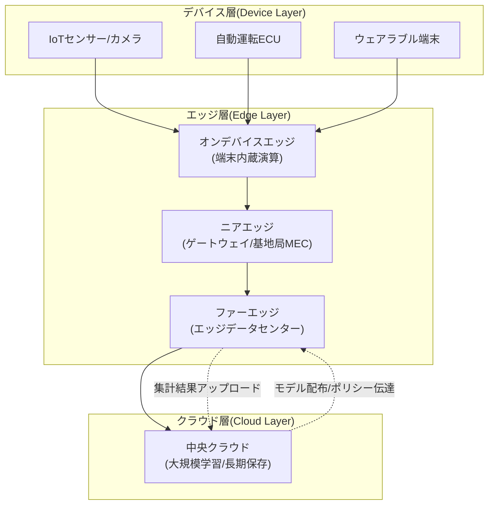
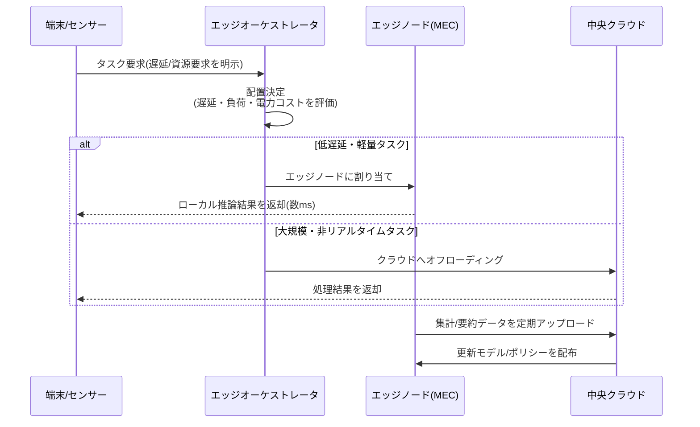

# エッジコンピューティング(Edge Computing)

## 1. 概要

> **定義**: エッジコンピューティング(Edge Computing)とは、データが生成される現場(端末・センサー・ゲートウェイ)またはその近傍の小規模な分散コンピューティング資源で演算・保存・分析を行い、中央クラウドへの伝送を最小化して、遅延(Latency)・帯域幅・プライバシーの問題を解消する分散コンピューティングパラダイムである。

エッジコンピューティングが登場した背景には、「データの爆発的増加」と「中央集中型クラウドの物理的限界」という2つの構造的変化がある。IoTセンサー、自動運転車、スマートファクトリーの産業用カメラなどは毎秒数ギガバイト(GB)規模のデータを生み出すが、これをすべて遠方の中央クラウドに伝送して処理すると、往復遅延(RTT)が数十~数百ミリ秒に達し、バックボーン帯域幅のコストが急増する。自動運転の緊急制動やスマートファクトリーのロボット制御のように数ミリ秒(ms)以内の反応が必要なリアルタイムサービスでは、この遅延がそのまま安全事故に直結する。すなわち、光速という物理法則上、「データを遠くに送って戻ってくる」往復時間を短縮する唯一の方法は、演算をデータ発生地点の近くに移すことである。

もう1つの背景は、プライバシー・主権規制の強化である。病院の画像、工場の工程データ、個人の生体情報などの機微なデータを原本のままクラウドにアップロードすること自体が個人情報保護法・GDPR違反の恐れがあり、データ主権(Data Sovereignty)の観点からも国境を越えさせることは難しい。エッジで一次加工・非識別化・要約を行った後、必要な結果だけを中央に上げれば、この問題を相当程度緩和できる。こうした文脈において、エッジコンピューティングはクラウドを代替するものではなく、中央クラウド-エッジ-端末へと続く**連続体(Cloud-to-Edge Continuum)**を形成し、相互に補完する。

エッジコンピューティングの主要特徴は、(1) **近接性(Proximity)** — データ発生地に隣接した処理、(2) **低遅延(Low Latency)** — リアルタイム応答、(3) **分散性(Distribution)** — 多数のエッジノードへの負荷分散、(4) **自律性(Autonomy)** — ネットワーク断絶時にもローカル判断を継続、に要約される。これは超低遅延・超接続・超高信頼を要求する5G/6G、自動運転、産業IoT、臨場感メディアサービスの共通インフラとして定着しつつある。

用語上、類似概念との区別も必要である。通信網の観点からユーザー近傍にコンピューティングを置くことを強調すれば**MEC(Multi-access Edge Computing)**、コンテンツキャッシングに焦点を当てれば**CDN**、クラウド事業者が自社リージョンをユーザー近傍へ拡張する形態は**エッジゾーン/ローカルゾーン**と呼ばれるが、これらはすべて「中央集中から分散へ」というエッジコンピューティングの大きな流れの中に位置付けられる。かつて流行した**フォグコンピューティング(Fog Computing)**は、エッジとクラウドの間の中間層を強調した概念であり、今日ではエッジコンピューティングのファーエッジ層に事実上吸収されて理解されている。

## 2. エッジコンピューティングの階層構造とアーキテクチャ

エッジコンピューティングは単一の機器ではなく、端末からクラウドまで続く多層構造として理解すべきである。以下の概念図は、データが発生するデバイス層から中央クラウドまでの全体構造を示す。

**A. デバイス層(Device Layer)**はデータの源泉である。センサー、カメラ、アクチュエータ、車両ECUなどが物理世界の状態をデジタル信号に変換する。この層は演算資源が極度に制約されているため(数ミリワットの電力、数KBのメモリ)、生データをそのまま上位へ流すか、ごく単純なフィルタリングのみを行う。近年はこの層自体に超軽量の推論エンジンを載せるオンデバイスAIが結合され、境界が曖昧になりつつある。こうした極低電力での常時動作のために、マイクロコントローラ級のハードウェアでニューラルネットワークを動かすTinyML、イベント発生時のみ起動するインターミッテントコンピューティング、そしてニューロモルフィックチップのような低電力演算素子が、この層の拡張技術として注目されている。ただし資源制約が大きい分、モデル更新・セキュリティパッチを遠隔で安全に配布するOTA(Over-the-Air)管理と軽量な認証体系を必ず併用しなければならない。

**B. エッジ層(Edge Layer)**はエッジコンピューティングの心臓部であり、さらに3段階に細分される。**オンデバイスエッジ**は端末内部で直接演算する形態(例: スマートフォンNPUによる顔認識)であり、**ニアエッジ(Near Edge)**は工場のゲートウェイや通信事業者の基地局のMEC(Multi-access Edge Computing)サーバのように端末から1ホップ(hop)離れた地点であり、**ファーエッジ(Far Edge)**は地域拠点に配置された小規模なエッジデータセンター(数十kW級)で、多数のニアエッジを束ねる中間集計・調整の役割を担う。応答遅延はオンデバイス(<1ms) → ニアエッジ(1~10ms) → ファーエッジ(10~30ms) → クラウド(50ms以上)の順に大きくなるため、サービスの遅延要求に応じて適切な層にワークロードを配置(Placement)することが設計の核心である。

特にこの層区分を貫く概念が**データグラビティ(Data Gravity)**である。データは規模が大きくなるほど、その場所にサービスと演算を引き寄せる性質があり、大容量データを移動させるよりも演算をデータ側へ移動させるほうがはるかに経済的である。エッジコンピューティングはまさにこの原理を構造化したものであり、「データが重い場所(現場)に軽い演算を付け、軽い要約だけを重力の弱い上位へ上げる」という設計思想を階層配置に反映している。

**C. クラウド層(Cloud Layer)**は、大規模モデル学習、長期データ保管、全体ポリシーの策定など、遅延には鈍感であるが大規模な資源が必要な作業を担当する。エッジで推論(Inference)し、クラウドで学習(Training)した後、更新されたモデルを再びエッジへ配布する「学習・推論分離」構造が代表的であり、これは後述する連合学習(Federated Learning)と結合して、プライバシーを保護したままモデルを進化させる。

主要な通信標準としては、欧州電気通信標準化機構(ETSI)が定義した**MEC(Multi-access Edge Computing)**アーキテクチャがあり、5GコアネットワークのUPF(User Plane Function)をユーザー近傍に分散配置する**ローカルブレイクアウト(Local Breakout)**により、トラフィックが中央網を経由せずにエッジで直接処理されるようにする。

## 3. 動作プロセスとワークロードオーケストレーション

エッジ環境は数百~数千の異種ノードが地理的に分散しているため、どの演算をどのノードで実行するかを動的に決定するオーケストレーションが成否を分ける。以下の図は、リクエストが入ったときのオフローディング(Offloading)判断と処理フローを示す。

**A. タスクオフローディング(Task Offloading)の決定**は、「この演算をローカルで行うか、上位に渡すか」を判断する過程である。判断基準は、タスクの遅延許容値(Latency budget)、必要な演算量・メモリ、現在のノードの負荷とバッテリー残量、伝送すべきデータサイズなどである。例えばバッテリー駆動の端末では、演算にかかるエネルギーと伝送にかかるエネルギーを比較して少ないほうを選ぶエネルギー・遅延トレードオフの最適化が核心であり、これを整数計画法や強化学習でリアルタイムに決定する。

**B. コンテナベースの展開と軽量オーケストレーション**が実行を支える。中央クラウドがKubernetesでコンテナを管理するように、エッジでは資源が制約されたノードのためにK3s、KubeEdge、OpenYurtのような軽量Kubernetesディストリビューションが使われる。これらは、マスタ・ワーカ間のネットワークが不安定または断絶していても、エッジノードが最後に受け取った仕様どおりに自律動作(Autonomy)を維持し、接続が回復すると状態を再同期する「ネットワーク断絶耐性(Disconnected Operation)」を提供する。実際の通信事業者のMECプラットフォームは、こうした軽量オーケストレータ上にCDNキャッシュ、AI推論サーバ、ローカルUPFをコンテナとして展開する。

**C. データライフサイクル管理と階層的集計**も重要である。エッジで発生するデータをすべて保存するとストレージがたちまち飽和するため、エッジノードは異常値・イベントのみを選別保存し、正常データは統計要約(平均・分散・ヒストグラム)のみを上位へ上げる階層的集計(Hierarchical Aggregation)を行う。例えばスマートファクトリーでは、振動センサーの1kHzの原信号をエッジでリアルタイムにFFT分析した後、「異常周波数の検出有無」という結果だけをクラウドへ送信することで、帯域幅を数百分の一に削減する。

**D. レジリエンス(Resilience)と無停止運用**は、エッジ設計の最後の関門である。エッジノードは現場の停電、通信途絶、ハードウェア故障など、データセンターよりはるかに劣悪な環境で動作するため、上位との接続が切れても最後に受信したポリシー・モデルで中核的な判断を継続し(Degraded Mode)、ローカルキューにデータをバッファリングしておき接続回復時に再送信する(Store-and-Forward)設計が必須である。また、特定のノードがダウンすると隣接ノードがワークロードを引き継ぐフェイルオーバー(Failover)と、同一サービスを複数ノードに分散配置する冗長化が、サービス継続性を保証する。このようにエッジの自律性はそのまま障害耐性(Fault Tolerance)に直結し、カオスエンジニアリングで断絶状況を事前に検証することが推奨される。

## 4. クラウドコンピューティングとの比較

エッジとクラウドは対立関係ではなく役割分担の関係であるが、試験答案では、差がなぜ生じるのかを物理的・経済的な理由とともに説明しなければならない。以下の表は主要な観点での比較である。

| 区分 | 中央クラウドコンピューティング | エッジコンピューティング |
|------|--------------------|-----------|
| 処理位置 | 遠方の大規模データセンター | データ発生地近傍の分散ノード |
| 遅延(Latency) | 数十~数百ms | 1~30 ms (層別) |
| 資源規模 | 事実上無限に拡張 | 小規模・制約的(電力・スペース) |
| 帯域幅コスト | 原本伝送のため高い | ローカル処理により大幅削減 |
| データプライバシー | 原本移動に伴う露出リスク | 現場処理により露出を最小化 |
| ネットワーク依存性 | 接続断絶時にサービス停止 | 断絶時にもローカルで自律動作 |
| 管理の複雑さ | 中央集中のため比較的単純 | 多数の異種ノードのため高い |

エッジとクラウドの関係は代替ではなく、**役割特化によるワークロードの分業**として理解すべきである。リアルタイム判断・一次加工はエッジが、大規模学習・全体統合・長期保管はクラウドが担い、両者をつなぐ制御・データパイプラインを1つの連続体として設計することが鍵となる。この観点を見失い「エッジ対クラウド」の二者択一でアプローチすると、エッジの管理負担だけを抱え込むか、クラウドの遅延限界に閉じ込められるという失敗につながる。

両方式の遅延の差は、根本的には物理的な距離に起因する。ソウルの端末が米国西部リージョンのクラウドと通信すると、光ケーブルの往復だけで130ms以上を要するが、これはソフトウェアの最適化では決して短縮できない光速の限界である。一方、帯域幅コストの差は経済的な理由による。4Kカメラ100台の映像を原本のままクラウドに上げると月数千万ウォンの伝送費が発生するが、エッジで物体検出を行い「侵入発生」イベントのみを上げれば、コストは数百分の一に減少する。

ただし、エッジは万能ではない。大規模言語モデルの学習や全社データウェアハウスのように、膨大な資源と全体的なデータ統合が必要な作業では、依然としてクラウドが圧倒的に有利である。また、数千のエッジノードを一貫して管理・セキュリティパッチ適用・監視する運用の複雑さ(Operational Overhead)はエッジ最大の弱点であり、これを下げるためにGitOpsベースの宣言的デプロイとオブザーバビリティ(Observability)体系が必須的に組み合わされる。

また、状態(State)管理の難易度も異なる。中央クラウドは単一のデータストアを基準に強い一貫性(Strong Consistency)を比較的容易に確保できるが、地理的に分散したエッジノード間では、CAP定理上ネットワーク分断を前提として可用性と一貫性を天秤にかけなければならない。そのため、エッジでは結果整合性(Eventual Consistency)と競合のない複製データ型(CRDT)、ローカルファースト(Local-first)設計が頻繁に採用される。結局、エッジとクラウドの選択は「どちらが速いか」だけでなく、「一貫性・耐久性・コスト・プライバシーをどう配分するか」という総合的なアーキテクチャ上の意思決定である。

## 5. 産業適用事例

**A. スマートファクトリーの予知保全。** 国内外の製造業者は、設備の振動・温度・電流センサーのデータをエッジでリアルタイムに分析し、故障を事前に予測している。クラウドとの往復なしにエッジノードが数ms以内に異常を検知するため、設備停止前に即時アラーム・自動減速が可能である。この方式により計画外停止(Unplanned Downtime)を20~50%削減した事例が報告されている。

この事例で注目すべき点は、エッジが単なるコスト削減を超えて、安全・品質指標を直接改善するということである。不良検出カメラを例にとると、クラウド往復の場合はコンベアがすでに次工程に移った後で不良判定が届くが、エッジ推論は当該製品が現場にあるうちに即座に排出(Reject)できるため、後工程への不良流出を根本から遮断する。

**B. 自動運転とV2X。** 自動運転車は、カメラ・LiDARのデータを車両内のオンデバイスエッジ(高性能SoC)で処理しつつ、交差点の信号・周辺車両の情報は道路脇の基地局MECとV2X(Vehicle-to-Everything)で交換する。緊急制動の判断に要求されるエンドツーエンド(End-to-End)遅延は通常数msレベルでなければならないため、中央クラウドでの処理は原理的に不可能であり、エッジが必須である。

**C. 臨場感メディア・クラウドゲーミング。** 通信事業者は基地局近傍のMECにレンダリングサーバを配置し、VR/ARおよびクラウドゲーミングのモーション・トゥ・フォトン(Motion-to-Photon)遅延を20ms以下に抑える。遅延が大きいと映像酔い(Cybersickness)が発生するため、エッジレンダリングがユーザー体験の中核要素となる。

**D. スマートシティ・映像監視。** 都心の数千台のCCTV映像をすべて中央監視センターに送ると、帯域幅と保存コストが負担しきれない。各交差点・建物のエッジノードで物体検出・ナンバープレート認識・異常行動検知を行い、「車両渋滞」「倒れた歩行者」のようなイベントメタデータだけを中央に送信すれば、原本映像に比べて帯域幅を数百分の一に削減しつつ、リアルタイム対応が可能となる。個人の映像原本が現場の外に出ないため、プライバシーの面でも有利である。

## 6. 深掘り — エッジAI、連合学習、6G連携と最新動向

エッジコンピューティングの近年の技術発展は、AIとの融合において顕著である。**エッジAI(Edge AI)**は軽量化したニューラルネットワークをエッジで直接推論するものであり、モデル軽量化手法である量子化(Quantization)、枝刈り(Pruning)、知識蒸留(Knowledge Distillation)によって、クラウドで学習した大型モデルをエッジハードウェア(NPU、TPU Edge、Jetsonなど)で実行可能なサイズに縮小する。これは別途整理したオンデバイスAIのトピックと密接に関連する。

エッジAIの普及に伴い、ハードウェアアクセラレータの競争も激しい。低電力・小型フォームファクタで高い推論性能を出すためにNPU・エッジTPU・FPGAが活用され、演算量あたりの電力(TOPS/W)効率がエッジハードウェア選択の主要指標となる。また、1つのエッジノードが複数サービスのモデルを同時にサービングしなければならないため、モデルのバージョン管理・A/Bデプロイ・自動ロールバックを支援するエッジ特化型MLOps(時にEdge MLOpsとして区別される)パイプラインの重要性が高まっている。

プライバシーを保護しながらエッジモデルを継続的に改善する中核手法が、**連合学習(Federated Learning)**である。各エッジノードがローカルデータでモデルを学習した後、原本データではなくモデルの重み(または勾配)のみを中央に送信すると、中央はこれを集約(FedAvgなど)してグローバルモデルを更新し、再び配布する。これにより、機微なデータが現場を離れることなく全体の性能が向上する。ただし、重みの送信だけでも原本が一部復元され得るため、差分プライバシー(Differential Privacy)・準同型暗号が併せて適用される傾向にある。

ネットワークの面では、**5G Advancedと6G**がエッジコンピューティングを一層強化する。6Gは超低遅延(0.1ms級)・超精密測位・通信とコンピューティングの統合(ICC, Integrated Communication and Computation)を志向し、衛星・空中・地上統合網(SATIN)と結合して、エッジノードを地上だけでなく低軌道衛星にまで拡張しようとしている。標準化の観点では、ETSI MEC、3GPPの5Gエッジコンピューティング規格、そしてLinux FoundationのLF Edge(EdgeX Foundry, Akraino)などが相互運用性を主導している。近年はサーバーレスの概念をエッジへ拡張した**エッジサーバーレス(Edge Functions)**がCDN事業者を中心に普及しており、開発者がインフラを意識せずに世界中のエッジへ関数をデプロイする形態へと進化している。

セキュリティの観点では、エッジは物理的な統制が弱い現場にノードが露出するため、従来のデータセンターのセキュリティモデルがそのまま適用できない。ノードが物理的に奪取・複製され得るという前提のもと、ハードウェアの信頼の基点(TPM/TEE)に保存された鍵でブートの完全性を検証するリモートアテステーション(Remote Attestation)と、すべてのノード・ワークロード間の通信を相互認証するゼロトラストが組み合わされる。また、信頼実行環境(TEE)ベースのコンフィデンシャルコンピューティング(Confidential Computing)をエッジに適用すれば、ノード運用者でさえ処理中のデータを閲覧できないため、マルチテナントのエッジ環境におけるデータ保護を強化できる。

## 7. 考慮事項および示唆

第一(適用戦略)に、エッジ導入は全面移行ではなく、**ワークロード特性に基づく選別的配置**としてアプローチすべきである。遅延感度、データサイズ、プライバシー等級を軸にワークロードを分類し、リアルタイム・機微なワークロードだけをエッジに下ろし、学習・分析はクラウドに残すハイブリッド配置が最適である。最初からすべてをエッジ化すると、管理の複雑さとコストが急増するだけである。

第二(トレードオフ)に、エッジは**遅延・帯域幅の利得と、運用の複雑さ・セキュリティ露出との間のバランス**である。ノード数が増えるほど物理的にアクセス可能な攻撃対象領域(Attack Surface)が大きくなるため、ハードウェアの信頼の基点(TPM)、セキュアブート(Secure Boot)、ゼロトラストのアクセス制御、ノード認証・リモートアテステーション(Remote Attestation)を設計初期から組み込まなければならない。分散した数千ノードの脆弱性を一括でパッチ適用する自動化パイプラインの欠如は、すなわち大規模な侵害へとつながる。

第三(展望)に、エッジ・クラウド連続体は**統合コントロールプレーン(Unified Control Plane)**へと収斂していくであろう。GitOps・プラットフォームエンジニアリング・オブザーバビリティを組み合わせ、中央で宣言的にポリシーを定義すればエッジまで自動的に伝播・検証される体系が標準となり、AIOpsが異種エッジの異常を自律的に検知・復旧する方向へ発展する。

第四(関連技術)に、エッジコンピューティングは単独の技術ではなく、5G/6G、オンデバイスAI、連合学習、IoT、MEC、サーバーレス、CDN、ゼロトラストが交差する融合点である。技術士の観点では、特定の要素技術の深さよりも、これらをサービス要求(遅延・コスト・プライバシー・信頼性)に合わせて組み合わせる**アーキテクチャ上の洞察とトレードオフの判断力**が評価の核心となる。

第五(導入ロードマップ)に、組織レベルのエッジ転換は段階的な成熟度モデルでアプローチすることが望ましい。初期には特定のライン・拠点にパイロットエッジを構築して遅延・コスト効果を定量的に検証(PoC)し、その後、標準エッジプラットフォーム(軽量K8s・GitOps・オブザーバビリティ)を定義して多数の拠点へ水平展開し、最終的にクラウド・エッジ統合運用組織(プラットフォームエンジニアリングチーム)とSLOベースの信頼性管理体系を整える順序である。技術導入ばかりを先行させて運用標準・ガバナンスを後回しにすると、管理されていないエッジノードがそのままシャドーITかつセキュリティ上の脆弱性へと転落する点に留意すべきである。

## 参考資料

- ETSI, "Multi-access Edge Computing (MEC)", https://www.etsi.org/technologies/multi-access-edge-computing
- LF Edge, "EdgeX Foundry / Akraino", https://www.lfedge.org/
- Gartner, "Edge Computing" (用語および市場展望), https://www.gartner.com/en/information-technology/glossary/edge-computing

---

> **一言まとめ**: エッジコンピューティングは、データ発生地の近傍で演算を行い遅延・帯域幅・プライバシーの問題を解消する分散パラダイムであり、デバイス-エッジ(オン/ニア/ファー)-クラウドの連続体とMEC・軽量オーケストレーション・エッジAIを通じて自動運転・スマートファクトリー・臨場感メディアのリアルタイムサービスを実現する。クラウドとの選別的なワークロード配置と、セキュリティ・運用の複雑さの管理が成功の鍵である。
