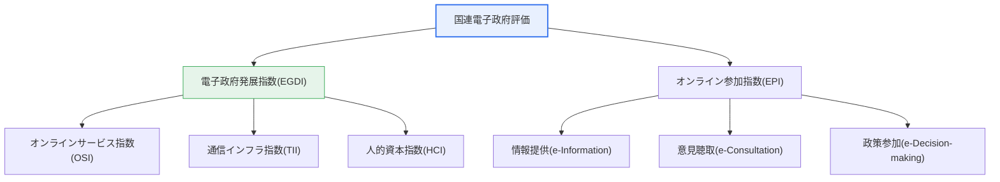
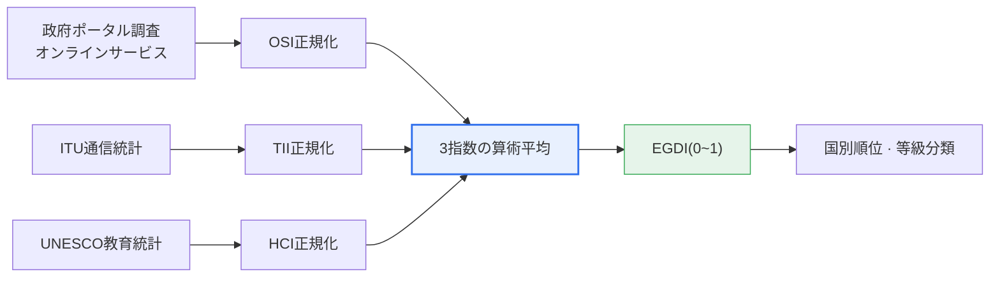

# 国連電子政府評価

## 1. 概要

### A. 定義
> **国連電子政府評価(UN E-Government Survey)**は、国際連合経済社会局(UN DESA)が**2年ごとに全加盟国を対象として電子政府の発展水準とオンライン市民参加を測定・比較**し、国別順位を発表する国際評価である。各国の電子政府の現状を診断し、改善の方向性を示す世界的な基準線(benchmark)の役割を果たす。

国連電子政府評価が重要である理由は、「**電子政府の水準を国際的に標準化された物差しで比較する**」点にある。国ごとに政治・経済・行政環境が異なり、電子政府を発展させてきた経路もまちまちであるため、共通の測定基準がなければ、どの国がどれだけ進んでいるのか、自国が何を補完すべきなのかを客観的に判断することは難しい。国連の評価は、オンラインサービス・通信インフラ・人的資本という共通の3つの軸で、すべての加盟国を同一の方法論で測定して相対的な位置を明らかにし、これを通じて各国が強み・弱みを把握し、国家情報化戦略の方向性を定めるよう支援する。

韓国はこの評価で長期間にわたり最上位圏を維持してきた電子政府先進国であり、評価結果は国家のデジタル競争力を対外的に示す指標であると同時に、政府の情報化政策の成果を点検する鏡として活用される。評価は大きく、政府が提供するサービスとその基盤の発展度を見る**発展指数(EGDI)**と、政府・市民間の相互作用・参加水準を見る**オンライン参加指数(EPI)**の2つの軸で構成される。すなわち、「政府がどれだけ整備しているか」と「市民がどれだけ参加しているか」を併せて見ることが、この評価の根本的な設計思想である。

### B. 登場背景と必要性
国連が電子政府評価を開始した背景には、2000年代初頭に世界的に広がった電子政府構築の流れがある。各国は競うように政府サービスをオンライン化したが、その成果を比較・共有する共通の枠組みがなかった。国連は、開発途上国を含むすべての加盟国が自国の水準を診断し先進事例をベンチマークできるよう、また情報格差(digital divide)の解消と持続可能な開発目標(SDGs)の達成に向けたデジタル政府の役割を促進するために、定期評価を制度化した。

必要性は3つに整理される。第一に、**診断とベンチマーキング**である。標準化された指数で自国の位置と脆弱な領域を把握し、先進国の事例を学習する。第二に、**政策の推進力(driver)**である。国際順位は、各国政府が電子政府への投資を継続する強力な政治的動機となる。第三に、**包摂性の促進**である。人的資本・インフラ指数を通じて、単なるサービス構築を超え、国民の誰もが活用できる電子政府を志向するよう誘導する。

## 2. 評価指数体系と全体構造

国連電子政府評価は発展指数(EGDI)とオンライン参加指数(EPI)の2つの指数で構成され、EGDIはさらに3つの下位指数の加重平均として算出される。以下の構造図は、評価指数全体の階層関係を示す。

**発展指数(EGDI)**は電子政府の総合的な発展水準を表し、後述する3つの下位指数の算術平均として計算される。**オンライン参加指数(EPI)**は、政府が市民に情報を提供し(情報提供)、政策形成過程で意見を聞き(意見聴取)、さらに市民を実際の意思決定に参加させる(政策参加)水準を段階的に評価する。この2つの指数を併せて見る理由は、いくら発展指数が高くても、市民参加が伴わなければ「一方的なサービス提供」にとどまり、民主的ガバナンスとしての電子政府が完成しないからである。

| 指数 | 測定対象 | 性格 |
|---|---|---|
| **電子政府発展指数(EGDI)** | サービス・インフラ・人的能力の総合水準 | 供給・基盤中心(0~1) |
| **オンライン参加指数(EPI)** | 情報提供・意見聴取・政策参加 | 相互作用・参加中心 |

## 3. 電子政府発展指数(EGDI)の構成と算出

EGDI(E-Government Development Index)は、3つの下位指数をそれぞれ正規化した後に平均して0から1の間の値として算出され、値が大きいほど電子政府が発展していると見なされる。以下の図は、原データが正規化・平均を経て最終指数と順位に至る算出プロセスを示す。

### A. オンラインサービス指数(OSI)
**OSI(Online Service Index)**は、政府がオンラインで提供するサービスの範囲と品質を評価する。単なる情報掲載にとどまるのか、行政手続きの申請・処理・決済まで完結するのか、さらに複数機関のサービスを1つの窓口で途切れなく提供しているか(ワンストップ・統合サービス)を見る。近年の評価では、データ公開、モバイルサービス、社会的弱者向けの包摂的なサービス提供の有無まで調査項目が拡大され、サービスの「量」よりも「質と包摂性」を重視する方向へと進化している。OSIは国連の調査チームが各国の政府ポータルを直接調査・採点する方式である点で他の指数と性格が異なり、政府の直接的な努力が最も大きく反映される指数である。

### B. 通信インフラ指数(TII)
**TII(Telecommunication Infrastructure Index)**は、電子政府サービスを国民が実際に利用できる物理的基盤を評価する。インターネット利用者の割合、移動体通信の加入、超高速の有線・無線ブロードバンドの普及水準などを指標とし、主に国際電気通信連合(ITU)の統計を活用する。いかに優れたオンラインサービスを構築しても、それを利用する通信網がなければ無用の長物であるため、TIIは電子政府のアクセス性を決定する下部構造に該当する。ブロードバンドとモバイルの普及率が高い国ほど、この指数で有利である。

### C. 人的資本指数(HCI)
**HCI(Human Capital Index)**は、国民が電子政府サービスを理解し活用できる能力を評価する。成人識字率、就学率、期待教育年数などの教育関連指標を活用し、主にUNESCOの統計に基づく。この指数が指数体系に含まれている理由は、電子政府の究極的な目的が「国民の利用」にあるからである。デジタルリテラシーが低ければ、サービスとインフラが整っていても実際の活用にはつながらない。したがってHCIは、サービス・インフラという供給側面を、国民の活用能力という需要側面と結び付ける指数である。

3つの指数を平均するという設計は、サービス・インフラ・人のいずれか1つでも遅れれば全体のEGDIが低くなるようにすることで、**均衡ある発展を強制**する効果を生む。例えば、オンラインサービス(OSI)が満点に近くても、通信インフラ(TII)や人的資本(HCI)が低い開発途上国はEGDIの上位圏に入ることが難しい。これは、電子政府が政府の努力だけで完成するものではなく、社会全体のデジタル基盤の上でのみ実効性を持つという点を、指数構造そのものが反映したものである。

もう1つ留意すべき点は、各下位指数の**データ出典が互いに異なる**ことである。OSIは国連調査チームによる直接のポータル調査、TIIはITUの通信統計、HCIはUNESCOの教育統計で算出される。したがって特定の国が順位を上げるには、政府ポータルの改善(OSI)だけでは不十分であり、通信政策・教育政策など政府全体の協力が併せて行われなければならない。この点が、国連の評価を単なるIT所管省庁の課題ではなく、国家レベルの総合政策課題にしている理由である。

## 4. 参加指数(EPI)と事例・比較

**オンライン参加指数(EPI)**は、政府と市民の相互作用を3段階で捉える。第1段階の**情報提供(e-Information)**は、政策・予算・法令などの政府情報を市民が容易にアクセスできるよう公開する水準である。第2段階の**意見聴取(e-Consultation)**は、政策形成過程でオンラインにより市民の意見を集める活動である。第3段階の**政策参加(e-Decision-making)**は、集めた意見を実際の政策決定に反映する、最も成熟した参加段階である。この3段階は、低い段階から高い段階へ進むほど、市民がガバナンスの主体となる方向を示している。

参加の3段階は以下のように整理できる。

| 参加段階 | 政府の活動 | 市民の役割 |
|---|---|---|
| **情報提供(e-Information)** | 政策・予算・法令などの情報公開 | 情報の閲覧・活用 |
| **意見聴取(e-Consultation)** | オンラインでの意見聴取・公聴会 | 意見提出・討論 |
| **政策参加(e-Decision-making)** | 聴取した意見の政策反映・フィードバック | 政策決定への実質的参加 |

EGDIとEPIを併せて見ると、国別の電子政府の性格の違いが浮かび上がる。例えば、インフラ・サービスは優れているが参加が低い国は「効率的だが一方的な電子政府」、逆に参加が活発な国は「民主的・開放的な電子政府」として特徴付けられる。この差が生じる根本的な理由は、電子政府を「行政効率化の手段」と見るか「民主的ガバナンスの革新」と見るかという政策志向の違いにある。韓国の場合、政府24・ホームタックスのような統合サービスによってOSIで強みを示してきており、政府ポータルにオンライン参加・国民請願的な窓口を運営して参加の側面も併せて発展させてきた。ただし、国別順位と詳細スコアは評価回ごとの方法論改定と他国の躍進によって変動するため、特定回の順位を断定的に述べるよりも、「最上位圏を継続的に維持してきた先進国」という傾向として理解するのが正確である。

## 5. 深掘り: 方法論の進化とデジタルプラットフォーム政府との連携

国連電子政府評価の方法論は固定されたものではなく、時代の流れに合わせて継続的に拡張されてきた。初期には政府ウェブサイトの存在とサービス提供の有無に焦点を当てていたが、次第にデータ公開(open government data)、モバイル・チャットボットなどのインテリジェントサービス、社会的弱者の包摂(leaving no one behind)、そして地域単位の電子政府を別途評価する**地方政府オンラインサービス指数(LOSI)**などへと調査範囲を広げてきた。これは、電子政府の関心が「どれだけ多くのサービスをオンライン化したか」から「誰も取り残されずに参加するインテリジェント・包摂型のデジタル政府であるか」へと移っていることを反映している。

特に地方政府オンラインサービス指数(LOSI)の導入は示唆するところが大きい。国の代表ポータルの完成度が高くても、実際に国民が日常で接するのは相当部分が地方自治体のサービスであるため、中央と地方のサービス格差を併せて評価することで、電子政府の「体感品質」をより精密に診断しようとする意図である。これは、評価の焦点が1つの代表指標から、国民が実際に向き合うサービスの総和へと広がっていることを示している。

韓国の**デジタルプラットフォーム政府**戦略は、こうした国連評価の発展方向と密接に重なっている。データを公開・連携して省庁間の縦割りをなくし、人工知能ベースのパーソナライズされたサービスを提供し、市民を政策決定に参加させるという志向は、まさにOSI・EPIが求める高度化の方向と一致する。したがって、国連評価への対応は単なる順位管理ではなく、国家電子政府の高度化戦略そのものと結び付いている。ただし、評価指標への過度な最適化が実際の国民の体感サービス品質と乖離し得る点には警戒すべきであり、指標への対応と実質的なサービス革新を併せて追求するバランスが必要である。

加えて、国連評価は国家間比較という特性上、方法論が回ごとに精緻化され、新たな項目(データ公開・AIサービス・地方政府評価など)が追加されるため、特定時点の順位や絶対スコアよりも、**どの領域で強み・弱みが現れているか**という構造的な診断として活用することが望ましい。例えば、インフラ・サービスのスコアは高いのに参加スコアが相対的に低く出た場合、これはサービスの完成度に比べて市民参加のチャネルが形式的であるというシグナルとして読み取り、開放型の政策決定プラットフォームを強化するといった形で政策にフィードバックできる。このように評価を診断ツールとして捉える姿勢のほうが、順位そのものを追うよりも電子政府の高度化に実質的に寄与する。

## 6. 考慮事項および示唆(技術士の観点)

1. **3つの軸の均衡ある発展が核心である。** EGDIはOSI・TII・HCIの平均として算出されるため、優れたオンラインサービスを構築しても、通信インフラや国民の活用能力が遅れれば全体スコアが低くなる。サービス・インフラ・人的能力を同時に引き上げる統合戦略が求められる。

2. **供給から参加へと重心が移動している。** 単なるサービス提供を超えて市民が政策決定に参加する「開かれた政府(open government)」が強調され、EPIの重要性が高まっている。今後の電子政府は、e-Decision-making段階の実質的な参加をどれだけ実現できるかが成熟度を分ける。

3. **デジタルプラットフォーム政府・データ公開と連携する。** 国連評価の発展方向(データ公開・パーソナライズされたサービス・市民参加)が国内のデジタルプラットフォーム政府戦略と一致するため、評価への対応を国家電子政府の高度化戦略と統合的に推進してこそ相乗効果が生まれる。

4. **包摂性と情報格差の解消を並行する。** 人的資本指数と「leaving no one behind」の基調が示すように、高齢者・障害者・低所得者などデジタル弱者のアクセス性を確保できなければ、電子政府の真の成果として認められにくい。アクセシビリティ・デジタル包摂政策を併せて設計すべきである。

5. **指標最適化と実質的革新のバランスを維持する。** 順位上昇だけを目標に指標へ過剰最適化すると国民の体感品質と乖離し得るため、評価指標は方向を示す灯台として活用しつつ、実際のサービス革新とユーザー体験の改善を究極の目標とすべきである。

6. **中央・地方の格差解消が次の課題である。** LOSIの導入が示唆するように、国民が日常で接するサービスの相当数は地方政府が提供するため、中央ポータルの完成度だけでは真の電子政府の成熟を担保できない。地方政府サービスの標準化・底上げを併せて推進してこそ、国全体の体感品質が向上する。

総合すると、国連電子政府評価は、サービス・インフラ・人的資本の均衡(EGDI)と、情報提供から政策参加へと続く市民参加の成熟(EPI)を2つの軸として、電子政府を「効率的な行政」と「民主的ガバナンス」の結合体として俯瞰する。技術士の観点では、この指数構造を国家情報化・デジタルプラットフォーム政府戦略と整合させ、順位管理ではなく、国民の体感サービスと包摂性の向上という実質的な目標へとフィードバックさせる設計能力が鍵となる。

## 参考資料
- UN DESA, UN E-Government Survey (方法論・EGDI/EPIの概要): https://publicadministration.un.org/egovkb/en-us/
- ITU, ICT統計(通信インフラ指数の原データ): https://www.itu.int/en/ITU-D/Statistics/
- 大韓民国デジタルプラットフォーム政府委員会: https://www.dpg.go.kr/

---

> **一言まとめ**: 国連電子政府評価は*発展指数(EGDI)とオンライン参加指数(EPI)*で各国を測定し、EGDIは*オンラインサービス(OSI)・通信インフラ(TII)・人的資本(HCI)*の3軸の平均として算出され、**サービス・インフラ・能力の均衡と、供給から参加への移行**を求める。
