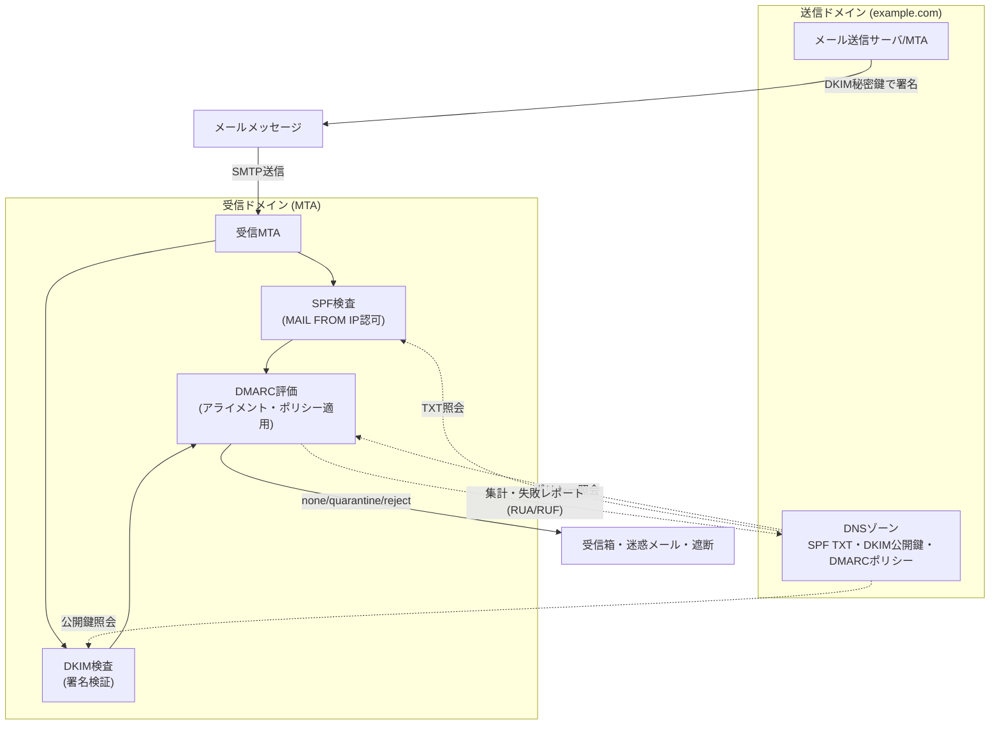
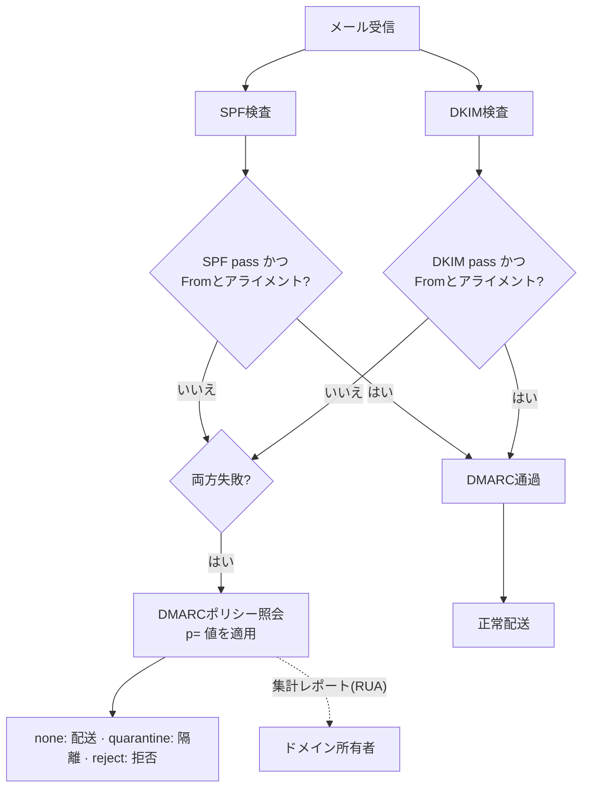

# メール認証体系(SPF・DKIM・DMARC)

## 1. 概要

> **メール認証体系**とは、送信ドメインの正当性を検証して偽装された送信者(spoofing)のメールを排除するための標準技術の集合であり、送信IPを認可する**SPF(Sender Policy Framework, RFC 7208)**、メッセージに電子署名を付与する**DKIM(DomainKeys Identified Mail, RFC 6376)**、この二つの検証結果を送信ドメイン(From)とアライメント(alignment)させてポリシーとレポートにまとめる**DMARC(Domain-based Message Authentication, Reporting and Conformance, RFC 7489)**から構成される。

メール認証体系が必要となった根本的な背景は、**SMTP(Simple Mail Transfer Protocol)自体が送信者を検証しない**という生来の限界にある。1982年にRFC 821で定義されたSMTPは、信頼できる小規模ネットワークを前提に設計されており、送信者が`MAIL FROM`やヘッダの`From`に任意のアドレスを入れてもそれを確認しない。その結果、誰でも`From: ceo@mybank.com`のように他人のドメインを詐称したメールを容易に送ることができ、これがフィッシング(phishing)・スピアフィッシング・**ビジネスメール詐欺(BEC, Business Email Compromise)**の技術的土台となった。

BECによる被害はすでに産業全般で深刻な水準にある。米国FBI IC3の年次報告書はBECの損失を毎年数十億ドル規模と集計しており、韓国国内でも貿易代金を横取りする詐称メール事故が繰り返し発生している。こうした脅威は、スパムフィルタの統計的判定だけでは防ぎにくい。詐称メールは文法・書式が正常なメールと同一であり、悪性の添付なしに口座変更だけを要求することもあるからである。したがって、「**このメールは本当にそのドメインから送信されたのか**」を、ドメイン所有者が公表したポリシーと暗号学的証拠によって検証する送信ドメイン認証が必須となった。SPF・DKIM・DMARCはそれぞれIP認可、完全性・署名、ポリシー・アライメント・レポートという相互補完的な役割を担い、一つの信頼体系を構成する。

## 2. 全体の認証フローと構造

メール認証は、送信側がDNSにポリシー・公開鍵を公表し、受信側メールサーバがメール受信時点でそれを照会・検証する**分散信頼モデル**として動作する。以下の概念図は、送信から受信・検証・レポートまでの全体構造を示す。

このフローにおいて、送信側と受信側の役割は明確に分離されている。送信側は自らが管理する送信サーバのIP・署名鍵・処理ポリシーをDNSで「宣言」する責任を、受信側はその宣言を標準に従って「検証・執行」する責任を負う。どちらか一方だけが準備されていても効果はない。送信ドメインがどれほど厳格なポリシーを掲示しても、受信サーバがそれを解釈・執行しなければ詐称メールはそのまま配送され、逆に受信サーバが検証を試みても送信ドメインにレコードがなければ判断の根拠がない。このため、メール認証は世界中のメール事業者とドメイン所有者が共通標準を採用して初めてエコシステム全体の防御力を持つ、**集団的セキュリティ(collective security)**の性格を帯びる。

この構造の核心は、**ドメイン所有者が制御権を持つ**という点である。送信側は自らのDNSにポリシーを掲示するだけでよく、世界中の受信サーバは標準に従ってそれを解釈する。別途の中央認証局(CA)がなくても、DNSという既存インフラの上で信頼が形成されるため、拡張性に優れる。ただし、DNS管理がそのままセキュリティ管理となるため、DNSレコードの正確性と秘密鍵保管の安全性が体系全体の信頼を左右する。

三つの技術は、検証対象と方式が互いに異なる。SPFは「どのサーバ(IP)がこのドメインに代わって送信できるか」を、DKIMは「メッセージが改ざんなくそのドメインの鍵で署名されたか」を見る。しかし、両技術ともユーザが実際に目にする**ヘッダのFromアドレス**を直接検証しないという空白があり、DMARCはまさにこの空白を埋めるために登場した。

## 3. 構成要素別の詳細

### A. SPF — 送信IP認可

SPFは、ドメイン所有者が「自分のドメインに代わってメールを送信できるサーバのIPリスト」をDNS TXTレコードとして公表する方式である。受信サーバはSMTPセッションの**エンベロープ送信者(envelope sender, `MAIL FROM`)**ドメインのSPFレコードを照会し、実際に接続してきた送信IPが認可リストにあるかを照合する。例えば`v=spf1 include:_spf.google.com ip4:203.0.113.10 -all`は、Google Workspaceの送信サーバ群と特定IPを許可し、それ以外はすべて拒否(`-all`, hard fail)するという意味である。`~all`(soft fail)は「疑わしいが通過」を、`?all`(neutral)は判断保留を意味する。

SPFの強みは、実装が単純で送信サーバインフラを明示的に制御できる点にある。しかし、二つの根本的な限界がある。第一に、**転送(forwarding)時に壊れる。** ユーザがメールを別のアドレスへ自動転送すると、送信IPが転送サーバのものに変わり、元ドメインのSPFに合致しなくなる。第二に、SPFが検証するのはエンベロープ送信者であって、**ユーザが画面で見るヘッダのFromではない。** 攻撃者は自らが管理するドメインでSPFを通過させつつ、ヘッダのFromだけを詐称できる。また、SPFには**DNS照会10回の制限**があり、`include`を濫用すると`permerror`で認証が失敗する。実務では、SaaSメールサービス(マーケティングツール・CRMなど)を追加するたびに、この上限を超えないようレコードをフラット化(flattening)したり整理したりする必要がある。

SPFの判定結果は、単独でメールを遮断するよりも、DMARCアライメントの入力値として使われるときに意味が大きくなる。例えば、エンベロープ送信者ドメインとヘッダFromドメインが異なるメールがSPFを通過しても、DMARCのSPFアライメント(`aspf`)基準で不一致となれば認証成功とは認められない。したがって、SPFは「送信インフラを明示的に宣言する基礎工事」とみなし、実際の詐称遮断の最終判断はDMARCに委ねる設計が望ましい。この観点こそが、三つの技術を個別機能ではなく一つの体系として運用する出発点である。

### B. DKIM — 電子署名に基づく完全性

DKIMは、送信サーバがメッセージの主要ヘッダと本文を**秘密鍵で署名**し、対応する公開鍵をDNSに掲示して受信側が署名を検証できるようにする。署名情報は`DKIM-Signature`ヘッダに格納され、セレクタ(selector)を用いて`セレクタ._domainkey.ドメイン`の位置にある公開鍵(TXT)を探す。署名対象ヘッダのリスト(`h=`)、本文ハッシュ(`bh=`)、署名値(`b=`)などが含まれ、伝送中に本文や署名されたヘッダが一文字でも変われば検証は失敗する。すなわちDKIMは、送信ドメインの確認と**メッセージの完全性**を同時に提供する。

署名・検証の安定性を左右する詳細要素が**正規化(canonicalization)**である。メールは中継過程で空白・改行・ヘッダの折り返し(folding)などが微妙に変わることがあり、正規化方式(`c=`パラメータ)はこうした些細な変形を署名検証で許容するかどうかを定める。`simple`はいかなる変形も許さず厳格だが中継時の変形に弱く、`relaxed`は空白の正規化など無害な変化を吸収するため実務で広く使われる。通常、ヘッダは`relaxed`、本文も`relaxed`を選択し、正当な中継変形による誤検知を減らしつつ、本文の実質的な内容の変更は依然として検知されるようにする。このようにDKIMは、「完全性」と「中継耐性」の間で正規化によってバランスを取る。

DKIMは転送に比較的強い。IPではなくメッセージ自体に署名が付くため、本文・署名ヘッダが維持される限り、複数のサーバを経由しても検証が維持される。ただし、メーリングリストが件名に`[list]`タグを付けたりフッタを追加したりすると、署名が壊れることがある。運用の観点で重要なのは**鍵管理**である。鍵長は最低2048ビットが推奨され(1024ビットは脆弱)、侵害に備えてセレクタを用いた**定期的な鍵ローテーション**が望ましい。署名用秘密鍵が漏えいすると攻撃者が正当な署名を偽造できるため、秘密鍵はHSMやシークレット管理システムで保護しなければならない。

### C. DMARC — アライメント・ポリシー・レポート

DMARCは、SPF・DKIMの結果を**ヘッダFromドメインとアライメント(alignment)**させ、失敗時の処理ポリシーとレポート受信アドレスをドメイン所有者が指定できるようにする上位レイヤである。アライメントとは「認証に使われたドメインとユーザが見るFromドメインが一致するか」を確認する概念であり、これによってSPF・DKIMが残した「ヘッダFrom未検証」の空白を埋める。アライメントモードは、完全一致を要求する**厳格(strict)**と、組織ドメイン単位での一致を許容する**緩和(relaxed)**に分かれる。

DMARCレコードの例は`v=DMARC1; p=reject; rua=mailto:agg@example.com; ruf=mailto:forensic@example.com; pct=100; adkim=s; aspf=r`という形である。ポリシー`p`は、アライメントされた認証が一つも成功しなかったメールの処理を指示し、三つの段階を持つ。**none**は措置なしでモニタリングのみを行い(導入初期の観察用)、**quarantine**は迷惑メール・隔離へ送り、**reject**は完全に拒否する。`rua`で指定したアドレスには、受信サーバが日単位で**集計レポート(aggregate report, XML)**を送り、どのIPが自ドメイン名でどれだけメールを送り、認証結果がどうであったかを知らせる。このレポートこそがDMARCの実質的な価値である。ドメイン所有者はこれにより、把握しきれていなかった正当な送信元(シャドーIT)と詐称の試みの両方を可視化できる。

DMARCの導入は必ず**段階的に**進めなければならない。`p=none`から始め、集計レポートによってすべての正当な送信元をSPF・DKIMに反映した後、`pct`(適用比率)を徐々に引き上げ、`quarantine`を経て最終的に`p=reject`に到達するのが定石である。性急に`reject`から始めると、登録しきれていなかった正当なシステム(給与・通知・マーケティングメールなど)が大量に遮断される事故が発生する。

以下は、受信サーバにおけるDMARC評価手順を示したフロー図である。

## 4. 比較と相互補完関係

三つの技術は代替財ではなく**階層的な補完財**である。SPFだけでは転送とヘッダ詐称に弱く、DKIMだけではどの送信元が正当かをポリシーで強制できず、DMARCはSPF・DKIMなしでは判断の根拠がない。三つを併せて配置して初めて、「正当なドメインからの送信は通過、詐称は遮断、不明な送信元はレポートで可視化」という目標が達成される。

| 区分 | SPF | DKIM | DMARC |
|------|-----|------|-------|
| 検証対象 | エンベロープ送信者(MAIL FROM)IP | メッセージ署名・完全性 | ヘッダFromアライメント・ポリシー |
| 方式 | DNS TXTの認可IPリスト | 公開鍵電子署名 | SPF/DKIM結果のアライメント判定 |
| 転送耐性 | 弱い(IP変更時に失敗) | 強い(署名維持時に通過) | 下位の結果に依存 |
| 詐称防御 | エンベロープドメインのみ | 署名ドメインのみ | ユーザが見るFromを防御 |
| レポート | なし | なし | 集計・失敗レポートを提供 |
| 主な限界 | DNS照会10回の制限 | リストによる変形で壊れる | 下位二技術の先行が必要 |

具体的な状況で理解すると、三つの技術の分担が明確になる。攻撃者が自らの管理するドメイン`evil.example`でSPF・DKIMを正常に構成した後、ヘッダだけを`From: ceo@mybank.com`と偽造してメールを送るとしよう。この場合、SPF・DKIMは`evil.example`基準ではいずれも通過(pass)する。しかしDMARCは、認証に使われたドメイン(`evil.example`)とユーザが見るFromドメイン(`mybank.com`)がアライメントしていないことを捉え、`mybank.com`のDMARCポリシー(`p=reject`)に従ってこのメールを拒否する。逆に正当な送信では、認証ドメインとFromドメインが一致するためアライメントが成立し、正常に配送される。このように、DMARCのアライメント検査があって初めて「ユーザが実際に見る送信者」に対する防御が完成する。

転送による認証失敗の問題を補うため、**ARC(Authenticated Received Chain, RFC 8617)**が提案された。ARCは、メールが中間サーバ(メーリングリスト・転送サーバ)を経由する際に各中継地点が元の認証結果を署名して保存する方式であり、最終受信者が「このメールは転送過程でSPFが壊れたが、元々は正当であった」というチェーンを信頼できるようにする。大手メールサービスはすでにARCを反映し、転送メールの誤検知を減らしている。

## 5. 深掘り — 最新動向と実務適用

### A. 大量送信者への認証義務化(2024~)

メール認証は2024年を境に「推奨」から事実上の「義務」へと転換した。GoogleとYahooは2024年2月から、**1日5,000通以上を送信する大量送信者**に対してSPF・DKIM・DMARCをすべて要求し、ワンクリック配信停止(one-click unsubscribe, RFC 8058)の提供とスパム報告率0.3%未満の維持を強制し始めた。Microsoftも同様の要件を順次適用している。これは、マーケティング・取引通知メールを扱うすべての企業が送信元ごとの認証構成を再整備しなければならないことを意味し、未対応の場合は到達率(deliverability)の急落という直接的な事業損失につながる。実際に多くのコマース・金融企業が、この時点を契機としてCRM・マーケティングツールごとのサブドメイン分離とDKIM署名の委任を整備した。

### B. BIMI — ブランドロゴと信頼の可視化

**BIMI(Brand Indicators for Message Identification)**は、DMARCを`quarantine`以上で強制するドメインが送信したメールについて、受信箱に**検証済みのブランドロゴ**を表示させる仕様である。ロゴの正当性は**VMC(Verified Mark Certificate)**という証明書で保証され、最近では商標登録なしでも発行可能なCMC(Common Mark Certificate)も導入されつつある。BIMIはそれ自体が認証技術というよりも、DMARCの強制を促す**ビジネス上のインセンティブ**として機能する。すなわち「ロゴを表示したければ、まずDMARCをきちんと実施せよ」という構造であり、ブランドマーケティングとメールセキュリティを結びつけた点が特徴である。

### C. 導入事例とよくある誤設定

実務においてDMARC導入の成否は、たいてい「正当な送信元をどれだけ漏れなく識別したか」で分かれる。大規模組織は、本社のメールサーバ以外にも給与・人事通知システム、マーケティングオートメーションツール、ヘルプデスクのチケットシステム、決済領収書の送信システムなど、数十の送信元がドメイン名を使用している場合が多い。あるグローバル企業が`p=none`で3か月間集計レポートを収集した結果、社内で把握していなかった送信システムが20余り発見されたという事例のように、レポートに基づく送信元インベントリ作業が先行しなければ、`reject`への移行時に正当な業務メールが大量に遮断される。通常、導入完了までには数か月~1年を要するが、これは技術的な構成よりも「誰が自社ドメインでメールを送っているか」を組織的に整理することに時間がかかるためである。

代表的な誤設定としては、①SPFの`include`濫用によりDNS照会10回の上限を超えて`permerror`が発生するケース、②複数のSPF TXTレコードを重複登録し(一つのみ許容)検証が無効化されるケース、③DMARCを`reject`にしたもののサブドメインポリシー(`sp=`)を指定せず、サブドメインが無防備のまま残るケース、④レポートアドレス(`rua`)を指定せず、詐称の試みを全く観測できないケースなどがある。こうした誤設定は表面上は正常に動作しているように見えるため診断が難しく、定期的な認証状態の点検とレポートのモニタリングによってのみ発見される。

### D. 韓国国内での適用と過去問との関連

韓国国内の公共・金融部門でも、詐称メール対策としてDMARC導入を拡大する傾向にあり、個人情報保護・情報保護管理体系(ISMS-P)の観点では、メールセキュリティは管理的・技術的統制項目と接点を持つ。技術士試験では、SPF・DKIM・DMARCの個別原理、三技術の相互補完関係、導入段階の戦略(none→reject)、BEC・フィッシング対応策を問う形で出題されやすい。答案作成時には単なる羅列ではなく、「SMTPの構造的限界 → 各技術の役割分担 → アライメントで完成する信頼体系 → 段階的導入戦略」という因果の流れで構成することが高得点に有利である。

## 6. 考慮事項および示唆点

- **段階的導入とレポート活用(適用戦略):** DMARCは必ず`p=none`から始め、集計レポートで正当な送信元をすべて識別・登録した後に`quarantine`・`reject`へと引き上げるべきである。レポート分析は手作業では困難であるため、専用の分析ツール・サービスを活用して送信元インベントリを継続的に管理する運用体制が鍵となる。

- **可用性とセキュリティのトレードオフ:** `p=reject`と厳格アライメント(strict)は詐称遮断の効果が大きいが、未登録の正当なシステムのメールまで遮断して業務停止を招く恐れがある。逆に緩和設定は安全だが防御力が弱い。組織のリスク受容水準と送信インフラの成熟度に合わせてバランスを取る必要がある。

- **鍵・DNS管理の重要性:** DKIM秘密鍵の漏えいとDNSレコードの誤りは、それぞれ署名偽造と大量誤検知に直結する。2048ビット以上の鍵、定期的なセレクタローテーション、DNS変更の構成管理、DNSSECの併用によって、信頼の根幹を堅固にしなければならない。

- **転送・リスト環境への対応(関連技術):** メーリングリスト・自動転送環境ではSPFが容易に壊れるため、DKIMとARCを併用し、必要に応じて送信専用サブドメインを分離してレピュテーション(reputation)を隔離・管理することが望ましい。

- **ガバナンスと組織的管理:** メール認証は特定部署の技術設定ではなく、マーケティング・人事・IT・セキュリティなど、ドメインでメールを送るすべての主体が関与する全社的な資産管理の問題である。送信元の登録・変更を統制するプロセスと責任(RACI)を定義しなければ、新しいSaaSを導入するたびに認証の空白が再発する。

- **展望:** 大量送信者への認証義務化とBIMIの普及により、メール認証は選択ではなく必須のインフラとなりつつあり、今後はAIによるフィッシングの高度化に対応して、送信ドメイン認証とコンテンツ・行動ベースの分析(脅威インテリジェンス・XDR)を組み合わせた多層防御へと発展すると見込まれる。

## 参考資料

- RFC 7208, Sender Policy Framework (SPF): https://datatracker.ietf.org/doc/html/rfc7208
- RFC 6376, DomainKeys Identified Mail (DKIM) Signatures: https://datatracker.ietf.org/doc/html/rfc6376
- RFC 7489, Domain-based Message Authentication, Reporting, and Conformance (DMARC): https://datatracker.ietf.org/doc/html/rfc7489
- RFC 8617, The Authenticated Received Chain (ARC) Protocol: https://datatracker.ietf.org/doc/html/rfc8617
- Google, Email sender guidelines: https://support.google.com/a/answer/81126
- BIMI Group: https://bimigroup.org/

---

> **一言まとめ**: SPF(送信IP認可)・DKIM(電子署名による完全性)・DMARC(ヘッダFromのアライメント・ポリシー・レポート)は、SMTPの送信者未検証という限界を階層的に補完して詐称・フィッシング・BECを遮断する相互補完的なメール認証体系であり、`p=none`から`reject`への段階的導入とレポートに基づく送信元管理が成功の鍵である。
