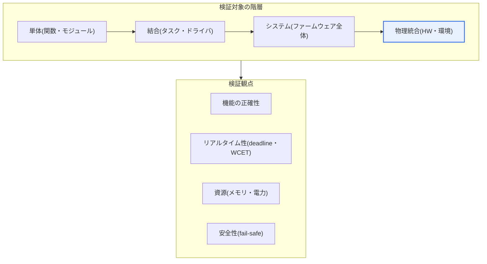

# 組込みソフトウェアテスト(Embedded Software Test)

## 1. 概要

### A. 定義
> **組込みソフトウェアテスト**は、特定のハードウェアに組み込まれ、リアルタイム・資源制約環境で動作する組込みSWの**機能・性能・安全性を、ハードウェアとの相互作用(センサー・アクチュエータ・通信・タイミング)まで含めて検証**する活動である。

組込みSWテストが一般的なSWテストと根本的に異なる理由は、「**ソフトウェアがハードウェアと物理世界に結び付いている**」点にある。一般のアプリケーションはPC・サーバという豊富な環境(数GBのメモリ、マルチコアCPU、完全なOS、デバッガ・プロファイラ)で実行されるが、組込みSWは数十KB~数MBのメモリと数十~数百MHz級のMCUを持つ特定のハードウェア(自動車ECU・医療機器・産業用PLC・家電)に組み込まれ、センサー・アクチュエータとリアルタイムに相互作用する。したがって、テストもソフトウェアのロジックだけを確認するのでは不十分である。

組込みテストで必ず確認すべき軸は、大きく4つある。第一は**リアルタイム性**であり、定められた締め切り時間(deadline)内に応答するか、最悪実行時間(WCET, Worst-Case Execution Time)が周期内に収まるかを確認する。第二は**資源制約**であり、限られたメモリ・スタック・電力予算内で動作するか、スタックオーバーフロー・ヒープの断片化がないかを確認する。第三は**ハードウェア依存性**であり、割り込み・DMA・タイマー・通信バス(CAN・SPI・I2Cなど)との連携が正確かを検証する。第四は**安全性**であり、誤動作がそのまま物理的事故(車両の制動失敗・医療機器の誤作動・産業設備の暴走)につながるため、故障時に安全状態へ収束するか(fail-safe)を確認する。

また、対象ハードウェア上で直接テストすることが難しく、観察・デバッグ手段が限られている(数本のピン、JTAG、ログ出力の余裕不足)という実務上の制約がある。このため組込みテストでは、モデル・シミュレーションから始めて次第に実際のプロセッサ・ハードウェアへと近づけていく段階的戦略(MIL→SIL→PIL→HIL)を用いる。開発初期には安価で高速かつリスクのない仮想環境で大量に検証し、実際の物理条件との整合は最終段階で実機を用いて確認することで、コストと品質のバランスを取る。

### B. 特殊性
リアルタイム性、資源制約、ハードウェア依存性、高い安全・信頼性要求、そして限られた観察・デバッグ手段という5つが、組込みテストの難度を決定する。特に「再現が難しい欠陥(タイミング・競合・割り込み順序に依存するheisenbug)」と「観察が対象の動作を変えてしまう観測干渉(probe effect)」は、組込み特有の難しさである。

## 2. 全体構造 — テスト対象と観点

組込みテストの全体構造は、「検証対象(SW・連携・物理環境)」と「検証観点(機能・リアルタイム・資源・安全)」を交差させたマトリクスとして理解するとよい。以下の構造図は、組込みSWテストがソフトウェア単位から始まってハードウェア・物理環境へと拡張され、各階層ごとに異なる観点を要求することを示している。

**単体・結合テスト**は、関数・ドライバ単位のロジックと境界値を確認するものであり、ハードウェアを仮想化したスタブ/モック(mock)やホストコンパイルで実施することが多い。**システムテスト**は、ファームウェア全体を対象にシナリオ・状態遷移・例外処理を確認する。**物理統合テスト**は、実際のセンサー・アクチュエータ・電源・通信を接続し、温度・電圧・ノイズといった物理条件まで検証する。観点軸の4項目はすべての階層で繰り返し適用されるが、特にリアルタイム性と安全性は物理統合段階で決定的に表面化する。

この構造が重要である理由は、欠陥が発見される時点が遅くなるほど修正コストが急激に増加するからである。物理統合(HIL)や実車の段階でロジック欠陥を発見すると、すでにハードウェアの配線・試験セットアップが絡み合っているため、原因の切り分けに大きなコストがかかる。そのため、安価なSIL段階で可能な限り多くの機能・境界欠陥を取り除き、HILは「仮想環境では再現不可能な物理・タイミングの問題」に集中させるのが定石である。

## 3. テスト段階 — X-in-the-Loop

組込み検証の中核的方法論であるX-in-the-Loopは、開発段階に合わせて検証環境を段階的に実物に近づけていく。初期にはモデル・シミュレーションで検証し、次第に実際のコード→ターゲットプロセッサ→実際のハードウェアを結合して、最終的に実機でリアルタイムの統合検証を行う。以下の詳細アーキテクチャは、各段階で「何が実物で何がシミュレーションか」を示す。

**MIL(Model-in-the-Loop)**段階は、制御アルゴリズムをまだコード化する前に、モデル(例: Simulinkブロック線図)レベルで制御対象モデル(plant model)とともにシミュレーションする。この段階の目的は、「設計コンセプトが要求を満たすか」を安価に確認することである。例えば、車両のクルーズコントロールのロジックを実際のECUなしにノートPC上で数千回の走行シナリオで実行し、安定性・応答性を早期に検証できる。

**SIL(Software-in-the-Loop)**段階は、モデルから生成した、あるいは直接作成した**実際のCコード**をホストPCでコンパイルし、仮想プラントモデルとともに実行する。ここでは、コードがモデルと同一に動作するか(コード・モデル等価性)、浮動小数点を固定小数点に変換した際の誤差が許容範囲内かなどを確認する。SILは実行速度が速く、カバレッジ測定・デバッグが容易であるため、回帰テストを大量に自動化するのに最も適している。

**PIL(Processor-in-the-Loop)**段階は、コードを**実際のターゲットプロセッサ(またはサイクル精度の命令セットシミュレータ)**に載せて実行する。コンパイラの最適化・ターゲットアーキテクチャの特性によりホストと結果が異なり得るため、この段階でターゲット上の数値精度と実行時間(サイクル数)を確認する。WCETの測定とスタック使用量の確認は、ここで行われることが多い。

**HIL(Hardware-in-the-Loop)**段階は、**実際のECU(コントローラ)**をリアルタイムのプラントシミュレータに接続し、センサー信号を擬似的に注入してアクチュエータ出力を受け取り、閉ループで検証する。HILは実車・実設備なしでも危険な故障シナリオ(センサー断線、急激な負荷変動、通信エラー)を安全かつ繰り返し再現できるため、自動車・航空・発電分野で必須の設備となった。最後の**実車・実機**段階では、すべての要素が実物として統合され、最終検証が行われる。

| 段階 | 検証対象(実物) | 主な目的 | 代表的なツール・環境 |
|---|---|---|---|
| **MIL** | なし(モデルのみ) | 設計コンセプトの検証 | Simulinkなどのモデルシミュレーション |
| **SIL** | 実コード(ホスト) | コード・モデル等価性、回帰の自動化 | ホストコンパイル + 仮想プラント |
| **PIL** | コード + ターゲットプロセッサ | ターゲット上の正確性・実行時間 | 評価ボード・ISS |
| **HIL** | 実ECU + リアルタイム | 閉ループ・故障注入の検証 | リアルタイムシミュレータ(HIL rig) |

## 4. 主要なテスト観点と技法 — 詳細

組込みテストでは、各観点が固有の技法を要求する。以下で項目ごとに原理と実務上の含意を記述する。

**リアルタイム性の検証**は、「平均」ではなく「最悪」を見るという点で一般的な性能テストと異なる。ハードリアルタイムシステムでは、たった一度でも締め切りを超えれば事故になり得るため、統計的な応答時間ではなく、WCETとスケジューラビリティ(RMA・応答時間解析など)を根拠に判断する。例えば、エアバッグ展開ロジックが衝突検知後数ms以内に必ず点火信号を出さなければならないとすれば、平均遅延がいかに良くても、最悪経路の遅延が締め切りを超えないことを証明しなければならない。

**資源制約の検証**は、正常動作だけでなく、長時間運転におけるリーク・断片化まで確認する。スタック使用量は割り込みのネストまで考慮した最悪値を測定し、動的メモリを使う場合は断片化による割り当て失敗の可能性を点検する。多くのセーフティクリティカルなコーディング標準(例: MISRA C)が動的メモリの使用を制限する理由はここにある。

**ハードウェア連携の検証**は、センサー値の範囲・ノイズ、割り込みの遅延・ネスト、通信フレームの正確性とエラー処理を扱う。この領域の欠陥は特定のタイミングでのみ再現されることが多いため、実際の信号を再生したり故障を注入したりするHIL環境で取り除く。例えば、CANバスが瞬間的にバスオフになる状況で、コントローラが安全状態に復帰するかを試験する。

**安全性・信頼性の検証**は、カバレッジと故障対応を併せて確認する。特に安全度水準の高いコードには、**MC/DC(Modified Condition/Decision Coverage)**が要求される。これは、各条件が独立して判定結果に影響を及ぼすことを示す強力なカバレッジ基準であり、航空(DO-178C)の最高レベル(DAL A)と自動車(ISO 26262)の高いASILレベルで要求される。単純な命令網羅(statement)や分岐網羅(branch)よりもはるかに厳格であり、条件の組み合わせの一部だけで完全性を証明できる点が実務上の利点である。

| 観点 | 中核となる問い | 代表的な技法 |
|---|---|---|
| **リアルタイム性** | 最悪時でも締め切りを守れるか | WCET解析、スケジューラビリティ解析 |
| **資源制約** | 予算内で安定しているか | スタック最高水位の測定、静的解析 |
| **ハードウェア連携** | 信号・通信・割り込みは正確か | 故障注入、信号再生、HIL |
| **安全性** | 故障時に安全か、カバレッジは十分か | fail-safe試験、MC/DCカバレッジ |
| **環境試験** | 物理条件に耐えられるか | 温度・電圧・EMC試験 |

### 一般SWテストとの決定的な違い

組込みテストが一般SWテストと分かれる点を整理すると、実務上の含意が明確になる。一般アプリケーションのテストは「機能が正しいか」と「平均性能が十分か」に集中し、欠陥が発生しても大抵は再起動・ロールバックで復旧できる。一方、組込みテストは「最悪の瞬間でも安全か」を証明しなければならず、欠陥が物理的事故につながれば復旧は不可能である。

また、可観測性の差も大きい。一般的な環境ではログ・デバッガ・プロファイラを豊富に使えるが、組込みではログ出力でさえタイミングを変えて欠陥を隠してしまう観測干渉(probe effect)が生じる。このため、非侵襲トレースハードウェア、リアルタイム閉ループシミュレータ(HIL)、故障注入といった組込み特有の検証手段が発展した。結局、「いつ・どこで・何を実物として検証するか」という戦略的判断が、組込みテストの成否を分ける。

## 5. 深掘り — 標準・産業事例と最新動向

組込みテストは、ドメインごとの**機能安全規格**と切り離して考えることはできない。自動車ではISO 26262がASIL(A~D)レベルに応じて要求カバレッジと検証手順を規定し、上位概念として意図した機能の安全性(SOTIF, ISO 21448)が、自動運転のように「故障がなくても性能限界によって危険になり得る」状況を扱う。航空ではDO-178Cがソフトウェアレベル(DAL A~E)ごとに検証目標を定め、最高レベルではMC/DCを要求する。産業全般ではIEC 61508がSIL(1~4)で安全度水準を定義する。これらの規格は「テストをどれだけ、どのような方式で」行うべきかを契約レベルで強制するため、組込みテスト戦略そのものが、規格準拠の証拠(evidence)を生み出すプロセスとして設計される。

産業現場の具体的な事例を見ると、大手完成車メーカー・部品メーカーは、数百のECUに対する回帰検証を数十台のHIL rigとSILファーム(farm)で夜間に自動実行している。コード変更がコミットされるたびにSILで数千のシナリオを迅速に確認し、合格したビルドだけをHILに渡してリアルタイム・物理的な欠陥を捉えるパイプラインが一般化しつつある。これは、組込み分野でも継続的インテグレーション(CI)とテスト自動化が標準的な慣行となったことを示している。

最新動向としては、3つが際立っている。第一に、**仮想ECU・デジタルツイン**の普及である。クラウド上で大量の仮想プラント・仮想ECUを並列に実行し、実機不足に悩まされることなく数万のシナリオを検証する方式が増えている。第二に、**SDV(Software-Defined Vehicle)とOTA**の流れである。車両SWが出荷後も無線で更新されるようになり、更新前後の回帰検証と安全論証を自動化・継続化する要求が高まった。第三に、**AI・データ駆動型システムの検証**である。ディープラーニングの認知モジュールは従来のカバレッジでは不十分であるため、シナリオカバレッジ・データ分布に基づく検証とSOTIFの観点が組み合わされつつある。これらの動向は、組込みテストが「実機中心」から「仮想・データ中心の継続的検証」へと重心を移していることを示唆している。

## 6. 考慮事項および示唆

1. **安全規格への準拠をテスト戦略の出発点とする。** ISO 26262・DO-178C・IEC 61508などのドメイン規格が要求するカバレッジ(MC/DCなど)と検証手順・トレーサビリティの証拠を最初から計画に反映してこそ、認証段階での手戻りを避けられる。テストは欠陥発見だけでなく、「安全論証の根拠を生成する」活動であることを認識すべきである。[[software-safety-analysis]]
2. **シミュレーションと実機の役割を明確に分担する。** 安価で高速なSIL・MILで機能・境界欠陥を大量かつ早期に除去し、HIL・実車は仮想環境では再現不可能なリアルタイム・物理・故障シナリオに集中させることで、コストと品質を同時に最適化する。段階ごとに「何を取り除くか」を設計することが核心である。
3. **自動化・CIを組込みに合わせて確立する。** HIL自動化設備とSILファームをCIパイプラインに結合し、頻繁な変更にも回帰検証を夜間に繰り返し実施する体制を整える。ただし、リアルタイム・物理依存のテストは再現性の確保(信号再生、シード固定)が鍵であり、不安定なテスト(flaky test)の管理が信頼の前提となる。
4. **観測干渉と再現性を管理する。** デバッグ用のログ・プローブがタイミングを変えて欠陥を隠したり新たな欠陥を生んだりするprobe effectを考慮し、非侵襲的なトレース(trace)ハードウェアと決定論的な再現環境を用意しなければならない。
5. **SDV・OTA・AI時代の継続的検証体制へ転換する。** 出荷後の更新・自律機能の拡大に備え、仮想ECU・デジタルツインに基づく大規模並列検証と、SOTIF・シナリオカバレッジを組み合わせた継続的検証(continuous verification)の能力を確保することが、今後の競争力となる。

## 参考資料
- ISO 26262 Road vehicles — Functional safety, https://www.iso.org/standard/68383.html
- ISO 21448 Road vehicles — Safety of the intended functionality (SOTIF), https://www.iso.org/standard/77490.html
- RTCA DO-178C / MC/DCの概要(NASA Technical Reports), https://ntrs.nasa.gov/citations/20010057789
- IEC 61508 Functional safety of E/E/PE safety-related systems, https://www.iec.ch/functional-safety

---

> **一言まとめ**: 組込みSWテストは*ハードウェア・リアルタイム・資源制約・安全性までを閉ループで検証*する活動であり、MIL→SIL→PIL→HILで段階的に実環境へ近づきながら、ISO 26262・DO-178Cなどの機能安全規格のカバレッジ(MC/DC)・トレーサビリティ要求を満たし、SDV・デジタルツインに基づく継続的検証へと進化している。
