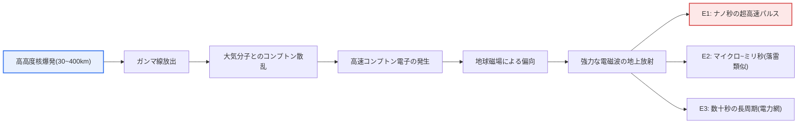
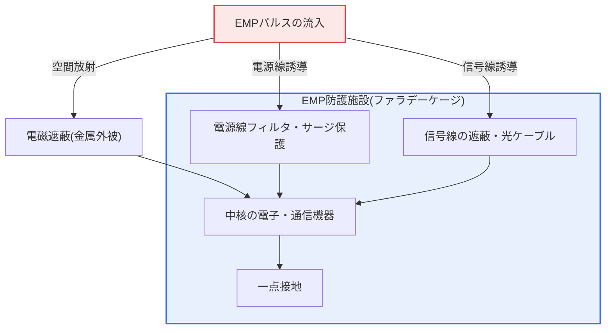

# EMP攻撃(ElectroMagnetic Pulse Attack)

## 1. 概要

### A. 定義と問題意識
> **EMP攻撃**は、瞬間的に発生させた**強力な電磁パルス(Electromagnetic Pulse)により、電子・電力・通信機器の半導体回路に過電流・過電圧を誘導して破壊・麻痺**させる攻撃である。物理的な爆発や人命の殺傷なしに広い地域の電子システムを同時に無力化できる点から、「電子的大量破壊兵器(e-WMD)」に分類される。

EMP攻撃が他の物理的・サイバー脅威と根本的に異なる理由は、「**銃弾1発、マルウェア1行もなしに、社会の電子神経網全体を同時に麻痺させる**」点にある。現代社会は、電力網・通信・金融・交通・医療・国防のすべてが半導体ベースの電子システムに依存している。ところが半導体素子は、定格電圧を大きく超える瞬間電流が流れると接合部が溶けて永久に損傷する。EMPはまさにこの物理的脆弱性を狙う。強力な電磁パルスを瞬間的に放出すると、導体(電線・基板配線・アンテナ)に電圧が誘導され、この誘導電圧が素子の耐圧を超えると回路が焼損する。その結果、広い地域の電子機器が**同時に、ソフトウェア的な復旧が不可能な形で**機能停止する。

特に問題となるのは、現代のインフラが相互依存的であるという点である。電力網が停止すれば通信・上水道・冷房・金融システムが連鎖的に停止し、バックアップ発電機の制御回路までもがEMPで損傷すれば、復旧そのものが不可能になる。サイバー攻撃はバックアップ・パッチ・隔離で対応できるが、EMPは物理層(ハードウェア)を直接破壊するため、再起動やソフトウェアによる復旧では元に戻せない。このため主要国はEMPを通常兵器・核・サイバーとは区別される独立した脅威カテゴリとして扱い、重要な国家施設にはEMP防護(遮蔽)基準を別途適用している。

### B. 発生原因による区分
EMPは、どのように発生したかによって脅威の規模と対応方式が大きく異なる。高高度核爆発で発生する**HEMP**はたった1回で大陸規模の被害を与え得るため国家安全保障上の脅威として扱われ、核を用いずに電磁兵器で生成する**非核EMP(NNEMP)**は局所的ではあるがテロ・戦場において現実的な脅威であり、太陽の爆発が引き起こす**自然EMP(宇宙天気)**は人為的な攻撃ではないものの、電力網に実際に大規模停電を引き起こした前例がある。

| 区分 | 発生原因 | 被害範囲 | 特徴 |
|---|---|---|---|
| **HEMP(核EMP)** | 高高度(30~400km)核爆発 | 広域(大陸規模も可能) | E1・E2・E3成分、最大の脅威 |
| **非核EMP(NNEMP)** | 電磁兵器(HPM、EMP弾、爆発式磁束圧縮発生器) | 局所的(数百m~数km) | 通常兵器・テロでの利用の現実性 |
| **自然EMP** | 太陽コロナ質量放出(CME)・磁気嵐、落雷 | 広域(電力網中心) | E3に類似、宇宙天気の監視が必要 |

## 2. HEMPの発生原理と時間成分

HEMPはEMP脅威の頂点に位置する。高高度で核が爆発すると強力なガンマ線が放出され、このガンマ線が大気中の酸素・窒素分子と衝突して電子をはじき出す(コンプトン散乱)。こうして生成された高速電子(「コンプトン電子」)が地球磁場によって曲げられながら、強力な電磁波を地上に降り注ぐ。爆発高度が高いほどガンマ線が到達する地表面積が広くなるため、高度400kmでの単発の爆発が1つの国全体を覆い得るという点が、安全保障上の核心である。

HEMPが特に危険である理由は、1つの爆発が時間特性のまったく異なる3つの成分を順次発生させ、それぞれ異なる防護手段を無力化する点にある。E1はあまりに速いため既存のサージ保護器が反応する前に素子を焼損させ、E1が防護素子を先に破壊した後にE3が電力網を攻撃するというように、複合的な被害をもたらす。

| 成分 | 持続時間 | 主な脅威対象 | 防護の難易度 |
|---|---|---|---|
| **E1** | 数ナノ秒(ns) | 半導体・電子機器(IC、通信機器) | 非常に高い(一般的なサージ保護器が追従できない) |
| **E2** | 数μs~ms | 落雷に類似、ケーブル | 低い(既存の落雷防護で一部対応) |
| **E3** | 数十秒 | 電力網の変圧器・長距離ケーブル | 高い(誘導電流により大型変圧器が焼損) |

### A. E1 — 最も致命的な超高速パルス
E1はナノ秒単位で立ち上がる極超短パルスであり、電界強度は数万V/mに達する。このように速いパルスは、一般的なサージ保護器(MOV、ガス放電管)が反応するのに必要な時間(数十ns~μs)より早く通過してしまうため、保護素子が動作する前に後段の半導体を焼損させる。短いアンテナ・配線にも効果的に結合するため、ノートPC・通信端末・産業用コントローラ(PLC)のような小型電子機器が特に脆弱である。E1の防護は結局、パルスを回路に到達させない**遮蔽**と、超高速サージ抑制素子(TVSダイオード)の組み合わせに依存する。

### B. E2 — 落雷に類似した中間成分
E2は落雷と時間特性が似ているため、比較的対応が容易である。ただし、E1がすでに落雷防護素子を破壊した後であれば、E2がその隙間から侵入し得るため、単独ではなくE1との複合作用として評価しなければならないという点が実務上の含意である。

### C. E3 — 電力網を狙う長周期成分
E3は数十秒にわたる緩やかな磁場変動であり、長距離送電線・通信ケーブルに地磁気誘導電流(GIC)を流す。この電流が大型電力変圧器の鉄心を飽和させ、過熱・焼損を引き起こす。大型変圧器は製作・交換に数か月~1年以上かかり在庫も少ないため、E3の被害は長期にわたる大規模停電につながり得る。E3は太陽による磁気嵐と物理的に類似しており、実際に1989年のカナダ・ケベック州の大停電(約600万人、9時間)が磁気嵐によるGICで発生した代表的な事例である。

## 3. 脅威の類型と防護方策

防護の基本原理は、**遮蔽(Shielding)・接地(Grounding)・フィルタリング(Filtering)**の3つに要約される。遮蔽によってパルスが回路に到達するのを防ぎ、誘導された過電流は接地によって安全に逃がし、電源線・信号線から侵入する成分はフィルタ・サージ保護器で遮断する。いずれか1つだけでは不十分であり、侵入経路(空間放射・電源線・信号線・接地線)ごとに対応手段を幾重にも配置する多層防御が核心である。

| 脅威 | 侵入経路 | 防護方策 |
|---|---|---|
| **電子機器の即時破壊(E1)** | 空間放射・短い配線 | 電磁遮蔽(ファラデーケージ)、シールドルーム、TVSダイオード |
| **電力網の麻痺(E3)** | 長距離送電線のGIC | サージ保護器、接地、GIC遮断装置、変圧器保護 |
| **通信・ケーブルの誘導電流** | 信号線・データ線 | ケーブルの遮蔽・ボンディング、金属線の代わりに光ケーブルを使用 |
| **システム停止・復旧不能** | 複合 | 予備機器の隔離保管(off-site)、システムの冗長化、復旧手順 |

遮蔽性能は減衰量(dB)で規定される。国内外の軍・重要施設の基準では、通常**80dB以上**(周波数帯域別)の遮蔽性能を要求し、米国はMIL-STD-188-125、IECは61000シリーズなどで試験・評価基準を規定している。実際の構築時には、出入口・換気口・ケーブル貫通部のような開口部が遮蔽の弱点(漏洩経路)となるため、導波管減衰器・EMIガスケット・ハニカムベントで開口部を処理する設計が性能を左右する。

## 4. 比較 — EMP・サイバー・落雷脅威の違いと含意

3つの脅威はいずれも電子システムを狙うが、発生メカニズムと対応戦略は根本的に異なる。その違いを理解してはじめて、防護投資の優先順位を定めることができる。

| 区分 | EMP攻撃 | サイバー攻撃 | 落雷(自然) |
|---|---|---|---|
| 攻撃レイヤー | 物理(ハードウェア破壊) | 論理(SW・データ) | 物理(電気的サージ) |
| 被害範囲 | 広域・同時(HEMP) | 標的型・拡散型 | 局所的 |
| 復旧 | ハードウェア交換が必要(長期) | バックアップ・パッチで復旧 | 素子の交換 |
| 中核的な対応 | 遮蔽・接地・フィルタ | アクセス制御・検知・バックアップ | 避雷・サージ保護 |

最も重要な実務上の含意は、**EMPはソフトウェアで復旧できない**という点である。サイバー攻撃は、いかに深刻でもバックアップから復元してシステムを再構成すればよいが、EMPによって半導体が物理的に焼損すれば、部品を交換するしかない。したがって、EMP対策の核心は「防御」とともに、「**予備機器の隔離保管(EMP遮蔽された場所に別途保管)**」というレジリエンス(Resilience)戦略である。また、落雷防護(避雷・サージ保護)がすでに整っている施設であっても、E1の超高速成分には無力である可能性があるため、既存の防護をEMP対策と誤解しないよう注意しなければならない。

## 5. 深掘り — 最新動向と国家の対応

EMPの脅威は冷戦期の核シナリオから出発したが、近年は2つの方向で現実性が高まっている。第一に、**非核EMP(NNEMP)兵器の小型化**である。高出力マイクロ波(HPM)装置と爆発式磁束圧縮発生器(FCG)は、核なしでも局所的に強いパルスを生成できるため、ドローン搭載型・車両搭載型の形で戦場・テロの脅威となっている。実際に対ドローン防御手段としてHPMベースの迎撃システムが研究・実証されており、これはEMPの原理が攻撃だけでなく防御資産としても活用されることを示している。

第二に、**宇宙天気(自然EMP)に対する警戒感**が高まった。1859年のキャリントン・イベント級の太陽爆発が現代に再現されれば、地球規模の電力網・衛星の被害が懸念されており、前述の1989年のケベック停電はその可能性を実際に示した事例である。これを受けて各国は、宇宙天気の監視・警報体系(例: 太陽観測衛星、地磁気観測)と、電力網へのGIC遮断装置の導入を推進している。

政策面では、米国はEMPを国家安全保障上の議題として扱い、関連する大統領令(2019年の「EMPの脅威に対する国家レジリエンス強化」に関する大統領令)と規格(MIL-STD-188-125)を整備した。韓国でも国家重要施設に対するEMP防護基準と防護施設の認証制度を運用し、通信・電力などの基盤施設の防護を段階的に拡大している。技術士の観点からは、正確な最新の政策数値・年度は変動し得るため、断定するよりも「防護の基準化・認証の制度化が拡大している傾向」として記述するのが安全である。

## 6. 考慮事項および示唆(技術士の観点)

1. **国家重要インフラの優先防護とリスクベースの投資。** 完全な防護はコスト上非現実的であるため、麻痺した際の波及が大きい電力・通信・金融・国防・医療施設から危険度を評価し、防護基準を差別化して適用すべきである。全施設を同一に防護するよりも、代替不可能性と復旧所要時間を基準に優先順位を定めるリスクベースのアプローチが現実的である。
2. **遮蔽・接地・フィルタの多層防御と開口部の管理。** 防護性能は最も弱い侵入経路(出入口・換気口・ケーブル貫通部)で決まる。80dB級の遮蔽を設計しても開口部の処理が不十分であれば全体の性能が崩れるため、導波管減衰器・EMIガスケットなどの開口部設計と、定期的な遮蔽性能試験(漏洩点検)が不可欠である。
3. **レジリエンス(Resilience)中心の冗長化・予備機器戦略。** EMPはハードウェアを物理的に破壊するため、事後の復旧が難しい。したがって防御一辺倒ではなく、中核となる予備機器をEMP遮蔽空間に隔離保管し、システムを地理的に分散・冗長化して、「被害を前提とした迅速な復旧」を設計しなければならない。
4. **自然EMP(宇宙天気)との統合的な備え。** 人為的なHEMPだけでなく、太陽爆発による磁気嵐もE3類似の脅威として電力網を麻痺させ得る。宇宙天気の監視・警報、GIC遮断装置、大型変圧器の予備確保を、電力安定性政策と統合して推進すべきである。
5. **規格・認証体系と実測による検証。** MIL-STD-188-125、IEC 61000などの国際規格に基づく設計・施工と、竣工後の実測検証(遮蔽減衰量の測定)を制度化すべきであり、新規・非核EMP兵器の脅威を反映して基準を定期的に更新しなければならない。

## 参考資料
- CISA(米国サイバーセキュリティ・インフラストラクチャセキュリティ庁), Electromagnetic Pulse(EMP) Protection Guidelines: https://www.cisa.gov/topics/critical-infrastructure-security-and-resilience/electromagnetic-pulse-emp
- U.S. EMP Commission Reports(電磁パルス攻撃脅威評価委員会): https://www.firstempcommission.org/
- IEC 61000-2-9(HEMP environment)およびMIL-STD-188-125の概要: https://www.iec.ch/
- NASA/NOAA 宇宙天気(Space Weather)および1989 Quebec Blackout: https://www.swpc.noaa.gov/

---

> **一言まとめ**: EMP攻撃は*強力な電磁パルスで電子・電力・通信ハードウェアを物理的に破壊*する電子的大量破壊型の脅威であり、高高度核爆発によるHEMP(超高速のE1・落雷型のE2・電力網攻撃型のE3)が代表的である。ソフトウェアによる復旧が不可能という特性のため、遮蔽・接地・フィルタリングの多層防御と、予備機器の隔離・冗長化というレジリエンス戦略によって国家重要インフラを防護しなければならない。
