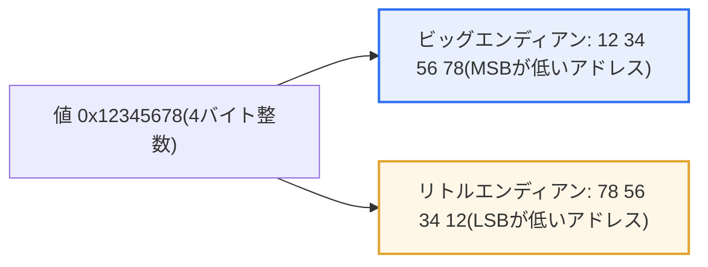
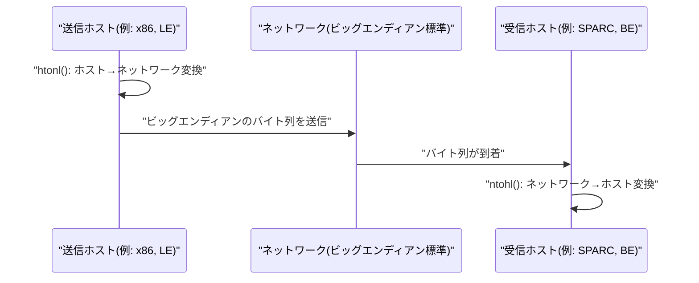

# ビッグエンディアン(Big Endian)とリトルエンディアン(Little Endian)

## 1. 概要

### A. 定義
> **エンディアン(Endianness)**とは、2バイト以上で構成されるデータ(整数・浮動小数点数・ポインタなど)をメモリや伝送媒体に格納する際の、**構成バイトを並べる順序**をいう。**ビッグエンディアン(Big Endian)**は最上位バイト(MSB, Most Significant Byte)を最も低いアドレスに、**リトルエンディアン(Little Endian)**は最下位バイト(LSB, Least Significant Byte)を最も低いアドレスに格納する。

エンディアンが問題となる根本的な理由は、「**同じ値をシステムごとに異なる順序で格納するため、データをやり取りする際に値が壊れる**」点にある。CPUのレジスタ内では数値は1つの論理的な値であるが、その値をバイト単位に分割してアドレスが振られたメモリに展開する瞬間、「どのバイトを先に置くか」という物理的な選択が生じる。例えば、4バイトの符号なし整数`0x12345678`を格納するとしよう。人が読む順序どおりに`12 34 56 78`を低いアドレスから格納すればビッグエンディアンであり、逆に`78 56 34 12`と格納すればリトルエンディアンである。値そのものは同じであるが、メモリ上のバイト配列は正反対である。

1台のコンピュータ内だけでデータを書き込み・読み出すのであれば、エンディアンはまったく問題にならない。CPUが格納時に用いた規則でそのまま読み出すからである。問題は、**エンディアンの異なる2つのシステムがバイナリデータを交換する際**に発生する。ビッグエンディアンの機器が送った`12 34 56 78`をリトルエンディアンの機器が自らの規則で解釈すると、最下位バイトが`12`であると誤解し、値が`0x78563412`へと完全に入れ替わってしまう。これが、ネットワーク通信、ファイルフォーマットの交換、異機種(heterogeneous)機器の連携においてエンディアンを必ず考慮しなければならない理由である。そのため、インターネットプロトコルは伝送時の標準順序として**ビッグエンディアン(ネットワークバイトオーダー, network byte order)**を採用し、混乱を防いでいる。

どちらかが本質的に優れているわけではなく、**CPU設計思想の違い**にすぎない。名称の由来も意味深長である。ジョナサン・スウィフトの小説『ガリヴァー旅行記』で、ゆで卵を大きい端(big end)から割る人々と小さい端(little end)から割る人々が些細な違いで戦争を起こす場面から取られたもので、「どちらが正しいかというより、合意が必要な慣習」という性格をよく表している。

区別しておくべき概念として、**バイトエンディアン(byte order)とビットエンディアン(bit order)**がある。通常「エンディアン」といえばバイト単位の配列順序を指し、これはプログラマがメモリ・ネットワークで直接向き合う問題である。一方、シリアル通信・ビットフィールド伝送では、1バイト内のビットをどちらから送るかというビットエンディアンも存在するが、大半のハードウェアがこれを透過的に処理するため、日常的なアプリケーション開発ではバイトエンディアンだけを考慮すれば十分である。また、かつてのPDP-11などでは、`0x12345678`を`34 12 78 56`のようにワード単位で入れ替えて格納する**ミドルエンディアン(Middle Endian)**も存在したが、今日では歴史的遺物としてのみ残っており、実務で遭遇することはほとんどない。

### B. 登場背景と格納例
歴史的に、Intel系のx86 CPUはリトルエンディアンを、Motorola 68000・初期のSPARC・PowerPCなどとインターネットプロトコルはビッグエンディアンを採用したことで、2つの方式が共存するようになった。リトルエンディアンを選んだ設計は「低いアドレス = 下位バイト」という規則が算術演算と型変換に有利である点を、ビッグエンディアンを選んだ設計は「人が読む順序と一致する」点を、それぞれ根拠とした。以下は、4バイトの値`0x12345678`が実際のメモリにどのように配置されるかを示したものである。

| アドレス | ビッグエンディアン | リトルエンディアン |
|---|---|---|
| 低いアドレス(base+0) | 12 | 78 |
| base+1 | 34 | 56 |
| base+2 | 56 | 34 |
| 高いアドレス(base+3) | 78 | 12 |

## 2. 動作原理と比較

2つの方式の違いは、「値をバイトに分解し、アドレス軸上にどちらの方向へ展開するか」に要約される。以下の図は、同一の1つの値が2つの規則に従って異なるバイト列に分かれる様子を示している。



ビッグエンディアンがもたらす最大の実務上の利点は**可読性**である。メモリダンプやパケットキャプチャを16進数で展開して見ると、バイト順序が人が数字を書く順序と同じであるため、デバッグ・プロトコル解析時に値を直感的に読み取れる。一方、リトルエンディアンは**下位バイトが常に同じ(低い)アドレスに位置する**という規則のおかげで、4バイトの値を2バイトや1バイトに切り詰めて使う際にアドレスを変えずにそのまま先頭部分を読めばよく、型変換と多倍長精度算術の実装が単純になる。これは、加算を下位バイト(=低いアドレス)から桁上げを伝播させながら行うCPU内部の動作ともよく合致する。

| 区分 | ビッグエンディアン | リトルエンディアン |
|---|---|---|
| **格納順序** | MSBを低いアドレスに | LSBを低いアドレスに |
| **直感性** | 人が読む順序と同一 | 逆順(ダンプでは直感的でない) |
| **演算・型変換** | — | 下位バイトへのアクセス・可変精度算術に有利 |
| **代表的な使用例** | ネットワーク(TCP/IP)、68000、初期SPARC | Intel x86/x64、ARM(既定はLE)、RISC-V |

この対比は、「なぜ2つの陣営が最終的に1つに統一されなかったのか」を説明してくれる。各設計が自らの用途において実質的な利点を持っていたからである。CPU内部の算術効率を重視した陣営はリトルエンディアンを、人の可読性とプロトコルの一貫性を重視した陣営はビッグエンディアンを選び、どちらも「間違っていない」選択であったため、エコシステムが固着した後は移行コストが利点を圧倒し、共存が定着した。

ここで注意すべき点は、エンディアンが**マルチバイト単位にのみ適用される**という事実である。1バイト(例: ASCII文字)のデータや、バイト配列・文字列のように「要素1つが1バイトである連続データ」は、エンディアンに関係なく同じように格納される。エンディアンが値を反転させる対象は、あくまで1つの整数・実数のように複数のバイトが集まって1つの値を構成する場合である。この点を混同すると、文字列が壊れた原因を見当違いにエンディアンに帰すという誤りを犯しやすい。

## 3. 処理方法 — バイトオーダー変換

異機種間通信でエンディアンの不一致を防ぐ標準的な戦略は、「**伝送層でバイトオーダーを統一する**」ことである。具体的には、データをネットワークへ送出する際は自身のホストバイトオーダー(host byte order)を**ネットワークバイトオーダー(ビッグエンディアン)に変換**し、受信時は再び自身のホストバイトオーダーに戻す。この変換をアプリケーションが一貫して行えば、双方のCPUのエンディアンが何であれ、途中で合意された1つの標準で出会うため、値が保存される。



C/POSIX環境では、この変換のために`htonl()`/`htons()`(host-to-network、4/2バイト)と`ntohl()`/`ntohs()`(network-to-host)関数が提供されている。これらの関数は、ホストがすでにビッグエンディアンであれば何もせず(無変換)、リトルエンディアンであればバイトを反転させるという方式で、**ホストのエンディアンを気にせずに移植可能なコード**を書けるようにする。例えば、x86(リトルエンディアン)ホストでポート番号`80`(0x0050)を送信する場合、`htons(80)`はバイトを反転させ、ネットワークへは`00 50`(ビッグエンディアン)が送出されるよう保証する。逆に、すでにビッグエンディアンのホストでは、同じ呼び出しは何も変更しない。このように「変換関数は呼び出すが、実際の動作はホストのエンディアンによって異なる」構造のおかげで、同一のソースコードが双方のアーキテクチャで同じように正しく動作する。

アプリケーションレベルでは、Protocol Buffers・Avro・Thriftのようなシリアライズライブラリがエンディアン処理を内部で担うため、開発者が低レベルの変換を直接扱う必要は少なくなる。ただし、独自のバイナリフォーマットを定義する場合(ファイルヘッダ・組込みプロトコル)には、フォーマット仕様にエンディアンを必ず明記しなければならない。また、浮動小数点数(IEEE 754)もマルチバイトの値であるためエンディアンの影響を受ける。大半のリトルエンディアンシステムは整数と同様に浮動小数点数もリトルエンディアンで格納するが、一部の組込み環境では整数と浮動小数点数のエンディアンが異なる混在事例があるため、実数データをバイナリで交換する際は整数とは別に互換性を検証しなければならない。

自システムのエンディアンを確認する古典的な手法は、整数`1`を格納した後、そのメモリの先頭バイトを読んでみることである。先頭バイトが`01`であれば下位バイトが先に来ているのでリトルエンディアン、`00`であればビッグエンディアンである。以下はその判別をCコードで表現したもので、4バイト整数の先頭バイトを`char`ポインタで覗き見る典型的なイディオムである。

```c
#include <stdio.h>

int is_little_endian(void) {
    unsigned int x = 1;          /* 0x00000001 */
    char *p = (char *)&x;        /* 先頭バイトのアドレス */
    return (*p == 1);            /* 1ならLSBが先 → リトルエンディアン */
}

int main(void) {
    printf("%s\n", is_little_endian() ? "Little Endian" : "Big Endian");
    return 0;
}
```

実際の事例として、TIFFなどの画像フォーマットやUnicodeテキストファイルは、ファイル先頭に**BOM(Byte Order Mark)**やマジックナンバー(`II`=Intel/LE、`MM`=Motorola/BE)を置き、読み込む側がエンディアンを判別できるよう設計されている。すなわちフォーマット自体が「自分はどのエンディアンで書かれたか」を宣言しておくものであり、これは前述の「フォーマット仕様にエンディアンを明記せよ」という原則を実際の標準が実装した形である。

## 4. 事例と実務上の含意

エンディアンの不一致は抽象的な理論ではなく、実際のバグのよくある原因である。第一の事例として、組込みセンサー(ビッグエンディアンMCU)が収集した16ビットの温度値をx86 Linuxサーバ(リトルエンディアン)にそのまま送信する際に変換を漏らすと、`0x0102`(258)がサーバで`0x0201`(513)として読まれ、温度が見当違いの値で記録される。第二に、ファイルフォーマットの互換性問題として、ビッグエンディアン機器で作成したバイナリ設定ファイルをリトルエンディアンPCで読み込むと、整数フィールドがすべて反転してパースに失敗する。第三に、ネットワークプログラミングにおいて、ポート番号やIPアドレスのようなフィールドを`htons()`なしで構造体に直接入れて送信すると、同じエンディアンの機器同士では動作していたものが異機種連携で突然壊れる「再現しないバグ」となる。このようにエンディアンのバグは、**同一エンディアン環境では潜んでいて、異機種連携でのみ表面化する**ため、診断が厄介である。

第四の事例は、**共有メモリ・メモリマップトファイル(mmap)**である。ビッグエンディアンサーバで生成してディスクにそのままダンプした構造体を、リトルエンディアンサーバがメモリマップで読み込むと、文字列フィールドは正常であるのに、整数のカウンタやオフセットのフィールドだけがとんでもない値として現れる。これは、「バイト配列(文字列)はエンディアン非依存、マルチバイト整数はエンディアン依存」という前述の原理が1つの構造体内で同時に作用した結果であり、症状が部分的であるため原因の特定がより困難である。

したがって、実務上の原則は明確である。バイナリデータがプロセス・機器・言語の境界を越えるすべての地点で**エンディアンを明示的に統一**し、決して「たまたま同じエンディアンだから動作する」コードに依存しないことである。テキストベースのフォーマット(JSON・XML)が異機種連携で好まれる隠れた理由の1つも、まさにエンディアン問題から自由であるという点にある。

## 5. 深掘り — バイエンディアンと最新動向

近年のプロセッサは**バイエンディアン(Bi-Endian)**をサポートする傾向にある。ARM、PowerPC、MIPS、RISC-Vなどは、設定レジスタやブートオプションでエンディアンモードを切り替えられるため、1つのチップをビッグ/リトル双方のエコシステムに統合しやすい。例えばARMは既定ではリトルエンディアンで動作するが、ネットワーク機器向けにビッグエンディアンモードを選択できる。これは、かつての「CPUがエンディアンを固定する」時代から、「システム統合の柔軟性のためにエンディアンを選択可能な属性」として扱う方向への変化である。

こうした切り替え機能は主にシステムのブート初期段階やファームウェアレベルで一度決定され、オペレーティングシステムとアプリケーションはその上で一貫したエンディアンを前提として動作する。したがって、切り替え自体はチップメーカー・ボード設計者の統合上の利便性のためのものであり、アプリケーション開発者が実行時に随時変更する機能ではないことを理解すべきである。アプリケーションの立場では、依然として「自分が動作する環境のエンディアンが何であれ、境界で変換する」という原則が有効である。

一方、現実には**リトルエンディアンの事実上の標準化**が進んでいる。Intel x86/x64とリトルエンディアンモードのARMがサーバ・モバイル・PC市場を席巻したことで、新たに設計されるファイルフォーマット・言語ランタイム・仮想マシンの多くがリトルエンディアンを既定の前提としている。RISC-Vの標準もリトルエンディアンを既定として規定している。ただし、ネットワークプロトコルは依然としてビッグエンディアンを標準として維持しているため、通信コードでは今後もバイトオーダー変換がなくなることはない。結局、「内部演算はリトル、伝送標準はビッグ」という二元構造を理解し、境界で変換を一貫して適用することが実務の核心として残る。

## 6. 考慮事項および示唆(技術士の観点)

1. **異機種連携時の明示的変換の強制**: 異なるエンディアンのシステム間でのバイナリ交換では、ネットワークバイトオーダーに統一するか、プロトコル・フォーマット仕様にエンディアンを明確に定めなければならない。`htonl/ntohl`などの標準変換関数を一貫して使用し、ホストのエンディアンに依存しないコードを作成する。
2. **シリアライズ・バイナリフォーマットの設計原則**: ファイル・通信フォーマットを設計する際は、エンディアンとフィールドサイズを規定してはじめてプラットフォーム間の移植性が保証される。可能であればProtobuf・Avroのような実績あるシリアライズフレームワークを使用してエンディアン処理を委任し、必要に応じてヘッダにBOM・マジックナンバーでエンディアンを表記する。
3. **テスト・診断戦略**: エンディアンのバグは同一エンディアン環境では潜伏するため、ビッグ/リトル双方の環境(またはQEMUなどのクロスエミュレーション)でバイナリの相互運用性テストを実施してはじめて早期に発見できる。
4. **バイエンディアン・標準化の流れの活用**: ARM・RISC-Vなどエンディアン切り替えが可能なアーキテクチャはシステム統合の柔軟性を高めるが、設定によって動作が変わるため、展開環境のエンディアンモードを構成管理で統制しなければならない。新規システムはリトルエンディアンの事実上の標準を前提としつつ、伝送境界でのビッグエンディアン変換は維持する。
5. **性能・アライメント(alignment)との連携**: エンディアン変換自体のコストは小さいが、大量データ伝送においてバイトスワップがボトルネックとならないよう、バッファ単位の一括変換とメモリアライメントを併せて考慮することが望ましい。

## 参考資料
- Wikipedia, "Endianness" — https://en.wikipedia.org/wiki/Endianness
- RFC 1700 / IEN 137 (Network byte order, "On Holy Wars and a Plea for Peace")
- Linux man-pages, "byteorder(3) — htonl/htons/ntohl/ntohs" — https://man7.org/linux/man-pages/man3/htonl.3.html

---

> **一言まとめ**: エンディアンは*マルチバイトデータをメモリに並べるバイト順序*であり、ビッグエンディアン(MSBが先・ネットワーク標準)とリトルエンディアン(LSBが先・x86による事実上の標準)が設計思想の違いから共存している。異機種間の境界でネットワークバイトオーダーへ明示的に変換し、値の互換性を確保することが核心である。
