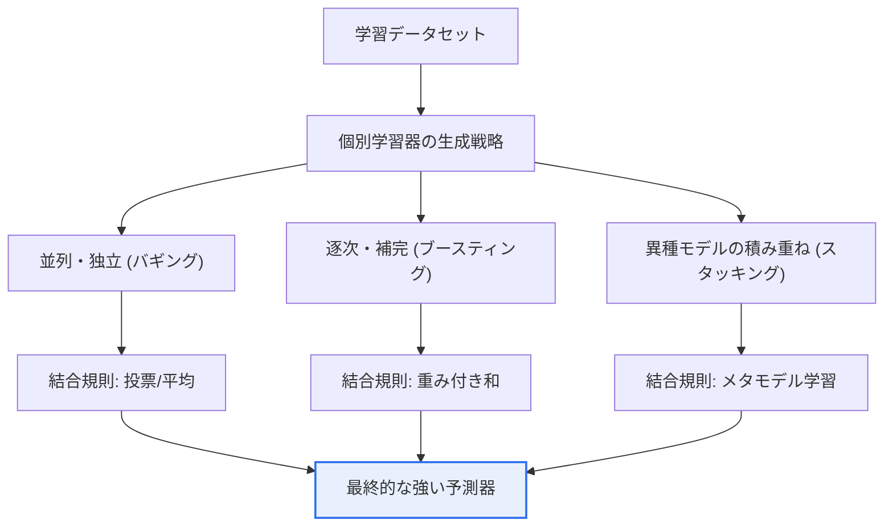
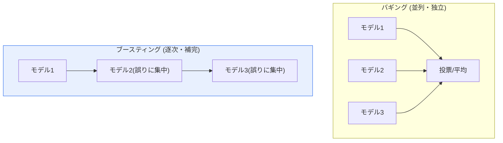

# アンサンブル学習 — バギング(Bagging)とブースティング(Boosting)

## 1. 概要

### A. 定義
> **アンサンブル(Ensemble)学習**は、**複数の弱学習器(weak learner)を戦略的に結合して1つの強い予測モデル(strong learner)を作る手法**であり、単一モデルよりも予測精度と汎化の安定性を同時に高める。代表的な方式が、並列結合のバギング(Bagging)と逐次結合のブースティング(Boosting)である。

アンサンブルが強力である根本原理は、「**複数人の意見を集めれば1人より優れる(集合知, wisdom of crowds)**」という統計的直観にある。1つのモデルは学習データの特定のパターンに過学習(overfitting)したり、特定の方向に偏り(bias)を持ったりする可能性があり、その誤りはそのモデル固有のものである。しかし、異なる方式・データで学習した複数のモデルの予測を総合すれば、各モデルが犯す**互いに相関の低い誤りが平均化の過程で相殺**され、全体の予測の分散が減少する。1人の専門家よりも複数の専門家に尋ねて多数決・平均を取れば、個々の誤判断の影響が薄まるのと同じ理屈である。中核となる前提は、**個々の学習器がランダムな推測より少しでも優れていなければならず(弱学習器)、互いに十分に多様(diversity)でなければならない**という点である。すべてのモデルが同じように間違えるのであれば、いくら集めても意味がないからである。

この「結合」をどう設計するかによって、アンサンブルは大きく2つの方向に分かれる。**バギング**は、複数のモデルを「並列かつ独立に」学習させて結果を平均・投票する方式であり、個々のモデルの**分散(variance)**を減らして過学習を抑制することに焦点を当てる。一方、**ブースティング**は、複数のモデルを「逐次的に連結」し、前のモデルが間違えた部分に後のモデルが集中するよう学習を続ける方式であり、**バイアス(bias)**を減らして精度を引き上げることに焦点を当てる。両者はともに単一モデルの限界を克服するという共通の目的を持つが、減らそうとする誤差の種類(分散対バイアス)と学習構造(並列対逐次)が正反対であるため、相補的(complementary)な関係をなす。

### B. 登場背景と必要性
従来の機械学習において、単一モデルをいくら精巧にチューニングしても性能が限界にぶつかるという経験が繰り返されたことで、「**1つをうまく作るより、複数をうまく混ぜる**」ほうが効果的であるという認識が定着した。1996年のBreimanによるバギング、同年のFreund・SchapireによるAdaBoostが理論的な土台を築き、その後Random Forest(2001)とGradient Boosting系が登場したことで、アンサンブルは構造化(テーブル)データ予測の事実上の標準となった。実際、Kaggleなどのデータコンペティション上位ソリューションの大多数が、XGBoost・LightGBM・CatBoostのようなブースティング系や、複数のモデルを積み重ねるスタッキング(Stacking)を採用している。ディープラーニングが画像・自然言語を席巻する今日においても、金融の信用評価・需要予測・離反予測のように構造化データが中心となる産業現場では、アンサンブルが依然として最高性能を出す場合が多いという点が、その必要性を裏付けている。

### C. 理論的基盤 — バイアス・バリアンスのトレードオフ
アンサンブルを理解する鍵は、予測誤差をバイアス²・分散・ノイズに分解する**バイアス・バリアンスのトレードオフ**である。バイアスの大きいモデルはデータの構造を十分に学習できずに過少適合(underfitting)し、分散の大きいモデルは学習データのノイズまで記憶して過学習する。バギングは、低バイアス・高分散のモデル(深い決定木など)を複数平均して**分散だけを選択的に下げ**、ブースティングは高バイアス・低分散の浅いモデル(切り株, stump)を逐次補完して**バイアスを下げる**。すなわち2つの手法は、同一のトレードオフの異なる軸を攻める相補的なアプローチである。[[decision-tree]]

## 2. 全体構造と動作原理

アンサンブルの全体骨格は、以下のように「個別学習器の生成 → 結合戦略 → 最終予測」の3段階に整理される。どのデータでどの学習器を作り、その予測をどの規則で合わせるかがアンサンブル設計のすべてであるといっても過言ではない。

上の構造図が全体像であるとすれば、バギングとブースティングの学習フローの違いを詳細に見ると次のとおりである。バギングは、元データから復元抽出(ブートストラップ)した互いに異なるサンプルで、モデルを**同時に、互いに参照せず**学習させる。逆にブースティングは、1つのモデルを学習した後にその誤差を測定し、**誤差の大きいサンプルに重みを載せて**次のモデルを学習させる過程を繰り返す。したがって、バギングは並列化が容易で大規模データに有利であり、ブースティングは前の結果に依存するため本質的に逐次的である。

### A. バギング(Bagging)の原理
バギングはBootstrap Aggregatingの略であり、名前のとおり2段階で構成される。第一の**ブートストラップ**は、元データから重複を許して(復元抽出)元データと同じサイズのサンプルを複数セット作ることである。この過程で各サンプルは元データと少しずつ異なる構成となり、平均して約63%の固有データのみが含まれ、残りの37%は除外(Out-Of-Bag, OOB)される。このOOBデータは、別途の検証セットなしに汎化性能を推定する無料の検証手段として活用される。

第二の**集約(Aggregating)**は、各サンプルで学習したモデルの予測を合わせることであり、分類では多数決投票、回帰では算術平均を用いる。核心は、各モデルが異なるサンプルを見ているため誤りの方向がまちまちであり、これを平均すれば**個々のモデルの高い分散が大きく減少する**という点にある。ただし、バギングはバイアスをほとんど減らせないため、個々の学習器にはバイアスの低い(すなわち十分に複雑な)モデルを用いるのが原則である。実務では、深く成長させた決定木が代表的な選択である。

バギングが効果を上げるには、**モデル間の多様性**が鍵となる。ブートストラップだけでは木同士が似通ってしまう可能性があるため、ランダムフォレストは各分岐(split)ごとにランダムに一部の特徴量だけを候補とする「特徴量のランダム性」を追加で導入する。こうすることで、特定の強力な変数1つにすべての木が依存する現象が緩和されて木同士の相関が低くなり、平均による分散減少効果が最大化される。

### B. ブースティング(Boosting)の原理
ブースティングの哲学は、「**弱点を繰り返し補完する**」ことである。最初のモデルを学習した後、そのモデルが間違えたサンプルにより大きな重みを付与し、次のモデルがその難しい事例に集中するようにする。この過程を定められた回数だけ繰り返しながら、各モデルの予測を性能に比例した重みで合算して最終予測を作る。代表的な初期アルゴリズムである**AdaBoost**は、誤分類サンプルの重みを指数的に大きくする方式でこのアイデアを実装した。

現代のブースティングの主流は**勾配ブースティング(Gradient Boosting)**であり、視点を「重みの調整」から「**残差(residual)の学習**」へと転換する。すなわち、次のモデルが直前までの予測誤差(損失関数の負の勾配)を目標として学習し、アンサンブル全体が勾配降下法のように損失を段階的に減らしていく。このとき、各段階の寄与を学習率(learning rate)で縮小して少しずつ加えることが中核的な安定化装置である。学習率を下げるとより多くの木が必要になるが、過学習のリスクが減って汎化が良くなるというトレードオフが生じる。

ブースティングはバイアスを強力に減らして高い精度を出すが、**誤りに執着する構造上、ノイズ(noise)や外れ値(outlier)に敏感**であり、過学習のリスクがバギングより大きい。したがって、木の深さの制限、学習率の調整、早期打ち切り(early stopping)、正則化項の追加など、細心のチューニングが性能を左右する。

### C. アンサンブル結合方式の類型体系
バギング・ブースティングはアンサンブルの2つの代表的な軸であるが、結合方式全体に広げると4つの類型に整理される。これを区別して理解してはじめて、実務で状況に合った方式を選ぶことができる。最も単純な**ボーティング(Voting)**は、異なるアルゴリズムの予測をそのまま投票・平均する方式であり、分類では多数決のハードボーティングと確率を平均するソフトボーティングに分かれる。ソフトボーティングは各モデルの確信度(予測確率)まで反映するため、一般にハードボーティングより性能が良い。

**バギング**は同じアルゴリズムをブートストラップサンプルで並列学習して分散を下げる方式、**ブースティング**は逐次補完によってバイアスを下げる方式であることは前述のとおりである。最後の**スタッキング(Stacking)**は、複数の異種モデルの予測結果そのものを新たな特徴量とし、その上でメタモデルをもう一度学習させる2段階構造であり、個々のモデルの強みを学習によって組み合わせる。4つの類型は、以下のように「何を多様化し、どう結合するか」によって区別される。

| 類型 | 個別学習器 | 多様性の源泉 | 結合規則 | 主な効果 |
|---|---|---|---|---|
| **ボーティング** | 異種(異なるアルゴリズム) | アルゴリズムの違い | 投票・確率平均 | 安定性↑ |
| **バギング** | 同種 | データサンプリング | 投票・平均 | 分散↓ |
| **ブースティング** | 同種 | 誤りの補完(逐次) | 重み付き和 | バイアス↓ |
| **スタッキング** | 異種 | モデル+メタ学習 | メタモデル学習 | 精度の最大化 |

### D. 2つの方式の比較
以下の表はバギング・ブースティングの違いを整理したものであるが、表の各項目は、前述の「分散を減らすかバイアスを減らすか」という根本的な違いから派生した結果であることを覚えておく必要がある。例えば、バギングが過学習に頑健である理由は独立した並列学習が誤りを相殺するからであり、ブースティングが過学習に敏感である理由は逐次的に誤りを追いかけるうちにノイズまで学習し得るからである。

| 区分 | バギング(Bagging) | ブースティング(Boosting) |
|---|---|---|
| **学習方式** | 並列(独立) | 逐次(前の誤りを補完) |
| **データサンプリング** | ブートストラップ(復元抽出) | 誤分類サンプルの重み↑ / 残差学習 |
| **結合** | 投票・平均 | 性能による重み付き和 |
| **主な効果** | 分散↓(過学習の緩和) | バイアス↓(精度↑) |
| **過学習** | 頑健 | 相対的に敏感(チューニングが必要) |
| **並列化** | 容易(独立) | 困難(逐次依存) |
| **代表的アルゴリズム** | ランダムフォレスト | AdaBoost, GBM, XGBoost, LightGBM |

## 3. 代表的アルゴリズムと産業適用事例

**バギングの代表はランダムフォレスト(Random Forest)**である。数百の決定木をブートストラップサンプルと特徴量のランダム選択で学習させ、投票・平均する。個々の木は深く成長して過学習しても、総合すれば安定しており、特徴量重要度(feature importance)を自然に提供するため解釈にも有利である。実際、国内外の金融機関の**クレジットカード不正取引検知(FDS)**や通信事業者の**顧客離反予測**に、ランダムフォレストが幅広く使われている。例えば、数十万件の取引ログから不正か否かを分類する際、単一の木よりもランダムフォレストのほうが誤検知(false positive)を大きく下げる効果が報告されている。

**ブースティングの代表はXGBoost・LightGBM・CatBoost**(Gradient Boosting系)である。XGBoostは2次近似と正則化を導入して精度と速度を同時に確保し、LightGBMはリーフ中心(leaf-wise)の成長とヒストグラムベースの分割によって、大容量データで数倍高速な学習を提供する。この系統は構造化データ予測でしばしば最高性能を示し、例えば**Eコマースの需要・在庫予測**、**製造工程の不良予測**、**広告クリック率(CTR)予測**などで標準のように使われている。一例として、大規模小売業者が需要予測モデルを単純な回帰からLightGBMアンサンブルに切り替えて予測誤差(MAPE)を目に見えて削減し、在庫コストを節減した事例が複数知られている。

3つ目の軸として**スタッキング(Stacking)**がある。ランダムフォレスト・ブースティング・ロジスティック回帰など性格の異なるモデルの予測を入力とし、その上でメタモデル(meta-learner)をもう一度学習させて結合する。異質なモデルを混ぜて個々の強みを集約するため、コンペティションで最後の性能を絞り出す用途によく使われる。ただし、構造が複雑で過学習・運用コストが大きいため、実務への適用は慎重であるべきである。

### A. バギングの分散減少効果 — 簡単な数値的直観
バギングがなぜ効果的なのかは、簡単な統計で直観できる。互いに独立したn個の予測を平均すると、各予測の分散がσ²のとき、平均の分散はσ²/nに減少する。例えば、個々の木の予測分散が1で木が100本あれば、完全に独立という理想的な仮定のもとでは、平均予測の分散は0.01まで下がる。もちろん実際の木同士は完全に独立ではあり得ないため、相関係数ρの分だけ減少効果が制限され、分散はおおよそρσ² + (1−ρ)σ²/nに収束する。この式が教える実務上の教訓は明確である。**木の本数を増やすこと(n↑)よりも、木同士の相関を下げること(ρ↓)のほうが、ある時点からより重要になる**という点であり、ランダムフォレストが特徴量のランダム選択でρを下げる理由はまさにここにある。

### B. 性能評価とハイパーパラメータチューニング
アンサンブルの性能はハイパーパラメータに大きく左右される。バギング系では木の本数(n_estimators)、木の深さ、分岐候補の特徴量数(max_features)が、ブースティング系では木の本数・学習率(learning_rate)・木の深さ・正則化項が中核的な調整変数である。特にブースティングでは、**学習率と木の本数の積がおおよそ一定の性能を出すというトレードオフ**があるため、低い学習率に多数の木 + 早期打ち切りを組み合わせることが、過学習を抑制する定石である。チューニングは交差検証(k-fold)で汎化性能を推定しながらグリッド/ランダムサーチやベイズ最適化で探索し、バギングではOOB誤差を別途の検証セットなしに活用できる。

## 4. 深掘り — 最新動向と予想出題方向

近年、ブースティング系は**カテゴリ変数の自動処理(CatBoostの順序付きターゲットエンコーディング)**、**GPUによる高速学習**、**分散学習**へと発展し、大容量・高次元データに対応している。また、ディープラーニングとの境界では、構造化データ専用のニューラルネットワーク(TabNet、FT-Transformerなど)がアンサンブルに挑戦しているが、多くのベンチマークで依然としてよくチューニングされたGradient Boostingが同等または優位であるとの結果が報告されており、「構造化データの強者」としての地位は堅固である。一方、**AutoML**プラットフォームは内部でアンサンブル・スタッキングを自動構成して人によるチューニングの負担を減らしており、説明可能性への要求が高まるにつれ、**SHAP(SHapley Additive exPlanations)**のような事後説明手法をアンサンブルに組み合わせることが事実上の標準的な慣行となった。

技術士の観点では、このテーマは「**バギングとブースティングを比較説明し、それぞれの適用状況を論ぜよ**」「**バイアス・バリアンスの観点からアンサンブルの効果を説明せよ**」「**ランダムフォレストとXGBoostの原理の違いと実務上の選択基準**」といった形で出題されやすい。答案では必ず、(1) バイアス・バリアンスのトレードオフという理論的根拠、(2) 並列・独立対逐次・補完という構造的な違い、(3) 過学習・解釈性・コストという実務上のトレードオフ、(4) 具体的な産業適用事例を併せて織り込んで展開することが、高得点の構成である。

## 5. 考慮事項および示唆

1. **問題の特性に合った選択戦略**が必要である。データにノイズが多く過学習が懸念され、安定性が重要であればバギング(ランダムフォレスト)が、精度を極限まで引き上げる必要がありチューニングの余力があればブースティング(XGBoost・LightGBM)が有利である。2つのモデルの予測を再び混ぜるスタッキングは、最後の性能向上手段として検討する。
2. **構造化データの強者という位置付けを活用**する。ディープラーニングが画像・音声・自然言語を席巻する流れとは別に、テーブル形式のビジネスデータでは、アンサンブルが最高性能・高速な学習・少ないデータ要求量という実用的な利点を持つため、無条件にディープラーニングを選ぶよりもアンサンブルを優先的に検討するのが合理的である。
3. **解釈性と計算コストのトレードオフを管理**する。アンサンブルは正確であるが、単一モデルより内部が不透明で、学習・推論のコストが大きい。規制産業(金融・医療)ではSHAP・部分依存プロット(PDP)などの説明手法を併用して根拠を示し、リアルタイムサービスではモデルの軽量化・木の本数制限によって遅延を管理しなければならない。
4. **過学習・データ品質の管理が成否を分ける**。特にブースティングは外れ値とラベルノイズに敏感であるため、交差検証・早期打ち切り・正則化で過学習を統制し、学習データの品質(ラベルの正確性・不均衡への対処)をまず確保しなければならない。どれほど強力なアンサンブルも、低品質データの限界を超えることはできない。
5. **運用・再現性の観点からのMLOps連携**が重要である。乱数シード・ハイパーパラメータ・データバージョンによって結果が変わるため、モデルのバージョン管理・実験追跡・再学習パイプラインを整えてはじめて、予測性能を継続的に維持できる。

## 参考資料
- scikit-learn User Guide, "Ensemble methods": https://scikit-learn.org/stable/modules/ensemble.html
- XGBoost Documentation, "Introduction to Boosted Trees": https://xgboost.readthedocs.io/en/stable/tutorials/model.html
- LightGBM Documentation, "Features": https://lightgbm.readthedocs.io/en/stable/Features.html

---

> **一言まとめ**: アンサンブルは*複数の弱学習器を結合して強いモデルを作る手法*であり、バギング(並列・独立・分散↓・ランダムフォレスト)とブースティング(逐次・補完・バイアス↓・XGBoost)がバイアス・バリアンスのトレードオフの相補的な2つの軸を攻める。問題の特性・解釈性・コストを考慮して選択すべきであり、構造化データにおいて特に強力である。
