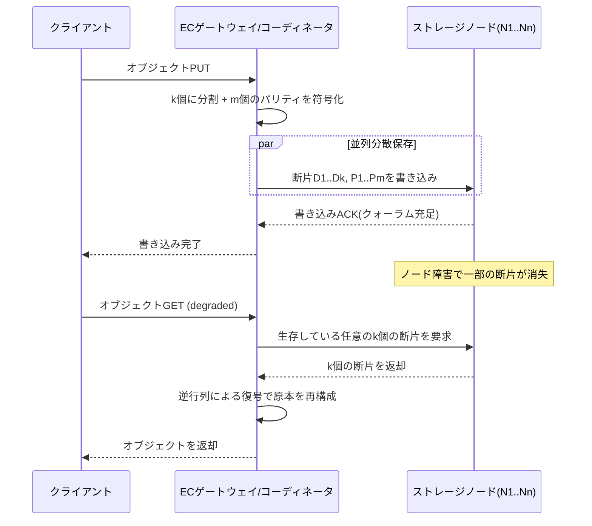

# 消失訂正符号(Erasure Coding)と分散ストレージのデータ耐久性

## 1. 概要

### A. 定義
> 消失訂正符号(Erasure Coding, EC)とは、原本データを**k個のデータ断片(fragment)**に分割したうえで、数学的な符号化によって**m個の冗長(パリティ)断片**を追加生成し、計n(=k+m)個の断片として分散保存し、**任意のk個の断片さえ残っていれば原本を完全に復元**できるようにする、誤り訂正符号(error-correcting code)ベースのデータ保護手法である。

消失訂正符号の本質は、「通信路でデータが**消失(erasure、どの位置が失われたかは分かるが値は分からない損失)**する状況」をストレージシステムに移植した点にある。通信理論で発展したReed–Solomon符号などがそのまま記憶媒体の障害モデルに適用されるが、ディスク・ノードの障害は「その断片が失われた」という事実を正確に把握できるため、位置が分からない一般的な誤り訂正よりもはるかに効率的に復旧できる。すなわちECは、**少ない容量オーバーヘッドで高い耐久性(durability)**を確保する、情報理論的に最適に近い冗長配置方式である。

### B. 登場の背景および必要性
クラウド・オブジェクトストレージの時代にデータの総量はペタバイトを超えてエクサバイトへと膨張したが、個々のディスクの信頼性はそれに比例して向上したわけではない。従来、分散ストレージは**3重レプリケーション(3-replication)**で耐久性を確保してきた。3重レプリケーションは実装が単純で読み出しの局所性も良いが、**ストレージオーバーヘッドが200%(原本1に対して複製2)**と非常に大きい。数十PB規模では、この200%のオーバーヘッドはそのまま膨大なディスク・電力・ラックスペース(rack space)のコストを意味する。

消失訂正符号は、同等またはそれ以上の耐久性を**はるかに少ない冗長で**実現する。例えば広く使われるRS(10,4)構成は、データ10断片+パリティ4断片=14断片であり、**ストレージオーバーヘッドがわずか40%**でありながら任意の4断片の同時喪失に耐える。3重レプリケーションが(同一データ基準で)最大2つの複製の喪失に耐えるのと比べると、ECはより少ない容量でより多くの同時障害を許容する。大容量・低頻度アクセス(cold/warm)データが急増するなかで、「コスト当たりの耐久性」を最大化しなければならないという要求が、EC普及の根本的な原動力である。実際にMetaのf4、Microsoft Azure、AWS S3、Google Colossus、Ceph、HDFS-ECはいずれも大規模ストレージ層でECを標準として採用している。

根本的に、ECの台頭は**ストレージ経済学(storage economics)**の問題である。数EB規模では、ストレージオーバーヘッドの1ポイントの差が数千台のディスクと、それに付随する電力・冷却・ラックスペース・運用人員の差に換算される。3重レプリケーションの200%のオーバーヘッドをECの40~50%に下げれば、同じデータ保護に必要なハードウェアが3分の1以下に減る計算となり、これはハイパースケール事業者にとって年間数百億ウォン規模の総所有コスト(TCO)削減につながる。同時にデータの分布は、「作られるがほとんど再読されない」コールドデータが大半を占めるように変化したが、このような低頻度データほど遅延のペナルティは許容でき、ストレージコスト削減の効果は最大化されるため、ECの適用余地が広い。要するにECは、通信理論の誤り訂正技術を、急増するデータを経済的に守らなければならないストレージの要求に合わせて再解釈した成果である。

### C. 主要な特徴
ECの性格は四つに要約される。第一に**空間効率性**である。MDS符号は冗長量に対する耐久性の理論的上限を達成し、同じ耐久性をレプリケーションよりはるかに少ない記憶容量で得る。第二に**高い耐久性**である。mを調整することで、任意のm個の同時障害まで耐えるよう耐久性をきめ細かく設計できる。第三に**非対称なコスト**である。通常の読み出しは安価だが、復旧・縮退読み出し・部分更新は高価である。第四に**配置依存性**である。断片を十分に多くの障害ドメインに分散させて初めて、理論上の耐久性が実際に保証される。これらの特徴は、後述する「いつECを使い、いつレプリケーションを使うか」の判断根拠となる。

## 2. 消失訂正符号の動作原理とアーキテクチャ

### A. 符号化・復号の基本原理
ECの数学的基盤は**ガロア体(GF(2^w))上の線形代数**である。k個のデータ断片をベクトルDとみなし、(k+m)×kの**生成行列(generator matrix)**Gを掛けて、n個の符号化断片C = G·Dを作る。Reed–Solomon符号では、Gの上部k行を単位行列(原本をそのまま保存する組織符号、systematic code)とし、下部m行をヴァンデルモンド(Vandermonde)行列またはコーシー(Cauchy)行列で構成して、**どのk行を選んでもその部分行列が正則(invertible)**になるよう設計する。この性質により、任意のk個の断片があれば、対応する部分行列の逆行列を掛けて原本Dを一意に復元できる。

ここで鍵となるのが**MDS(Maximum Distance Separable)性**である。MDS符号は「n個のうちどのm個が失われても残りのk個で復元可能」という、冗長量に対する耐久性の理論的上限を達成する。Reed–Solomonは代表的なMDS符号であり、これがECがレプリケーションより空間効率に優れる根本的な理由である。復号時には、生き残った断片に対応する行だけを選んで逆行列演算を行うため、消失位置が分かるストレージ環境では演算量が大幅に減る。

最も単純な形の直観は、RAIDでも使われるXORパリティである。m=1の特殊なECは、データD1、D2、D3に対してP = D1 ⊕ D2 ⊕ D3を一つだけ置き、任意の一断片が失われても残りとPのXORで復元する。しかしm=1では同時に2つの喪失に耐えられない。Reed–Solomonはこの考え方をガロア体上の多項式・行列演算によって一般化し、**互いに線形独立なm個のパリティ**を作ることで、任意のm個の同時喪失まで耐えられるよう拡張したものである。すなわち、XORパリティはECの最も薄い特殊例であり、RSはそれを任意のmへと引き上げた一般解と理解すればよい。この一般性により、ストレージシステムは要求される耐久性に合わせてmを自由に調整できる。

符号化された断片は、必ず**互いに異なる障害ドメイン(failure domain)**、すなわちノード、ラック、電源系統、アベイラビリティゾーン(AZ)に分散配置しなければならない。一つのラックに複数の断片が集中すると、ラック単位の停電時にm個を超える喪失が発生して復旧不能になるためである。したがってECの配置ポリシーでは、符号パラメータ(k, m)と同じくらい**トポロジーを考慮した(topology-aware)配置**が重要である。

EC システムの主な構成要素を整理すると次のとおりである。
- **符号化/復号エンジン**: 生成行列・GF演算を行う中核モジュール。ISA-LなどのSIMDライブラリやDPU/GPUへのオフロードで高速化する。
- **ストライプ管理部**: オブジェクトをストライプ・断片に分割し、マッピングのメタデータを管理する。
- **配置(placement)ポリシーエンジン**: 断片を障害ドメインが重ならないよう分散配置するルールを執行する。
- **再構築管理部**: 断片の喪失を検知して再構築をスケジューリングし、帯域をスロットリングする。
- **整合性検証器(scrubber)**: 断片のチェックサムを定期的に検証し、サイレントな破損を早期に発見・訂正する。

### B. システムアーキテクチャとI/O経路
分散ストレージにおいて、ECは書き込み経路と読み出し経路が非対称である。書き込み時には、クライアントまたはゲートウェイがデータをストライプ単位でまとめて符号化し、n個のノードに並列転送する。通常の読み出し(degradedでない場合)では、組織符号の特性上、データ断片k個をそのまま読めばよいため復号演算が不要である。これはEC性能設計の重要な最適化ポイントである。一方、断片が失われた**縮退(degraded)読み出し**や**再構築(reconstruction)**の際には、k個の断片をネットワーク越しに取り寄せて復号しなければならないため、ネットワーク・CPU負荷が急増する。

この構造で最もコストが大きいのは**再構築トラフィック**である。RS(10,4)で断片一つを復旧するには、他の10ノードから断片を読み込まなければならないため、復旧するデータ量の10倍に達するネットワーク・ディスクI/Oが発生する。大規模クラスタではディスク交換が日常的であるため、この再構築帯域が常時のバックグラウンド負荷となり、通常のサービスI/Oと競合する。この問題を緩和しようとするのが、後述するLRC(Local Reconstruction Codes)である。

もう一つ留意すべきは**部分更新(small write)のコスト**である。レプリケーション方式では特定のブロックだけを修正して各複製に反映すればよいが、ECではストライプ内のデータ断片が一つ変わるだけでも、そのストライプのすべてのパリティを再計算しなければならない。この「read-modify-write」の負担のため、ECは**不変(immutable)・追記専用(append-only)オブジェクト**や大容量の逐次書き込みに適しており、頻繁な小規模更新が発生するトランザクション型ワークロードには不向きである。この性質が、ECをオブジェクトストレージ・アーカイブ層に配置し、ブロック・ファイルのホットデータにはレプリケーションを用いる階層化の技術的根拠となる。

### C. 整合性検証とサイレント破損への対応
ECの耐久性の仮定は、「失われた断片の位置を正確に知っている」という前提の上に成り立つ。ところがディスクは、完全に故障しなくてもビットがひそかに反転する**サイレントデータ破損(silent data corruption)**を起こしうる。この場合、システムは破損の事実そのものを認識できないまま誤った断片で復号し、汚染された原本を返すおそれがある。そのため実運用のECシステムは、各断片に**チェックサム(CRC/ハッシュ)**を併せて保存し、バックグラウンドで定期的に断片を読み出して検証する**スクラビング(scrubbing)**を行う。検証で不一致が見つかった断片は消失とみなしてECで再生成することで、位置の分からない破損を位置の分かる消失問題へと転換する。すなわちECの効率は、チェックサム・スクラビングと組み合わさって初めて実質的な耐久性として完成する。

## 3. 種類とパラメータの選択

消失訂正符号は、符号の系統と(k, m)パラメータ、そして復旧効率の改善有無によって種類が分かれる。最も広く使われるのはReed–Solomon系であり、再構築コストを減らすための変形としてLRCと再生符号(Regenerating Codes)が登場した。パラメータの選択とは、**耐久性・ストレージ効率・復旧コストの三者間のトレードオフ**をどこに合わせるかという問題である。

| 区分 | 代表的な方式 | ストレージオーバーヘッド | 耐障害数 | 再構築コスト | 適用例 |
|---|---|---|---|---|---|
| レプリケーション(比較対象) | 3-replication | 200% | 複製2つ | 低い(1:1コピー) | HDFS既定、ホットデータ |
| RS(6,3) | Reed–Solomon | 50% | 3個 | 高い(6断片を読み出し) | Cephの基本例 |
| RS(10,4) | Reed–Solomon | 40% | 4個 | 高い(10断片を読み出し) | Facebook f4、HDFS-EC |
| LRC(12,2,2) | Local Reconstruction | 約50% | 多層 | 中程度(ローカルグループのみ) | Azure Storage |
| MSR/MBR | Regenerating Code | 40~50% | m個 | 低い(部分断片のみ) | 研究・次世代ストレージ |

RS(k,m)では、**mを大きくすると耐久性は急激に向上するが**ストレージオーバーヘッドも併せて増え、**kを大きくするとストレージ効率は向上するが**再構築時に読むべき断片数が増えて復旧負担が大きくなる。例えばRS(10,4)は40%のオーバーヘッドで最大4重障害に耐え、3重レプリケーション(200%のオーバーヘッド、実質2重障害まで許容)よりも空間・耐久性の両面で優れる。ただし断片が14ノードに散らばるため、再構築や小規模なランダム読み出しには不利である。このため、**アクセス頻度の高いホットデータはレプリケーション、アクセスがまれなウォーム/コールドデータはEC**で階層化するハイブリッドポリシーが実務の標準となった。

LRCは、この再構築コストの問題に正面から取り組む。全断片をいくつかの**ローカルグループ**に分け、グループごとにローカルパリティを置くことで、単一断片の喪失時には全体ではなく**同じグループの少数の断片のみ**を読んで復旧する。AzureのLRC(12,2,2)は、12個のデータを6+6の二つのグループに分け、各グループにローカルパリティ1個、全体にグローバルパリティ2個を置く。その結果、単一ノード障害(現実に最も頻繁なケース)の復旧コストを大幅に下げつつ、ストレージオーバーヘッドはレプリケーションより低く維持する。Microsoftはこの方式により、純粋なRSと比べて再構築I/Oを半分程度に削減したと報告している。

パラメータ選択を定量的に把握すると次のようになる。ストレージオーバーヘッドは(k+m)/k − 1で計算されるため、RS(6,3)は(6+3)/6 − 1 = 50%、RS(10,4)は(10+4)/10 − 1 = 40%、RS(12,4)は33%となる。すなわち**kが大きくなるほどパリティが相対的に希釈されてオーバーヘッドは減るが**、代わりにストライプ幅が広がり、再構築時に読む断片数と、断片を配置する障害ドメイン数の要件が共に増える。例えばRS(10,4)をラック単位で安全に配置するには少なくとも14個の異なる障害ドメインが必要であり、小規模クラスタではこの要件自体が制約となる。逆に小さなクラスタでは、RS(4,2)・RS(6,2)のように幅の狭い符号が現実的である。このように符号パラメータは、理論上の効率だけでなく**クラスタの規模とトポロジー**に依存する実務的な決定である。

## 4. レプリケーションとの比較および実務適用事例

消失訂正符号とレプリケーションの選択は、単純に「どちらが優れているか」ではなく、**ワークロード特性との整合性**の問題である。レプリケーションは各複製が完全なデータであるため読み出しの局所性に優れ、断片を集めて復号する必要がないため遅延が小さく、再構築も単純コピーであるため高速である。一方ECは、ストレージ効率が圧倒的に良いが、小規模・ランダム読み出しの遅延と再構築帯域の面で不利である。したがって違いが生じる根本的な理由は、**「冗長を完全な複製として持つか、数学的に圧縮されたパリティとして持つか」**という設計思想の違いであり、それはそのままコストと性能の交換として現れる。

この違いは、オブジェクトストレージの実際の配置で顕著になる。オブジェクトストレージはデータをファイルシステムのブロック単位ではなく不変のオブジェクト単位で扱うため、各オブジェクトを丸ごとストライプとして符号化し、断片を複数のノード・AZに分散させやすく、ECとの相性が良い。オブジェクトは一度書かれるとほとんど変わらないため部分更新の負担がほぼなく、PUT/GET中心のアクセスパターンであるため、符号化・復号をリクエストの境界で自然に行える。逆にブロックストレージ(仮想マシンのディスク、データベースボリューム)はランダムな小規模更新が多く、ECのread-modify-writeのコストが大きくなるため、ここではレプリケーションや幅の狭いECが好まれる。このように「何をECで保護するか」は、ストレージのアクセス方式(オブジェクト/ファイル/ブロック)と密接に結びついている。

具体例として、**Facebook(Meta)のf4**は、アクセス頻度の低いBLOB(写真・動画)をRS(10,4)で保存し、従来の3重レプリケーションに比べてストレージ容量を約半分以下に削減した。**AWS S3**は、標準ストレージクラスでオブジェクトをECで分散して最低3つのAZに配置し、「年間99.999999999%(11 nines)」の耐久性をうたっているが、この極端な耐久性はECと複数AZ配置の組み合わせによってのみ経済的に達成可能である。**Ceph**は、プール(pool)単位でreplicated/erasureのプロファイルを選択させ、運用者がデータの等級ごとにポリシーを指定する。**HDFS-EC(3.0以降)**は、コールドデータのディレクトリにRS(6,3)・RS(10,4)のポリシーを適用し、Hadoopクラスタのストレージコストを大幅に削減した。

数値で見るとその含意は明らかである。1PBの原本を3重レプリケーションで保存すれば実際に3PBのディスクが必要だが、RS(10,4)で保存すれば1.4PBで足りる。同一データに対して**ディスク・電力・ラックスペースのコストが半分以下**に減るのである。ただしこの削減は「遅延に敏感で高頻度にアクセスされるデータには不向き」という代償を伴うため、実務ではデータライフサイクルポリシー(lifecycle policy)によって、時間の経過したデータをレプリケーションからECへ自動的に移行するのが定石である。

耐久性の観点からも、両方式は定量的に比較される。データの耐久性は一般に「9がいくつ並ぶか(nines)」で表現されるが、これは個々の断片の年間故障率(AFR)、再構築所要時間(MTTR)、そして耐えられる同時喪失数mによって左右される。**再構築が速いほど**(脆弱な期間が短いほど)、**mが大きいほど**、耐久性は指数関数的に向上する。このためクラウド事業者は、ECのmを増やして複数AZに断片を配置することで11 nines級の耐久性をうたう一方、再構築速度を上げるためにLRC・並列再構築・スロットリングを精緻にチューニングしている。逆に、再構築の遅い大容量ディスク環境でmが小さいと、再構築中に2次・3次障害が重なってデータ喪失に至る、いわゆる**相関障害(correlated failure)**のリスクが高まる。したがってEC設計は、「mをいくつにするか」だけでなく「再構築をどれだけ速く終えられるか」を併せて考慮しなければならない問題である。

まとめると、両方式の選択は次の基準で判断できる。
- **レプリケーションが有利な場合**: 低遅延・高IOPSが必要なホットデータ、頻繁な小規模更新(トランザクション・メタデータ)、小さなクラスタ(障害ドメイン不足)、高速で単純な再構築が重要なワークロード。
- **ECが有利な場合**: 大容量・不変・逐次アクセスのウォーム/コールドデータ(バックアップ・アーカイブ・メディア・ログ)、ストレージコスト削減が最優先の場合、障害ドメインが十分な大規模クラスタ、複数AZ/リージョンの耐久性が求められる場合。
- **ハイブリッドが正解となる場合**: データの等級が時間とともに変化する大半の実務。ライフサイクルポリシーにより初期はレプリケーション、一定期間後にECへ自動移行する。

## 5. 深掘り: 再構築コストの問題と次世代符号の動向

ECの研究・実務の最前線は、「MDSのストレージ効率は維持しつつ、**再構築コストをいかに減らすか**」に集中している。純粋なReed–Solomonの最大の弱点は、断片一つを復旧するためにk個の断片すべてをネットワーク上で移動させなければならない点であり、大規模クラスタでディスク交換が常時発生する現実において、この**復旧トラフィック(repair traffic)**がクラスタネットワークのかなりの割合を占める。

この問題が特に深刻化した背景には、ディスクの大容量化がある。単一ディスクの容量が数十TBに拡大するにつれ、ディスク一台をECで再構築するだけで数時間から一日以上かかることもある。再構築に時間がかかるほど、その間に他の断片まで追加で失う確率が累積して耐久性が実質的に低下するため、「再構築帯域をいかに減らし、いかに並列化するか」がそのまま耐久性の問題に直結する。これを解決するアプローチを要約すると次のとおりである。
- **LRC(Local Reconstruction Codes)**: ローカルパリティを追加し、単一障害の復旧に必要な断片数を局所化する。ストレージオーバーヘッドをやや増やす代わりに復旧帯域を大幅に削減し、Azure Storageが代表的な採用事例である。
- **再生符号(Regenerating Codes, MSR/MBR)**: 保存量と復旧帯域の間の最適なトレードオフ曲線を情報理論的に解明し、復旧時に各ノードが断片全体ではなく**部分的な情報のみ**を転送するよう設計して、復旧トラフィックを最小化する。
- **Clay/Piggybackなどの実用型符号**: MSRの理論的利点を、実装の複雑さを下げて実システム(例: Cephのclayプラグイン)に適用しようとする系統である。

これらのうちLRCはすでに商用で広く使われており、再生符号系は研究・特殊システムが中心であるものの、ハイパースケールストレージの有力な方向性とされている。

総合すると、近年のECの進化の軸は「MDSのストレージ効率を守りながら、再構築・演算コストを下げること」に収束している。アルゴリズム面のLRC・再生符号、実行面のハードウェアオフロード、配置面の地理分散・階層的符号が互いにかみ合いながら発展しており、今後ECはより広いデータ層へと拡大していくとみられる。

一方で**ハードウェアによる高速化**も重要な動向である。GF乗算はCPU負荷が大きいため、Intel ISA-L(Intelligent Storage Acceleration Library)がSIMD(SSE/AVX)命令で符号化を高速化しており、最近では**DPU/SmartNIC**やGPUにEC演算をオフロードしてCPUを解放する試みが増えている。また、地理的に分散した**マルチリージョンEC(geo-distributed EC)**は、リージョン単位の障害にまで耐える一方で広域ネットワークの遅延・コストを考慮しなければならないため、LRCと組み合わせた階層的符号設計が活発に研究されている。ただし、こうした最新手法の成熟度・標準化の水準は製品ごとのばらつきが大きいため、実際の導入時にはベンダー実装の具体的な仕様と検証結果を確認する慎重さが必要である。

エコシステムの面では、ECはオープンソースと商用ストレージ全般にすでに組み込まれている。Cephは`jerasure`・`isa`・`clay`など複数のECプラグインをサポートし、運用者がアルゴリズムと(k, m)をプロファイルで指定でき、MinIOはオブジェクトストレージの既定としてECを適用しており、小規模な導入でも使われている。HDFSは3.0からECポリシーをディレクトリ単位で指定できるようにし、商用オブジェクトストレージ・バックアップアプライアンスの大半が内部的にRSまたはその変形を採用している。標準化された単一の「ECプロトコル」があるわけではなく、符号の系統・断片サイズ・配置ポリシーはシステムごとに異なるため、異なるストレージ間でEC断片の直接的な互換性を期待するのは難しい。したがって、マイグレーションやマルチベンダー設計では、EC断片のレベルではなく**オブジェクト/ファイルのレベルでの相互運用**を前提にアプローチするのが安全である。

## 6. 考慮事項および示唆(技術士の観点)

- **ワークロードに基づく階層化戦略**: ECは万能ではない。遅延に敏感で高頻度のランダムアクセス(トランザクションDB、ホットキャッシュ)にはレプリケーションが、大容量・低頻度の逐次アクセス(バックアップ、メディアアーカイブ、ログ)にはECが適している。データライフサイクルポリシーによって**ホット(レプリケーション) → ウォーム/コールド(EC)**の自動移行を設計することが、コストと性能を同時に満たす定石である。
- **パラメータ・配置のトレードオフ管理**: (k, m)の選択は、耐久性・ストレージ効率・再構築コストの三者のバランスである。mを大きくすると耐久性↑・容量効率↓、kを大きくすると容量効率↑・復旧負担↑となる。必ず**障害ドメイン(ノード・ラック・AZ)をまたぐ分散配置**と併せて設計しなければならず、断片の偏りはECの耐久性の仮定を崩す。
- **再構築ストーム(rebuild storm)への備え**: 大容量ディスク(数十TB)の時代には、単一ディスクの再構築にも長時間と帯域を要し、その間に2次故障の確率が高まる。LRCの採用、再構築帯域のスロットリング、優先度キュー、バックグラウンドのスクラビング(scrubbing)によって、**サイレントな破損(silent data corruption)**と再構築負荷を併せて管理しなければならない。
- **性能・コストの定量評価**: 導入前には「ストレージオーバーヘッドの削減額」だけでなく、**degraded読み出しの遅延、再構築トラフィックが通常I/Oに与える影響、CPU/ネットワークのコスト**を併せて定量化しなければならない。ISA-L・DPUオフロードなどの高速化手段の適用有無が、実効コストを左右する。
- **アクセス方式との整合性確認**: オブジェクト・不変・逐次データにはECがよく合うが、ブロック・ファイルベースのランダムな小規模更新ワークロードには、read-modify-writeのコストのため不向きである。対象データのアクセスパターン(オブジェクト/ファイル/ブロック、更新頻度)を先に分析して保護方式を決定すべきであり、符号パラメータはクラスタの障害ドメイン数という物理的制約を超えてはならない。
- **整合性・ガバナンスの並行**: ECの耐久性の仮定は「喪失位置が分かる」という前提に依拠するため、チェックサム・スクラビングによってサイレントな破損を消失問題へと転換する仕組みを必ず併用しなければならない。また、複数AZ/リージョンへの配置時には、データ主権・規制遵守(データ所在地)の要件と断片の分散ポリシーが衝突しないよう、ガバナンスの観点から併せて設計しなければならない。
- **関連技術と展望**: ECは、オブジェクトストレージ、データレイク/レイクハウス、バックアップ・アーカイブ、コールドクラウド層の基盤技術であり、今後**LRC・再生符号・地理分散EC**によって再構築効率が改善され、**ハードウェアオフロード**が普及すれば、適用範囲はさらに拡大する見通しである。技術士は単なる手法の知識を超えて、組織のデータ等級・SLA・コスト目標に合わせた**ストレージ保護ポリシーの総合的な設計者**として、ECとレプリケーションを組み合わせられなければならない。

## 参考資料
- Reed, I. S., & Solomon, G., "Polynomial Codes over Certain Finite Fields", 1960. — https://en.wikipedia.org/wiki/Reed%E2%80%93Solomon_error_correction
- Huang, C. et al., "Erasure Coding in Windows Azure Storage (LRC)", USENIX ATC 2012. — https://www.usenix.org/conference/atc12/technical-sessions/presentation/huang
- Muralidhar, S. et al., "f4: Facebook's Warm BLOB Storage System", OSDI 2014. — https://www.usenix.org/conference/osdi14/technical-sessions/presentation/muralidhar
- Apache Hadoop, "HDFS Erasure Coding". — https://hadoop.apache.org/docs/current/hadoop-project-dist/hadoop-hdfs/HDFSErasureCoding.html
- Ceph Documentation, "Erasure code". — https://docs.ceph.com/en/latest/rados/operations/erasure-code/

---
> **一言まとめ**: 消失訂正符号は、原本をk個のデータ+m個のパリティ(計n=k+m)の断片に符号化し、任意のk個のみで復元するMDS誤り訂正手法であり、3重レプリケーションに比べてはるかに少ないストレージオーバーヘッドで高い耐久性を提供するが、再構築・degraded読み出しのコストという代償があるため、ワークロード別の階層化やLRCなどの復旧効率改善手法で補完しなければならない。
