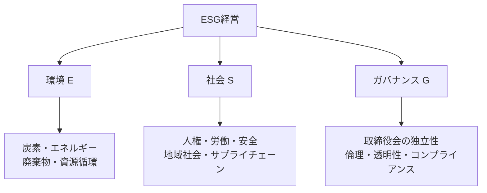

# ESG経営(Environment, Social, Governance)

## 1. 概要

### A. 定義および目標
> **環境(E)・社会(S)・ガバナンス(G)** という非財務的要素を経営の意思決定に統合し、**持続可能性と長期的な企業価値**を併せて追求する経営パラダイム。

ESGの核心は「**財務諸表に表れなかった非財務リスクを経営の中心に取り込む**」ことにある。かつて財務成果のみで企業を評価していた方式は、炭素規制、取引先の人権問題、ガバナンスの不透明性といったリスクを見落としており、こうしたリスクが実際に訴訟・不買・投資引き揚げにつながって企業価値を毀損した。ESGはこれらの非財務要素を測定・管理の対象とし、短期的な利益ではなく**持続可能な成長とステークホルダーの信頼**を目標とする。

### B. 登場背景および必要性
気候危機の現実化と社会的責任への要求の拡大が背景である。特に**ESG情報の開示が義務化**(TCFD、国際的なサステナビリティ開示基準ISSBなど)され、グローバルな資産運用会社・年金基金が投資判断にESG評価を反映するようになったことで、ESGは「善良な企業の選択」ではなく**資金調達と存続がかかった必須課題**となった。すなわち規制・資本市場・消費者という三方向からの圧力が同時に作用し、企業がESGを無視することは困難になったのである。

## 2. ESGの構成および主要指標

三つの軸はそれぞれ異なるステークホルダーとリスクを扱う。**環境(E)** は気候・資源に関連し、温室効果ガス排出量を中核指標とするが、ここではScope 1(直接排出)・2(購入電力)・3(サプライチェーン全体)の区分が重要である。Scope 3は最も統制が難しい一方で排出量の大部分を占める場合が多く、真の削減にはサプライチェーンとの協力が求められる。**社会(S)** は従業員・取引先・地域社会など人との関係であり、労働安全・人権・多様性・サプライチェーンのデューデリジェンスが指標となる。**ガバナンス(G)** はこれらすべてが適切に機能するための意思決定体制であり、取締役会の独立性・倫理経営・開示の透明性を見る。E・Sがいかに優れていてもGが脆弱であれば持続しないため、Gは残りを支える土台とみなされる。測定にはGRI・SASB・TCFD・ISSBといった国際基準と、韓国国内の**K-ESGガイドライン**が用いられる。

| 領域 | 主要指標 |
|---|---|
| 環境(E) | 温室効果ガス(Scope 1・2・3)、再生可能エネルギー比率、廃棄物・用水 |
| 社会(S) | 労働安全、人権・多様性、サプライチェーンのデューデリジェンス、地域社会 |
| ガバナンス(G) | 取締役会の独立性、倫理経営、開示の透明性、コンプライアンス |
| 基準 | GRI、SASB、TCFD、ISSB、K-ESGガイドライン |

## 3. ESGを支援するIT

ESGは「**測定できなければ管理できず、管理できなければ開示できない**」という命題の上に成り立っており、データを扱うITが不可欠な基盤となる。**IoT・センサー**は工場・設備のエネルギー使用量と炭素排出をリアルタイムに計測し、推定ではなく実測データを提供する。**ビッグデータ・AI**はこのデータを用いて排出量を予測・最適化し、ESGリスク(取引先の問題など)を早期に検知する。**ブロックチェーン**は改ざんが困難という特性を活かし、サプライチェーンの原産地追跡と排出権取引の透明性を担保する。**クラウド・EMS(エネルギー管理システム)** は資源効率を高めてグリーンITを実現し、**ESG開示プラットフォーム**は散在するデータを収集・集計・レポーティングして開示作業を自動化する。すなわちITはESGデータの収集→分析→開示という全ライフサイクルを貫いている。

| IT技術 | ESGへの寄与 |
|---|---|
| IoT・センサー | エネルギー・炭素排出のリアルタイム実測 |
| ビッグデータ・AI | 排出量の予測・最適化、リスク分析 |
| ブロックチェーン | サプライチェーン追跡・排出権取引の透明性 |
| クラウド・EMS | エネルギー管理、グリーンIT |
| ESG開示プラットフォーム | データ収集・集計・レポーティングの自動化 |

## 4. 推進時の考慮事項

ESG推進における最大の落とし穴は**グリーンウォッシング**、すなわち実際よりも環境・社会的成果を誇張することである。これは開示データの信頼性の問題に直結するため、測定・検証(第三者認証)体制を整え、データに根拠を持たせなければならない。また、ISSBなど強化される開示基準を遵守するには財務データ並みの厳密さが求められ、これを支える**ESG専任組織と取締役会による監督**というガバナンスが必要である。特にScope 3のように取引先にまたがる指標は自社の努力だけでは達成できないため、**サプライチェーン全体のESGデューデリジェンス・管理**が鍵となる。

| 区分 | 内容 |
|---|---|
| データ信頼性 | 測定・第三者検証によるグリーンウォッシング防止 |
| 開示対応 | ISSB・サステナビリティ開示基準の遵守 |
| ガバナンス | ESG専任組織・取締役会による監督 |
| サプライチェーン | 取引先のESGデューデリジェンス・Scope 3管理 |

## 5. 考慮事項および示唆
- **コストではなく投資**: ESGは規制・評判リスクを低減する防御であると同時に、環境配慮型の新製品やグリーンファイナンスといった新たな機会を開く攻めでもある。技術士の観点からは、リスク管理と機会創出を併せて見るバランスが必要である。
- **データガバナンスが勝負所**: 開示が義務化・定量化されるほど、最終的には「信頼できるデータをいかに体系的に確保するか」が競争力を分ける。IT部門の役割は支援を超えて中核へと移行する。
- **基準の収斂**: 乱立していたESG基準がISSBを軸に収斂しつつあるため、早期に国際基準に合わせたデータ体制を構築した企業が、規制対応・グローバル資本の誘致において先行する。

---

> **一言まとめ**: ESG経営は*環境・社会・ガバナンスの非財務リスクを経営に統合*する持続可能経営であり、「測定してこそ管理・開示が可能」であるため、IoT・AI・ブロックチェーン・開示プラットフォームがデータの全ライフサイクルを支え、データの信頼性(グリーンウォッシング防止)が成否を分ける。
