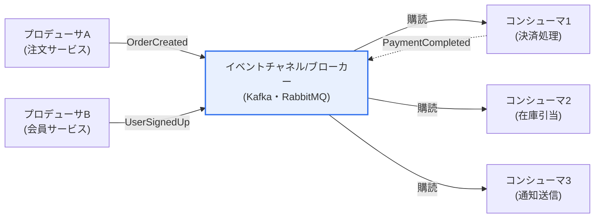
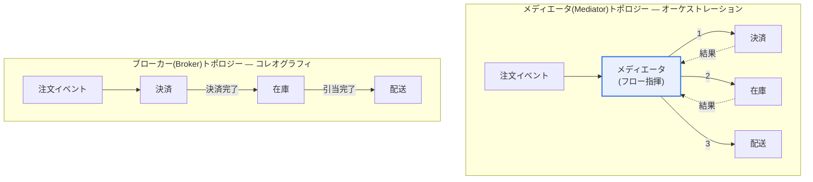

# イベント駆動アーキテクチャ(EDA)のトポロジー

## 1. 概要

### A. 定義

> **イベント駆動アーキテクチャ(Event Driven Architecture, EDA)** とは、システムの状態変化を表す「イベント(event)」の発生・伝達・処理を中心にコンポーネントを構成するアーキテクチャスタイルである。コンポーネントはイベントを発行(Publish)・購読(Subscribe)し、**疎結合(loose coupling)** の状態で非同期(asynchronous)に協調する。

EDAの核心的な発想は一文に要約される——「**直接呼び出すな、イベントで知らせよ(Don't call, notify)**」。従来の要求-応答(request-response)方式のシステムでは、サービスAがサービスBのAPIを直接呼び出す。この方式は直感的であるが、AとBが**時間的・空間的に強く結合**されるという代償を払う。Bが応答するまでAはスレッドを保持したまま待たなければならず(時間的結合)、AはBのアドレス・インタフェース・可用性を知っていなければならない(空間的結合)。その結果、Bが遅延したり障害を起こしたりすると、その影響は直ちにAへ、さらにAを呼び出した上位サービスへと連鎖的に伝播する(cascading failure)。

EDAはこの結合の方向と性質を根本的に変える。Aは「注文が作成された(OrderCreated)」という事実をイベントとして発行するだけで、誰がそのイベントを消費するのかを一切知らない。そのイベントに関心を持つ決済サービスB、在庫サービスC、通知サービスDが自ら購読し、それぞれ反応する。新たなコンシューマ(例: マーケティング分析サービスE)を追加する際にも、Aのコードは一行も変わらない。このように**プロデューサとコンシューマが互いを知らない(anonymous)** 関係こそがEDAの本質であり、ここから拡張性・柔軟性・障害分離(fault isolation)という三つの利点が派生する。発行した時点でAは自身の処理を終えるため応答遅延がなくなり(リアルタイム性)、コンシューマの一つが停止してもイベントはキューに残って後から処理されるため、障害が分離される。

このようなEDAを実際に実装する際、イベントフローを**誰が調整するか**によって実装形態が分かれる。調整の責任を中央の調整者に委ねれば**メディエータ(Mediator)トポロジー**、調整者なしにイベントがブローカーを経由して自律的に流れるようにすれば**ブローカー(Broker)トポロジー**となる。この二つのトポロジーの選択が、EDA設計における最初にして最も重要な意思決定である。

### B. 登場背景および必要性

EDAが近年再び注目されている背景には、三つの産業的変化がある。第一に、**マイクロサービスアーキテクチャ(MSA)の普及**である。一つの巨大なモノリスを数十・数百の独立サービスに分割するとサービス間の通信量が爆発的に増加するが、これをすべて同期REST呼び出しで処理すると、サービス同士が密に絡み合い「分散モノリス(distributed monolith)」というアンチパターンに陥る。イベントによる非同期通信は、この問題を解消する定石的な解法である。

第二に、**リアルタイム処理(real-time processing)への要求**である。金融の不正取引検知、リアルタイム推薦、IoTセンサーのストリーム処理のように、「今この瞬間に起きたこと」に即座に反応すべき業務が増えた。バッチ(batch)方式ではこの即時性を確保できず、状態変化をその場でイベントとして流すEDAが自然な選択となる。第三に、**IoT・モバイルによる爆発的なイベント生成**である。数百万台のデバイスが毎秒膨大な量の信号を発する環境では、これを緩衝し複数のコンシューマに分配できるイベントバックボーン(backbone)が不可欠である。これら三つの流れが重なったことで、疎結合・非同期・拡張性を同時に提供するEDAがクラウドネイティブ時代の基本アーキテクチャとして定着した。

## 2. EDAの構成要素とイベント処理フロー

EDAを理解するには、まずその構成部品とイベントが流れる経路を把握する必要がある。以下の図はEDAの全体構造を図式化したものである。

**イベントプロデューサ(Producer)** は、状態変化が起きた時点でその事実をイベントとして生成し発行する主体である。ここで重要な設計原則は、イベントが「何をせよ(command)」ではなく「何が起きた(fact)」を表現しなければならないという点である。例えば「決済せよ」ではなく「注文が作成された」を発行することで、プロデューサがコンシューマの処理方法に介入せず、疎結合が維持される。プロデューサはイベントを発行した瞬間に自身のトランザクションを完了し、以降の処理には関与しない。

**イベントチャネル/ブローカー(Channel/Broker)** は、イベントが通過する経路であり緩衝装置である。Apache Kafka、RabbitMQ、AWS EventBridge、NATSなどが代表的である。ブローカーはプロデューサとコンシューマを物理的に分離(decoupling)する中核部品であり、コンシューマが一時的に停止していてもイベントを保管し、再開時に配信する耐久性(durability)を提供する。特にKafkaはイベントを削除せずログ(log)として保持するため、後から参加したコンシューマも過去のイベントを最初から再生(replay)できる。この特性が、後述するイベントソーシング(Event Sourcing)の土台となる。

**イベントコンシューマ(Consumer)** は、関心のあるイベントを購読して実際のビジネスロジックを実行する。コンシューマは処理結果として新たなイベントを発行することができ(上図のPaymentCompleted)、この連鎖が業務プロセスを完成させる。コンシューマ設計で最も重要なのは**冪等性(idempotency)** である。ブローカーはネットワーク障害に備えて少なくとも1回の配信(at-least-once)を保証する場合が多く、これは同じイベントが2回届き得ることを意味する。したがってコンシューマは、同一イベントを複数回処理しても1回処理した場合と同じ結果になるよう(例: イベントIDに基づく重複排除)設計しなければならない。

**メディエータ(Mediator)** はメディエータトポロジーにのみ登場する特殊な構成要素であり、複数段階にわたるイベント処理の順序と条件分岐を中央で指揮する。その役割と代替案については次節で詳しく扱う。

## 3. メディエータトポロジー vs ブローカートポロジー

EDAの二つの代表的トポロジーは、「複雑な業務フローを誰が責任を持って調整するのか」で分かれる。以下の図は、同一の「注文処理」業務を二つのトポロジーがそれぞれどのように処理するかを対比したものである。

### A. メディエータトポロジー — オーケストレーション(Orchestration)

**メディエータトポロジー**では、中央のメディエータ(オーケストレータ)が指揮者のようにフロー全体を統制する。オーケストラの指揮者が各楽器の演奏タイミングを指示するように、メディエータは「まず決済し、成功したら在庫を引き当て、その次に配送を開始せよ」という順序と条件を把握しており、各処理器を順次呼び出す。この方式の最大の長所は**フローの可視性**である。業務の全体シナリオがメディエータ一か所に明示的に表現されるため、どの段階で問題が生じたかを把握・追跡しやすい。

特に、複数の段階が厳格な順序と条件分岐を要求する複雑な業務(例: 保険金請求の審査、融資承認ワークフロー)に適している。各段階の成功・失敗によって次の行動が変わる状態機械(state machine)的な性格の業務を、メディエータが明確に表現できるためである。実務では、Netflixの**Conductor**、Uberの**Cadence**およびその後継である**Temporal**、AWS **Step Functions**といったワークフローエンジンがこのメディエータの役割を担う。

しかしメディエータトポロジーには代償が伴う。第一に、メディエータが**単一のボトルネック・単一障害点(SPOF)** となり得る。すべてのフローがメディエータを経由するため、メディエータの性能が全体スループットの上限となり、メディエータが停止すると当該業務全体が止まる。第二に、処理器同士がメディエータを通じて間接的にでも調整されるため、ブローカートポロジーより結合度が相対的に高い。新たな段階を追加するには、メディエータのフロー定義を修正しなければならない場合が多い。

### B. ブローカートポロジー — コレオグラフィ(Choreography)

**ブローカートポロジー**は、中央の調整者なしに、各処理器がイベントを受け取ると自身の処理を行い、その結果を再びイベントとして発行して次の処理器を起動する**連鎖反応(chain reaction)** 方式である。ダンサーたちが指揮者なしに互いの動作に反応しながら群舞を完成させるコレオグラフィに例えられる。決済サービスが「決済完了」を発行すると在庫サービスがそれを受けて引き当てを行った後「引当完了」を発行し、さらに配送サービスが反応するといった具合である。

この方式の長所は、**極めて低い結合度と優れた拡張性**である。中央の調整者がないためボトルネックがなく、各サービスは完全に独立してデプロイ・スケールできる。「決済完了」イベントに関心を持つ新しいサービス(例: ポイント付与)を追加する際も、既存サービスには一切手を加えなくてよい。そのため、単純で拡張性が最優先される大容量イベント処理に適している。

一方、最大の弱点は**全体フローの追跡が困難**である点である。業務ロジックが複数のサービスに分散しているため、「今この注文は全体プロセスのどこまで進んでいるか」を一目で把握しにくく、循環依存(A→B→A)や予期しない連鎖が発生するリスクがある。このため、ブローカートポロジーでは分散トレーシング(distributed tracing)と相関ID(correlation ID)による可観測性(observability)の確保が必須である。

### C. 二つのトポロジーの比較

| 区分 | メディエータトポロジー | ブローカートポロジー |
|---|---|---|
| **調整方式** | 中央のメディエータがフローを指揮(オーケストレーション) | 中央の調整なしに連鎖反応(コレオグラフィ) |
| **結合度** | 相対的に高い | 非常に低い |
| **フローの可視性** | 高い(一か所に集中) | 低い(複数サービスに分散) |
| **適した業務** | 複雑な逐次・条件分岐業務 | 単純・高拡張性のイベント処理 |
| **主な弱点** | メディエータのボトルネック・SPOF | フロー追跡・循環依存のリスク |
| **代表技術** | Temporal、AWS Step Functions | Kafkaベースの純粋なpub/sub |

二つのトポロジーの違いが生じる根本的な理由は、**「業務ロジックの位置」** にある。メディエータトポロジーは業務フローのロジックを中央に集約し、ブローカートポロジーは各サービスに分散させる。したがって選択基準も明確である——フローが複雑で監査・追跡が重要であればメディエータを、フローが単純で拡張性・独立性が重要であればブローカーを選ぶ。実務では両者を二分法で分けるよりも、大きなドメイン境界ではコレオグラフィで疎に保ち、その内部の複雑なトランザクションはオーケストレーションで調整する**ハイブリッド(hybrid)** 方式が一般的に用いられる。

## 4. 実務事例と分散トランザクション — Saga(サーガ)パターン

EDAを実際に導入する際に最初に直面する壁は**分散トランザクション**である。一つのDB内であればACIDトランザクションで「すべて成功またはすべて取消」を保証できるが、決済・在庫・配送がそれぞれ別のサービスとDBにある場合、このような原子性は確保できない。ここで登場するのが**Sagaパターン**であり、複数のサービスにまたがる一連のローカルトランザクションをイベントで連結し、途中で失敗した場合には先に成功した処理を取り消す**補償トランザクション(compensating transaction)** を実行する方式である。例えば配送段階で失敗すると、「在庫復元」「決済取消」の補償イベントを逆順に発行する。Sagaはオーケストレーション型Saga(メディエータが補償まで指揮)とコレオグラフィ型Saga(各サービスが補償イベントを自ら発行)に分かれ、二つのトポロジーの選択と直結する。

具体的な産業事例を見ると、その効果は明らかである。第一に、**Netflix**では数千のマイクロサービスがKafkaベースのイベントで協調し、ワークフローの調整には自社開発のConductorを用いている。再生・推薦・課金などのサービスがイベントで疎結合されているため、1日数十億件のイベントを処理しながらも個々のサービスを独立してデプロイできる。第二に、**Uber**は当初コレオグラフィ方式の問題(フロー追跡の困難)に直面し、Cadence(現Temporal)を開発して、配車・料金計算といった長時間実行ワークフローをメディエータ方式で管理している。第三に、EC(電子商取引)プラットフォームは注文処理にSagaパターンを適用し、決済失敗時に自動的に在庫を元に戻してユーザーに通知を送るフローをイベントで構成している。これらの事例は、「単純なイベント処理はブローカー、複雑なトランザクションはメディエータ」という選択原則を実証している。

## 5. 深掘り — イベントソーシング・CQRSおよび最新動向

EDAはそれ自体で完結したアーキテクチャでもあるが、二つの発展的パターンと結合しながら進化している。第一に、**イベントソーシング(Event Sourcing)** は、アプリケーションの状態を現在値ではなく「その状態に至るまでに起きたすべてのイベントの列」として保存する方式である。銀行口座を例にとると、現在残高10万ウォンを保存する代わりに「入金5万、入金8万、出金3万」というイベントシーケンスを保存し、必要に応じてこれを再生して残高を計算する。この方式は完全な監査証跡(audit trail)と過去時点の復元(time travel)を提供するが、状態を毎回再計算する負荷とイベントスキーマ変更(schema evolution)の難しさという代償がある。

第二に、**CQRS(Command Query Responsibility Segregation)** は、データを変更するコマンド(Command)モデルと参照するクエリ(Query)モデルを分離するパターンである。EDA・イベントソーシングと組み合わせると、書き込みはイベントで処理し、読み取りはイベントを消費して作成した別個の参照専用モデル(read model)が担当する。これにより読み取りと書き込みを独立して最適化・スケールできるが、書き込みモデルと読み取りモデルの間に**結果整合性(eventual consistency)** という時間差が生じる。ユーザーが今書き込んだデータが、参照には数ミリ秒〜数秒後にしか反映されない可能性があるということであり、これをUXの観点で扱う設計が必要である。

最新動向としては、**イベントストリーミングプラットフォームの標準化**が顕著である。Apache Kafkaが事実上の標準イベントバックボーンとして定着し、クラウドではサーバーレスのイベントルーティング(AWS EventBridge、Google Eventarc)が普及している。また、イベント形式の相互運用性のためにCNCFの**CloudEvents**仕様が登場し、ベンダーを問わずイベントメタデータを標準化しようとする動きがある。データの観点では、各サービスが自ドメインのデータをイベントとして発行・所有する**データメッシュ(Data Mesh)** の概念とも接点を広げている。こうした流れは、EDAが単なる通信方式を超え、データアーキテクチャ全体を再編する軸へと拡張していることを示している。

## 6. 考慮事項および示唆

EDAは強力であるが万能薬ではなく、導入時には以下を技術士の観点から総合的に判断しなければならない。

1. **トポロジーの選択は業務の複雑度と監査要件が決定する。** 複数の段階を厳格に順序・条件に従って調整する必要がある場合や、規制上フロー追跡が必須である場合はメディエータトポロジーを、単純で拡張性・サービス独立性が最優先であればブローカートポロジーを選ぶ。実務では、ドメイン境界はコレオグラフィで、その内部の複雑なトランザクションはオーケストレーションで扱うハイブリッド戦略が現実的である。

2. **結果整合性とエラー処理の設計が成否を分ける。** 非同期処理は即時整合性を放棄する代償として拡張性を得る。したがって結果整合性を前提に、Saga・補償トランザクション、再試行(retry)とバックオフ(backoff)、デッドレターキュー(Dead Letter Queue)、そしてコンシューマの冪等性を必ずあわせて設計しなければならない。これを怠ると、イベントの消失・重複処理によってデータ整合性が崩れる。

3. **可観測性(observability)への先行投資が必要である。** フローが分散するほど「何がどこまで起きたのか」を追跡しにくくなる。相関IDをイベントごとに伝播させ、分散トレーシング(OpenTelemetry)・集中ロギング・イベントフロー監視を初期から構築することで、運用段階のデバッグコストを削減できる。

4. **組織の成熟度とトレードオフを冷静に評価しなければならない。** EDAは開発・運用の複雑度を確実に高める。サービスが数個しかなくトラフィックも大きくない初期段階であれば、同期呼び出しの方が単純で効率的な場合がある。EDAは、組織が多数のサービスを独立して運用する能力(DevOps・監視・オンコール体制)を備えたときに初めて、その利点がコストを上回る。導入は中核ドメインから段階的に拡大する戦略が安全である。

5. **関連技術との進化の方向性を展望しなければならない。** EDAはMSA・イベントソーシング・CQRS・データメッシュと結合しながら発展しており、CloudEventsのような標準とサーバーレスのイベントルーティングが導入障壁を下げている。長期的には、リアルタイムデータとAI推論パイプラインをつなぐストリーミングバックボーンとして、EDAの戦略的重要性はさらに高まる見通しである。

## 参考資料

- Martin Fowler, "What do you mean by Event-Driven?", https://martinfowler.com/articles/201701-event-driven.html
- Microservices.io, "Pattern: Saga", https://microservices.io/patterns/data/saga.html
- AWS, "Event-driven architecture", https://aws.amazon.com/event-driven-architecture/
- CNCF CloudEvents, https://cloudevents.io/

---

> **一言まとめ**: EDAは*イベントの発行・購読によってコンポーネントを疎結合*するアーキテクチャであり、中央の調整者がフローを指揮するメディエータトポロジーと、調整者なしに連鎖反応するブローカートポロジーで実装され、Saga・結果整合性・冪等性・可観測性の設計が成否を分ける。
