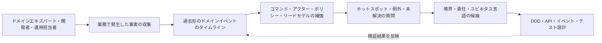
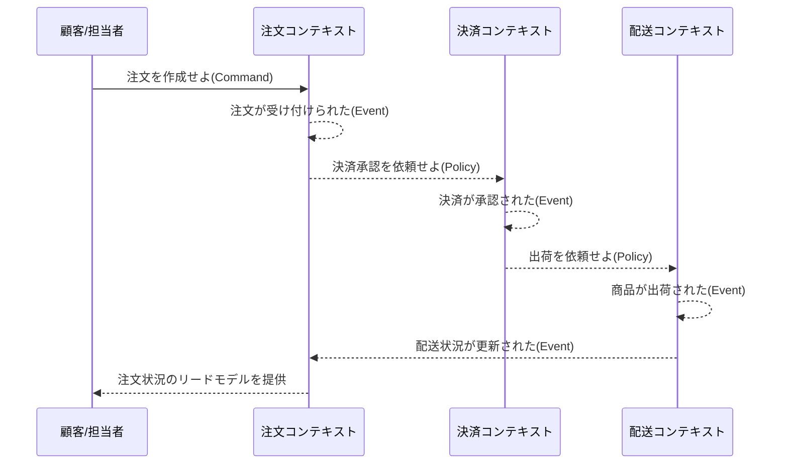

# EventStorming(イベントストーミング)に基づくドメイン探索と設計

## 1. 概要

> **定義**: EventStormingとは、ステークホルダーと開発者が同じ空間でドメインイベントを時系列に並べ、複雑な業務領域の事実・ルール・責任・境界を共同で探索する協働型モデリングワークショップである。

ソフトウェアプロジェクトの失敗は、技術スタックの選択を誤ったときにだけ発生するのではない。
業務担当者が使う用語と開発者が設計したオブジェクトの意味が異なっていたり、部署ごとに同じ業務を異なる順序と責任で理解していたりすると、要件は文書として固定される前からすでに揺らいでいる。
特に注文・決済・配送・返金のように複数の部署と外部システムが絡む業務は、単純な画面一覧やCRUDテーブルだけでは全体の流れを説明しにくい。

EventStormingは、こうした知識の断絶をまず対話と視覚的モデルによって表面化させる手法である。
参加者はシステムが何を保存するかから決めるのではなく、業務ですでに発生した事実を過去形の文で書く。
例えば`注文が受け付けられた`、`決済が承認された`、`商品が出荷された`のように出来事を時間軸上に配置すると、異なる人々が考える業務フローの共通点と衝突が同時に見えてくる。

この方式の核心は、正解となる設計図を一人が与えるのではなく、ドメインエキスパートと技術者が共にモデルを作りながら**集団的学習(collective learning)** を行う点にある。
したがって成果物は単なる議事録ではなく、ユビキタス言語の候補、業務ルール、未解決の質問、境界の候補、後続設計の出発点となる。
EventStormingはドメイン駆動設計(DDD)を支援するが、DDDのすべての活動を代替するものではなく、UML・BPMN・データモデルを廃棄する手法でもない。

### 1.1 登場背景と必要性

従来の分析は、要件をインタビューし、分析者が内容を整理した後、開発者に文書で伝達するという直線的な流れをとる。
この過程では実際に業務を遂行する人が持つ暗黙知が文書化の段階で省略され、疑問が生じたときには再び会議の日程を調整しなければならない。
文書が完成するまで誤りが発見されなければ、実装段階での手戻りコストが急増する。

これに対しEventStormingでは、大きな壁やデジタルボード上に全員が同時にカードを貼り、移動させる。
素早い可視化は言葉の上だけに存在していた不一致を即座に表面化させ、カードの位置や文言を変えるコストが小さいため、初期の仮説を安全に崩すことができる。
開発者は業務ルールを直接聞き、業務部門は技術的制約やデータフローについて質問を受けながら、互いの視点を補正する。

この手法は特に次の条件で効果的である。
第一に、業務用語が部署ごとに異なり、システム間の責任境界が不明確な場合である。
第二に、レガシーシステムを刷新しながら、現在の動作と目標とする業務をあわせて理解する必要がある場合である。
第三に、新規サービスの問題領域を短時間で探索し、MVPの範囲を決めなければならない場合である。
第四に、障害・クレーム・規制対応のように、正常フローだけでは説明できない例外が重要な場合である。

### 1.2 目標と非目標

EventStormingの目標は、複雑なドメインについて**同じ出来事を同じ名前で理解すること**である。
ワークショップが終わった時点ですべての詳細設計が決まっている必要はないが、何が発生したのか、誰が原因を提供したのか、どのポリシーが自動的に反応するのか、どこに不確実性があるのかは明らかになっていなければならない。
この結果を通じて、チームは調査の優先順位と設計上の意思決定を決めることができる。

逆に、EventStormingは確定したデータベーススキーマ、完成したAPI仕様、実行可能なテストコード、最終的な組織図を作る活動ではない。
カードの位置はモデルの現時点の仮説であり、ルールと境界は後続の検証を通じて変わり得る。
したがって成果物をそのまま実装仕様にコピーすると、発見段階の不確実性を隠してしまう副作用が生じる。

## 2. 中核原理と全体構造

### 2.1 出来事中心の思考

ドメインイベントとは、業務の観点から意味があり、すでに発生した事実である。
イベントは一般に過去形の動詞と名詞で表現し、誰かの意図や命令ではなく結果を表す。
`顧客が注文ボタンを押した`は行為または命令に近いが、`注文が受け付けられた`はドメインで観察可能な事実である。

イベントを先に配置すると、参加者はデータベースのテーブルやサービス名よりも業務上の変化に集中する。
出来事の順序について議論する過程で、事前条件、後続の反応、遅延、取消、再試行、補償フローが自然に現れる。
また、同じイベントが複数の場所で使われているかを確認できるため、サービス間の結合と境界の候補を探索するのに役立つ。

イベントの名前は、実装技術よりも業務用語を優先しなければならない。
例えば`OrderStatus = 3`という表現はデータベースの状態値であるが、`決済が承認された`は業務部門も理解できる事実である。
最初は完璧な名前を強制せず、議論が生じた表現は別途ホットスポットとして表示し、ワークショップ後にユビキタス言語として洗練させる。

上記の構造は、分析が一度の成果物作成で終わらないことを示している。
タイムラインで明らかになった質問は追加のインタビューやログ分析で検証し、検証結果は再びイベントの名前と順序を変える。
設計段階で発見された例外もドメインモデルに戻す必要があるため、EventStormingは反復的な学習ループに近い。

### 2.2 色とモデル要素

色は国際標準のように強制された文法ではなく、参加者間の対話を助ける視覚的ルールである。
チームが別の配色体系を使っても構わないが、開始時に色の対応表と例を合意し、途中で意味を変えてはならない。
次の表は、広く使われている基本パレットと問いを整理したものである。

|要素|代表色|文の形|確認すべき問い|
|---|---|---|---|
|ドメインイベント|オレンジ|`〜された`|どのような事実が発生したか?|
|コマンド|青|`〜せよ`|何が出来事を引き起こしたか?|
|アクター|黄|ユーザー・システム・役割|誰がコマンドを出したか?|
|ポリシー|紫|`〜ならば〜する`|出来事の後にどのルールが作動するか?|
|集約/アグリゲート|薄いピンク|業務責任の単位|どの一貫性を一緒に守るべきか?|
|ホットスポット|赤またはピンク|質問・衝突・リスク|何がまだ分かっていないか?|
|境界|線またはピンクのラベル|境界づけられたコンテキストの候補|どこで用語とルールが変わるか?|

表の色よりも重要なのは、要素間の因果関係である。
コマンドはあるアクターの意図であり、コマンドが成功すると一つ以上のイベントが発生する。
イベントはポリシーを起動したりリードモデルを更新したりし、他のコンテキストにメッセージとして伝達されることもある。
したがってカードを単に並べるのではなく、矢印と対話によって「なぜこの出来事が発生したのか」を説明しなければならない。

アクターは人だけを意味するわけではない。
顧客、オペレーター、バッチジョブ、決済ゲートウェイ、外部の規制機関、別の境界づけられたコンテキストも、コマンドの主体やイベントの消費者になり得る。
外部システムを人のように表現するのは責任と統合ポイントを見つけるためのモデリング上の工夫であり、実際に同じ信頼レベルを持つという意味ではない。

ポリシーは「イベントが発生したら常に何かをする」といった自動反応を表現する。
例えば`決済が承認されたら配送準備を依頼する`というポリシーは、決済と配送の結合を説明する。
ただし、ポリシーが同期呼び出しなのか非同期のイベント消費なのか、失敗時に再試行や補償があるのかは、別の設計上の問いとして残しておかなければならない。

### 2.3 ホットスポットの役割

ホットスポットはモデルの穴ではなく、学習のための第一級の成果物である。
参加者が`返金完了`と`返金承認`を異なる意味で使っていたり、部分返金の責任者が決まっていなかったりする場合は、赤いカードで表示する。
議論を無理に終わらせて恣意的な用語を採用するよりも、不確実性を可視化するほうが次の意思決定の質を高める。

ホットスポットには優先順位を付けることができる。
法的リスクの大きい質問、金額の精算に直接影響する質問、障害が繰り返される質問を先に調査し、単なる表現の違いは後回しにする。
各ホットスポットに担当者と確認期限を紐付ければ、ワークショップはアイデアボードにとどまらず、実行可能な発見バックログとなる。

## 3. ワークショップの進行手順

### 3.1 準備段階

ファシリテーターはまず、探索範囲と時間軸の開始・終了条件を決める。
`オンライン注文の決済以降から配送まで`のように一つの業務目的と開始・終了を説明する必要があり、「会社全体をすべてモデリングする」といった範囲は広すぎる。
必要な参加者はドメインエキスパート、プロダクトオーナー、開発者、アーキテクト、運用・カスタマーサポート担当者であり、外部連携の主体もできる限り招待する。

物理的なワークショップでは十分な壁面を確保し、参加者1人あたり複数枚の付箋と太いペンを用意する。
デジタルワークショップでは、無限キャンバスの権限、配色テンプレート、ビデオ会議の音声品質、タイムゾーン、匿名での意見収集方法を事前に点検する。
ツールが華やかでもカードの移動や同時編集が難しければ議論が遅くなるため、機能よりも流れを優先する。

開始前に次の運営原則を案内する。
第一に、役職よりもドメインの事実を優先し、誰でもカードを貼る。
第二に、1枚のカードには一つの意味だけを書く。
第三に、不確かな内容を隠さずホットスポットとして表示する。
第四に、実装用語が出てきても業務上の出来事に翻訳し直す。
第五に、すべての異論を即座に解決しようとせず、タイムボックスを守る。

### 3.2 Big Picture EventStorming

Big Picture段階は、全体の流れを素早く展開する段階である。
参加者はまず、知っているドメインイベントをオレンジのカードに過去形で書き、時系列を完璧に合わせようとせずに壁に貼る。
初期にはカードが重複したり矛盾したりしてもよい。重複や矛盾そのものが知識の差を示すからである。

次に参加者はカードを読み、似た流れをまとめ、出来事の間の空白と衝突について問いかける。
この過程では業務の正常フローだけでなく、取消、失敗、再処理、期限切れ、保留、補償の出来事もあわせて書く。
例えば決済承認だけを記録すると、承認失敗・部分取消・二重承認といった実際の運用上の問題を見落とすことになる。

Big Pictureの成果物は一つの完成した設計ではない。
大まかなドメインの地形、複雑な区間、議論の多い用語、追加探索が必要なホットスポットを見つけることが目標である。
通常は大きな範囲から始めても、価値の大きいフローを選んでProcess段階へ拡大できなければならない。

### 3.3 Process Level EventStorming

Process段階は、特定の一つのフローを選び、コマンド・アクター・ポリシー・リードモデルを付け加える段階である。
`注文が受け付けられた`という出来事の前に`注文を作成せよ`というコマンドと顧客というアクターを配置し、必要なカート参照をリードモデルとして表示する。
こうすることで、出来事は単に時系列に並べられるのではなく、意図と責任を持つフローとして具体化される。

ポリシーは、イベントを原因として次のコマンドを生み出すルールとして書く。
`決済が承認されたら出荷を依頼する`というポリシーについて、参加者は自動反応なのか担当者の承認なのか、再試行間隔や冪等性キーが必要かを議論する。
この対話は業務モデルと分散システム設計をつなぐが、技術的な実装を拙速に決めないよう、ファシリテーターがバランスを取らなければならない。

Process段階では、時間・責任・例外をより精密に問う。
顧客が決済画面を閉じたとき注文は作成されたのか、承認応答が遅れたとき二重決済をどう防ぐのか、配送業者が取消を拒否したとき誰が顧客に知らせるのか、などをイベントとホットスポットとして記録する。
正常経路と例外経路を一つの画面に置けば、運用可能な業務フローかどうかを判断しやすくなる。

上記のシーケンスは、特定の技術スタックを意味するものではない。
同期APIなのかメッセージブローカーなのか、一つのデータベースなのか複数のストアなのかは、信頼性・遅延・組織構造を追加で分析して決定する。
ただし、イベントとポリシーを分けておくことで、結合ポイント、障害伝播、再試行と補償の設計を議論するための共通言語が生まれる。

### 3.4 Software Design段階

Software Design段階では、Process段階で選んだ区間を、アグリゲート、境界づけられたコンテキスト、サービス・イベント・リードモデルの候補へと拡大する。
アグリゲートはすべてのデータを一つのテーブルにまとめる概念ではなく、一つのトランザクションで一貫性を守るべき業務責任の単位である。
`注文`と`決済`が常に一つのトランザクションでなければならないと仮定せず、それぞれの不変条件と失敗境界をまず確認しなければならない。

境界づけられたコンテキストは、同じ単語が異なる意味を持ち始める地点で候補となる。
注文コンテキストの「顧客」は購入主体と配送先を持つ存在かもしれないが、マーケティングコンテキストの「顧客」はキャンペーン反応とセグメントを持つ対象かもしれない。
二つのモデルを一つの巨大な顧客オブジェクトに統合すると、変更理由が混在し、異なるルールを無理に調整しなければならなくなる。

コンテキスト間のイベントは公開契約のように管理する。
イベントの名前、フィールド、発生時点、重複の可能性、順序保証、個人情報の有無、保存期間を定義しなければならない。
ワークショップのカードがそのままイベントスキーマになるわけではないが、どの事実を外部に公開するか、どの責任を分離するかを決める入力となる。

## 4. モデル要素の関係と設計上の解釈

### 4.1 イベント・コマンド・ポリシーの違い

コマンドはまだ発生していない意図であり、イベントはすでに発生した事実である。
コマンドは拒否され得るが、イベントは発生した事実であるため過去形で記録する。
ポリシーは出来事を観察して後続のコマンドを生成するルールであり、ポリシーの条件が変われば同じイベントに対する後続の行動も変わり得る。

例えば`クーポンを適用せよ`というコマンドは、顧客またはシステムが要求した意図である。
検証に成功すると`クーポンが適用された`というイベントが発生し、そのイベントを見たポリシーが`割引額を再計算せよ`という後続コマンドを生成することができる。
逆にクーポンが期限切れであればコマンドは拒否され、`クーポンの適用が拒否された`のような失敗の事実を別途残すことができる。

|区分|意味|時間的観点|実務上の成果物|
|---|---|---|---|
|コマンド|望む行動に対する要求|未来の可能性|APIリクエスト、ジョブキューのメッセージ|
|イベント|すでに起きた業務上の事実|過去の事実|ドメインイベント、監査記録|
|ポリシー|出来事に反応する業務ルール|条件付きの後続行動|プロセスマネージャー、自動化ルール|
|リードモデル|判断に必要な参照情報|現在の観察|画面、検索インデックス、ダッシュボード|

この区別が重要なのは、責任と再処理の方法が異なるからである。
コマンドは権限・妥当性・冪等性を検査しなければならず、イベントは重複受信と順序の逆転を考慮しなければならない。
ポリシーは失敗時の再試行・補償・人の介入を設計しなければならず、リードモデルは遅延する結果整合性をユーザーにどう見せるかを決めなければならない。

### 4.2 境界と凝集度

境界とは、カードの間に線を引く行為というより、ルールと言語の凝集度を観察する過程である。
変更理由が一緒に動き、同じチームが責任を持ち、同一の不変条件を守らなければならない要素は、一つの境界に残す可能性が高い。
逆に異なる用語、異なるスピード、異なる規制上の責任を持つ場合は、統合があっても別のコンテキストに分離する理由が生じる。

境界を多く作りすぎると、メッセージと運用の負担が増える。
逆にすべてを一つのコンテキストにまとめると、独立したデプロイとモデルの明確さが失われる。
したがってカードの枚数やマイクロサービスの流行ではなく、業務能力・チーム構造・データ所有権・障害分離をあわせて見て境界を決定しなければならない。

### 4.3 例外と補償

実務システムでは、正常なイベントよりも例外のコストのほうが大きい。
決済承認後に配送在庫が不足することもあれば、配送依頼後に外部の宅配APIが一時的に停止することもあり、ユーザーがすでに受け取った商品を返金することもある。
こうしたフローは「失敗したらロールバックする」という一文では処理できず、すでに外部に公開された事実を元に戻す補償イベントが必要である。

ワークショップでは、例外を別の行に隠さず、正常なタイムラインの近くに貼る。
`決済が承認されなかった`、`出荷依頼が期限切れになった`、`返金が完了した`のように、顧客と運用担当者が観察できる出来事を明示する。
その後、各出来事の所有者、再試行回数、手動処理の基準、顧客への通知、監査証跡について問う。

## 5. 比較と活用の文脈

### 5.1 BPMN・UML・User Storyとの比較

BPMNは、業務プロセスのフローとゲートウェイ・役割・メッセージを形式的な記号で表現するのに強い。
UMLのシーケンス図はオブジェクト間の相互作用を、クラス図は構造と関係を明確に表す。
User Storyはユーザー価値と受け入れ条件を管理するのに適している。
EventStormingはこれらよりも、精密な表記より素早い共同探索と知識の衝突の表面化を優先する。

したがってEventStormingをBPMNの代替品として比較するよりも、発見から形式化へとつながる前段の活動とみなすのが適切である。
EventStormingで合意したイベントとホットスポットをもとに、BPMNの承認フロー、UMLの相互作用、User Storyの受け入れ条件を具体化することができる。
逆に、すでに規制の強いプロセスで公式な統制の証跡が必要であれば、形式的な文書が最終成果物でなければならない。

|観点|EventStorming|BPMN/UML|User Story|
|---|---|---|---|
|主な目的|ドメインの共同探索|形式的なプロセス・構造の表現|ユーザー価値と要件の管理|
|参加方式|同時協働・発言中心|モデル作成者中心になりやすい|プロダクト・開発間の協議中心|
|不確実性の扱い|ホットスポットで可視化|図の外の注記として残ることがある|バックログ・質問として分離|
|強み|素早い共通理解と境界の発見|正確なレビュー・追跡・自動化|優先順位と受け入れ基準の管理|
|限界|形式性・再現性が低い場合がある|初期探索には重い|業務全体の流れを見落とすことがある|

三つの手法をつなぐ際は、変換ルールを明示しなければならない。
例えばイベントの名前をBPMNの状態として機械的にコピーすると、イベントと状態を混同する恐れがある。
また、カードにない非機能要件、個人情報処理の根拠、性能目標、保存期間は、別の品質特性リストで補強しなければならない。

### 5.2 DDD・EDA・CQRSとの連携

EventStormingは、DDDの戦略的設計において境界づけられたコンテキストとユビキタス言語を発見するのに有用である。
また、戦術的設計においてアグリゲートとドメインイベントの候補を作ることもできるが、アグリゲートのサイズとトランザクション境界は、コードと不変条件の検証を通じて改めて確認しなければならない。

Event-Driven Architecture(EDA)とEvent SourcingもEventStormingのイベント概念を活用できる。
しかし、ワークショップで「イベント」と呼んだすべてのカードが、ブローカーに発行される統合イベントであるという意味ではない。
業務記録用のドメインイベント、システム間の統合イベント、保存のためのイベントソーシングのイベントは、目的・契約・保存ポリシーが異なり得る。

CQRSではコマンドモデルとリードモデルを分離できるが、リードモデルが増えるほど更新遅延と再生成のコストが大きくなる。
EventStormingでリードモデルを表示する際は、単に画面一覧を作るのではなく、どの判断のためにどのデータが必要か、そして鮮度の要求をあわせて記録しなければならない。

### 5.3 レガシー刷新の事例

仮想の流通企業が15年使われてきた注文システムを刷新すると仮定する。
既存の文書には注文状態が`READY`、`PAYED`、`DELIVERY`、`DONE`と記載されているが、業務部門は決済承認前の注文、部分出荷、返品受付、返金待ちといった、より多くの状態を区別している。
チームがまずテーブルをサービスに分割すると、既存の状態値の意味をそのまま複製してしまうリスクがある。

EventStormingでは、運用担当者・オペレーター・開発者が実際の顧客事例を持ち寄り、出来事を時系列に配置する。
その結果、`決済承認済み`と`決済精算済み`が異なる出来事であり、`配送完了`が宅配業者からの通知と顧客の受領確認に分かれるという事実が明らかになることがある。
この違いは、サービス境界とデータ契約を設計する前に解決すべき業務上の問いである。

後続の設計では、注文・決済・配送・返品を独立した責任の候補とするが、最初から四つのマイクロサービスに分解することはしない。
各コンテキストの変更頻度、チームの所有権、障害分離、データ一貫性の要求を検証した上で段階的に分離する。
このようにEventStormingは、レガシーをそのまま分割するのではなく、現在の事実と目標モデルとの間のギャップを明らかにするツールである。

## 6. ファシリテーションと品質管理

### 6.1 ファシリテーターの役割

ファシリテーターはドメインの正解を提示する人ではなく、参加者が事実を語り、衝突を安全に扱えるよう流れを設計する人である。
初期に技術用語が対話を支配した場合は、「この業務で実際に何が起きているのか」へと問いを引き戻す。
発言の少ない参加者にはカード作成の時間を与え、役職の高い人の意見がそのまま合意とならないよう匿名のホットスポットを活用する。

タイムボックスは段階ごとに運用する。
例えば、全体のイベント収集、タイムラインの整理、コマンド・アクターの補強、ホットスポットの分類、次の段階の選定のそれぞれに終了時点を設ける。
議論が長引く項目は別の質問バックログに移し、全体の流れの学習が止まらないようにする。

### 6.2 よくある失敗パターン

第一の失敗は、開発者だけが参加して技術的なイベントを業務イベントのように書くことである。
`API呼び出し成功`、`Kafka publish完了`はシステムの観察事実ではあり得るが、業務目的と顧客価値が見えないため、ドメイン上の出来事とは区別しなければならない。
第二の失敗は、役員や企画担当者があらかじめ決めた正解をカードに押し付けることである。
この場合、ワークショップは合意の形式だけが残り、実際の不確実性は隠される。

第三の失敗は、すべてのカードをすぐにマイクロサービスに変換することである。
カードの色と境界は発見の仮説であるため、トラフィックやチーム数だけでサービス境界を確定すると、分散トランザクションと運用の負担が大きくなる。
第四の失敗は、正常フローだけを残して例外を「後で処理する」ことである。
障害・取消・補償のフローを後から追加すると実際の品質要求が抜け落ち、運用設計が実装の後半へと押しやられる。

### 6.3 成果物の継続的な管理

ワークショップのボードは写真1枚で終わらせない。
イベント辞書、用語決定ログ、ホットスポットのバックログ、コンテキストマップ、決定記録(ADR)、API・イベント契約として、必要な部分を抽出する。
成果物には作成日、範囲、参加者、未解決の前提、次の検証作業を残し、新しいチームメンバーがモデルの信頼レベルを理解できるようにする。

運用中は、実際の障害や変更がモデルに反映されているかを確認する。
新たな例外が発見されたのにボードが更新されなければ、モデルは現在のシステムから乖離する。
逆にすべてのログをカードに移すと業務上の意味がぼやけるため、ドメインエキスパートが観察する価値のある事実と技術的なテレメトリーを区別する。

## 7. 深掘り: 答案構成と出題との関連

技術士の答案でEventStormingを「付箋を使う会議手法」とだけ定義すると、深さが不足する。
定義の後に、複雑性の原因である知識のサイロ、用語の不一致、レガシーにおける責任の混在を提示し、イベント中心の探索がそれをどのように可視化するかを説明しなければならない。
その後、Big Picture→Process→Software Designの段階、色の要素、ホットスポット、境界の発見を概念図と事例でつなげると、論述の流れが自然になる。

比較問題では、BPMN・UML・User Storyとの違いを単なる表で終わらせず、「発見段階と形式化段階は異なる」という文脈を示す。
EDA・DDD・CQRSと関連付ける際は、ワークショップのイベントと統合イベントを同一視しないという注意点を入れなければならない。
最後に、ファシリテーションの偏り、例外の抜け漏れ、成果物の最新化、個人情報・セキュリティ要件の別途管理までを考慮事項として整理する。

想定事例には注文・決済のような馴染みのあるフローを用いつつ、決済遅延・部分返金・外部連携の失敗を盛り込み、分散システムの現実性を示すのがよい。
数値が必要な場合は、参加者6〜10名、2〜3時間の小規模なProcessセッションのような一般的な運用例として示し、特定組織の成果として誇張しない。
答案の結論は「共同学習によって境界を発見し、形式的な成果物と運用ガバナンスにつなげたときに効果が持続する」に収斂させればよい。

## 8. 考慮事項および示唆

### 8.1 範囲と目的の統制

範囲が広すぎると、カードが積み上がるばかりで意思決定が出てこない。
カスタマージャーニー・業務能力・特定の障害フローのいずれかを選び、開始と終了の条件を明確にしなければならない。
逆に範囲を狭めすぎるとコンテキスト間の責任や外部への影響が見えなくなるため、Big Pictureで広く見てProcessで絞り込む階層的なアプローチが必要である。

### 8.2 参加者と心理的安全性

ドメイン知識は一つの職務に独占されていない。
オペレーターは例外とクレームを、運用担当者は障害と手動対応を、開発者はシステムの制約を知っているため、これらの人々を一緒に参加させなければならない。
役職の高い人の発言がモデルの真実として固まらないよう、事実・仮定・意見を区別し、異論をホットスポットとして安全に残す運営が重要である。

### 8.3 整合性とトレーサビリティ

カードモデルは素早いが形式性が低いため、合意した用語と決定はイベント辞書・ADR・要件・テストで追跡しなければならない。
イベント名がAPIやログで変わった場合は影響範囲を確認し、どのモデルが最新かについてリポジトリにおける単一の基準を定めなければならない。
モデルと実装の差異を隠さず、差異の理由と有効期間を記録しなければならない。

### 8.4 分散システムの品質

イベント駆動設計へとつながる場合、重複、順序の逆転、遅延、部分的な失敗、再処理、冪等性を必ず点検しなければならない。
ワークショップが業務上の意味を説明したとしても、ネットワークの配信保証やブローカーの障害を自動的に解決するわけではない。
ポリシーごとの再試行・DLQ・補償・可観測性・監査ログを設計し、顧客に結果整合性をどのように伝えるかを決めなければならない。

### 8.5 個人情報とセキュリティ

カードに顧客の識別子、健康情報、決済情報を実際の値で書くと、ワークショップのボード自体が個人情報の保管場所になってしまう。
実データの代わりに仮名・例示値を用い、デジタルボードのアクセス権限・保存期間・ダウンロードポリシーを適用しなければならない。
イベント契約には、最小限の収集、目的の制限、アクセス制御、暗号化、監査証跡といった非機能要件を別途紐付けなければならない。

### 8.6 持続可能な改善

1回のワークショップでモデルが完成すると期待してはならない。
ホットスポットを調査し、実際の運用指標と顧客フィードバックを反映し、重要な変更の際には短い再探索セッションを実施しなければならない。
チームが入れ替わってもユビキタス言語と決定記録によって知識が維持されるよう、オンボーディング資料とリポジトリを連携させることが、技術士の観点からのガバナンスである。

## 参考資料

- EventStorming公式サイト、Alberto Brandolini: https://www.eventstorming.com/
- EventStorming公式リソース: https://www.eventstorming.com/resources/
- Avanscoperta, Introducing EventStorming: https://blog.avanscoperta.it/2014/02/12/introducing-event-storming/
- Open Group Open Agile Architecture, Event Storming Workshop: https://pubs.opengroup.org/architecture/o-aa-standard/event-storming-workshop.html
- VMware Tanzu, Event Storming: https://blogs.vmware.com/tanzu/event-storming/

---

> **一言まとめ**: EventStormingは、ドメインイベントを共同で時間軸上に展開して複雑な業務の言語・ルール・例外・境界を発見し、その結果をDDD・EDA・形式モデル・運用ガバナンスへとつなげる協働型の探索手法である。
