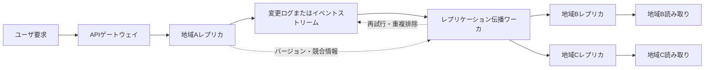
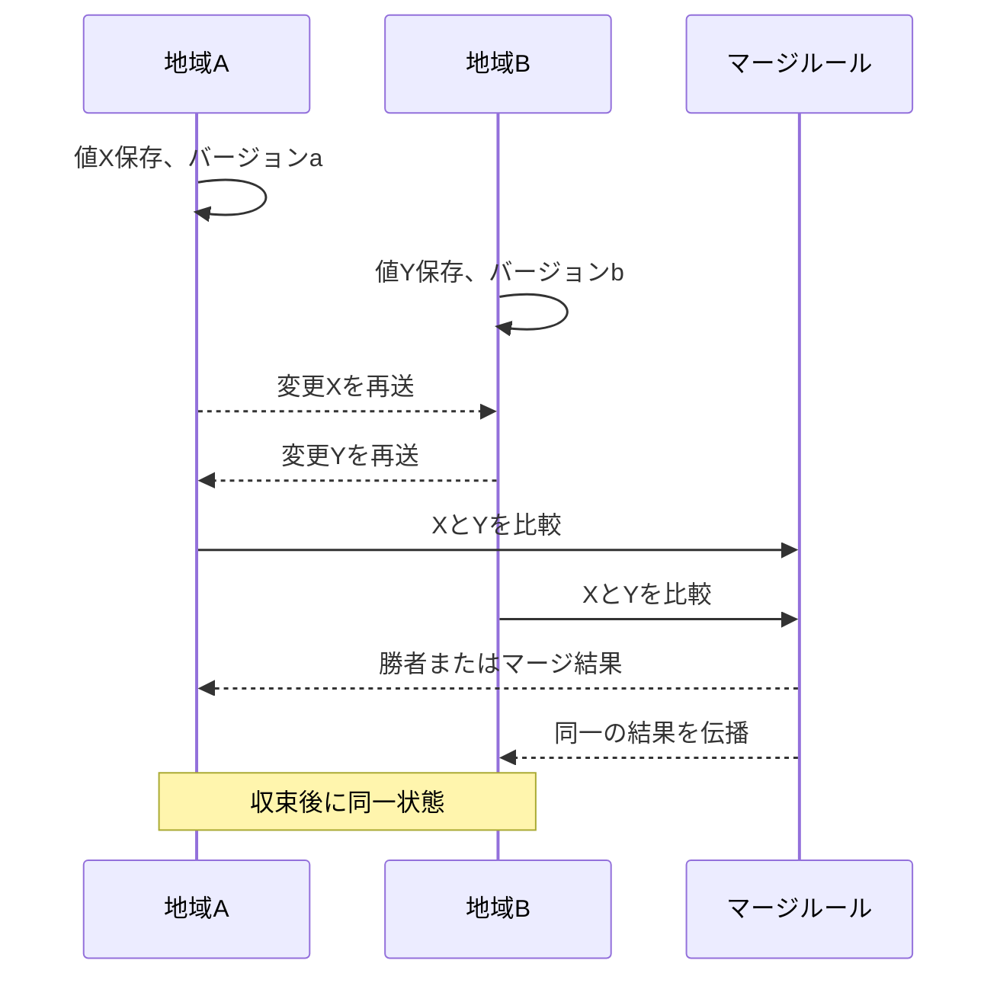

# 結果整合性(Eventual Consistency)と分散システムの一貫性モデル

## 1. 概要

### A. 定義

> **結果整合性(Eventual Consistency)**とは、新たな更新がそれ以上発生せず、レプリカ間の伝播が正常に完了すれば、時間の経過とともにすべてのレプリカが同一の値に収束するという分散データの一貫性モデルである。

結果整合性は、すべての読み取りが即座に最新値を返すという約束ではない。ある時点では、地域レプリカのネットワーク遅延、非同期レプリケーション、再試行順序の違いにより、異なる値が観測されることがある。

その代わりにシステムは可用性とレイテンシを優先しつつ、障害が解消され更新の伝播が終われば結果が一つに収束するように設計される。

このモデルは、複数の地域にデータを複製するキーバリューストア、DNS、CDNキャッシュ、ソーシャルフィード、ショッピングカート、レコメンド結果のように、世界中のユーザに高速に応答しなければならないサービスで頻繁に用いられる。

### B. 登場背景と必要性

単一のデータベースでは、一つのトランザクションログとロック機構によって最新状態を比較的容易に定義できる。

しかしマルチリージョンサービスでは、ユーザは近いリージョンのレプリカに接続し、リージョン間の通信は遅延したり一時的に途絶したりすることがある。

すべての書き込みを中央のリーダに送り、すべての読み取りがその結果を待つようにすれば強い一貫性を得られるが、地域障害と長い往復時間がそのままサービスの遅延と可用性の低下につながる。

結果整合性は、この点において「一時的に異なる値を見せることはあっても、サービスは応答し続ける」という選択を可能にする。

例えば、ユーザがソウルでプロフィール名を変更した直後に東京リージョンで自分のプロフィールを照会すると、一時的に以前の名前が表示されることがある。

この現象が許容されるサービスであれば、書き込み成功応答を待つ範囲を縮小し、ユーザ体験と地理的なスケーラビリティを高めることができる。

逆に、送金残高、在庫の引き当て、権限の剥奪のように古い値を許容すると直接的な損失やセキュリティ事故が発生する領域では、結果整合性だけでは不十分である。

したがって、一貫性モデルはストレージの属性ではなく、業務上の意味、誤りのコスト、ユーザの期待を反映した設計上の決定として理解すべきである。

### C. CAPおよびレイテンシとの関係

分散システムは、ネットワーク分断が発生し得るという前提のもとで、一貫性(Consistency)と可用性(Availability)の選択を求められる。

CAPのCはすべてのノードが同一の最新値を見るという強い意味の一貫性に近く、Aは一部のノードが孤立しても要求に応答する性質である。

結果整合性のシステムは、ネットワーク分断中も各レプリカが書き込みや読み取りに応答するAP的な性格をとり得るが、それは結果を常に無条件で許容するという意味ではない。

実際の製品は、キー単位の条件付き書き込み、クォーラム読み取り、セッション保証、競合解決ポリシーを組み合わせて、業務ごとの妥協点をつくる。

CAPは障害状況における選択を説明する理論的枠組みであり、平常時のレイテンシ・スループット・コスト・運用の複雑さまで自動的に決めてくれるわけではない。

## 2. 一貫性の意味と階層

### A. 強い一貫性と弱い一貫性

強い一貫性は、書き込みが成功した後はどのノードから読み取っても、最新値またはそれ以降の値を返すことを要求する。

線形化可能性(Linearizability)は、各操作が呼び出しと応答の間のある一瞬に原子的に発生したかのように見せ、実時間の順序も保持する。

この性質は、口座残高や分散ロックのように順序と最新性が核心となる作業に適しているが、複数の地域の合意を待たなければならないため、レイテンシと障害伝播のコストが大きくなる。

弱い一貫性は、読み取り時点での最新値を保証しない。ただし、「いつまでに収束すべきか」「一人のユーザの連続した要求においてどのような順序を保証するか」によって、いくつかの下位モデルに分かれる。

結果整合性は、弱い一貫性の中でも収束条件を明示したモデルであり、無期限に異なる値を提供してよいという意味ではない。

### B. 主な一貫性モデル

| モデル | 核心的な保証 | 代表的な活用 | 主なコスト |
|---|---|---|---|
| 線形化可能性 | すべての操作がグローバルな単一順序のように見える | 残高、リーダ選出、ロック | 合意による遅延、可用性の低下 |
| 逐次一貫性 | プロセスごとの順序を保持した単一順序 | 共有メモリの抽象化 | グローバルな順序調整 |
| 因果一貫性 | 原因と結果の関係をすべてのノードが保持 | コメントと返信、メッセージ | 因果メタデータの管理 |
| セッション一貫性 | 一つのセッションで読み書きの順序を保証 | ユーザプロフィール、カート | セッション固定またはトークン |
| 結果整合性 | 更新が止まればレプリカが収束 | DNS、フィード、キャッシュ | 一時的な古い値、競合 |
| Read-Your-Writes | 自分が書いた値は以後の読み取りで見える | ユーザ設定の変更 | セッションルーティング・バージョン伝達 |
| 単調読み取り | 同じユーザの読み取りが過去に後退しない | 状態照会画面 | レプリカ選択の制御 |

この表のモデルは、互いに排他的な製品分類というよりも、システムがユーザに提供する観測可能性の組み合わせである。

例えば、システム全体は結果整合性であっても、ユーザセッションにはRead-Your-Writesと単調読み取りを適用することができる。

こうすれば、すべてのユーザがグローバルな最新値を待つことなく、自分の直前の変更が画面から消えるという混乱を減らすことができる。

### C. 一貫性と耐久性・正確性の区別

一貫性とは、レプリカ間で値がどのような順序と時点で観測されるかをいう。

耐久性は成功した書き込みが障害後も失われないかに関する性質であり、完全性は値が業務ルールに違反しないかをいう。

結果整合性を選択したからといって、データを失ってもよいという意味ではない。

例えば、注文イベントは耐久性をもって保存しつつ、検索インデックスとレコメンド結果は非同期で更新して結果整合性で提供することができる。

この区別をしなければ、「非同期レプリケーションだからデータが消えても構わない」という誤った設計が生じる。

## 3. 動作原理と構成要素

### A. 非同期レプリケーション構造

地域Aで書き込みが成功すると、データベースはローカル保存とログ記録を先に完了し、レプリケーションワーカが地域BとCへ変更を送信する。

このとき、クライアントへの応答とリモートレプリケーションの完了を分離すれば往復遅延を減らせるが、リモートレプリケーション前の障害区間では地域ごとに値が異なることになる。

したがって、ログは単なるネットワークメッセージのバッファではなく、再起動・再送・順序追跡・監査に必要な、耐久性のある事実の記録でなければならない。

レプリケーションワーカはタイムアウトと指数バックオフを用いて一時的な障害に耐え、同一イベントが複数回配信されても結果が一度だけ適用されるよう冪等性を保証しなければならない。

### B. バージョンと順序の追跡

最も単純な競合解決方法は、最新タイムスタンプ優先(LWW)である。各更新に論理時刻や物理時刻を付与し、より大きい値を残す方式である。

しかし、異なるノードの時計がずれていると、実際にはより新しい変更が破棄されることがあり、同一時刻の同時書き込みを区別することも難しい。

論理時計(Logical Clock)は、物理時計の代わりにメッセージの因果順序を追跡する。Lamport時計は「AがBより先に発生した」という順序を表現するが、互いに独立した同時事象までは区別してくれない。

ベクタ時計(Vector Clock)は、ノードごとのカウンタを保持して二つのバージョンの関係を比較する。一方のベクタが他方のベクタよりすべての項目で小さいか等しければ先行関係であり、どちらも他方を包含しなければ同時更新と判定できる。

ノード数が多いほどベクタのメタデータが大きくなるという問題があるため、実務ではパーティション単位のバージョン、ハイブリッド論理時計、サーバ生成の連番などを要件に合わせて選択する。

### C. 競合解決

競合は、二つのレプリカが同じキーを異なる値で更新した後に変更内容を交換するときに発生する。

LWWは実装が容易でストレージも小さいが、敗れた値の意味が失われるため、ユーザにとって重要な情報を失う可能性がある。

フィールド単位のマージは、名前と住所のように独立して修正されるフィールドを保持できるが、フィールド間の業務ルールを壊す恐れがある。

多値レジスタは、競合したすべての値を保持し、アプリケーションやユーザが後続の選択を行えるようにする。

カウンタ・集合・マップのように操作自体をマージするCRDTは、可換・結合・冪等の性質を利用して、メッセージの順序が異なっても同一の結果に収束するよう設計される。

しかし、すべてのドメイン状態をCRDTで表現できるわけではない。在庫のように0未満になってはならない制約や「一度だけ当選」のようなグローバルな不変条件には、別途の予約・合意・補償の手続きが必要である。

### D. 再試行と冪等性

レプリケーションメッセージは、応答の消失によって送信者が同じイベントを再送することがある。

受信者がイベントを単純に加算すると、カウンタが二重に増加したり、同じ注文が二回生成されたりする問題が生じる。

これを防ぐため、イベントID、ソースパーティションとオフセット、ビジネスキーを用いて重複を検出し、処理結果を記録する。

冪等な代入は同じ値を何度適用しても結果は同じだが、「残高を100増加」のような増分操作は、イベントIDを記録するか、一度だけ適用される原子操作で包む必要がある。

再試行ポリシーには、最大再試行回数と保留キュー、ポイズンメッセージの隔離、運用者による再処理手順を含めなければならない。

## 4. 一貫性レベルの設計と実装手順

### A. 要件分析

第一段階は、「最新値」を抽象的に要求することではなく、ユーザと業務が許容できる古い値の範囲を定義することである。

商品検索結果が数秒遅れて反映されることは許容されるが、決済直前の価格と在庫には別途の検証が必要な場合がある。

定量的な基準として、収束遅延の目標パーセンタイル、古い読み取りの最大許容時間、競合率、再処理率を定義する。

これらの指標を定義しなければ、レプリケーションが動作しているという事実を確認するだけで、ユーザにいつまでに正しく表示されるべきかを検証することができない。

業務ごとに読み取りと書き込みの組み合わせを分離し、「グローバルな強い一貫性」「リージョンローカルの結果整合性」「セッション保証」を混在させるのが現実的である。

### B. データの分類

| データ種別 | 許容モデル | 設計例 |
|---|---|---|
| 口座・決済承認 | 強い一貫性または単一の権威者 | 元帳サービスと条件付き更新 |
| 商品検索インデックス | 結果整合性 | 元DBと非同期インデックス |
| ショッピングカート | セッション・Read-Your-Writes | ユーザ別パーティションとマージ |
| いいね・閲覧数 | マージ可能な結果整合性 | CRDTカウンタまたはイベント集計 |
| 権限・トークン失効 | 短いTTL以上の迅速な伝播 | 中央ポリシーとキャッシュ無効化 |
| 分析・レコメンド特徴量 | 遅延許容の結果整合性 | ストリーム処理と再計算 |

分類の核心は、データそのものよりも誤用時の被害を評価することである。

例えば、商品説明は遅れて見えても構わないが、販売可能在庫を検索インデックスだけを信じて決済してはならない。

決済サービスは、結果整合性の検索結果を参考にするとしても、最終承認時点で権威ある在庫・決済システムを再度照会する二重検証を設ける。

### C. レプリケーションプロトコルの選択

同期レプリケーションは、書き込み確認を複数ノードから受けて高い一貫性を提供するが、遠方のリージョン障害が書き込み遅延として伝播する恐れがある。

非同期レプリケーションは高速なローカル応答を提供するが、レプリケーション遅延、競合、復旧時点の損失可能性を運用で扱わなければならない。

リーダベースのレプリケーションは順序を単純にするが、リーダ障害時の選出と、リーダのある地域へのトラフィック集中が問題となる。

マルチリーダ構成は地域ごとの書き込み遅延を減らすが、同時競合とマージポリシーをアプリケーションが責任を持って扱う必要がある。

読み取りクォーラムと書き込みクォーラムを調整する構造では、全レプリカ数をN、読み取りクォーラムをR、書き込みクォーラムをWとし、R+W>Nの関係を活用できる。

この関係は、重なり合うレプリカを通じて最新の書き込みを読める可能性を高めるが、障害・遅延・同時書き込み・バージョン選択ポリシーまで自動的に解決するわけではない。

### D. アプリケーションによる補完

クライアントが書き込み応答としてバージョントークンを受け取り、次の読み取りにそれを渡せば、サーバは当該バージョン以上を持つレプリカへルーティングできる。

この方法はセッション固定なしでもRead-Your-Writesの性質をつくれるが、トークンが期限切れになった場合や、当該リージョンにまだバージョンが到着していない場合の待機・代替応答を定義しなければならない。

ユーザ画面には「処理中」「同期中」「最新状態の確認が必要」を表示し、一時的な不一致を隠すよりも意味のある形で伝えることができる。

業務コマンドは状態の上書きではなくイベントとして記録し、競合時には補償トランザクションや手動レビューキューへ回すと、原因追跡と復旧が容易になる。

## 5. 強い一貫性との比較

### A. 違いが生じる理由

強い一貫性は、読み取り結果に対するユーザの推論を単純にする。書き込みが成功すれば、以後どの場所から読んでも同じ結果であるという前提をコードに置くことができる。

しかしこの保証は、レプリカ間の通信と調整が完了するまで要求を遅延させ、ネットワーク分断中は応答を拒否するという選択につながり得る。

結果整合性は通信を待たずにローカルで処理できるため、レイテンシと地域の可用性の面で有利である。

その代わり、アプリケーションは古いデータ、重複イベント、競合、順序の逆転、再処理を明示的に扱わなければならない。

| 比較項目 | 強い一貫性 | 結果整合性 |
|---|---|---|
| 読み取りの意味 | 最新のグローバル状態に近い | 一時的に以前の状態があり得る |
| 書き込み遅延 | 調整範囲に比例して増加 | ローカル応答で低減可能 |
| 障害時の選択 | エラー・遮断の可能性が増加 | 地域サービスの継続が可能 |
| 競合処理 | プロトコルが低減してくれる | ドメインルールが必要 |
| 運用難易度 | 合意・リーダ障害の管理 | レプリケーション遅延・再処理の管理 |
| 適した業務 | 元帳・権限・在庫確定 | フィード・検索・分析・キャッシュ |

### B. 混合モデルの実務的意味

一つのシステムを、すべて強い一貫性、またはすべて結果整合性に決める必要はない。

元帳と注文状態は強く維持し、注文検索・通知・ダッシュボードはイベントを受けて遅れて更新するCQRS構造を用いることができる。

ユーザが注文直後にダッシュボードを照会してまだ「処理中」と表示されることは許容しつつ、詳細画面は元帳サービスに直接確認するというやり方である。

このように権威データと派生データを分離すれば、高い一貫性のコストを本当に必要な境界にのみ支払うことができる。

## 6. 産業適用事例

### A. グローバルなソーシャルフィード

投稿の作成は作成者に近いリージョンにまず保存し、フォロワー向けのタイムラインは非同期のファンアウトで生成することができる。

伝播遅延の間に一部のフォロワーが新しい投稿を遅れて目にすることは、おおむね許容される。

しかし、削除要求やブロック処理には一般投稿よりも迅速な伝播とキャッシュ無効化を適用する必要があり、すでに伝播したコピーが残らないよう再収集作業も必要である。

### B. 電子商取引の在庫

商品詳細・検索インデックスは結果整合性で運用し、読み取り負荷を分散することができる。

しかし決済段階では、検索インデックスの在庫数量を確定値として使用せず、在庫の権威サービスに予約コマンドを送る。

予約コマンドには注文IDを冪等キーとして含め、予約の期限切れや決済失敗時には補償としての返却を設ける。

この構造は、画面上の数量が少し遅れて表示される問題を受け入れつつも、過剰販売を重要な境界で遮断する。

### C. DNSとCDNキャッシュ

DNSとCDNは世界中のエッジに値を複製して高速に応答し、TTLと無効化要求によって変更を伝播する。

TTLが残っている間に一部のユーザが以前のIPや以前のコンテンツを受け取るのは、結果整合性の典型的な事例である。

セキュリティパッチや障害時の切り替えではTTLを待つことができないため、短いTTL、積極的な無効化、ヘルスチェック、代替オリジンを併せて設計しなければならない。

## 7. 検証・観測・障害対応

### A. 主要な観測指標

レプリケーション遅延は、元イベントの時刻と対象レプリカへの適用時刻の差として測定し、平均だけでなくp95・p99も併せて見る。

競合率はキーまたは業務種別ごとに集計してこそ、特定の顧客層や特定のリージョンでのみ問題が生じる現象を見つけることができる。

古い読み取りの比率、再試行率、重複排除率、保留キューの長さ、復旧後の再収束時間も併せて記録する。

指標にはテナント・リージョン・データ重要度のタグを付け、全体平均が危険な区間を覆い隠さないようにしなければならない。

### B. テスト戦略

ネットワーク遅延、パケットロス、順序の逆転、重複配信、時計のずれ、リージョン断絶を注入する障害注入テストが必要である。

同じキーを同時に更新するテストでは、期待結果が単純な「最後の値」なのか、フィールドのマージなのか、ユーザ確認なのかを明確に検証する。

レプリケーションを中断してから再開したときに欠落したイベントを見つけ、イベントを何度再生しても最終状態が同一であることを確認する。

Read-Your-Writesや単調読み取りのようなセッション保証は、ユーザを複数のリージョン間で移動させながらテストしなければならない。

### C. 障害対応

レプリケーション遅延がしきい値を超えた場合、重要度の低い派生処理のトラフィックを削減し、権威システムに対する読み取り経路を一時的に増やすことができる。

競合が急増した場合は、自動マージを停止し、保留キューで業務担当者の承認を受けるようにするセーフモードが必要である。

再同期は全件コピーよりもチェックポイントと変更ログを用いて欠落区間を絞り込み、再同期中はバージョン検証によって古いデータが最新データを上書きできないようにする。

## 8. 深掘り: CRDTとイベント駆動アーキテクチャ

CRDT(Conflict-free Replicated Data Type)は、分散レプリカにおいて操作の順序や到着時点が異なってもマージ結果が収束するように、データ構造と操作を設計するものである。

集合の追加・削除、カウンタの増加、レジスタとマップを組み合わせることができ、数学的な結合法則と冪等性のおかげでネットワークの再送を単純化できる。

ただし、削除と再追加の意味、メタデータの増加、ガベージコレクション、悪意あるクライアントによる操作は別途扱わなければならない。

イベント駆動アーキテクチャでは、元イベントを保存し、複数のコンシューマが検索インデックス・通知・分析モデルを独立して更新する。

このとき、イベントスキーマの下位互換性、順序保証の範囲、イベントの再生、コンシューマ遅延の隔離、個人情報削除の伝播ポリシーが一貫性設計に含まれる。

イベントが最終的に到着するからといって、コンシューマの画面が常に最新であるという意味ではないため、ユーザに処理状態と基準時刻を提供することが重要である。

## 9. 考慮事項および示唆点

### A. 業務上の不変条件を優先

技術の流行やデータベースのデフォルト値で一貫性モデルを決めるのではなく、違反時に金銭的・法的・安全上の被害が大きい不変条件をまず識別しなければならない。

グローバルに一つだけ存在すべき資源には予約権・リーダ・合意サービスなどの強い境界を設け、それ以外の照会モデルは非同期で拡張する。

### B. ユーザ体験と契約

古い値が見える可能性があるならば、画面・APIドキュメントに基準時刻、処理状態、再照会の方法を明示しなければならない。

APIの利用者に対しては、「書き込み成功」が元データの保存完了なのか、すべての派生システムへの反映完了なのかを区別して契約すべきである。

### C. セキュリティ・個人情報の伝播

権限の剥奪と個人情報の削除は、一般のコンテンツよりも厳格な伝播目標を持つべきである。

キャッシュ・検索インデックス・バックアップ・分析ストレージにまで削除要求が伝達されているかを追跡し、残存するコピーを確認できる監査ログを運用する。

### D. コストと運用の複雑さ

結果整合性はネットワークコストとユーザの遅延を減らせるが、イベント保存・再処理・競合レビュー・観測プラットフォームのコストを新たに生み出す。

したがって、収束遅延の予算と競合処理の人員、保留キューの運用コストを総所有コストに含めなければならない。

### E. 技術士の観点からのロードマップ

初期にはデータ分類と収束指標を定め、その後バージョントークンと冪等なイベントによってセッション体験を補完する。

サービス規模が大きくなれば、リージョン別の障害訓練、自動再同期、競合監査、データリネージをプラットフォーム機能として標準化する。

最終的には、権威データ、派生データ、ユーザ体験の保証、復旧手順を一つのデータガバナンス体系として結びつけなければならない。

## 参考資料

- Amazon Web Services, “Dynamo: Amazon’s Highly Available Key-value Store” — https://www.allthingsdistributed.com/files/amazon-dynamo-sosp2007.pdf
- Eric Brewer, “Towards Robust Distributed Systems” — https://www.cs.berkeley.edu/~brewer/cs262b-2004/PODC-keynote.pdf
- Martin Fowler, “Patterns of Distributed Systems: Eventual Consistency” — https://martinfowler.com/articles/patterns-of-distributed-systems/eventual-consistency.html

---

> **一言まとめ**: 結果整合性は、非同期レプリケーションによってレイテンシと可用性を高める代わりに、古い読み取り・競合・再処理を受け入れるものであるため、データの重要度に応じた保証レベルと、収束・復旧の運用を併せて設計しなければならない。
