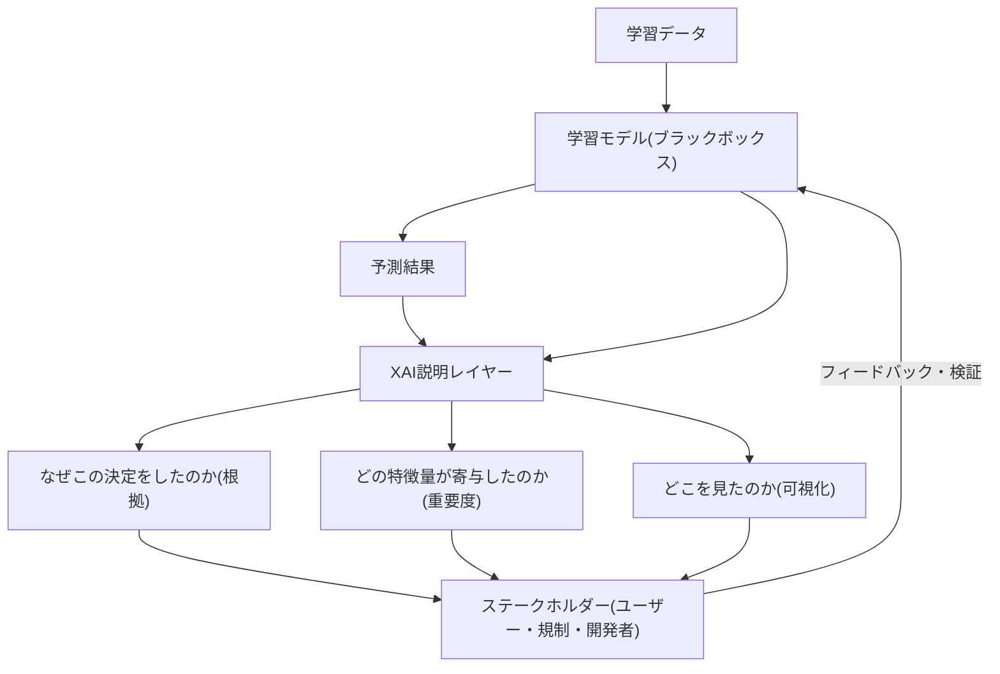
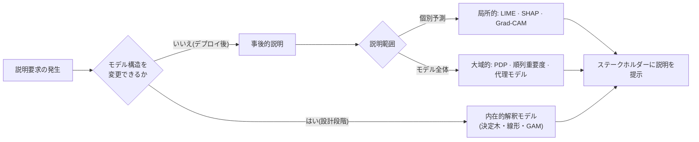

# 説明可能なAI(XAI, eXplainable AI)

## 1. 概要

> **定義**: 説明可能なAI(XAI)とは、ディープラーニングのように内部動作が不透明な**ブラックボックス(Black-box)モデル**の予測結果について、その根拠・寄与要因・意思決定過程を人間が理解できる形で提示し、**モデルの透明性(Transparency)・信頼性(Trust)・説明責任(Accountability)**を確保する技術と方法論の総称である。

XAIが台頭した背景には、ディープラーニングの性能向上と解釈可能性との間の**根本的なトレードオフ**がある。線形回帰・決定木のように構造が単純なモデルは、人がそのルールを直接読み取れるが表現力が限られる。反対に、数億〜数千億のパラメータを持つ深層ニューラルネットワークは高い精度を出すが、なぜその結論に至ったのかを内部の重みだけで説明することは難しい。性能が高まるほど解釈可能性が低下するというこの逆相関関係が、XAI研究を促した第一の動因である。

第二の動因は**規制と制度**である。EU GDPRは自動化された意思決定について、データ主体が説明を求めることができる権利(いわゆる「説明を求める権利」)を規定し、2024年に発効した**EU AI Act**は高リスク(High-risk)AIシステムに対して透明性・記録・人間による監督の義務を課している。韓国国内でも金融・医療・採用など個人の権益に重大な影響を及ぼす領域で、アルゴリズムの説明責任が強化される傾向にある。すなわちXAIは技術的な利便性ではなく、**法的・倫理的要求を満たすための必須要件**として定着したのである。

第三の動因は**実務上の必要性**である。医療診断において「がんである確率92%」という数値だけでは医師がその判断を採用しにくく、画像のどの病変領域が根拠であったかが併せて提示されてはじめて臨床での採用が可能になる。融資審査で拒否理由を提示できなければ、消費者紛争や差別をめぐる論争を避けられない。したがってXAIは、人間とAIが協働する**意思決定支援(Human-in-the-loop)** 体制の信頼の基盤となる。答案では、XAIを単なる可視化ツールではなく、**「AIの信頼性(Trustworthy AI)を実現する中核的な軸」**と規定するのが妥当である。

## 2. XAIの全体構造と概念

XAIは、学習済みモデルとその予測を入力として受け取り、ユーザー・規制機関・開発者などのステークホルダーが求める形の説明を生成するレイヤーとして理解できる。以下の概念図は、データ・モデル・説明・ステークホルダーへとつながる全体の骨格を示している。

XAIが答えようとする問いは大きく三つある。第一は**「なぜこの決定を下したのか」**であり、特定の予測の根拠を示す局所的(local)説明である。第二は**「モデルは全体として何を学習したのか」**であり、モデル全体の挙動を要約する大域的(global)説明である。第三は**「どうすれば結果が変わるのか」**であり、入力をどう変えれば別の結論になるかを示す反実仮想的(counterfactual)説明である。

ここで、**解釈可能性(Interpretability)**と**説明可能性(Explainability)**を区別する必要がある。前者はモデル構造そのものが透明で、人が内部の因果を直接把握できる性質(例: 決定木)を指し、後者はブラックボックスモデルの出力について事後的に根拠を再構成して提示する活動に近い。実務では、すでにデプロイされた高性能モデルをそのままにして説明を付与する事後的(post-hoc)アプローチが広く使われており、そのためXAIは「精度を犠牲にせずに信頼を確保する」という折衷的な性格を帯びる。

## 3. XAI手法の類型と動作手順

XAI手法は、適用時点(内在的/事後的)、適用範囲(局所的/大域的)、モデル依存性(モデル特化/モデル非依存)によって分類される。以下の図は、代表的な手法がこれらの軸に沿ってどのように配置されるかをプロセスの観点から示している。

**LIME(Local Interpretable Model-agnostic Explanations)**は、説明対象のデータポイント周辺をわずかに摂動(perturbation)させたサンプルを生成し、ブラックボックスモデルの応答を観察した上で、その局所領域を線形モデルで近似する。こうして得た線形モデルの係数が、各特徴量の局所的な寄与度となる。原理上モデル内部を知る必要のない**モデル非依存(model-agnostic)** 方式であるため適用範囲は広いが、摂動方法や近傍の定義によって説明が揺らぎ、再現性が低いという限界がある。

**SHAP(SHapley Additive exPlanations)**は、協力ゲーム理論の**シャープレイ値(Shapley Value)**を借用し、各特徴量を「ゲームの参加者」とみなして、予測値という報酬を特徴量が公平に分配されるよう寄与度を計算する。すべての特徴量部分集合について、当該特徴量の有無による限界寄与を平均するため、理論的に一貫性・局所正確性を満たす。ただし特徴量の数が増えると組み合わせが指数的に増加して計算量が大きくなるため、木モデル専用の高速アルゴリズム(TreeSHAP)などの近似が併用される。

**Grad-CAM(Gradient-weighted Class Activation Mapping)**は、画像分類CNNにおいて予測クラスに対する最後の畳み込み層の勾配を用い、入力画像のどの領域が判断に寄与したかをヒートマップで表示する。「モデルが犬を犬と分類したとき、実際に犬の胴体を見ていたのか、それとも背景の芝生を見ていたのか」を目で確認できるため、データの偏りや手がかりの誤学習(shortcut learning)を検出するのに特に有用である。

大域的説明としては、特徴量の値を変化させながら予測平均の変化を描く**部分依存プロット(PDP)**、特定の特徴量をランダムにシャッフルして性能低下の程度で重要度を測る**順列重要度(Permutation Importance)**、複雑なモデルの挙動を解釈可能な単純モデルで模倣する**代理モデル(Surrogate Model)** などがある。

## 4. 手法の比較と適用事例

各手法は万能ではなく、説明対象・データ形式・計算予算・要求される信頼水準によって選択が変わる。以下の比較は、代表的な手法の違いがどこから生じるのかと、その実務上の含意を併せて整理したものである。

| 手法 | 範囲 | モデル依存性 | 中核原理 | 長所 | 限界 |
|------|------|-------------|-----------|------|------|
| LIME | 局所 | 非依存 | 局所線形近似 | どのモデルにも適用可能 | 再現性・安定性が低い |
| SHAP | 局所+大域 | 非依存(専用高速版あり) | シャープレイ値の配分 | 理論的一貫性 | 計算コストが大きい |
| Grad-CAM | 局所 | CNN特化 | 勾配ベースの活性領域 | 視覚的な直感性 | 画像・CNNに限定 |
| 決定木/GAM | 大域 | 内在的 | 透明な構造 | 本質的に解釈可能 | 表現力・精度に制約 |

比較の要点は**「精度-解釈性-計算コスト」の三角トレードオフ**である。内在的解釈モデルは説明が完全であるが高難度の問題では性能が不足し、SHAPは理論的に優れているが大規模データではコストが大きく、LIMEは安価で汎用的であるが信頼度が落ちる。したがって、規制対応のように説明の一貫性が重要な領域にはSHAPを、迅速な探索的診断にはLIMEを、画像読影にはGrad-CAMを配置するといった**目的ベースの組み合わせ**が現実的である。

具体的な事例として**医療画像診断**が挙げられる。胸部X線で肺炎を分類するCNNにGrad-CAMを適用したところ、モデルが病変ではなく、特定の病院の撮影装置が残した画像のウォーターマークを手がかりに学習していたことが判明した研究事例が報告されている。精度指標だけを見れば90%台と優秀であったが、XAIがなければこの**疑似相関(spurious correlation)**を発見できないままデプロイされていたであろう。これは、XAIが性能指標の陰に隠れたリスクを明らかにする**モデル検証ツール**であることを示している。金融分野でも、融資拒否の際にSHAPの寄与度を根拠として「所得に対する負債比率と直近の延滞履歴が決定に最も大きく作用した」といった理由を提示し、規制遵守と消費者への説明を同時に満たす事例が広がっている。

## 5. 深掘り: LLM時代のXAIと最新動向

大規模言語モデル(LLM)の普及により、XAIの対象と方法も変化している。従来の特徴量重要度の手法は構造化データに最適化されており、数千億パラメータの生成モデルが「なぜこの回答を生成したのか」を説明するには限界がある。そこで、**アテンションの可視化(Attention Visualization)**によってトークン間の参照関係を見たり、思考過程を段階的に表出させる**思考の連鎖(Chain-of-Thought)** プロンプティングによって推論経路を自然言語で明らかにしたりするアプローチが注目されている。ただし、アテンションの重みがそのまま説明の因果であるとは断定しにくく、CoTが実際の内部演算を忠実に反映している保証はないという批判(説明の忠実性、faithfulnessの問題)が活発に議論されている。

もう一つの流れは、ニューラルネットワークの内部表現を回路レベルで解剖する**機械論的解釈可能性(Mechanistic Interpretability)**である。これは個々のニューロン・アテンションヘッドが担う機能を解明しようとする研究であり、モデルを事後的に近似する従来のXAIより一段階根本的なアプローチである。国際的には、米国DARPAのXAIプログラムがこの分野の体系的な研究を促し、NISTのAIリスクマネジメントフレームワーク(AI RMF)やISO/IECにおけるAI透明性の標準化の議論が、XAIを信頼性ガバナンスの要件として制度化しつつある。

技術士の観点から注目すべき想定出題の方向性は、▲XAI手法の比較(LIME vs SHAP)と選択基準 ▲AIの信頼性・EU AI Actなど規制との関連 ▲医療・金融など高リスクドメインへの適用時の考慮事項 ▲説明の忠実性・安定性などXAI自体の限界、である。答案構成の際は「手法の羅列」にとどまらず、**トレードオフと検証の観点**を併せて提示することが高得点の戦略である。

## 6. 考慮事項および示唆

技術士の観点から、XAI導入時に考慮すべき事項は次のとおりである。

- **説明の忠実性の検証**: もっともらしく見える説明が、実際のモデルの内部根拠と一致しているかを別途検証しなければならない。誤った説明はかえってユーザーを誤った確信へと導く(説明の錯覚)ため、説明自体の安定性・一貫性を定量評価する手続きを併行する。
- **対象となる受け手別の説明の差別化**: 規制機関・エンドユーザー・モデル開発者が求める説明の形と深さは異なる。開発者には特徴量の寄与度や回路分析が、ユーザーには反実仮想的・自然言語による説明が適しているため、**役割ベースの説明設計**が必要である。
- **性能-解釈性トレードオフの戦略的管理**: 一律に解釈可能なモデルを強制するよりも、リスク等級に応じて高リスク領域には内在的モデルや強力な事後説明を、低リスク領域には軽量な説明を配置する**リスクベースの差等適用**が合理的である。
- **ガバナンス・規制との整合**: EU AI Act、NIST AI RMF、韓国のAI基本法・信頼性認証などと連携し、説明の成果物を記録・監査可能な形で残して**説明責任(Accountability)**を確保する。
- **パイプライン統合と運用コスト**: XAIは一回限りの出力ではなく、MLOpsパイプラインに統合されて再学習・データドリフトのたびに更新されなければならず、SHAPなど高コストな手法の計算負荷を考慮したサンプリング・近似戦略を併用する。

XAIは、精度という単一の目標に隠れていた信頼・透明性・責任の価値を、AIのライフサイクル全体に取り戻す仕組みである。今後は事後説明を超えて**最初から説明可能となるよう設計する(interpretable-by-design)** 方向性と、LLMの内部を回路レベルで解明する機械論的解釈可能性とが結びつき、性能と信頼を同時に満たす次世代AIへと発展する見通しである。

---
> **一言まとめ**: XAIはブラックボックスモデルの予測根拠を人間が理解できる形で提示(LIME・SHAP・Grad-CAMなど)し、透明性・信頼性・説明責任を確保する技術であり、精度-解釈性-コストのトレードオフを目的・リスクに基づいて調整しながら、AIの信頼性と規制対応の中核的な軸をなす。
