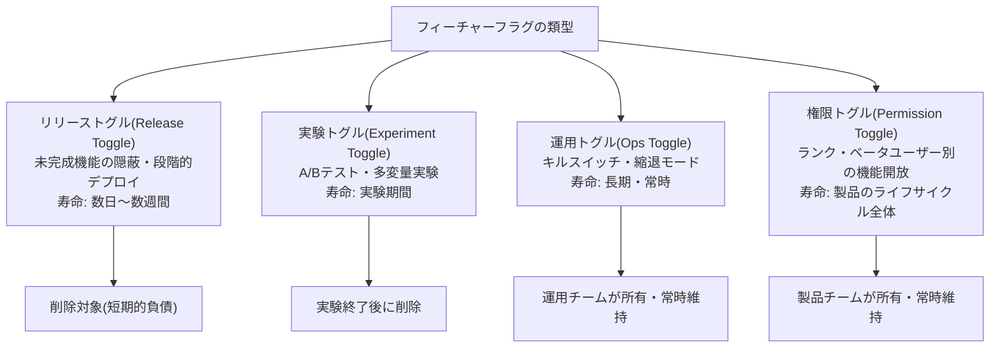
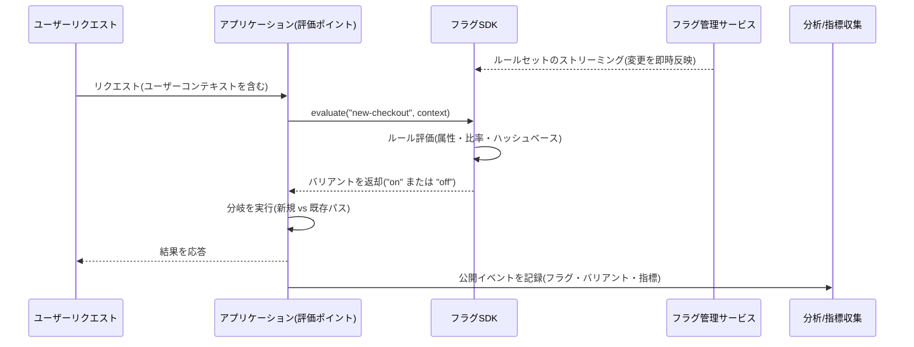

# フィーチャーフラグ(Feature Flag)と段階的デプロイ

## 1. 概要

### A. 定義

> **フィーチャーフラグ(Feature Flag、フィーチャートグル)**とは、コードを再デプロイすることなく、実行時(runtime)に特定機能の有効化の可否を条件付きで決定できるようにするソフトウェア構成手法である。

フィーチャーフラグの核心は、「デプロイ(deploy)」と「リリース(release)」を分離することにある。
従来の方式では、新機能を含むコードを本番サーバーにデプロイした瞬間に、ただちにすべてのユーザーにその機能が公開される。
すなわちデプロイ時点と機能公開時点が物理的に同一であるため、問題が発見されるとコードを元に戻すロールバック(rollback)デプロイを再度実施しなければならず、その間に障害が拡大する。
フィーチャーフラグは、機能を包む条件分岐をコードに埋め込んでおき、その分岐の真偽を外部の設定で制御する。
したがって、コードがすでに本番環境にデプロイされていてもフラグがオフであればユーザーには見えず、公開の可否はデプロイとは無関係にスイッチ一つで決まる。

この分離は単なる便利機能ではなく、リリースリスクを統制する制御装置である。
機能を少数のユーザーにのみオンにして反応を観察し(段階的公開)、異常があれば再デプロイなしに即座にオフにし(キルスイッチ)、ユーザー集団を分けてA案・B案を比較する(A/Bテスト)ことができる。
結果としてフィーチャーフラグは、デプロイパイプラインの速度を高めながらも、ユーザーに公開される変化の幅と速度を独立して調整する手段となる。

### B. 登場背景と必要性

フィーチャーフラグが広く使われるようになった背景には、開発方式の変化がある。
かつての長寿命ブランチ(feature branch)戦略では、機能を別ブランチで数週間開発した後に一括でマージしていたが、マージ時点に大規模なコンフリクトと統合欠陥が集中する「マージ地獄(merge hell)」が繰り返された。
これを避けるため、未完成のコードであっても頻繁にメインブランチへ統合するトランクベース開発(trunk-based development)が普及し、その際にまだ公開してはならない未完成機能を隠す手段として、フィーチャーフラグが必須となった。
すなわち「コードは統合するが機能は隠す」という要求が、フィーチャーフラグの一次的な必要性である。

第二の背景は、リリースリスクの増大である。
マイクロサービスと大規模なユーザー基盤においては、一つの誤ったリリースが数百万人に即座に波及する。
全面デプロイ後に問題が判明すると、ロールバックデプロイだけで数分から数十分かかり、その間に売上・信頼が損なわれる。
例えば決済画面を刷新する際に全ユーザーへ一度に公開し、特定のカード会社の決済が失敗した場合、原因究明とロールバックまでの時間に決済離脱が蓄積していく。
フィーチャーフラグで1%のユーザーにのみ先行公開していれば、影響範囲は1/100に縮小し、異常な指標が検知された時点で再デプロイなしにフラグをオフにして損失を遮断できる。

第三の背景は、実験文化の定着である。
Netflix・Booking.comなどはUI・推薦・価格ポリシーを常時実験で検証しており、この実験では同一のコードでユーザー集団だけを分け、それぞれに異なる体験を提供しなければならない。
フィーチャーフラグは、ユーザー属性(地域・会員ランク・デバイス)に応じて分岐を異なる形で評価することで、こうした実験をコード変更なしに可能にする。

### C. 適用目標と範囲

フィーチャーフラグの適用目標は、第一に未完成機能の隠蔽による継続的インテグレーション、第二に段階的公開によるリリースリスクの縮小、第三に障害時の即時遮断(キルスイッチ)、第四にデータに基づく意思決定のための実験基盤の提供である。
ただし、すべての条件分岐をフラグにするとコードが分岐の迷路となり、検証すべき経路が爆発的に増えるため、「公開を統制する価値のある変化」にのみ選択的に適用するのが原則である。

## 2. 類型とライフサイクル

フィーチャーフラグは見た目は同じ`if`分岐であるが、目的によって寿命・所有者・評価方式がまったく異なる。
この違いを区別できないと、実験用の一時的なフラグが恒久的な設定のように放置されたり、常時運用のフラグが早期に削除されて制御権を失ったりする。
以下の構造図は、代表的な四つの類型を目的と寿命の軸で配置したものである。

最も一般的な**リリーストグル**は、トランクベース開発において未完成機能を隠し、デプロイとリリースを分離するために使われる。
リリーストグルは、機能が全面公開されて安定化したら直ちに削除すべき短期的な資産であり、放置すればすぐに技術的負債となる。
例えば、新しい検索UIを2週間かけて段階的に公開し、100%に達したらフラグと旧コードパスを併せて削除するのが定石である。

**実験トグル**は、A/Bテストのためにユーザー集団を無作為に分け、各集団に異なるバリアントを見せる。
運用トグルとは異なり、統計的有意性を確保するために公開比率を固定し、実験期間が終わったら勝利したバリアントだけを残して削除する。

**運用トグル(キルスイッチ)**は性格が異なる。
これは特定の機能や負荷の大きい処理を障害発生時に即座にオフにしてシステムを保護するための常設スイッチであり、削除せずに運用チームが長期的に保有する。
トラフィック急増時に推薦ウィジェットをオフにして中核機能のみを維持する縮退モード(graceful degradation)が代表的な事例である。

**権限トグル**は、ユーザーのランク・ベータ参加の有無に応じて機能へのアクセスを開放するものであり、製品が存在する限り維持される長期的なフラグである。
このように類型ごとの寿命と所有者を明確にし、各フラグに作成日・有効期限予定日・担当者をメタデータとして記録してライフサイクルを管理しなければならない。

| 区分 | リリーストグル | 実験トグル | 運用トグル(キルスイッチ) | 権限トグル |
|------|-----------|----------|--------------------|----------|
| 主な目的 | デプロイ/リリースの分離 | A/B・多変量実験 | 障害分離・負荷制御 | ランク別の機能開放 |
| 評価基準 | 公開比率・集団 | 無作為割り当て | 運用者による手動/自動 | ユーザー属性 |
| 寿命 | 数日〜数週間(短期) | 実験期間 | 常時(長期) | 製品のライフサイクル |
| 変更頻度 | 頻繁(段階的拡大) | 実験終了時 | 障害発生時に即時 | まれ |
| 所有者 | 開発チーム | データ/製品チーム | 運用/SREチーム | 製品チーム |

## 3. アーキテクチャと評価フロー

フィーチャーフラグシステムは大きく、フラグのルールを保存・管理する**フラグ管理サービス**、ルールをアプリケーションに注入する**SDK/クライアント**、そして実際の分岐を評価する**評価ポイント(evaluation point)**で構成される。
以下の詳細図は、一つのリクエストが到着したときにフラグがどのように評価され、ユーザーに異なる体験が届けられるかを示している。

評価の核心は**一貫したハッシュ(consistent hashing)**にある。
同じユーザーが同じフラグについてリクエストするたびに異なるバリアントを受け取ると、画面がリクエストごとに変わってユーザー体験が損なわれ、実験データも汚染される。
そこでSDKは`ユーザーID + フラグキー`をハッシュ化して0〜99のバケットに割り当て、「10%公開」であればバケット0〜9に入ったユーザーにのみオンにする。
こうすることで、特定のユーザーはルールが変わらない限り常に同じバリアントを受け取り(スティッキーな割り当て、sticky bucketing)、公開比率を調整するだけで段階的な拡大が可能になる。

性能の観点で重要な原則は、**評価がローカルで行われなければならない**ということである。
リクエストのたびにリモートの管理サービスに問い合わせると、ネットワーク遅延と単一障害点が生じる。
そのため管理サービスはルールセットをSDKにストリーミングまたはポーリングで配信してローカルキャッシュに保持し、SDKはマイクロ秒単位でメモリ上で評価する。
管理サービスが一時的に切断されても、最後のルールとコードで指定したデフォルト値(default variation)で安全に動作する障害分離(fail-safe)設計が必須である。

段階的デリバリー(progressive delivery)は、この構造の上で行われる。
運用者は新機能をデプロイした後、公開比率を1% → 5% → 25% → 50% → 100%のように段階的に引き上げる。
各段階でエラー率・レイテンシ・コンバージョン率といった主要指標を観測し、指標が悪化すれば即座に前の段階へ戻すか0%にオフにする。
これはカナリアデプロイをインフラ(サーバー単位)ではなくユーザー(トラフィック単位)で実施するのと同じであり、サーバーを入れ替えることなく、より細かな統制が可能になるという利点がある。

## 4. 比較: フィーチャーフラグ vs ブランチ・環境分離

フィーチャーフラグが解決しようとする問題は他の手法でも部分的にアプローチできるが、それぞれ統制の時点と差し戻しのコストが異なる。
長寿命ブランチはコードを物理的に分離して未完成機能を隠すが、マージするまで統合検証が先送りされ、欠陥が遅く・一度に表面化する。
ステージング環境の分離はデプロイ前の検証には有効であるが、実際の本番トラフィック・データでのみ現れる問題を捉えられず、本番での公開を細かく調整することもできない。
これに対しフィーチャーフラグは、本番環境で実ユーザーを対象に公開の幅をリアルタイムに調整するため、差し戻しのコストが最も低い。

| 手法 | 統制の時点 | 未完成の隠蔽 | 運用中の段階的公開 | 差し戻しコスト | 主な弱点 |
|------|----------|-----------|-----------------|-----------|----------|
| 長寿命ブランチ | マージ時点 | 可能 | 不可 | 高い(再デプロイ) | マージ地獄・遅い統合 |
| 環境分離(ステージング) | デプロイ前 | 可能 | 不可 | 中程度 | 本番トラフィックを反映しない |
| ブルー/グリーン・カナリアデプロイ | デプロイ時点 | 限定的 | サーバー単位 | 中程度(トラフィック切替) | ユーザー単位の細分化が困難 |
| フィーチャーフラグ | 実行時点 | 可能 | ユーザー単位 | 低い(スイッチ) | フラグ負債・分岐の複雑さ |

違いが生じる根本的な理由は、「制御権をいつ行使するか」である。
ブランチ・環境はコードがユーザーに届く前に一度だけ決定を下すが、フィーチャーフラグはコードがすでに届いた後、リクエストのたびにその時点で決定を下す。
この実務上の含意は大きい。
フラグはデプロイパイプラインを止めることなく障害に対応できるため平均復旧時間(MTTR)を大きく短縮するが、その代償として「オンになった組み合わせの数だけ検証負担が増える」というコストをコードに残す。
例えば独立したフラグが10個あれば理論上2^10=1024通りの組み合わせが存在するため、実際には相互依存するフラグをグループ化し、組み合わせを制限して検証可能な範囲で管理しなければならない。

## 5. 深掘り: 実務適用とフラグの技術的負債の管理

フィーチャーフラグにおける最大の実務リスクは、機能ではなく**削除されないフラグの蓄積**である。
リリーストグルは本来数週間以内に削除すべきものであるが、「念のため」に残しておくと、コードのあちこちに死んだ分岐が積み重なる。
2012年のナイト・キャピタル(Knight Capital)の事故は、再利用された古いフラグが廃止済みのコードパスを復活させ、45分で約4億4千万ドルの損失を出した事例として引用され、放置されたフラグがいかに致命的になり得るかを示している。
したがって成熟した組織は、フラグごとに有効期限を付与し、期限切れのフラグを静的解析・ダッシュボードで常時追跡し、整理作業をスプリントの定常活動に組み込んでいる。

ガバナンスの観点からは、フラグがそのまま本番環境の動作を変える「設定変更」であることを認識しなければならない。
誰がどのフラグをいつ変更したかの監査ログを残し、キルスイッチのように影響の大きいフラグには変更承認・ロールベースアクセス制御(RBAC)を適用する。
フラグの変更はコードのデプロイと同じくらい危険になり得るため、変更履歴・ロールバックボタン・変更通知を備えた専用の管理ツール(LaunchDarkly、Unleash、Flagsmith、または自社構築)によって統制するのが望ましい。

計測との結合も深掘りのポイントである。
段階的デプロイが意味を持つには、各公開段階で自動的に指標を比較して異常を検知し、自動ロールバックまでつなげる可観測性(observability)との連携が必要である。
フラグの公開イベントを指標収集パイプラインに流し、「バリアントAのエラー率がBより統計的に有意に高い」と自動判定すれば、人がダッシュボードを見張っていなくても安全に拡大・遮断できる。
これこそが、単なるトグルを超えたプログレッシブデリバリーの完成形である。

## 6. 考慮事項および示唆

技術士の観点から、フィーチャーフラグの導入は単なるライブラリの選択ではなく、リリースガバナンス・組織プロセス・技術的負債の管理を包括する意思決定である。

- **適用戦略(選択的導入):** すべての分岐をフラグにするのではなく、公開を統制する価値のある変化(外部公開機能、リスクの高い移行、実験対象)にのみ適用する。無分別なフラグ化は組み合わせの爆発と検証コストを招くため、導入初期に命名規則・類型分類・所有者指定の標準を併せて策定しなければならない。
- **トレードオフ(速度 vs 複雑度):** フラグはデプロイとリリースを分離してリリースの速度と安全性を高めるが、コードに条件分岐と死んだパスを残し、複雑度とテスト負担を増大させる。このトレードオフは「フラグの期限切れ・削除をどれだけ規律正しく実行するか」で決まるため、作成と同じだけ削除を強制するプロセスが重要成功要因である。
- **障害分離の設計:** フラグ管理サービスは新たな単一障害点になり得るため、ローカルキャッシュでの評価・デフォルト値の指定・サービス切断時の最終ルール維持(fail-safe)を必ず設計する。キルスイッチそのものが障害で動作不能になれば、災害時に最後の防衛線を失う。
- **セキュリティ・ガバナンス:** フラグの変更は運用動作を変える特権的な行為であるため、RBAC・承認手続き・監査ログを適用し、機微なフラグ(決済・認証関連)には二重承認を要求する。実験トグルは、個人情報に基づくターゲティングを行う場合、プライバシー規制の遵守も併せて検討しなければならない。
- **関連技術と展望:** フィーチャーフラグは、トランクベース開発・CI/CD・カナリアデプロイ・A/Bテスト・可観測性と組み合わせたときに価値が最大化する。今後は、指標の自動判定と自動ロールバックを組み合わせたプログレッシブデリバリー、そしてルール自体をポリシーコード(policy as code)としてバージョン管理する方向へ発展する見通しである。

## 参考資料
- Martin Fowler, "Feature Toggles (aka Feature Flags)", https://martinfowler.com/articles/feature-toggles.html
- Pete Hodgson, "Feature Flags Best Practices", https://featureflags.io/
- OpenFeature (CNCF) 公式ドキュメント, https://openfeature.dev/
- Unleash Documentation, https://docs.getunleash.io/

---
> **一言まとめ**: フィーチャーフラグはデプロイとリリースを分離し、実行時に機能の公開を制御する手法であり、段階的デプロイ・キルスイッチ・A/B実験を再デプロイなしに可能にするが、フラグ負債を規律正しく削除することが成功の鍵である。
