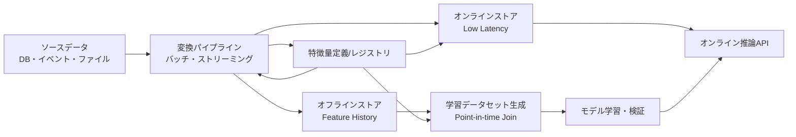
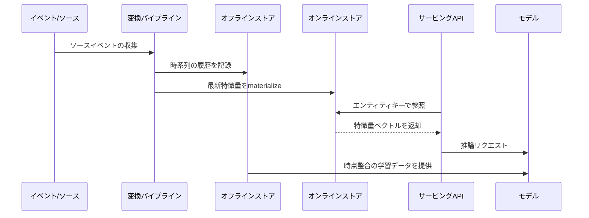

# フィーチャーストア(Feature Store)と機械学習データ運用

## 1. 概要

> **定義**: フィーチャーストア(Feature Store)とは、ソースデータを機械学習モデルが利用できる特徴量(フィーチャー)として生成・検証・保存・検索・配信する共通プラットフォームであり、学習(オフライン)と推論(オンライン)において同一の特徴量定義と品質を再利用できるようにするデータ運用体系である。

機械学習プロジェクトがPoCを超えてサービスへと拡大すると、モデルのアルゴリズムよりもデータ準備と運用の反復コストのほうが大きくなる。
チームごとにSQLやPythonで同じ顧客・商品・取引の指標を計算し直すと定義がばらつき、学習データと本番推論データの分布が食い違う。
バッチ学習では数時間かかる集計も許容されるが、リアルタイムの不正検知やパーソナライズ推薦では数十ミリ秒以内に特徴量を返さなければならない。
したがって特徴量を単なるカラムではなく、再現可能かつ観測可能なデータプロダクトとして管理する必要がある。

フィーチャーストアはこの問題を、特徴量定義の一元化、オフライン・オンラインストアの分離、時点整合学習、オンラインの低遅延参照、リネージと品質管理に分解する。
モデル開発者は保存方式の実装詳細よりも、どのエンティティに、どの期間のデータを、どの変換で適用するかに集中できる。
プラットフォーム運用者は、同一の定義をバッチパイプラインとストリーミングパイプラインに接続し、学習と推論の再現性を高める。

このテーマの核心は製品名を暗記することではなく、特徴量のライフサイクルをデータガバナンスとMLOpsの中に位置づけることである。
ソースイベントが収集され、変換された特徴量が検証され、オフライン学習とオンライン推論に提供される全過程を、一つの論理モデルとして説明しなければならない。
特に、未来の情報が学習に混入するデータリーク、オンライン・オフラインの値の不一致、特徴量の鮮度低下、個人情報の過剰露出を併せて統制しなければならない。

## 2. 登場背景と必要性

### 2.1 従来型モデル開発のボトルネック

初期のモデルでは、ノートブックや分析用SQLで特徴量を直接作成する。
この方式は仮説を素早く検証するには有利であるが、同じ変換を複数のモデルやチームがコピーすることで、コードと定義が分散してしまう。
開発者が交代すると、指標の意味と算式、利用可能な時点、欠損値処理のルールを改めて追跡しなければならない。

例えば「直近30日の購入回数」という名前があっても、あるチームはキャンセル注文を除外し、別のチームは決済承認時刻を基準に集計しているかもしれない。
二つのモデルが異なる特徴量を使いながら同じ名前を用いると、実験結果の比較が難しくなり、運用障害の原因を突き止めにくくなる。
フィーチャーストアは、名前だけでなく定義、エンティティキー、時間基準、所有者、品質ルールを併せて登録させる。

本番デプロイの段階では、また別の問題が発生する。
学習時にはデータウェアハウスで特徴量を結合するが、サービスではリクエストのたびにデータベースを何度も参照しなければならず、遅延と負荷が増加する。
オンラインストアに事前計算した値を保持すれば参照経路を単純化できるが、バッチ計算が遅れたりイベントが欠落したりすると、古い値を返す可能性がある。
したがってフィーチャーストアはストアを一つに統一するツールではなく、目的に応じて経路を分離し、一貫性を管理する構造である。

### 2.2 導入目的

第一に、特徴量の再利用によって開発リードタイムを短縮する。
顧客の活動量、商品の人気度、デバイスのリスク度のように複数のモデルが共通して使う特徴量を一度定義し、複数のモデルに提供する。
再利用はコードの重複を減らすだけでなく、検証済みの算式を組織の標準資産へと転換するという意味を持つ。

第二に、学習-サービング間の偏り(training-serving skew)を緩和する。
学習データとオンライン推論で同一の変換ロジックと定義を用いれば、開発環境と本番環境の意味の差を縮めることができる。
完全な同一性を保証するには、処理時間、丸め、欠損値、遅延イベントに関するポリシーまで明示しなければならない。

第三に、モデル運用をデータ運用と結びつける。
特徴量ごとの鮮度、欠損率、分布変化、参照エラーを監視すれば、モデル性能低下の原因をデータの観点から迅速に切り分けることができる。
これは、モデルの精度だけを見る方式から、サービスレベル目標とデータ品質目標を併せて見る方式への転換を促す。

## 3. 中核概念と構成要素

### 3.1 全体構造

上記の構造において、レジストリは特徴量の名前だけを保存する一覧ではない。
特徴量がどのエンティティをキーとするのか、どの時間ウィンドウと集計式を使うのか、どのチームが所有するのか、どのストアにマテリアライズされるのかを記述するメタデータ層である。
定義とデータが分離されていても、実行時には同一の契約で結ばれていなければならない。

ソースデータは、取引テーブル、アプリケーションログ、メッセージイベント、センサーストリーム、外部データなどで構成される。
ソースのスキーマが変わったりイベントが遅延したりすると、特徴量の意味と鮮度に影響するため、スキーマ契約と変更管理が必要である。
変換パイプラインは、ソースを直接モデルに渡すのではなく、再利用可能な特徴量の集合を作り出す。

### 3.2 主要用語

エンティティ(entity)とは、特徴量が帰属する業務上の対象を意味する。
顧客ID、商品ID、アカウントID、車両IDといったエンティティキーがあってはじめて、複数のソースの値を同じ対象に結合できる。
一つの特徴量が顧客と商品のように複数キーの組み合わせに帰属する場合は、複合エンティティとキー生成ルールを明確にしなければならない。

特徴量(feature)とは、モデル入力として用いられる数値・カテゴリ・ベクトル・時間ベースの属性である。
「直近7日のログイン回数」「商品の1時間平均閲覧数」「顧客の平均決済金額」はソース属性ではなく、変換を経た派生特徴量である。
カテゴリ値をエンコードした結果や埋め込みベクトルも、提供方式とバージョンを管理するのであれば特徴量として扱うことができる。

フィーチャービュー(feature view)とは、一つ以上の特徴量とエンティティ、時間基準、変換ロジックを束ねた論理的な提供単位である。
同じ顧客エンティティを基準に直近1日・7日・30日の活動量をまとめて提供すれば、モデルは必要な時間窓を一貫して利用できる。
フィーチャービューの変更はモデル入力契約の変更であるため、後方互換性、バージョン、廃止スケジュールを併せて管理する。

オフラインストアは、過去の特徴量の値を時刻とともに保管する。
モデル学習、バックテスト、再現性検証、データ探索では特定時点の値を復元する必要があるため、大容量の分析ストアとカラム指向フォーマットが適している。
オンラインストアは、最新または特定の有効時点の値を低遅延で返す。
キーバリュー参照に最適化され、保存容量・TTL・レプリケーション・フェイルオーバーのポリシーが重要となる。

レジストリは、特徴量の定義、説明、型、タグ、所有者、承認状態、バージョン、リネージを管理する。
カタログがなければ使われない特徴量が溜まり続け、個人情報を含む特徴量が目的外に再利用されるおそれがある。
レジストリは検索性と統制性を提供するが、実際の値の品質を代わりに保証するものではないため、パイプラインの検証とあわせて運用する。

### 3.3 オンライン・オフラインの保存経路

バッチ経路は、一定周期で過去データを再計算し、オフラインストアに格納する。
大量の再処理や過去時点の復元には強いが、計算周期の分だけ値が遅れる。
ストリーミング経路はイベントの到着時に状態を更新するためリアルタイム性が高いが、順序の入れ替わり・重複・欠落・遅延イベントを処理しなければならない。

オンラインへのマテリアライズは、オフラインの検証済みの値をオンラインストアへコピーする方式と、ストリーム計算の結果を直接オンラインに書き込む方式に分けられる。
前者は学習と推論の定義を揃えやすいが遅延が発生し、後者は鮮度に優れるが再処理と一貫性の設計が難しい。
業務上の許容遅延と正確性の要求を基準に、特徴量ごとに経路を決定しなければならない。

## 4. 特徴量のライフサイクルとデータ運用

### 4.1 定義と契約

特徴量の定義には、少なくとも名前、説明、データ型、エンティティキー、イベント時刻、集計期間、デフォルト値、欠損値ルール、所有者、セキュリティ分類を含める。
「直近24時間の取引回数」であれば、現在時刻を含むのか、キャンセル取引をどう扱うのか、タイムゾーンは何かまで契約として残さなければならない。
契約が曖昧であれば、同じパイプラインでも再実行時に値が変わり得る。

特徴量の名前は業務上の意味を表すべきであり、チーム内部の略語だけで命名しない。
例えば`cust_7d_txn_cnt`のような技術的な名前を使う場合でも、人が読める説明と単位を併せて登録する。
数値の単位、スケール、許容範囲、カテゴリ値の集合を明示すれば、入力検証と外れ値検知が可能になる。

特徴量の定義は、コードとしてバージョン管理するのが望ましい。
変換コード、スキーマ、テスト、レジストリのメタデータを一緒にレビューすれば、変更理由を追跡できる。
画面上で値を直接修正するだけの方式は再現性と承認履歴を弱めるため、本番環境では避けるべきである。

### 4.2 時点整合とデータリーク

時点整合(point-in-time correctness)とは、予測時点で実際に知り得たデータのみを学習に含めるという原則である。
予測時点が6月30日12時であれば、7月1日に確定した決済結果や事後に訂正された状態を6月30日の特徴量として使用してはならない。
未来の情報が混入すると検証精度は高くなるが、実際のサービスでは性能が急落する。

時刻カラムは、イベントが発生した時刻とシステムに到着した時刻を区別しなければならない。
センサーやメッセージは遅れて到着することがあるため、遅延イベントの許容範囲と補正ポリシーを定める。
学習データの結合では、エンティティキーが同じで、特徴量の時刻が観測時刻より過去である最新のレコードを選択しなければならない。

以下は、リークのリスクを減らすためのチェック項目である。

| チェック領域 | 確認すべき問い | 対応例 |
|---|---|---|
| 時間 | 特徴量の値が予測時点以降に確定していないか? | イベント時刻基準の結合、未来の行を除外 |
| ラベル | ラベル生成に使った情報が特徴量に再利用されていないか? | ラベル・特徴量のソース分離、レビュー承認 |
| 集計 | ウィンドウの右端が予測時点を超えていないか? | 半開区間`[t-window, t)`を適用 |
| 訂正 | 事後の訂正・取消が過去の学習値を上書きしていないか? | 履歴の保持、有効時点と処理時点の分離 |
| 欠損 | 未来になって初めて埋められた欠損値が学習に入っていないか? | 観測時点基準での欠損処理 |

時点整合は、オフラインデータセット生成器の中核的なテスト項目である。
任意の基準時刻を作り、それ以降に生成されたイベントが学習行に反映されていないかを自動的に検査する。
このテストがなければ、モデルの評価数値だけでリークに気づくことは難しい。

### 4.3 品質・鮮度・分布の管理

特徴量の品質は、正確性、完全性、妥当性、一貫性、適時性に分けて測定する。
正確性は業務ソースと値が一致しているか、完全性は欠損と欠落が許容水準にあるか、適時性は定義されたSLA内に最新の値が到着したかを意味する。
同じ特徴量であっても、業務リスクに応じて品質のしきい値とアラートの優先度は異なる。

鮮度は、最後の正常な更新時刻と現在時刻との差で管理できる。
リアルタイムの不正スコアの許容遅延は分単位かもしれないが、月次の顧客ランクであれば1日単位の遅延も許容できる。
特徴量ごとに`freshness_sla`、`null_rate`、`range_violation`、`row_count`のような指標を定め、モデルサービスのSLOと結びつける。

分布の変化は、平均と分散だけでは判断しにくい。
カテゴリ分布、分位数、欠損パターン、エンティティごとの偏りを併せて見て、学習時の基準分布と推論時の分布を比較する。
変化が見つかった場合は、ソースイベントの変化なのか、パイプラインの誤りなのか、実際の業務環境の変化なのかを切り分けた上で、再学習の要否を判断する。

### 4.4 変換方式と再利用

変換は、ソースから派生値を計算する事前変換と、モデル実行直前に計算するリクエスト時変換に分けられる。
事前変換は参照遅延と推論コストを減らすが、保存コストと更新管理が必要となる。
リクエスト時変換は最新のソースを反映しやすいが、外部依存による遅延やオンライン・オフラインのロジック不一致のリスクが大きくなる。

共通の変換はプラットフォームが提供し、モデル固有の変換はモデルチームが所有するという境界を定めることができる。
ただし所有権が分かれる場合、入力スキーマとバージョンの契約が必須となる。
変換関数が非決定的であったり現在時刻に依存していたりすると、同じ学習データの再生成が難しくなるため、基準時刻を明示的に渡す。

## 5. 実装手順と運用アーキテクチャ

### 5.1 導入手順

最初の段階は、モデルの一覧を作ることではなく、業務上の意思決定と遅延要求を分類することである。
不正の遮断、推薦の順位付け、解約予測、設備の異常検知のように、判断時点と許容誤差が異なるケースを区別する。
各ケースについて、エンティティ、予測時点、特徴量の更新周期、参照遅延、保存期間を導き出す。

第二に、ソースイベントとスキーマを調査する。
データの所有者、意味、変更周期、品質上の問題、個人情報の分類を確認し、特徴量の候補とリネージを結びつける。
ソースがイベント時刻と処理時刻を併せて提供していなければ、時点整合学習のためにまず収集設計を補完しなければならない。

第三に、オフライン学習の経路を先に検証する。
過去の基準時刻でデータセットを再現し、リーク・重複・欠損・分布をテストした上で、小さなモデルで効果を確認する。
オンラインストアを先に作り、後からデータの意味を整理すると、本番トラフィックは生まれても特徴量の信頼性は確保されない。

第四に、オンライン経路を段階的に開放する。
参照APIのタイムアウト、キャッシュ、デフォルト値、障害時のfallback、特徴量のバージョン、アクセス制御を定め、shadow trafficでオフライン・オンラインの値を比較する。
モデルの予測結果だけでなく、特徴量参照の成功率と鮮度も併せて観察しなければならない。

### 5.2 オンラインサービングのパターン

オンライン参照では、単一エンティティの複数の特徴量を一度に取得するバッチ参照が一般的である。
モデルが必要とする特徴量を個別のAPIで呼び出すと、ネットワークの往復が増え、一部の値だけが最新という混在したスナップショットが生じる可能性がある。
可能であれば、同一の有効時刻とバージョンの特徴量ベクトルをアトミックに提供する。

キャッシュは応答遅延とストアの負荷を減らすが、TTLが鮮度要求より長くならないようにしなければならない。
キャッシュの無効化失敗が続くと、モデルは正常な応答を受け取っていても古い値を使うことになる。
機微性の高い取引リスクの特徴量については、キャッシュキーと保存時間に個人情報やセキュリティ上のリスクがないかを検討する。

ストア障害時にはデフォルト値で代替できるが、すべての欠損を0に置き換えるとモデルの意味が変わってしまうことがある。
特徴量ごとのデフォルト値と「値なし」状態を区別し、fallbackの発生を別途メトリクスとログに残す。
業務上、安全な遮断や保守的な判定が必要な場合には、モデル呼び出しそのものを中止するポリシーも検討する。

### 5.3 バッチ・ストリーミング処理の統合

バッチ処理は、大規模な再計算と過去の復元に適している。
ストリーミング処理は直近のイベントを素早く反映するが、重複排除、順序保証、状態保存、ウォーターマーク、再処理戦略が必要となる。
二つの経路が同じ特徴量を作る場合は、算式と境界条件を共有し、結果の差異を継続的に比較しなければならない。

代表的な統合方式は、バッチが基準となる履歴を作り、ストリームが直近区間を補正するラムダ型の構造である。
この方式は迅速な更新と再現性の両方を得られるが、二つの計算経路の重複と整合性管理のコストが発生する。
単一ストリーム処理の構造はロジックを単純化できるが、長期間の履歴再生成と大規模なバックフィルのコストを別途設計しなければならない。

## 6. 比較と事例

### 6.1 データウェアハウスへの直接参照との比較

データウェアハウスへの直接参照は、既存のSQLとストアを活用できるため初期コストが低い。
しかし、モデルAPIのリクエストごとに複雑な結合と集計を実行すると遅延と同時実行性の問題が発生し、モデルチームごとにクエリ定義が複製される。
フィーチャーストアは、オンラインの値を事前にマテリアライズし、定義を共有することで反復コストを削減する。

一方で、フィーチャーストアには別途のプラットフォームと運用人員が必要である。
すべての特徴量をオンラインに保存すると保存コストと同期の複雑さが増すため、遅延要求の低いモデルはウェアハウスでのバッチ推論のまま残すのが合理的な場合もある。
選択基準は流行の製品ではなく、推論遅延、再利用率、品質統制、個人情報リスクの組み合わせでなければならない。

| 区分 | ウェアハウス直接参照 | フィーチャーストア |
|---|---|---|
| 主な目的 | 分析・バッチデータ処理 | 学習・推論用の特徴量提供 |
| オンライン遅延 | 結合と負荷によって変動 | 事前格納により低く設計可能 |
| 再利用 | クエリが複製されやすい | レジストリに基づく共有 |
| 時点整合 | 別途実装が必要 | 学習データ生成機能で標準化 |
| 運用負担 | 既存プラットフォームを活用 | ストア・パイプライン・サービングの運用が追加 |
| 適したケース | バッチスコア、探索、レポート | リアルタイム推薦、不正検知、パーソナライズ |

### 6.2 推薦サービスの事例

オンラインショッピングモールの推薦モデルが、顧客ごとの直近閲覧商品数と商品ごとの直近購入コンバージョン率を使うと仮定する。
閲覧イベントはストリームで流入し、商品のコンバージョン率は直近1時間の窓と7日間の窓でそれぞれ計算できる。
顧客キーと商品キーは互いに異なるため、推薦リクエスト時に二つの特徴量セットを結合するか、モデル入力用のベクトルとして組み合わせる。

フィーチャーストアは、閲覧イベントの重複を排除し、直近の活動量をオンラインストアに更新する。
7日間のコンバージョン率はバッチ経路で精密に再計算し、直近1時間の値はストリーム経路で更新するように分離することができる。
推薦レスポンスに特徴量のバージョンと更新時刻を記録しておけば、特定の結果がどのデータ状態から生成されたかを説明できる。

新商品は購入履歴が不足しているため、コンバージョン率が欠損となる。
このとき全体平均で代替すると新商品の露出が減るコールドスタート問題が生じ得るため、カテゴリ平均、コンテンツ特徴量、探索ポリシーを併せて考慮する。
この事例は、フィーチャーストアが保存技術にとどまらず、製品ポリシーとモデル運用をつなぐものであることを示している。

### 6.3 不正検知の事例

決済承認の時点で、アカウントの直近10分の取引回数、直近24時間の失敗回数、デバイスとアカウントの関係数を参照すると仮定する。
この業務では、古い値が不正取引を通過させたり正常な顧客をブロックしたりしかねないため、鮮度と可用性の優先度を高く設定する。
特徴量の参照がタイムアウトした場合、保守的な遮断、追加認証、手動レビューのうちどのポリシーを選択するかを業務部門と合意しなければならない。

学習データには、承認時点までに観測された値のみを含めなければならない。
事後に確定したチャージバックの結果を取引直前の特徴量に含めると、検証結果が過大評価される。
また、アカウント・デバイスの関係グラフは個人情報と結びつき得るため、最小限の収集、アクセス制御、保存期間、目的外利用の制限を適用する。

## 7. 深掘り: MLOps・ガバナンスと拡張の方向性

### 7.1 特徴量をデータプロダクトとして管理

特徴量の利用者はモデル開発者だけでなく、データエンジニア、リスク管理者、監査人でもある。
したがってレジストリには技術的なメタデータだけでなく、業務上の定義、品質指標、承認者、影響を受けるモデル、廃止計画を併せて管理しなければならない。
特徴量が多くのモデルで使われるほど、変更の影響分析と利用者への通知が重要となる。

特徴量の契約テストは、提供者と利用者の間の期待を自動的に確認する。
提供者はスキーマと範囲を保証し、利用者は必要なバージョンと許容欠損率を宣言する。
契約が破られた場合はデプロイを中止するか、当該モデルを隔離して、障害がサービス全体に波及しないようにする。

### 7.2 モデル性能と特徴量ドリフトの関連付け

精度の低下を発見したときに、ただちにモデルを再学習することが常に正解とは限らない。
特徴量の分布が変わったのか、ラベルの遅延があるのか、ソースのスキーマが変わったのか、ユーザーの行動そのものが変化したのかをまず切り分けなければならない。
特徴量のリネージと監視を結びつければ、ソースイベントからモデル指標までの影響経路を追跡できる。

ドリフトのしきい値は、すべての特徴量に同じ値を適用しない。
金額・リスクスコア・規制報告用の特徴量はわずかな変化も重要になり得るし、季節性の大きい訪問数の特徴量は正常な周期変動を考慮しなければならない。
ベースラインは、学習期間、直近の正常期間、業務イベント期間に分けて運用するのが有利である。

### 7.3 ストリーミング・ベクトル・生成AIとの連携

リアルタイムの特徴量は、イベントストリームと状態保存技術の組み合わせによって拡張される。
モデルが直近の行動の順序や頻度を使う場合、単純な最新値よりも時間窓とイベントの順序を保持する状態管理が重要になる。
その際、再処理時に同じ結果が得られるよう、イベントキーと処理保証レベルを明示する。

埋め込みとベクトル検索を必要とする生成AIアプリケーションにおいても、文書の最新性、アクセス権限、評価結果といった運用上の特徴量が必要である。
ただし、埋め込みベクトルは原文とは異なる形で機微情報を含み得るため、ベクトルストアをフィーチャーストアと無条件に統合してはならない。
検索品質・セキュリティ・削除要求を基準に、メタデータとベクトルのライフサイクルを分離または連携させる。

## 8. 考慮事項および示唆

### 8.1 正確性と再現性

特徴量の値は、いつでも再生成できなければならない。
基準時刻、コードのバージョン、ソースのスナップショット、パラメータ、タイムゾーンが残っていてはじめて、同一の学習データとモデル評価を再現できる。
再現性のない特徴量は、監査や障害分析において説明責任を果たすことが難しい。

### 8.2 性能とコストのバランス

すべての特徴量をリアルタイムで計算すると鮮度は高まるが、ストリーム処理・保存・観測のコストが増大する。
業務が許容する最大遅延と正確性の損失を数値化し、特徴量ごとにバッチ・マイクロバッチ・ストリームを選択する。
オンラインストアのレプリケーションと高可用性のコストも、モデルの呼び出し量と失敗時のコストを併せて見て決定する。

### 8.3 セキュリティと個人情報保護

特徴量は原文でなくとも、個人の行動やリスクを推論できる派生情報である。
機微情報の分類、最小権限、暗号化、行・列レベルのアクセス制御、参照の監査ログ、目的別タグを適用する。
削除要求が発生した場合に、オフラインの履歴、オンラインのキャッシュ、バックアップ、派生モデルのどこまでを処理するかを事前に定めておかなければならない。

### 8.4 一貫性と障害対応

オンライン・オフラインの値が異なると、モデルの性能と説明結果が揺らぐ。
同一の入力を二つの経路に流して値の差を比較し、許容誤差を超えた場合はデプロイを遮断する検証を設ける。
ストア障害と遅延イベントに対して、デフォルト値・キャッシュ・再試行・サーキットブレーカー・手動判定の優先順位を設計する。

### 8.5 組織と責任

プラットフォームチームが共通インフラと標準を提供し、ドメインチームが特徴量の業務上の意味と品質に責任を持つ構造が適切である。
所有者のいない共用の特徴量は変更も廃止も難しいため、データプロダクトごとに責任者と利用者との取り決めを指定する。
モデルの承認手続きには、特徴量のリネージ、個人情報の分類、リークテスト、オンライン性能を含めなければならない。

### 8.6 技術士の観点からの示唆

フィーチャーストアはMLOpsの付属ストアではなく、データアーキテクチャ・AIガバナンス・サービス運用をつなぐ統合レイヤーである。
導入の順序は、製品のインストールよりも、業務の優先順位、データ契約、時点整合、品質SLO、セキュリティ統制を先に確立する方式でなければならない。

今後は、特徴量定義のコード化、自動品質検証、リアルタイム・バッチの統合、モデルの説明とリネージの連携が強化されるであろう。
技術士は特定プラットフォームの機能一覧よりも、特徴量を再現可能なデータプロダクトとして設計し、コスト・性能・規制・組織の責任を併せて最適化するアーキテクチャを提示しなければならない。

## 参考資料

- Feast公式ドキュメント: https://docs.feast.dev/
- TensorFlow TransformおよびTFX Feature Engineering: https://www.tensorflow.org/tfx/guide/transform
- Google Cloud Vertex AI Feature Store概要: https://cloud.google.com/vertex-ai/docs/featurestore/overview
- AWS SageMaker Feature Store開発者ガイド: https://docs.aws.amazon.com/sagemaker/latest/dg/feature-store.html
- MLflow公式ドキュメント: https://mlflow.org/docs/latest/

---

> **一言まとめ**: フィーチャーストアは、特徴量定義・時点整合・オフライン学習・オンライン低遅延サービング・品質・セキュリティを一つのライフサイクルとして管理し、機械学習の再現性と運用上の信頼性を高めるデータプラットフォームである。
