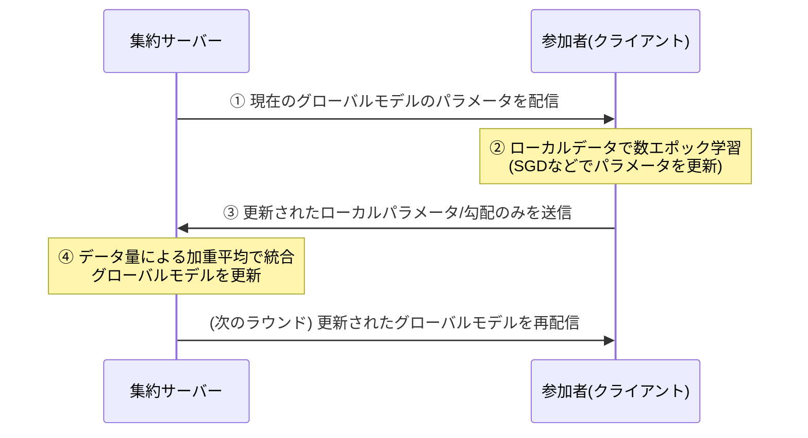

# 連合学習(Federated Learning)

## 1. 概要

### A. 定義
> **連合学習(Federated Learning)** とは、学習データを一か所に集めることなく、**各デバイス・機関に元データをそのまま置いたまま、ローカルで学習したモデル(パラメータ・勾配)だけを中央に集めて一つのグローバルモデルに統合**する分散AI学習手法である。元データが物理的に移動しないため、プライバシーを保護しながらも、複数の主体のデータで学習した場合と同等の性能を得られる。

連合学習の核心的な発想は、「**データをモデルに送るのではなく、モデルをデータに送れ(bring the model to the data)**」に要約される。従来の中央集中型AI学習では、複数の場所に散在するデータを中央サーバーにコピー・収集した上で学習する。この方式では、データが一か所に集まった瞬間に大規模な漏洩・悪用のリスクを抱えることになり、医療記録・金融取引・個人の会話のように機微なデータは、そもそも法律・プライバシー上の問題から機関の外に持ち出すことができない。その結果、データは各機関に閉じ込められ(データサイロ、silo)、肝心のAI学習には活用できないというジレンマが生じていた。

連合学習は、この構図を正反対にひっくり返して解決する。データを移動させる代わりに、**学習するモデルそのものを各デバイス・機関に配信し、その場でローカルデータを用いて学習**させ、学習結果である重み・勾配だけを中央に回収して一つのグローバルモデルに統合する。元データは決して参加者の境界を越えないため、規制を遵守しつつ多機関協調学習の効果を享受できる。2017年にGoogleがスマートフォンのキーボード(Gboard)の次単語予測モデルをユーザーのデバイス上で学習させたことで概念が広く知られるようになり、その後、複数の病院が患者データを共有することなく共同で診断AIを学習する医療分野へと急速に広がった。

### B. 登場背景と必要性
連合学習が台頭した背景には、三つの流れが重なっている。第一は**規制の強化**である。EUのGDPR、韓国の個人情報保護法(データ3法)、医療法・金融関連法令は、個人識別データの国外・機関外への移転を厳しく制限している。データを移動させない連合学習は、こうした規制環境において「データを活用しつつも持ち出さない」という現実的な折衷案を提供する。

第二は**エッジ・モバイルコンピューティングの普及**である。スマートフォン・IoT・ウェアラブル機器の演算能力が向上したことで、データが生成される端末上で直接学習を行うインフラが整った。データをクラウドにアップロードする通信コストと遅延を減らしながら、パーソナライズされたモデルを作れるようになったのである。

第三は**データサイロの経済的非効率**である。一つの病院、一つの銀行が保有するデータだけでは、希少疾患や不正取引のように事例の少ない問題を十分に学習することは難しい。複数の機関がデータを物理的に統合することなく「知識」を統合できれば、それぞれのデータ不足の問題を協力によって解消できる。連合学習はまさにこの点において、プライバシー保護とデータ活用という相反する二つの目標を同時に満たす技術として注目されている。

## 2. 全体構造と動作原理

連合学習は中央の**集約サーバー(aggregator)** と多数の**参加者(client)** で構成され、ラウンド(round)と呼ばれる学習サイクルを繰り返しながらグローバルモデルを段階的に改善していく。以下の構造図は、データが移動せずパラメータだけが行き来する全体の関係を示している。

```mermaid
flowchart TB
  S["中央集約サーバー<br/>(グローバルモデルの保管・統合)"] -->|① グローバルモデルの配信| C1["デバイス/機関 1<br/>(ローカルデータ D1)"]
  S -->|① グローバルモデルの配信| C2["デバイス/機関 2<br/>(ローカルデータ D2)"]
  S -->|① グローバルモデルの配信| C3["デバイス/機関 N<br/>(ローカルデータ DN)"]
  C1 -->|③ ローカル学習結果(パラメータ)| S
  C2 -->|③ ローカル学習結果(パラメータ)| S
  C3 -->|③ ローカル学習結果(パラメータ)| S
  S --> A["④ 集約(Aggregation)<br/>加重平均でグローバルモデルを更新"]
  A -.->|反復| S
  style A fill:#e8f0fe,stroke:#2f6fed,stroke-width:2px
```

この構造において最も重要な原則は、**元データ(D1, D2 … DN)は決してサーバーに送信されない**という点である。サーバーと参加者の間を行き来するのはモデルパラメータのみであり、データは各参加者のローカルストレージ内でのみ使用される。そのため、サーバーの運用者でさえ参加者の元データを見ることはできない。

1ラウンドの詳細な手順は、以下のシーケンスのように進む。この反復過程が収束するまで続くことで、グローバルモデルはあたかもすべてのデータを一か所で見たかのように性能が向上する。



**①配信段階**では、サーバーが現在のグローバルモデルを今回のラウンドに参加するクライアントに配信する。モバイル環境では数百万台のうち一部(例: 充電中でWi-Fiに接続されたデバイス)のみがサンプルとして選択される。**②ローカル学習段階**では、各クライアントが自身のデータでモデルを数エポック学習し、パラメータを更新する。この段階がプライバシーの要であり、データはデバイスから離れない。**③送信段階**では、元データではなく学習によって変化したパラメータ(またはその変化量)のみをサーバーに送る。**④集約段階**では、サーバーが複数のクライアントの結果を統合して新たなグローバルモデルを作成する。こうして完成したモデルが再び①で配信され、ラウンドが繰り返される。

## 3. 類型と主要アルゴリズム

### A. データ分割方式による類型
連合学習は、参加者間でデータがどのように分かれているかによって、大きく三つの類型に分けられる。この区分は単なる分類ではなく「どのような協力が可能か」を決定するため、実務設計の出発点となる。

**水平連合学習(Horizontal FL)** は、参加者が**同じ特徴量(feature)を持ちながら異なるサンプル**を保有している場合である。例えば、複数の地域病院が同一の検査項目(血圧・血糖など)を異なる患者群について保有している状況である。スマートフォンのキーボード予測が代表的な事例であり、すべてのユーザーが「入力履歴」という同じ形式のデータを、それぞれ異なる内容で保有している。

**垂直連合学習(Vertical FL)** は、参加者が**同じサンプル(顧客)について異なる特徴量**を保有している場合である。銀行は顧客の金融取引情報を、通信事業者は同じ顧客の通信利用パターンを持っているという状況で、二つの機関がデータを統合することなく、同じ顧客についてより豊かなモデルを構築するものである。この際には、どの顧客が共通しているかを個人情報を露出させずに見つけ出すプライバシー保護型の積集合演算(PSI)技術が併用される。

**連合転移学習(Federated Transfer Learning)** は、サンプルも特徴量も重なりが少ない場合に、転移学習を組み合わせて知識を移転する方式である。

### B. 集約アルゴリズム
集約アルゴリズムとは、散在するローカル学習の結果を一つにまとめる「統合ルール」である。以下の表は代表的なアルゴリズムを整理したものであり、各アルゴリズムは通信量の削減とデータの異質性への対応という相反する目標の間で、それぞれ異なるバランス点を選んでいる。

| アルゴリズム | 中核アイデア | 長所 | 限界 |
|---|---|---|---|
| **FedSGD** | 毎ステップの勾配をサーバーが集約 | 理論的に単純・正確 | 通信ラウンドが非常に頻繁でコストが大きい |
| **FedAvg** | 各クライアントが数エポック学習した後、パラメータをデータ量で加重平均 | 通信ラウンドを大幅に削減(代表的アルゴリズム) | non-IIDデータで収束が不安定 |
| **FedProx** | FedAvgに近接項(proximal term)を加え、ローカルモデルがグローバルから過度に逸脱しないよう制約 | データの異質性・システムの異質性を補完 | ハイパーパラメータの調整が必要 |
| **FedOpt(FedAdamなど)** | サーバー側の集約に適応的最適化(モメンタム・Adam)を適用 | 収束速度・安定性を改善 | サーバー状態の管理が複雑 |

最も広く使われている**FedAvg**の核心は、各クライアントに一度に数エポックを学習させることで、サーバーとの通信回数をFedSGDに比べて劇的に削減した点にある。ただし、参加者ごとにデータ分布が大きく異なる(non-IID)と、ローカルモデルがそれぞれ異なる方向に偏り、平均が揺らぐ。**FedProx**は、ローカル学習がグローバルモデルから離れすぎないようペナルティを課すことでこの問題を緩和し、参加者ごとの演算能力の差(遅いデバイスが学習を十分に行えない状況)も併せて扱う。

## 4. セキュリティ・プライバシー強化技術

連合学習が元データを移動しないという事実だけで、プライバシーが完全に保証されるわけではない。送信されるパラメータ・勾配には学習データの痕跡が残っており、悪意のあるサーバーや参加者がこれを逆用すれば、元データを復元したり、特定の個人が参加しているかどうかを推論したりできる。これを**勾配反転(gradient inversion)攻撃**、**メンバーシップ推論(membership inference)攻撃**と呼ぶ。したがって実運用の連合学習では、以下のプライバシー強化技術(PET)を必ず組み合わせる。

| 技術 | 動作方式 | 防御する脅威 | コスト/トレードオフ |
|---|---|---|---|
| **差分プライバシー(DP)** | パラメータ・勾配に統計的ノイズを加えて個別の寄与を隠蔽 | メンバーシップ・属性の推論 | ノイズが大きいほど精度が低下 |
| **準同型暗号(HE)** | 暗号化された状態のままパラメータを加算・統合 | サーバーによるパラメータの閲覧 | 演算量・通信量が急増 |
| **秘密計算(MPC)** | 複数のサーバー・参加者が分散した秘密で共同集約 | 単一主体によるパラメータの独占的閲覧 | 通信・プロトコルの複雑さ |
| **セキュア集約(Secure Aggregation)** | 個別パラメータは相殺され、合計のみをサーバーが復元 | サーバーによる個別パラメータの閲覧 | 参加者離脱時の再調整が必要 |

**差分プライバシー**は、個々のデータ1件の参加の有無が結果に与える影響を数学的に制限された水準以下に抑え、特定の人のデータが学習に使われたかどうかさえ分からないようにする。ノイズが大きくなるほどプライバシーは強くなるがモデルの精度が低下するため、プライバシー予算(ε)によってバランス点を調整する。**準同型暗号**と**セキュア集約**は、サーバーが個別のパラメータを覗けないようにすることに重点を置く。特にセキュア集約は、参加者同士が相殺し合うマスクをかけてパラメータを送信することで、サーバーは全体の合計のみを復元でき個々の値は分からないようにする実用的な手法である。実務ではこれらを組み合わせて「多層防御」を構成する。

## 5. 深掘り — 産業適用事例と標準・動向

連合学習はすでに多くの産業で商用段階に入っている。**モバイル**分野では、GoogleのGboardが、ユーザーの実際のタイピングデータをサーバーに送ることなく次単語・絵文字の予測モデルを継続的に改善した代表的な事例として挙げられる。Appleも、音声アシスタントやQuickTypeなどでデバイス内学習とプライバシー保護型の集約を組み合わせたアプローチをとってきたとされる。

**医療**分野の代表的な事例としては、複数の病院・研究機関が参加し、脳腫瘍などの画像診断モデルを共同学習した大規模な協力プロジェクトが報告されてきた。各病院は患者の画像を外部に持ち出さずローカルでのみ学習してモデルだけを共有することで、単一機関のデータでは得にくい汎化性能を確保した。**金融**分野では、複数の銀行・カード会社がデータを統合せずに不正取引検知(FDS)・信用評価モデルを協調学習しようとする試みが続いている。これは、詐欺パターンのように一つの機関のデータだけでは事例が不足する問題に特に効果的である。

**製造・通信**分野でも活用が広がっている。複数の工場が設備のセンサーデータを外部に持ち出さずに予知保全(故障予測)モデルを共同学習したり、通信事業者が基地局・端末のトラフィックパターンをローカルで学習してネットワーク最適化モデルを改善したりする方式である。これらの事例に共通するのは、データが機微であるか量が膨大であるために中央での収集が非現実的であるという点であり、連合学習は「データは現場に、知識は共有」という原則によってこの制約を回避している。

技術・標準の面では、オープンソースのフレームワーク(TensorFlow Federated、PySyft、Flower、NVIDIA FLAREなど)が実験・デプロイを支えており、ITU-T・ISO/IECなどで連合学習の相互運用性とセキュリティ要件を扱う標準化の議論が進められてきた。ただし、詳細な標準のバージョンや採用状況は変動し続けるため、具体的な数値は最新の文書を確認する必要がある。近年では、大規模言語モデル(LLM)をプライバシー侵害なくファインチューニングしたいという要求と相まって、連合学習をパラメータ効率的ファインチューニング(PEFT)・差分プライバシーと組み合わせる研究が活発化している流れが見られる。

## 6. 考慮事項および示唆

1. **パラメータそのものが攻撃対象領域(attack surface)であるという認識が前提となるべきである。** 元データを移動させないという事実だけで安心することはできず、勾配反転・メンバーシップ推論に備えて差分プライバシー・セキュア集約・準同型暗号などのPETを必ず組み合わせ、「データの非移動」と「情報の非流出」を同時に達成しなければならない。

2. **データの異質性(non-IID)とシステムの異質性は性能を決定づける変数である。** 参加者ごとにデータ分布・量・デバイス性能がまちまちであるため、グローバルモデルの収束と公平性が揺らぐ可能性がある。FedProx・パーソナライズ連合学習などで異質性を吸収し、取り残される参加者が生じないよう公平性の指標を併せて管理する設計が求められる。

3. **通信コストと精度・プライバシーとの間のトレードオフを定量的に設計しなければならない。** ラウンド数を減らせば通信は節約できるが収束が遅くなり、ノイズを大きくすればプライバシーは強くなるが精度が低下する。プライバシー予算(ε)、参加者のサンプル比率、ローカルエポック数などをサービスの要求水準に合わせてバランスよく調整することが、技術士の観点からの中核的な意思決定である。

4. **ガバナンス・インセンティブ・法制度との連携が持続性を左右する。** 多機関の協力はデータの非移動だけでは成立せず、参加機関の貢献をどのように報いるか(インセンティブ)、モデルの所有権・責任をどのように配分するか、規制(個人情報保護法・GDPR)とどのように整合させるかを事前に合意しておかなければ協力は維持されない。連合学習は純粋な技術ではなく、プライバシー保護AIエコシステムのガバナンスの問題でもある。

5. **モデルの完全性・ポイズニング(poisoning)攻撃に対する防御が必須である。** サーバーが元データを見られない構造は、裏を返せば悪意のある参加者が操作されたパラメータを注入してグローバルモデルを汚染しやすい環境でもある。異常な更新を除外するロバスト集約(robust aggregation)・異常検知と参加者の信頼管理を、プライバシー保護と併せて設計しなければならない。

6. **次世代プライバシー保護AIの基盤技術として定着しつつある。** データを集められない医療・金融・公共分野において多機関の協力を可能にする中核的な手段であり、エッジAI・オンデバイス学習・大規模言語モデルのプライバシー保護型ファインチューニングと結びつきながら、活用範囲はさらに拡大していく見通しである。

## 参考資料
- Google AI Blog, "Federated Learning: Collaborative Machine Learning without Centralized Training Data" — https://ai.googleblog.com/2017/04/federated-learning-collaborative.html
- McMahan et al., "Communication-Efficient Learning of Deep Networks from Decentralized Data (FedAvg)" — https://arxiv.org/abs/1602.05629
- Li et al., "Federated Optimization in Heterogeneous Networks (FedProx)" — https://arxiv.org/abs/1812.06127
- Flower: A Friendly Federated Learning Framework — https://flower.ai/

---

> **一言まとめ**: 連合学習は*データを集めずに各デバイス・機関でローカル学習したモデルパラメータのみを集約*する分散AI学習であり、FedAvg・FedProxによって異質なデータを統合し、差分プライバシー・セキュア集約・準同型暗号を組み合わせることで、プライバシー保護とデータ活用を同時に実現する。
