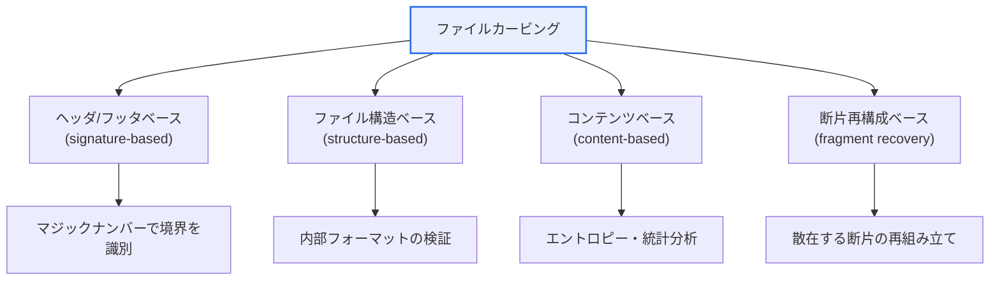
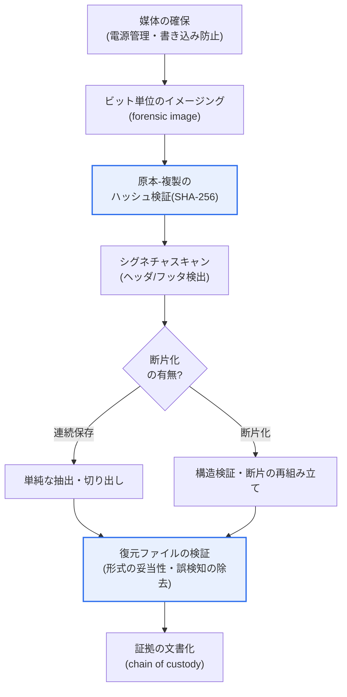

# ファイルカービング(File Carving)

## 1. 概要

### A. 定義

> **ファイルカービング(File Carving)** とは、ファイルシステムのメタデータ(ファイルの位置・サイズ・名前の情報)に依存せず、**記憶媒体の生データ(raw data)から、ファイル固有の特徴(シグネチャ・内部構造)を根拠としてファイルを復元**するデジタルフォレンジックの証拠収集技術である。

ファイルカービングがフォレンジックにおいて強力な武器となる理由は、「**ファイルシステムが消去されてもデータの断片からファイルを復活させる**」点にある。これを理解するには、まずOSがファイルをどのように管理しているかを押さえる必要がある。我々がファイルを開くとき、実際にはファイルシステム(NTFSのMFT、ext4のinodeなど)が保持するメタデータが「このファイルはディスクの何番ブロックから何バイトにわたって保存されている」と教えてくれる。ファイルシステムはこのメタデータという「索引」をたどって散在するデータブロックを集め、一つのファイルとして組み立てて見せている。

ところが、ここにフォレンジックの決定的な手がかりが潜んでいる。ファイルを削除したり媒体をフォーマット(クイックフォーマット)したりする際、性能上の理由からシステムは通常、**メタデータ(索引)のみを消去するか「使用可能」の印に変えるだけで、実際のデータブロックはそのまま残しておく。** ファイルシステムの観点では「存在しないファイル」であるが、物理的なデータそのものは、新しいデータがその場所を上書きするまでディスク上に完全に残っているのである。ファイルカービングは、まさにこの隙間(gap)を突く。索引が消えた以上それをたどることはできないが、ファイルごとに固有の**開始マーカー(ヘッダ、header)と終了マーカー(フッタ、footer)**、そして内部構造を直接の手がかりとして、生のバイトストリームからファイルを見つけ出して切り出す(carve)のである。

最も古典的な例がJPEG画像である。すべてのJPEGファイルは`FF D8 FF`のシーケンスで始まり(SOI, Start Of Image)、`FF D9`で終わる(EOI, End Of Image)。したがって、ディスク全体をバイト単位で走査して`FF D8 FF`に出会ったらその地点をファイルの開始とみなし、その後最初に現れる`FF D9`までを一つのファイルとして切り出せば、削除された写真を復元できる。このようにファイルカービングは、削除・破損・フォーマットされた媒体から証拠を見つけ出す中核的な手段であり、事件現場で被疑者が削除した写真・文書・動画を復活させるうえで決定的な役割を果たす。[[digital-forensics]]

### B. 登場背景および特徴

ファイルカービングが独立した技術として発展した背景には、二つの現実がある。第一に、**アンチフォレンジック(anti-forensic)の一般化**である。証拠隠滅を図る者はファイルを削除したりディスクをフォーマットしたりして痕跡を消そうとするが、この場合、ファイルシステムに基づく一般的な復元ツール(undelete)はメタデータが併せて損傷すると無力になる。ファイルシステムに依存しないカービングだけが、この状況を打開できる。第二に、**未割り当て領域(unallocated space)とスラック領域(slack space)に残る残存データ**の証拠価値である。ディスクには現在どのファイルにも割り当てられていない広大な領域と、クラスタ単位での割り当てという特性上ファイルの末尾とクラスタ境界の間に残る余り領域が存在し、そこには過去のファイルの断片が残っている場合が多い。

ファイルカービングの特徴は三つに要約される。**ファイルシステム非依存性** — FAT・NTFS・ext4などのファイルシステムの種類に関係なく、ファイルシステムそのものが損傷していても動作する。**生データ基盤** — 論理的な構造ではなく、物理的なバイトパターンに基づく。そして**断片化(fragmentation)に弱い** — ファイルがディスク上に連続して保存されず複数の断片に散らばっていると、ヘッダとフッタの間に他のファイルのデータが入り込み、正確な復元が難しくなる。この断片化の問題こそがファイルカービング最大の難題であり、さまざまな高度な手法が登場した理由でもある。

## 2. ファイルカービングの類型(4種の手法)

ファイルカービングは、何を手がかりとするかによって大きく四つの手法に分けられる。以下はその全体的な分類構造である。

### A. ヘッダ/フッタベースの手法(Signature-based)

最も基本的で、広く使われている方式である。この手法は、ファイル形式ごとに定められた固有の**シグネチャ(マジックナンバー、magic number)** をデータベースとして備え、記憶媒体を最初から最後までスキャンしながらヘッダパターンとフッタパターンの間の領域を切り出す。前述のJPEGの`FF D8 FF`〜`FF D9`、PNGの`89 50 4E 47`(‰PNG)、PDFの`25 50 44 46`(%PDF)〜`%%EOF`、ZIPの`50 4B 03 04`(PK)が代表的である。

この方式の長所は、単純かつ高速で、シグネチャさえ分かればどのようなファイルでも試せる点である。しかし、二つの根本的な限界がある。第一に、フッタのないファイル形式(例: 一部のテキスト・実行ファイル)はどこまで切り出すべきか判断しにくく、定められた最大サイズまで切り出す方式を用いると不要なデータが後ろに付いてしまう。第二の、より深刻な問題として、ファイルが**連続して保存されず断片化している**と、ヘッダとフッタの間に無関係なデータが入り込み、復元されたファイルが破損する。このため、ヘッダ/フッタベースの手法は断片化していない(contiguous)ファイルでのみ信頼できる。

### B. ファイル構造ベースの手法(Structure-based)

ヘッダ/フッタの限界を補うため、ファイル内部のフォーマットと構造の情報を能動的に活用する手法である。多くのファイル形式は、ヘッダの中にファイルサイズ、内部セクションのオフセット、チャンク(chunk)構造といったメタ情報を含んでいる。例えばPNGは複数のチャンクで構成され、各チャンクは長さフィールドとCRCチェックサムを持つ。構造ベースのカービングはこの情報を読み取ってファイルの実際のサイズを計算し、チャンクの妥当性を検証し、チェックサムが一致するかを確認することで、復元の精度を大きく高める。

この手法の中核的な価値は**検証(validation)** にある。単にバイトを切り出すだけでなく、「切り出した結果が本当に有効なファイルか」を形式仕様に照らして確認するため、誤検知(false positive)を減らし、断片化したファイルもある程度扱うことができる。ただし、ファイル形式ごとに個別の構造パーサを実装しなければならないため開発負担が大きく、形式が分からないファイルには適用できないという制約がある。

### C. コンテンツベースの手法(Content-based)

シグネチャや明示的な構造が存在しない、または損傷している場合に、データの内容的な特性そのものを分析する手法である。代表的なものに**エントロピー(entropy)** 分析がある。暗号化・圧縮されたデータはエントロピーが高く(ランダムに近い)、一般的なテキストはエントロピーが低く、特定形式のデータは固有の統計分布を示す。こうした統計・文字パターン・バイト分布を根拠に、データ領域の種類を推定し、境界を判別する。

コンテンツベースの手法は、シグネチャが損傷した状況でもおおよそのデータ種別を見積もれるという強みがあるが、精度が相対的に低く推定に依存するため、他の手法を補助する用途で併用される場合が多い。近年では、機械学習を活用して断片(fragment)のファイル種別を分類する研究が、この範疇で活発に進められている。

### D. 断片再構成(断片化)ベースの手法(Fragment Recovery Carving)

ファイルカービング最大の難題である断片化に正面から取り組む、最も高度な手法である。一つのファイルがディスク上の複数の非連続領域に散らばって保存されている場合、ヘッダで開始点を見つけた後、散在する断片を正しい順序で再組み立て(reassembly)しなければならない。その際、どの断片がどのファイルに属し、どの順序でつながるのかを判断するために、構造の検証・コンテンツの類似度・断片間の連続性(例: 画像のピクセルの連続性)を総合的に評価する。

この問題は組み合わせ爆発(combinatorial explosion)の性格を帯びており、計算コストが大きい。Garfinkelが提案した「**bifragment gap carving**」のように二つの断片に分かれたよくあるケースを効率的に扱う手法や、ファイル形式のデコーダを利用して再組み立て候補の妥当性を検証する方式などが研究・適用されている。実務では完全な自動再組み立ては難しいため、分析者による手作業のレビューと組み合わせて使われる場合が多い。

| 手法 | 手がかり | 強み | 限界 |
|---|---|---|---|
| **ヘッダ/フッタベース** | マジックナンバー(シグネチャ) | 単純・高速、汎用 | 断片化・フッタのないファイルに弱い |
| **ファイル構造ベース** | 内部フォーマット・サイズ・チェックサム | 検証により精度↑、誤検知↓ | 形式ごとのパーサが必要 |
| **コンテンツベース** | エントロピー・統計・パターン | シグネチャ損傷時でも推定可能 | 精度が低く、補助的 |
| **断片再構成ベース** | 断片間の連続性・類似度 | 断片化ファイルの復元 | 計算コストが大きく、完全自動化は困難 |

## 3. ファイルカービングの実施手順(プロセス)

実際のカービング作業は、単にツールを実行することではなく、証拠の完全性を守りながら段階的に進める手続きである。以下は、媒体の確保から証拠の検証までの標準的な流れを示したものである。

この手順において特に強調される段階が二つある。第一は**ハッシュ検証(上図の青色のC)** であり、カービングに先立って原本と複製のハッシュ値が一致することを確認することで、以降のすべての分析が原本と同一のデータ上で行われたことを保証する。第二は**復元ファイルの検証(H)** であり、切り出した結果が実際に開ける有効なファイルかを形式仕様に照らして確認し、シグネチャの偶然の一致による誤検知を除外する。この二つの関門を通過してはじめて、復元結果は証拠としての信頼性を確保する。

## 4. 活用、ツール、限界

ファイルカービングは、デジタルフォレンジックのさまざまな局面で活用される。第一に、被疑者が故意に削除したファイルの復元である。児童性的搾取物の事件や企業の機密漏洩事件において、削除された画像・文書をカービングで復活させ、決定的な証拠とした事例が多数報告されている。第二に、未割り当て領域・スラック領域に残る残存証拠の確保である。第三に、ファイルシステムが損傷した媒体(物理的損傷、ランサムウェアなど)からのデータ復元である。

代表的なオープンソースツールとしては、**Foremost**(米空軍特別捜査局が開発)、**Scalpel**(Foremostの性能を改善した派生ツール)、そして削除された写真の復元に特化した**PhotoRec**がある。これらは設定ファイルにシグネチャを定義することで多様なファイル形式をカービングでき、商用の統合フォレンジックツール(EnCase、FTK、X-Ways)もカービング機能を内蔵している。

限界も明らかである。データが**上書き(overwrite)** された場合は物理的に復元が不可能であり(SSDのTRIMコマンドは削除と同時にデータを物理的に消去して復元を困難にする)、深刻な断片化や暗号化が適用されている場合も復元は大きく制約される。また、シグネチャのパターンが偶然一致したデータをファイルと誤認する**誤検知**が発生し得るため、復元結果に対する検証が必ず伴わなければならない。

## 5. 深掘り — SSD・TRIM環境と完全性の問題、最新動向

ファイルカービング技術は、記憶媒体の変化に伴って新たな課題に直面している。かつてのHDD時代には、削除されたデータが上書きされるまで長く残り、カービングの成功率が高かった。しかし、**SSDの普及**が状況を一変させた。SSDは性能と寿命の管理のために**TRIM**コマンドを使用するが、これはファイルが削除されると該当ブロックをバックグラウンドで即座に物理的に空にしてしまう(garbage collection)。その結果、削除後わずかな時間が経過しただけでデータが完全に消え、従来のカービングでは復元できなくなる場合が多い。このことは、フォレンジック捜査において媒体を発見し次第電源を遮断し、迅速にイメージングする手続きの重要性を一層高めた。

もう一つの深掘りすべき論点は、**完全性と証拠保全の連鎖(chain of custody)** である。カービングで復元したデータが法廷で証拠として認められるには、原本の媒体を変更することなく取得したことを立証しなければならない。そのために、書き込み防止装置(write blocker)を用いて原本を保護し、ビット単位の複製(forensic image)を作成した後、原本と複製の**ハッシュ値(MD5/SHA-256)が一致すること**を確認する。すべてのカービング作業はこの検証済みの複製上で行われ、復元過程と担当者・時刻を記録することで証拠の信頼性を担保する。完全性の手続きが守られなければ、どれほど重要なファイルを復元しても証拠能力を失う可能性がある。

最新動向としては、**機械学習ベースの断片分類**が注目されている。シグネチャを持たない断片(fragment)のファイル種別をディープラーニングで判別し、再組み立ての精度を高めようとする研究が活発である。また、クラウド・仮想化環境でのカービング、スマートフォン・IoT機器のフラッシュメモリのカービングなど対象媒体が多様化しており、国際標準の面では、デジタル証拠の取扱い手順を規定した**ISO/IEC 27037**(証拠の識別・収集・取得・保全)などが、カービングを含むフォレンジック活動の信頼性の基準として参照されている。

## 6. 考慮事項および示唆

ファイルカービングを実際の捜査・監査に適用する際には、技術士の観点から以下を総合的に考慮しなければならない。

1. **断片化への対応が技術的な核心である。** ファイルが複数の断片に散らばって保存されていると、ヘッダ/フッタベースの手法だけでは正確な復元は不可能である。したがって、ファイル構造の検証・コンテンツ分析・断片の再組み立て手法を併用し、状況に応じて複数のツールをクロスで用いることで、復元の成功率と精度を併せて引き上げなければならない。

2. **完全性と証拠保全の連鎖の確保が法的効力の前提である。** どれほど精巧に復元しても、手続き上の正当性がなければ証拠として使うことはできない。書き込み防止装置の使用、ビット単位のイメージング、ハッシュに基づく原本-複製の同一性検証、作業履歴の記録を通じて、完全性とchain of custodyを厳格に遵守しなければならない。[[file-slack]]

3. **媒体特性の変化に先手を打って対応しなければならない。** SSDのTRIMは削除データを即座に消去するため、媒体確保の迅速さと電源管理が復元の成否を左右する。HDD中心の従来のアプローチを超え、SSD・フラッシュ・クラウドそれぞれの特性に合った収集・分析戦略を整備しなければならない。

4. **アンチフォレンジック・暗号化に備えた複合的な分析が必要である。** 完全消去(ワイピング)・暗号化・データ隠蔽(ステガノグラフィ)といったアンチフォレンジック手法に対しては、ファイルカービングだけでは限界がある。メモリフォレンジック・ネットワークフォレンジック・ログ分析など他の手法と組み合わせて証拠力を確保する多角的なアプローチが求められる。[[anti-forensic]]

5. **誤検知の管理と検証体制を整えなければならない。** シグネチャの偶然の一致による誤検知は避けられないため、復元結果を形式仕様・ハッシュ・手作業のレビューで検証する手続きを標準化し、誤った証拠の採用を防止しなければならない。

## 参考資料

- Simson Garfinkel, "Carving contiguous and fragmented files with fast object validation", DFRWS, https://www.dfrws.org/
- ForensicsWiki, "File Carving", https://forensics.wiki/file_carving/
- CGSecurity, "PhotoRec", https://www.cgsecurity.org/wiki/PhotoRec
- ISO/IEC 27037, Guidelines for identification, collection, acquisition and preservation of digital evidence

---

> **一言まとめ**: ファイルカービングは*ファイルシステムのメタデータなしに、生データのシグネチャ・構造からファイルを復元*するフォレンジック技術であり、ヘッダ/フッタ・ファイル構造・コンテンツ・断片再構成の4手法があり、削除・フォーマットされた媒体の復元に用いられるが、断片化への対応・完全性の確保・SSDのTRIM環境への対応が鍵となる。
