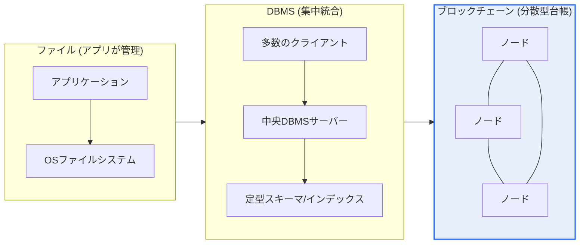
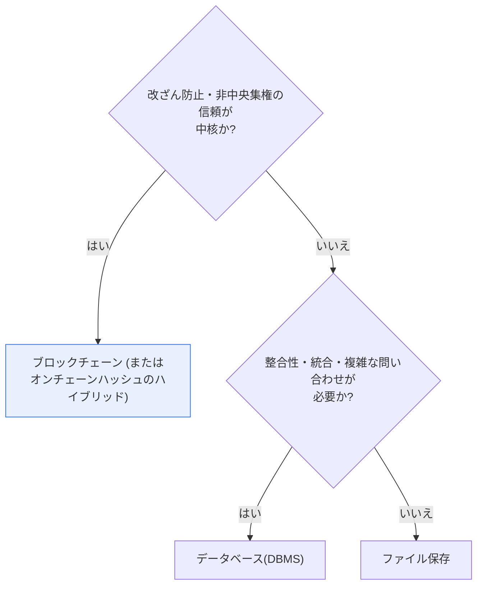

# データ保存: ファイル・データベース・ブロックチェーンの比較

## 1. 概要

### A. 定義

> データを保存・管理する三つの代表的な方式であり、**ファイル**はOSによるファイル単位の保存、**データベース(DBMS)** はスキーマで構造化されたデータの統合・集中管理、**ブロックチェーン**は多数の分散ノードにブロックをチェーン状に連結して保管する不変(immutable)の分散型台帳(distributed ledger)である。

三つの方式を貫く中核的な区別点は、「**データの信頼(trust)をどこに置くか**」である。ファイルはアプリケーションが形式・整合性を自ら管理するため、信頼の責任は全面的にアプリにある。データベースは中央のDBMSサーバー(およびそれを運用する管理者)がアクセス制御・トランザクション・制約条件によってデータを統制し、信頼を保証する。一方、ブロックチェーンは中央の管理者なしに**多数ノードの合意(Consensus)** によって信頼を生み出すという点で根本的に異なる。誰も単独では記録を改ざんできず、一度確定(finality)したデータは事実上元に戻すことができない。

この「信頼の主体」の違いが、完全性(integrity)・性能(performance)・可用性(availability)という三つの特性をそれぞれ異なる形で分ける。信頼をアプリに委ねれば単純かつ高速であるが整合性が弱く、中央サーバーに委ねれば強い整合性と最適化された性能を得る代わりにそのサーバーが単一の信頼点かつ潜在的な単一障害点となり、多数ノードの合意に委ねれば改ざん耐性と透明性を得る代わりに合意プロセスのオーバーヘッドによって性能・コストの面で大きな代償を払う。そのため、どの方式を使うかは常に「このデータにはどの水準の信頼・性能・透明性が必要か」という要件の問いに帰結する。

### B. 登場背景と必要性

データの性格はさまざまである。システム設定ファイルやサーバーログのように構造が単純で整合性の要求が低いデータもあれば、銀行口座の残高・在庫数量のようにわずかな不一致も許されない取引データもあり、学位・資格の証明やサプライチェーンの履歴のように「誰もひそかに書き換えられないこと」によって価値が生まれるデータもある。三つの方式が共存している理由は、この多様性にある。一つの万能なストレージがすべての要件を最適に満たすことはできないため、データの性格に合った方式を選んではじめて、コスト・性能・信頼を同時に最適化できる。この選択の問題は単なる概念比較を超え、システムアーキテクチャ設計の初期の意思決定に直接影響するため、技術士の観点から重要である。

歴史的にも、これら三つの方式は「以前の方式の限界を乗り越えるために」順次登場した。初期の情報システムはファイルシステムでデータを管理していたが、重複・不整合・同時実行の問題(いわゆるデータ従属性・冗長性の問題)に突き当たり、1970年代以降DBMSへと移行した。DBMSは集中統合によってこの問題を解決したが、複数の主体が互いを信頼しにくい環境(多者間取引・非中央集権型サービス)では「誰が中央を信頼するのか」という新たな信頼の問題が残り、2009年のビットコイン以降、ブロックチェーンがこれを合意に基づく非中央集権化によって解決しようとする試みとして台頭した。すなわち三つの方式は代替関係というよりも、異なる信頼・規模の要求を満たすために蓄積されてきた選択肢に近い。

## 2. 三つの方式の構造

三つの保存方式は、データを格納する物理的・論理的な構造からして異なる。以下の構造図は、信頼の所在(アプリ → 中央サーバー → 分散ネットワーク)が右へ行くほど分散していく流れを示している。

**ファイル方式**は、データをファイル単位で保存し、その内容の形式(CSV・JSON・バイナリなど)と完全性は、それを読み書きするアプリケーションが責任を負う。DBMSという中間層がないため構造が軽量でアクセスも直接的であるが、同じデータが複数のファイルに重複しやすく、複数のプログラムが同時に修正すると整合性が崩れやすい。データ間の関係・制約条件を強制する仕組みがないため、規模が大きくなるほど管理コストが急増する。初期の情報システムが「ファイルシステムの限界」を経験してDBMSへと移行した歴史は、この点に由来する。

**データベース(DBMS)** は、データをスキーマで定義された構造(リレーショナルであればテーブル・行・列)で統合管理し、中央サーバーがトランザクション・同時実行制御・アクセス権限・バックアップを一括して統制する。複数のアプリケーションが同じデータを共有しながらも重複を排除し(正規化)一貫性を維持するよう設計されており、整合性が重要なほとんどの企業業務において事実上の標準となった。ただし、すべての信頼がこの中央サーバーに集中するため、サーバー管理者はデータを修正する権限を持ち、サーバー障害はそのままサービス停止につながり得るため、冗長化・レプリケーションといった可用性対策が必須である。

**ブロックチェーン**は、データをブロックに格納し、各ブロックが直前のブロックのハッシュ値を含むことで鎖のように連結する。この台帳を多数のノードが同一に複製・保管し、新しいブロックは合意アルゴリズム(PoW・PoSなど)を通過した場合にのみ追加される。あるブロックの内容を書き換えるとそのハッシュが変わり、以降のすべてのブロックの連結が壊れる。これを正当化するにはネットワークの過半数の計算力・持分を掌握しなければならないため、事実上改ざんは不可能である。中央の管理者がいないため特定の主体による統制・検閲に強いが、すべてのノードが同じデータを保存し合意に参加しなければならないため、保存コスト・処理遅延が大きい。

## 3. 完全性・性能・可用性の詳細比較

三つの方式を構造・管理主体・完全性・性能・可用性の側面から並べてみると、それぞれの位置づけが明確になる。以下の表は比較の骨格であり、その下の本文では「なぜそのような違いが生じるのか」を説明する。

| 区分 | ファイル | データベース | ブロックチェーン |
|---|---|---|---|
| **構造** | ファイル単位 | スキーマ・リレーショナル | ブロックチェーン(分散型台帳) |
| **管理主体** | アプリケーション | 中央DBMS | 分散ノード(非中央集権) |
| **完全性** | 低い(重複・不整合) | トランザクション(ACID) | 不変性・改ざん防止 |
| **同時実行・統合** | 脆弱 | 強い(同時実行制御) | 合意による遅延 |
| **性能** | 単純・高速 | インデックスで最適化 | 遅い(合意のオーバーヘッド) |
| **可用性** | 単一障害点 | 冗長化で対応 | 非中央集権・高可用 |
| **透明性・監査** | 低い | ログに依存 | 非常に高い(公開検証) |
| **適合** | 単純・少量 | 定型・統合業務 | 信頼が必要・非中央集権(取引・履歴) |

**完全性の違いは、整合性を強制する仕組みがどこにあるかから生じる。** ファイルには強制する仕組みがないため、アプリのミスや同時アクセスがそのまま不整合につながる。DBMSは、トランザクションのACID(原子性・一貫性・独立性・永続性)と制約条件・同時実行制御によって、整合性をシステムレベルで保証する。例えば口座振替では、出金と入金を一つのトランザクションにまとめ、「すべて反映されるか、すべて取り消されるか」を強制する。ブロックチェーンは合意とハッシュチェーンによって「一度確定した記録は変わらない」という形の完全性を提供するが、これはDBMSの整合性とは性質の異なる「事後的な改ざん耐性」に近い。

**性能の違いは、信頼を生み出すコストによって分かれる。** ファイルは中間層なしに直接読み書きするため、単純なアクセスは最も速い。DBMSはインデックス・クエリ最適化・キャッシュによって、大量データでも複雑な問い合わせを高速に処理する。ブロックチェーンはすべての取引を多数のノードが検証・合意・複製しなければならないため、スループットが低い。実際の数値でも差は大きい — 従来のリレーショナルDBや商用決済網が毎秒数千〜数万件以上を処理するのに対し、ビットコインは毎秒約7件、イーサリアムは数十件程度(レイヤー2・アップグレードで改善中)とされており、大量・リアルタイム処理にそのまま使うことは難しい。

**可用性の違いは、信頼の所在と直結している。** ファイルは、そのファイルが置かれたストレージがそのまま単一障害点となる。DBMSは集中型であるが、レプリケーション(replication)・クラスタリング・冗長化によって障害に対応する — ただし、この備えには追加の設計とコストが必要となる。ブロックチェーンは多数のノードが同一の台帳を保持するため、一部のノードが停止してもネットワークは動作し続けるという、構造的に高い可用性を持つ。すなわち「単一の信頼点をなくした」設計が、可用性の面では強みとして返ってくるのである。

**透明性・監査(audit)の特性も、三つの方式で大きく異なる。** ファイルは、誰がいつ何を変更したかを別途の仕組みなしに追跡することが難しく、DBMSは監査ログ(audit log)を設定すれば変更履歴を残せるが、そのログ自体が管理者権限で修正され得るという限界がある。ブロックチェーンはすべての取引が台帳に公開的に記録され、多数のノードが検証するため、事後に特定の主体が履歴をひそかに消したり変えたりすることは事実上不可能である。この「検証可能な透明性」は、多者間取引や規制報告のように「信頼できない相手とも事実を共有しなければならない」状況において、ブロックチェーンならではの差別的な価値となる。

## 4. 選択基準とハイブリッドの事例

何を使うかは、データの要件によって決まる。以下の意思決定フローは、実務でよく使われる判断の順序である。

改ざん防止・透明性・非中央集権の信頼が中核であればブロックチェーンが適しているが、性能・保存コスト・規制対応が負担となる。整合性・統合・複雑な問い合わせ・トランザクションが重要であればDBMSが最適であり、ほとんどの企業業務(会計・受注・在庫・顧客管理)がこれに該当する。単純な設定・ログ・大容量メディアの保存には、ファイル(またはオブジェクトストレージ)が最も経済的である。実際のシステムは、これら三つを組み合わせて使う。

選択を判断する際に特に注意すべき点は、「非中央集権が必要である」という要求と「データが重要である」という要求を混同しないことである。データがいかに重要であっても、そのデータを管理する主体が単一の信頼機関(銀行・機関のサーバー)であれば、たいていはDBMSで十分であり、ブロックチェーンの利点はむしろ「互いに信頼しにくい多数の参加者」が一つの台帳を共有しなければならないときに発揮される。逆に、参加者が一者のみであるか、すでに信頼が成立している組織内部であれば、ブロックチェーンは過剰設計になりやすい。この区別を見落とすと、話題性だけを追って誤ったストレージを選ぶことになる。

具体的な事例で三つの方式の組み合わせを見ると、理解が明確になる。第一に、**サプライチェーンの履歴追跡**(例: 流通・食品のトレーサビリティ)では、原本の文書・画像はオフチェーン(ファイル・オブジェクトストレージ)に置き、各段階の検証ハッシュだけをブロックチェーンに載せることで、「誰がいつ何を記録したか」を改ざんなく証明する。第二に、**電子文書・証明書の真正性確認**(卒業証明・契約書)では、文書の本文は機関のDBMSに、そのハッシュ(指紋)はブロックチェーンに記録し、後で原本とハッシュを照合する方式で偽造を見抜く。第三に、**大規模サービスのログ・メディア**はファイル/オブジェクトストレージに保存しつつ、そのメタデータ・インデックスはDBMSで管理して、検索・集計の性能を確保する。このように「重い原本は安くて速い場所に、信頼の証拠は改ざんのない場所に」という役割分担が、現実的な設計である。

## 5. 深掘り — オンチェーン/オフチェーンのハイブリッドと近年の動向

ブロックチェーンの性能・保存の限界を正面から認めつつ、その信頼特性だけを取り入れようとするのが**オンチェーン/オフチェーンのハイブリッド**パターンである。大容量の原本データ(文書・画像・大量のレコード)はオフチェーン(DBMS・ファイル・分散ファイルシステムIPFSなど)に保存し、そのデータの**ハッシュ値(指紋)のみをオンチェーン**に載せる。原本がわずかでも変わればハッシュが異なるため、オンチェーンのハッシュとオフチェーンの原本を照合するだけで改ざんの有無を検証できる。こうすることで、ブロックチェーンに大容量データを載せる際のコスト・遅延を避けながら、「証明可能性」という中核的な価値は守ることができる。

このハイブリッドの発想は、近年データベースそのものにも浸透しつつある。一部の商用・オープンソースのDBMSは「変更不可の台帳テーブル(ledger/immutable table)」や暗号学的検証(ハッシュチェーン)の機能を内蔵し、ブロックチェーンなしでも「改ざん検知」という特性の一部を中央のDB内で提供しようとしている。これは「非中央集権までは必要ないが、改ざんの証拠は残したい」という中間的な需要を狙ったものであり、保存方式の境界が固定されたものではなく、要件に合わせて互いの長所を取り込みながら進化していることを示している。

技術士の観点から注目すべき近年の流れは次のとおりである。第一に、**性能の拡張(レイヤー2)** — イーサリアム陣営は、ロールアップ(Optimistic・ZK-Rollup)などのレイヤー2によって多数の取引をオフチェーンで処理し、要約だけをオンチェーンに記録することでスループットを引き上げている。第二に、**エンタープライズ向けの許可型ブロックチェーン** — Hyperledger Fabricのようなプライベート/コンソーシアムチェーンは、参加ノードを制限して合意のオーバーヘッドを減らし、規制・プライバシーの要求に適合させている。第三に、**データ規制との衝突** — ブロックチェーンの不変性は個人情報保護法の「忘れられる権利(削除権)」と衝突するため、個人情報の原文は決してオンチェーンに載せず、ハッシュ・参照だけを置く設計が事実上の標準的な推奨事項となった。第四に、**ポリグロット・パーシステンス(Polyglot Persistence)** — 一つのシステムの中でも、データの性格ごとにリレーショナルDB・NoSQL・ファイル・ブロックチェーンを使い分けるアプローチが一般化している。(個々のプロジェクトの最新のスループットや標準の数値は急速に変わるため、実際の設計時には各プラットフォームの最新の公式ドキュメントで確認するのが望ましい。)

## 6. 考慮事項および示唆

技術士の観点から、三つの保存方式の比較は「技術そのもの」ではなく、「要件に合った信頼・性能・コストのバランス」を設計する問題として読み解かなければならない。

1. **ブロックチェーンは万能ではない。** 改ざん防止・透明性・非中央集権の信頼が本当に必要な場合(サプライチェーンの追跡、証明書、多者間の取引履歴)にのみ価値がある。そうでない一般的な業務データにブロックチェーンを使えば、性能低下・保存コスト・運用の複雑さだけを得ることになり、DBMSの劣った代替手段となる。「ブロックチェーンが必要か」をまず冷静に判定することが、設計の出発点である。

2. **ハイブリッドが現実的な解決策である。** 大容量の原本はオフチェーン(DBMS・ファイル)に、検証用のハッシュだけをオンチェーンに置く折衷は、性能・コストと信頼を同時に両立させる事実上の定石である。純粋なオンチェーン保存に固執するよりも、「何をオンチェーンに載せるか」を最小化する設計感覚が重要である。

3. **データ特性に基づく設計(ポリグロット)を原則としなければならない。** 一つのシステムであっても、データの種類に応じてファイル・DB・ブロックチェーンを使い分け、各方式の長所だけを取り入れて短所を回避する。その際、データの整合性・寿命・アクセスパターン・規制要件を分類するデータガバナンスが先行しなければならない。

4. **規制・コンプライアンスを保存方式選択の第一級の要件として扱わなければならない。** 特にブロックチェーンの不変性は個人情報の削除権と衝突するため、個人識別情報はオンチェーンから除外し、ハッシュ・参照のみを置くという原則をアーキテクチャの段階で確定させなければならない。国内外の個人情報保護規制と金融監督の要件は、ストレージの選択を左右する強い制約である。

5. **総所有コスト(TCO)と運用の成熟度まで考慮しなければならない。** ブロックチェーン・分散システムは開発・運用・人材確保のコストが高く、技術の成熟度や標準はまだ流動的である。新技術の話題性だけを見て導入するのではなく、組織の運用能力と長期的な保守コストを併せて天秤にかけるトレードオフの判断が必要である。

## 参考資料

- AWS, "ファイル・ブロック・オブジェクトストレージおよびデータベースの概念" — https://aws.amazon.com/products/storage/
- Hyperledger Foundation, "Hyperledger Fabric Documentation" — https://hyperledger-fabric.readthedocs.io/
- Ethereum, "Scaling / Layer 2" — https://ethereum.org/en/developers/docs/scaling/

---

> **一言まとめ**: ファイル(アプリが管理・単純・高速)・DBMS(集中統合・ACID・最適化)・ブロックチェーン(分散型台帳・不変性・非中央集権)は「信頼をどこに置くか」によって完全性・性能・可用性が分かれ、統合・整合性・複雑な問い合わせにはDBMS、改ざん防止・透明性・非中央集権の信頼にはブロックチェーンが適しているが、現実にはオンチェーンのハッシュ+オフチェーンの原本によるハイブリッドと、データ特性別のポリグロットな保存で折衷する。
