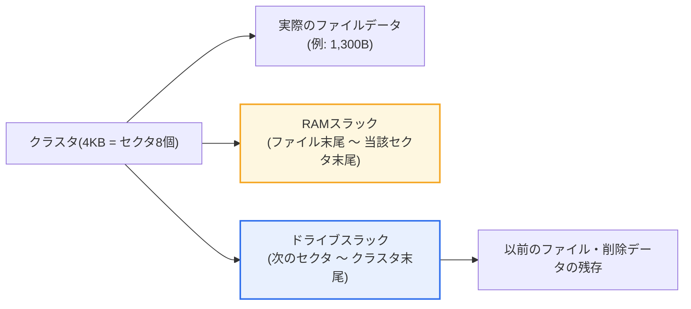
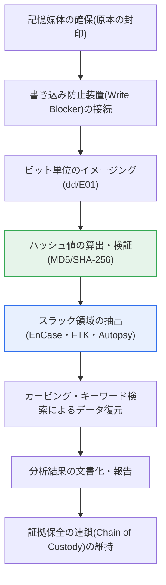

# ファイルスラック(File Slack)

## 1. 概要

### A. 定義
> **ファイルスラック(File Slack)** とは、ファイルが保存単位(クラスタ)をちょうど埋めきれないために最後の割り当て領域に残る**使用されない空き領域**であり、デジタルフォレンジックにおいて削除・隠蔽された過去のデータが残存し得る証拠空間であると同時に、アンチフォレンジック(データ隠蔽)に悪用され得る脆弱な空間でもある。

ファイルスラックがフォレンジックにおいて持つ意味は、「**捨てられた隙間に過去のデータがそのまま潜んでいる**」という点にある。記憶装置はデータをバイト単位で細かく管理するのではなく、ファイルシステムが定めた**クラスタ(割り当て単位、例: NTFSのデフォルト4KB)** という固定サイズのブロック単位で領域を割り当てる。性能と管理効率のために最小割り当て単位を大きく取るのであるが、問題は、現実のファイルサイズがこの単位の整数倍になることはほとんどないという点にある。例えば4KBのクラスタに1KBのテキストファイルを保存すると、ファイルが実際に使う領域は1KBだけであり、**残りの3KBはこのファイルが占有しながらも使用しない無駄な領域**となる。まさにこの余った領域がファイルスラックである。

核心は、この無駄な領域がファイル保存時に**完全には初期化されない**という点である。OSは新しいファイルのデータが占める領域だけを上書きし、その後ろのスラック領域には手を付けないことが多い。その結果、以前そのクラスタに存在していた別のファイルのデータ断片や、かつてはメモリ(RAM)の残存内容がそのまま残ることがある。ユーザーはファイルを削除した、あるいは新しいファイルで上書きしたと考えているが、スラック領域には消えていない過去の痕跡が残る。フォレンジック捜査官はこの領域を精密に分析して、削除された文書の断片、隠蔽された情報、過去の活動の手がかりを復元し、逆に攻撃者はこの「見えない空間」にマルウェアや持ち出したデータを隠すアンチフォレンジックの手口に悪用する。

### B. 登場背景と発生原理
ファイルスラックは何らかの特殊な欠陥ではなく、**ブロックベースの保存構造において必然的に発生する構造的な副産物**である。記憶装置の物理的な最小記録単位である**セクタ(伝統的には512バイト、最新のディスクは4Kセクタ=Advanced Format)** と、ファイルシステムが領域を管理する論理的な単位である**クラスタ(複数のセクタの束)** との間のサイズ差、そしてクラスタサイズと実際のファイルサイズの不一致が重なることで、余りの領域が生じる。すなわち「物理的にはファイルに割り当てられているが、論理的にはファイルが使用していない」領域がファイルスラックであり、この定義上の隙間が以前のデータを保存するため、証拠としての価値を持つ。

この現象がフォレンジックの観点から特に注目されるようになったきっかけは、ユーザーや一般的な削除ツールがアクセスできない領域に情報が残るという事実である。エクスプローラーでファイルを削除したり通常(クイック)フォーマットを行ったりしても、スラックに残った残存データは物理的に残っており、専用ツールで低レベルまで読み取れば復元が可能である。このため、ファイルスラックは**未割り当て領域(Unallocated Space)** ・**削除ファイルの復元**と並んで、記憶媒体フォレンジックの三大中核分析対象として扱われる。

## 2. ファイルスラックの階層構造

ファイルスラックを正確に理解するには、記憶領域の階層(セクタ → クラスタ → ファイルシステム → ボリューム)に沿って、スラックがどの層で発生するのかを区別する必要がある。以下の構造図は、一つのクラスタの内部で、実際のファイルデータ、RAMスラック、ドライブスラックがどのように配置されるかを示している。

ファイルスラックは、発生する位置と埋められる内容によって大きく四つに細分される。**最も頻繁に議論されるのはRAMスラックとドライブスラック**であり、拡張された観点ではファイルシステムスラック・ボリュームスラックまで含める。以下では、それぞれをその発生原理とフォレンジック上の含意を中心に述べる。

### A. RAMスラック(Sector Slack)
RAMスラックは、ファイルの実際のデータが終わる地点から**そのデータがまたがる最後のセクタの末尾まで**の領域である。記憶装置はデータをセクタ(512バイト)単位でしか記録できないため、例えばファイルの最後の断片が200バイトであれば、残りの312バイトを何かで埋めて1セクタを完成させなければならない。かつてのMS-DOS・初期のWindowsの時代には、この場所にディスク書き込み直前のメモリバッファ(RAM)の内容がそのまま記録されていたため「RAMスラック」という名前が付けられ、ここからパスワードや直前の編集内容といった機微な情報が偶然露出する事例が実際にあった。

ただし最新のOSではこのリスクが認識されており、RAMスラック領域を**0x00でパディング(zero-fill)** してメモリの残存内容が漏洩しないように処理するのが一般的である。したがって、今日ではRAMスラックから過去のメモリデータを復元できる可能性は古いシステムに比べて低くなったと理解するのが正確である。それでもRAMスラックは依然として、**ファイルの正確な終端位置(EOF)を判別**し、後に続くドライブスラックと実際のデータとの境界を区別する基準点として分析上の価値を持つ。

RAMスラックは「セクタスラック」とも呼ばれる。その規模はセクタサイズからファイルの最後のセクタの使用量を差し引いた値であり、最大511バイト(512Bセクタ基準)まで発生する。個々のサイズは小さいが、数十万個のファイルが存在する実際のシステム全体で見れば、無視できない分析対象となる。

### B. ドライブスラック(Drive Slack)
ドライブスラックは、ファイルの最後のセクタ(すなわちRAMスラックが終わった地点)の次のセクタから**クラスタの末尾まで**残る領域である。フォレンジックにおいて最も重要なスラックはまさにこの領域であり、その理由は、**ここに以前そのクラスタを使っていた削除ファイルのデータがほぼそのまま残っている**からである。OSは新しいファイルをクラスタに配置する際、ファイルデータが及ばない後方のセクタまでわざわざ消去しないため、過去のファイルの内容が「幽霊」のように保存される。

例えば、4KBのクラスタ(セクタ8個)に1,300バイトのファイルが保存されたとする。ファイルは先頭の3セクタ(1,536バイト)にまたがり、3番目のセクタの後方236バイトがRAMスラック(0でパディング)となる。そして**4番目から8番目のセクタ(2,560バイト)がすべてドライブスラック**であり、この場所には以前存在していた別のファイルのテキスト・画像の断片が残り得る。捜査官はこの2,560バイトから削除されたメールの文言、文書の一部、ログの断片などを復元し、事件の決定的な手がかりを得る。

ドライブスラックはアンチフォレンジックの標的でもある。攻撃者は正常なファイルの後ろにあるこの領域に意図的にデータを書き込み、通常のファイル一覧には現れない隠蔽チャネルを作ることができる。このため、スラックへの隠蔽はステガノグラフィと並ぶ代表的なデータ隠蔽手法に分類される。

### C. ファイルシステムスラックとボリュームスラック
スラックはクラスタの内部だけで生じるのではなく、より大きな単位でも発生する。**ファイルシステムスラック**は、パーティション全体のサイズがクラスタサイズの整数倍でぴったり割り切れない場合に、ファイルシステムがクラスタとして管理できずに残すパーティション末尾の余り領域である。**ボリュームスラック**は、パーティションに割り当てられずボリューム(ディスク)レベルで残る領域を指す。どちらの領域もファイルシステムが通常はアクセスしないため、削除の痕跡が長く保存されたりデータ隠蔽に悪用されたりする可能性があり、記憶媒体全体をイメージングして分析する際には必ず併せて検討しなければならない。

このようにスラックは階層ごとに異なる原理で発生し、フォレンジック分析は特定のファイルのスラックだけを見るのではなく、媒体全体のスラック階層を総合的に調べてはじめて完結する。以下の表は四つのスラックを比較したものであるが、表だけで理解するのではなく、上記の本文の説明と併せて読むことで、各領域が「なぜ」その場所に生じるのかが明確になる。

| 区分 | 発生位置 | 埋められる内容 | フォレンジックの観点 |
|---|---|---|---|
| **RAMスラック** | ファイル末尾 〜 当該セクタ末尾 | (過去)メモリの残存 / (現在)0パディング | ファイル終端の境界判別、古いシステムでは機微情報の露出 |
| **ドライブスラック** | 次のセクタ 〜 クラスタ末尾 | 以前の・削除されたファイルのデータ | 削除データ復元の核心、隠蔽の標的 |
| **ファイルシステムスラック** | パーティション末尾の余り | 以前のフォーマット・残存データ | 媒体全体のイメージング時に検討 |
| **ボリュームスラック** | 未割り当てのボリューム領域 | パーティション削除の痕跡など | 隠蔽・復元の対象 |

## 3. フォレンジック分析手順とアンチフォレンジックの脅威

ファイルスラックの分析は場当たり的に行われるのではなく、**証拠の法的効力を担保するための定型化された手順**の上で実施される。以下のプロセス図は、記憶媒体の確保からスラック分析・報告までの流れを示している。

手順の出発点は、**原本の完全性の保全**である。記憶媒体を確保したら直ちに書き込み防止装置(Write Blocker)を接続して原本にいかなる変更も加えられないようにし、原本ではなくその**ビット単位の複製イメージ(dd・E01形式)** を対象に分析する。イメージングの直後にMD5・SHA-256のハッシュ値を算出しておき、分析終了時に再度計算して値が一致することを示すことで、「分析の過程で証拠が損なわれていないこと」を立証する。この完全性の検証がなければ、スラックからどれほど決定的なデータを復元しても、法廷で証拠能力を認められることは難しい。

その後、EnCase、FTK、オープンソースのAutopsy(The Sleuth Kit)、Foremostといったツールでスラック領域を特定・抽出し、**ファイルカービング(File Carving)** とキーワード検索を併用して、ヘッダ/フッタのシグネチャを手がかりに削除ファイルの断片を再構成する。例えば、JPEGの開始シグネチャ(FF D8 FF)をスラック領域から見つけて画像の一部を復元したり、特定の口座番号・氏名の文字列をスラック全体で検索して流出の状況を確認したりするといった具合である。

その反対側には**アンチフォレンジック**の脅威がある。攻撃者はスラックにデータを隠して検知を回避し、逆に捜査を妨害するためにワイピングツールでスラックまで上書きして証拠を隠滅することもある。したがってフォレンジックとアンチフォレンジックは、スラックという同じ空間をめぐって繰り広げられる矛と盾の関係にあり、組織のセキュリティ担当者は機微情報の完全消去(ワイピング)とスラックの点検の両方を考慮しなければならない。

| 観点 | 内容 |
|---|---|
| **証拠の復元** | 削除された・以前のファイルの断片の復元、隠蔽データの発見、カービング・キーワード検索 |
| **データ隠蔽の脅威** | 攻撃者がドライブスラック・ボリュームスラックに情報を隠蔽(アンチフォレンジック) |
| **証拠隠滅の脅威** | スラックまで上書きするワイピングによる痕跡の除去 |
| **分析ツール** | EnCase、FTK、Autopsy(TSK)、Foremostなどによるスラックの抽出・分析 |

## 4. 深掘り — 記憶媒体・環境の変化がスラック分析に及ぼす影響

ファイルスラックは古くからある概念であるが、記憶技術とコンピューティング環境の変化に伴ってその分析上の価値と方法も変わりつつあり、技術士の観点から最新の流れを押さえておく必要がある。

第一に、**SSDとTRIMコマンド**の普及は、スラック分析の前提を揺るがしている。HDDでは削除されたデータは上書きされるまで物理的に残るが、SSDは性能・寿命の管理のために、TRIMコマンドによって削除されたブロックをバックグラウンドであらかじめ空にしてしまう(garbage collection)傾向がある。その結果、SSDでは削除後の短時間のうちにスラック・未割り当て領域の残存データが消去され、復元の可能性がHDDより大きく低下し得る。これは「削除=復元不可能」を意味するわけではないが、媒体の特性に応じて分析戦略を変えなければならないことを示している。

第二に、**クラスタサイズの設定**がスラックの総量を左右する。小さなファイルが多いシステムでクラスタを大きく取ると(例: 64KB)、ファイルごとに大きなスラックが生じて保存効率は低下するが、フォレンジックの観点では残存データが多くなる。逆にクラスタを小さく取ればスラックの無駄は減るが、管理のオーバーヘッドが大きくなる。実際に大容量サーバーで数百万個の小さなファイルを扱う場合、このトレードオフが保存コストと性能に直接影響する。

第三に、**暗号化・クラウド環境**の拡大である。フルディスク暗号化(BitLocker、FileVault)が適用された媒体は、イメージングしてもスラックを含む全領域が暗号文であるため、復号鍵なしではスラック分析そのものが無意味となる。また、データがクラウドストレージに分散保存されると、物理媒体単位の従来のスラックの概念をそのまま適用することが難しくなり、フォレンジックはログ・API・スナップショット中心へと移行する傾向にある。

第四に、**実務適用の事例**として、スラック分析は企業の情報漏洩・内部者調査においてしばしば決定的な役割を果たす。例えば、退職者が営業機密文書を削除し、その場所に無害なファイルを上書きして隠蔽を試みた場合、新しいファイルのドライブスラックから元の文書のテキスト断片が復元され、流出の状況が立証されるといった具合である。これは、スラックが「削除したと信じている人」と「痕跡を探す捜査官」との間の認識のギャップをそのまま示す場面であり、組織がなぜ完全消去ポリシーと媒体持ち出しの統制を併せて備えなければならないのかを説明している。

## 5. 考慮事項および示唆

ファイルスラックは単なる「余った空間」ではなく、情報の生成・削除・残存というライフサイクル管理全般と結びついたテーマである。技術士の観点から、以下を総合的に考慮しなければならない。

1. **「削除」と「消去(sanitization)」は異なる。** ファイルの削除や通常のフォーマットは、ファイルシステムのメタデータを整理するだけで、スラック・未割り当て領域の実際のデータは残す。機微情報を確実に消し去るには、上書き方式のワイピング(例: DoD 5220.22-Mの複数回上書き、NIST SP 800-88 Purge)、暗号化後の鍵破棄(Crypto Erase)、物理的破壊のうち、データの機微度に合った方法を選択しなければならない。[[anti-forensic]]

2. **スラックは隠蔽チャネルになり得るため、セキュリティ統制の対象に含め**なければならない。DLP(情報漏洩防止)・EDRがファイル単位だけを監視してスラックへの隠蔽を見逃さないよう、媒体の全数点検と異常な保存パターンの検知を併用するのが望ましい。特に内部者による漏洩への対応では、スラックへの隠蔽の可能性を考慮した点検体制が必要である。

3. **証拠能力の確保のための手続き上の正当性は、技術的な復元と同じくらい重要**である。スラックからどれほど決定的なデータを復元しても、書き込み防止・イメージング・ハッシュ検証・証拠保全の連鎖(Chain of Custody)という手続きが守られなければ、法的効力を失う。ツールの信頼性(検証済みの商用/オープンソース)と分析者の資格も併せて担保されなければならない。[[digital-forensics]]

4. **媒体・環境の特性に合わせた分析戦略が必要**である。SSDのTRIM、フルディスク暗号化、クラウドへの分散保存などによって従来のスラック分析の有効性が変わるため、媒体を確保した時点で直ちに電源状態・暗号化の有無・媒体の種類を判断し、揮発性の証拠(メモリ)から確保するなど、優先順位を調整しなければならない。

5. **保存効率とフォレンジック上の価値のトレードオフを設計段階で認識**しなければならない。クラスタサイズの設定は、保存の無駄(スラックの総量)と性能・復元可能性に同時に影響するため、システムのファイル特性(大量の小さなファイルの有無)とデータの保存/破棄ポリシーを併せて考慮して決定するのが望ましい。

## 参考資料
- 高麗大学校デジタルフォレンジック研究センター, Digital Forensic WIKI — Slack: http://forensic.korea.ac.kr/DFWIKI/index.php/Slack
- NIST SP 800-88 Rev.1, Guidelines for Media Sanitization: https://csrc.nist.gov/publications/detail/sp/800-88/rev-1/final

---

> **一言まとめ**: ファイルスラックは*ファイルがクラスタを埋めきれずに残る領域*であり、RAMスラック・ドライブスラック・ファイルシステムスラック・ボリュームスラックに分かれ、削除された・以前のデータが残存するため削除ファイル復元の中核的なフォレンジック証拠となると同時にアンチフォレンジックの隠蔽に悪用され得るため、完全消去(ワイピング)と完全性の手続きに基づくスラック分析が併せて求められる。
