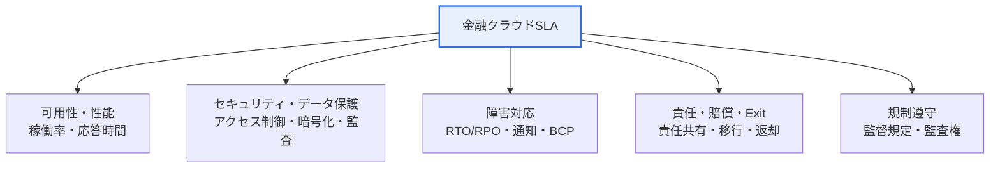
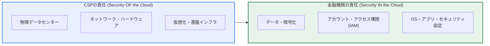

# 金融クラウドSLA(Service Level Agreement)

## 1. 概要

### A. SLAの概念
> **SLA(サービスレベル合意)**とは、サービス提供者と利用者が**提供するサービスの水準(可用性・性能・セキュリティなど)を定量的指標で合意**し、目標未達時の賠償・制裁と相互の責任を明文化した契約である。定性的な約束を測定可能な数値に置き換え、サービス品質を契約的に保証する。

SLAが必要とされる本質的な理由は、「**サービス品質を言葉ではなく数値で約束する**」ためである。「安定的に提供する」という曖昧な表現は、障害が発生した際に責任の所在をめぐる紛争を招く。しかし「月間稼働率99.9%以上を保証し、未達の場合は月額利用料金の10%を賠償する」のように定量化すれば、何が正常で何が違反かが明確になり、賠償の基準も争いなく適用される。SLAはこのように**測定可能性(Measurable)と責任の明確化**を通じてサービス品質を統制する管理手段である。

特に金融クラウドにおいてSLAが決定的に重要な理由は、金融データが**最も機微であり、サービス停止がそのまま大規模な社会的事故**につながるためである。口座・取引データの漏えいや消失、決済・振込サービスの停止は単なる不便ではなく、直ちに顧客の財産被害と金融システム全体に対する信頼崩壊に直結する。実際、数分間の資金決済停止だけでも数百万件の取引が失敗し、社会的な波紋が生じる。そのため金融クラウドは、一般のサービスよりはるかに厳格な水準の可用性・セキュリティ・データ保護をSLAで要求し、さらに**金融規制の遵守**という特殊要件が加わる点が、一般のITサービスとの決定的な違いである。

### B. 登場背景と必要性
かつて金融業界は、規制とセキュリティへの懸念からクラウド利用に非常に保守的であった。しかしデジタルトランスフォーメーションとフィンテック競争が加速するにつれ、拡張性・コスト効率・迅速なサービス投入のためにクラウド導入が不可避となった。韓国では2019年1月に施行された**電子金融監督規定第14条の2**により、重要情報処理システムを含む金融業務のクラウド利用が制度的に認められたことで本格化し、この規定は2025年2月の改正を経て利用手続きが整備された。金融保安院はこれに合わせて**「金融分野クラウドコンピューティングサービス利用ガイド」**を発刊し、詳細な履行手続きとセキュリティ上の推奨事項を提示している。

こうした制度的容認の裏には、**統制力の移転という根本的なジレンマ**がある。金融機関が中核業務を外部のCSP(クラウドサービス提供者)に委ねると、インフラに対する直接的な統制力が減る分、サービス水準と責任を契約で確保しなければならない。SLAはまさにこの統制力の空白を埋める仕組みであり、**クラウド導入の信頼基盤であると同時に規制遵守の契約的根拠**となる。SLAなしでクラウドを導入することは、統制できない対象に金融の中核を委ねることに等しい。

## 2. 金融クラウドSLAの主要構成項目

SLAはサービス品質の様々な側面を、それぞれ異なる定量指標で規定する。以下の構造図は、金融クラウドSLAが扱う中核領域を示している。

**可用性(Availability)**はSLAで最初に扱う中核指標であり、サービスが正常に動作した時間の比率(稼働率、%)で表現する。稼働率の目標によって、許容される年間ダウンタイムは急激に変わる。99.9%は年間約8.76時間、99.99%は年間約52.6分、99.999%(「ファイブナイン」)は年間約5.26分の停止しか許容しない。金融の資金決済・勘定系のように無停止が求められるシステムほど高い稼働率をSLAで要求し、これは冗長化・マルチアベイラビリティゾーン(Multi-AZ)構成のコストに直結する。

**性能(Performance)**は応答時間(Latency)とスループット(Throughput)で規定する。例えば「照会トランザクションの95%を500ms以内に応答」のように、パーセンタイル(Percentile)基準で明示するのが実務上正確である。平均値だけを用いると少数の遅延が隠れてしまうため、金融のようにテールレイテンシ(Tail Latency)が事故につながる環境ではp95・p99基準が重要である。例えば平均応答が200msでもp99が3秒であれば、全取引の1%(大量トラフィックでは数万件)が事実上失敗に準ずる遅延を被っていることになるため、平均ではなく分布をSLA指標とすることで実質的な品質が保証される。

稼働率の目標を定める際には、**コストとのトレードオフ**を併せて考慮しなければならない。稼働率を99.9%から99.99%へ一段階引き上げるには、冗長化・マルチアベイラビリティゾーン・自動フェイルオーバーなどのインフラ投資が急増する。したがって全システムに最高等級を一律適用するよりも、資金決済・勘定系のような中核(Mission-critical)システムには高い稼働率を、内部統計・バッチ系業務には相対的に低い稼働率を差別的に適用する**業務重要度に基づく等級化(Tiering)**が合理的である。これは電子金融監督規定が求める業務重要度評価とも軌を一にする。

**障害対応**は復旧目標を定量化する。**RTO(Recovery Time Objective)**は障害発生後にサービスを復旧するまでに許容される最大時間であり、**RPO(Recovery Point Objective)**は障害時に許容される最大のデータ損失時点(バックアップ時点)である。例えばRTO 30分・RPO 5分は「30分以内に復旧し、最大5分間分のデータ損失のみを許容する」という意味である。これに加えて、障害通知期限(例:発生後30分以内に通知)と災害復旧(DR)手順が併せて規定される。

**セキュリティ・データ保護**は、金融SLAの特殊性が集中する領域である。アクセス制御・暗号化(保存・伝送)・監査ログ・脆弱性管理といった統制項目とともに、データの物理的な所在(国内保管)・主権、契約終了時のデータ返却・廃棄(Exit)を明記する。

特に**暗号化と鍵管理**は、責任の境界が先鋭化する項目である。データをCSPが管理する鍵で暗号化すれば便利であるが、鍵を握る主体がデータを閲覧できるという懸念が残る。そのため金融業界では、利用者が鍵を直接所有・統制する方式(BYOK, Bring Your Own Key)やハードウェアセキュリティモジュール(HSM)との連携をSLA・設計に反映する場合が多い。これはデータ主権を利用者が実質的に確保するための仕組みであり、「データが国内にあるか」だけでなく「データを最終的に誰が統制するか」まで規定しようとする試みである。

以下の表は、こうした主要項目を整理したものである。

| 項目 | 内容 | 代表的な指標・規定の例 |
|---|---|---|
| **可用性** | サービス稼働率(%)の保証 | 99.9% / 99.99% |
| **性能** | 応答時間・スループット | p95応答500ms以内 |
| **障害対応** | 復旧目標・通知 | RTO 30分、RPO 5分 |
| **セキュリティ** | アクセス制御・暗号化・監査 | 保存・伝送の暗号化、監査ログ |
| **データ** | 所在・主権、返却・廃棄 | 国内保管、契約終了時の廃棄 |
| **責任・賠償** | 未達時の賠償、責任範囲 | 料金10%のクレジット賠償 |

## 3. 一般クラウドSLAと金融クラウドSLAの違い

一般の**クラウドSLAガイド**が可用性・性能・責任といった普遍的なサービス水準の標準化に焦点を当てるのに対し、**金融クラウドSLA**はそこに金融産業の特殊性——高度に機微な情報と強力な規制——を反映し、はるかに厳格な要件を追加する。違いが生じる根本的な理由は、**規制リスクとデータの機微性**にある。一般サービスの障害はサービス利用者に限定された損害で終わるが、金融サービスの障害・漏えいは監督当局の制裁、金融システムへの信頼毀損、社会的波紋へと拡大するため、契約レベルの統制だけでは不十分であり、規制遵守がSLAの中に内在化されなければならない。

最大の違いは、第一に**データの国内保管とネットワーク分離**の要求である。金融の重要情報は物理的に国内に置き、インターネット網と業務網を分離(ネットワーク分離)して外部脅威の侵入経路を遮断するよう求める。第二に、**監督規定の遵守と金融当局の監査・報告権**である。金融機関はクラウド利用を監督当局に報告しなければならず、当局はCSPに対しても必要に応じて資料提出・立入検査を要求できなければならないため、この監査権がSLAに反映される。第三に**委託(第三者)管理規定**であり、CSPを通じた再委託・下請けの統制と責任範囲が強化される。

| 区分 | 一般クラウドSLA | 金融クラウドSLA |
|---|---|---|
| **目的** | 一般的なサービス水準の標準化 | 金融特性(機微情報・規制)の反映 |
| **重点** | 可用性・性能・責任 | セキュリティ・データ主権・監督規定遵守の強化 |
| **規制** | 一般的な契約・約款 | 電子金融監督規定、金融セキュリティガイド |
| **データ** | 返却・廃棄 | 国内保管・ネットワーク分離・重要情報の統制 |
| **監督** | — | 金融当局への報告・監査権、委託規定 |
| **認証** | 任意 | CSAPなどのセキュリティ認証が事実上必須 |

すなわち金融クラウドSLAは、一般のSLAに加えて**責任共有モデルの明確化、データの国内保管・ネットワーク分離、金融セキュリティ・監督規定の遵守、監査・履行点検**が強化される。韓国の履行手続きの面でも、電子金融監督規定第14条の2はクラウド利用時に**①業務重要度評価 → ②CSP(事業者)の健全性・安全性評価 → ③安全性確保措置および利用報告**という段階を要求しており、最近の改正で金融保安院がCSPを代行評価し、その結果を金融機関が活用できるようになったことで利用負担が緩和された。

## 4. 責任共有モデルと実務適用

金融クラウドSLAを設計する際に最も頻繁に生じる死角は、「誰が何に責任を負うのか」の曖昧さである。これを解消する概念が**責任共有モデル(Shared Responsibility Model)**である。以下のダイアグラムはIaaS基準の責任境界を示している。

このモデルの要点は、**「クラウドそのもののセキュリティ(Security of the Cloud)はCSPが、クラウドの中のセキュリティ(Security in the Cloud)は利用者が責任を負う」**という原則である。CSPは物理施設・ネットワーク・仮想化層の可用性とセキュリティをSLAで保証するが、その上に載せたデータ・アカウント・設定は金融機関の役割である。実際のクラウドセキュリティ事故の相当数がCSPのインフラ欠陥ではなく、利用者のアクセス権限の設定ミス(公開されたストレージバケットなど)に起因するという点は、この境界をSLAと内部統制で明確にしなければならない理由をよく示している。

また責任境界は、サービスモデル(IaaS・PaaS・SaaS)によって移動する。IaaSではOS・ミドルウェア・アプリがすべて利用者の責任であるが、PaaSではプラットフォーム層までCSPが担い、SaaSではアプリケーション自体もCSPが運用するため、利用者の責任はデータ・アカウント管理へと狭まる。したがってSLAを検討する際には、導入しようとするサービスモデルが何かに応じて「何がCSPの保証対象で、何が自社の責任か」を毎回改めて確認しなければならず、この境界の錯覚がそのまま統制の空白につながる。

具体的な事例として、2021〜2022年に国内外で大手CSPの特定リージョン障害やデータセンター火災により多数のサービスが同時に停止した事件は、クラウド集中リスクをまざまざと示した。単一リージョンのみに依存していたサービスは数時間にわたって停止した一方、マルチリージョン・マルチAZで冗長化し自動フェイルオーバーを備えたサービスは影響を最小限に抑えた。金融業界がSLAに単なる稼働率の数値だけでなく、リージョン冗長化・DR訓練周期・復旧検証手順まで求めるようになったのは、こうした実際の事故経験の産物である。これは「SLAの数値が高い」ことと「実際にその数値を守れるアーキテクチャが整っている」ことは異なるという教訓を残した。

実務適用で特に重要なのは、**継続性(BCP)とExit戦略**である。特定のCSPにロックイン(Lock-in)された状態でそのCSPに広域障害が発生すれば、金融サービス全体が停止しかねないため、マルチリージョン・マルチクラウド構成と定期的なDR訓練をSLA・運用計画に盛り込む必要がある。また契約終了・事業者変更時にもサービスが途切れないよう、データの標準フォーマットでの返却・安全な廃棄・移行支援義務をExit条項として明文化しなければならない。SLA違反時の賠償は通常**サービスクレジット(料金減額)**の形で行われるが、この賠償額は実際の金融事故の損害に比べて小さい場合が多いため、賠償そのものよりも**違反を予防する冗長化・モニタリング体制**のほうが本質的であることを認識すべきである。

## 5. 考慮事項および示唆

1. **セキュリティ・規制遵守・データ統制を必ずSLAに内在化する。** 金融クラウドSLAは性能・可用性だけでなく、監督規定の遵守、データの国内保管・ネットワーク分離、監査権を明記し、規制リスクを契約レベルで管理しなければならない。規制遵守を付属文書ではなくSLA本文の義務として組み込むことが望ましい。

2. **責任共有モデルにおける金融機関の責任境界を明確にする。** CSPがインフラを、金融機関がデータ・アカウント・設定を担う境界をSLAと内部統制ポリシーに明文化し、死角をなくさなければならない。特にアクセス権限(IAM)の設定ミスが事故の主因であるため、最小権限の原則と常時点検を並行する。

3. **継続性(BCP)とExit戦略を必須条項として確保する。** 特定CSPの障害や契約終了時にもサービスが停止しないよう、マルチリージョン・マルチクラウド、定期的なDR訓練、データの返却・廃棄・移行支援をSLAに盛り込み、ベンダーロックイン(Lock-in)リスクを緩和しなければならない。

4. **賠償よりも予防を中心にSLAを運用する。** サービスクレジット方式の賠償は、実際の金融損害を完全には補填できない。したがってSLAの実効性は違反後の賠償ではなく、違反を事前に防ぐ冗長化・リアルタイムモニタリング・自動フェイルオーバー体制から生まれるという観点でアプローチすべきである。

5. **SLAの測定・検証体制を常時化する。** 合意された指標(稼働率・RTO・RPOなど)が実際に守られているかを独立して測定・報告し、定期的な履行点検と監査を通じてSLAを生きた統制手段として維持しなければならない。測定されないSLAは宣言にとどまる。

6. **業務重要度に応じたSLAの等級化により、コストと安全性を同時に管理する。** 電子金融監督規定の重要度評価と連携し、中核システムには高い稼働率・短いRTO/RPOを、非中核業務には緩和された水準を差別的に適用すれば、過剰投資なしに規制要件とサービス品質をバランスよく達成できる。

7. **AI・SaaSの普及に対応してSLAの範囲を拡張する。** 近年、金融業界で生成AI・フィンテックSaaSの導入が増えるにつれ、従来のインフラSLAを超えて、モデルの可用性・データの学習利用制限・再委託の統制までSLAに盛り込む必要性が高まっている。技術の変化に合わせてSLA項目を定期的に見直すガバナンスが求められる。

## 参考資料
- 金融保安院、「金融分野クラウドコンピューティングサービス利用ガイド」。 https://www.fsec.or.kr/bbs/detail?menuNo=222&bbsNo=11152
- AWS、「金融クラウド手引き A to Z Part 1 – 電子金融監督規定」。 https://aws.amazon.com/ko/blogs/tech/financial-cloud-guide-a-to-z-part1/

---

> **一言まとめ**: SLAはサービス水準を定量的に合意した契約であり、金融クラウドSLAは一般のSLAに加えて*セキュリティ・データの国内保管・ネットワーク分離・監督規定遵守・監査権*を強化し、責任共有モデル・継続性(BCP)・Exit戦略を明確にすることで機微な金融データを保護する。
