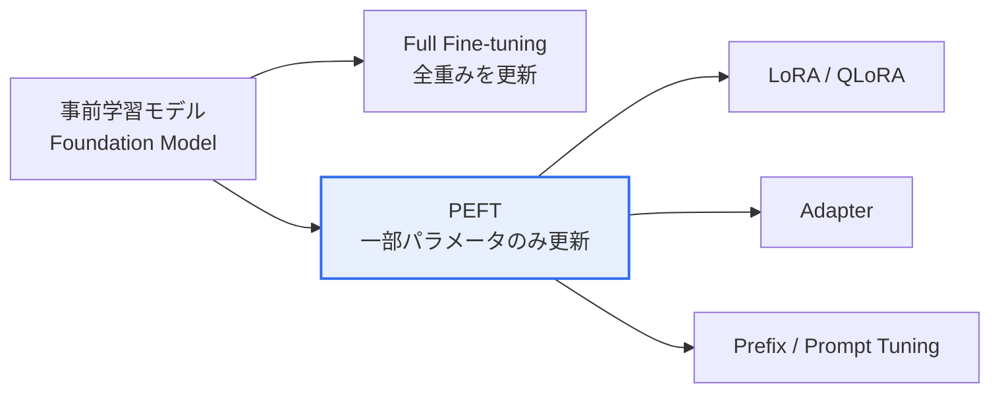

# AIファインチューニング(Fine-tuning)

## 1. 概要

### A. 定義
> 大規模データで事前学習(Pre-training)された**基盤モデル(Foundation Model)**を、特定のドメイン・タスク(Task)・応答形式に合わせた**比較的少量のデータで追加学習**させ、モデルの重みを調整することで性能を最適化する転移学習(Transfer Learning)の手法。

ファインチューニングの前提は、「事前学習モデルがすでに言語・世界に関する一般知識をパラメータに蓄えている」という点である。そのため一から学習する代わりに、すでに学習された表現の上に**望む方向への微細な調整**だけを加える。これは人が一般教育を終えた後に特定職務の研修を受けることに例えられ、少ないデータ・コストで専門性を付与できることが中核的な利点である。

### B. 登場背景および必要性
汎用の基盤モデルは幅広い知識を持つが、特定ドメインの専門用語・応答形式・企業固有のトーンには最適化されていない。これを最初から学習し直す(Pre-training)には数千枚のGPUと膨大なデータが必要であり、大半の組織にとって非現実的である。一方、プロンプトエンジニアリングだけでは、一貫したスタイルや深い専門知識を安定的に引き出すことは難しい。ファインチューニングはその中間の実用的な解決策であり、**全体を再学習せず一部のみを調整**することで、ドメイン特化の性能と一貫した形式を得る。ただし学習コストをさらに削減したいという要求が高まるにつれ、PEFT系の手法が登場した。

## 2. ファインチューニングの類型

類型は「**どれだけ多くのパラメータに手を加えるか**」で分かれる。全体を更新するFull方式は表現力が最大であるが、コストとリスクも大きく、一部のみを更新するPEFTはコスト・リスクを大きく下げる代わりに表現力をわずかに譲る。この折衷の位置づけが、そのまま実務での選択を左右する。

| 区分 | 内容 | トレードオフ |
|---|---|---|
| **Full Fine-tuning** | モデル全体の重みを更新 — 最高性能が可能 | GPU・ストレージコストが大きい、**破滅的忘却(Catastrophic Forgetting)**のリスク |
| **PEFT(Parameter-Efficient Fine-Tuning)** | 少数のパラメータのみを学習、元の重みは凍結 | 低コスト・低メモリ、元の知識を保持 vs 極限性能はFullに及ばない場合がある |

**破滅的忘却**とは、新しいタスクを学習する過程で既存の知識を忘れてしまう現象であり、Full方式で特に顕著である。全重みを新しいデータに合わせて大きく動かすと、事前学習で獲得した一般能力が上書きされてしまうためである。PEFTが元の重みを凍結し少数のみを学習する理由は、まさにこの忘却を構造的に抑制するためである。

## 3. PEFTの主要手法

PEFTの共通原理は、「**巨大な元のモデルはそのままにして、小さな追加パラメータのみを学習**」することである。こうすることで学習・保存の対象が全体の1%前後にまで減り、単一GPUでもチューニングが可能になる。

| 手法 | 中核原理 | 長所 |
|---|---|---|
| **LoRA** | 重みの変化量 $\Delta W$ を低ランク(Low-Rank)な2つの行列の積で近似し、その少数パラメータのみを学習 | 元モデル凍結・保存量が極小、複数アダプタの切替が容易 |
| **QLoRA** | モデルを4bitに量子化してメモリを削減した上でLoRAを適用 | コンシューマ向け単一GPUで大規模モデルをチューニング |
| **Adapter** | Transformerの層間に小さなニューラルネットワークモジュールを挿入し、そのモジュールのみを学習 | タスクごとのモジュール分離・再利用 |
| **Prefix/Prompt Tuning** | 入力の前に学習可能な仮想トークン(Soft Prompt)のみを最適化、本体は凍結 | パラメータが極小、タスク切替が容易 |

**LoRA**が成立する根拠は、「ファインチューニングで必要な重みの変化は、実際には低いランク(内在次元)に位置する」という観察である。そのため $\Delta W$ を $B\cdot A$ (小さな2つの行列)で近似しても性能損失は小さい。**QLoRA**はこれに4bit量子化を加え、例えば数十GBを要していた大規模モデルのチューニングを単一の24GB級GPUで可能にしたことで、実務的な波及効果が大きかった。

## 4. アラインメント(Alignment)ファインチューニング

アラインメントとは、「能力」を超えて「**人の意図・価値観に沿って振る舞うように**」するファインチューニングである。事前学習モデルは次トークン予測には長けているが、指示に従ったり有害な回答を拒否したりする傾向は別途学習させる必要がある。この過程では通常、SFTで指示遂行の骨格を築き、続いて選好に基づくアラインメントで回答の質を人の好みに合わせる。

| 段階 | 内容 | 役割 |
|---|---|---|
| **SFT(教師ありファインチューニング)** | 指示-応答(Instruction)のペアで学習 | 指示遂行能力の基礎を付与 |
| **RLHF** | 人の選好で学習した報酬モデル + 強化学習(PPO)でアラインメント | 微妙な選好まで反映、複雑・不安定 |
| **DPO** | 報酬モデル・強化学習なしに選好ペアで直接最適化 | RLHFより簡潔・安定、実装が容易 |

RLHFは強力であるが、報酬モデルの学習とPPOによる強化学習という2段階が不安定で、多くのリソースを消費する。**DPO**は選好ペア(より良い回答/劣る回答)から方策を直接最適化することでこの複雑さを取り除いたことが登場の背景であり、近年の実務で好まれる理由である。

## 5. RAGとの比較

ファインチューニングとRAGは代替関係ではなく、**役割が異なる**。ファインチューニングは知識・能力を重みに内在化するため、形式・トーン・特定の能力を学習させるのに強いが、知識が変われば再学習が必要となる。RAGは事実・最新情報を外部から注入するため、更新が速く、出典を提示できる。

| 区分 | ファインチューニング | RAG |
|---|---|---|
| **知識の注入** | 重みに内在化(学習) | 推論時に外部検索でプロンプトに結合 |
| **最新性** | 再学習が必要(遅い・コスト) | ナレッジベースのみ更新(速い) |
| **適合** | 形式・トーン・専門能力の内在化 | 最新・根拠に基づく事実応答、出典提示 |
| **コスト** | 学習コスト・データ構築 | 検索インフラ |

> そのため実務では、**「能力はファインチューニング、知識はRAG」**として併用するケースが多い。例えば社内相談チャットボットでは、トーン・応対形式をファインチューニングで固定し、頻繁に変わる商品・ポリシー情報はRAGで注入する。

## 6. 考慮事項および示唆
- **データの品質・量が性能を左右**: 少量・低品質のデータで学習すると過学習したり、かえって性能が低下したりする。数千件規模であっても、クレンジングと多様性が重要である。
- **破滅的忘却の防止**: PEFT、低い学習率、正則化、既存データの混合(リハーサル)によって一般能力の毀損を抑制する。
- **コンプライアンス・セキュリティ**: 個人情報・著作権のあるデータを学習に使うと、その情報がモデルに残って漏えいする可能性があるため、データの出所・ライセンス・匿名化を事前に検討しなければならない。
- **オンプレミス・コスト効率戦略**: 小型特化モデル(sLLM)にPEFTを組み合わせれば、自社インフラで低コストにドメイン特化AIを運用でき、データ主権が重要な組織に適している。

---

> **一言まとめ**: ファインチューニングは*事前学習モデルを少量のタスクデータで追加学習*して重みを調整する転移学習の手法であり、**PEFT(LoRA・QLoRA)で低コスト・低忘却を実現**し、**SFT・RLHF/DPOで人間の選好にアラインメント**し、最新知識はRAGと併用(「能力はファインチューニング、知識はRAG」)して補完する。
