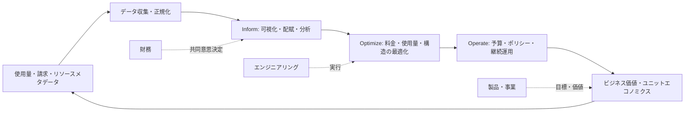
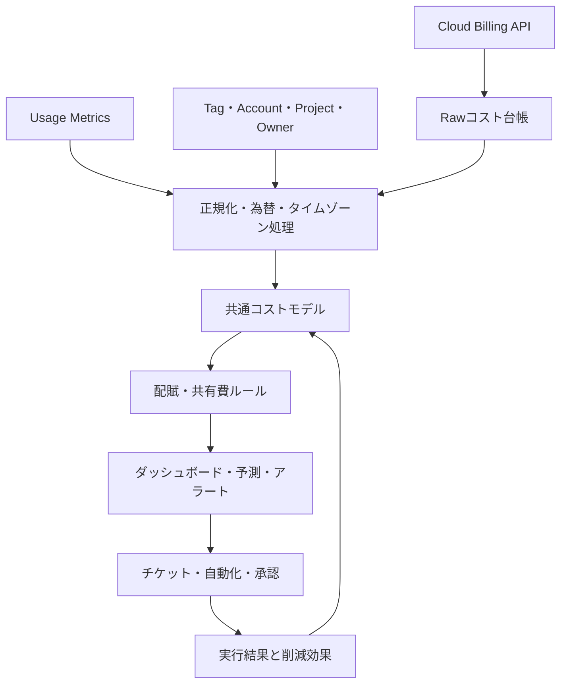

# FinOps(クラウドのコスト・価値最適化)

## 1. 概要

> **定義**: FinOpsとは、クラウドおよびテクノロジー支出のビジネス価値を最大化し、タイムリーなデータ駆動型の意思決定と、エンジニアリング・財務・ビジネスチームの協働を通じて財務的な説明責任を生み出す運用フレームワークであり、文化的な実践である。

クラウドは、使用量に応じてコストが変動する変動費モデルを提供する。
このモデルは初期の大規模な設備投資を減らし、需要に合わせた弾力的な拡張を可能にする。
一方で、リソースがAPIで即座に生成され、複数のチームで共有されるため、従来の年間予算だけでは実際の使用量とコストを統制することが難しい。
開発者は性能とリリース速度を優先し、財務部門は予算と会計を重視し、経営陣は製品の売上と顧客価値を見る。
FinOpsは、この視点の違いをコスト削減という単一の目標に無理やり統合しない。
その代わりに、同一のコスト・使用量データとビジネス指標に基づいて、各チームが責任ある選択を行えるよう結びつける。

したがってFinOpsは、単なる請求書分析ツールやクラウド購買交渉の手法ではない。
予算策定、コスト配賦、異常検知、予約・コミットメント割引、リソース最適化、ユニットエコノミクス、サステナビリティにまで及ぶ管理体系である。
コストを無条件に削減すれば、性能低下、可用性低下、開発遅延が生じ得る。
FinOpsの中核的な問いは、「いくら削減したか」よりも「支出によってどのような価値を得て、次の意思決定の不確実性をどれだけ下げたか」に近い。

2025年のFinOps Foundation Frameworkは、パブリッククラウドだけでなく、SaaS、データセンター、ライセンスなどのテクノロジー支出を扱う拡張された範囲とScopeの概念を説明している。
したがって、クラウド移行を終えた組織もFinOpsを適用できる。
特に生成AIは、GPU、推論呼び出し、保存・転送、ベクトル検索のコストが品質・レイテンシと連動して動くため、FinOpsとモデル運用の結合が重要である。

## 2. 必要性および中核原則

### 2.1 導入背景

第一に、クラウドコストは組織の意思決定と同じ速度で発生する。
開発・データチームが実験環境を作成すれば、月末の決算前にコストが累積し得る。
第二に、共有アカウントや複数リージョンにまたがるコストは、サービス・製品・環境・オーナーごとに分解されなければ、改善責任を定めることが難しい。
第三に、タグの欠落やアカウント構造の不整合が繰り返されると、コストレポートの信頼性が低下する。
第四に、リザーブドインスタンスやコミットメント割引は長期の使用量が確実な場合に有効であるが、誤って購入すると未使用コミットメントという新たな無駄になる。

FinOpsは、この問題を人・プロセス・プラットフォームの結合の問題と捉える。
組織面では、エンジニアリング・財務・製品の担当者が共通の用語を使う必要がある。
プロセス面では、予算・予測・最適化・例外承認のサイクルを運用する必要がある。
プラットフォーム面では、請求データ、メタデータ、リソースの計測値、サービスの成果指標を結びつける必要がある。
どれか一つだけを導入しても、ダッシュボードはできるが行動変容は起こらない。

### 2.2 中核原則

| 原則 | 意味 | 実務適用 |
|---|---|---|
| チームが協働する | 財務と技術の共同意思決定 | 月次コストレビュー、製品・プラットフォーム合同会議 |
| 全員が使用量に責任を持つ | コストを中央組織だけで管理しない | サービスオーナーごとに予算・ユニット指標を付与 |
| 意思決定はビジネス価値を基準とする | コストと成果を併せて評価 | 注文あたりコスト、アクティブユーザーあたりコストの分析 |
| データはタイムリーにアクセス可能かつ正確であるべき | 遅い・不完全なデータは行動を妨げる | コスト台帳、タグ、配賦ルールの品質管理 |
| 中央でFinOpsを推進する | 標準とツールは中央が提供 | ポリシー・ダッシュボード・教育・自動化プラットフォームの提供 |
| 変動費の利点を活用する | 需要に合わせてリソースを調整 | 弾力的拡張、サーバーレス、スポット利用の検討 |

この原則は、コストを統制する中央承認体制とは異なる。
中央組織がすべてのリソース作成権限を握れば無駄は減らせるが、デプロイ速度と実験速度が落ちる可能性がある。
逆に各チームに完全な自律性だけを与えれば、コスト・セキュリティ・コンプライアンスが断片化する。
FinOpsの均衡点は、中央がガードレールとデータを提供し、現場のチームが迅速に選択しつつ結果に責任を負う構造である。

## 3. FinOpsの運用構造とライフサイクル

### 3.1 全体構造図

FinOpsのInformフェーズは、何がどこでどれだけ発生したかを説明する段階である。
クラウドプロバイダーの請求明細をそのまま見せるだけで終わらず、アカウント・プロジェクト・サービス・環境・チーム・製品を基準にコストを分類する。
配賦されていないコストとは、共用プラットフォームコストや共有データ転送のように、直接帰属させることが難しい項目である。
これを無理に特定チームへ配賦すれば、数字は完結して見えるが信頼を失う。
直接費、共有費、未配賦費を区分し、配賦ルールと例外を公開するほうが管理上有利である。

Optimizeフェーズは、コストを下げる方法を選択する段階である。
料金最適化は、予約・コミットメント・ボリューム割引のように単価を下げるアプローチである。
使用量最適化は、アイドルリソースの停止、適正サイジング、ストレージのライフサイクル管理、クエリの効率化のように消費量を減らすアプローチである。
構造最適化は、アーキテクチャを変えてコストと品質の関係を改善するアプローチである。
三つのアプローチは互いに代替するものではなく、料金割引だけで過剰プロビジョニングの問題を解決することはできない。

Operateフェーズは、一回限りのキャンペーンではなく管理ループを作る。
予算と予測の差異をモニタリングし、ポリシー違反や異常兆候に対応し、最適化施策の効果を検証する。
運用サイクルは日・週・月単位に分けることができる。
日単位は障害・急増の検知、週単位は実行施策の点検、月単位は製品価値と予算を結びつけるのに適している。

### 3.2 役割と責任

FinOps Practitionerは、共通データモデル、運用プロセス、教育と調整の役割を担う。
財務は、予算・会計・予測・コミットメントに関する財務基準を提供する。
エンジニアリングは、リソース構成、性能、安定性、自動化に関する技術的選択を実行する。
製品・事業組織は、顧客価値、売上、アクティブ度といった成果指標を定義する。
購買・法務・セキュリティ組織は、契約、ライセンス、規制、データ所在の条件を検討する。

| 役割 | 主な問い | 中核成果物 |
|---|---|---|
| 経営陣 | テクノロジー支出は戦略目標を支援しているか | 投資優先順位、許容可能なコスト・リスク |
| 財務 | 実績・予測コストは予算とどう異なるか | 予算、見通し、会計基準 |
| エンジニアリング | 同じ品質をより少ないリソースで提供できるか | 最適化バックログ、アーキテクチャ改善 |
| 製品・事業 | コストを顧客成果とどう結びつけるか | ユニットエコノミクス、製品KPI |
| FinOps運用者 | データと実行体制をどう維持するか | コストモデル、ポリシー、レポート |
| セキュリティ・コンプライアンス | 削減が統制・規制を損なわないか | 例外基準、監査証跡 |

責任を定める際に「クラウドコストは中央ITのコスト」とだけ定義すれば、現場の行動は変わらない。
サービスオーナーには統制可能な範囲のコストと成果を併せて提示し、統制できない共用コストは別途表示する。
例えば、データプラットフォームチームは保存・処理コストを統制できるが、特定事業部のデータ増加量そのものをすべて統制することはできない。
この区分があってこそKPIが公正になり、最適化の推奨に対する受容性が高まる。

## 4. データ・プロセス・ツールの設計

### 4.1 コストデータパイプライン

コストデータは金額だけを集めても十分ではない。
請求期間、サービス、リージョン、アカウント、リソース識別子、使用量、単価、割引、税金、通貨、タグといったディメンションが必要である。
プロバイダーごとに名称と計測単位が異なるため、正規化層で共通の用語を作る。
例えば、コンピュート時間、リクエスト数、ストレージ容量、データ転送量を各サービスの元の単位とともに保存してこそ、再現可能な分析が可能になる。
ソースデータは修正せずに保存し、変換・配賦段階にはバージョンと実行時刻を残す。

タグは便利であるが、唯一の統制手段ではない。
タグは自動生成されるリソースで欠落することがあり、ユーザーが値を任意に変更でき、プロバイダーのサービスごとに適用範囲が異なる。
したがって、アカウント・プロジェクト階層、組織ディレクトリ、IaC変数、サービスカタログとタグを組み合わせて使用する。
必須メタデータのないリソースは作成段階でブロックするか隔離アカウントに送り、例外には有効期限を設ける。

### 4.2 配賦とショーバック・チャージバック

ショーバックは、コスト情報をチームに提示するが、実際の社内請求は行わない方式である。
チャージバックは、合意されたルールに基づいてコストを組織や製品のコストセンターに帰属させる方式である。
導入初期にはデータの信頼性を高めるためにショーバックから始め、配賦ルールと異議申し立て手続きが安定した後にチャージバックへ拡大するのが安全である。
直接帰属が可能な専用データベースは、実際に使用するチームに配賦できる。
複数チームが使用するKubernetesクラスタでは、CPU・メモリの要求量、実使用量、ネームスペース、リクエスト数などのコストドライバーを選択しなければならない。

| コスト類型 | 配賦の例 | 注意点 |
|---|---|---|
| 直接コスト | 製品専用DBを製品コストに帰属 | リソースの所有権とライフサイクルを確認 |
| 共有プラットフォーム | 使用量・予約量・チーム数で分担 | コストドライバーを公開しレビュー |
| 共通コスト | 組織共通費として維持 | 無理な配賦より透明な未配賦表示 |
| 未配賦コスト | タグ欠落・分類失敗 | 改善目標として管理するが数値の操作は禁止 |

### 4.3 予算と予測

予算は目標と上限を定め、予測は現在の情報で将来の支出を推定する。
クラウドの予測には固定の月額コストだけでなく、ユーザー数、リクエスト量、データ増加率、リージョン、為替、割引の満了、新規プロジェクトを反映する。
単に前月のコストに成長率を一つ掛けるだけでは、季節性や大規模なコミットメント購入を見落とす可能性がある。
製品ごとの使用量ドライバーを定義し、楽観・基準・悲観のシナリオを併せて管理する。

予算超過アラートは統制手段であって、自動遮断と同一ではない。
バッチ学習や開発環境は自動停止の候補になり得るが、医療・金融取引のような中核業務は、可用性・規制条件のために即時停止できない。
アラートの重大度、承認者、対応時間、例外の有効期限をポリシーとして定めなければならない。

## 5. 最適化手法とコスト・品質のバランス

### 5.1 料金最適化

予約型割引やコミットメントは、継続的な使用量があるワークロードの単価を下げることができる。
しかし需要が不確実な新規サービスで長期コミットメントを先に購入すると、柔軟性が失われる。
購入前に、基準使用量、成長トレンド、満了時期、移行・交換条件、組織間での共有可能性を検討する。
スポット・プリエンプティブルリソースは中断に耐えられるバッチ処理に適しており、セッション状態を外部化し再試行できる必要がある。

### 5.2 使用量最適化

適正サイジングは、CPU・メモリ・IOPS・ネットワーク使用率とレイテンシを併せて見て実施する。
平均使用率だけを見て縮小すると、ピーク時間帯のエラー率が上昇する可能性があるため、パーセンタイルとサービスレベル目標を用いる。
アイドル状態のディスクや未接続のIP、古いスナップショット、重複ログを特定し、保存ポリシーと復旧要件を確認する。
ストレージはアクセス頻度と目標復旧時間を基準に階層化し、コストが低いという理由で復旧時間の長い階層へ一括移動しない。

### 5.3 アーキテクチャ最適化

サーバーレスはアイドル時間が長いイベント処理に効果的な場合があるが、呼び出し数が急増するとコストが急激に増える可能性がある。
キャッシュはデータベースの負荷とレイテンシを減らすが、キャッシュの不整合とメモリコストを生む。
マルチリージョンは回復力とレイテンシを改善するが、複製・転送・運用コストを増加させる。
したがってアーキテクチャの選択は月額請求額だけで比較せず、障害コスト、開発生産性、セキュリティ統制、データ主権まで含めた総価値で判断する。

## 6. 指標とユニットエコノミクス

総コストは管理に必要な出発点であるが、成果を説明するには不十分である。
サービスコストを注文数、API呼び出し、アクティブユーザー、学習サンプル、生成トークンといったビジネス単位で割れば、成長とコスト効率を併せて観察できる。
単位コストが下がっても、顧客満足度や処理品質が悪化すれば成功とはみなせない。
逆に単位コストが一時的に上がっても、売上・品質・安定性がより大きく改善すれば合理的な投資であり得る。

| 指標 | 計算例 | 解釈 |
|---|---|---|
| 総テクノロジー支出 | クラウド・SaaS・ライセンスの合計 | 規模とトレンドの把握 |
| サービス原価 | サービス関連の直接費 + 合意された共有費 | 製品損益分析 |
| 単位コスト | サービス原価 / ビジネス単位 | 効率性と規模の効果 |
| 予測誤差 | 実績コスト - 予測コスト | 計画品質と不確実性 |
| コミットメント活用率 | 使用されたコミットメント量 / 購入コミットメント量 | 購入意思決定の品質 |
| 最適化実現率 | 実際に反映された削減額 / 承認施策額 | 実行力の測定 |
| コスト異常検知率 | 検知された異常イベント / 全異常イベント | 検知体制の効果 |
| 炭素集約度 | 技術活動量あたりの排出量 | サステナビリティとの連携 |

例えば、ECサービスが月1,000万件の注文を処理し、テクノロジーコストが2億ウォンであれば、注文あたりのコストは20ウォンである。
コストが2億2千万ウォンに増えたものの注文が1,500万件に増加したならば、注文あたりのコストは約14.7ウォンに下がる。
しかし注文あたりのコストだけを見て成功を宣言する前に、返品率、障害率、決済成功率を併せて確認しなければならない。
このようにFinOpsは、会計上の金額と運用・事業指標を結びつけるユニットエコノミクス分析を求める。

## 7. 比較および事例

### 7.1 FinOpsと従来型ITコスト管理の比較

従来型のITコスト管理は、年間予算、資産購入、コストセンター決算を中心とする。
これは固定資産と長期契約の統制が重要な環境で強みを持つ。
FinOpsは変動する使用量、迅速なデプロイ、サービスオーナーによる技術選択を前提とするため、より短いフィードバックサイクルを求める。
両体系は競合関係ではなく、会計・購買の統制と技術運用の俊敏性を結びつける関係である。

| 区分 | 従来型ITコスト管理 | FinOps |
|---|---|---|
| コスト形態 | 固定・資産中心 | 変動・使用量中心 |
| サイクル | 年次・月末中心 | リアルタイム・日・週・月の組み合わせ |
| 責任主体 | 中央IT・財務 | 技術・財務・製品の共同 |
| 最適化基準 | 予算遵守 | コストに対するビジネス価値 |
| 統制方式 | 事前承認中心 | ガードレールと事後責任 |

### 7.2 事例: AI推論サービス

顧客相談の要約サービスが大規模言語モデルのAPIを使用していると仮定する。
呼び出しあたりのトークンコストだけを見ると、短いプロンプトに変えることが最適化のように見える。
しかしプロンプトを過度に短縮すると要約品質が低下し、相談の再処理やオペレーターによる検収が増える可能性がある。
FinOpsの観点では、リクエストあたりのトークン、成功応答率、再試行率、レイテンシ、相談完了率を一つのダッシュボードで結びつける。

トラフィックが一定の業務はバッチ処理とキャッシュを検討し、リアルタイム性の高い業務は小型モデルと大型モデルのルーティングポリシーを比較する。
モデル変更の前後で品質評価セットを固定し、コスト削減額だけでなく品質閾値の未達率を承認条件とする。
GPUを自社で運用する場合は、GPU使用率、メモリ搭載率、モデル別の推論量、アイドル時間、電力使用量を併せて測定する。
この事例は、AIのコスト管理が単なるインフラ縮小ではなく、モデル・データ・製品ポリシーの共同設計であることを示している。

### 7.3 事例: Kubernetes共有クラスタ

複数の製品チームが一つのクラスタを使用すると、ノードコストをネームスペースごとに正確に分けることは難しい。
CPU・メモリの要求量を基準に配賦すれば、予約されたリソースに対する責任を反映できる。
実使用量を基準に配賦すれば効率の良いチームに有利であるが、ピークに備えたチームのコスト責任が過小評価される可能性がある。
したがって、基本配賦は要求量、別指標は実使用量とアイドル率とし、共用のコントロールプレーンのコストは共通費として維持するという折衷が可能である。

## 8. 深掘り: 2025 FrameworkとCloud+の観点

FinOps Foundationの2025 Frameworkは、FinOpsを特定のクラウドプロバイダーのコストツールではなく、テクノロジー価値管理の慣行へと拡張している。
FrameworkのScopeはFinOpsを適用するテクノロジー支出の区分を意味し、パブリッククラウド以外の支出も同じ意思決定体系で扱えるようにする。
この変化は、SaaS・PaaS・データセンター・ライセンス・AIのように、請求形式は異なるが使用量と価値の関係を管理すべき領域に適用できることを意味する。
ただし、すべてのコストを同じ配賦方式で統合するという意味ではない。
各Scopeの使用量の定義、契約条件、コストの可視性、最適化レバーが異なるため、共通原則と領域別の実行モデルを分離しなければならない。

FOCUSのような共通請求データスキーマを活用すれば、プロバイダーごとの請求形式の違いを減らすのに役立つ。
しかし標準スキーマを導入したからといって、データ品質が自動的に保証されるわけではない。
リソースオーナー、製品階層、為替、割引の配賦、税金処理といった組織固有の情報は別途統合が必要である。
実務では、元の請求データ、標準化データ、管理用の配賦データをすべて追跡可能な形で保存する。

## 9. 考慮事項および示唆

### 9.1 削減とサービスレベルのバランス

コスト最適化施策には、必ず性能・可用性・復旧時間への影響評価を付ける。
自動停止や縮小のポリシーは、業務の重要度と運用時間を基準に段階化する。
削減額を計算する際に、障害による売上損失と復旧コストを除外すれば、誤った意思決定となる。

### 9.2 データ品質と説明責任

コストデータの正確性、完全性、適時性、リネージを品質指標として管理する。
タグ適用率だけでなく、コストのオーナー識別率と配賦に対する異議申し立て率も確認する。
レポートの数値が修正された際に、どのソースデータとルールから算出されたかを説明できてこそ、監査と経営の意思決定に使用できる。

### 9.3 自動化と例外管理

ポリシーをコードで表現すれば、リソース作成時点でのタグ検査、業務時間外の停止、異常コストのアラートを自動化できる。
ただし自動化は誤った分類を拡大させる可能性があるため、影響の大きい作業には承認・シミュレーション・ロールバックを設ける。
例外は永久免除ではなく、理由・責任者・有効期限・再検討条件を持つチケットとして管理する。

### 9.4 組織文化と評価体系

開発チームをコスト削減額だけで評価すると、性能を下げたりコストを別アカウントに移したりする歪みが生じる。
製品KPI、サービスレベル、セキュリティ、サステナビリティとコストを併せて評価しなければならない。
失敗した最適化の実験も、学習結果と再発防止策を残せば成熟度の向上に寄与する。

### 9.5 AI・データセンターへの拡張

AIワークロードでは、モデル品質、トークン、GPU時間、データ転送、電力と冷却を併せて見る必要がある。
データセンターのコストは、パブリッククラウドとは異なり減価償却・電力・ラックスペース・人員の固定費が混在するため、Scopeごとの原価モデルを別途設計する。
技術士は、異なるコスト構造を単一の数値に単純化せず、意思決定の目的に合った原価の観点とユニットエコノミクスを提示しなければならない。

### 9.6 導入ロードマップ

第1段階では、経営目標、コストオーナー、中核Scope、データ収集範囲を定義する。
第2段階では、アカウント・プロジェクト・タグ・サービスカタログを整備し、ショーバックのダッシュボードを構築する。
第3段階では、予算・予測・異常兆候・最適化バックログを運用し、実現効果を検証する。
第4段階では、ユニットエコノミクス、コミットメントポートフォリオ、サステナビリティ、AIコストにまで拡張する。
各段階の終了条件は、ツールの導入ではなく、データの信頼、責任主体、反復可能な意思決定の定着として定義しなければならない。

## 参考資料

- FinOps Foundation, “FinOps Framework Overview”: https://www.finops.org/framework/
- FinOps Foundation, “Framework 2025 reflects the addition of Scopes”: https://www.finops.org/insights/2025-finops-framework/
- FinOps Foundation, “FinOps Framework 2025 PDF”: https://www.finops.org/wp-content/uploads/2025/05/English-FinOps-Framework-2025.pdf

---

> **一言まとめ**: FinOpsはクラウドコストを単に削減する活動ではなく、テクノロジーの使用量・コスト・品質・ビジネス価値を結びつけて継続的に意思決定する運用体系である。
