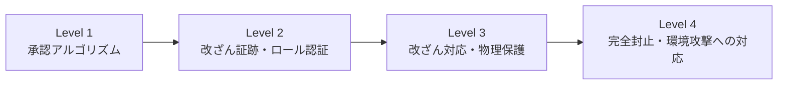

# FIPS 140-2 (暗号モジュールのセキュリティ要件)

## 1. 概要

### A. 定義
> 米国NISTが制定した**暗号モジュール(Cryptographic Module)のセキュリティ要件**に関する連邦標準。暗号機能を実行するハードウェア・ソフトウェア・ファームウェアのモジュールが備えるべきセキュリティ要件を4段階(Level 1〜4)で規定し、**CMVP(暗号モジュール検証プログラム)**を通じて第三者が検証する。

### B. 登場背景および必要性
いかに強力な暗号アルゴリズム(AES、RSA)を用いても、そのアルゴリズムを搭載して**鍵を生成・保存・使用するモジュール自体が脆弱であれば**、鍵が物理的に奪取されたりサイドチャネルから漏えいしたりして、セキュリティ全体が崩壊する。すなわち、セキュリティの実際の破綻点はアルゴリズムの数学的強度ではなく、**実装と運用の境界**にある。FIPS 140-2は、「アルゴリズムは安全か」を超えて「そのアルゴリズムを収めた箱は安全か」を標準化された基準で検証するために登場した。米連邦政府・金融機関は調達時にこの検証を要求しており、検証を受けていない製品は事実上市場参入が阻まれるため、事実上のグローバルな信頼基準として機能している。

## 2. セキュリティレベルの分類(Level 1〜4)

4つの段階は物理的脅威に対する防御強度を段階的に高めたものであり、脅威モデルが強くなるほど要件が累積する。**Level 1**は承認されたアルゴリズムの使用のみを求め、物理的保護はないため、汎用PCのソフトウェア暗号ライブラリがこれに該当する。**Level 2**は封印シール・ケースのように物理的侵入の**痕跡が残る(Tamper-evidence)**仕組みとロールベース認証を求め、事後に改ざんの事実を把握できるようにする。**Level 3**は痕跡を残すにとどまらず、侵入が検知されると**鍵を即座に消去(ゼロ化)**する能動的対応と強固な物理保護、IDベース認証を求める。**Level 4**はモジュールを完全に封止し、電圧・温度といった**環境改変攻撃まで検知・対応**する最高等級であり、物理的に露出した環境に置かれる高リスク機器を対象とする。

| レベル | 中核要件 | 代表的な適用 |
|---|---|---|
| **Level 1** | 承認アルゴリズムの使用(物理保護なし) | SW暗号ライブラリ |
| **Level 2** | 改ざん証跡、ロールベース認証 | 商用セキュリティ機器 |
| **Level 3** | 改ざん対応(鍵のゼロ化)、物理保護、ID認証 | HSM、金融端末 |
| **Level 4** | 完全封止、環境(電圧・温度)攻撃への対応 | 物理的露出のある高リスク機器 |

## 3. 暗号システム設計時の考慮事項

FIPS 140-2が実際に検証するのは、アルゴリズム一つではなく、**鍵のライフサイクル全体とモジュールの自己防御能力**である。第一に、**承認アルゴリズム(Approved)**のみを使用しなければならず、AES・SHA-2・RSA・ECDSAなどNISTが検証したリストの中から選択する必要がある。第二に、**鍵管理**は生成・配布・保存・使用・廃棄の全周期を保護しなければならず、特に鍵が平文で露出する瞬間を最小化する必要がある。第三に、**乱数生成(RNG)**は予測不可能性が暗号強度を左右するため、承認されたDRBGと十分なエントロピー源を求める。第四に、モジュールは電源投入時や特定条件下で自らの完全性とアルゴリズムの正確性を点検する**自己テスト(Self-Test)**を行い、損傷した状態で動作することを防止する。

| 考慮要素 | 内容 | 理由 |
|---|---|---|
| **承認アルゴリズム** | AES・SHA-2・RSAなどの検証リスト | 未検証アルゴリズムの排除 |
| **鍵管理** | 生成〜廃棄の全周期を保護 | 鍵の露出が最終的な破綻点 |
| **乱数(RNG)** | 承認DRBG、十分なエントロピー | 予測されると鍵の推定が可能 |
| **自己テスト** | 電源投入時・条件付きSelf-Test | 損傷状態での動作を遮断 |

## 4. セキュリティ要素・脅威対応戦略

モジュールが防御すべき脅威は、論理的攻撃を超えて**物理・サイドチャネル領域**にまで及ぶ。物理攻撃に対しては封止・ゼロ化によって改ざん証跡と対応を提供し、電力・タイミングの微細な変化から鍵を逆推定する**サイドチャネル攻撃(Side-channel)**には、演算時間を一定にしたりランダムなノイズを加えたりする**マスキング**で対応する。鍵の露出そのものを防ぐためには、鍵をハードウェア内部でのみ扱う**HSM**とアクセス制御を組み合わせる。これらの要素は個別ではなく、階層的に重なり合うことで実質的な防御となる。

| 区分 | 脅威 | 対応 |
|---|---|---|
| **物理攻撃** | 開封・改ざん | 封止・改ざん証跡・ゼロ化 |
| **サイドチャネル攻撃** | 電力・タイミング解析 | 定数時間演算・マスキング |
| **鍵の露出** | メモリ・ストレージの奪取 | HSM、アクセス制御、ゼロ化 |
| **環境攻撃** | 電圧・温度の操作 | 環境センサー・遮断(Level 4) |

## 5. 考慮事項および示唆
- **FIPS 140-3への移行**: 後継標準である**FIPS 140-3**は国際標準**ISO/IEC 19790**に基づいており、サイドチャネル対策などの要件が強化された。新規検証は140-3で行われるため、調達・設計時にはこれを基準としなければならない。
- **韓国の対応(KCMVP)**: 韓国の公共分野では国家情報院の**KCMVP(検証対象暗号モジュール)**で対応しており、ARIA・SEEDなどの韓国産アルゴリズムの検証を含む。
- **耐量子暗号(PQC)への備え**: RSA・ECCが量子コンピューティングに対して脆弱になるにつれ、NISTによる標準化が完了したPQCアルゴリズムへの移行とcrypto-agility(アルゴリズム交換の柔軟性)の設計が次の課題である。

---

> **一言まとめ**: FIPS 140-2は*暗号モジュールのセキュリティ要件に関する連邦標準*であり、物理保護・認証強度に応じてLevel 1〜4に分け、CMVPで検証し、承認アルゴリズム・鍵管理・乱数・自己テスト・物理/サイドチャネル対策を設計要件として求め、FIPS 140-3・PQCへと進化している。
