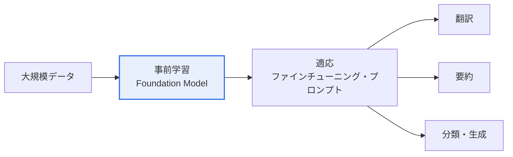

# 基盤モデル(Foundation Model)

## 1. 概要

### A. 定義
> 膨大なデータで**事前学習(Pre-training)**され、多様な下流タスク(downstream task)に適応・活用できる**汎用の大規模AIモデル**。GPT・BERT・CLIPなどが代表的であり、ファインチューニングやプロンプトによって様々な応用に再利用される。

基盤モデルがもたらしたパラダイム転換は、「**タスクごとにモデルを新たに作る方式から、一つの汎用モデルを複数のタスクに適応させる方式へ**」の移行である。かつては翻訳器、感情分析器、チャットボットをそれぞれ別々に一から学習させる必要があった。基盤モデルは大規模な事前学習を通じて、言語・画像の一般的な表現(世界に関する幅広い知識とパターン)をまず習得し、その後は少量のデータやプロンプトだけで翻訳・要約・分類など多様なタスクを実行する。一つの「基盤(Foundation)」の上に複数の応用を載せるのである。これはAI開発の参入障壁を劇的に下げ、再利用性を最大化することで、AI産業の構造そのものを変えた。

### B. 登場背景
データ・計算量・モデル規模を大きくすれば性能が予測可能な形で向上するという「スケーリング則(Scaling Law)」が確認され、Transformer構造と大規模GPUインフラが組み合わさることで超大規模な事前学習が可能になったことが、基盤モデル台頭の技術的背景である。

## 2. 特徴

基盤モデルの特徴は相互に結びついている。**汎用性**は一つのモデルを複数のタスクに用いることであり、これは**大規模**なパラメータ・データから生まれる。規模が一定の閾値を超えると、学習していない能力が突然現れる**創発性(Emergence)**が観察され、ファインチューニング・プロンプト・RAGによって特定ドメインに**適応**させることができる。近年はテキスト・画像・音声を併せて扱う**マルチモーダル**へと拡張されている。

| 特徴 | 内容 |
|---|---|
| **汎用性** | 一つのモデルを多様なタスクに活用 |
| **大規模** | 膨大なパラメータ・データで事前学習 |
| **創発性** | 規模拡大時に予想外の能力が発現 |
| **適応性** | ファインチューニング・プロンプト・RAGでドメイン特化 |
| **マルチモーダル** | テキスト・画像・音声の統合処理 |

## 3. 基盤技術

基盤モデルは複数の技術の集大成である。**TransformerのSelf-Attention**は文脈の長距離依存性を学習する中核構造であり、**自己教師あり学習**はラベルなしで膨大な生データによる事前学習を可能にする。**分散学習・マルチGPU**(HBM・InfiniBand)は超大規模モデルの訓練を支え、**アラインメント(RLHF・DPO)**はモデルの出力を人間の選好に合わせ、**RAG・ファインチューニング**は最新・ドメイン知識を注入する。

| 技術 | 役割 |
|---|---|
| **Transformer・Self-Attention** | 長距離文脈の学習 |
| **自己教師あり学習** | ラベルなしでの大規模事前学習 |
| **分散学習・マルチGPU** | 超大規模モデルの訓練 |
| **アラインメント(RLHF・DPO)** | 人間の選好を反映したファインチューニング |
| **RAG・ファインチューニング** | 最新・ドメイン知識の注入 |

## 4. 実装時の考慮事項(法的・環境的・社会的)

基盤モデルは強力であるがゆえに、三つの層の責任が伴う。**法的**には、学習データの著作権・ライセンス、個人情報、結果に対する責任の所在、AI規制の遵守が問題となる。**環境的**には、超大規模モデルの訓練が莫大な電力と炭素を消費するため、グリーンAI・効率化が求められる。**社会的**には、バイアス・差別、偽情報・ディープフェイク、雇用の変化、悪用、少数のビッグテックによる独占と公平なアクセスの問題が提起されている。

| 側面 | 考慮事項 |
|---|---|
| **法的** | 学習データの著作権・ライセンス、個人情報、責任の所在、規制 |
| **環境的** | 訓練の電力・炭素排出、グリーンAI・軽量化 |
| **社会的** | バイアス・差別、偽情報・ディープフェイク、雇用・独占・アクセス性 |

## 5. 考慮事項および示唆

1. **応用エコシステムの拡大**が中核的な流れである。基盤モデルの上にファインチューニング・プロンプト・エージェントによって無数の応用が作られ、AI活用の中心軸となりつつある。
2. **信頼性・安全性・コストが課題**である。ハルシネーション・バイアスを減らす信頼性、アラインメントによる安全性、そして軽量モデル(sLLM)・量子化によってコストを下げる効率化が実用化の鍵である。
3. **法・環境・社会的リスクを設計段階で内在化**する必要がある。強力な汎用技術ほど副作用も大きいため、開発初期から責任あるAIの原則を統合しなければならない。

---

> **一言まとめ**: 基盤モデルは*大規模に事前学習された汎用AI*であり、ファインチューニング・プロンプトで多様なタスクに適応し、Transformer・自己教師あり学習・アラインメントを基盤とするが、学習データの著作権・電力・バイアスなどの法・環境・社会的リスクを設計段階から統合的に管理しなければならない。
