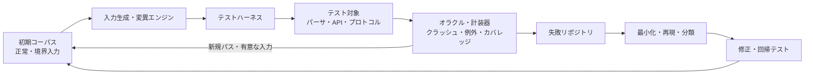
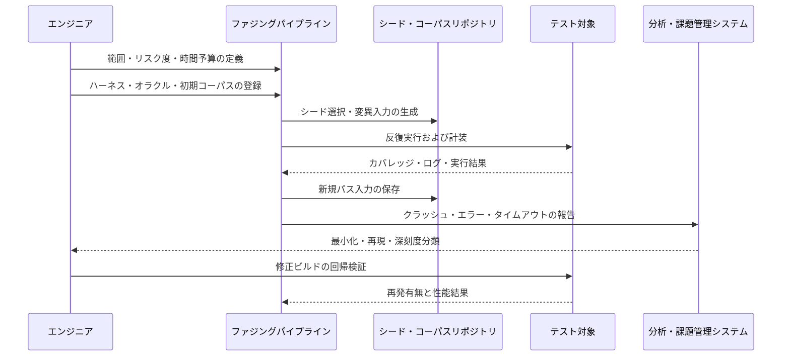

# ファジングテスト(Fuzz Testing)と脆弱性検出戦略

## 1. 概要

> **ファジングテスト(Fuzz Testing, Fuzzing)**とは、プログラムに正常な入力だけでなく、ランダム・変異・境界・異常な入力を大量に注入し、クラッシュ・例外・メモリエラー・整合性違反・性能低下といった異常兆候を自動的に観測して欠陥を発見する動的テスト手法である。

ソフトウェアは、開発者が想定した入力だけを処理するわけではない。ネットワークパケット、画像・文書ファイル、圧縮データ、APIリクエスト、プロトコルメッセージのように外部から入ってくるデータには、形式が壊れていたり、長さが過大であったり、互いに矛盾する値が含まれていたりする可能性がある。手動テストは代表的な正常シナリオの確認には強いが、入力空間が非常に大きいパーサや通信モジュールのあらゆる組み合わせを人が直接作ることは難しい。

ファジングはこの広大な入力空間を自動的に探索する。単に乱数を生成するのではなく、テスト対象の入力形式と実行結果を利用して、次に試行する入力を選択する。優れたファザーは、プログラムがまだ通過していない分岐や状態を刺激し続け、異常現象が再現される最小入力を保存することで、開発者が修正可能な欠陥へと変換する。

ファジングの直接的な対象は、ファイルパーサ・プロトコルスタック・コンパイラ・インタプリタ・認証モジュール・シリアライズライブラリ・スマートコントラクトのように外部入力を解釈するコードである。しかし対象はこれに限られない。金融取引APIの金額・通貨・日付の組み合わせ、IoT機器のコマンドメッセージ、データ変換パイプラインのスキーマもファジングの対象となり得る。

ファジングは、テストケースを大量に実行すること自体が目的ではない。探索されたコード範囲、発見された固有の欠陥、再現可能性、修正後の回帰防止の有無が成果を決定する。したがって、テスト対象の境界を明確にし、入力生成戦略と観測するオラクル(oracle)を設計し、失敗を分類・再現・修正する運用手順まで含めなければならない。

### A. 登場背景と必要性

第一に、入力の境界がシステムの外部へと拡張された。Web APIやモバイルアプリは多様なクライアントからデータを受け取り、マイクロサービスはサービス間のメッセージをネットワークで交換する。あるサービスが想定外の値を送っても受信側のサービスが安全に拒否しなければならないため、契約境界の堅牢性を自動検証する必要がある。

第二に、セキュリティ脆弱性は正常フローではなく例外経路で発生する場合が多い。長さ計算の整数オーバーフロー、不正な圧縮解除、ネスト構造の無限再帰、認証状態遷移の迂回は、一般的な機能テストだけでは見逃しやすい。ファジングはこうした境界条件を繰り返し刺激し、セキュリティテストと品質テストの接点を作る。

第三に、開発・デプロイサイクルが短くなった。リリースごとに手動で多数の入力を作ればテストがボトルネックになるが、ファジング作業はCIで一定時間または一定の実行回数で自動化できる。ただし無差別な実行だけをパイプラインに入れると、失敗の分類と環境の再現が難しくなるため、品質ゲートとリソース上限を併せて定義しなければならない。

## 2. ファジングテストの構成要素と動作原理

ファジングシステムはファザー単体では成り立たない。テストハーネス(harness)、入力コーパス(corpus)、変異・生成エンジン、計装器、オラクル、結果リポジトリが連携して動作する。どれか一つでも不十分であれば、実行回数は増えても欠陥発見力は高まらない。

### A. テストハーネス

ハーネスは、ファザーが生成したバイト列または構造化された値を、テスト対象の呼び出し形式に接続する薄いアダプタである。例えば画像デコーダをファジングするなら、入力バイトをメモリバッファに読み込んだ後にデコーダの公開関数を呼び出し、APIをファジングするなら、生成したリクエストを認証・ルーティング・検証の段階まで渡す。

ハーネスは小さく、決定的でなければならない。実運用サーバ全体を毎回起動すると、1回の実行コストが大きくなり、外部システムの状態によって結果が変わる。可能であればファイル保存・時刻・乱数・ネットワークを仮想化し、テスト対象の中核となるパース・検証ロジックをプロセス内で高速に呼び出す。

ハーネスが入力を過度に早い段階で拒否すると、ファザーは深いコードに到達できない。逆にすべての検証を除去すると、運用経路とは異なる動作を試験することになる。したがって、入力の形式境界は維持しつつ、外部依存はフェイクオブジェクトや固定フィクスチャに置き換えて深い状態まで到達させるバランスが必要である。

優れたハーネスは、1回の入力が一つの明確なテストを表現するように作る。複数のテストを1プロセスにまとめる場合は、グローバル状態とキャッシュを初期化し、前の入力の結果が次の入力に影響しないことを確認しなければならない。状態が残ると同一入力の結果が変わり、欠陥の再現が難しくなる。

### B. 入力コーパスとシード

コーパスとは、ファジング開始時に使用する入力の集合である。正常にパースされる短いファイル、各フィールドが埋められたAPIリクエスト、最小・最大長のパケット、過去に発見された失敗入力のすべてがシードになり得る。シードの品質は、ファザーが有効な内部状態にどれだけ速く到達するかに影響する。

コーパスは量より多様性が重要である。互いにほぼ同じ入力ばかりが多ければ、ストレージと実行時間が浪費される。カバレッジや構造的特徴を基準に重複を減らし、異なるバージョン・エンコーディング・ネストの深さ・任意フィールドを代表する入力を残す。

運用で収集した入力をシードとして使用する場合は、個人情報・認証トークン・顧客識別子を除去しなければならない。元のログをそのままコーパスに入れると、テストリポジトリが新たな個人情報の保管場所になってしまう。匿名化とアクセス権限、保存期間、漏えい時の廃棄手順をコーパス管理ルールに含める。

### C. 変異と生成

変異ベースのファジングは、すでに有効な入力の一部を変更する。ビット反転、バイトの挿入・削除、境界値への置換、トークン順序の変更、長さフィールドの改変といった演算は、既存の構造をある程度維持しながら例外経路を刺激する。ファイルフォーマットやプロトコルの文法を知らないファザーでも迅速に適用できるという長所がある。

生成ベースのファジングは、文法(grammar)やスキーマを用いて入力を一から作る。JSONスキーマ、ASN.1、SQL文法、プロトコルの状態定義を利用すれば、有効な組み合わせを多数作ることができる。実装コストは高いが、ネスト構造と状態遷移を精緻に扱うことができ、特定ドメインの意味を反映しやすい。

実務では両方式を組み合わせる。文法で有効な基本メッセージを作り、その結果に境界値・異常トークン・順序違反の変異を適用する。例えば、注文APIのスキーマでリクエストを作成した後、数量を0・負数・最大整数に変え、通貨と金額の組み合わせを食い違わせるといった方式である。

### D. オラクルと異常兆候

オラクルとは、入力が欠陥を露呈したかどうかを判断する基準である。最も単純なオラクルは、プロセスのクラッシュ、異常終了、タイムアウト、メモリアクセスエラーを検知することである。アドレス・メモリ・未定義動作を検査する動的解析ツールを組み合わせれば、表面上は成功した実行もエラーとして捕捉できる。

機能的オラクルも重要である。プログラムがクラッシュしなかったとしても、文法的に同一の入力間でパース結果が異なったり、金額の合計が保存されなかったり、権限のない状態遷移が許可されたりすれば、それは欠陥である。こうした不変条件(invariant)をコードで表現すれば、セキュリティや業務ルールの違反を発見できる。

オラクルの感度と特異度は併せて管理しなければならない。感度が高すぎると正常な警告が数千件の失敗として積み上がり、鈍すぎると実際の欠陥が成功として処理される。失敗の種類、スタックトレース、入力ハッシュ、実行環境、対象バージョンを記録し、同一原因の重複をまとめる。

### E. カバレッジ誘導探索

カバレッジ誘導ファジング(coverage-guided fuzzing)は、入力を実行した後に新たに訪問したパス・基本ブロック・分岐の情報を活用して、次の入力の優先順位を決める。新しい領域を開いた入力はコーパスに保存し、より深いコードにつながる可能性が低い入力は選択確率を下げる。

カバレッジは探索方向を示すシグナルであって、品質の完全な証明ではない。分岐カバレッジが高くても、認証の迂回や金額の保存といった意味的な欠陥を実行できない場合がある。したがって、構造的カバレッジ、エラー検知、不変条件の検査、要件ベースのシナリオを組み合わせなければならない。

## 3. ファジングの実施手順

### A. 対象とリスクベースの範囲設定

まず、外部入力を受け付けるコンポーネントと業務影響の大きい経路をリスト化する。インターネットに公開されたプロトコルパーサは攻撃対象領域が広く、決済・認証・個人情報変換モジュールは欠陥の影響度が大きい。この二つを優先対象としつつ、テスト環境で実行可能な隔離境界を明確にする。

対象の所有チーム、対応言語、ビルド方式、依存サービス、許容可能な実行コストを調査する。C/C++ライブラリのようにメモリエラーのリスクが大きい対象は、sanitizerと組み合わせたプロセス内ファジングを優先できる。Java・Go・Rust・Pythonの対象は、言語ごとのハーネスと計装方式、例外処理の特性を確認しなければならない。

リスクベースの優先順位は、攻撃可能性だけで決めない。資産の機微度、障害時の業務停止、復旧時間、パッチの難易度、外部露出度と併せて評価する。結果は、対象・入力の種類・テスト時間・担当者・停止条件を含むファジング計画書として残す。

### B. ハーネス設計とベースライン測定

ハーネスを作成した後、正常入力と既知の境界入力を通して対象の基本動作を確認する。この段階でハーネス自体のエラーと対象の欠陥を区別できなければ、以降の結果が汚染される。入力1件あたりの処理時間、メモリ使用量、例外発生の有無、初期カバレッジをベースラインとして測定する。

初期カバレッジが極端に低い場合、入力がパーサの入口で拒否されている可能性がある。逆にすべての入力が同じ経路だけを通過する場合は、シードの多様性を高めるか文法情報を追加する必要がある。ハーネスは、ファザーの性能よりもテスト対象の実際の運用経路を忠実に再現することを優先する。

外部APIを呼び出すハーネスは、リクエストの殺到とコスト発生を防がなければならない。実際の決済・SMS送信・データ削除APIを直接接続せず、サンドボックスと仮想応答を使用する。ネットワークファジングは別の隔離ネットワークで実施し、生成トラフィックの送信元と速度を制限する。

### C. 実行とリソース予算

実行方式は、開発者ローカルの短期セッション、夜間の長期セッション、CIの変更影響セッションに分けられる。ローカルセッションはハーネス開発と迅速な再現に使用し、夜間セッションは長時間実行される経路と稀な状態を探す。CIセッションは、すべてのコミットを無限に探索するよりも、変更されたモジュールと過去の脆弱な入力を迅速に再検証する。

時間予算は、単純な実行回数よりも有効実行数と対象のスループットで管理する。1入力の処理時間が長くなれば、タイムアウト入力を別キューに送って原因分析を行う。メモリ・CPU・ディスクの上限を設け、コーパスとクラッシュファイルの保存容量も計画する。

同時実行数を増やすと欠陥発見速度が上がる可能性があるが、共有ファイル・ポート・データベースの状態が競合すると結果が不安定になる。独立した作業ディレクトリとポート、読み取り専用のフィクスチャを使用し、実行環境のバージョンと設定を固定する。

### D. 失敗の最小化と再現

ファザーが発見した入力は、数千バイトまたは複雑なメッセージである場合がある。最小化(minimization)とは、同一のエラーを引き起こすより小さな入力を反復的に探すプロセスである。入力が小さくなれば開発者が原因を読み取りやすくなり、回帰テストに組み込むコストとストレージも減る。

最小化の成功基準はファイルサイズそのものではなく、エラーの種類と再現条件が保持されていることである。クラッシュが単なる例外に変わったり、タイムアウトが消えたりした場合は、過度に縮小したことになる。エラーコード、スタック、sanitizerレポート、戻り値と実行時間の範囲を併せて比較する。

再現には、バイナリのバージョン、ライブラリのバージョン、OS・アーキテクチャ、環境変数、乱数シードが必要である。コンテナイメージまたは再現スクリプトを併せて保存すれば、担当チームが同一条件で欠陥を確認できる。再現しない報告も破棄せず、非決定性の原因を別の欠陥として追跡する。

## 4. 類型と関連手法の比較

ファジングは、入力を作る観点、プログラムを観測する観点、知識の量によって複数の方式に分類される。ある分類は他の分類と排他的ではないため、「グレーボックスのカバレッジ誘導ファジング」のように組み合わせて説明できる。

| 区分基準 | 代表的な類型 | 中核的特徴 | 適した状況 |
|---|---|---|---|
| 入力生成 | 変異ベース | 有効なシードを変形 | ファイル・メッセージ形式があり、シードが豊富な場合 |
| 入力生成 | 生成ベース | 文法・スキーマで新たな入力を生成 | 複雑な文法と状態遷移を探索する場合 |
| 内部知識 | ブラックボックス | 内部構造をほとんど知らない | クローズドな製品・リモートインタフェースのテスト |
| 内部知識 | グレーボックス | カバレッジ・状態シグナルを活用 | 一般的なCI・ライブラリのファジング |
| 内部知識 | ホワイトボックス | パス制約とコード構造を活用 | 特定分岐・到達困難なパスの分析 |
| 探索シグナル | カバレッジ誘導 | 新規パスの入力を優遇 | 広いコード空間の自動探索 |
| 目的 | セキュリティファジング | 脆弱性・メモリエラー中心 | 攻撃対象領域と入力検証の検証 |
| 目的 | 機能ファジング | 不変条件・契約違反中心 | ドメインルールと状態遷移の検証 |

ブラックボックスファジングは、テスト対象に関する事前知識がほとんどなくても開始できる。製品の実際の外部インタフェースを基準に入力を送るため、現実的な攻撃対象領域を確認するのに適しているが、深い分岐まで到達する効率は低い場合がある。初期探索や外部製品の評価に有用であるが、内部状態を説明する計装が不足していると失敗原因の分析が難しい。

ホワイトボックスファジングは、コード、制御フロー、制約式といった内部情報を使用する。特定の条件を満たさなければ入れない分岐を計算してパスを拡張できるが、分析コストと実装の複雑さが大きくなる。コードが頻繁に変わる大規模サービスでは、すべてのパスを精密に分析するより、高リスクの関数に限定して適用するのが現実的である。

グレーボックス方式は、カバレッジと実行結果という限定的な内部シグナルを活用する。ソース全体の意味を解釈しなくても新規パスを発見した入力を保存するため、性能と適用性のバランスが良い。現代的な自動ファジングパイプラインで広く使用されているが、意味的な不変条件と状態モデルは別途提供する必要がある。

| 比較項目 | ファジングテスト | 一般的な機能テスト | 静的解析 | ペネトレーションテスト |
|---|---|---|---|---|
| 実行方式 | 異常入力を自動で反復実行 | 定義されたシナリオを実行 | ソース・バイナリの静的検査 | 攻撃者視点の手動・ツールベースの検証 |
| 強み | 例外・境界・稀な入力の探索 | 要件とユーザーフローの検証 | 早期発見と広範なコード検査 | 実際の攻撃経路と影響の確認 |
| 弱み | オラクル・ハーネスの設計が必要 | 入力空間が限定される場合がある | 実行状態と環境依存性の反映に限界 | コスト・範囲・再現性の制約 |
| 主な成果物 | 再現入力・カバレッジ・エラー報告 | 合格・不合格シナリオ | 警告・潜在欠陥リスト | 脆弱性・攻撃証跡・改善勧告 |

四つの手法は代替関係ではなく補完関係である。静的解析で危険な関数と入力検証漏れの候補を絞り込み、機能テストで正常な契約を確認し、ファジングで異常な組み合わせを探索した後、ペネトレーションテストで複数の脆弱性が結合する実際の攻撃経路を検証する。この順序を固定する必要はないが、結果が相互に結びついていなければならない。

## 5. 適用事例

### A. 画像・文書パーサの事例

文書アップロードサービスがPDFと画像ファイルを変換すると仮定する。テスト対象は、ファイルヘッダ、長さフィールド、圧縮ストリーム、カラーテーブルとネストされたオブジェクトを解釈する。初期コーパスには正常ファイルと各フォーマットの最小ファイルを入れ、変異エンジンが長さ・オフセット・圧縮データを変更するよう構成する。

ハーネスはファイルをメモリから読み込んで変換ライブラリを呼び出し、出力ファイルは隔離された一時ディレクトリにのみ書き込む。メモリエラー検出器とタイムアウト監視を併用し、クラッシュだけでなく過度な再帰や圧縮爆弾の兆候も観測する。外部ストレージや顧客通知は接続せず、テスト入力が業務データに伝播しないようにする。

発見されたクラッシュ入力を最小化したところ、特定オブジェクトの長さフィールドが実際のバッファより大きい場合にのみ再現されたとする。開発者は長さの検証と整数オーバーフローの防御を追加し、最小入力を回帰テストに組み込む。修正後に同じファジングを実施し、クラッシュが解消されたかどうかと、他のパーサ経路が引き続き探索されているかを確認する。

### B. 決済APIの意味ベースファジングの事例

決済APIは、JSONの文法が正しいだけで安全なわけではない。注文金額が負数でないか、通貨と小数点以下の桁数が一致しているか、冪等キーが再利用された際に重複承認が発生しないか、承認取消の状態遷移が正しいかが重要である。したがって、スキーマベースの生成とドメイン不変条件を併せて設計する。

例えば、あるリクエストの数量を最大整数に変え、割引率を負数にし、承認と取消のリクエストの順序を入れ替える。オラクルは、残高の減少が総決済額を超えないか、同一冪等キーの最終結果が一貫しているか、権限のないユーザーが他の顧客の注文を変更できないかを検査する。

テストには必ず決済サンドボックスと仮想通貨を使用する。失敗入力には顧客の原文の代わりに合成識別子を記録し、実際のカード番号・トークン・送金APIとの接続を遮断する。この事例は、ファジングがセキュリティ脆弱性だけでなく、業務ルールや分散状態の欠陥も発見できることを示している。

### C. ネットワークプロトコルの事例

IoTゲートウェイが機器登録、認証、状態報告のメッセージを処理すると仮定する。プロトコルにはメッセージ種別、長さ、シーケンス番号、認証タグ、任意フィールドがあり、一部のメッセージは前の状態を必要とする。単純なランダムバイト入力は入口ですべて拒否される可能性があるため、状態モデルと有効なメッセージシーケンスを併せて提供する。

ファザーは正常な登録の後に状態報告を送り、シーケンス番号を飛ばしたり、認証タグを変更したり、メッセージを過度に高速に繰り返したりする。オラクルは、プロセスのクラッシュ、認証の迂回、セッションリソースの枯渇、リプレイ防止の失敗を観測する。機器に接続された実際のアクチュエータは使用せず、仮想機器シミュレータで代替する。

長時間のファジングで、特定の異常シーケンスがセッションメモリを回収しない問題が発見された場合、それは単一メッセージのバグではなく、状態ライフサイクルの欠陥である可能性がある。このときは単純な入力最小化とともに、メッセージシーケンスの最小化を行わなければならない。修正後は、機器ファームウェアのバージョンやネットワーク遅延を変えた回帰シナリオも追加する。

## 6. 自動化と品質管理

ファジングをDevSecOpsに組み込む際は、開発者ローカル、マージ前、夜間、リリース前の各段階の目的を区別する。マージ前には短時間の再現・回帰中心のテストを実行し、夜間には長時間の探索とコーパスの拡張を行う。リリース前には、変更されたパーサと外部インタフェースに対するリスクベースのキャンペーンを別途承認する。

CIの結果は「何回実行したか」だけを示してはならない。新規カバレッジ、固有エラー数、新規入力数、平均スループット、タイムアウト数、未解決エラーの深刻度と再現状態を併せて表示する。カバレッジが減少したり高リスクのエラーが新たに発生したりした場合は、品質ゲートを停止し、担当チームに自動で割り当てる。

すべての失敗をビルド失敗として扱うと、誤検知のためにファジングが無効化される恐れがある。逆にすべての失敗を警告として残すだけでは、脆弱性がリリースに混入する。メモリ安全性違反・認証迂回・データ破損のように即時にブロックすべき類型と、再現性不足・性能警告のように調査後に判断すべき類型をポリシーで区別する。

ファジングキャンペーンの成果は、欠陥発見数だけで評価しない。ハーネスの対象コード到達率、失敗の再現時間、平均修正時間、回帰テストへの転換率、未解決の高リスクエラーの推移を併せて見る。多くの欠陥を発見しても担当者が再現できないのであれば、運用体制を改善する必要がある。

## 7. 深掘り: 現代のファジングと開発ライフサイクルの連携

近年のファジングは、独立したセキュリティツールというよりも、ソフトウェアサプライチェーンと品質パイプラインの一部として運用される方向へ発展している。オープンソースライブラリの継続的ファジング、自動コーパス共有、sanitizerベースのエラー報告、コミット単位の回帰検証を組み合わせれば、新たな変更が既存の安全性を損なっていないかを迅速に確認できる。

オープンソースプロジェクトを対象とする大規模ファジングサービスは、多数のプロジェクトに長期間の実行リソースを提供し、発見された欠陥をプロジェクトのメンテナに伝えるモデルを示している。組織はこうした公開結果をそのまま信頼するよりも、使用中のバージョン・ビルドオプション・プラットフォームと一致しているかを確認し、自社のハーネスとセキュリティポリシーを別途維持しなければならない。

生成AIを入力生成に活用する場合にも、検証手順は必要である。モデルは複雑な文法や意味のあるシナリオを提案できるが、生成コストが大きく、重複・無効な入力が多く、結果が非決定的である場合がある。AIが作成した入力を、文法検証、安全な実行、カバレッジ評価、個人情報フィルタリングを経たコーパスに組み込む多段階のゲートが必要である。

ファジングとSBOM・脆弱性管理の連携も重要である。発見された欠陥がどのライブラリとビルド成果物に影響するかについて構成要素情報を結びつけてこそ、パッチの範囲を判断できる。逆にサードパーティライブラリの更新があれば、そのライブラリのハーネスと過去のクラッシュを再実行して回帰の有無を確認する。

技術士の答案では、ファジングを「ランダムテスト」とだけ書くのではなく、リスクベースの対象選定、ハーネスとオラクルの設計、カバレッジ誘導、失敗の最小化、CI品質ゲート、個人情報と隔離ネットワークまでを一つの運用体系として説明してこそ、高い完成度を得られる。

## 8. 考慮事項および示唆

### A. テスト対象の代表性

ハーネスが実際の運用経路を十分に代表しているかを確認しなければならない。内部テスト専用の迂回経路だけをファジングすると、高いカバレッジを得ても運用上の脆弱性を見逃す。逆に運用システム全体をそのまま接続するとコストと副作用が大きくなるため、中核的な入力検証と状態遷移を保持した隔離テスト境界を設計する。

### B. オラクルの業務的意味

クラッシュ検知はファジングの出発点にすぎない。認証、権限、金額、状態遷移、データ保存といった業務上の不変条件をオラクルとして表現してこそ、論理的な脆弱性を発見できる。オラクルの作成が難しいという理由で「プロセスが生きていれば成功」と定義すると、サイレントなデータ破損を見逃す恐れがある。

### C. 再現性と証跡管理

発見入力、実行コマンド、ビルド識別子、環境、乱数シード、スタックレポートを併せて保存しなければならない。セキュリティインシデントや監査が発生した際に、どのバージョンがどのテストに合格したかを説明できる必要がある。ただし証跡リポジトリには個人情報や秘密値が含まれないよう、自動マスキングとアクセス制御を適用する。

### D. リソース・安全の統制

ファジングは対象の脆弱な動作を意図的に刺激するため、運用ネットワークから分離しなければならない。ネットワークアドレス・ポート・リクエストレートを制限し、ファイルシステムとデータベースを使い捨ての環境として隔離する。実行リソースとストレージに上限を設け、ファジング自体が開発インフラの障害原因とならないようにする。

### E. 結果の優先順位付け

エラーが多いからといって、すべてが同じリスクを持つわけではない。リモート実行の可能性、認証の要否、データへの影響、再現性、攻撃の難易度、外部露出度を総合して深刻度を決める。同一の根本原因から生じた複数の入力は一つの欠陥としてまとめるが、異なる実行経路が追加のリスクを生むかどうかは別途検討する。

### F. 組織とプロセスの連携

ファジングは、セキュリティチームだけが行う一回限りのキャンペーンではなく、開発・テスト・運用が共有する品質活動でなければならない。ハーネスのオーナー、脆弱性triage担当者、修正SLA、例外承認者、再検証の責任を定め、発見結果がバックログとリリース判断に結びつくようにする。発見された最小入力を回帰テストに組み込めば、キャンペーンの効果が持続する。

### G. 適用コストとトレードオフ

すべてのモジュールに同一の長時間ファジングを適用するのは非効率である。外部入力を受け付け、被害影響の大きいモジュールから始め、ハーネスの再利用性とエラー発見履歴を根拠にリソースを再配分する。実行回数・カバレッジ・欠陥数の間には単純な線形関係がないため、コストに対するリスク低減を定期的に評価する。

## 参考資料

- NIST, *Technical Guide to Information Security Testing and Assessment (SP 800-115)*: https://csrc.nist.gov/pubs/sp/800/115/final
- OWASP, *Fuzzing*: https://owasp.org/www-community/Fuzzing
- LLVM, *libFuzzer documentation*: https://llvm.org/docs/LibFuzzer.html
- Google, *ClusterFuzz documentation*: https://google.github.io/clusterfuzz/
- Google, *OSS-Fuzz*: https://google.github.io/oss-fuzz/
- AFLplusplus, *AFL++ documentation*: https://aflplus.plus/

---

> **一言まとめ**: ファジングテストは、ハーネス・入力生成・オラクル・カバレッジ・再現手順を組み合わせ、人が作成しにくい異常入力からセキュリティと業務の欠陥を継続的に発見するリスクベースの動的テスト戦略である。
