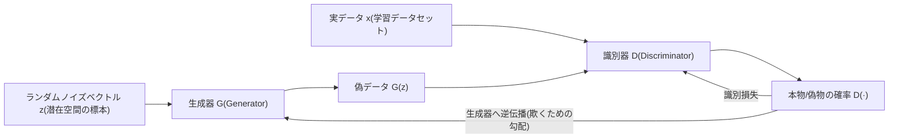
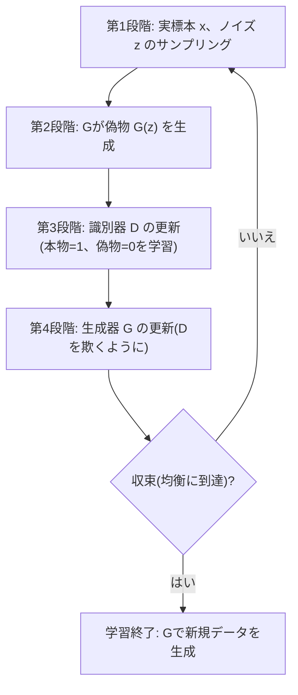

# 敵対的生成ネットワーク(GAN, Generative Adversarial Network)

## 1. 概要

> **敵対的生成ネットワーク(GAN)**とは、新しいデータを作り出す**生成器(Generator)**と、そのデータが本物か偽物かを判別する**識別器(Discriminator)**という二つのニューラルネットワークを互いに競わせながら同時に学習させ、実データの分布を近似し、そこから写実的な標本を生成する深層学習ベースの生成モデル(Generative Model)である。

生成(Generative)モデルの根本的な目標は、学習データが従う確率分布 p_data(x) を明らかにし、その分布からこれまで見たことのない新しい標本を抽出することである。伝統的にこの問題は、データの尤度(likelihood)を明示的にモデル化する方式(例:ボルツマンマシン、変分オートエンコーダVAE)でアプローチされてきたが、高次元の画像のように分布が複雑な場合、尤度を直接計算したり最適化したりすることは非常に困難であった。VAEは学習が安定している一方で、生成結果がぼやける(blurry)という限界があった。

2014年にイアン・グッドフェロー(Ian Goodfellow)が提案したGANは、「尤度を直接計算するのではなく、**判別が難しい偽物を作るゲーム**に問題を置き換えよう」という発想の転換によってこのジレンマを突破した。偽札犯(生成器)と警察(識別器)の比喩が広く用いられる。偽札犯はより精巧な偽札を作ろうとし、警察はより正確に見破ろうとするが、この競争が繰り返されると偽札は本物と区別できないほど精巧になる。GANはこの敵対的競争をニューラルネットワークの損失関数として定式化したものである。

GANが爆発的に普及した背景には、いくつかの時代的条件がかみ合っていた。深層学習の畳み込みニューラルネットワークが画像認識において成熟して識別器の性能を支え、GPUの並列演算によって大規模ニューラルネットワークの学習が現実のものとなり、大量の画像データセットが蓄積されていた。こうした土台の上で、GANは2015年のDCGAN、2017年のCycleGAN・Pix2Pix、2018年のStyleGANへと続き、わずか数年で写実性の面で急速に発展した。この急速な発展速度そのものが、生成AIが社会に及ぼす波及を予告する兆候であったという点で、GANの登場背景は技術史的にも大きな意味を持つ。

GANが情報管理技術士の観点で重要である理由は、それが**生成AIの系譜における一つの転換点**だったためである。2014年以降、GANは写実的な画像生成の事実上の標準として定着し、今日のテキストから画像への生成の主流が拡散モデルへ移った後も、画像の超解像・画質改善・データ拡張・異常検知などの実務領域で依然として活用されている。同時にディープフェイク(Deepfake)という悪用事例を生み、AIの信頼性・セキュリティ・倫理問題の出発点となったため、技術原理と社会的含意を併せて理解すべきテーマである。

GANの中核的特徴を要約すると次のとおりである。第一に、**尤度を明示的に計算しない暗黙的(implicit)生成モデル**である点である。データが従う確率密度を直接数式化せず、その分布から標本を抽出する能力のみを学習する。第二に、**二つのニューラルネットワークの競争がそのまま学習シグナルとなる**点である。別途の正解なしに、相手のネットワークの判定だけで互いを改善する自己教師あり(self-supervised)的な性格を持つ。第三に、**潜在空間の連続性**である。入力ノイズベクトルを少しずつ変えると生成結果が自然に変形し、データの意味軸をベクトル演算で扱うことができる。この三つの特徴が、GANを強力でありながら扱いの難しい技術にしている。

## 2. GANの全体構造と敵対的学習の原理

GANは、二つのニューラルネットワークが一つの目的関数をめぐって**ミニマックス(minimax)ゲーム**を行う構造である。生成器Gは、正規分布などから抽出した低次元のノイズベクトルzを入力として受け取り、実データに類似した標本G(z)を出力する。zが存在する空間を**潜在空間(latent space)**と呼び、この空間での連続的な移動が生成結果の意味のある変化(例:顔の角度・表情の変化)につながる点がGANの興味深い性質である。識別器Dは、入力が実データかGが作った偽物かを0〜1の確率で判定する。

ここで識別器を単なる「鑑定器」ではなく**学習される損失関数(learned loss)**として理解すると、GANの本質がより明確になる。従来の生成モデルは、ピクセル単位の誤差(例:平均二乗誤差)のような人が定めた固定の損失を最小化するが、こうした損失は画像の知覚的な写実性をうまく捉えられず、結果がぼやけてしまう。一方GANは、「何が本物らしく見えるか」を識別器がデータから自ら学習し、生成器にフィードバックする。すなわち損失の基準そのものが学習を通じて洗練されるため、人が事前に規定しにくい「写実性」をデータ駆動で学習できる点がGANの根本的な強みである。

学習の核心は、二つのニューラルネットワークの目標が正反対であることにある。識別器Dは本物に1、偽物に0を与えるように(すなわちうまく区別するように)学習し、生成器GはDが自身の出力を1(本物)と判定するように(すなわちうまく欺くように)学習する。数式上は、Dが目的関数V(D,G)を最大化し、Gが最小化する形であり、理論的には二つのネットワークが均衡に達すると、生成器の分布が実データの分布と一致し、識別器はどちらも区別できずにすべての入力に0.5を出力する**ナッシュ均衡(Nash equilibrium)**に至る。

潜在空間の性質は、GANの実用性をさらに広げる。学習を終えた生成器でノイズベクトルzを少しずつ移動させると、生成結果は急激に飛ぶことなく滑らかに変形し(例:正面の顔が徐々に横顔へ)、特定の属性(眼鏡の着用、年齢、表情)に対応する方向ベクトルを見つけて加減することで生成物を編集できる。これは潜在空間がデータの意味構造を連続的・線形的に保持していることを意味し、画像編集・属性制御・補間(interpolation)といった応用の理論的基盤となる。StyleGANが細やかな属性制御を実現できたのも、この潜在空間をスタイル軸として再構成したためである。

このゲームの目的関数V(D,G)は、「実標本に対するDの対数確率」と「偽標本に対する対数(1−D)」の期待値の和として定義される。Dはこの値を大きくしようとし、Gは小さくしようとするため、学習は単純な最小化ではなく**鞍点(saddle point)を探す最適化**となる。一般的な損失最小化が谷底を探す問題であるとすれば、ミニマックスゲームはある方向では最大値、別の方向では最小値となる点を探さなければならないため、収束の保証が弱く振動しやすい。GAN学習の根本的な難しさは、まさにこのゲーム理論的な構造に由来する。

実際の実装では、二つのネットワークを交互に学習させる。まずGを固定した状態で実標本と偽標本を用いてDを数ステップ更新し、次にDを固定した状態でGを更新する。初期の論文では、Gの損失が学習初期に勾配消失を起こす問題があったため、「偽物を本物と誤認させる確率の対数を最大化」する**非飽和損失(non-saturating loss)**に置き換えて学習初期のシグナルを強化するという実務的な補正を適用する。このようにGANは理論は優雅であるが学習過程が繊細であり、二つのネットワークの学習速度のバランスを取ることが成否を左右する。

## 3. 学習手順と代表的な派生アーキテクチャ

上図はGANの反復学習手順である。各反復で識別器と生成器を交互に更新し、識別器を生成器よりやや頻繁に、あるいは強く学習させて「簡単には騙されない」識別器を維持することが安定性のコツである。ただし識別器が強くなりすぎると、生成器に伝わる勾配が消えて学習が止まるため、二つのネットワークの**能力の均衡**を慎重に調整しなければならない。

一つ留意すべき点は、この学習手順には教師あり学習のような明確な終了時点や検証精度の曲線がないということである。損失値は二つのネットワークの力比べの結果であるため、低ければ良いわけでも、特定の値に収束すれば学習が終わったわけでもない。したがって実務では、損失曲線の代わりに**生成標本を定期的に目視で確認したり、FIDのような定量指標を併用したり**しながら学習を管理する。この点が、「いつ学習を止めるか」の判断すら難しいというGAN特有の運用上の難しさを生む。

ここで、学習の均衡の調整がなぜ難しいのかを具体的に確認しておく必要がある。識別器の学習速度が生成器より速すぎると、偽物を完全に見抜いてしまい、生成器に「何を改善すべきか」という情報を含んだ勾配が消える。逆に生成器が先行すると、識別器が騙されて無意味なシグナルしか与えなくなる。そのため実務では、識別器の更新回数、学習率、バッチ構成などを反復実験で調整しており、このチューニングの負担がGANを「扱いにくいモデル」にしている代表的な理由である。

GANは登場以降、目的とデータ特性に応じて多様な派生モデルへと発展した。各派生は初期GANの特定の弱点(学習の不安定性、条件制御の不可、低解像度など)を解決しようとする試みとして理解すると、系譜が明確になる。

| 派生モデル | 中核アイデア | 解決した問題 |
|------|------|------|
| DCGAN | 生成器・識別器を畳み込み(CNN)構造で再設計、バッチ正規化を導入 | 画像品質・学習安定性の向上 |
| cGAN(Conditional) | ラベルなどの条件情報を併せて入力 | 「望む種類」のデータ生成の制御 |
| Pix2Pix / CycleGAN | 画像間変換(ペアあり/ペアなし) | ドメイン変換(写真↔絵画、馬↔シマウマ) |
| WGAN / WGAN-GP | 損失をワッサースタイン距離に置換、勾配ペナルティ | モード崩壊・学習不安定性の緩和 |
| StyleGAN | スタイルベクトルを層ごとに注入、段階的な解像度拡大 | 超高解像度・細やかな属性制御 |

**DCGAN(Deep Convolutional GAN)**は、全結合の代わりに畳み込みニューラルネットワークを導入して画像生成の品質を大きく引き上げ、事実上の標準骨格となった。生成器には転置畳み込み(transposed convolution)で低解像度の特徴を徐々に拡大し、識別器にはストライド畳み込みを用い、両ネットワークにバッチ正規化(batch normalization)を適用して学習を安定化した。DCGANは、ノイズベクトルzに対する算術演算(例:「笑顔」ベクトルから「無表情」ベクトルを引き、「男性」ベクトルを加える)が意味のある結果につながることを示し、潜在空間がデータの意味を構造的に保持していることを実証した点でも意義が大きい。

**条件付きGAN(cGAN)**は、ノイズだけでなく、クラスラベル・テキスト・別の画像といった条件yを生成器と識別器の双方に入力し、無作為な生成から脱して「猫の画像」あるいは「このスケッチを写真に」といった目的指向の生成を可能にした。識別器も「この画像は本物か」だけでなく「与えられた条件に合致しているか」まで併せて判定するように学習されるため、単にもっともらしい画像ではなく、条件に合った画像を生成するよう誘導される。この条件付き構造は、その後のテキストから画像への生成や画像編集など、実用的な応用の出発点となった。

**Pix2PixとCycleGAN**は、画像間変換に特化した系列である。Pix2Pixは入力と出力がペアになった(paired)データ(例:スケッチと実写のペア)で学習するが、現実にはそうしたペアの入手が難しい場合が多い。CycleGANは、ペアになった学習データなしでも二つのドメイン間を行き来する変換(例:夏の風景↔冬の風景、馬↔シマウマ)を**サイクル一貫性(cycle consistency)**損失で学習する。A→Bに変換した後、再びB→Aに戻したときに元と同じでなければならないという制約を課すことで、ペアがなくても意味を保持する変換を学習させたことが中核的なアイデアである。

**StyleGAN**(2018〜)は、ノイズを直接画像に変換する代わりに、まずマッピングネットワークで潜在ベクトルをスタイル空間へ変換し、それを生成器の各層に注入(AdaIN)する構造を導入した。これにより、全体の構図・顔の形といった粗い属性と、髪の毛・しわといった微細な属性を層ごとに分離して制御できるようになり、人の目では本物とほとんど区別できない超高解像度の顔を生成して話題となった。同時にこの写実性はディープフェイクへの懸念を引き起こした代表例でもあり、技術の発展と社会的リスクが同時に大きくなるというGANの両面性を象徴している。

## 4. GANの性能評価指標

生成モデルは、正解ラベルと予測を比較する教師あり学習とは異なり、「どれだけうまく生成したか」を定量化することが難しい。良い生成とは、個々の標本が写実的であるだけでなく(品質・fidelity)、学習データの多様な様相を偏りなく反映していなければならず(多様性・diversity)、この二つの軸は互いに相反することもある。例えばモード崩壊に陥ったモデルは、品質は高く見えても多様性が極度に低い。したがって評価指標は、この二つを併せて捉えられなければならない。人の主観的評価はコストが大きく再現性が低いため、GAN研究では二つの自動指標が広く用いられている。第一は**インセプションスコア(Inception Score, IS)**であり、事前学習された分類器(Inception)に生成画像を入力した際に、個々の画像のクラス予測が明確で(品質)、生成物全体のクラス分布が均等である(多様性)という二つの条件を一つの値に統合する。値が大きいほど良いが、実データの分布と直接比較しないこと、分類器が学習したクラス体系に依存することが限界である。また学習データをそのまま記憶して再現しても高いスコアが出る可能性があり、多様性の喪失を常に捉えられるわけではない。

第二の、そして今日標準として用いられる指標が**フレシェ・インセプション距離(Fréchet Inception Distance, FID)**である。FIDは実画像と生成画像のそれぞれを特徴空間に写像した後、二つの分布の平均と共分散の差をフレシェ距離で測定する。値が**小さいほど**生成分布が実分布に近いことを意味し、人の知覚的判断との相関が高いため、モデル比較の事実上の基準となった。ただしFIDは使用した特徴抽出器と標本数に敏感であるため、異なる論文・設定間の数値を絶対比較するよりも、同一条件下での相対比較として解釈するのが正確である。このように評価指標の限界を知ることが、GANの結果を正しく解釈する前提となる。

実務においてこれらの指標は、**学習の早期終了とモデル選択の判断根拠**として用いられる。GANは損失値そのものが学習の進捗をよく反映しないため(損失が低くても品質が悪い場合がある)、一定周期ごとにFIDを測定し、値がそれ以上改善しなければ学習を止めてその時点の重みを採用する、というように運用する。ただしFID・ISはいずれも画像ドメインに最適化された指標であるため、音声・時系列・表形式データをGANで生成する場合には、そのドメインに合った別の評価(例:下流タスクの性能、統計的類似度)を設計しなければならない。すなわち「何を良い生成とみなすか」の定義そのものがタスクごとに異なることを認識する必要がある。

## 5. GAN vs 拡散モデル — 比較と実務適用

GANと拡散モデル(Diffusion Model)は今日の画像生成の二大系列であるが、生成方式と強み・弱みは明確に異なる。単なる項目の羅列ではなく、**違いが生じる原理**を押さえなければならない。GANはノイズから画像を**1回の順伝播で**生成するため推論が非常に速いが、生成器と識別器の敵対的な均衡に依存するため学習が不安定であり、生成標本が特定のパターンにのみ偏る**モード崩壊(mode collapse)**に弱い。一方、拡散モデルはノイズを数十〜数千段階にわたって徐々に取り除くため、学習が安定しており多様性・品質に優れるが、反復推論のために生成速度が遅い。

この違いの根源は、学習目標の性格にある。GANは識別器を欺くことだけが目標であるため、学習データの分布全体を均等にカバーする誘因が弱く、そのため「欺きやすいいくつか」に集中するモード崩壊が構造的に発生する。拡散モデルは各段階で実際に加えられたノイズを当てるという明確な回帰問題を解くため、学習シグナルが安定しており、分布全体を学習しようとする圧力が自然に働く。このように「何を学習シグナルとするか」の違いが、多様性・安定性・速度の全方位的な違いへと帰結するのである。

| 区分 | GAN | 拡散モデル |
|------|------|------|
| 生成方式 | 1回の順伝播(単一ステップ) | 多段階の反復ノイズ除去 |
| 推論速度 | 非常に速い | 相対的に遅い(ステップ数に比例) |
| 学習安定性 | 不安定(均衡崩壊・モード崩壊) | 安定的 |
| 標本の多様性 | 限定的(モード崩壊のリスク) | 優秀 |
| 代表的な活用 | リアルタイム生成、超解像、データ拡張 | テキストから画像への大規模生成 |

この違いは実務での選択へとつながる。**医療・製造分野のデータ拡張**では、正常データと不良データが極端に不均衡な場合が多く、GANで不足しているクラスの合成データを作成して分類モデルの学習を補強する。例えば製造の欠陥検査において、実際の不良サンプルが全体の1%未満である場合に、GANの合成画像を加えて少数クラスの再現率を改善するアプローチが報告されている。ただしこの際、合成データが実際の欠陥の物理的特性を正確に反映していなければ、かえってモデルを誤った方向に導く可能性があるため、ドメイン専門家による検収と実データとの混合比率の調整を並行しなければならない。

**異常検知(Anomaly Detection)**では、正常データのみでGANを学習させた後、再構成誤差の大きい入力を異常と判定する方式が、金融取引の不正検知や産業設備の予知保全に応用されている。正常パターンのみを学習した生成器は、初めて見る異常パターンをうまく再現できないため、再現失敗の大きさがそのまま異常スコアとなる。これは、異常事例のラベルを確保しにくい現実において、**正常データのみで検知器を構築**できるという実務上の利点をもたらす。

また、低解像度の映像を高解像度に復元する**超解像(SRGAN)**は、CCTV・医療画像の画質改善に活用されており、リアルタイム性が重要なこの領域では、単一ステップで高速に生成するGANの強みが際立つ。

**個人情報保護のための合成データ(synthetic data)生成**も注目すべき活用先である。実際の顧客・患者データをそのまま共有すると個人情報侵害のリスクが大きいが、GANで統計的特性は維持しつつ特定の個人と結びつかない合成データを作れば、分析・学習・共有が相対的に安全になる。ただしこの場合でも、生成モデルが学習データをそのまま記憶して再現(memorization)し、元データを漏えいさせるリスクがあるため、合成データの再識別可能性の検証とプライバシー保証(例:差分プライバシーとの組み合わせ)を必ず並行しなければならない。まとめると、大規模・多様性重視の創作型生成は拡散モデルが、速度・特化ドメイン・データ補強重視の実務的生成はGANが優位に立つという相互補完的な構図として理解するのが妥当である。

## 6. 深掘り — 学習失敗の類型と最新動向

GANを実務に適用する際の最大の難関は学習の不安定性であり、代表的な失敗類型を理解することがそのまま対応戦略となる。**モード崩壊**は、生成器が識別器を欺けるいくつかの標本だけを繰り返し生成して多様性を失う現象であり、学習データに10種類の数字があっても生成器が「1」ばかり作り続けるといった形である。これを緩和するために損失関数そのものを変えた**WGAN(Wasserstein GAN)**が提案された。従来の分布間距離(JSダイバージェンス)が二つの分布が重ならない場合に勾配を与えられないという問題を**ワッサースタイン距離**で置き換え、さらに勾配ペナルティ(WGAN-GP)を加えて学習を安定化した。

ワッサースタイン距離がなぜ有効かは直感的に理解できる。JSダイバージェンスは二つの分布がまったく重ならない場合に距離を一定の定数として返し、「どれだけ離れているか」の情報を失うため、その結果、生成器は改善の方向がわからなくなる。一方ワッサースタイン距離は、一方の分布を他方の分布へ移すのに要する最小コスト(earth-mover)を測るため、二つの分布が重ならなくても距離が連続的に変化し、学習シグナルを安定的に提供する。このようにGANの改良史は「より良い距離尺度を探す旅」としても読むことができ、これは生成モデル研究において目的関数の設計がアーキテクチャと同じくらい重要であることを示す事例である。

もう一つの失敗は**勾配消失**と**振動(oscillation)**である。識別器が完璧になりすぎると、生成器に流れる学習シグナルが0に収束して進展が止まり、逆に二つのネットワークが均衡を見出せないと、損失が収束せずに揺れ続ける。実務では、学習率の調整、スペクトル正規化(spectral normalization)、識別器・生成器の更新比率の調整、ラベルスムージングといった多様な安定化手法を組み合わせる。GANの学習の成否は、理論よりもこうした**エンジニアリングのノウハウ**に大きく左右される点が特徴である。

これらの安定化手法は、それぞれ異なる失敗原因を狙っている。スペクトル正規化は識別器の重みの大きさを制限して識別器が過度に強くなることを抑え、勾配ペナルティは識別器出力の勾配を一定範囲に保って学習を滑らかにする。ラベルスムージングは「本物=1」の代わりに「本物=0.9」のように正解を緩和し、識別器が過度に確信しないようにする。実務者はデータ特性と症状(モード崩壊か振動か)に応じてこれらの手法を選択・組み合わせるため、GAN導入時には十分な実験の反復と視覚的な品質モニタリング体制を併せて計画しなければならない。

最新動向としては、大規模なテキストから画像への生成の主流が拡散モデルへ移ったことでGANの地位は相対的に低下したが、最近の研究は**GANの高速な推論速度と拡散モデルの品質を組み合わせる**方向へ進んでいる。拡散モデルを少数ステップ(さらには1ステップ)に蒸留(distillation)する際に敵対的損失を活用するアプローチが代表的である。これは、GANが独立した技術としてよりも、**生成パイプラインの構成要素**として再評価されていることを示している。ただしこうした最新手法の詳細な性能数値は研究ごとにばらつきがあるため、断定するよりも「速度と品質のトレードオフを緩和しようとする流れ」として理解するのが正確である。

応用領域の拡大も注目に値する。初期のGANが顔・風景などの静止画像に集中していたとすれば、その後は低解像度を高解像度に引き上げる超解像、白黒写真のカラー化、損傷画像の修復(inpainting)、3D形状の生成、音声合成・変換などへと広がった。特に医療画像で撮影モダリティを変換する研究(例:MRI↔CTのスタイル変換)や希少疾患データを拡張する研究、新薬開発で有効な候補分子構造を生成する試みなど、**専門ドメインに特化した生成**が活発である。これは、GANが汎用的な創作よりも、特定産業のデータ不足問題を解決するツールとして実用的な価値を保っていることを示している。

もう一つ注目すべき流れは、**検知・防御技術の共進化**である。GANベースのディープフェイクが精巧になるほど、それを検知するモデルも共に発展するが、興味深いことに検知器自体が識別器に似た役割を果たし、生成と検知が再び敵対的な競争構図を形成する。そのため検知技術だけでは根本的な解決が難しく、生成段階でコンテンツの出所・真正性を証明する電子透かしや署名標準(C2PAなど)を組み合わせた**多層防御**が必要であるという認識が広がっている。技術士の答案では、GANを単なる生成アルゴリズムではなく、生成・評価・検知・ガバナンスがかみ合ったエコシステムの中の技術として俯瞰する観点が求められる。

まとめると、GANは2014年以降の生成AIの急成長を牽引した中核技術であり、今日では拡散モデルと役割を分担しながら、特化ドメイン・リアルタイム生成・データ拡張において実用的な地位を保っている技術である。大規模な創作生成の主導権は拡散モデルに移ったが、「敵対的競争によって写実性を学習する」というGANのアイデアは、蒸留・超解像・異常検知など様々な形で継承されている。したがってGANは過去の技術ではなく、生成AIの設計において依然として有効な選択肢であり、思考の枠組みであると理解するのが妥当である。

## 7. 考慮事項および示唆

技術士の観点において、GANは技術的可能性と社会的リスクを併せて考慮すべき代表的なデュアルユース(dual-use)技術である。

生成AIが産業全般に普及するにつれ、GANは単なるアルゴリズムの選択を超えて、データ戦略・セキュリティ・規制・倫理が交差する地点に置かれるようになった。技術士の答案では、技術原理に加えて次のような多次元的な考慮が必要である。

- **適用戦略(問題との整合性を優先):** GANは万能ではなく、強みがはっきりしたツールである。リアルタイム生成・超解像・データ拡張のように速度が重要で多様性の要求が限定的な問題には適しているが、幅広い多様性と安定した学習が必要な大規模生成には拡散モデルが有利である。導入前に**要求品質・速度・データ規模**を基準として、まずモデル系列を選択しなければならない。
- **トレードオフ(品質 vs 安定性 vs コスト):** 学習安定性を得るためにWGAN系を使えば学習時間が延び、超高解像度のStyleGANは莫大な計算リソースを要求する。データ拡張に活用する際には、合成データが実分布を歪めてかえってモデル性能を低下させるリスクがあるため、合成データと実データの比率および品質検証手順を必ず並行しなければならない。
- **信頼性・セキュリティ上の脅威(ディープフェイク対応):** GAN・StyleGANが作り出す超写実的な合成メディアは、ディープフェイク・偽情報・なりすまし・音声偽造など深刻な社会的脅威を生む。これへの対応として、生成物への電子透かし、コンテンツ出所の標準(C2PAなど)、検知モデル、そしてAI生成物の表示義務を盛り込んだ規制(例:EU AI Act)の議論が進んでおり、技術導入時には**検知・表示・ガバナンス体制**を併せて設計しなければならない。
- **個人情報・倫理(学習データの正当性):** 顔・音声の生成モデルは実在人物のデータを学習に用いるため、肖像権・著作権・プライバシー侵害のおそれがある。学習データの適法な収集根拠、再現・漏えいリスク(memorization)の点検、生成目的の正当性の検討が求められる。
- **責任・ガバナンス(活用原則の策定):** 合成メディアの生成・配布に関する組織レベルの利用ポリシー、生成物の表示・記録手順、悪用時の責任の所在を事前に定義しなければならない。特に対外サービスにGANの生成物を活用する際には、利用規約・告知義務と関連法規(個人情報保護法、AI関連規制)の遵守状況を検討するガバナンス体制が必要である。
- **評価・運用の観点:** GANは損失値だけで品質を判断できず、明確な学習終了時点もないため、FIDのような定量指標と視覚的検収を併用するモニタリング体制、そして十分な実験の反復を前提として導入計画を立てなければならない。ドメインが画像でなければ評価指標そのものを再設計する必要がある点も併せて考慮する。
- **リソース・コストの観点:** StyleGANなどの高品質モデルの学習には相当なGPUリソースと学習時間を要し、ハイパーパラメータのチューニングの反復まで考慮すると総保有コスト(TCO)は大きくなる。事前学習モデルのファインチューニング・転移学習によってリソースを節減したり、クラウドGPUの弾力的な活用でコストを最適化したりする戦略を併せて検討しなければならない。
- **関連技術の観点:** GANは拡散モデル・VAEとともに生成AIの系譜を形成しており、近年は拡散モデルの蒸留・超解像・データ拡張などにおいて**補完的な構成要素**として再活用されている。単一の技術として孤立させて見るよりも、生成・検知・ガバナンスを包含するパイプライン全体の中で位置づけを把握することが望ましい。

## 参考資料

- Ian Goodfellow et al., "Generative Adversarial Networks", 2014 — https://arxiv.org/abs/1406.2661
- Google Developers, "Generative Adversarial Networks (GAN) Overview" — https://developers.google.com/machine-learning/gan
- NVIDIA, "StyleGAN(A Style-Based Generator Architecture for GANs)" — https://arxiv.org/abs/1812.04948
- Wikipedia, "Generative adversarial network" — https://en.wikipedia.org/wiki/Generative_adversarial_network

---

> **一言まとめ**: GANは、データを作る生成器と真偽を見分ける識別器を敵対的に競わせて実分布を近似する生成モデルであり、高速な推論とデータ拡張・超解像に強みを持つ一方、モード崩壊・学習の不安定性とディープフェイクへの悪用という課題を抱えながら、拡散モデルと相互補完的に発展している。
