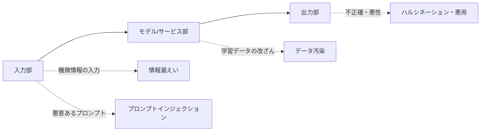

# 生成AIセキュリティガイドライン

## 1. 概要

### A. 生成AIの概念
> **生成AI(Generative AI)**とは、LLM・拡散モデル(Diffusion)などによって学習データのパターンを習得し、**テキスト・画像・音声・コードなどの新しいコンテンツを自ら生成**するAIである。韓国の国家サイバー安保センターは、こうしたサービスの安全な活用のために関連するセキュリティガイドラインを発行した。

生成AIは業務の生産性を飛躍的に高めるが、既存のITシステムとは**脅威の性質が異なる**。ユーザーが自然言語で入力した内容がそのままモデルの学習・ログに流れ込む可能性があり、モデルが生成する出力の正確性を保証できないためである。すなわち入力・モデル・出力の全区間にわたって新たな攻撃対象領域が生じるため、既存のセキュリティ統制だけでは不十分であり、生成AI特有の脅威に合わせたガイドラインが必要である。

### B. 活用サービスの事例
ガイドラインが必要な理由は、生成AIがすでに広く業務で使われているためである。文書要約・翻訳のような生産性業務、コード生成・レビューのような開発業務、チャットボット相談のような顧客接点、マーケティングの創作にまで広がるにつれ、その分だけ機密情報がAIに露出する接点も増えた。

| 分野 | 事例 |
|---|---|
| **業務生産性** | 文書の要約・作成、翻訳、議事録の整理 |
| **開発** | コード生成・レビュー、テスト自動化 |
| **顧客接点** | チャットボット相談、FAQ自動応答 |
| **創作** | 画像・デザイン・マーケティングコピーの生成 |

## 2. セキュリティ脅威の種類別の原因と発生する脅威

生成AIの脅威は、**入力・モデル・出力の三つの地点**で発生するという観点で整理すると理解しやすい。**入力部**では、ユーザーが機密・個人情報をプロンプトに入れると、その内容が学習・ログに保存されて再現・漏えいする可能性があり(情報漏えい)、信頼されていない入力がシステム指示を上書きして意図した統制を迂回する**プロンプトインジェクション**が起こる。**モデル部**では、学習・RAGデータが改ざんされると偏り・バックドアが仕込まれる**データ汚染**が、**出力部**では、統計的生成の本質的限界である**ハルシネーション**と、生成能力を悪用したマルウェア・ディープフェイクの生成が問題となる。

| 脅威 | 主な原因 | 発生し得るセキュリティ脅威 |
|---|---|---|
| **情報漏えい** | 機密・個人情報をプロンプトに入力 → 学習・ログに保存 | 営業秘密・個人情報の露出、再現による漏えい |
| **プロンプトインジェクション** | 信頼されていない入力がシステム指示を上書き | 指示の迂回、権限奪取、データ漏えい |
| **データ汚染(Poisoning)** | 学習・RAGデータの改ざん | 偏り・バックドア、誤答の誘導 |
| **ハルシネーション(Hallucination)** | 統計的生成の事実性の限界 | 誤情報の業務反映、意思決定の誤り |
| **悪用(Misuse)** | 生成能力の誤用 | マルウェア・フィッシング・ディープフェイクの生成 |
| **モデル窃取・逆推論** | APIの露出・問い合わせの反復 | モデルの複製、学習データの推論 |

例えば2023年、ある企業で開発者がソースコードをチャットボットに貼り付けてレビューを依頼した結果、**機密コードが外部モデルに流入**した事故が知られるようになり、入力部での情報漏えいが最も現実的な脅威であることが浮き彫りになった。

## 3. 開発・活用時のセキュリティ考慮事項と対応策

対応もまた、**入力・モデル・出力・ガバナンスの階層別統制**として組み立てることが核心である。入力部では、機微情報がそもそも流入しないようにフィルタリング・マスキングと**DLP(データ漏えい防止)**を適用し、入力禁止ポリシーを設ける。モデル部では、システムプロンプトとユーザー入力を分離してインジェクションを遮断し、RAGデータの完全性を検証する。出力部では、結果をフィルタリング・検収して根拠を併せて提示し、生成物に電子透かしを入れて悪用を追跡する。こうした技術的統制のすべてを、組織レベルの利用ポリシー・教育が包み込む。

| 区分 | セキュリティ考慮事項 | 対応策 |
|---|---|---|
| **入力** | 機微情報の流入遮断 | 入力のフィルタリング・マスキング、DLP、機微情報の入力禁止ポリシー |
| **モデル/サービス** | インジェクション・汚染の防止 | プロンプトの分離(システム/ユーザーの分離)、入力検証、アクセス制御・ロギング、RAGデータの検証 |
| **出力** | 有害・不正確な結果の統制 | 出力フィルタ・検収、根拠の提示、電子透かし、ハルシネーションの検証 |
| **ガバナンス** | 組織レベルの統制 | 利用ポリシー・承認手続き、役職員教育、プライベートモデル・ネットワーク分離、監査 |

## 4. 考慮事項および示唆
- **技術・ポリシー・人的統制の3軸の並行**: DLPやプロンプト分離のような技術的統制だけでは不十分である。利用ポリシーと役職員教育が伴ってこそ実質的な防御となる。情報漏えいの大半は悪意よりも不注意から生じるためである。
- **データ主権の確保**: 機微な業務は外部の商用APIではなく、**クローズド・オンプレミスのLLM**とRAGで構成し、データが組織の外に出ないようにする。
- **規制・ガバナンスとの連携**: EU AI Act、韓国のAI基本法などの規制と連携してリスクベースの管理体制を整え、AIの信頼性を確保する。
- **攻防の常態化**: 敵対的なプロンプト攻撃は進化し続けるため、レッドチームによる点検とモニタリングを常時運用し、防御を継続的に更新しなければならない。

---

> **一言まとめ**: 生成AIセキュリティは、*情報漏えい・プロンプトインジェクション・データ汚染・ハルシネーション・悪用*の脅威を、入力(DLP)・モデル(分離・検証)・出力(フィルタ・電子透かし)・ガバナンス(ポリシー・教育)の階層別に統制するものであり、技術・ポリシー・教育の3軸の並行とデータ主権の確保を核心とする。
