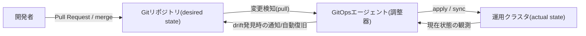
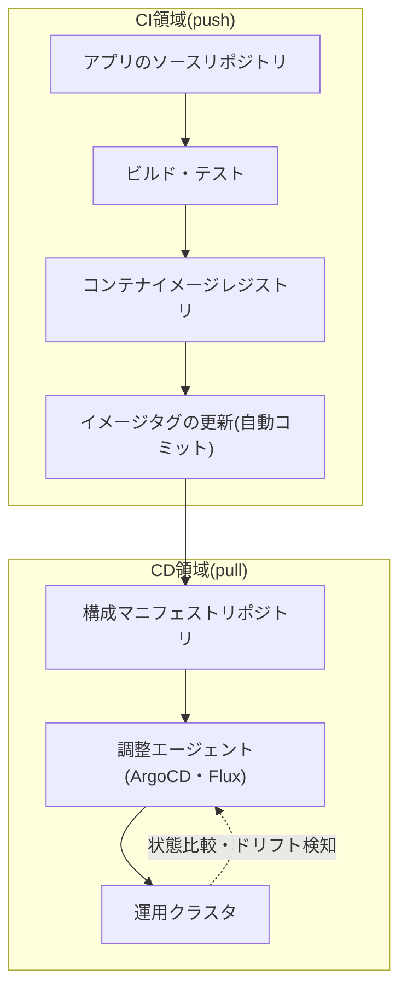

# GitOps(ギットオプス) — Gitベースの宣言的運用モデル

## 1. 概要

> **定義**: GitOpsとは、システムの**望ましい状態(desired state)をGitリポジトリに宣言的に記述**し、実際の運用環境がその宣言と一致するように**エージェントが継続的に調整(reconcile)**する運用モデルである。Gitがデプロイ・構成の唯一の信頼できる情報源(Single Source of Truth)であり、変更の関門としての役割を果たす。

従来のデプロイは、運用者がCIパイプラインやシェルから`kubectl apply`、`terraform apply`のような**コマンドを押し込む(push)手続き的な方式**であった。
この方式では「誰がいつ何をどの順序で実行したか」がパイプラインのログに散在して残り、運用者がコンソールで直接手を加えた瞬間に、リポジトリのコードと実際のクラスタ状態が食い違う**構成ドリフト(configuration drift)**が発生する。
クラスタが数十に増え、マイクロサービスが数百になると、「今、運用で実際に稼働しているのはどのバージョン・設定か」に誰も正確に答えられない状況に至る。

GitOpsはこの問題を**視点の転換**によって解決する。
デプロイを「コマンドを実行する行為」ではなく、「リポジトリに記述された目標状態と実際の状態の差を縮める収束プロセス」として再定義するのである。
運用者はクラスタに直接触れず、**Gitに対する変更(Pull Requestとmerge)のみ**を行い、クラスタ内で動作するエージェントがその変更を検知して自ら実際の状態を目標に合わせる。
その結果、Gitのコミット履歴がそのまま完全なデプロイ履歴であり監査証跡となり、ロールバック(rollback)は以前のコミットへの`git revert`に帰着する。

技術士の答案の観点では、GitOpsを単なる「CI/CDツールの一つ」ではなく、**IaC(Infrastructure as Code)の宣言性**と**バージョン管理・レビュー文化**、**制御理論の閉ループフィードバック(closed-loop control)**を結合した運用パラダイムとして記述しなければならない。

### 1.1 登場背景と必要性

第一に、**Kubernetesの宣言的API**がGitOpsの前提を整えた。
Kubernetesはすでに「望ましい状態を記述すれば、コントローラが現在の状態をそれに合わせる」という調整ループ(reconciliation loop)を内蔵している。
GitOpsはこの調整ループの**入力(望ましい状態)をGitに外部化**したものとみなすことができ、Kubernetesエコシステムにおいて自然に定着した。

第二に、**構成ドリフトと再現不能性**の問題である。
人がコンソールで緊急パッチを当てて記録を残さなければ、災害復旧やクラスタ再構築の際にその状態を再現できない。
GitOpsではすべての変更がGitを経由するため、リポジトリさえあればクラスタ全体を決定論的に再構成できる。

第三に、**セキュリティ・ガバナンスの要求**である。
運用クラスタに対する広範な書き込み権限をCIサーバや多数の開発者に付与するpush方式は、攻撃対象領域が広い。
GitOpsのpull方式は、クラスタ内部のエージェントがリポジトリを**引き込む(pull)**ため、外部でクラスタの認証情報を保持する必要がなく、最小権限の原則に合致する。

## 2. GitOpsの4大原則と調整ループ

Weaveworksが提示し、OpenGitOps(CNCF)コミュニティが整理したGitOpsの4大原則は、このモデルの本質を凝縮している。
単に原則を列挙するにとどまらず、各原則が先に述べたドリフト・再現・セキュリティの問題をどのように解消するかを結びつけて理解しなければならない。

上図の要点は、**エージェントがリポジトリを引き込む**という矢印の向きと、クラスタの状態を読み戻して目標と比較する**閉ループ**である。
この二つの特性が、push型CI/CDとGitOpsを分ける決定的な違いである。

第一に、**宣言的(Declarative)**であること。
システムの望ましい状態を「どう作れ」という手順ではなく、「何であるべきか」という結果として記述する。
YAMLマニフェスト、Helmチャート、Kustomizeオーバーレイが代表的であり、手続き的なスクリプトとは異なり、何度適用しても同じ結果になる**冪等性(idempotency)**を保証する。

第二に、**バージョン管理・不変(Versioned and Immutable)**であること。
望ましい状態はGitに保存されてすべての変更がコミットとして残り、各バージョンは不変のまま保存される。
したがって「いつ誰がなぜ変更したか」がコミットメッセージ・PRレビューに記録されて監査可能性が確保され、特定時点への復元はコミットのチェックアウトに帰着する。

第三に、**自動的に引き込まれる(Pulled Automatically)**こと。
エージェントがリポジトリを定期的にポーリングするかWebhookで検知し、変更を自ら取得する。
外部システムがクラスタに押し込むわけではないため、クラスタの認証情報が外部に漏れる必要がない。

第四に、**継続的に調整される(Continuously Reconciled)**こと。
エージェントは実際の状態を繰り返し観測して目標との差異を検知し、人がコンソールで手動変更してドリフトが生じても、それを検知して通知するか目標状態へ自動復旧する。
この自己修復(self-healing)特性が、ドリフトの問題を根本的に抑制する。

| 原則 | 解決する問題 | 実装手段 |
|------|--------------|-----------|
| 宣言的 | 手順の順序依存・非冪等性 | YAML・Helm・Kustomize |
| バージョン管理・不変 | 再現不能・監査の欠如 | Gitコミット・PRレビュー・署名 |
| 自動pull | 認証情報の露出・手動デプロイ | クラスタ内エージェント |
| 継続的調整 | 構成ドリフト・手動変更 | 調整ループ・自動復旧 |

## 3. アーキテクチャとデプロイ戦略

GitOpsアーキテクチャでは通常、**アプリケーションのソースリポジトリ**と**構成(マニフェスト)リポジトリ**を分離する。
ソースリポジトリのCIがコンテナイメージをビルド・テストしてレジストリに登録しタグを更新すると、そのイメージタグを構成リポジトリのマニフェストに反映(自動コミット)する。
すると、デプロイを担うエージェントが構成リポジトリの変更を検知してクラスタに反映する。
このように**CI(ビルド・検証)とCD(デプロイ・調整)をリポジトリの境界で分離**するのが、GitOpsの典型的な構造である。

代表的なツールとして**Argo CD**と**Flux**があり、いずれもCNCFの卒業(Graduated)プロジェクトである。
Argo CDはアプリケーションの状態を可視化するWeb UIとマルチクラスタ管理が強みであり、FluxはGitOps Toolkitベースの軽量・モジュール型コントローラとHelm・イメージの自動化が強みである。
いずれにせよ、中核となる動作原理(Gitを目標とし、クラスタを実状態として見て調整する)は同一である。

デプロイ戦略の面では、GitOpsは**プログレッシブデリバリー(progressive delivery)**と組み合わせてリスクを統制する。
カナリア(canary)・ブルーグリーン(blue-green)デプロイをマニフェストで宣言し、Argo RolloutsやFlaggerのようなコントローラが指標(エラー率・レイテンシ)を観察しながらトラフィックを段階的に移行する。
例えば、新バージョンにまずトラフィックの5%を流し、5分間エラー率が閾値を超えなければ25%→50%→100%へと拡大し、超えた場合は自動的に以前のコミットの状態へロールバックするといった形である。
このとき、ロールバックが「以前のイメージに戻す別の手順」ではなく**Gitのリバート(revert)**である点が、GitOpsの運用上の利点である。

## 4. Push型CI/CDとの比較

GitOpsを正確に理解するには、従来のpush型パイプラインとの違いを、**違いが生じる理由**まで押さえなければならない。
両方式は、デプロイの主体と方向、信頼境界が根本的に異なる。

| 区分 | 従来のPush CI/CD | GitOps(Pull) |
|------|-------------------|--------------|
| デプロイ主体 | 外部CIサーバがクラスタにapply | クラスタ内エージェントがpull・調整 |
| 信頼できる情報源 | パイプラインスクリプト・手動操作 | Gitリポジトリ(宣言的状態) |
| 認証情報 | CIがクラスタ書き込み権限を保有 | エージェントのみ内部権限、外部露出なし |
| ドリフトへの対応 | 検知・復旧の手段なし | 継続的調整により自動検知・復旧 |
| ロールバック | 別のパイプラインを再実行 | `git revert`で即時に復元 |
| 監査可能性 | ログが分散・不完全 | コミット履歴がそのまま完全なデプロイ履歴 |

違いの核心は、**信頼境界の位置**である。
push方式ではクラスタの認証情報がCIシステムに常駐するため、CIが侵害されると運用全体が危険にさらされる。
GitOpsは認証情報がクラスタ内部にのみ存在し、内側から外側へ引き込む形であるため、外部からクラスタを直接操作する経路そのものがなくなる。
またpush方式では、デプロイ後に人がコンソールを操作してもドリフトを防ぐ仕組みがないが、GitOpsでは調整ループが常時動作しているため、ドリフトはすぐに元の状態へ復旧される。
ただしGitOpsがあらゆる状況で優れているわけではなく、DBスキーマのマイグレーションのように順序と状態遷移が重要な**非冪等・命令型の作業**は、別の手順やマイグレーションツールで補完しなければならない。

## 5. 深掘り — 導入時の実務課題と最新動向

**第一に、シークレット管理の問題**である。
マニフェストをGitに平文で置くとパスワード・トークンが露出するため、Sealed Secrets(暗号化された形でコミットし、クラスタ内でのみ復号)、External Secrets Operator(Vault・クラウドのシークレットストアとの連携)、SOPSなどを併せて設計しなければならない。
「すべてをGitに」という原則と「シークレットはGitに置かない」というセキュリティ要求を調和させることが、実務上の中核的な難題である。

**第二に、ドリフトの可観測性**である。
自動復旧が常に望ましいわけではなく、障害対応中にエンジニアが意図的に行った一時的な変更までエージェントが元に戻してしまい、混乱を招くことがある。
したがって、自動同期(auto-sync)と手動承認、同期ウィンドウ(sync window)を状況に応じて設計しなければならない。

**第三に、マルチクラスタ・マルチテナントへの拡張**である。
数十のクラスタで共通構成と環境ごとの差分を同時に管理するには、Kustomizeオーバーレイ、Helm値の分離、App-of-Appsパターン、ApplicationSetなどによって構成の重複を減らす設計が必要である。

最新動向としては、**ポリシーベースのガバナンスとの結合**が顕著である。
OPA/Gatekeeper・Kyvernoのようなポリシーエンジンを調整パイプラインに組み込み、承認されていないイメージやセキュリティポリシーに違反するマニフェストをデプロイ前にブロックする。
また**ソフトウェアサプライチェーンセキュリティ**と連動し、コミット署名(Sigstore・cosign)とイメージ署名の検証をGitOpsのフローに統合して、「デプロイされるものが検証済みの成果物か」を保証しようとする流れが強まっている。
さらに、アプリケーションだけでなくクラスタ・クラウドインフラそのものをGitOpsで管理する**Crossplaneベースのコントロールプレーン**や、可観測性(Observability)と組み合わせて調整結果とドリフトをダッシュボードで追跡する方向へと成熟しつつある。

## 6. 考慮事項および示唆(技術士の観点)

- **適用戦略**: 最初から全面的な自動復旧を有効にするよりも、ドリフトの検知・通知(read-only)の段階から始め、組織がGitOpsのフローに慣れた後に自動同期へ拡大する**段階的な導入**が安全である。ソースと構成のリポジトリ分離、環境別のブランチ・ディレクトリ戦略を初期に確立しなければならない。
- **トレードオフ**: すべての変更がGit・PRを経由するため、緊急障害時に**速度が低下**する可能性がある。そのため、承認を緩和する緊急経路(break-glass)とその事後監査手順を併せて設計し、統制と迅速性のバランスを取らなければならない。
- **セキュリティ・ガバナンス**: クラスタ認証情報の外部化の排除、コミット・イメージ署名、ポリシーエンジンとの結合により、GitOpsはサプライチェーンセキュリティ(SBOM・DevSecOps)と自然に結びつく。Gitリポジトリ自体が最上位の攻撃標的となるため、リポジトリのアクセス制御・署名・保護ブランチが必須である。
- **組織・文化**: GitOpsはツールの導入ではなく、「運用をコードレビューで行う」という**協業文化の転換**である。開発・運用・セキュリティが同一のリポジトリで協業するため、DevOps・SRE・プラットフォームエンジニアリングと組み合わせることで効果が最大化される。
- **展望および連携**: Kubernetesを超えて、クラウドインフラ・エッジ・AIパイプラインにまで宣言的調整モデルが拡張される傾向にある。IaC・プラットフォームエンジニアリング・ポリシー型ガバナンスと組み合わさり、**自律運用(autonomous operations)**の基盤インフラとして定着するものと展望される。

---

> **一言まとめ**: GitOpsは、望ましい状態をGitに宣言的に保存し、クラスタ内のエージェントが実際の状態を継続的に調整(pull・self-healing)する運用モデルであり、ドリフトの抑制・完全な監査可能性・認証情報の最小露出・`git revert`によるロールバックを通じて、安全で再現可能なデプロイを実現する。
